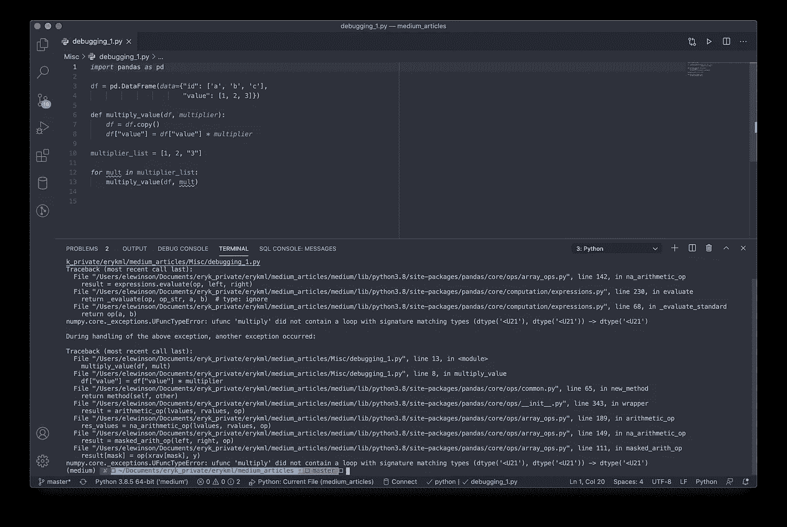
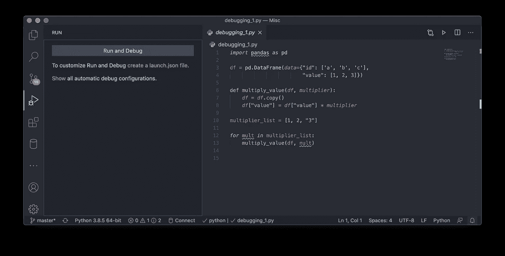
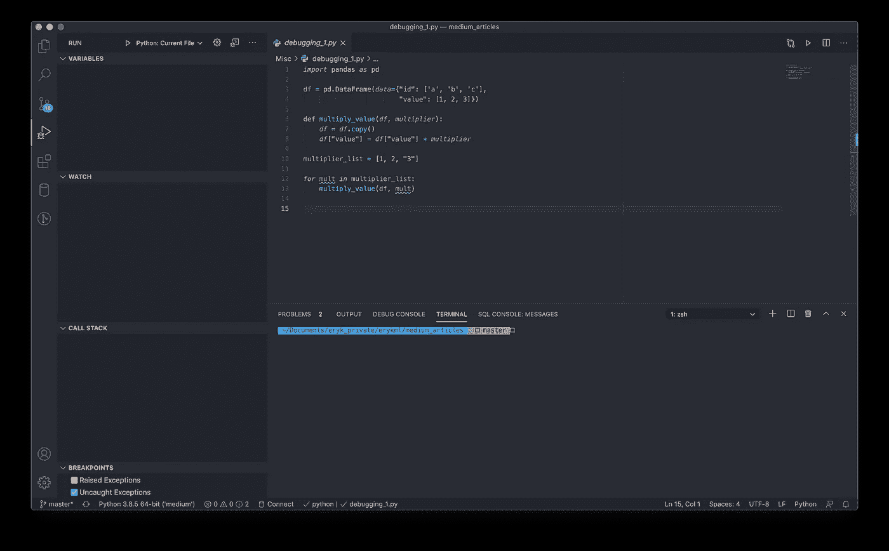
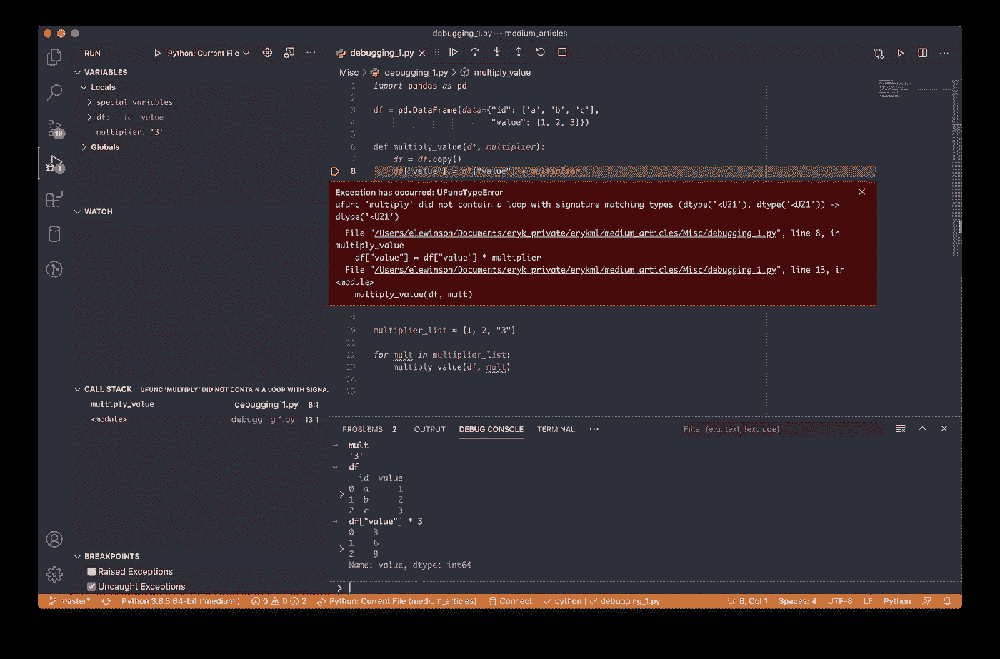
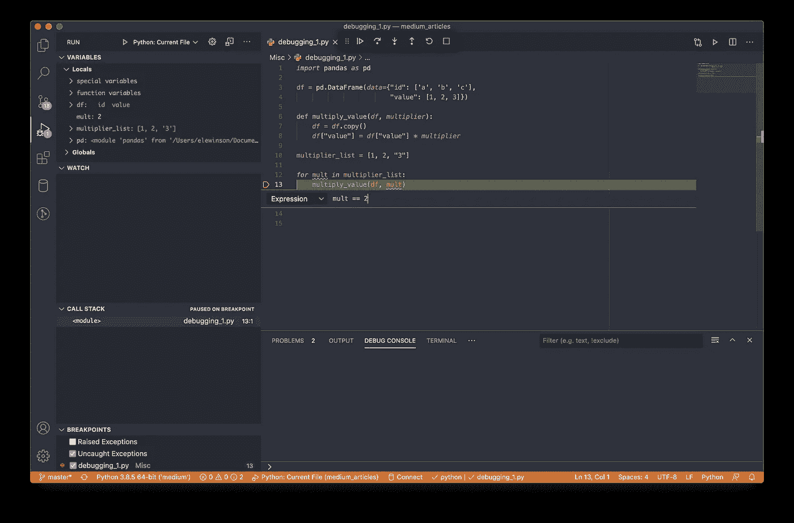

# 在 VS 代码中调试 Python 脚本的综合指南

> 原文：<https://towardsdatascience.com/a-comprehensive-guide-to-debugging-python-scripts-in-vs-code-b9f9f777d4b8?source=collection_archive---------9----------------------->


凯文·Ku 在 Unsplash[上的照片](https://unsplash.com/s/photos/code?utm_source=unsplash&utm_medium=referral&utm_content=creditCopyText)

## [入门](https://towardsdatascience.com/tagged/getting-started)

## 了解如何在 10 分钟内高效调试您的脚本！

最常见的是，我们尽最大努力写出好的、干净的代码，这正是我们想要它做的。嗯……至少这是我的想法，老实说，大多数情况下，代码在第一次尝试时并不工作(或者根本不工作)。这就是调试发挥作用的时候了。**调试**是从任何种类的代码中检测并移除 bug(错误或意外行为)的过程。这一过程绝不仅限于数据科学，它仅仅是从软件工程中借鉴过来的。

许多数据科学家(尤其是那些刚刚开始冒险的科学家)主要使用 Jupyter 笔记本。不要误解我的意思，笔记本是数据科学家的好工具。如果你不相信我，你可以看看杰瑞米·霍华德在这个视频中的观点。

回到主要思想，数据科学家在他们工作的所有阶段都会遇到错误，从 EDA 和摆弄数据或笔记本中的一些初始建模到实际将一些模型投入生产。虽然我们可以用一种创造性的方式生产笔记本(例如，一个 cronjob 每天早上运行一个笔记本)，但这绝对不是我们应该走的路，而且几乎违背了数据科学/软件工程工艺的所有最佳实践。相反，笔记本中的代码被重构并存储在一个或多个 Python 脚本中，然后被调度执行。整个“将某些东西投入生产”可以成为一系列文章或一本书的主题，所以我不会走这条路，至少现在不会。

那么，当我们在代码的某个地方有一个 bug 时，会发生什么呢？代码可能会返回一些东西(无论是我们想要的还是不要的)，或者可能根本不工作，并在执行过程中抛出一些错误。在笔记本中，我们可以将代码分割成更多的单元，并依次执行它们来检查每一步。我们还可以在代码中放入许多打印语句，只是为了看看是否一切都按预期进行。或者，我们可以使用一些神奇的命令，比如`%debug` 来打开 Jupyter Notebook 中的交互式调试器窗口。

最后一种方法与我们调试 Python 脚本的方式非常相似。在本文中，我将展示如何使用[和代码](https://code.visualstudio.com/)快速高效地调试 Python 脚本。最棒的是，您可以将这些方法应用于任何代码，无论是单个脚本还是整个库。

# 在 VS 代码中调试

## 基础知识

让我们开始调试吧。首先，我们需要写一些代码。您可以在下面看到的简单脚本将完成这项工作。当然，这是对您最有可能使用的脚本的极大简化，但对于演示来说已经足够好了。您还可以看到哪里出了问题，以及代码何时会直接抛出错误。

第一步只是打开 VS 代码，导航到我们想要设置项目的目录，创建一个新的脚本，并粘贴上面要点中的代码。您应该会看到类似这样的内容:


然后，我们可以在终端中运行脚本，方法是按下窗口右上角的绿色 play 按钮(或者右键单击编辑器窗格中的某个位置并选择“在终端中运行 Python 文件”)。我们可以在下面的截图中看到结果。很明显，有什么地方出错了(日志被覆盖了一点，所以有更多的回溯)。



我们可以试着从这里找出它，或者直接进入调试。为此，请按左边的“玩虫子”图标，您将看到以下屏幕。我们稍后将回到调试配置，但现在只需按“运行和调试”。



开始调试后，我们将看到下面的屏幕。



这里有相当多的东西是新的，所以我将通过指向屏幕的某些部分来提供一些清晰度:

**Variables Pane** —在这里我们可以很容易地检查运行脚本时创建的变量。我们可以看到所有变量及其当前值。因此，在运行我们的脚本的情况下，我们将看到数据帧`df`、`multiplier_list`、`mult`的当前值，等等。在这个窗格中，我们还将看到全局变量和局部变量之间的区别。后者将是在有限范围内可用的(例如，在函数中)。局部变量的一个例子是`multiplier`，因为它只在`multiply_value()`内部可用，在函数外部(全局)不可用。

**观察窗格**—我们可以使用这个窗格作为变量窗格的子集。可能我们的程序有几十或几百个变量，但我们只对其中的一部分感兴趣。然后，当我们将鼠标悬停在监视窗格上时，我们可以通过单击+图标将这些选定的变量添加到该窗格中。这样，我们可以很容易地监控他们的价值观。

**调用堆栈窗格** —当我们正在调试的代码有很多内部方法时，这个窗格特别有用。在调用堆栈窗格的帮助下，我们可以在[堆栈](https://en.wikipedia.org/wiki/Call_stack)内部导航，并精确地识别错误来自哪个堆栈。

**断点** —一般来说，**断点**是调试时一个非常重要的概念。当我们在没有指定任何断点的情况下运行脚本时，它将在导致错误的那一行停止(或者如果没有错误，则执行整个脚本)。然而，我们也可能希望早点停止程序，并检查变量在那个特定点的状态。为此，我们可以通过单击编辑器中行号的左侧来放置一个断点，创建的断点将由一个红点指示。当运行带有断点的脚本时，它将在每个断点处停止，并等待我们进一步的命令。在 VS 代码中也有一些不同种类的断点，但是我稍后会回到这个问题。

好吧，这已经很多了。尽管一开始看起来令人畏惧，但随着练习，一切都会变得清晰。现在，只需按绿色的 play 按钮开始调试(您可能需要在这里选择“Python: Current File”)。


我们可以看到，正如预期的那样，窗格中充满了信息。此外，错误会在屏幕上出现的地方弹出，并显示其类型和一些附加信息。这已经很有助于确定原因。让我们看看变量窗格，尤其是局部变量，因为错误发生在函数中。在这里，我们可以看到`multiplier`的值是`“3”`，它应该是一个数字，这样乘法才能工作。巨大的成功，尽管我们从一开始就知道。虽然在这种情况下非常简单，因为我们自己定义了列表，但是在更复杂的脚本中，很容易忘记每个变量存储了什么。尤其是当值是从某个地方(例如数据库)填充的时候。

在同一屏幕上，我们还可以看到一些新的东西，即**调试工具栏**。


它是主工具栏，当我们试图调试代码时，它允许我们沿着代码导航。图标代表以下操作:

*   继续/暂停—暂停或继续调试过程
*   单步执行—移到下一行代码
*   单步执行—在调试期间进入不同的方法内部
*   移出—移至父堆栈
*   重新启动—重新启动调试会话
*   停止—停止调试会话

最后要介绍的关键是**调试控制台**。在终端中，我们只能看到正在打印/记录的内容以及脚本中断时的错误消息，与之相反，在调试控制台中，我们可以交互工作并探索变量。每当调试器遇到断点或发生错误时，在调试控制台中，我们可以在该步骤执行命令，并使用变量的当前状态。在下图中，我们可以看到我们检查了变量`mult`的当前值，打印了变量`df`,并检查了我们是否可以将该列乘以 3。



当脚本中断，我们不完全确定发生了什么，以及我们提出的解决方案是否真的有效时，这个功能非常方便。例如，我们可以在调试控制台中运行以下命令:

```
df[“value”] * “3” 
```

并观察我们之前遇到的相同错误。但是如果我们跑:

```
df[“value”] * 3
```

不会有错误，我们会得到我们真正想要的东西。

这应该足够开始调试你自己的脚本了。然而，我认为在调试一些更复杂的情况时，有两个主题非常值得了解和帮助。

## 断点的类型

VS 代码提供了三种类型的断点，每种都有不同的用途。要选择它们，我们首先创建一个普通断点，然后右键单击它并选择“编辑断点…”。下面，我描述每种断点的特征:

*   **表达式** —当条件满足时，断点将触发并停止代码的执行。在下图中，我们将条件设置为`mult == 2`。在“变量”窗格中，我们确实可以看到，当条件满足时，代码停止执行。此外，*表达式断点*的特点是红点中有“=”。



*   **命中次数** —这种断点在被触发 X 次时停止代码的执行。例如，我们可以将这个断点放在 For 循环中，并将其值指定为 2。通过这样做，代码将在与上面的*表达式断点*完全相同的位置停止。
*   **日志消息** —与前两种类型的断点不同，这种断点不会停止代码的执行。它可以用于在调试控制台中将一些消息打印到日志中。我们已经指定消息为`Current mult: {mult}`，它确实被打印在控制台中。请注意，要从代码(变量)中计算的表达式需要放在花括号中。正如我们所看到的，在预期的错误发生之前，代码的执行没有被中断。


最后要知道的是，你可以通过右击断点并选择“禁用断点”来临时禁用断点。

## 调试配置文件

调试配置在调试会话期间驱动 VS 代码的行为。配置是在一个`launch.json`文件中定义的，该文件存储在我们工作区的`.vscode`文件夹中。要访问 JSON 文件，我们可以在第一次打开 VS 代码中的调试窗口时单击“create a launch.json file ”,或者只需单击用于启动调试会话的绿色 play 按钮旁边的“gear”图标。

使用配置文件我们能做什么？一个常用的例子是设置环境变量。假设我们的代码是使用一些调度程序来部署和运行的，例如，Airflow(它远不止这些，但是现在让我们假设这样的简化是可以接受的)。然后，我们使用一组 env 变量来控制脚本的行为。例如，在 ETL 脚本中，我们可以使用 env 变量来控制是否要缩放特性。

当我们试图在本地调试代码时，我们的系统中不会有这些 env 变量，因为它们是由 Airflow 处理的。因此，一种选择是在全局范围内添加这些，但这可能会导致以后的混乱。或者，我们可以使用`launch.json`配置文件为调试环境提供一组 env 变量。

为此，我们按“齿轮”图标打开文件，并通过添加第 10 行的内容来修改它。

当我们运行下一个调试会话时，我们可以直接访问`RUN_TYPE` env 变量，例如，通过运行以下两行:

```
*import* osprint(os.environ['RUN_TYPE'])## prod
```

# 结论

在本文中，我展示了如何快速使用 VS 代码调试 Python 脚本。使用本文中提到的一些技术，您可以快速缩小潜在错误的来源，并在交互式调试控制台中尝试不同的修复方法。

我确信，这项技能非常重要，如果你作为一名数据科学家还没有遇到过调试脚本，那么在你的职业生涯中你会很快遇到的。虽然本文是针对 VS 代码的，但是大多数 ide(例如 PyCharm)都提供了类似的功能。

一如既往，我们欢迎任何建设性的反馈。你可以在[推特](https://twitter.com/erykml1?source=post_page---------------------------)或评论中联系我。

如果您喜欢这篇文章，您可能还会对以下内容感兴趣:

[](/lazy-predict-fit-and-evaluate-all-the-models-from-scikit-learn-with-a-single-line-of-code-7fe510c7281) [## 懒惰预测:拟合和评估 scikit 中的所有模型——用一行代码学习

### 查看哪些模型最适合您的数据集的最简单方法！

towardsdatascience.com](/lazy-predict-fit-and-evaluate-all-the-models-from-scikit-learn-with-a-single-line-of-code-7fe510c7281) [](/my-experience-as-a-data-scientist-in-a-startup-13ae037780d0) [## 我在一家初创公司担任数据科学家的经历

### 在一家“较小”的公司担任数据科学家时，主要需要做些什么？

towardsdatascience.com](/my-experience-as-a-data-scientist-in-a-startup-13ae037780d0) [](/explaining-feature-importance-by-example-of-a-random-forest-d9166011959e) [## 以随机森林为例解释特征的重要性

### 了解 Python 中最流行的确定要素重要性的方法

towardsdatascience.com](/explaining-feature-importance-by-example-of-a-random-forest-d9166011959e)