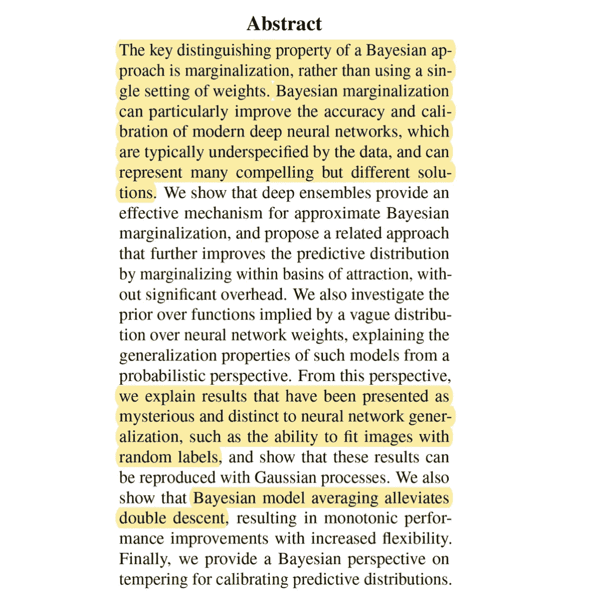
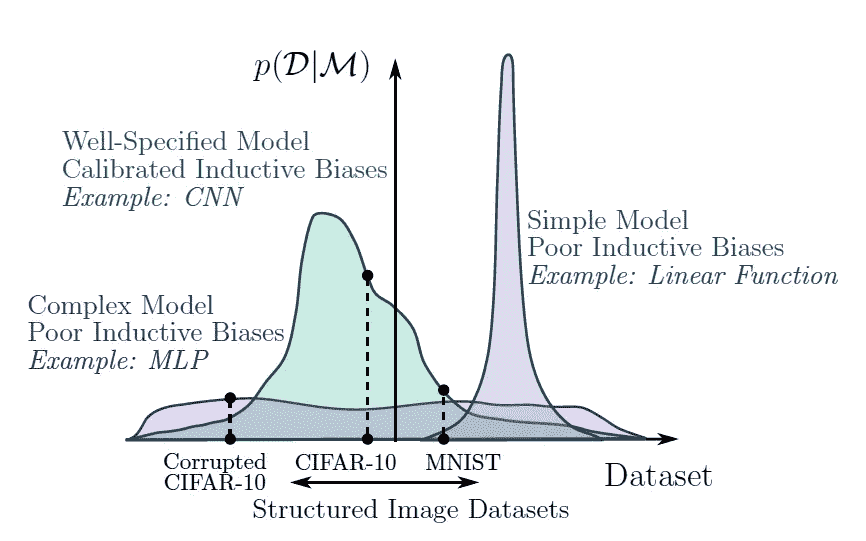
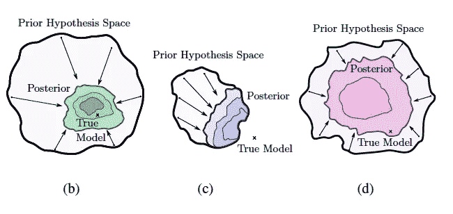
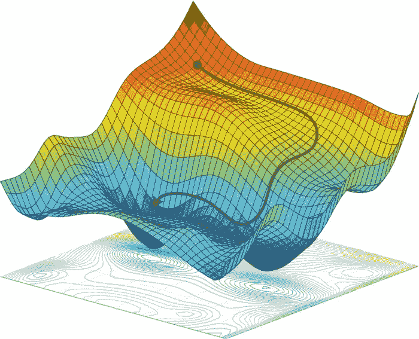
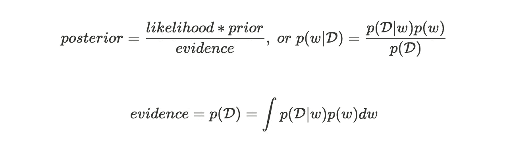
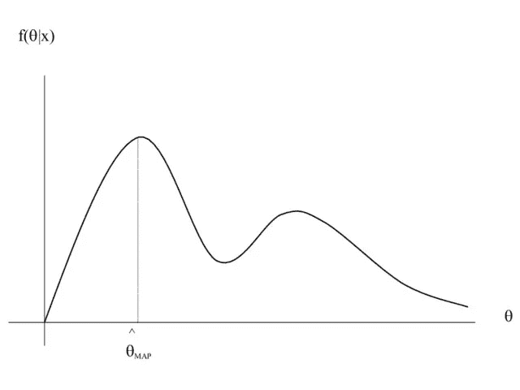
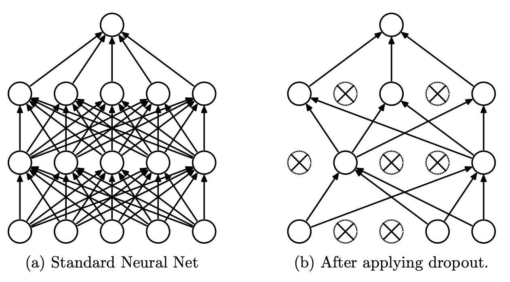
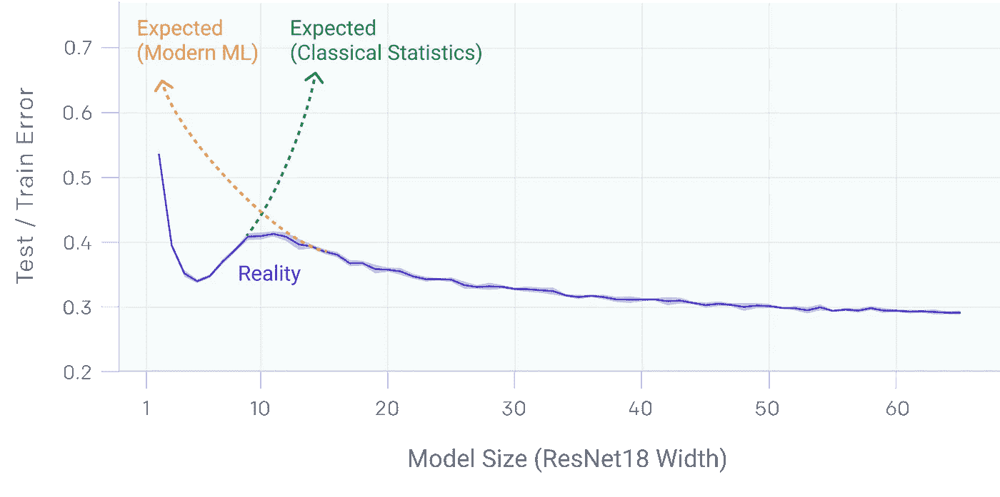

# 贝叶斯深度学习综合介绍

> 原文：<https://towardsdatascience.com/a-comprehensive-introduction-to-bayesian-deep-learning-1221d9a051de?source=collection_archive---------3----------------------->

## 弥合基础研究和现代研究之间的差距。


科迪·希斯考克斯在 [Unsplash](https://unsplash.com?utm_source=medium&utm_medium=referral) 上拍摄的照片

```
**Table of Contents**1\. Preamble
2\. Neural Network Generalization
3\. Back to Basics: The Bayesian Approach
    3.1 Frequentists
    3.2 Bayesianists
    3.3 Bayesian Inference and Marginalization
4\. How to Use a Posterior in Practice?
    4.1 Maximum A Posteriori Estimation
    4.2 Full Predictive Distribution
    4.3 Approximate Predictive Distribution
5\. Bayesian Deep Learning
    5.1 Recent Approaches to Bayesian Deep Learning
6\. Back to the Paper
    6.1 Deep Ensembles are BMA
    6.2 Combining Deep Ensembles With Bayesian Neural Networks
    6.3 Neural Network Priors
    6.4 Rethinking Generalization and Double Descent
7\. Final Words
```

# 1.序文

贝叶斯(深度)学习一直让我好奇，也让我害怕。也许是因为它严重依赖概率理论，这可能令人望而生畏。我注意到，即使我知道基本的概率论，我也很难理解并将其与现代贝叶斯深度学习研究联系起来。这篇博客的目的是弥合这一差距，并提供一个全面的介绍。

我不会从基础开始，我会从安德鲁·威尔逊和帕维尔·伊兹迈洛夫(NYU)关于贝叶斯深度学习和推广的令人难以置信的 NeurIPS 2020 论文开始，名为[贝叶斯深度学习和推广的概率视角](https://proceedings.neurips.cc/paper/2020/file/322f62469c5e3c7dc3e58f5a4d1ea399-Paper.pdf)。这篇论文作为一个有形的起点，我们自然会在野外遇到贝叶斯概念。我希望这能使贝叶斯观点更加具体，并说明它的相关性。

我将从论文摘要和引言开始，为文章做准备。当我们遇到贝叶斯概念时，我将从概率以及 ML/函数近似的角度，用大量的直觉给出一个全面的概述。最后，在整篇文章中，我将回到这篇文章并与它联系起来。

我希望你们离开时，不仅能感受到至少一点贝叶斯理论，还能理解这篇论文的众多贡献，以及总体概括；)

# 2.神经网络泛化(摘要和简介)

如果你的贝叶斯理论有点生疏，那么摘要可能看起来相当神秘。前两句话对我们一般理解贝叶斯 DL 特别重要。中间部分介绍了三个技术贡献。最后两个突出的句子提供了对神秘的神经网络现象的新见解的入门。我将涵盖所有内容，但首先要做的是:论文的导言。



安德鲁·威尔逊和帕维尔·伊兹迈洛夫(NYU)的[贝叶斯深度学习摘要和泛化的概率观点](https://proceedings.neurips.cc/paper/2020/file/322f62469c5e3c7dc3e58f5a4d1ea399-Paper.pdf)

引言中的一个重要问题是神经网络如何以及为什么会泛化。作者认为

> “从概率的角度来看，泛化很大程度上取决于两个属性，模型的支持和归纳偏差。”

支持是一个模型可以支持的数据集类的 ***范围*** *。换句话说；模型可以表示的函数范围，其中函数试图表示数据生成过程。归纳偏差定义了**模型类适合特定数据集类(如图像、文本、数字特征)的程度。作者称之为“支持的分配”。换句话说，模型类性能(~归纳偏差)分布在所有可能的数据集范围内(支持)。***

让我们看看作者提供的例子。线性函数具有截断支持，因为它甚至不能表示二次函数。MLP 非常灵活，但它在数据集之间的支持分布过于均匀，因此对于许多影像数据集来说并不令人感兴趣。卷积神经网络在图像识别的支持和归纳偏差之间表现出良好的平衡。图 2a 很好地说明了这一点。



几种模型类型的支持及其分布(感应偏差)。[威尔森等人(2020 年)图 2a](https://arxiv.org/pdf/2002.08791.pdf)

纵轴代表我天真地解释为“模型在拟合特定数据集方面有多好”。它实际上是*贝叶斯证据*，或*边际可能性*；我们的第一个贝叶斯概念！我们将在下一节深入探讨这个问题。先把思路说完。

一个好的模型不仅需要一个大的支持来代表真实的解决方案，还需要正确的感应偏置来实现解决方案。*贝叶斯后验*，现在把它当作我们的模型，由于正确的归纳偏差，应该收缩到正确的解。然而，先验假设空间应该足够宽，使得真实模型在功能上是可能的(广泛支持)。下图展示了这三个示例模型。从左至右，我们看到 CNN 为绿色，线性函数为紫色，MLP 为粉红色。



具有不同支持和归纳偏差的模型类型的先验、后验和真实模型之间的关系。有线电视新闻网(b)，MLP ( c)和线性模型(d)。[威尔森等人(2020)图 2](https://arxiv.org/pdf/2002.08791.pdf)

在引言的这一点上，与摘要的第一句相似，作者强调

> “贝叶斯方法的关键区别属性是边缘化而不是优化，其中我们表示通过后验概率加权的所有参数设置给出的解决方案，而不是将一切都押在单个参数设置上。”

探究边缘化与最优化的时机已经成熟，并且拓宽了我们对贝叶斯方法的一般理解。我们将触及诸如后验、先验和预测分布、边际可能性和贝叶斯证据、贝叶斯模型平均、贝叶斯推断等术语。

# 3 回归基础:贝叶斯方法

我们可以在任何地方发现边缘化是贝叶斯统计的核心。甚至在毕晓普的 ML 圣经[模式识别和机器学习](http://users.isr.ist.utl.pt/~wurmd/Livros/school/Bishop%20-%20Pattern%20Recognition%20And%20Machine%20Learning%20-%20Springer%20%202006.pdf)中。与贝叶斯观点相反的是频率主义观点。这是你在大多数机器学习文献中遇到的情况。也更容易把握。让我们从那里开始。

## 3.1 常客

机器学习的常用方法是*优化*损失函数，以获得模型参数的最佳设置。一个示例损失函数是交叉熵，用于诸如对象检测或机器翻译的分类任务。最常用的优化技术是(随机)梯度下降的变体。在 SGD 中，模型参数沿着损失空间中最陡下降的方向迭代更新。这个方向由损耗相对于参数的梯度决定。期望的结果是，对于相同或相似的输入，这个新的参数设置使得输出更接近地代表目标值。在神经网络的情况下，梯度通常使用称为反向传播的计算技巧来计算。



使用梯度下降沿最陡下降方向导航损失空间。[阿米尼等人(2017)图 2](https://arxiv.org/abs/1805.04829) 。

从概率的角度来看，常客们正试图**最大化**T2 概率 p(D|w，M}) 。简单地说:选择我们的参数 *w* ，使它们在给定我们选择的模型 *M* 的情况下最大化观察数据集 *D* 的概率(Bishop，第 1.2.3 章)。为了简单起见，M 经常被省略。从概率的角度来看,(统计)模型只是数据 *D* 的概率分布(Bishop，第 3.4 章)。比如说；语言模型输出词汇表的分布，表明每个单词成为下一个单词的可能性。事实证明，这种最常见的**最大似然估计** ( **MLE** )获得或“训练”预测模型的方式可以从一个更大的贝叶斯语境中来看待。事实上，MLE 可以被认为是使用均匀先验的最大后验估计(MAP，我将很快讨论)的一个特例。

## 3.2 贝叶斯主义者

贝叶斯方法的一个重要特性是现实地量化不确定性(T21)。这在要求我们相信模型预测的真实世界应用中是至关重要的。因此，贝叶斯方法定义了参数的全概率分布，而不是参数**点估计。我们称之为*后验分布*。后验概率代表我们对每个参数(设置)值的**信念/假设/不确定性**。我们使用**贝叶斯定理**计算后验概率。这个定理是贝叶斯 ML 的核心——因此得名——并且可以使用简单的概率规则导出[。](http://www.hep.upenn.edu/~johnda/Papers/Bayes.pdf)**



我们首先在参数上指定一个*先验分布* *p(w)* 来捕捉我们的**信念**关于我们的模型参数在观察任何数据之前应该看起来像什么。

然后，使用我们的数据集，我们可以**用*可能性 p(D|w)* 更新**(乘以)我们先前的信念。这种可能性与我们在频率主义方法中看到的数量相同。它告诉我们通过特定的参数设置 *w* 可以很好地解释观察到的数据。换句话说；我们的模型在*拟合*或*生成*数据集方面有多好。可能性是我们的参数 *w* 的函数。

然而，为了获得有效的后验概率**分布**，必须对每个参数设置评估可能性和先验之间的乘积，并进行归一化。这意味着**将**(求和或积分)边缘化于**所有的**参数设置。归一化常数称为*贝叶斯(模型)证据*或*边际似然* *p(D)* 。

这些名称非常直观，因为 *p(D)* 提供了**证据**来证明我们的模型(即数据)总体上*有多好*。“整体模型”是指考虑所有可能的参数设置。换句话说:边缘化他们。我们有时会在证据中明确包含模型选择*M*为 *p(D|M)* 。这使我们能够用不同的参数空间来比较不同的模型。事实上，当比较 CNN、MLP 和线性模型之间的支持和归纳偏差时，这种比较正是论文中所发生的！

## 3.3 贝叶斯推理和边缘化

我们现在已经到达了问题的核心。*贝叶斯推断*是在 *w* 上寻找(推断)后验**分布**的学习过程。这与试图通过微分找到最优的 T31、T32、T33 和 T34 形成了对比，微分是常客的学习过程。

正如我们现在所知道的，为了计算完整的后验概率，我们必须在整个参数空间内将**边缘化。在实践中，这通常是不可能的(难以处理的),因为我们可以有无限多的这样的设置。*这就是为什么贝叶斯方法基本上是关于边缘化而不是最优化的原因*。**

后验中难以处理的积分导致了学习参数值的不同方法族。代替梯度下降，贝叶斯主义者经常使用**抽样**方法，如马尔可夫链蒙特卡罗(MCMC)，或**变分推断**；尝试使用更简单、更易处理的分布族来模拟后验概率的技术。类似的技术通常用于生成模型，如 VAEs。一种相对较新的近似复杂分布的方法是**标准化流量**。

# 4.实践中如何使用后路？

现在我们已经了解了贝叶斯后验分布，我们实际上如何在实践中使用它呢？如果我们想预测下一个单词，比如说，给定一个看不见的句子，我们称之为*y*x 呢？

## 4.1 最大后验概率估计

嗯，我们可以简单地对我们的模型 *M* 的参数取后验分布，并选择分配给它的概率最高的参数设置 *w^* (分布的模式)。这种方法被称为**最大后验概率**或**图**估计。但是……如果只是为了满足于另一个点估计而计算我们参数的适当概率分布，这将是相当浪费的，对吗？(除了当几乎所有的后验质量都以参数空间中的一个点为中心时)。因为 MAP 提供了一个点估计，所以它不被认为是完全贝叶斯处理。



最大后验概率估计；不是完全的贝叶斯治疗。[英雄等人(2008)](http://web.eecs.umich.edu/~hero/Preprints/main_564_15.pdf)

## 4.2 完全预测分布

成熟的贝叶斯方法是指定一个**预测分布**
*p(y|D，x)* 。


这定义了给定新输入 *x* 和数据集 *D* 时分类标签 *y* 的概率。为了计算预测分布，我们需要再次忽略我们的参数设置！我们使用参数设置 *w* 将每个设置 *w* 的后验概率乘以给定输入 *x* 的标签 *w* 的概率。这被称为**贝叶斯模型平均**，或 **BMA，**我们对所有可能的模型(本例中的参数设置)进行加权平均。预测分布是贝叶斯 ML 中边缘化的第二个重要位置，第一个是后验计算本身。直观显示预测分布的方法是简单的回归任务，如下图所示。具体示例请查看这些幻灯片(幻灯片 9–21)。


简单回归任务的预测分布。观察数据点周围的高确定性；其他地方的高度不确定性。[亚林加尔(2015](http://mlg.eng.cam.ac.uk/yarin/blog_3d801aa532c1ce.html)*) [)](http://mlg.eng.cam.ac.uk/yarin/blog_3d801aa532c1ce.html)*)

## 4.3 近似预测分布

正如我们现在所知道的，预测分布中的积分通常是难以处理的，并且至少在计算上是极其昂贵的。使用后验概率的第三种方法是对几个参数设置进行采样，并组合得到的模型(例如近似 BMA)。这实际上被称为预测分布的**蒙特卡罗**近似！

这最后一种方法隐约让人想起谦逊的常客可能更熟悉的东西:深度合奏。深度集成是通过组合结构上相同但用不同参数初始化训练的神经网络形成的。这与我们在论文中离开的地方非常吻合！记得摘要吗？

> “我们表明，深度集成为近似贝叶斯边缘化提供了一种有效的机制，并提出了一种相关的方法，通过在吸引盆地内边缘化来进一步改善预测分布”。

第二次阅读摘要时，投稿应该更有意义。此外，我们现在终于转向贝叶斯深度学习领域！

# 5.贝叶斯深度学习

贝叶斯神经网络(BNN)是应用于神经网络架构的简单的后验推理。准确地说，为每个权重和偏差指定一个先验分布。然而，由于它们巨大的参数空间，推断后验概率比通常更困难。

那么，为什么贝叶斯 DL 呢？

经典答案是获得不确定性的**现实表达**或*校准*。如果类别预测的概率(置信度)与其误分类率一致，则认为分类器已校准。如前所述，这在实际应用中至关重要。

> "从神经网络的预测通常过于自信的意义上来说，神经网络经常被错误校准."

然而，我们连续论文的作者，威尔逊和伊兹迈洛夫，认为贝叶斯模型平均也增加了准确性。根据第 3.1 节，贝叶斯观点事实上对神经网络来说**尤其是**有吸引力！由于它们的大参数空间，神经网络可以表示许多不同的解决方案，例如，它们不被数据指定。这意味着贝叶斯模型平均值非常有用，因为它将各种功能形式或“视角”结合为一。

> “神经网络可以代表许多与我们的观察一致的模型。通过只选择一个，在一个经典的程序中，当模型对于一个测试点不一致时，我们失去了不确定性。”

# 5.1(近似)贝叶斯深度学习的最新方法

许多人最近一直试图将传统神经网络的优点(例如，使用 SGD 和反向传播的计算高效的训练)与贝叶斯方法的优点(例如，校准)相结合。

## 蒙特卡洛辍学

一种流行且概念简单的方法是[蒙特卡洛辍学](https://arxiv.org/pdf/1506.02142.pdf)。回想一下，辍学传统上被用作正规化；它通过在训练期间随机关闭权重**来提供神经网络中的随机性或变化**。事实证明，辍学可以被重新解释为近似贝叶斯推断，并在测试期间应用，这导致了多个不同的参数设置。听起来有点类似于从后验采样参数来近似预测分布，mh？



原始退出机制。[斯里瓦斯塔瓦等人(2014 年)](https://jmlr.org/papers/volume15/srivastava14a/srivastava14a.pdf)

## 随机加权平均—高斯(SWAG)

另一条工作路线来自于[随机加权平均](https://arxiv.org/pdf/1803.05407.pdf) (SWA)，这是一种优雅的近似集合，它智能地组合同一网络在不同训练阶段的权重(如果你想了解更多，请查看[这个](/stochastic-weight-averaging-a-new-way-to-get-state-of-the-art-results-in-deep-learning-c639ccf36a)或[这个](https://pytorch.org/blog/stochastic-weight-averaging-in-pytorch/)博客)。 [SWA-Gaussian](https://arxiv.org/pdf/1902.02476.pdf) (SWAG)通过使用 SGD 提供的简单信息来近似后验分布的形状(局部几何形状)来构建它。回想一下，SGD 在参数空间中“移动”,寻找损失空间中的(局部)最优值。为了逼近后部的局部几何形状，他们将高斯分布拟合到 SGD 迭代的第一和第二时刻。[矩](https://en.wikipedia.org/wiki/Moment_(mathematics))描述函数或分布的形状，其中零矩是总和，一阶矩是均值，二阶矩是方差。然后，这些拟合的高斯分布可以用于 BMA。

## 不确定性表征的频率主义替代方案

我显然没有在这里提到至少 99%的领域(例如 [KFAC 拉普拉斯](https://discovery.ucl.ac.uk/id/eprint/10080902/1/kflaplace.pdf)和[温度缩放](https://github.com/gpleiss/temperature_scaling)用于改进校准)，选择上面的例子部分是因为它们与我们的运行文件相关。我将以最近的**常客**(或者它是……)替代不确定性近似的最后一个例子来结束。这是一种流行的方法，表明人们可以训练深度集成，并使用它来形成预测分布，从而产生校准良好的模型。他们使用了一些我不会深入讨论的附加功能，比如对抗训练来平滑预测分布。点击查看论文[。](https://arxiv.org/pdf/1612.01474.pdf)

# 6.回到报纸上

到现在为止，我们已经准备好回到这篇论文，回顾它的贡献了！他们应该更容易掌握:)

## 6.1 深度系综是 BMA

与最近的文献(包括我自己)的框架相反，威尔逊和伊兹迈洛夫认为，深度集合不是获取贝叶斯优势的频繁主义者的替代方案。事实上，它们是后验分布的一个很好的近似**。因为深度系综是通过 MAP 或者 MLE 再训练形成的，所以可以形成不同的*吸引盆地*。吸引盆地是损失景观中的一个“盆地”或山谷，它导致一些(局部)最优解。但是，在损失图景中，可能会有，而且通常会有多个最优解或低谷。由系综的不同部分发现的多个吸引域的使用，比集中于在单个吸引域内近似后验的贝叶斯方法产生更多的功能多样性。**

## 6.2 将深度集成与贝叶斯神经网络相结合(第 4 节)

这种使用多个吸引域的想法对下一个贡献也很重要:一种近似预测分布的改进方法。通过将深度系综所具有的多吸引域属性与 SWAG 中的贝叶斯处理相结合，作者提出了一个两全其美的解决方案:

> MultiSWAG 结合了多个独立训练的 SWAG 近似，以创建后验高斯近似的混合，每个高斯集中在不同的流域。我们注意到，与标准深度训练相比，MultiSWAG 不需要任何额外的训练时间。”

如果你对具体细节感兴趣，可以看看这篇论文；)

## 6.3 神经网络先验(第 5 节)

我听到你问，我们如何在数百万个参数中指定一个有意义的先验？事实证明这是一个非常合理的问题。事实上，贝叶斯方法有时会因此受到批评。

然而，在论文的第 5 节中，威尔逊和伊兹迈洛夫提供了证据，表明指定一个模糊的先验，比如简单的高斯分布，实际上可能并不是一个坏主意。

> “当与神经网络架构结合时，参数的模糊高斯先验在函数上诱导出具有有用的诱导偏差的分布。”…
> 
> …“函数上的分布控制模型的泛化属性；孤立地看，先验参数没有任何意义。

与神经网络的函数形式相结合的模糊先验导致函数空间中有意义的分布。先验本身并不重要，但它对最终预测分布的影响很重要。

## 6.4 重新思考一般化和双重下降(第 6 和第 7 节)

我们现在已经到达了我在摘要中强调的奇怪的神经网络现象。根据第 6 节，[神经网络可以适应随机标签](https://arxiv.org/pdf/1611.03530.pdf)这一令人惊讶的事实实际上一点也不令人惊讶。如果你从支持和归纳偏差的角度来看，就不会了。广泛的支持，数据集的范围对于泛化很重要，T2 p(D | M)>0。事实上，只要我们有正确的归纳偏差，将模型导向一个好的解决方案，拟合随机标签的能力是非常好的。威尔逊和伊兹迈洛夫还表明，这种现象并不神秘地特定于神经网络，高斯过程也表现出同样的能力。

## 双重下降

第二个现象是双重下降。双重下降是[最近发现的现象](https://openai.com/blog/deep-double-descent/)，更大的模型和更多的数据会出乎意料地降低性能。



图摘自[这篇](https://openai.com/blog/deep-double-descent/)公开的解释深度双重下降的博文

威尔逊和伊兹迈洛夫发现，用 SGD 训练的模型会遭受双重下降，但 SWAG 减轻了这种情况。更重要的是，多重摇摆和深度合奏完全减轻了双重下降现象！这与他们之前讨论的主张一致

> "深度集成提供了一个比传统的单盆地贝叶斯边缘化过程更好的近似贝叶斯预测分布."

并强调了边缘化对后发多模式的重要性。

# 最后的话

你成功了！感谢您从头到尾的阅读。这篇文章变得相当长，但我希望你学到了很多关于贝叶斯 DL。我确实做了。

请注意，我不属于威尔逊，伊兹迈洛夫或他们在 NYU 的小组。这篇文章反映了我自己对他们工作的理解，除了直接从论文中引用的部分。

请随意提问或指出我无疑犯过的错误。我也想知道你是否喜欢这篇文章。你可以在我的[网站](http://jorisbaan.nl)上找到我的联系方式，在[推特](https://twitter.com/jsbaan)上给我发消息，或者在 [LinkedIn](https://www.linkedin.com/in/joris-baan-669324b3/) 上联系我。查看我在 jorisbaan.nl/posts[的个人博客](http://jorisbaan.nl/posts)获得正确的数学渲染！