# 一个全面的成熟技术列表，解决您的人工智能之旅中的数据稀缺问题

> 原文：<https://towardsdatascience.com/a-comprehensive-list-of-proven-techniques-to-address-data-scarcity-in-your-ai-journey-1643ee380f21?source=collection_archive---------22----------------------->

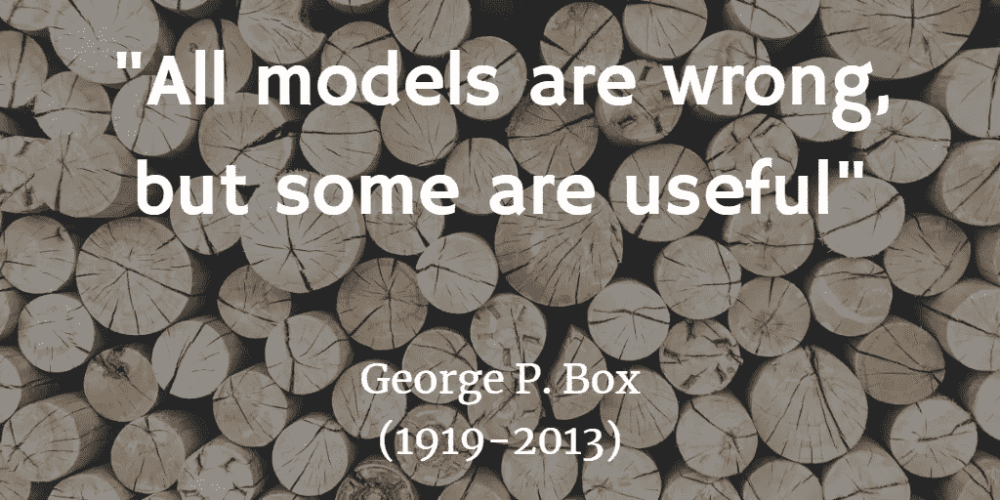

简·安东宁·科拉尔在 [Unsplash](https://unsplash.com/s/photos/wood-logs?utm_source=unsplash&utm_medium=referral&utm_content=creditCopyText) 上拍摄的背景照片

## 机器学习、深度学习、数据科学

## 当你发现自己处于棘手的数据情况时该怎么办

总的来说，我们知道**机器学习**特别是**深度学习**需要大数据才能很好地工作。虽然没有人能明确回答需要多大的数据，但它是针对当前问题的。此外，除了 FAANG(脸书、苹果、亚马逊、网飞和谷歌)，大多数其他公司都无法访问这种大数据。

# 我们为什么需要大数据？

*或者说，没有大数据会怎么样？*

过度拟合。

如你所知，过度拟合是机器学习中众所周知的现象。当数据不够大时，机器学习模型会过度拟合，在现实世界中不能很好地概括。对于非 ML 的人，让我们试着获得一些关于过度拟合的直觉。

假设你正在准备考试。你拿了一本漂亮的小指南或书，通过记忆书中的每个单词来训练自己应付考试。你有信心你的答案会 100%准确。然而，在考试中，问题是基于学科知识的应用，而不仅仅是理论。在这种情况下，你 100%准确的机会大大减少。

类似地，ML 模型通过记忆小的训练数据而不学习底层模式来过度拟合训练数据，尤其是像神经网络这样的复杂模型。在这种情况下，该模型在训练数据上表现得非常好，但在测试数据或现实世界中却失败得很惨。

另一个重要的考虑是，在小数据集中发现**异常值**(显著不同的观察值)和检测**噪声**(随机机会)具有挑战性。同样，这些可能会对您的 ML 模型的性能产生负面影响。

现在我们已经了解了没有大数据的陷阱，让我们试着将自己置于各种 ***数据环境*** 中，看看我们能做些什么。我们将涉及许多不同的工具和技术。其中一些技术本身就是很大的话题。目的不是深入研究，而是对给定的技术有一个简单的直觉。

在本文中，我们将查看以下 ***数据情况*** 并讨论可能的解决方案。

1.  小数据
2.  尚无数据
3.  稀有数据
4.  昂贵的数据
5.  不平衡数据

# 1.小数据

> 您只处理了几百或几千个例子。

同样，这是具体到手头的问题，但让我们考虑在这里讨论这个数字。因此，让我们来看看当您处理小数据时可以做些什么。

## 1.1 数据扩充

数据扩充是指通过向数据中添加变量来增加数据点的数量。这种技术可以防止过度拟合，并帮助您的模型更好地泛化。

对于图像数据，可以通过以下方式进行数据扩充

*   修改照明条件
*   随机种植
*   水平翻转
*   应用变换，如平移、旋转或剪切
*   放大，缩小

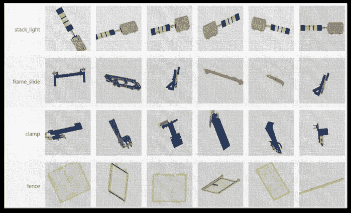

图像数据扩充(作者提供的图像)

您还可以通过以下方式将数据扩充应用于文本数据

*   回译
*   同义词替换
*   随机插入、交换和删除

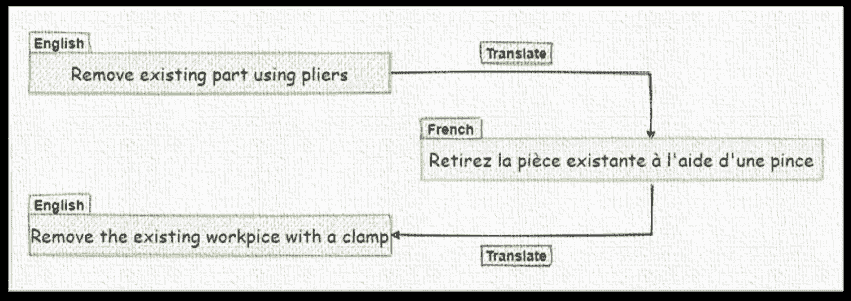

反向翻译—文本数据扩充(图片由作者提供)

除此之外，还有为数据集学习最佳数据扩充策略的技术，称为*自动扩充*。*自动增强*使用搜索算法寻找最佳策略，使神经网络在目标数据集上产生最高的验证准确性。

## 1.2 迁移学习

迁移学习是指将知识从数据量巨大的源领域转移到数据量很少的目标领域。例如，在计算机视觉领域中的问题的情况下，像边缘、形状、拐角和强度这样的低级特征可以跨任务共享，从而实现任务间的知识转移。

迁移学习的灵感来自于我们跨任务迁移知识的内在能力。我们在完成一项任务时学到的东西，会以某种方式应用到相关的任务中。

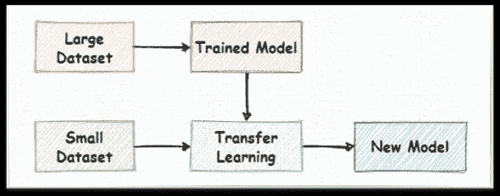

迁移学习(图片由作者提供)

迁移学习成功地应用于图像、文本和音频/语音数据，它本身就是一个大话题。当你处理小数据时，这是一个有用的工具。

## 1.3 问题减少

减少问题是指将你的问题分解成子问题，并使用已知和已建立的技术解决这些问题。可能是将数据修改为不同的格式，或者将未知问题转换为已知问题。

我们试着用例子来理解一下。

这里显示的例子是音频分类问题。但是数据集太小，无法训练适合音频分类的新的端到端 ML 模型。相反，我们可以通过从音频数据中创建声谱图图像来将此简化为计算机视觉问题。然后，我们可以使用基于最先进的图像分类模型的迁移学习来获得非常高的分类精度。

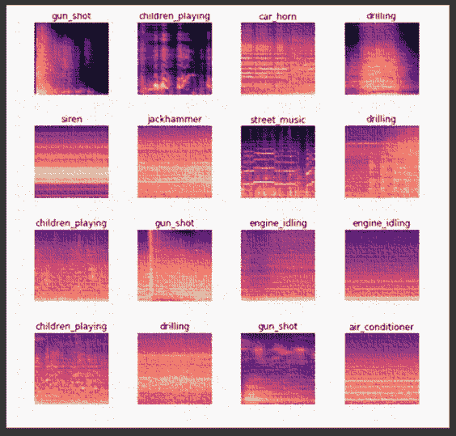

音频到图像(作者提供的图像)

## 1.4 建模技术

当您处理少量数据时，在构建模型时，您应该记住以下一些技巧。

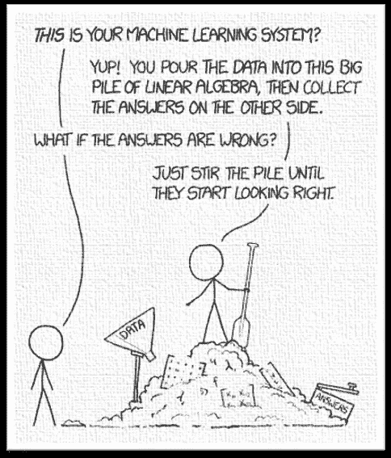

xkcd.com[—机器学习](https://xkcd.com/1838/)

*   与神经网络等复杂的黑盒模型相比，使用**线性、更简单、可解释的**模型(如线性/逻辑回归、朴素贝叶斯、统计)。
*   使用**正则化**像拉索(L1)、山脊(L2) &弹性网回归。
*   使用**集合**或模型平均。
*   使用领域专家来执行**显式特征工程**(特征选择、特征生成和特征消除)，而不是依赖自动特征发现。

## 1.5 合成数据

合成数据是假数据。它符合与其真实对应物相同的模式和统计特性。它具有固有的优势，如

*   隐私和数据保护合规。
*   这是比匿名化数据更好的选择，如果做得不好，就无法保护隐私，如果做得过了头，就会破坏重要信息。

有多种技术可以生成合成数据，例如

**1.5.1 合成少数过采样技术(SMOTE & M-SMOTE)**

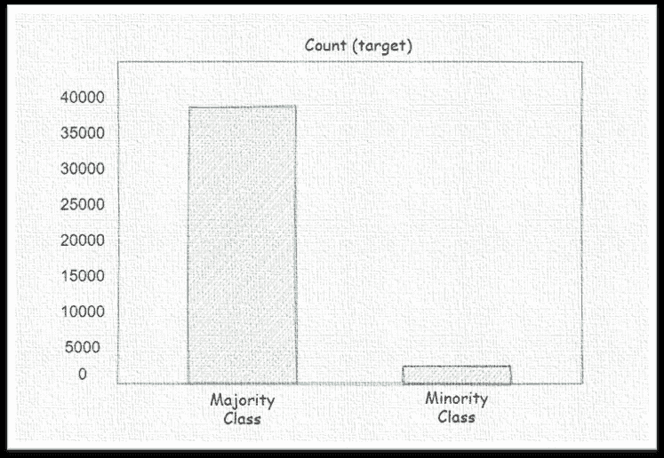

不平衡的数据集(图片由作者提供)

*SMOTE* 通常用于处理不平衡数据(类别分布不均)的场景。它获取少数类数据点，并在特征空间中由直线连接的任意两个最近的数据点之间创建新的数据点。 *M-SMOTE* 是几个修改过的 *SMOTE* 变体之一，它也考虑了少数类的底层数据分布。

**1.5.2 生成性对抗网络(GAN)**

GANs 可能是市场化程度最高的神经网络。如果训练有素，它们非常擅长生成逼真的合成数据。下图中的人是不存在的。这些图片是用 deepfake 技术生成的。但是你可以想象 GANs 在生成合成数据方面有多好。

[Deepfakes](https://thispersondoesnotexist.com/)

下面你可以看到 GANs 的基本架构。*发生器*和*鉴别器*是一个典型 GAN 的基本组成部分。生成器的工作是生成假图像，鉴别器检查生成器生成的图像看起来是否和真实图像一样。在训练过程中，生成器非常擅长生成伪造图像，以至于鉴别器无法区分真假数据。

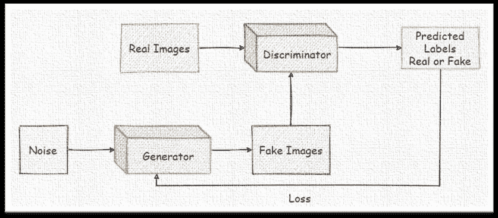

生成性对抗网络(作者图片)

**1.5.3 模拟器**

模拟器通常用于强化学习环境，在这种环境中，真实世界的模型训练是复杂、昂贵或危险的。
例如，自动驾驶模型在进入真实世界之前，首先在模拟环境中接受训练。

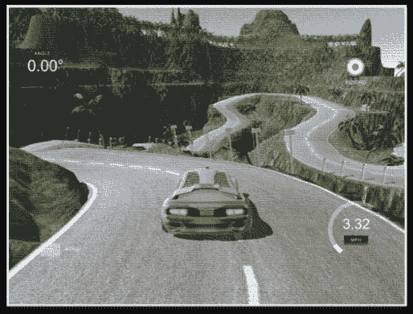

[Udacity 自动驾驶汽车模拟器](https://github.com/udacity/self-driving-car-sim)

因此，我们研究了处理小数据时的各种选择。我们的下一个数据情况是我们中相当多的人更经常面对的。

# 2.尚无数据

> 你有一个重要的问题要解决，但没有任何代表性的数据。

这种情况在由于隐私/保密性/敏感性原因而难以获得数据的行业中很常见。

那么我们有什么选择呢？

## 2.1 开源数据集

开源数据集特别有用。尤其是在视觉和语言领域的开源数据集之上训练的模型，概括得出奇地好。

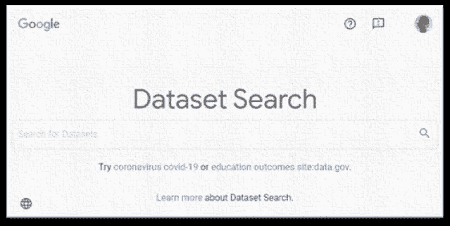

谷歌数据集搜索(图片由作者提供)

有相当多的资源可以查找这样的数据集

*   [Kaggle 数据集](https://www.kaggle.com/datasets)
*   [UCI 机器学习知识库](https://archive.ics.uci.edu/ml/datasets.php)
*   [谷歌数据集搜索](https://datasetsearch.research.google.com/)
*   [带代码的论文—数据集](https://paperswithcode.com/search?q=dataset)
*   [AWS 上的开放数据](https://registry.opendata.aws/)
*   [Azure 开放数据集](https://azure.microsoft.com/en-us/services/open-datasets/catalog/?q=)
*   [谷歌云公共数据集](https://cloud.google.com/public-datasets)
*   [脸书数据为好](https://dataforgood.fb.com/docs/facebook-data-for-good-publicly-available-data/)
*   学术界等开放数据集。

## 2.2 在线/增量/流学习

通常，我们以离线方式构建 ML 模型。我们离线获取所有数据，并使用批量数据训练模型。在线学习是从每个数据实例中学习。

在线学习对于在相当多的场景中构建 ML 模型是有用的，其中

*   由于隐私/保密性/敏感性原因，数据难以获取。
*   由于网络障碍，设备必须脱机工作。
*   在给定的时间点，数据集太大而不适合内存。
*   数据的潜在本质导致频繁的数据/概念漂移。

话虽如此，在线学习的实施和监控非常复杂(尤其是在内部环境中)，并且需要大量的工程工作。

## 2.3 联合学习

联邦学习是机器学习中最令人兴奋的领域之一。这是一种在分散数据上训练集中模型的方法。这项技术在医疗和金融领域已经很普遍，由于敏感性和隐私问题，这些领域的数据很难获得。这里的中心思想是，如果你不能向模型发送数据，为什么不把你的(机器学习)模型发送给数据呢？

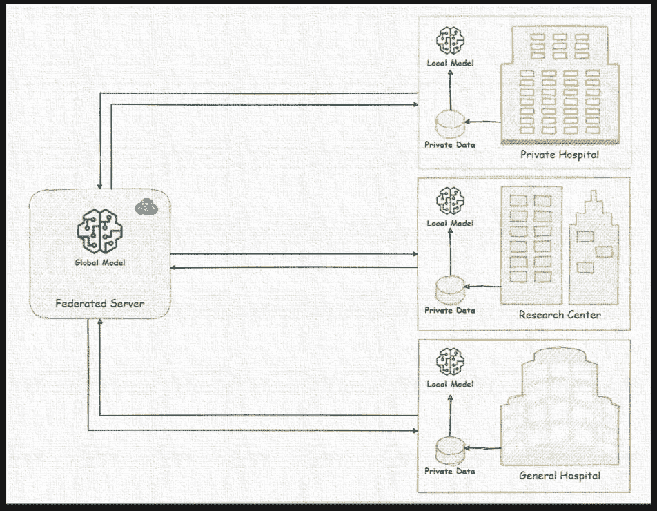

联合学习(作者图片)

谷歌在 2016 年首次在 Android 上的 *Gboard* 应用的背景下引入了联邦学习。 *Gboard* 是一款安卓键盘应用，可以在你打字时预测下一个单词。由于谷歌不可能将用户正在键入的内容发送到他们的服务器，他们将机器学习模型推向数百万移动设备。当移动设备处于空闲模式时，使用本地用户数据在移动设备上完成训练。来自数百万移动设备的学习到的模型权重被推送到联合服务器并被聚集以创建新的全局模型。这个全局模型现在成为新的基础模型，并被推回到所有移动设备。你可以看到，这个新的全球模型现在已经从数百万用户的数据中学习到，而无需共享他们的机密数据。

## 2.4 安全和私人学习

安全和隐私学习是与机器学习的安全和隐私保护方式相关的各种技术的总称。这些可以与我们上面讨论的联合学习结合使用。前面我提到过，联邦服务器聚合了从数百万移动设备接收到的所有模型权重。

**安全聚合**用于执行此类聚合。在这里，服务器看不到根据单个数据训练的模型权重，因为模型权重可以反向工程回单个用户数据。安全聚合是一种组合加密结果并仅对聚合进行解密的技术。

**多方计算**是另一种通过与多方共享数据来执行计算的方法。但任何一方都无法获得原始数据；他们所拥有的只是原始数据中属于他们的部分。

**差分隐私**通过保证定义的隐私级别，正在迅速成为执行分析和机器学习的首选技术。这比仅仅匿名化数据更可靠。

**同态加密**是对加密数据进行运算的技术。数据所有者将数据以加密形式发送到服务器，在服务器上对加密数据进行训练或推断。加密的结果被发送回数据所有者，而数据所有者只能对结果进行解密。

**机密计算**是云服务提供商提供的硬件/软件服务的组合。对于机密计算，数据在静态和传输过程中会被加密，但在使用或处理过程中也会被加密。机密计算环境将数据加密保存在内存和中央处理器(CPU)之外的其他地方。

## 2.5 战略

我不是这方面的专家，但这些是人工智能领域的初创公司用来获取数据的策略。

*   **众包**:使用领域专家手动收集和标记数据，或者使用外部平台，如*亚马逊机械土耳其*或*阿彭*。
*   **用户参与循环**:这种方法包括设计一种产品，为用户提供明确的激励，让用户将数据反馈给系统或纠正机器错误。reCAPTCHA 是这种策略的一个众所周知的例子。为了登录应用程序并证明你不是机器人，我们最终标记了一组相当复杂的图像，可能大多数人甚至没有意识到他们正在免费标记数据。

reCAPTCHA(作者图片)

*   **提供免费的特定领域云/移动应用:**这是有用的，但也有风险，因为开发和推广一款应用程序可能需要大量的时间和精力，该应用程序具有足够强大的用例来迫使用户放弃他们的数据。
*   **专家(基于规则的)系统**:您可能会得出结论，构建一个数据驱动的解决方案在这一点上是不可能的。相反，使用基于规则的方法构建自动化，并在用户使用这样的系统时收集数据。
*   **许可**来自第三方数据提供商的数据
*   **与大型企业客户合作**
*   **收购**获取数据

# 3.稀有数据

> 你的问题包括处理很少发生的现象的数据，例如，工厂中罕见但昂贵的故障事件。

## 3.1 少量学习

少镜头学习现在吸引了很多注意力，因为它能够从很少的例子中学习和归纳。很少，我指的是两到五个例子。

这个想法的灵感来自于我们从很少的经验中总结的能力。根据示例的数量，它也被称为一次学习、零次学习或通常的 N 次学习。

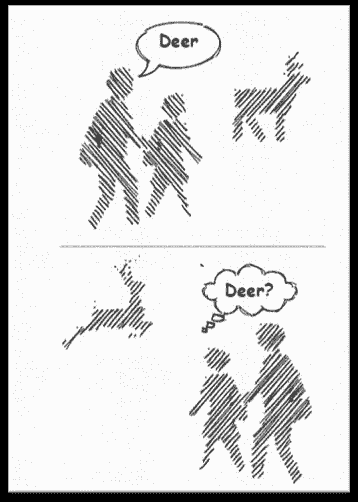

从很少的经历中学习(作者图片)

让我们考虑一个标准设置中的分类问题。假设您想要构建一个分类器来对狗和猫进行分类。现在，在这种情况下，你的机器学习模型将学习猫和狗特有的特征，在预测时，当你给它一个猫或狗的新图像时，决定将基于它对特定对象的学习。在少量学习的情况下，模型学习如何区分类，而不是学习每个类的单独特征。一般来说，模型学习两个对象如何相似或不同。

少量学习是一个很大的话题。有各种各样的方法(基于增强、基于模型、基于度量、基于优化、基于生成建模等)。)解决少拍学习问题。在处理稀有数据甚至是看不见的数据时，这是一个有用的选择。

# 4.昂贵的数据

> 您拥有解决问题的数据，但是标注复杂、昂贵或耗时。

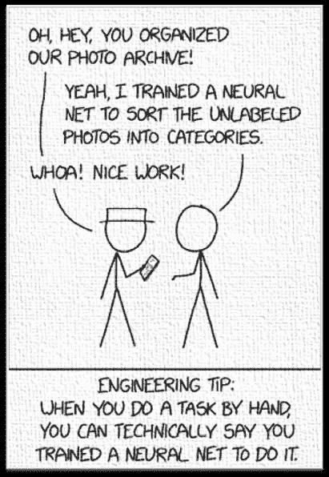

[xkcd.com](https://xkcd.com/2173/)—神经网络

我们知道，最近机器学习的成功主要是由监督学习推动的。监督学习需要高质量的标记数据才能很好地工作。因此，让我们看看在处理这个瓶颈时我们有什么选择。

## 4.1 自我监督学习

自我监督学习就是通过创造性地利用数据的属性来建立一个假的监督任务，从而绕过人类的标记。如果我们以这样一种方式来表述问题，即我们可以从现有数据中生成几乎无限的标签，并使用这些标签来学习表示，会怎么样？

考虑这个例子。假设您想要对图像数据执行分类。你可以接触到大量的数据，但你只能给少数样本贴标签。你可以通过旋转你的无标签图像 0 度，90 度，180 度，270 度等角度来生成伪标签。，并训练模型来预测这个旋转角度**。**在学习对旋转角度进行分类的同时，模型学习图像数据的一些重要方面。然后，这种模型可以用于迁移学习，并在小的标记数据上进行微调。

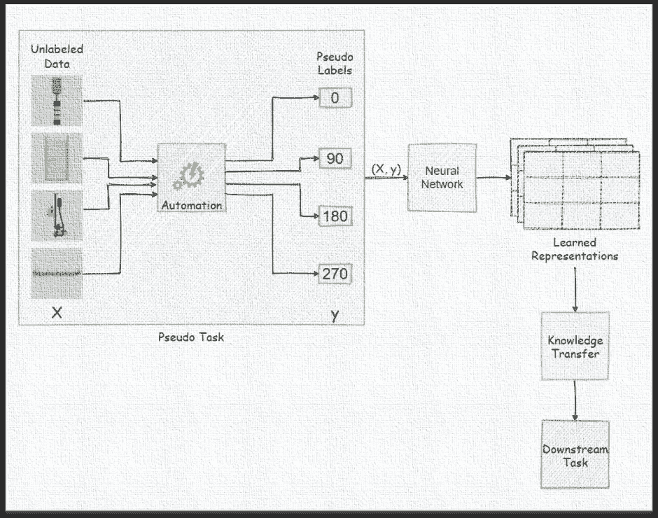

自我监督学习(图片由作者提供)

您还可以通过学习从彩色图像创建灰度图像，或学习从正常图像创建高分辨率图像，或学习通过将裁剪和固定的图像配对来完成图像的缺失部分，来表述该问题。该模型必须了解图像中存在的不同对象和相关部分，以解决这些任务。因此，学习到的表征对下游任务是有用的。

不仅仅是计算机视觉，最近 NLP 的进步也是由自我监督驱动的。像 BERT 这样的最新语言模型是使用自我监督学习方法训练的。

## 4.2 半监督学习

半监督学习或 SSL 是关于从小的标记数据集和相对较大的未标记数据中学习。SSL 利用未标记的数据来获得对总体人口结构的更多了解。直觉上，未标记的数据有助于在输入数据中找到关于模式的有用信息，以确定新案例的标签。

我们试着用一个例子来理解一下。如下图所示，假设整个数据集中只有四个点用红点和黑点标示。基于这些信息，我们想要估计第二张图中由 **x** 表示的新数据点的标签。

使用我们基于标签数据的直觉，甚至通过应用一些统计算法，我们大多数人可能会估计它是红色的。但是，如果我们在最后一张图中一起查看带有标记和未标记数据点的整个数据集的分布，明显的聚类很可能会改变我们的估计。

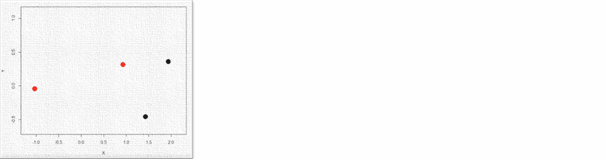

半监督学习(图片由作者提供)

## 4.3 主动学习

主动学习是半监督学习的一种。它只优先考虑需要标记的混淆样本，并减少从专家那里收集的标签数量。这就是主动学习的工作原理，

*   手动标记训练数据小子样
*   根据这些标记的数据训练模型
*   使用此模型预测未标记数据上的标签
*   根据模型预测对每个未标记的数据点进行评分，并选择具有最大不确定性的数据点
*   人类专家将只标记选定的数据点
*   追加新标记的数据
*   重新训练模型并继续该过程

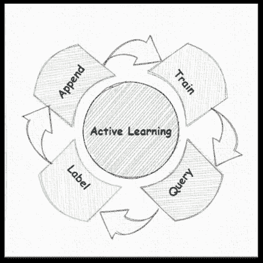

主动学习(作者的图片灵感来自[来源](https://medium.com/nvidia-ai/scalable-active-learning-for-autonomous-driving-a-practical-implementation-and-a-b-test-4d315ed04b5f))

Prodigy 是一个基于主动学习的标记工具，有助于减少训练模型所需的标记数据量。

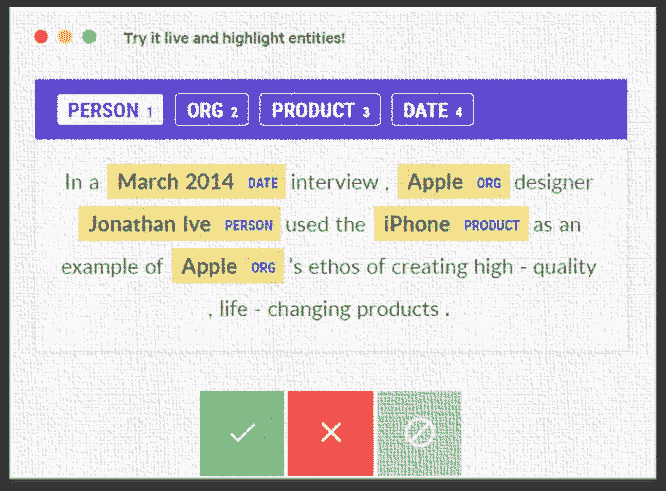

[神童](https://prodi.gy/)(图片由作者提供)

## 4.3 监管/引导不力

弱监管是指利用组织知识以编程方式标记数据，也称为数据编程。组织知识资源包括内部模型、领域试探法、经验法则、遗留规则、知识图、现有数据库、本体等。我们可以编写多个标记函数，以编程方式标记数据，例如，我们可以编写以下标记函数，根据特定的启发或观察来标记用于垃圾邮件检测的训练数据。

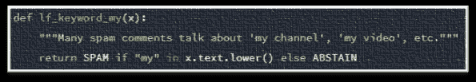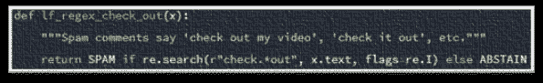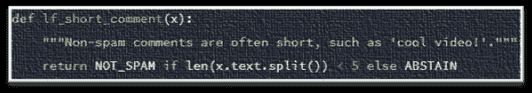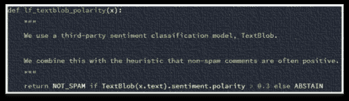

标签功能([通气管](https://www.snorkel.org/)，图片由作者提供)

关键思想是标记函数不需要精确，也可以相互关联。像 [*通气管*](https://www.snorkel.org) 这样的弱监督系统可以一致地估计它们的准确度和相关性，然后重新加权和组合它们的输出标签，从而产生高质量的训练标签。浮潜是在斯坦福大学开发的，被谷歌、英特尔、IBM、DARPA 等公司使用。

# 5.不平衡数据

> Y 您拥有的数据具有不平等的类别分布，这导致了不期望的偏差。

## 5.1 取样和称重

我们已经看到了一种用于处理不平衡数据的技术，即 *SMOTE* 及其修改版本，它有助于为少数类创建合成数据。除此之外，你可以试试。

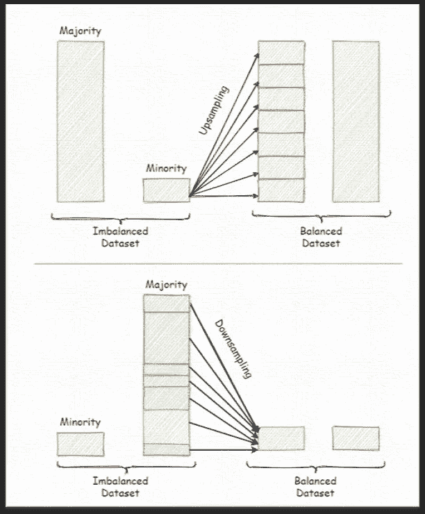

过采样和欠采样(图片由作者提供)

*   过采样或上采样少数类。
*   欠采样或下采样多数类。
*   训练模型时，向少数类添加比例权重。
*   尝试采样和机器学习算法的多种组合。
*   寻找优化指标，例如，对于分类问题，使用 *F1 得分*、*精度/召回*而不是*精度*。*准确性*在处理不平衡数据时不是一个有用的指标。往往倾向于多数阶级的比例。如果你的数据有 95%属于多数类，那么通过把所有东西都归类为多数类，算法可以轻松获得 95%的准确率。使用其他指标，如 *F1 分数*或*精度/召回率*也将考虑少数族裔的模型性能。
*   从不同的角度看待问题，例如，将少数类视为异常或异常值，并将异常检测算法用作分类器。

# 结论

下面的思维导图(点击放大)总结了我们上面提到的所有内容。如前所述，如果你发现自己处于这种 ***的数据状态*** ，在称之为你的项目之路的尽头之前，有大量的选项需要考虑。即使你现在不打算实现机器学习解决方案，也要尽快开始计划数据采集。当处理机器学习问题时，手头有更多的数据几乎总是好的。

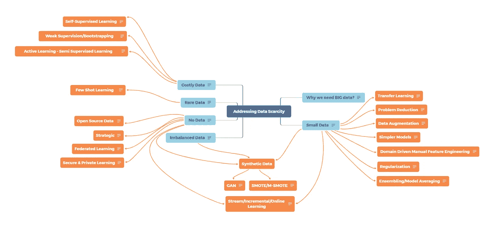

解决数据稀缺问题(作者图片)

如果你遇到任何其他工具、技术或策略来处理这种数据匮乏的情况，请将它们添加到评论中。我肯定会考虑加在这里。

# 参考

[1] Ekin D. Cubuk，Barret Zoph，Dandelion Mane，Vijay Vasudevan，Quoc V. Le，[自动增强:从数据中学习增强政策](https://arxiv.org/abs/1805.09501) (2019)，CVPR 2019

[2] Google AI 博客，[联邦学习:没有集中训练数据的协同机器学习](http://ai.googleblog.com/2017/04/federated-learning-collaborative.html) (2017)

[3]谷歌云博客，[介绍带有机密虚拟机的谷歌云机密计算](https://cloud.google.com/blog/products/identity-security/introducing-google-cloud-confidential-computing-with-confidential-vms)，(2020)

[4] [景龙龙，田英丽，深度神经网络自监督视觉特征学习综述](https://arxiv.org/abs/1902.06162)，(2019)