# 理解 AdaBoost 的综合数学方法

> 原文：<https://towardsdatascience.com/a-comprehensive-mathematical-approach-to-understand-adaboost-f185104edced?source=collection_archive---------10----------------------->

## 了解 AdaBoost 如何从数学的角度，以全面和直截了当的方式工作。

罗马法师在 [Unsplash](https://unsplash.com/s/photos/math?utm_source=unsplash&utm_medium=referral&utm_content=creditCopyText) 上拍摄的照片

在本教程中，我将解释 AdaBoost 是如何通过它所涉及的数学工作的。

在我们开始之前，我建议看看您是否能勾选下面提到的所有先决条件。这些并不是绝对必要的，但会帮助你更有效地学习本指南。

## 本教程需要的内容:

1.  *对**微积分**的基本理解*
2.  *熟悉*与**监督分类问题**
3.  *对**集成学习**的基本理解*
4.  *对**决策树**的基本理解*

# 目录

1.  升压和 AdaBoost 简介
2.  AdaBoost 算法
3.  AdaBoost 每个阶段的分解
4.  结论

# 升压和 AdaBoost 简介

如果您正在阅读本教程，您可能听说过 XGBoost、LightGBM 或类似的东西。这些在应用机器学习中非常流行，它们来自一个叫做**增强集成**的算法家族。

顾名思义，提升集成是集成学习中的一个分支。Boosting 通常的工作方式是以一种**顺序**的方式在数据集的子集上建立多个模型，其中**每个模型从以前模型的错误中学习**。在你建立了所有的弱模型之后，然后**结合他们的预测**得到一个“强模型”。

> Boosting 引入了将多个弱学习者组合起来得到一个强学习者的流行概念。

模型如何在错误的基础上继续构建，这是每个 boosting 算法所独有的。今天，我们将重点讨论 AdaBoost。

AdaBoost 是 Adaptive Boosting 的缩写，由 [Yoav Freund](https://en.wikipedia.org/wiki/Yoav_Freund) 和 [Robert Schapire](https://en.wikipedia.org/wiki/Robert_Schapire) 创造。它是机器学习的 Boosting 分支中早期成功的算法之一，专门用于二进制分类。

> AdaBoost 是一个流行的伟大的算法，当你开始学习 boosting 的时候。

需要注意的一点是，AdaBoost 实际上适用于任何分类器，如逻辑回归、支持向量机等，只要它们是弱学习器。然而，众所周知，AdaBoost 是在称为“树桩”的单深度决策树的上下文中讨论的。在分析 AdaBoost 时，我们将遵循这一约定。

这有几个原因，但这超出了本文的范围。如果你愿意，你可以在这里的讨论中了解更多[。](https://stats.stackexchange.com/questions/124628/why-adaboost-with-decision-trees#:~:text=Boosting%20on%20the%20other%20hand,high%20bias%20and%20low%20variance.&text=This%20is%20why%20very%20often,condition%20on%20a%20single%20dimension).)

> ***重点是，AdaBoost 不一定需要与决策树一起使用，但在实践中通常会这样做，因为 stumps 比其他弱学习器有优势。***

# AdaBoost 算法

首先，让我们看看 AdaBoost 算法的数学总结。

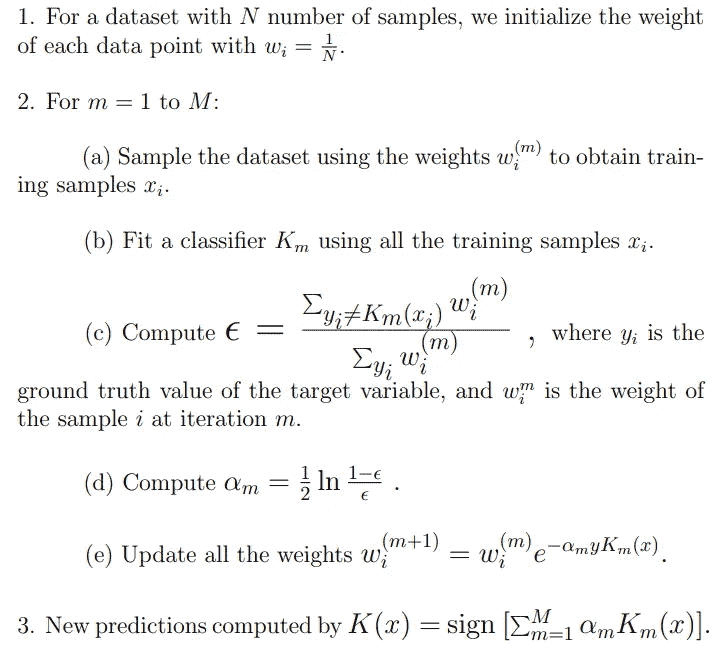

修改自:t . Hastie，r . TiB shirani 和 j . Friedman(2009)。统计学习的要素:数据挖掘、推理和预测。斯普林格科学与商业媒体。

看起来事情很多，但是请不要抓狂，因为 ***并没有看起来*** 那么难。

通读一遍，我们将在下一节讨论细节。

# **AdaBoost 各阶段分解**

## AdaBoost 故障的更多初步信息

用于分类的 AdaBoost 是一个监督机器学习问题。它包括使用特征数据(x)和目标标签(y)迭代训练多个树桩。*训练后，模型的总体预测来自树桩预测的加权和。*

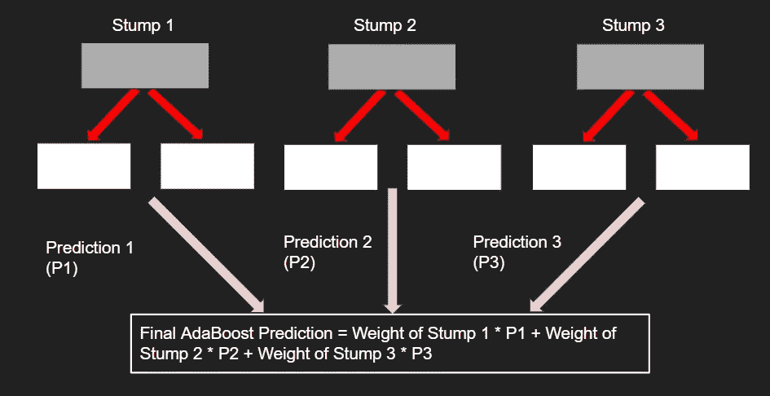

AdaBoost 最终预测结果的可视化

需要注意的一点是，AdaBoost **具体以** **-1 或 1 作为目标标签**，在预测时**会输出-1 或 1** 。它不使用通常的 0 和 1 的二进制方法。

考虑到这一点，让我们深入分析一下。

# 1.初始化权重

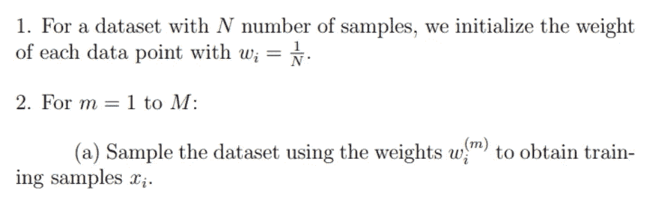

AdaBoost 的步骤 1–2a)

在 AdaBoost 中，我们不直接使用数据集进行训练。相反，在每次训练迭代的开始，我们使用权重对数据集进行采样，以获得实际的训练数据。

因此，AdaBoost 的第一步是为每个数据点初始化 1/N 的权重。*同样，数据点的权重代表在采样期间选择它的概率。*

这方面的一个例子如下:

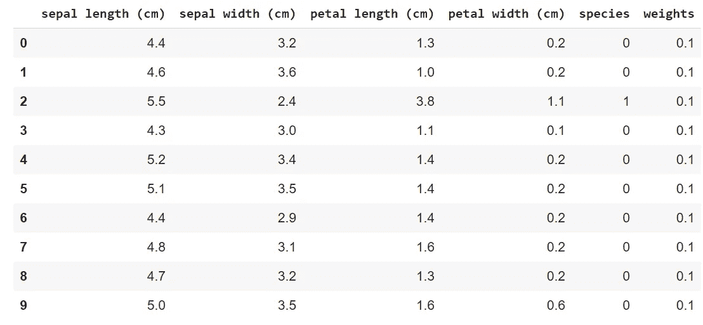

虹膜数据集的子集作为我们的实际数据集

我们将暂时使用上面的数据集作为我们的玩具示例。

在权重初始化之后，我们进入步骤 2 中的训练迭代循环。

在第一次迭代(m = 1)时，原始数据集中的每个数据点都有相同的机会被选为训练样本。因此，如果我们的数据集如上图所示，有 10 个数据点，那么每个数据点被选中的概率为 0.1。

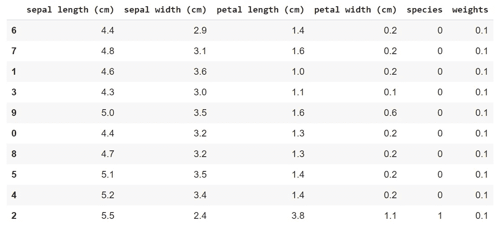

从原始数据集采样的训练数据集

**我们数据集的采样结果**

# 2.训练弱分类器

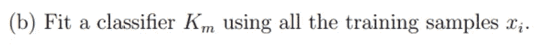

AdaBoost 的步骤 2b)

在对数据集进行采样以获得当前迭代的训练集之后，使用该训练集来训练弱分类器 K_m。在我们的例子中， **K_m 只是一个决策树的树桩。**

# 3.根据错误计算更新参数

## 3a)Stumps 如何从 AdaBoost 中的错误中学习

AdaBoost 中的 Stumps 通过**调整数据集的权重以适应 stumps 在每次迭代中犯的错误**，逐步从先前 stumps 的错误中学习。错误分类数据的权重将增加，而正确分类数据的权重将减少。*因此，随着我们进入进一步的迭代，训练数据将主要包括经常被我们的树桩错误分类的数据。*

例如:

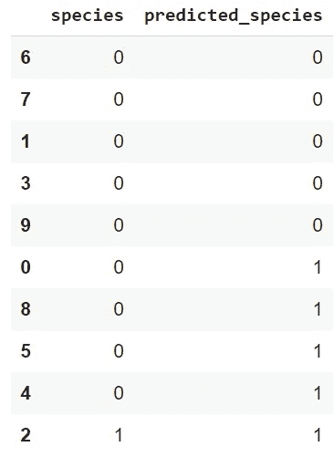

**训练组第一个树桩的表现**

如果我们的第一个 stump 错误分类数据样本 0，8，5，4，那么在迭代 1 结束时，权重更新导致这些数据样本具有更大的权重。

在权重更新后，您可以从下面的示例中看到，重新采样数据集以获得迭代 2 的训练集将导致包含更多的错误分类数据样本(0，8，5，4)。

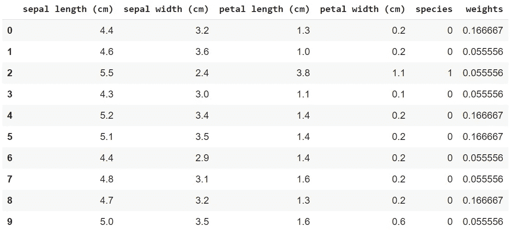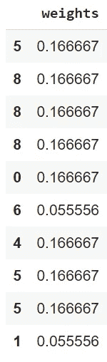

左表:基于第一个 stump 在训练集上的表现的数据的新权重||右表:从新权重采样数据集的结果

> 这里的重量更新并不是准确的数字，它们只是为了证明重量的增加/减少。

直观上，这是有道理的:如果一个树桩无法对某些数据进行正确分类，**那么你只需要在“难以分类”的数据上训练更多的树桩。**因此，取这些树桩的加权和，让 AdaBoost 表现得非常好。

因此，权重更新对于 AdaBoost 正常工作至关重要。

## 3b)关于重量更新的更多信息

现在问题来了， ***这些权重到底是怎么更新的？*** 答案就在 AdaBoost 算法的这一段:

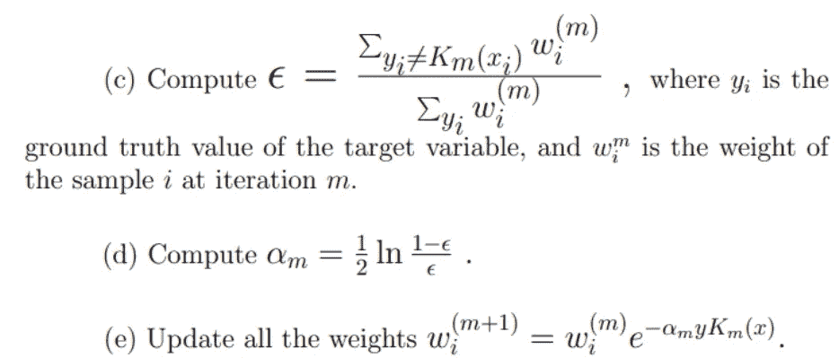

AdaBoost 算法的步骤 2c-2e

AdaBoost 算法的步骤 2e)很好地总结了如何在特定迭代 m 进行权重更新，它们被计算为当前权重的乘积，其指数为(-alpha * y * K_m(x))，其中:

*   ***y*** 表示目标特征的真实值(在我们的玩具数据集例子中，这将是‘物种’列)。
*   ***K_m(x)*** 是我们在迭代 m 时训练的树桩做出的预测
*   ***alpha_m*** 是我们对 stump m 的预测能力寄予的信心。
*   ***y 和 K_m(x)可以各自取值-1 或 1*** 。如果 y 为 1，K_m(x)为 1，或者两者都为-1，那么这意味着训练样本 x 已经被正确分类。y*K_m(x)将等于 1。否则，y*K_m(x)将等于-1。
*   这与前一小节 a)中的“从错误中学习”的概念一致。
*   当数据被错误分类为**、**、**、 *y*K_m(x) = -1* 、**、**时，该数据的**、**、*权重将呈指数增加。*** 数据分类正确时， ***y*K_m(x) = 1* ，*则相反。*******

> **顺便提一下，当对 AdaBoost 进行整体预测时，我们使用 alpha_m 作为每个树桩预测的权重。** 
> 预测= alpha _ 1 * stump _ 1+alpha _ 2 * stump _ 2…
> 
> 这可以用数学方法表示为:

等式 1a。AdaBoost 在迭代 m 时的整体预测，用 C_m(x)表示

**Alpha_m** 因此是一个重要的参数，实际上是从我们在 AdaBoost 中使用的误差函数中得到的**。**

## 3c)从误差函数中导出α

> 免责声明:这一部分相当长，但我建议从头到尾看一遍，以便在数学上弄清楚 alpha 是什么以及它是如何产生的。
> 
> 此外，我大量引用了[这篇论文](http://www.inf.fu-berlin.de/inst/ag-ki/adaboost4.pdf)来编写本节的注释和推导。我强烈建议你也读一读。

## 误差函数

AdaBoost 使用的误差函数是**指数损失函数**。

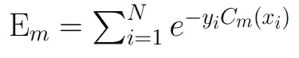

等式 2a。AdaBoost 的指数损耗

*   首先我们找到每个样本的**真值**和**总体预测**之间的**乘积**。
*   然后我们取这些乘积的所有指数的**和，以便计算迭代 m 的误差。**

我们可以重新制定 C_m 并将其插入 E_m。这是我们在此步骤后得到的结果:

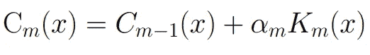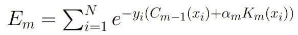

左:Eq 1b。C_m ||右的重新表述:Eq 2b。将 C_m 的新公式代入误差函数

*   由于 AdaBoost 的预测的加权和性质，我们可以将 AdaBoost 在第 m 次迭代的**预测表示为其在前一次迭代(m-1)** 的**总体预测的**和**，以及树桩 m 的加权预测**[当前迭代的树桩的权重(alpha_m)*当前树桩的预测(K _ m(x))】**。**
*   将此代入误差函数，得到右边的等式。

现在，在这里稍微偏离一下，我们实际上可以使用样本的**真值和样本在迭代 m-1** 的**整体预测来表示训练样本 I 在迭代 m 的权重:**

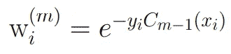

等式 3。训练样本 I 在迭代 m 时的权重(w_i ^m)

> 注意，由于 AdaBoost 算法的步骤 2e 中的权重更新公式，这种关系成立。你可以用 C_0(x) = 1/N 代入方程 1，通过归纳来证明。

## 误差函数的分解

如果我们将其代入等式 2b，我们可以将误差函数表示如下:

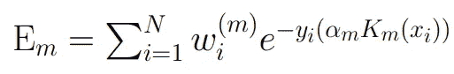

等式 2c。使用等式 3 的误差函数(样本权重)

*   同样，回到前面关于权重更新的部分，我们知道 y_i 和 K_m(x_i)的**乘积将是 1 或-1** ，这分别取决于样本 x_i 是被正确分类**还是被错误分类**。
*   有了这些知识，我们可以说**-y _ I * alpha _ m * K_m(x_i)=-alpha _ m**当 **y_i 等于 K _ m(x _ I)【正确分类】**，
*   或者**-y _ I * alpha _ m * K_m(x_i)= alpha _ m**当 **y_i 不等于 K _ m(x _ I)【分类错误】**。

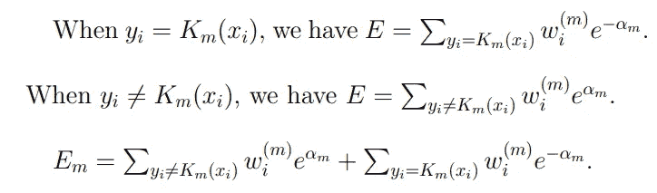

方程式 2d。**错误函数**具有由错误分类和正确分类分别构成的组件

*   因此，我们可以将指数误差分解为包含错误分类数据损失的**分量**和包含正确分类数据损失的**分量。**
*   这分别由等式 2d 表示。

> 对事物进行正确分类的损失/错误有点奇怪，因为通常你不会惩罚正确的分类。
> 
> 但它在 AdaBoost 的误差函数中工作良好，因为只要 alpha_m 大于 0，则-alpha_m 的指数将总是小于 alpha_m 的指数。换句话说，错误分类导致的损失比正确分类导致的损失严重得多。

## 最小化误差函数

与所有机器学习算法一样，我们的目标是*最小化*我们已经建立的误差函数。

**在这种情况下，我们可以简单地使用一阶导数检验来找到使误差函数最小化的 alpha_m 的值。**

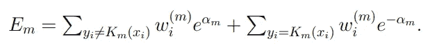

方程式 4a。误差函数的导数

在得到 E w.r.t 的导数之前，让我们用更简单的符号表示方程 2d 中的求和分量。

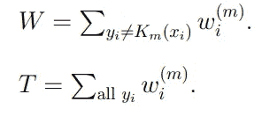

等式 2d 中求和分量的表示

*   w 代表在迭代 m 时所有**错误分类样本**的权重的**总和**
*   t 代表在迭代 m 时所有样本的权重的总和
*   此外，由于我们知道总的权重和包括错误分类和正确分类样本的权重，那么我们可以进一步将**正确分类样本**的权重**和**表示如下:

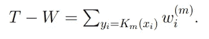

正确分类样本的权重之和的表示

将所有这些重量求和表达式代入方程 2d，然后对 E . w . r . t 对αm 求导，我们得到:

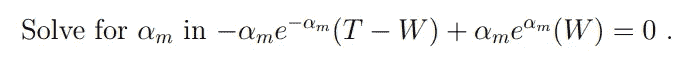

等式 4b。使用 T 和 W 对 E w.r.t 到αm 的导数

## 使 Alpha_m 成为 Alpha 的主语和解释

接下来要做的就是求解αm，把αm 作为方程的主题。我们可以将等式 4b 转化为以下等式:

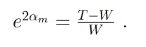

等式 4c。操纵方程 4b，使α_ m 在一边。

至此，我们差不多完成了。我们可以直接取 ln，使αm 成为方程的主体，然而，我们将(T-W)/W 表示为(1-W/T) / (W/T)。之后，我们取ε= W/T，然后最后我们可以让α_ m 成为方程的主体。

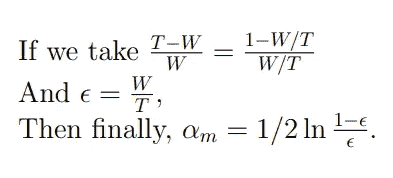

方程式 4d。求解最小化误差函数的α_ m

*   使误差函数最小化的 alpha_m 的最终值就是 AdaBoost 公式第 2d 步中的值。
*   事实证明，ε只是误分类样本的权重之和(W)与样本的权重之和(T)的比值。

> 换句话说，**ε**就是基于样本权重的**误分类百分比。**

*   这进一步意味着用于树桩 m 预测的**权重更新**和**置信度(权重)的 alpha_m 只是一个考虑了错误分类误差的函数。**

α_ m 与ε的关系图

如果我们看一下给定ε值的α_ m 函数的图形，我们可以看到:

*   **大的ε值**，意味着大的误分类百分比，使得 **alpha_m 呈指数下降**。
*   我们对 stump m 的预测的信心也呈指数下降。直觉上这很有意义，因为更多的错误=更少的信心。
*   因此 stump m 的预测在**整体预测**中只会有一个非常**小的**。
*   自然地，对于小的ε值，相反的**随之而来。**

# 4.做出新的整体预测

现在我们已经从数学上直观地理解了 alpha 代表什么，剩下的就是看 AdaBoost 算法的最后一步，即对新数据进行整体预测。

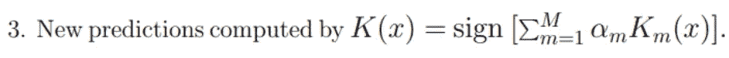

AdaBoost 的步骤 3)

*   我们实际上已经在第 3b 部分的末尾经历了类似的事情。
*   同样，整体预测只是每个树桩预测的总和，由每个树桩的 alpha(AdaBoost 对每个树桩分类数据的能力的信心)加权。
*   我在第 3b 节中遗漏了一个细节，即符号[]部分。这仅仅意味着我们将采用加权和的**符号。**
*   毕竟 AdaBoost 只预测{-1，1}。只要加权和**大于 0** ，那么 AdaBoost 就会**预测 1** 。相反的情况发生，**当加权和小于 0** 时，AdaBoost 将**预测-1** 。

# AdaBoost 概述

至此，恭喜你，因为你现在明白了 AdaBoost 是什么，以及它从数学意义上是如何工作的。

作为坚持到最后的奖励，这里有一个总结来概括本文中的所有信息:

1.  AdaBoost 算法是一种通用的二进制分类算法，其工作原理是将弱学习器组合成强学习器。它最适合决策树的树桩。
2.  *AdaBoost*的第一阶段是**初始化**，在这里我们为采样的数据集初始化权重。
3.  *AdaBoost*的第二阶段是**训练弱分类器**，其中每个分类器被迭代训练，以通过对数据集进行采样从先前分类器的错误中学习，其中较大的权重被分配给错误分类的数据。
4.  *AdaBoost*的阶段 3 是**根据误差计算更新参数，**其中我们计算alpha_m 参数，该参数不仅用于更新下一次迭代(m+1)的权重，还用作分类器 m 预测的权重。
5.  *AdaBoost*的第 4 阶段是**进行新的整体预测，**我们对所有分类器的预测进行求和，然后将其符号作为整体预测{-1，1}。

# 参考

以下是我用来撰写本文的资源列表:

1.  [https://github . com/rohitash-Chandra/dataminingmath 5836/tree/master/week 8](https://github.com/rohitash-chandra/dataminingMATH5836/tree/master/Week8)| |了解 AdaBoost 的大量参考文献
2.  【http://www.inf.fu-berlin.de/inst/ag-ki/adaboost4.pdf】T2| |精湛讲解 AdaBoost
3.  [https://machine learning mastery . com/boosting-and-AdaBoost-for-machine-learning/](https://machinelearningmastery.com/boosting-and-adaboost-for-machine-learning/)| | AdaBoost 入门文章

*感谢阅读我的文章！这是我第一次为一个算法写数学教程，所以我真的很感谢对我的写作的任何反馈(批评，我可以改进的地方，等等)。)关于这一点，请随时评论提问或直接在*[*LinkedIn*](https://www.linkedin.com/in/andrew-william-1507/)*上联系我。*

*同时，我要特别感谢来自 UNSW 的*[*Rohitash Chandra*](https://www.linkedin.com/in/rohitash-chandra/)*博士对我的指导和帮助我了解 AdaBoost。*