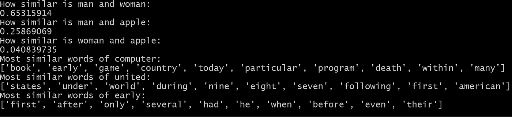

# GloVe 的全面 Python 实现

> 原文：<https://towardsdatascience.com/a-comprehensive-python-implementation-of-glove-c94257c2813d?source=collection_archive---------5----------------------->

## 在单台机器上训练完整的手套模型


照片由 [Cookie 在](https://unsplash.com/@cookiethepom?utm_source=medium&utm_medium=referral) [Unsplash](https://unsplash.com?utm_source=medium&utm_medium=referral) 上的 Pom 拍摄

作为一名 NLP 数据科学家，我经常阅读各种主题的论文，包括单词向量、rnn 和变压器。看论文很好玩，给我一种掌握了广泛技术的错觉。但是在复制它们的时候，困难出现了。据我所知，很多 NLP 学习者都碰到过和我一样的情况。因此，我决定开始一系列的文章，集中讨论如何实现经典的 NLP 论文。为此，我还创建了 GitHub 库 T4。

本帖是本系列的第一篇，根据原纸再现手套模型。如前所述，重点纯粹在于实现。关于底层理论的更多信息，请参考[原文](https://nlp.stanford.edu/pubs/glove.pdf)。

根据这篇论文，手套模型是用单台机器训练的。[发布的代码](https://github.com/stanfordnlp/GloVe)是用 C 写的，对于 NLP 学习者来说可能有些陌生。因此，我对该模型进行了全面的 Python 实现，这符合只用一台机器训练大量词汇的目标。下面几节将逐步介绍实现细节。完整代码是[这里是](https://github.com/pengyan510/nlp-paper-implementation/tree/master/glove)。

# 第 0 步:准备

## 培训用数据

对于这个项目，我使用 [Text8 数据集](http://mattmahoney.net/dc/textdata.html)作为训练数据。要获得它，我们可以使用 gensim 下载器:

```
import gensim.downloader as apidataset = api.load("text8")
```

数据集是一个列表的列表，其中每个子列表是一个代表一个句子的单词列表。我们只想要所有单词的列表，所以用 itertools 将其展平:

```
import itertoolscorpus = list(itertools.chain.from_iterable(dataset))
```

好了，现在我们有了训练语料。

## 存储参数

在处理机器学习模型时，总是有大量的参数需要配置，如数据文件路径、批量大小、单词嵌入大小等。如果管理不好，这些参数会产生大量开销。根据我的经验，我发现最好的方法是将它们都存储在一个名为 config.yaml 的 yaml 文件中。

从 config.yaml 加载配置的代码段

然后对于代码的其余部分，我们可以使用参数 config.batch_size、config.learning_rate 来代替硬编码的值，这也使代码更好。

这就是所有需要的准备工作。让我们开始手套模型的实际两步训练吧！

# 步骤 1:计算共现配对

## 创造词汇

为了统计共现对，我们首先需要确定词汇。以下是对词汇表的一些要求:

*   它是出现在语料库中的一组标记。
*   每个令牌都映射到一个整数。
*   如果一个标记不属于语料库，它应该被表示为一个未知标记，或“unk”。
*   为了对共现对进行计数，只需要记号的子集，例如前 k 个最频繁的记号。

为了以结构化的方式满足这些需求，创建了一个词汇表类。该类有四个字段:

*   **token2index:** 将令牌映射到索引的字典。索引从 0 开始，每次添加一个以前看不到的令牌时递增 1。
*   **index2token:** 将索引映射到令牌的字典。
*   **token_counts:** 一个列表，其中 *i* th 值是索引为 *i.* 的令牌的计数
*   **_unk_token:** 一个整数，用作未知令牌的索引。默认值为-1。

它还定义了以下方法:

*   **add(token):** 向词汇表中添加一个新的 token。如果以前未见过，则会生成一个新的索引。令牌的计数也会更新。
*   **get_index(token):** 返回令牌的索引。
*   **get_token(index):** 返回索引对应的令牌。
*   **get_topk_subset(k):** 用前 k 个最频繁出现的标记创建一个新词汇。
*   **shuffle():** 随机打乱所有的记号，使得记号和索引之间的映射被随机化。需要这种方法的原因将在我们实际计算共现配对时揭示。

了解了这一点，我们现在可以看看代码:

词汇课

对于类的实现，我利用了 Python 的 dataclass 特性。有了这个特性，我只需要定义带类型注释的字段，就会自动为我生成 __init__()方法。我还可以在定义字段时为它们设置默认值。例如，通过设置 default_factory=dict，token2index 默认为一个空 dict。有关 dataclass 的更多信息，请参考官方文档。

现在我们有了词汇课，剩下的问题是:我们如何使用它？基本上有两种用例:

*   从语料库中创建一个词汇表，该词汇表由前 k 个最频繁出现的标记组成。
*   在对共现对进行计数时，使用创建的词汇表将语料库(一个标记列表)转换为整数索引。

我创建了另一个类，矢量器，来协调这两个用例。它只有一个字段， **vocab** ，指的是从语料库中创建的词汇。它有两种方法:

*   **from_corpus(corpus，vocab_size):** 这是一个类方法。首先，通过添加语料库中的所有标记来创建词汇表。然后，选择顶部最频繁出现的单词来创建新词汇。这个词汇表被打乱并用于实例化矢量器实例。洗牌的原因后面会解释。
*   **向量化(语料库):**将给定的语料库(一列标记)转换成一列索引。

完整代码如下:

矢量器类

## 扫描上下文窗口

现在我们有了将所有单词转换成索引的矢量器，剩下的任务是扫描所有的上下文窗口并计算所有可能的共现对。因为共生矩阵是稀疏的，所以使用计数器来计数配对是合理的。关键是(单词 *i* 的索引，单词 *j* 的索引)，其中单词 *j* 出现在单词 *i* 的上下文中。该值是表示计数的浮点数。但是，如果使用这种策略，可能会出现两个问题。

**问题 1:如果我们在一次扫描中计算所有同时出现的对，我们可能会耗尽内存，因为不同的数量(单词 *i* 的索引，单词 *j* 的索引)可能非常大。**

**解决方案:**相反，我们可以在多次扫描中计数同时出现的配对。在每次扫描中，我们将单词 *i* 的索引限制在一个小范围内，从而大大减少了不同对的数量。假设词汇表有 100，000 个不同的标记。如果我们在一次扫描中计数所有的对，不同对的数量可以多达 10 个⁰.相反，我们可以在 10 次扫描中计数所有对。在第一次扫描中，我们将 word *i* 的索引限制在 0 到 9999 之间；在第二次扫描中，我们将其限制在 10000 和 19999 之间；在第三次扫描中，我们将其限制在 20000 到 29999 之间，以此类推。每次扫描完成后，我们将计数保存到磁盘。现在，在每次扫描中，不同对的数量可以和 10⁹一样大，是原始数量的十分之一。

这种方法背后的思想是，我们不是在一次扫描中计算整个共生矩阵，而是将矩阵分成 10 个更小的矩形，然后依次计算它们。下图形象化了这个想法。


左:一次扫描计数|右:多次扫描计数

这种方法是可扩展的，因为随着词汇表大小的增加，我们总是可以增加扫描次数来减少内存使用。主要缺点是，如果使用单台机器，运行时间也会增加。然而，由于扫描之间没有依赖关系，因此可以使用 Spark 轻松实现并行化。但是这超出了我们的范围。

同样，在这一点上，洗牌的原因可以被揭开。当我们创建具有最频繁记号的词汇表时，这些记号的索引是有序的。索引 0 对应最频繁的令牌，索引 1 对应第二频繁的令牌，等等。如果我们继续 100，000 个令牌的示例，在第一次扫描中，我们将计数 10000 个最频繁的令牌对，不同对的数量将是巨大的。而在剩余的扫描中，不同对的数量会小得多。这导致扫描之间的内存使用不平衡。通过改变词汇表，不同的词汇对在扫描中均匀分布，并且平衡了内存使用。

**问题 2:从问题 1 的解决方案继续，我们如何将每次扫描的计数保存到磁盘？最明显的方法是在扫描之间将(单词 *i* 的索引，单词 *j* 的索引，计数)三元组写入一个共享的文本文件。但是以后使用这个文件进行训练会涉及太多的开销。**

**解决方案:**有一个 python 库，h5py，提供了到 HDF5 二进制格式的 python 接口。它使您能够存储大量的数字数据，并轻松地操作它们，就像它们是真正的 NumPy 数组一样。关于这个库的更多细节，请查看它的[文档](https://docs.h5py.org/en/stable/)。

和以前一样，我创建了一个 CooccurrenceEntries 类，它使用建议的解决方案进行计数并将结果保存到磁盘。该类有两个字段:

*   **矢量器:**从语料库中创建的矢量器实例。
*   **矢量化 _ 语料库:**单词索引列表。这是使用矢量器对原始语料库(单词列表)进行矢量化的结果。

它有两种主要方法:

*   **setup(corpus，vectorizer):** 这是一个用于创建 CooccurrenceEntries 实例的类方法。通过在语料库上调用矢量器的矢量化方法来生成矢量化 _ 语料库。
*   **build(window_size，num_partitions，chunk_size，output_directory= " . "):**该方法统计 num_partitions 扫描中同时出现的对，并将结果写入输出目录。chunk_size 参数用于使用 HDF5 格式将数据保存在块中。分块保存的原因将在模型训练部分讨论。简而言之，它用于更快地生成训练批次。

实现如下:

CooccurrenceEntrie class

通过抽象词汇、矢量器、共现条目，计算共现对并保存到磁盘的代码很简单:

用于创建培训数据的代码段

# 第二步。训练手套模型

## 从 HDF5 数据集加载批次

我们首先需要批量加载 HDF5 数据集中的数据。因为数据可以像存储在 NumPy 矩阵中一样被检索，所以最简单的方法是使用 PyTorch 数据加载器。但是加载每一批都涉及到许多 dataset[i]形式的调用，其中 dataset 是一个 h5py。数据集实例。这涉及到许多 IO 调用，可能会非常慢。

解决方法是加载 h5py。数据集逐块存储到内存中。每个加载的块都是内存中的一个纯 NumPy ndarray，所以我们可以使用 PyTorch 的 Dataloader 对它进行批处理迭代。现在，所需的 IO 调用数量等于块的数量，这要小得多。

这种方法的一个缺点是完全随机的混洗是不可能的，因为包含来自不同区块的数据的批将永远不会生成。因此，为了获得更大的随机性，我们可以以随机顺序加载块，并将 DataLoader 的 shuffle 参数设置为 True。

创建 HDF5DataLoader 类是为了加载批处理。它有五个字段:

*   **file path:**HD F5 文件的路径。
*   **数据集 _ 名称:**h5py 的名称。文件中的数据集。
*   **批量大小:**训练批量大小。
*   **设备:**训练设备，可以是 cpu 或 gpu。
*   **数据集:**h5py。文件中的数据集实例。

它有两种方法:

*   **open():** 这个方法打开 HDF5 文件并定位数据集。实际的阅读并不发生在这里。
*   **iter_batches():** 该方法以随机顺序加载块，并创建 PyTorch 数据加载器来迭代块中的批。

代码如下所示。需要注意的一点是，CooccurrenceDataset 只是 PyTorch 数据集的一个子类，用于索引数据。因为没什么特别的，所以省略了。

HDF5DataLoader 类

## 编码手套模型

用 PyTorch 实现手套模型很简单。我们在 __init__()中定义了两个权重矩阵和两个偏置向量。注意，我们在创建嵌入时设置 sparse=True，因为梯度更新本质上是稀疏的。在 forward()中，返回平均批次损失。

手套班

## 训练手套模型

模型训练遵循标准 PyTorch 训练程序。唯一不同的是，我们使用定制的 HDF5Loader 来生成批处理，而不是 PyTorch 的 DataLoader。以下是培训代码:

模型定型的代码段

唷，我们已经完成了完整的实现。恭喜你！

接下来，我们来训练模型，看看结果！

# 第三步。结果

对于 Text8 数据集，训练一个历元大约需要 80 分钟。我为这个模型训练了 20 个纪元，花了不止一天的时间来完成。学习曲线看起来很有希望，如果培训继续下去，损失似乎会进一步减少。


学习曲线图

我们也可以做一些单词相似度的任务，看看单词向量是如何表现的。在这里，我使用了 gensim 的 KeyedVectors 类，它允许您在不编写最近邻或余弦相似性代码的情况下做到这一点。这里的相似度评价码是。有关 KeyedVectors 的详细信息，请参考[文档](https://radimrehurek.com/gensim/models/keyedvectors.html#what-can-i-do-with-word-vectors)。

运行一些简单的相似性任务会显示以下结果:



一些简单相似性任务的结果

正如我们所看到的，其中一些是有意义的，如“计算机”和“游戏”，“联合”和“国家”；有些人没有。但这足以说明问题。在更大的数据集上进行更多时期的训练应该会改善结果。

# 摘要

手套纸写得很好，很好理解。然而，当谈到实现时，一路上有许多陷阱和困难，尤其是当您考虑到内存问题时。经过相当大的努力，我们最终得到了一个令人满意的在单台机器上训练的解决方案。

正如我在开始时所说，我将继续实施更多的 NLP 文件，并与您分享我的第一手经验。希望你喜欢手套的实现，并在下一个帖子中看到你！