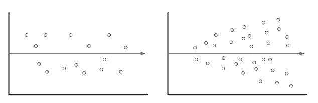
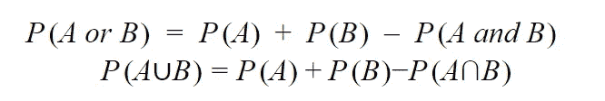
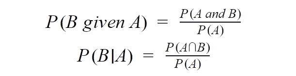
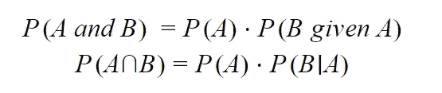
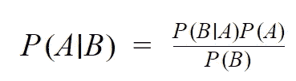
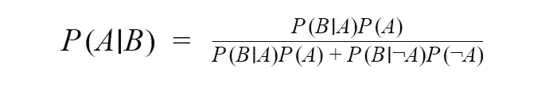

# 数据科学面试综合统计和概率备忘单

> 原文：<https://towardsdatascience.com/a-comprehensive-statistics-and-probability-cheat-sheet-for-data-science-interviews-547b201345b9?source=collection_archive---------4----------------------->

## 统计和概率的重要术语和方程

[绿色变色龙](https://unsplash.com/@craftedbygc?utm_source=unsplash&utm_medium=referral&utm_content=creditCopyText)在 [Unsplash](/s/photos/study?utm_source=unsplash&utm_medium=referral&utm_content=creditCopyText) 上的照片

> **请务必点击** [**订阅此处**](https://terenceshin.medium.com/membership) **或我的** [**个人简讯**](https://terenceshin.substack.com/embed) **千万不要错过另一篇关于数据科学指南、技巧和提示、生活经验等的文章！**

# 目录

1.  关于此资源
2.  置信区间
3.  z 统计量与 T 统计量
4.  假设检验
5.  A/B 测试
6.  线性回归
7.  概率规则
8.  贝叶斯定理
9.  面试练习题

# 关于此资源

当我申请数据科学工作时，我注意到需要一个全面的统计和概率备忘单，它超出了统计学的基本原理(如均值/中值/众数)。

因此，[**strata scratch**](https://platform.stratascratch.com/?utm_source=blog&utm_medium=click&utm_campaign=terenceshin&utm_content=statistics-interview-questions-article)的创始人[内森·罗西迪](https://medium.com/u/ab636cbf3611?source=post_page-----547b201345b9--------------------------------)和我合作报道了数据科学采访中常见的最重要的话题。这些主题更侧重于统计方法，而不是基本的属性和概念，这意味着它涵盖了在现实生活中更实际和适用的主题。

说到这里，我希望你喜欢它！

# 置信区间

**置信区间**表示很可能包含感兴趣参数的数值范围。

例如，假设您抽样调查了 5 位客户，他们对您的产品的平均评分为 3.5 分(满分为 5 颗星)。您可以使用置信区间来确定基于此样本统计的总体均值(所有客户的平均评级)。

## 平均值的置信区间(n ≥ 30)

## 平均值的置信区间(n < 30)

## 比例的置信区间

# 假设检验

假设检验用于确定对于给定的数据样本，某个假设的可能性有多大。从技术上讲，假设检验是一种将样本数据集与总体数据进行比较的方法。

以下是执行假设检验的步骤:

1.  陈述你的无效假设和替代假设。*重申一下，零假设通常是指一切都和往常一样——没有任何变化。*
2.  设置你的重要性等级，阿尔法值。*这通常设置为 5%，但也可以根据情况和犯 1 型和/或 2 型错误的严重程度设置为其他水平。*
3.  收集样本数据并计算样本统计量(z 统计量或 t 统计量)
4.  计算给定样本统计的 p 值。*一旦获得样本统计数据，就可以通过不同的方法确定 p 值。最常用的方法是正态分布的 T 得分和 Z 得分。点击* *了解更多 T-score 和 Z-score* [*。*](https://www.statisticshowto.datasciencecentral.com/probability-and-statistics/hypothesis-testing/t-score-vs-z-score/)
5.  拒绝或不拒绝零假设。

> 你可以在这里测试你关于假设检验、置信区间和一般统计的知识[！](https://platform.stratascratch.com/?utm_source=blog&utm_medium=click&utm_campaign=terenceshin&utm_content=statistics-interview-questions-article)

> **请务必** [**订阅此处**](https://terenceshin.medium.com/membership) **或我的** [**个人简讯**](https://terenceshin.substack.com/embed) **千万不要错过另一篇关于数据科学指南、技巧和提示、生活经验等的文章！**

# z 统计与 T 统计

知道 z 统计量和 T 统计量是很重要的，因为它们是执行假设检验的步骤中的步骤 3 所必需的(见上文)。

**Z-检验**是一种使用**Z-统计量**的正态分布假设检验。当您知道总体方差或不知道总体方差但样本量很大时，可以使用 z 检验。

**T 检验**是一种假设检验，其 t 分布使用了 **t 统计量**。当不知道总体方差并且样本量很小时，可以使用 t 检验。您还需要将 t 统计量转换为 p 值的自由度。

作者创建的图像

# A/B 测试

作者创建的图像

从最简单的意义上来说，A/B 测试是对两个变量进行的实验，根据给定的度量标准来看哪一个表现更好。从技术上讲，A/B 检验是双样本假设检验的一种形式，这是一种确定两个样本之间的差异是否具有统计显著性的方法。

进行 A/B 检验的步骤与假设检验完全相同，只是根据 A/B 检验的类型，p 值的计算方式不同。

进行的 A/B 测试的类型取决于许多因素，我将在下面介绍这些因素:

*注意:我不会涉及这些测试背后的数学，但可以随意查看 Francesco 关于 A/B 测试的文章***。**

## ***费希尔精确检验***

*Fisher 测试用于测试离散指标，如点击率(1 表示是，0 表示否)。使用 Fisher's 检验，您可以计算精确的 p 值，但是对于大样本量来说，这种方法的计算成本很高。*

## ***皮尔逊卡方检验***

*当样本量过大时，卡方检验是费雪检验的替代方法。它还用于测试离散指标。*

## ***学生的 t 检验***

*我包括了 t 检验，但没有包括 z 检验，因为 z 检验在现实中通常是不切实际的，因为总体标准偏差通常是未知的。然而，由于我们可以得到样本标准差，t 检验是合适的。*

*它可以在样本量较大(或观测值呈正态分布)，且两个样本具有相似方差的条件下使用。*

## ***韦尔奇试验***

*韦尔奇的 t 检验与学生的 t 检验本质上是一样的，只是当两个样本**没有**相似的方差时使用。在这种情况下，可以使用韦尔奇检验。*

## ***曼-惠特尼 U 检验***

*Mann-Whitney 检验是一种非参数检验，仅在违反所有先前检验的所有假设时使用。例如，如果您的样本量很小，并且分布不是正态分布，则曼-惠特尼检验可能是合适的。*

*要了解如何在 Python 中进行这些测试，请查看这个 [*库*](https://github.com/FrancescoCasalegno/AB_Testing/blob/main/AB_Testing.ipynb) *。**

# *线性回归*

## *什么是回归？*

***回归**简单来说就是估计一个或多个自变量(x)和因变量(y)之间关系的统计方法。简而言之，它包括找到代表两个或更多变量的“最佳拟合线”。*

**

*作者创建的图像*

*通过最小化点和最佳拟合线之间的平方距离来找到最佳拟合线，这被称为**最小二乘回归**。一个**残差**简单地等于预测值减去实际值。*

## *残差分析*

*可以进行**残差分析**来评估模型的质量，也可以识别异常值。一个好的模型应该有一个**同方差残差**图，这意味着误差值总体上是一致的。*

**

*同方差图(左)与异方差图(右)*

## ***变量选择***

*两种非常简单和常见的变量选择方法是**向后消除**(一次删除一个变量)或**向前选择**(一次添加一个变量)。*

*您可以通过计算变量的 p 值来评估变量在模型中是否重要。一般来说，好的变量的 p 值小于或等于 0.05。*

## *模型评估*

*为了评估一个回归模型，您可以计算它的 **R 平方**，它告诉我们模型在数据中占了多大的可变性。例如，如果一个模型的 R 平方为 80%，那么数据中 80%的变化可以由该模型来解释。*

***调整后的 R 平方值**是 R 平方值的修改版本，用于调整模型中预测值的数量；如果新项对模型的改进超过偶然的预期，那么它就会增加，反之亦然。*

## ***要避免的 3 个常见陷阱***

1.  ***过度拟合**:过度拟合是一种错误，模型“拟合”数据太好，导致模型具有高方差和低偏差。因此，过度拟合模型将会不准确地预测新的数据点，即使它对训练数据具有高的准确性。当模型中有太多独立变量时，通常会发生这种情况。*
2.  ***共线性**:这是一个模型中的两个自变量相互关联，最终降低了模型的准确性。*
3.  ***混杂变量**:混杂变量是指不包含在模型中，但同时影响自变量和因变量的变量。*

# *概率规则*

*有几个基本属性和四个概率规则你应该知道。这些概率规则是更复杂(但仍然是基本的)方程的基础，如贝叶斯定理，这将在后面介绍。*

**注意:这并不审查联合概率、事件的联合或事件的交集。如果您不知道这些是什么，请事先复习一下。**

## *基本属性*

1.  *每个概率都在 0 到 1 之间。*
2.  *所有可能结果的概率之和等于 1。*
3.  *如果一个事件是不可能的，那么它的概率为 0。*
4.  *相反，某些事件的概率为 1。*

## *四个概率规则*

***1。加法规则***

**

***2。补充规则***

**

***3。条件规则***

**

***4。乘法法则***

**

**要练习使用这些方程式，可以查看* [*这个资源*](http://www.milefoot.com/math/stat/prob-rules.htm) *。**

# *贝叶斯定理*

*贝叶斯定理是一个条件概率陈述，本质上它着眼于一个事件(B)发生的概率，假设另一个事件(A)已经发生。公式如下:*

**

*   *P(A)是**先验，**是 A 为真的概率。*
*   *P(B|A)是**可能性**，给定 A，B 为真的概率。*
*   *P(B)是**边缘化**还是**正常化常数***
*   *P(A|B)是**后验。***

*你会在很多实际问题中发现，归一化常数 P(B)是没有给定的。在这些情况下，您可以使用贝叶斯定理的替代版本，如下所示:*

**

**为了更好地理解贝叶斯定理并跟随一些练习题，请查看* [*这里*](https://brilliant.org/wiki/bayes-theorem/#:~:text=Bayes'%20theorem%20is%20a%20formula,of%20problems%20involving%20belief%20updates.) *。**

# *组合和排列*

*组合和排列是从集合中选择对象以形成子集的两种略有不同的方式。排列会考虑子集的顺序，而组合则不会。*

*如果你从事网络安全、模式分析、运筹学等工作，组合和排列是非常重要的。让我们更详细地回顾一下这两者中的每一个:*

## *排列*

***定义:**n 个元素的排列是这 n 个元素以**确定顺序**的任意排列。有 n 个阶乘(n！)排列 n 个元素的方式。注意粗体字:顺序很重要！*

***一次取 r 的 n 个事物的排列数**被定义为可以从 n 个不同元素中取出的 r 元组的数目，并且等于以下等式:*

**

**例题:一个 6 位数的车牌有多少种排列？**

**

## *组合*

*定义:在**顺序不重要**的情况下，从 n 个对象中选择 r 的方式的数量。*

***一次取 r 的 n 个事物的组合数**被定义为一个具有 n 个元素的集合中具有 r 个元素的子集的数目，并且等于以下等式:*

**

**例题:从一副 52 张牌中抽出 6 张牌有多少种方法？**

**

*请注意，这些都是非常非常简单的问题，可能会比这复杂得多，但是您应该很清楚上面的例子是如何工作的！*

# *面试练习题*

*如果你已经做到了这一步，这里有一些资源可以用来测试你的知识:*

*   *[**StrataScratch**](https://platform.stratascratch.com/?utm_source=blog&utm_medium=click&utm_campaign=terenceshin&utm_content=statistics-interview-questions-article) 本质上是 LeetCode 但对于数据科学来说。它有数百个关于统计、Python、Pandas 和 SQL 的问题。StrataScratch 的创始人内森帮我策划和开发了这个速成班，这并不奇怪。*
*   *如果你还没有看，我之前写了一篇文章“数据科学家的 50 个统计面试问题和答案”我鼓励你去看。*

> ***请务必点击** [**订阅此处**](https://terenceshin.medium.com/membership) **或我的** [**个人简讯**](https://terenceshin.substack.com/embed) **千万不要错过另一篇关于数据科学指南、技巧和提示、生活经验等的文章！***

# *感谢阅读！*

*如果你坚持到了最后，恭喜你！我希望这有助于你更新和修补你的统计知识。我知道有很多东西要记，但是你用得越频繁，就越不容易丢失。*

*一如既往，我祝你在数据科学的努力中一切顺利。如果你喜欢这篇文章，我会很感激你给我一个关注！:)*

*再次特别感谢内森·罗西迪。你可以去看看他的网站，StrataScratch， [**这里**](https://platform.stratascratch.com/?utm_source=blog&utm_medium=click&utm_campaign=terenceshin&utm_content=statistics-interview-questions-article) **。***

*不确定接下来要读什么？我为你选了另一篇文章:*

* [## 2021 年数据科学家的 50+统计面试问题和答案

### 一个更新的资源，为你的面试刷统计知识！

towardsdatascience.com](/50-statistics-interview-questions-and-answers-for-data-scientists-for-2021-24f886221271) 

**又一个！**

 [## 2021 年成为数据科学家的完整 52 周课程

### 连续 52 周，每周学点东西！

towardsdatascience.com](/a-complete-52-week-curriculum-to-become-a-data-scientist-in-2021-2b5fc77bd160) 

# 特伦斯·申

*   ***如果你喜欢这个，*** [***跟我上媒***](https://medium.com/@terenceshin) ***了解更多***
*   ***有兴趣合作吗？让我们连线上***[***LinkedIn***](https://www.linkedin.com/in/terenceshin/)
*   ***报名我的邮箱列表*** [***这里***](https://forms.gle/tprRyQxDC5UjhXpN6) ***！****