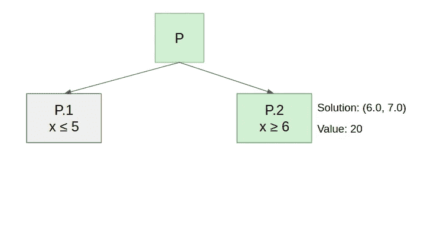

# Julia 上带跳转的混合整数规划综合研究(上)

> 原文：<https://towardsdatascience.com/a-comprehensive-study-of-mixed-integer-programming-with-jump-on-julia-part-1-8d47418324d4?source=collection_archive---------13----------------------->

## [实践教程](https://towardsdatascience.com/tagged/hands-on-tutorials)

## 线性/混合整数编程的一些基础&如何在 MIP 求解器中使用启发式回调。


由[安托万·道特里](https://unsplash.com/@antoine1003?utm_source=medium&utm_medium=referral)在 [Unsplash](https://unsplash.com?utm_source=medium&utm_medium=referral) 上拍摄的照片

# 介绍

计算机科学和运筹学的主要目的之一是有效地解决问题；问题解决是一个我们经常发现非常“特别”的解决方法的领域，它们可能是有效的，但是它们依赖于问题的一些不一定容易注意到的特定属性。

在这一系列的文章中，我们将介绍并发现一种非常通用的思维方式和解决各种问题的方法，这种介绍将从三个方面进行:

*   在理论观点上，我们将研究线性规划和混合整数规划如何帮助我们建模大的组合问题。
*   在实践方面，我们将看到如何使用 API 实例化一个线性程序，并利用我们解决的一些问题来提高求解过程的效率。
*   最后，从操作的角度来看，我们将发现一种非常新的、高效的和用户友好的语言:Julia，更准确地说，我们将发现一个库:JuMP，一种用于数学优化的领域特定的建模语言。

这一系列的文章并没有假设朱莉娅的背景；我认为 Python 背景足以理解我将使用的代码片段。

# 这个帖子是关于什么的

这篇文章是这个系列的先导，但它也将是它的起点，给你了解可以用来解决大型组合问题的实用技术所需的背景知识。

这也将是我们唯一一篇将纯理论学术问题作为简单应用的文章。

尽管如此，如果你熟悉混合整数编程，这篇文章(更一般地说，这个系列)是一个很好的机会来看看如何使用 Julia，更准确地说，**如何用一些接近的方法调整你的精确求解过程。**

# 顺利介绍线性规划(和朱莉娅)

让我们首先介绍线性程序是如何构造的，以及求解器将如何执行求解。为了做到这一点，我们将通过一个简单的例子。

为了使它可视化，我们将举一个例子，在这个例子中，我们将尝试针对一组线性约束来优化两个变量的线性函数。


几何上，如果我们取每一个约束，用等式代替不等式，那么每一个约束都将是一个线方程。这条线会把 R 分成两部分，根据不等式的方向使其中一部分无效。

我们将命名由约束集界定的多面体，在这种情况下，它是多面体，因为它是封闭的和有界的，约束的多面体(或多面体)。

作为对 Julia 的热身，让我们看看如何使用 plot.jl 绘制约束的多面体，plot . JL 是一个“类似 matplotlib”的框架，包 LinearAlgebra 类似于 NumPy。

首先，我们使用 Pkg，它是 Julia 的内置包管理器，来添加所需的包，

```
using Pkg;
Pkg.add("LinearAlgebra");
Pkg.add("Plots");
Pkg.add("PyPlot");
```

添加后，我们可以导入它们。

```
using LinearAlgebra
using Plots
pyplot()
```

最后一行旨在完成一些可视化的封装图功能(查看文档[此处](https://docs.juliaplots.org/latest/tutorial/)了解更多细节)。

绘制任何函数的一个简单方法是采样点并计算相关图像，这可以在 Julia 中通过以下方式完成:

```
x_v = LinRange(-2,15,100)
plot([x_v], [x_v .+ 7.5], label ="Y=x + 7.5")
plot!([x_v], [-2x_v .+ 20], label ="Y= -2x + 20")
```

第一行将从区间[-2，15]中采样 100 个点；这其中的一部分；您需要注意几件事情:

*   “剧情”是用来打造线剧情和剧情的！更新创建的地块。
*   ".+"是向量加法的元素等价形式。
*   Julia 非常方便，即使对于向量，也可以省略系数和变量之间的“*”。

这几行将产生以下情节:


插图(由我绘制)

现在让我们打印约束的多面体:

```
x_v = LinRange(-2,15,100)
y_v = LinRange(-2,15,100)
plot([0*x_v], [y_v],label ="Y Axis")
plot!([x_v], [0*x_v],label ="X Axis")
plot!([x_v], [0*x_v .+ 7.5], label ="Y=7.5")
plot!([0*x_v .+ 10], [y_v],label ="X=10")
plot!(title = "Polytop of Constraints")
```


插图(由我绘制)

我添加到图中的灰色区域代表空间的一部分，它满足问题的约束。

现在让我们通过查看向量(1，2)来关注目标函数，向量(1，2)表示线性函数 x+2y 的梯度。


插图(由我绘制)

我添加的每条线都代表一行值相同的点。在梯度方向上走得越远，目标值就变得越大。

我们可以直观地得出结论，最佳解决方案在绿色和粉色线的交点处，所以让我们看看是否使用 JuMP 找到了这个结果。

传统的添加/导入行(我们将使用 GLPK 作为求解器，但没有什么依赖于它)。

```
Pkg.add("JuMP")
Pkg.add("GLPK")
using JuMP
using GLPK
```

现在我们声明我们的模型，并从 GLPK 设置优化器:

```
prgrm = Model()
set_optimizer(prgrm, GLPK.Optimizer)
```

我们添加变量并精确它们的范围；默认情况下，变量是连续的:

```
[@variable](http://twitter.com/variable)(prgrm, 0<=x)
[@variable](http://twitter.com/variable)(prgrm, 0<=y)
```

现在我们创建并添加剩下的两个约束；前两个在变量的范围内；

```
[@constraint](http://twitter.com/constraint)(prgrm, x <= 10)
[@constraint](http://twitter.com/constraint)(prgrm, y <= 7.5)
```

最后，我们添加目标函数和精确意义上的优化，在这种情况下，这将是最大化:

```
[@objective](http://twitter.com/objective)(prgrm, Max, x+2y)
```

JuMP 的一个有趣的特性，特别是当它与 Jupyter-notebook 一起使用时，我们可以像打印任何变量的内容一样轻松地打印程序，这给了我们以下输出:


现在解决这个问题说起来容易做起来难:

```
optimize!(prgrm)
```

之后，我们可以像这样访问优化后的变量值:

```
value.(x)
value.(y)
```

因此，我们可以更新我们的先例图，以确认我们的图形分辨率与线:

```
plot!([value.(x)], [value.(y)], seriestype = :scatter, label="Optimum")
```

这给了我们:


插图(由我绘制)

# 单纯形原理

求解线性规划是通过单纯形算法完成的，这是因为一个简单但重要的原理:

> 在多面体(或更一般的紧凸空间)上优化一个线性函数总是把我们带到一个顶点(更一般的是一个极值点)。

单纯形算法是一种局部搜索过程，它从一个顶点走到另一个顶点以增加目标函数值，直到我们到达一个顶点，在该顶点处每个邻居都具有较低值。

由于优化结束的顶点只取决于目标函数，我们可以尝试为每个多面体顶点找到一个目标函数。

例如，在下面的多面体中(注意，我们添加了一个约束来增加多面体的顶点数)


插图(由我绘制)

我们可以通过不同方向的优化获得任意顶点。


插图(由我绘制)

# 从连续变量到整数变量:分枝定界法

即使这不完全是求解器的工作方式，你首先要理解混合整数编程的工作方式是分支定界法。

让我们举一个先例，但是把变量限制为整数；可行域不再是多面体内部的灰色区域。尽管如此，我们可以计算可行的整数点，这给了我们下图:


插图(由我绘制)

在灰色中，我们可以看到可行的解决方案，我们可以注意到的第一件事是，一些顶点在整数解中，一些不在整数解中，这种区分是至关重要的，但我们稍后会回到这一点。

分支和绑定过程创建一个称为“枚举树”的树；在每个节点中，它构造一个混合整数规划，并用单纯形算法求解其“线性松弛”，这意味着忽略完整性约束后的同一个规划，从这一点出发，有两种可能的结果:

*   解决方案是整数可行的，因此我们停止决议。

如果约束的多面体有整数顶点，就会发生这种情况。例如，如果我们用目标函数 2x+y 求解前面的混合整数规划的 LP 松弛，我们将发现(10，3)，这是一个整数解。

*   解决方案是“分数”，因此我们需要**分支。**

如果我们试图优化函数 x+2y，这将发生在前面的多面体中，


插图(由我绘制)

现在，让我们看看如何处理这种情况。

## **分支:**

分支是指在枚举树中创建子节点；这些孩子是相同的问题，但是在可行空间的两个分区上解决。

这两个分区是通过**添加一个分支约束得到的。**

由于一个例子胜过千言万语，对于前面的分数解(5.5，7.5)，我们可以选择我们可以分支的变量。如果我们的解中有一个整数和一个分数分量，我们应该分支到分数分量，比如说，我们将分支到 x，所以我们在每个子节点中添加一个约束，

*   第一个子节点将具有约束 x ≤ 5


插图(由我绘制)

*   第二个将继承约束 x≥6


插图(由我绘制)

正如您所注意到的，这些约束的目的是，在每种情况下，排除或**切割分数解**(您将在本系列的另一部分中发现为什么它是粗体的:)

这最后一个孩子的放松给了我们下面的解决方案。


插图(由我绘制)

红色的解是:(6.0，7.0)整数可行解。

那么，我们结束了吗？良好的..不完全是。

让我们回顾一下我们的枚举树。



插图(由我绘制)

正如我们所看到的，我们只解决了树的三个节点中的两个；然后，我们要求解 P.1 的线性松弛。


插图(由我绘制)

松弛给了我们一个分数解:(5.0，7.5)这意味着如果我们在 y 上分支，枚举树会变成这样。


插图(由我绘制)

为什么我要说会？这个算法的名字是品牌绑定的，到目前为止，我们只是分支，所以现在我们来看看如何绑定。

## **跳跃:**

边界或“探测”过程包括移除树的一个分支，假设我们有一个我们能在其中找到的值的上界(最大化)。

为了有这个上限，我们将引入另一个直观而重要的原理:

> LP 的松弛值是其价值的上界。

这很直观，因为松弛的可行域包含了原程序的可行域。

因此，当我们求解 P.1 并获得值为 20 的分数解时，我们确信在根为 P.1 的子树中，我们不会找到任何值大于 20 的解，因为我们已经有了值为 20 的整数解，我们可以**探测**树的这一部分，之后，我们就完成了。

## **使用规划求解器自动完成这一切:**

你们都应该记住的第一个问题是:“每次我必须解决一个 MIP 时，我都要这样做吗？”答案当然是，不，我必须精确地确定变量是整数，求解器会为我们完成这项工作(以及其他工作)。

```
[@variable](http://twitter.com/variable)(prgrm, 0<=x, Int)
[@variable](http://twitter.com/variable)(prgrm, 0<=y, Int)
```

但是你们中最细心的人肯定想知道，如果求解器，在构造枚举树的时候，是从另一个孩子开始的，而这个孩子没有立刻给我们一个整数解呢？

这提出了许多关于如何分支以及如何探索枚举树的问题，但是您可能关注的主要问题是。

> **我们越早获得整数解，最好是剪枝子树**。

但是既然求解者是在内部做这件事，那么理解这一点(以及所有这部分)的目的是什么呢？这是我们将在下面看到的:)

# 在求解器中使用自制试探法

在很多大型组合问题中，求解器可能找不到整数解，所以它的枚举树一直呈指数增长。

幸运的是，许多组合问题有简单的(通常是贪婪的)试探法，可以快速计算出一个可行的解，因此是一个整数解。

通常使用的解算器为我们提供了一个计算和提交**启发式解的界面；这个**的目的是给算法一个整数解来执行探测。

让我们试着把这个应用到一个非常经典的例子: [**顶点覆盖问题。**](https://en.wikipedia.org/wiki/Vertex_cover)

> 无向图 G=(V，E)的顶点覆盖 V '是包含图的每条边的至少一个端点的顶点的集合，通常我们感兴趣的是找到最小的顶点覆盖。

## **制定输入数据**

我们必须考虑的第一个问题是**“我们如何表示问题的实例？”，**要回答这个问题，我们来举个例子。


插图(由我绘制)

由于边是不加权的，我们可以用形状为(n，n)的邻接矩阵来表示这个问题，其中 n 是节点的数量。

因此，例如，在下面的矩阵中对引用图进行编码:

```
ADJ_MAT = [
    [0 , 0 , 1, 0, 0, 0],
    [0 , 0 , 1, 0, 0, 0],
    [1 , 1 , 0, 1, 0, 0],
    [0 , 0 , 1, 0, 1, 0],
    [0 , 0 , 0, 1, 0, 1],
    [0 , 0 , 0, 0, 1, 0],
]
```

(现在，我建议你停止阅读，试着写出顶点覆盖问题的 MIP 公式来检查你的理解)

现在让我们考虑一下我们将要使用的公式:

*   **决策变量有哪些？**

我们试图为每个顶点决定是否在封面中取它，所以我们有 n 个二元变量，表示是否取对应的顶点。

我们可以创建如下变量:

```
#WARNING : Everything on Julia is indexed by default starting from #1.
n = size(ADJ_MAT)[1] 
#We create a vector of variables indexed by 1 prefixed by x (x1, x2, ..., xn)
[@variable](http://twitter.com/variable)(prgrm2, 0<=x[1:n], Int)
```

*   **有哪些约束条件？**

可行的解决方案必须覆盖每条边，所以我们必须为每条边取一个或另一个(或两个)顶点。


可以像这样简单地创建这些约束:

```
for i in 1:n
    for j in 1:n
        if(ADJ_MAT[i,j] == 1)
            c = [@constraint](http://twitter.com/constraint)(prgrm2, x[i] + x[j] >= 1)
            set_name(c,"C")
            println(c)
        end
    end
end
```

*   **我们在优化什么？**

目标是尽量减少封面中的顶点数量:


可以这样生成:

```
[@objective](http://twitter.com/objective)(prgrm2, Min, sum(x))
#Output : 𝑥1+𝑥2+𝑥3+𝑥4+𝑥5+𝑥6
```

因此，MIP 公式如下:


插图(由我绘制)

这给出了以下解决方案:


插图(由我绘制)

可以解释如下:


插图(由我绘制)

## 顶点覆盖问题的近似解

在这一部分，我将介绍两种计算顶点覆盖问题可行解的方法；这两个算法有一个迷人的特性:**有性能保证的近似。**

**贪婪算法:**

该算法包括取每条边的两个端点，并在每一步移除所有被覆盖的边。

> 贪婪算法是 2-近似，这意味着它不会返回比最优解差两倍以上的解。

一旦你注意到在最坏的情况下一个顶点就足够了，证明就很简单了。

**取整分数解:**

顶点覆盖问题还有另一个有趣的性质:它是一个“半整数问题”，这意味着即使在其松弛状态下，变量也是 0 或 1 或 1/2。

获得近似解的另一种方法是通过将 1/2 变为 1 来舍入分数解，这将给出一个可行的解，因为分数已经满足约束，并且我们增加了它的一些变量。

(关于这两种方法有效性的完整证明，你可以阅读[的这个](https://www.win.tue.nl/~mdberg/Onderwijs/AdvAlg_Material/Course%20Notes/lecture6.pdf)课程)

## **启发式回调上跳**

现在，我们如何告诉我们的求解器在每个分数节点调用启发式算法呢？

为此，你必须了解三件事:

*   如何在回调中获取求解器的当前解值？
*   从回调中构建启发式解决方案后，如何提交它？
*   如何注册回调函数，以便规划求解使用它？

我将在下面使用取整近似值的示例中向您解释这些方面:

第一步你要设计你的回电；在回调中，可以使用两种方法:

*   callback_value(cb_data，x)从回调数据中获取变量的值(一次只能获取一个)。
*   MOI.submit(型号，MOI。HeuristicSolution(cb_data)，[x]，[v]):该方法提交解 x=v，并返回解的状态，可以是“已接受”、“已拒绝”(由求解器)或“未知”。

因此，对于我们的取整近似值，我们建议回调如下:

```
function my_callback_function(cb_data)
    println("Call to callback")
    new_sol = []
    precedent = [callback_value(cb_data,x_k ) for x_k in x]
    for x_i in x
        x_val = callback_value(cb_data, x_i)
        x_new = ceil(Int, x_val)
        append!(new_sol, x_new)
    end
    println("Precedent: ", precedent)
    println("New: ",new_sol)
    status = MOI.submit(
        mod, MOI.HeuristicSolution(cb_data), [x_i for x_i in x], [floor(Int, k) for k in new_sol]
    )
    println("status = ", status)
end
```

我添加了打印语句来跟踪对启发式算法的调用。

现在我们注册我们的回调:

```
MOI.set(mod, MOI.HeuristicCallback(), my_callback_function)
```

因此，当执行优化步骤时，我们可以看到:


第一次后被拒绝的解是因为舍入过程在效率方面很快不足以击败求解器产生的整数解，所以它提出的解被拒绝，但它在第一次迭代中仍然有用。

# 结论

当你设计一个解决方案时，你必须在精确的或接近的解决方案之间做出选择。尽管如此，正如我们所见，只要对你想要解决的特定问题有良好的直觉，并对解决者的内部行为有良好的理解，我们就能两全其美。

特别感谢皮埃尔·福伊尔霍公关，他启发了我们，帮助我们更好地理解这个领域的深度，并欣赏它的所有细微差别。当然，还有我的伙伴 Louis Grassin，他帮我编写了这篇文章的内容。