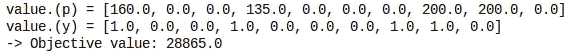
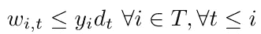

# Julia 上带跳转的混合整数规划综合研究(下)

> 原文：<https://towardsdatascience.com/a-comprehensive-study-of-mixed-integer-programming-with-jump-on-julia-part-2-27e1cc1ed581?source=collection_archive---------31----------------------->

## [实践教程](https://towardsdatascience.com/tagged/hands-on-tutorials)

## 模型概念及其在批量问题中的应用


照片由 [Alexander Tsang](https://unsplash.com/@alexander_tsang?utm_source=medium&utm_medium=referral) 在 [Unsplash](https://unsplash.com?utm_source=medium&utm_medium=referral) 拍摄

这个帖子是这个[一个](/a-comprehensive-study-of-mixed-integer-programming-with-jump-on-julia-part-1-8d47418324d4)的延续；我鼓励你阅读第一个帖子，尤其是如果你没有任何混合整数编程的背景。如果你这样做了:欢迎来到正经事。

这篇文章的目的是展示线性项如何能够模拟广泛的约束，并优化现实生活中问题的便捷函数。

在今天的菜单中，我们将调查以下问题:

1.  我们如何在线性程序中建模逻辑约束？
2.  同一个问题的所有提法都等价吗？如果不是，我们怎么能说一种配方比另一种好呢？
3.  对于一个组合问题，我们能有一个理想的公式吗？

当然，我们将在解决一个经典的工业问题时尝试这样做:批量问题。

# 批量问题

批量问题(LSP)包括在计划范围内计划生产和库存的批量，以最小化生产、准备和库存成本。

换句话说，想象你必须设定一个工厂的生产计划，以满足客户在每个时间点的需求。不过，每次开始生产时，你都必须支付一笔持续的准备成本和一笔生产成本，这取决于你想要生产的数量。

你可以考虑在期初生产尽可能多的数量，但是储存也涉及成本。

我们还将考虑一个产能约束，它将限制我们可以持有的数量，因此我们将解决产能约束下的批量问题。

## 实例描述

让我们先来看看如何对这个问题的一个实例建模。首先，我们必须记住，解析是在一个时间范围内进行的，因此每个“时间相关”变量都将由 t ≤ T 来索引。

现在，有哪些依赖于实例的变量是不变的？首先，成本。所以我们把 *f* 作为准备成本， *q* 作为单位生产成本，而作为持有成本 *k，*存储容量也不变。

客户需求将由我们的时间范围大小的向量来描述；每一个需求都将由 dₜ用我们时间范围的一个瞬间来表示。

在下文中，我们将考虑以下实例:

```
T=10 #Time Horizon
f=1000 #Setup Cost
q=30 #Production Cost
k=10 #Holding Cost
D=[15,10,10,25,30,5,5,50,20,80] #Demand at each step
Imax=100 #Storage Capacity
```

## 模型变量

我们有两种可能的行动:现在生产或生产并储存以备后用。

然后，在每个时间步，我们要决定是否启动生产，如果启动，我们要确定生产多少；我们的选择会影响股票的状态，所以我们也必须为它使用一个变量。

这些决定必须在每个时间步做出，所以我们将有 *yₜ、*pₜ、 *Iₜ* 、T4 到代表如果我们启动，我们生产多少，在每个时间步结束时我们有多少库存。

变量可以这样实例化:

```
[@variable](http://twitter.com/variable)(prgrm, p[1:T] >= 0)
[@variable](http://twitter.com/variable)(prgrm,I[0:T]>= 0) #We index from 0 to set an initial storage
[@variable](http://twitter.com/variable)(prgrm, 1 >= y[1:T] >= 0, Int)
```

## **模型约束**

一个主要的限制是在不超过每个步骤的存储容量的情况下进行生产；这可以这样表述:


在此之后，我们必须记住，任何产品要么是现在的，要么是以后的，所以每次我们生产时，我们生产的超出客户需求的所有产品都被储存起来，以备下一步使用；这是一个“流量约束”，可以写成如下形式:


```
#We set initial storage to 0 (for example) [@constraint](http://twitter.com/constraint)(prgrm, I[0] == 0) for i in 1:T
    [@constraint](http://twitter.com/constraint)(prgrm,I[i-1] + p[i] == D[i] + I[i])
end
```

还有一个内在的约束:要生产，就要发动生产；这是一个隐含约束( *pₜ > 0* 暗示*yₜ= 1)，也是一个展示 Big-M 以及我们如何使用它来建模隐含的极好机会。*

*变量的大 M 是变量无法达到的值，它有助于制定如下约束:*

**

*如果仔细观察此约束，您会注意到，除非 yₜ为真，否则 pₜ不能为非空，如果 yₜ为真，则产量不受此约束的限制，因为 m 的值大于 pₜ.的最大可达值*

*当然，现在的问题是:**如何修复 Big-M？***

*我们可以像 10⁵一样随意地将其固定为一个不合理的高值，但不建议这样做，原因有二:*

1.  *这可能会在数值上产生问题，因为在求解器内部，例如，假布尔值被表示为非常接近于 0 的值。我的意思是比 10⁻⁵小，所以如果你把 10⁸作为一个大 m，它可能会把你带到一个 y 被设置为 10⁻⁶的结果，求解器把它看作一个布尔值 false。尽管如此，它并没有像预期的那样将 pₜ约束为空。*
2.  *它负面地影响弛豫间隙；我们稍后将回到这一点，但直觉是，它限制了我们必须搜索的区域，因此在添加约束 p≤ 2 和约束 p ≤10⁶之间，第一个更具限制性。*

*一般来说，我们寻求最小的变量作为大 M；对于这个例子，我们可以有许多不同的选择:*

*   *因为我们不能生产超过我们能储存的，大 m 可以固定在 Iₘₐₓ.*
*   *我们从未对生产超过客户总需求的产品感兴趣；我们可以把需求的总和作为所有生产变量的大 M。*
*   *没有什么迫使我们对所有的 pₜ变量采取相同的大 m；通过应用与前一点相同的推理，我们对生产超过剩余需求的**永远不感兴趣。***

*第二个想法包含在第三个想法中，但我们没有义务在第一个想法和第三个想法之间做出选择:*

**

*注意，Mₜ不是一个变量，因为我们知道 Iₘₐₓ和所有的 dᵢ.然后，我们可以在构建程序时计算每个 mₜ；这个 big-M 的另一个积极的副作用是，我们不再需要指定与我们不能生产超过我们可以存储的事实相关的约束。*

## *目标函数*

*要设计目标函数，我们必须有一种方法来评价一个解的质量；对于这个问题，很简单，我们必须最小化总成本，我们可以这样计算:*

**

*为了获得这个成本，我们将使用 Julia 的两个方便的功能；第一个是元素操作，它可以帮助我们将一个向量乘以一个系数:*

```
*p .* 10
#Output : an array of size {T}*
```

*第二个是求和运算符:*

```
*sum(p .* 10)
#Output: 10𝑝1+10𝑝2+10𝑝3+10𝑝4+10𝑝5+10𝑝6+10𝑝7+10𝑝8+10𝑝9+10𝑝10*
```

*所以我们可以得到这样的目标函数:*

```
*[@objective](http://twitter.com/objective)(prgrm, Min, sum(p .* q) + sum(y .* f) + sum(I .* k))*
```

*我们得到的解如下:*

**

## *更一般的例子*

*为了一般化，这次让我们假设生产成本和持有成本在时间上是可变的，所以让我们考虑这个例子:*

```
*T = 10
f = 1000
q = [5, 10, 10, 5, 8, 2, 7, 8, 9, 10]
k = [0, 10, 5, 5, 10, 5, 8, 2, 2, 2, 8]
D = [80,30,50,100,5,5,25,100,200,100]
Imax = 200*
```

*请注意，由于在目标函数中仍然有效的元素乘积，它不会改变程序中的任何内容，因此您应该获得以下分配:*

**

# *减少使用的变量数量*

*如果我们想一想，股票直接依赖于生产；实际上，在一瞬间 *t，*它是我们在 *t* 之前生产的数量减去在 *t 之前的需求总和，这样*我们就可以在约束条件下*代替 Iₜ* 。*

**

*从而获得:*

**

*这意味着生产至少要满足每一步的需求。*

*那么库存变量在制定持有成本时是有用的，但是我们可以很容易地绕过它，只要我们给 cₜ一个包含生产成本和持有成本的成本。*

**

*因此，我们得到在 t 时刻生产的每单位产品的成本如下。*

*该程序可以如下实例化。*

```
*prgrm = Model()
set_optimizer(prgrm, GLPK.Optimizer)
[@variable](http://twitter.com/variable)(prgrm, p[1:T] >= 0)
[@variable](http://twitter.com/variable)(prgrm, 1 >= y[1:T] >= 0, Int)
[@variable](http://twitter.com/variable)(prgrm, I[0:T] >= 0) #We index from 0 to set an initial storage
for i in 1:T
    [@constraint](http://twitter.com/constraint)(prgrm,sum(p[1:i]) - sum(D[1:i]) >= 0)
end
for i in 1:T
    [@constraint](http://twitter.com/constraint)(prgrm, sum(p[1:i]) - sum(D[1:i]) <= Imax)
end
for i in 1:T
    M = min(sum(D[i:end]), Imax)
    [@constraint](http://twitter.com/constraint)(prgrm, p[i] <= M*y[i])
end
c = []
for t in 1:T
    e = q[t] + sum(k[t+1:end])
    append!(c,e)
end
[@objective](http://twitter.com/objective)(prgrm, Min, sum(p .* c) + sum(y .* f))
prgrm*
```

*我们得到以下解:*

**

*这很奇怪；就决策变量而言，我们得到了相同的解，但目标值不同。*

*事实上，我这样做是为了解释两件事，*

*第一个是，当定义一个时间步长的生产成本时，我们忘记了减去满足客户需求的持有成本，这代表*

**

*第二，这对决策变量没有重要性，因为一般来说，优化 *f 或*优化 *f + a* 是一回事，因为 *a* 不依赖于我们的决策(也不依赖于其他任何东西，因为它是一个常数)。*

*虽然如果我们必须减去它来检查，我们可以验证*

**

*作者图片*

# *扩展公式*

*在上面的公式中，产量由单个**聚合**变量决定是现在生产还是以后生产。*

*让我们看看另一个公式，我们将不同的思考方式，将每个时间步的产量分成许多变量 wᵢₜ；每个代表在 *I* 上的生产，旨在满足 *t* 上的客户需求。*

*那么在每个时间步满足需求可以自然地表达为:*

**

*设置约束变为*

**

*请注意，我没有采用 Iₘₐₓ的界限，因为在特定时间步长的需求小于 Iₘₐₓ的需求是微不足道的(即使是在同一天，我们也必须在交付之前将其存储在某个地方)。*

*我们可以将容量限制写为:*

**

*这段代码可以创建完整的程序:*

```
*prgrm = Model()
set_optimizer(prgrm, GLPK.Optimizer)[@variable](http://twitter.com/variable)(prgrm, w[1:T , 1:T] >= 0)
[@variable](http://twitter.com/variable)(prgrm, 1 >= y[1:T] >= 0, Int)for t in 1:T
    for i in 1:t-1
        [@constraint](http://twitter.com/constraint)(prgrm, w[t,i] == 0)
    end
end
for t in 1:T
    [@constraint](http://twitter.com/constraint)(prgrm,sum(w[1:t, t]) == D[t])
end
for t in 1:T
   [@constraint](http://twitter.com/constraint)(prgrm, sum(w[t,:]) <= Imax) 
end
for t in 1:T
    for i in 1:t
        [@constraint](http://twitter.com/constraint)(prgrm, w[i,t] <= y[i]*D[t])
    end
end
c = []
for t in 1:T
    e = q[t] + sum(k[t+1:end])
    append!(c,e)
end
e = 0
for i in 1:T
    e = e + c[i]*sum(w[i,i:end])
end
[@objective](http://twitter.com/objective)(prgrm, Min, e + sum(y .* f))
prgrm*
```

*这给了我们以下结果:*

**

*作者图片*

*当然，我们得到了相同的结果，而且我们也注意到，正如我前面解释的，一个空值实际上对于 p₆.来说是一个很小的值*

# *配方比较*

*现在，我将向你们展示一些关于组合问题的 MIP 公式的见解，然后用它们来比较我之前展示的不同公式。*

## *尺寸很重要*

*像大多数算法一样，单纯形算法的效率取决于其输入的大小。*

*一般来说，我们所说的**列**和**行**是指程序的变量和约束的最终数量。*

*为什么我们不直接使用变量和约束呢？出于两个原因，*

*第一个是我们总是可以写一个矩阵形式为**的线性程序，如下所示。***

**

*比如下面的矩阵。*

```
*A= [ 1 1 9  5;
     3 5 0  8;
     2 0 6 13]
b = [7; 3; 5]
c = [1; 3; 5; 2]*
```

*会给这个项目*

**

*作者图片*

*因此，变量(相应约束)的数量是矩阵 a 的列(相应行)的数量*

*第二是行和列的数量可能不同于正式模型中决策变量和问题约束的数量，正如您将在下面看到的。*

*这也给了我一个绝佳的机会来展示一些**线性化**技术。*

*实际上，你已经看到了线性化技术；之前，我们对逻辑含义进行了线性化，但由于这不是您可能感兴趣的唯一逻辑运算符，下面的表格概括了假设 *x，y，z* 为布尔变量时主要逻辑运算符的线性等价。*

**

*另一个我经常线性化的算子是最小(或最大)算子。要在程序中使用 x 和 y 之间的最小值，可以这样做:*

**

*作者图片*

*(如果你想知道，是的，我们可以在任何 Julia 字符串中使用 Latex 符号)*

*例如，这是一个程序，其中我们有 2 个决策变量和 1 个约束，但有 3 列 3 行。*

*你可能会问的另一个问题是，“程序中的最小值有什么用呢？”,*

*用途是多种多样的，但是我能给你的最简单的是我正在考虑写的关于多目标优化的另一篇文章的预览。*

*例如，想象一下，我们有 10 美元要在两兄弟之间分享。假设 x 和 y 是指定我们给每个兄弟多少钱的变量。*

*你会有和上面一样的情况，但是要考虑什么目标函数呢？*

*当然，我们希望给定的钱最大化，所以我们希望最大化 *x+y* ，但我们直觉上也希望对每个兄弟公平，而这样做的一个方法就是最大化每个兄弟得到的最小。*

*这给了我们以下。*

**

*作者图片*

*我要介绍的最后一个线性化是产品线性化。*

*你读书读得好；如果我们有两个布尔变量，我们可以将它们的二次组合线性化如下。*

**

*作者图片*

*综上所述，你可以用线性化技术来表达非线性算子。不过，如果您记住这样做涉及到增加行和/或列的效率成本，这将会有所帮助。*

## *越紧越好*

*您可能还记得本系列的第一部分，约束是对一行之上或之下的半空间的限制，所以在制定我们的程序时，我们正在枚举限制我们搜索区域的行。*

*为了形象化，考虑一个组合问题，其中可行的解决方案是绿色的。*

**

*作者图片*

*我们能想到的一个提法，可能是按照虚线分割空间。*

**

*作者图片*

*但是我们也可以想象许多其他的公式，包括其他的线(约束)和围绕绿点，*

*我们能找到的最好的一个将完美地符合由像实线一样的绿点形成的多面体。*

**

*作者图片*

*为什么会是最好的？因为它的所有顶点都是整数解，所以我们说它完美地描述了可行解的多面体。*

*但是对于许多问题来说，很难找到一个完美的公式。*

***我们能认出一个完美的公式吗？***

*前面说过，线性规划的约束条件可以写成矩阵 A；因此，我们有霍夫曼-克鲁斯卡尔定理。*

> *如果 A 是全幺模矩阵，那么它所定义的约束多面体的每个顶点都是整数。*

*但是什么是完全幺模矩阵呢？这个定义相当复杂，需要一些线性代数背景知识。事实上，我仍然会在这里给出幺模矩阵的定义，然后给出完全幺模矩阵的定义。*

***幺模矩阵:***

*如果一个矩阵是一个行列式[为 1 或-1 的方阵，那么它就是幺模矩阵。](https://en.wikipedia.org/wiki/Determinant)*

*如果 A 是整数矩阵，那么我们有 Veinett-Dantzig 定理:*

> *x = A⁻ b 是每个整数向量 b 的整数向量当且仅当 a 是幺模。*

***全幺模矩阵***

*完全幺模矩阵是这样一个矩阵(不一定是正方形的),其中每个正方形的[非奇异的](https://en.wikipedia.org/wiki/Invertible_matrix) [子矩阵](https://en.wikipedia.org/wiki/Submatrix)都是幺模的。*

*像这样公式化，识别完全幺模矩阵似乎不太容易，但是庞加莱指出了完全幺模矩阵的一个特例。*

> *如果矩阵的系数是 1、0 或-1，并且在每一列中，我们有小于 1 倍的系数 1 和小于 1 倍的系数-1；那么矩阵是完全幺模的。*

*存在另一个更普遍的属性:*

> *矩阵系数或者是 1，0 或者是-1，每一列具有少于 2 个非空系数，并且行可以被分成两个子集 I₁和 I₂，使得如果两列具有相同符号的系数，则它们应该属于不同的子集，反之亦然。*

***完美公式的例子***

*完美描述可行解的多面体的自然公式的一个众所周知的例子是[最小成本流](https://en.wikipedia.org/wiki/Minimum-cost_flow_problem#:~:text=The%20minimum%2Dcost%20flow%20problem,flow%20through%20a%20flow%20network.)问题的公式；它对一般情况有效，但无电容的情况更容易证明，因为它是 Pointcaré定理的直接应用。*

*该问题包括通过最小化所取边的成本来寻找通过从源 s 到目的地 t 的边的流。*

**

*由于每个边出现在两个约束中(每个端点一个)，一个具有系数-1，一个具有系数 1，矩阵是完全幺模的，因此公式是完美的。*

# *回到我们的问题*

*现在我们有了一些比较同一问题的不同公式的背景，让我们比较扩展公式和有能力限制的批量问题的聚合公式。*

## *根据变量的数量*

*扩展公式有 *T* 个连续变量。聚合公式只有 *T* 个连续变量，因此它在渐近上更重要，即随着时间间隔的延长，两个公式之间变量数量的差异不断增加。*

*尽管如此，由于变量是连续的，这不是一个大的缺点。*

*另一方面，它们有相似数量的连续变量和约束。*

## *根据配方的紧密度*

*扩展公式比聚合公式更严密，因为如果我们检查设置约束，我们可以注意到:*

**

*这意味着，如果一个解决方案满足聚集公式的设置约束，它将满足扩展公式的设置约束；然后，扩展公式中的设置约束更加严格。*

*因此，由聚集公式的设置约束定义的约束定义了一个多面体，该多面体包含在由扩展公式定义的多面体中。因此，扩展的公式更严密。*

## *哪种配方更好？*

*在我看来，是扩展的，因为增加连续变量的数量对于加强公式来说成本并不高。*

*对于无电容的情况，扩展的公式被证明是理想的公式，这一事实加强了这种直觉。*

# *结论*

*MIP 提供了一个广泛的建模工具面板，可以线性化几乎所有的东西。这份关于它如何帮助我们对工业问题建模的简要概述向我们表明，理解一些线性建模见解可以提高我们模型的质量和性能。*

*我确切地说，这篇博文并不是要对线性优化领域进行详尽的研究，这个领域太深了，不可能这么快就涵盖；这只是我在开发或研究 MIP 配方时参考的一些基本概念。*

*如果你想更深入地理解批量问题及其应用，我推荐这篇文章。*

## *确认*

*我要感谢我的运筹学老师 Sofia Kedad Sidhoum 和 Pierre Fouillhoux、 [Nadym Mallek](https://medium.com/u/a339456f15e5?source=post_page-----27e1cc1ed581--------------------------------) 、 [Ludovic Benistant](https://medium.com/u/895063a310f4?source=post_page-----27e1cc1ed581--------------------------------) 、 [Racha 萨尔希](https://medium.com/u/f017502742e1?source=post_page-----27e1cc1ed581--------------------------------)和 [dhtdean](https://medium.com/u/27e40232d348?source=post_page-----27e1cc1ed581--------------------------------) 审阅我的文章。*