# Julia 上带跳转的混合整数规划综合研究(三)

> 原文：<https://towardsdatascience.com/a-comprehensive-study-of-mixed-integer-programming-with-jump-on-julia-part-3-847ad5b3c625?source=collection_archive---------15----------------------->

## 我正在用分支-切割框架解决一个具有指数数量约束的问题


克劳迪奥·施瓦兹在 [Unsplash](https://unsplash.com?utm_source=medium&utm_medium=referral) 上的照片

是的，有可能。

即使这非常违反直觉，我们也可以处理带有指数数量约束的线性程序，只要我们有一个实用的(甚至接近的)方法来**分离**这些约束。

这个故事是[这个](/a-comprehensive-study-of-mixed-integer-programming-with-jump-on-julia-part-1-8d47418324d4?source=your_stories_page-------------------------------------)和[这个](/a-comprehensive-study-of-mixed-integer-programming-with-jump-on-julia-part-2-27e1cc1ed581)的延续，在这里我解释了我们如何使用线性规划来解决大型组合问题，现在我们将进入上面的层次，看看我们如何使用可能包含指数数量约束的更强的公式。

为此，我们将了解“分离过程”的含义，以及如何通过在分支-剪切框架中使用框架跳转的“惰性约束回调”来解决第一类非紧凑线性公式。

我们还将看到如何使用分支-剪切框架来加强具有“惰性约束回调”的紧凑公式

# TSP(旅行推销员问题)的另一个变体

我选择提出的问题是旅行推销员问题，以说明如何使用分支切割公式；我做出这个选择有两个原因:第一个原因是，在对组合学问题解决感兴趣的人中，这是一个广为人知的问题；第二个原因是，在我看来，这是分支-切割公式在大规模解决问题方面帮助最大的问题。

更准确地说，我选择了有容量限制的车辆路径问题(CVRP)问题，因为它是 TSP 的一个有趣的变种，我们可以更好地想象具体的应用情况。

## 问题的描述

假设您有许多客户，每个客户的需求都定位在一张地图、一个仓库和一个由 K 辆卡车组成的车队上；您将如何组织交付，以最大限度地降低交付的总成本？

首先，我们将在 Julia 中定义一个表示客户端的类型；客户必须有自己的立场和需求；这可以使用 **struct** 关键字来完成。

```
struct Client
    position
    demand
end;
client1 = Client([0,10], 25)
```

生成一个随机实例，我们就说坐标在一个 100x100 的正方形里，需求是 15 到 30 之间的整数；以下函数为我们提供了一个随机客户端:

```
function random_client(pos_range, demande_range)
    position = rand(pos_range, (1, 2))
    demand = rand(demande_range, 1)
    client = Client(position, demand[1])
    return client
end;
client1 = random_client(1:100, 15:30);
```

现在我们有了客户的表示，我们可以定义问题的表示，除了客户之外，它还包含仓库的坐标、卡车数量 *m* 和它们的容量 *Q* 。

```
struct CVRP_Problem
    clients
    depot
    m
    Q
end;
```

因此，这是一个生成随机实例的函数。

```
function random_instance(n_clients, depot, m, Q)
    clients = Dict([(i,random_client(0:100, 10:30)) for i in    1:n_clients])
    problem = CVRP_Problem(clients, depot, m , Q)
    return problem
end;
```

现在，为了可视化问题，让我们设置一个函数来显示问题。

```
function display_problem(problem)
    x_pos = [c.position[1] for c in values(problem.clients)]
    y_pos = [c.position[2] for c in values(problem.clients)]
    scatter(x_pos, y_pos, shape = :circle, markersize = 6, label= "Client")
    scatter!([problem.depot[1]], [problem.depot[2]], shape = :square, markersize = 8, label= "Depot")
end;
```

这个函数为我们提供了一个随机问题的如下图:

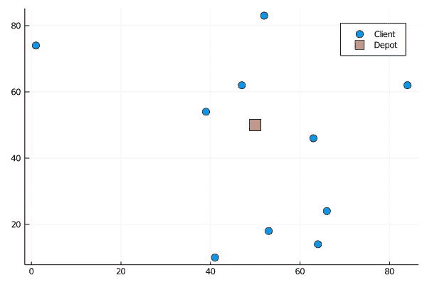

作者插图

## 问题的形式化

因为目标是最小化所有卡车行驶的总距离，而不是卡车的数量，所以解决方案可以用路线中的弧线来表示。

请记住，每个客户只能被一辆卡车访问，所以我们假设最大的需求小于卡车的容量。

所以这个解是每个弧的指示 *e=(x，y)* 是否被取用，所以决策变量将是每个 *e.* 的二进制变量 xₑ

现在我们将定义一些适当的符号:

首先，我们定义决策变量和的符号，给定一组边 E，我们定义:

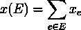

之后，我们定义了“邻居”算子δ

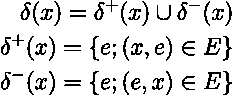

所以，δ⁺是从一个顶点出发的弧线，δ⁻是到一个顶点的弧线；这里有一个例子来阐明这个概念。

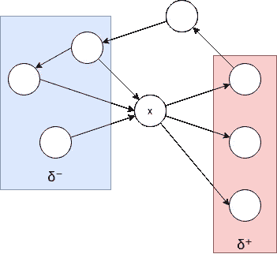

作者插图

因此，要构建车辆路线，我们应该使用以下约束来约束解决方案，以确保每个客户端都被访问一次(一个入口和一个出口) :

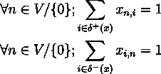

因为每个客户的需求都低于一辆卡车的容量，如果一个客户被一辆卡车拜访，就足以运送他所要求的数量。

为了约束卡车的数量，我们还应该用下面的约束来约束仓库(顶点 0 ),使得出口不多于卡车的数量 *m* 。

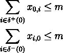

目标是减少路线的总成本，即旅程所覆盖的总距离。

到目前为止，完整的程序由以下代码给出。

```
cvrp = Model(GLPK.Optimizer)
x=@variable(cvrp,x[0:length(problem.clients),0:length(problem.clients)],Bin)
@constraint(cvrp, sum(get_out(x, 0)) <= problem.m)
@constraint(cvrp, sum(get_in(x, 0)) <= problem.m)
for i in 1:length(problem.clients)
    @constraint(cvrp, sum(get_in(x, i)) == 1)
    @constraint(cvrp, sum(get_out(x, i)) == 1)
end;
obj_coef = []
for i in 0:length(problem.clients)
    for j in 0:length(problem.clients)
         append!(obj_coef, [get_cost(problem, i, j) * x[i,j] ] )
    end;
end;
@objective(cvrp,Min,sum(obj_coef))
optimize!(cvrp)
termination_status(cvrp)
objective_value(cvrp)
```

但是这个公式足以解决车辆路径问题吗？—当然不是，不然这篇文章就太短了。

# 子图消除

## 子问题

如果我们运行这个先例程序，我们应该得到以下结果:

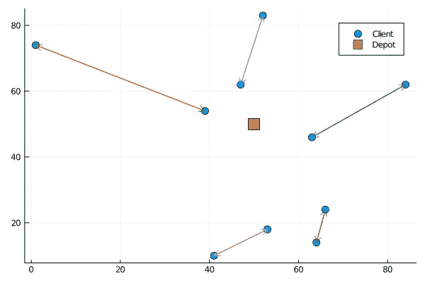

作者插图

这是个 bug 吗？—不，不是；下面的解决方案是一个非常适合程序的解决方案。问题出在程序本身，因为他允许子旅行团的存在。

此图显示了另一个子图示例，我们可以看到子图的每个顶点都满足其约束。


作者插图

在满足程序约束的解决方案中可能发现的另一个问题是接受以下解决方案:

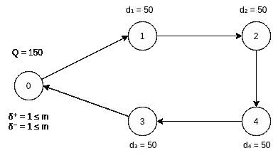

作者插图

也不应该，因为旅行是不可实现的，因为旅行所经过的顶点的需求总和超过了一辆卡车的容量。

## 米勒-塔克-泽姆林不等式

米勒-塔克-泽姆林不等式允许为任何 TSP 变量编写一个紧凑的程序。

我们的想法是为每个顶点创建新的变量 *w* ,代表到达顶点时卡车中的数量。

然后，我们应该添加一个表示以下内容的约束:

> 如果弧线(a，b)是在一次游览中取的，那么 a 之前的数量和 b 之前的数量之差应该大于 a 中的需求。

我们自然有 w≤Q*。*

这可以用下面的不等式来表示:

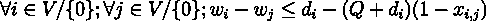

因为如果 xᵢⱼ = 1，约束变成:


这就是我们所需要的，如果 xᵢⱼ = 0，这个约束给我们:

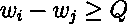

这是微不足道的，因此不会限制解决方案。

添加 MTZ 约束后，代码变为:

```
cvrp = Model(GLPK.Optimizer)
x=@variable(cvrp,x[0:length(problem.clients),0:length(problem.clients)],Bin)
@constraint(cvrp, sum(get_out(x, 0)) <= problem.m)
@constraint(cvrp, sum(get_in(x, 0)) <= problem.m)
for i in 1:length(problem.clients)
    @constraint(cvrp, sum(get_in(x, i)) == 1)
    @constraint(cvrp, sum(get_out(x, i)) == 1)
end;w = @variable(cvrp,w[0:length(problem.clients)])
for (i,vi) in problem.clients
    for j in 0:length(problem.clients)
        if(i == j)
            continue
        end;
    c = @constraint(cvrp, w[i] - w[j] >= vi.demand - (problem.Q +vi.demand)*(1-x[i,j]))
    end;
end;obj_coef = []
for i in 0:length(problem.clients)
    for j in 0:length(problem.clients)
        append!(obj_coef, [get_cost(problem, i, j) * x[i,j] ] )
    end;
end;@objective(cvrp,Min,sum(obj_coef))
```

对于这个先例，它给了我们:

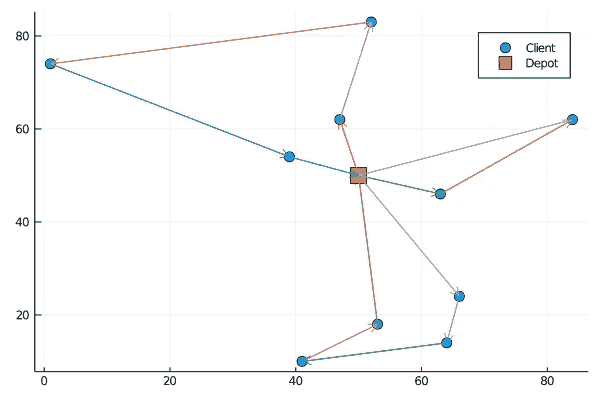

作者插图

## 资源能力限制

资源能力约束是替换和/或加强 MTZ 公式的约束族。

这些约束条件表明，如果我们有一组客户 s，他们的需求总和 D = ∑dᵢ (i ∈ S)，那么我们至少需要 W(S)辆卡车为他们服务:

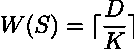

这些约束条件可以代替 MTZ 约束条件，因为它们使得涉及子旅游的解决方案无效。

这些不等式的问题在于，它们应该代表客户的每个子集，因此枚举它们将导致不相关的指数枚举。

解决方案是在切割平面方法中使用它们。

# 分枝切割框架

我们将陆续看到如何使用“用户切割”来替换 MTZ 不等式，然后使用“惰性切割”来加强所获得的公式。但是，首先，我们需要定义一个分离算法。

## 分离定理

分离算法是为给定的解决方案返回违反的约束(如果有的话)或者证明不存在任何违反的约束的算法。

假设分离算法在多项式时间内运行。在这种情况下，即使约束是指数级的，我们仍然可以优化对求解器的多项式调用。

## 分离问题

这里的分离问题是找到一个给定的解决方案，一组客户，这样

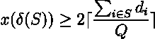

如果有的话，并注明

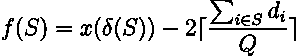

这相当于解决以下优化问题:

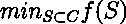

如果最小值为 0，则意味着不存在任何违反的不等式。

## 用分离算法分解子行程

我们可以用来消除 MTZ 不等式同时消除子路线的一个有吸引力的属性是，如果一个解决方案是整数的(请参见前面的章节以记住整数和分数解决方案之间的区别)，那么验证连接组件上的资源容量约束就足以检查解决方案的有效性。

因此，我们应该通过添加违反的不等式来更新分支限界的工作流，以消除包含子旅程的集成解决方案:

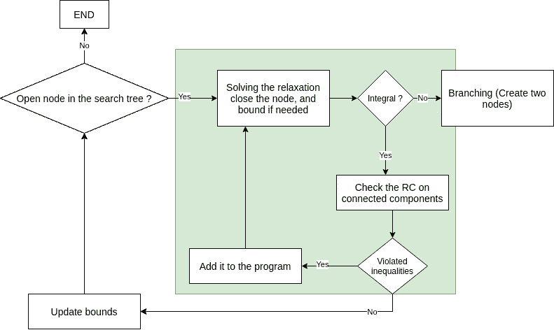

作者插图

添加不等式也称为“切割”解决方案，这种方法是分支定界切割方法的一个示例，或者更简洁地说，是分支切割方法。

实现的分离函数应该放在“用户剪切”回调中，在每个解决方案上运行，直到它不返回任何违反的约束。

现在让我们看看如何在 Julia 中实现它，

首先，让我们看看我们需要的算符，来计算分离问题最小化的函数。

delta 运算符应该扩展到这样的一组顶点。

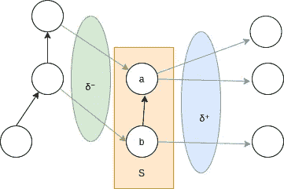

作者插图

一组顶点 S 的δ是在 S 中恰好有一个端点的边的集合，这可以实现如下:

```
function delta(problem, S, x)
    L = []
    for i in S
        for j in 0:length(problem.clients)
            if !(j in S)
                i_min = min(i,j)
                i_max = max(i,j)
                if !(x[i_min,i_max] in L)
                    append!(L, [x[i_min,i_max]]);
                end;
            end;
        end;
    end;
    return L
end;
```

然后，我们需要一个函数来计算一组客户端的总需求。

```
function demand_s(problem, S)
    d = 0;
    for c in S
        d = d + problem.clients[c].demand;
    end;
    return d;
end;
```

这允许我们定义最小化的函数。

```
function W(problem, x, cs, cb_data)
    L = delta_cb(problem, cs, x, cb_data)
    return L - 2*ceil(demand_s(problem, cs)/problem.Q)
end;
```

最后，为了验证在形成一个子图的连通分支上 W 是否是负的，我们首先需要检测由一个解产生的图中的连通分支。

为此，我们将使用库“LightGraph.jl”，第一步是编写一个函数，从一组 *x* 变量创建一个图形对象。

```
function build_simple_graph(problem, x)
    g = SimpleGraph(length(problem.clients));
    for i in 0:nv(g)
        for j in i+1:nv(g)
            if(value(x[i,j]) == 1)
                 add_edge!(g, i, j)
            end;
        end;
     end;
     return g;
end;
```

然后，我们在没有 MTZ 约束的情况下运行，并可视化解决方案。

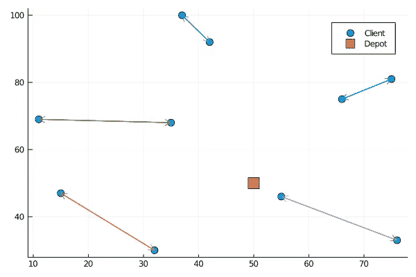

作者插图

现在，我们计算连接的组件，并查看它们上的函数 W 是否为负，这将违反资源约束。

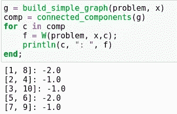

我们看到，对于没有 MTZ 约束的公式返回的积分解，子图给出了函数 *W* 的负值。

另一个有趣的注意事项是，此公式具有更好的收敛速度，因此现在我们可以解决更重要的实例，如下所示:

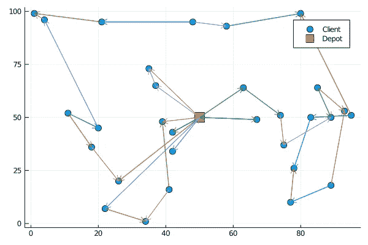

作者插图

请忽略箭头的方向，如[这篇](https://www.sciencedirect.com/science/article/abs/pii/S0377221797002907)文章；我转向使用无向图来减少变量的模型化。

顺便说一下，这是创建线性程序的代码:

```
cvrp = Model(GLPK.Optimizer)
n = length(problem.clients)
x = @variable(cvrp,x[i= 0:n, j = i+1:n ],Int)
for i in 0:n
    for j in i+1:n
        if( i == 0)
            c = @constraint(cvrp, 0 <= x[i,j] <= 2)
        else
            c= @constraint(cvrp, 0 <= x[i,j] <= 1)
        end;
    end;
end;
c= @constraint(cvrp, sum(delta(problem, [0], x)) == 2*problem.m )
for i in 1:n
    δ = delta(problem, [i], x)
    if(length(δ) == 0)
        continue
    end;
    c = @constraint(cvrp, sum(δ) == 2 )
end;
obj_coef = []
for i in 0:n
    for j in i+1:n
        append!(obj_coef, [get_cost(problem, i, j) * x[i,j] ] )
    end;
end;
@objective(cvrp,Min,sum(obj_coef))
```

这是我用来检查每个整体解决方案的连接组件是否满足资源约束的回调:

```
function ressource_constraints(cb_data)
    status = callback_node_status(cb_data, cvrp)
    if(status == MOI.CALLBACK_NODE_STATUS_INTEGER)
        g = build_simple_graph_cb(problem, x, cb_data)
        comp = connected_components(g)
        for c in comp
             f = W(problem, x,c, cb_data);
             if(f <0 )
                 con = @build_constraint(sum(delta(problem, c, x)) >=2*ceil(demand_s(problem, c)/problem.Q))
                 MOI.submit(cvrp, MOI.LazyConstraint(cb_data), con)
             end;
         end;
     end;
end;
MOI.set(cvrp, MOI.LazyConstraintCallback(), ressource_constraints);
```

它为我们提供了以下输出:

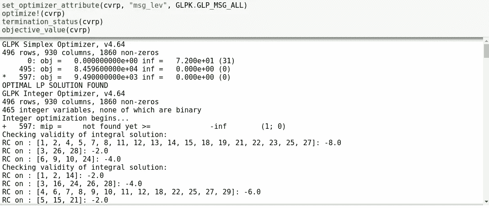

因此，我们可以看到项目的不断丰富，减少了解决方案中的子项目。

## 额外奖励:树枝和切割加固

最后，我们将解释使用分支剪切框架的另一种方式。

分离算法现在将用于加强公式。这意味着分离算法不再是约束定义的一部分。

不过，现在，它在优化过程中被调用，以生成新的削减，将收紧公式。

为此，我们必须将分离过程定义为“惰性切割”，使用分支切割作为惰性约束的优点是，我们可以使用元启发式搜索潜在的切割，因为即使我们没有找到所有的切割，也不会导致不可行的解决方案。

例如，在前面的代码中，我们可以添加，我们寻找一组违反资源约束的客户端，即使是部分解决方案。通过这样做，我们创造了额外的削减，将加强趋同。

要了解更多信息，你可以阅读[这篇](https://www.sciencedirect.com/science/article/abs/pii/S0377221797002907)文章，其中禁忌搜索被用来分离 CVRP 问题的资源不平等。

# 结论

分支-切割方法是考虑组合问题的一种令人兴奋的方法，因为它们需要考虑有效的紧不等式以及如何有效地分离它们。