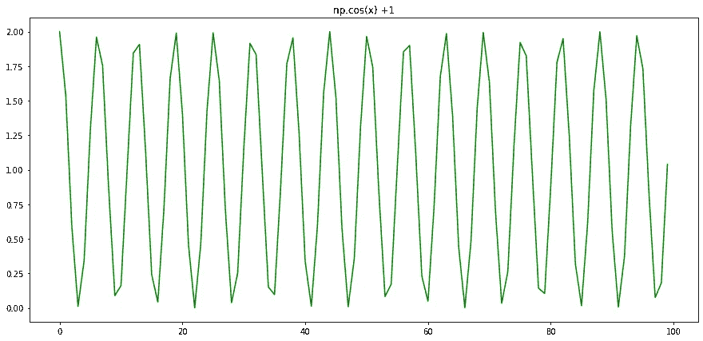

# 18 个 Python 片段中 Numpy 的实用摘要

> 原文：<https://towardsdatascience.com/a-compressed-summary-of-numpy-in-18-python-snippets-1a8a63fc7b4f?source=collection_archive---------33----------------------->


作者图片

## 用几个 Python 片段总结 NumPy 文档

很长一段时间以来，Numpy 一直是 Python 编码人员进行数组操作的普遍选择，它构建在 C 之上，这一事实使它成为执行数组操作的快速而可靠的选择，并且它一直是机器学习和数据科学工作流的支柱。

在本文中，我想浏览一些 NumPy 代码的基本片段，举例说明它的一些主要功能。

# 1.创建数组

```
import numpy as np

new_array = np.array([1,2,3])

print(new_array)

# Output[1 2 3]
```

# 2.获取 Numpy 数组的形状、维度和大小

```
# shape
print(new_array.shape)

# dimensions
print(new_array.ndim)

# size
print(new_array.size)

# Output(3,)
1
3
```

# 3.描述 Numpy 数组中元素的类型

```
array = np.arange(0,10,1)
print(array.dtype)

# Outputint64
```

# 4.获取数组中每个元素的字节大小

```
array = np.array([1,2])
print(array.itemsize)

# Output8
```

# 5.在创建时指定数组的类型

```
array = np.array([[1,2], [3,4]], dtype=complex)
array

# Outputarray([[1.+0.j, 2.+0.j],
       [3.+0.j, 4.+0.j]])
```

# 6.创建包含占位符内容的数组

```
# Array of zeros
array = np.zeros((3,4))
print(array)
print("---")

# Array of ones
array = np.ones((1,2))
print(array)
print("---")

# Empty array with shape (2,3)
array = np.empty((2,3))
print(array)
print("---")

# Output[[0\. 0\. 0\. 0.]
 [0\. 0\. 0\. 0.]
 [0\. 0\. 0\. 0.]]
---
[[1\. 1.]]
---
[[4.67280967e-310 0.00000000e+000 0.00000000e+000]
 [0.00000000e+000 0.00000000e+000 0.00000000e+000]]
---
```

# 7.创建数字序列

```
# Creating a sequence from 0 to 42 elements with elements increasing by 1 using np.arange
array = np.arange(0,42,1)
print(array)
print("---")

# Inserting 42 elements between 0 and 100 with np.linspace
array = np.linspace(0,100,42)
print(array)
print("---")

# Output[ 0  1  2  3  4  5  6  7  8  9 10 11 12 13 14 15 16 17 18 19 20 21 22 23
 24 25 26 27 28 29 30 31 32 33 34 35 36 37 38 39 40 41]
---
[  0\.           2.43902439   4.87804878   7.31707317   9.75609756
  12.19512195  14.63414634  17.07317073  19.51219512  21.95121951
  24.3902439   26.82926829  29.26829268  31.70731707  34.14634146
  36.58536585  39.02439024  41.46341463  43.90243902  46.34146341
  48.7804878   51.2195122   53.65853659  56.09756098  58.53658537
  60.97560976  63.41463415  65.85365854  68.29268293  70.73170732
  73.17073171  75.6097561   78.04878049  80.48780488  82.92682927
  85.36585366  87.80487805  90.24390244  92.68292683  95.12195122
  97.56097561 100\.        ]
---
```

# 8.Numpy 数学函数

```
import numpy as np
import matplotlib.pyplot as plt

# sine function
x = np.linspace(0,2*np.pi, 100)
f = np.sin(x)
plt.figure(figsize=(15,7))
plt.subplot(1,3,1)
plt.plot(f, color="green")
plt.title("np.sin(x)")

# cosine function
f = np.cos(x)
plt.subplot(1,3,2)
plt.plot(f, color="blue")
plt.title("np.cos(x)")

# tangent function
f = np.tan(x)
plt.subplot(1,3,3)
plt.plot(f, color="red")
plt.title("np.tan(x)")
plt.show()

# Output
```


作者图片

# 9.通过对每个坐标执行函数来创建数组

```
some_function = lambda x: np.cos(x)+1
array = np.fromfunction(some_function, (100,))
plt.figure(figsize=(15,7))
plt.plot(array, color="green")
plt.title("np.cos(x) +1")
plt.show()# Output
```



作者图片

# 10.迭代 Numpy 数组的所有元素

```
a = np.arange(0,23,1)
for i in a.flat:
    print(i)

# Output0
1
2
...
22
```

# 11.获取浮点数的底数

```
np.floor(10.5)10.0
```

# 12.用展平数组。拉威尔()

```
array = np.full(shape=(5,5),fill_value=10)
print(array)
print("---")
print("Flattened array:")
print(array.ravel())

# Output[[10 10 10 10 10]
 [10 10 10 10 10]
 [10 10 10 10 10]
 [10 10 10 10 10]
 [10 10 10 10 10]]
---
Flattened array:
[10 10 10 10 10 10 10 10 10 10 10 10 10 10 10 10 10 10 10 10 10 10 10 10
 10]
```

# 13.获取数组的转置

```
array = np.random.random((2,5))
print(array)
print(array.T)[[0.18735704 0.22800582 0.02552177 0.93552346 0.20720663]
 [0.74303284 0.1897481  0.91389602 0.23099501 0.07565492]]
[[0.18735704 0.74303284]
 [0.22800582 0.1897481 ]
 [0.02552177 0.91389602]
 [0.93552346 0.23099501]
 [0.20720663 0.07565492]]
```

# 14.整形用。重塑()和。调整大小()

```
a = np.random.randint(100,size=(3,4))
print(a)
a_reshaped = np.reshape(a, (1,12))
print(a_reshaped)

# modifying the array itself with .resize()
a.resize((1,12))

# Output[[29 18 39 24]
 [53 45 49  8]
 [90 75 61 61]]
[[29 18 39 24 53 45 49  8 90 75 61 61]]
```

# 15.沿着不同的轴堆叠不同的阵列

```
a = np.random.random((2,2))
print(a)
b = np.random.random((2,2))
print(b)

# Stacking along the vertical axis (more rows)
print(np.vstack((a,b)))
print(np.vstack((a,b)).shape)

# Stacking along the horizontal axis (more columns)
print(np.hstack((a,b)))
print(np.hstack((a,b)).shape)

# Column stacking
print(np.column_stack((a,b)))

# Output[[0.67028492 0.86322792]
 [0.38906266 0.36967583]]
[[0.51419553 0.21937852]
 [0.50375453 0.31634597]]
[[0.67028492 0.86322792]
 [0.38906266 0.36967583]
 [0.51419553 0.21937852]
 [0.50375453 0.31634597]]
(4, 2)
[[0.67028492 0.86322792 0.51419553 0.21937852]
 [0.38906266 0.36967583 0.50375453 0.31634597]]
(2, 4)
[[0.67028492 0.86322792 0.51419553 0.21937852]
 [0.38906266 0.36967583 0.50375453 0.31634597]]
```

# 16.将一个数组拆分成几个更小的数组

```
# Using hsplit, you can split an array along its horizontal axis, either by 
# specifying the number of equally shaped arrays to return, or by specifying 
# the columns after which the division should occur

# Spliting a into 5 smaller arrays along the horizontal axis
a = np.arange(0, 5, 1)
print("Horizontal split")
print(np.hsplit(a, 5))
print("---")

# Spliting a into 5 smaller arrays along the vertical axis
a = np.random.random((5,5))
print("Vertical split")
print(np.vsplit(a, 5))Horizontal split
[array([0]), array([1]), array([2]), array([3]), array([4])]
---
Vertical split
[array([[0.69059321, 0.55703093, 0.20019592, 0.19697317, 0.37278251]]), array([[0.24597633, 0.87216661, 0.634432  , 0.35326185, 0.03130537]]), array([[0.18063077, 0.45045441, 0.06882852, 0.91273837, 0.07332161]]), array([[0.61738939, 0.11291748, 0.73152623, 0.49177006, 0.95750985]]), array([[0.90212777, 0.53825846, 0.86733505, 0.76165564, 0.17337721]])]
```

# 17.创建数组的浅表副本

```
a = np.array([
    [0,1,2,3,4],
    [5,6,7,8,9],
    [10,11,12,13,14]
    ])

# The .view() method creates an array object that looks at the same
# data, so it creates a shallow copy of that array

array_object = np.arange(0,10,1)

shallow_copy_object = array_object.view() # shallow copy

print("Array")
print(array_object)
print(f"Id = {id(array_object)}")
print("---")

print("Shallow Copy")
print(shallow_copy_object)
print(f"Id = {id(shallow_copy_object)}")
print("---")

# In this case the array object will change to match all the 
# elements in the shallow object that were assigned to the new value
shallow_copy_object[0] = 200

print("After assigment: shallow_copy_object[0] = 200")

print("Array")
print(array_object)

print("Shallow copy")
print(shallow_copy_object)

# OutputArray
[0 1 2 3 4 5 6 7 8 9]
Id = 139980496768528
---
Shallow Copy
[0 1 2 3 4 5 6 7 8 9]
Id = 139980496768720
---
After assigment: shallow_copy_object[0] = 200
Array
[200   1   2   3   4   5   6   7   8   9]
Shallow copy
[200   1   2   3   4   5   6   7   8   9]
```

# 18.创建数组的深层副本

```
# The copy method makes a complete copy of the array and its data.

array_object = np.arange(0, 23, 1)
deep_copy_object = array_object.copy()

print(deep_copy_object is array_object)

print("Array")
print(array_object)
print(f"Array id = {id(array_object)}")
print("---")

print("Deep Copy")
print(deep_copy_object)
print(f"Deep copy id = {id(deep_copy_object)}")
print("---")
# assigning new value to the deep copy will not change the original array
deep_copy_object[0] = 234

print("After assignment: deep_copy_object[0] = 234")
print("Array")
print(array_object)
print("Deep copy")
print(deep_copy_object)False
Array
[ 0  1  2  3  4  5  6  7  8  9 10 11 12 13 14 15 16 17 18 19 20 21 22]
Array id = 139980498767472
---
Deep Copy
[ 0  1  2  3  4  5  6  7  8  9 10 11 12 13 14 15 16 17 18 19 20 21 22]
Deep copy id = 139980496039824
---
After assignment: deep_copy_object[0] = 234
Array
[ 0  1  2  3  4  5  6  7  8  9 10 11 12 13 14 15 16 17 18 19 20 21 22]
Deep copy
[234   1   2   3   4   5   6   7   8   9  10  11  12  13  14  15  16  17
  18  19  20  21  22]
```

# 开始练习 Numpy！

通过这些例子，我尝试了一下 NumPy 包中的一些功能，如果您想更深入地了解 NumPy 数组，请在这里查看该项目的精彩文档:

<https://numpy.org/devdocs/user/quickstart.html>  

如果你喜欢这个帖子，[加入 Medium](https://lucas-soares.medium.com/membership) ，[跟随](https://lucas-soares.medium.com/)。还有，订阅我的 [youtube 频道](https://www.youtube.com/channel/UCu8WF59Scx9f3H1N_FgZUwQ)在 [Tiktok](https://www.tiktok.com/@enkrateialucca?lang=en) 、[推特](https://twitter.com/LucasEnkrateia)、[LinkedIn](https://www.linkedin.com/in/lucas-soares-969044167/)&[insta gram](https://www.instagram.com/theaugmentedself/)上和我联系！谢谢，下次再见！:)

<https://lucas-soares.medium.com/subscribe> 