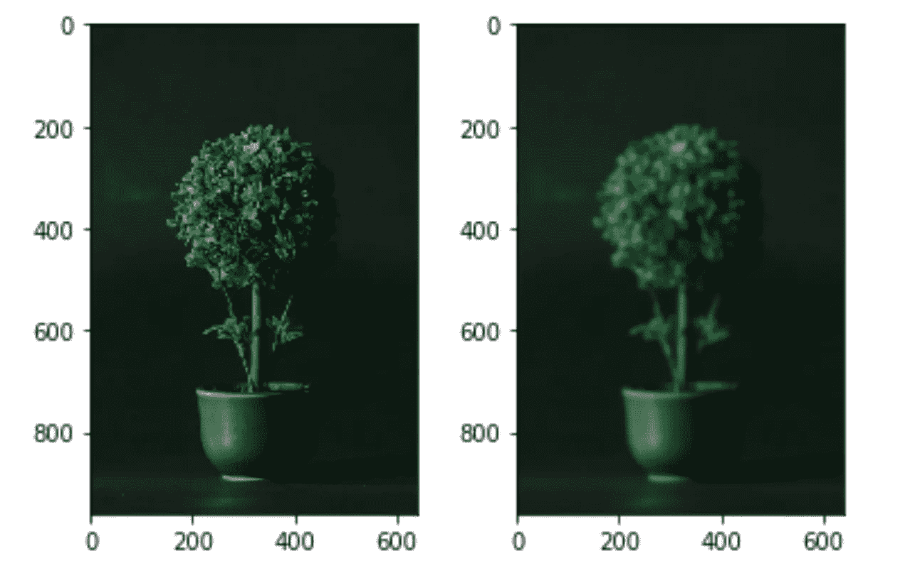
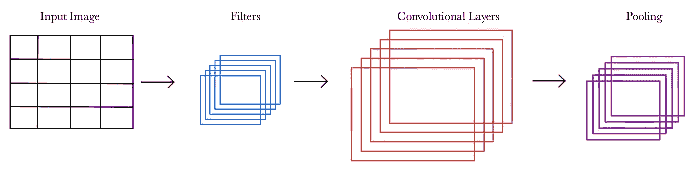

# 卷积神经网络的概念解释

> 原文：<https://towardsdatascience.com/a-conceptual-explanation-of-convolutional-neural-networks-cnns-ccd2e62f213b?source=collection_archive---------38----------------------->

## 对用于计算机视觉目的的流行算法的内部工作原理的温和介绍

巴德·赫利松在 [Unsplash](https://unsplash.com/) 上的照片

计算机视觉:机器学习的分支，看似复杂，其实复杂，而且永远复杂。正如 Instagram 的创始人迈克·克里格(Mike Krieger)所说，“计算机视觉和机器学习确实已经开始起步，但对大多数人来说，计算机在查看图像时看到的东西的整个概念相对模糊”。希望到本文结束时，您将从卷积神经网络的角度对引擎盖下发生的事情有所了解。

由于计算机视觉能够解决的光学问题的广度，因此对了解计算机视觉的程序员有很大的需求。使用计算机视觉，我们可以进行面部识别，分析医学图像，实现自动驾驶，最重要的是，在 Snapchat 上使用整洁的过滤器。许多组织正在使用这样的算法来完成惊人的壮举。Veo Robotics 是一家快速增长的初创公司，它创造了 Veo FreeMove，这是一种 3D 安全保护系统，可以使用计算机视觉在制造工作场所实现机器人和人类之间更安全的协作。让我们担忧但又着迷的 Teslas 的自动驾驶功能源于先进的物体探测算法。斯坦福大学的一个研究小组正在利用 X 射线图像来量化患者膝关节骨关节炎的严重程度，使用的是卷积神经网络！关键是，机器学习的这个看似小众的分支植根于大量的应用，包括社交媒体、医疗保健、研究甚至制造业。在这篇博客中，让我们专注于一种用于图像分类的流行算法:卷积神经网络(CNN)。

在数学中，我们知道卷积是两个函数相互作用产生一个新的输出。然而，在计算机视觉领域，卷积是通过输入图像进行过滤以获得更有意义的输出的过程。现在我们已经定义了卷积，让我们考虑一下 Mike 所关心的当给定一幅图像时，计算机实际上看到了什么。看看你手机/桌面上的壁纸。假设它不是一个空白的屏幕，你可以看到定义人、动物、风景或任何物体的外部轮廓和内部细节的边缘。你的大脑使用这些边缘的集合和它们之间填充的颜色来识别物体。CNN 本质上做着同样的事情。当我们给 CNN 一个输入图像时，它会看到一组数字，这些数字类似于所述图像的像素强度。像素亮度范围从 0(黑色)到 255(白色)。我们也可以选择处理 RGB、灰度或黑白图像。为了图像分类的目的，使用黑/白图像将节省大量的计算费用，但是由于许多边缘将不会被表示，所以这不是理想的。根据你正在进行的项目，决定你是想保持彩色图像还是灰度图像是很重要的，尽管后者会节省你的计算成本。这是因为彩色图像对于每种基本颜色(红、蓝、绿)消耗三个字节的存储空间。

高斯模糊应用于广泛用于图像处理领域的 Lenna 测试图像的例子。纳吉·阿诺在 [Unsplash](https://unsplash.com/) 上的照片

# 高斯模糊

在进入 CNN 之前，让我们再多讨论一下图像预处理。处理图像时，图像中的对象通常会有不清晰的边界。这导致 CNN 看到许多所谓的“假边缘”,最终导致分类、检测等方面的不良表现。因此，有时有必要降低像素强度(模糊图像)。通常的做法是使用 Keras 中的高斯模糊算法来进行这个去噪步骤。

# 过滤器和要素地图

然后，它使用*过滤器*水平和垂直扫描图像，以识别边缘。作为将来的参考，一个*内核*是一个单一的过滤器，即一个 2D 权重数组。一个过滤器由许多内核组成。梯度或像素强度的差异被这些滤波器捕获，其中较大的幅度梯度对应于较大的边缘存在。*索贝尔过滤器*是一种常用的过滤器，由于其水平和垂直扫描的能力，可以实现这一点。垂直扫描将揭开水平边缘，反之亦然。可以将滤镜想象成一个权重矩阵，它与像素强度相乘，以形成一个捕捉原始图像特征的新图像。然后对这些乘积求和，以获得输出图像的相应像素位置的输出值。这个新图像被称为*特征图*。通过反向传播，CNN 能够更新包含在这些过滤器中的权重，从而允许创建最能捕捉信息的特征地图。一旦学习了权重，它们就被用于该层中的所有神经元。在神经网络的卷积层中，应用这些过滤器并创建特征图。在 Keras 中，构建卷积层的第一个输入是滤波器的数量。请确保输入的值是 2 的幂。

# 步幅和衬垫

但是过滤器扫描过程到底是如何工作的呢？很高兴你问了。从概念上讲，正如我们在上面可爱的 gif 中看到的，内核应用于部分输入图像(它只显示了一个内核，尽管这个扫描是由多个内核完成的)。请注意，在这种情况下，内核每次移动一个像素时，会多次读取图像的同一部分。这种移动的幅度被称为*步幅*。在 Keras 中，步幅是另一个输入。随着我们增加步数，特征图变得更加浓缩。如果输入图像边缘的像素是单独输入的，则不会被过滤器多次读取。因此，*填充*是为了避免这个问题。填充基本上是在输入图像的最外边缘添加人工值(通常为零),以便滤波器更好地捕捉最外边缘的数据。

# 解剖美国有线电视新闻网

现在我们已经定义了所有的利基术语，让我们把它们放在彼此的上下文中。使用 Keras 可以很容易地构建 CNN。在您的模型中，您将需要卷积层，如前所述，将滤波器中包含的权重乘以输入图像，生成特征图。一个常用的激活函数是 ReLu。在每个卷积层之后，通常的做法是创建一个*池层*来降低特征图的维度。这基本上浓缩了模型在输入图像的每个局部区域中捕获的最重要的特征。此外，我们可以使用*批量规范化*层后，每一层包含一个激活函数。这减少了[内部协变量偏移](https://machinelearning.wtf/terms/internal-covariate-shift/)，从而允许更快、更稳定地训练神经网络。最后，在你的模型中包含*下降*层以避免过度拟合是一个很好的实践。这些层丢弃来自前一层的输出的一部分，并用零替换它们，从而改变后续层的输入。最后，可以应用一个*展平*层(根据您的需要)来获得一个一维数组，以馈入您的模型的输出层。出于分类的目的， *softmax* 函数可用于获得一个概率输出，该概率类似于图像属于某个类别。

作者创作的图形

请记住，所有这些信息仅仅是 CNN 的皮毛。我们从鸟瞰的角度来看这个模型。有许多移动部件需要考虑，根据项目的规模，调整模型以获得最佳参数需要大量的时间和成本。我强烈建议自己做一个图像分类项目，以便更好地理解这个模型的工作原理。一如既往，如果您有任何问题，请随时联系我们！