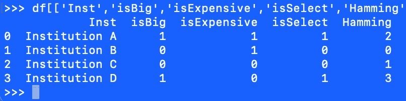
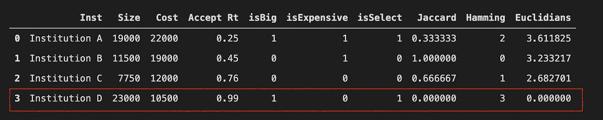

# 一本食谱:用距离来衡量相似性

> 原文：<https://towardsdatascience.com/a-cookbook-using-distance-to-measure-similarity-8de97a1404dd?source=collection_archive---------34----------------------->

## 一本用距离度量相似性的编码食谱。

# 介绍

本文提供了一本关于实现量化相似性的距离度量的食谱。我为这本食谱提出的具体用例是查看一系列观察结果，然后选择其中一个观察结果作为参考，最后使用距离度量来识别哪些观察结果与参考观察结果相似。


布鲁诺·沃尔夫在 [Unsplash](https://unsplash.com?utm_source=medium&utm_medium=referral) 上拍摄的照片。有多远？在超空间中，接近表示相似。这本编码指南探讨了在测量一个或多个观察之间的相似性时，如何使用距离度量。

使用距离度量来度量相似性并不新颖。实际上，这种数学是聚类、因子分析、成分分析和其他技术的重要组成部分。

当您的分析目标是将参考观察值与其他观察值进行比较时，识别与参考观察值相似的观察值是一个有用的练习。了解哪些其他观察结果在客观上和经验上是相似的是有帮助的——这样你就可以比较苹果和苹果，而不是苹果和橙子。

贯穿这本食谱的是代码片段。在这篇文章的底部是一个支持笔记本暂存空间的链接。后续文章将使用美国教育部关于高等教育机构的数据展示这些技术(敬请关注)。

# 入门指南

您需要的第一部分代码是标准导入。

```
**import** **pandas** **as** **pd**
**import** **numpy** **as** **np**

**from** **math** **import** sqrt
**from** **scipy.spatial** **import** distance
**from** **scipy.stats** **import** zscore
```

从这些进口中，你可以推断出未来的情况。比如我们会用熊猫和 Numpy。我们还需要计算平方根。同样，我们将使用 SciPy 的 zscore 函数。

我将展示如何从头开始计算三个距离度量，包括欧几里德距离、汉明距离和雅克卡距离。对于欧几里得距离，我们将在 SciPy 的帮助下以第二种方式复制这些结果。

# 数据

这本食谱虚构的例子数据与学院和大学有关。该数据是机构级别的数据。该数据提供了有关该机构的注册人数和学费的信息。

以下数据支持下面的食谱。

```
data = {'Inst':['Institution A','Institution B',
                'Institution C','Institution D'],
        'Size':[19000,11500,7750,23000],
        'Cost':[22000,19000,12000,10500],
        'Accept Rt':[.25,.45,.76,.99],
        'isBig':[1,0,0,1],
        'isExpensive':[1,1,0,0,],
        'isSelect':[1,0,0,1]}df = pd.DataFrame(data)
df
```

它产生以下输出:


鸣谢:作者提供的虚构数据。

# 基本原则

在深入研究代码之前，让我们回顾一下基本原理，并激活我们对这个主题的直觉。要了解基本原理，请参考图 1，该图显示了散点图上的四个观察值。

使用假设的数据，图 1 使用机构的规模( *y* 轴)和机构的年学费( *x* 轴)显示了四个机构在散点图上的位置。图 1 没有显示具体的单位或比例，因为为了演示，单位和比例是不必要的。


图一。机构 A、B、C 和 d。作者的创作。机构 A 既大又贵。机构 B 规模适中，成本适中。C 机构规模较小，价格实惠。而 D 机构既大又实惠。

假设你研究机构 d，进一步假设你想选择一个比较机构。你会选择哪个机构？在这张图表上找出机构 D 和其他机构之间的字面距离，可以显示出哪家机构最相似。

# 回到代码

这本食谱的其余部分关注于计算机构 D 和其他潜在的比较机构 A 到 c 之间的距离的代码。

## 欧几里德距离

计算欧几里得距离的核心是勾股定理。图 2 中的虚线显示了机构 D 和机构 b 之间的距离


图二。机构 A、B、C 和 d。作者的创作。计算机构 D 和机构 B 之间的距离就像 a + b = c 一样简单(勾股定理)。

下面的代码显示了如何计算机构 D 和 B 之间的距离(图 2 中的红色虚线)。

```
*# Sample data* D = [10,2]                      # Ref  y=10, x=2
B = [3,11]                      # Comp y=3, x=11

*# Calculate from scratch*
rise = D[0] - B[0]              # Find length of segment a
run1 = D[1] - B[1]              # Find length of segment bdist = sqrt(rise**2 + run1**2)
print('Distance from scratch : **{}**'.format(dist))

*# Calculate with SciPy assist*
dist = distance.euclidean(D, B)
print('Distance with assist  : **{}**'.format(dist))
```

上面的代码，产生了下面的输出(机构 D & B 之间的距离):

```
Distance from scratch : 11.40175425099138
Distance with assist  : 11.40175425099138
```

为了使这个过程可重复，并让它支持增加的维度(不止两个，一个 *x* 和一个 *y* )，我们定义了以下函数:

```
**def** euclidian(data, ref, cols):     
     *'''Calculates Euclidian distance for all observations* *    
     relative to the referenced observation. Returns a list* *    
     of euclidian distances.*   *data = A dataframe.* *    
     ref  = A reference observation. Specify by axis 0 index.* *     
     cols = A set of comparison columns.'''*       **if** type(ref) == int:         
          ref = ref     
     **if** type(ref) == str:         
          ref = df.index.get_loc(ref)               distances = []     
     ref_observation = data[cols].apply(zscore).iloc[ref]      **for** row **in** range(len(data)):         
          comp_observation = data[cols].apply(zscore).iloc[row]         
          dist = distance.euclidean(ref_observation, 
                                        comp_observation)         
          distances.append(dist)      **return**(distances)
```

实施:

```
df['Euclidians'] = euclidian(data=df, ref=3, 
                             cols=['Size','Cost','Accept Rt'])
df[['Inst','Size','Cost','Accept Rt','Euclidians']]
```

它产生以下输出:


鸣谢:作者提供的虚构数据。

使用机构规模、学费和录取率的度量，该度量显示机构 C 是与机构 D 最相似的机构。还要注意，机构 D 的距离是 0。当然，D 机构也会和自己一模一样(D 机构和自己零距离)。

## 汉娩距

这种方法的一个优点是它可以很好地处理分类数据。缺点是，为了获得最佳结果，您首先需要将连续数据转换为分类数据。

这些转换降低了衡量标准的可解释性，并且需要大量的规划。该计划包括在将连续数据转换为分类数据时决定在哪里放置切割点。

图 3 显示了分类数据的例子。变量`isBig`表示学校是大还是小，`isExpensive` ( `isExpe~e`)表示学费是否高。而`isSelect`表示该院校本科录取率是否低于 50%。


图二。作者的创作。虚构的分类数据。

汉明距离通过计算匹配值的数量来工作，计数越高，观察值越接近。

使用这种方法，机构 D 和机构 C 之间的距离为 1。机构 D 和机构 B 之间的距离为 0。那么机构 D 和机构 A 之间的距离是 2。该方法的结果表明机构 A 与机构 d 最相似。

为了实现这些计算，我们定义了一个函数:

```
**def** hamming(data, ref, cols):
    *'''Calculates Hamming distance for all observations*
 *relative to the referenced observation. Returns a list*
 *of hamming distances.*

 *data = A dataframe.*
 *ref  = A reference observation. Specify by axis 0 index.*
 *cols = A set of comparison columns.'''*

    **if** type(ref) == int:
        ref = ref
    **if** type(ref) == str:
        ref = df.index.get_loc(ref)

    distances = []
    ref_observation = data[cols].iloc[ref]
    **for** row **in** range(len(data)):
        comp_observation = data[cols].iloc[row]
        matches = sum([1 **if** x == y **else** 0 
                       **for** x, y **in** zip(comp_observation,
                                       ref_observation)])
        distances.append(matches)
    **return**(distances)
```

实施:

```
df['Hamming'] = hamming(data=df, ref=3, 
                        cols=['isBig', 'isExpensive', 'isSelect'])
df
```

它产生以下输出:



鸣谢:作者提供的虚构数据。

使用机构规模、学费和录取率的测量值(作为分类测量值)，由`hamming`函数暗示的该测量值显示机构 A 是与机构 d 最相似的机构。使用这些数据和该方法，结果与欧几里德方法产生的结果不同。

## Jaccard 索引

Jaccard 索引也适用于分类数据。Jaccard 索引计算距离的方法是，将匹配维度的数量放在维度总数上，然后从 1 中减去该结果。

以下函数实现了 Jaccard 索引计算:

```
**def** jaccard(data, ref, cols):
    *'''Calculates Jarcard index for all observations*
 *relative to the referenced observation. Returns a list*
 *of Jaccardian distances.*

 *data = A dataframe.*
 *ref  = A reference observation. Specify by the axis 0 index.*
 *cols = A set of comparison columns.'''*

    **if** type(ref) == int:
        ref = ref
    **if** type(ref) == str:
        ref = df.index.get_loc(ref)

    distances = []
    length = len(cols)
    ref_observation = data[cols].iloc[ref]
    **for** row **in** range(len(data)):
        comp_observation = data[cols].iloc[row]
        matches = sum([1 **if** x == y **else** 0 
                       **for** x, y **in** zip(ref_observation,
                                       comp_observation)])
        distances.append(1 - (matches / length))
    **return**(distances)
```

实施:

```
df['Jaccard'] = jaccard(data=df, ref=3, 
                        cols=['isBig', 'isExpensive', 'isSelect'])
df[['Inst','isBig', 'isExpensive', 'isSelect','Jaccard']]
```

它产生以下输出:


鸣谢:作者提供的虚构数据。

使用 Jaccard 指数，D 到 C 的距离是. 66，D 到 B 的距离是 1，D 到 A 的距离是. 33。因此，Jaccard 指数表明，机构 D 与机构 A 最为相似，机构 A 同意汉明方法，但不同意欧几里德方法。

# 结论

最后一个图，图 5 显示了最终的一组结果。图 5 包括一个名为`Accept Rt`的列，它对应于`isSelect`，如上所述。图 5 显示了所有观测值与参考观测值(观测值 3)的距离(机构 D-红色方框)。



图 5。最右边的三列提供了机构 D 和所有其他机构之间的距离度量。鸣谢:作者提供的虚构数据。

从这些结果中，如图 5 中最右边的三列所示，我们看到各种方法并不总是一致的。Jaccard 和 Hamming 方法同意机构 A 与机构 d 最相似，而欧几里德距离表明机构 C 与机构 d 最相似。

还要注意，对于 Jaccard 指数和欧几里德距离，较小的结果表示更接近(得分类似于高尔夫)。对于海明距离，较大的结果表明更接近(得分像篮球)。

寻找更多代码？[我提供一个配套支持暂存空间的笔记本和储存库](https://github.com/adamrossnelson/distances/blob/main/ComparisonGroupScratchSpace.ipynb)。

为了在几十个或几百个观察值之间进行比较，这些距离方法可以帮助快速确定哪些观察值与任何给定的参考观察值相似。然后，通过对该距离进行排序，X 个最接近的观察值可以作为合理的比较组。

<https://adamrossnelson.medium.com/membership>  

# 感谢阅读

感谢阅读。把你的想法和主意发给我。你可以写信只是为了说声嗨。如果你真的需要告诉我是怎么错的，我期待着尽快和你聊天。推特:[@ adamrossnelson](https://twitter.com/adamrossnelson)| LinkedIn:[亚当·罗斯·纳尔逊](http://www.linkedin.com/in/arnelson) |脸书:[亚当·罗斯·纳尔逊](http://www.facebook.com/adamrossnelson)。