# 协方差分析

> 原文：<https://towardsdatascience.com/a-covid-analysis-9c8f7f9ea474?source=collection_archive---------18----------------------->

## 从外部因素对新冠肺炎病例影响的国别分析到未来疫苗接种率的预测

在本文中，我们将介绍

1.  变量之间的关系，如一个国家的贫困率，预期寿命率，严格指数，covid 病例和死亡
2.  截至 6 月底每个国家的疫苗接种率及其预测
3.  我是如何处理数据和分析的(只有 jupyter 笔记本部分)

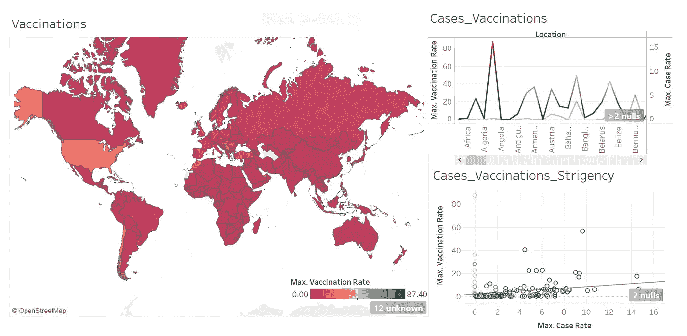

Covid 分析仪表板—按作者分类的图像

在过去的一年里，新冠肺炎吸引了全世界的注意力。关于这种给世界带来巨大灾难的病毒，还有许多问题没有得到解答。因此，实际上任何一种分析都可以为我们自己和潜在的社会带来更好的理解和有用的见解。因此，我希望下面的分析能让读者更好地了解哪些因素可能会影响某个国家的新冠肺炎感染率和死亡率。现在，请记住，这当然不能让我们看到全貌。例如，在我看来，识字率，人口密度，肥胖率，文化方面，如社会规范，行为等。所有这些都在每个国家的病例或死亡人数的增加中发挥了巨大的作用，但我没有所有的数据，其中一些因素甚至无法用可用的方法来衡量。

开始分析。先说数据。我从数据 *中的 [*我们的世界得到了这个惊人的数据集。*各列的描述和来源在](https://github.com/owid/covid-19-data/tree/master/public/data) [*这里*](https://github.com/owid/covid-19-data/blob/master/public/data/owid-covid-codebook.csv) *都有。*我自己计算了几列数据，即全国疫苗接种率、检测率、感染率和死亡率。使用该数据集的分析范围令人难以置信，本文仅涵盖其中的一部分！*

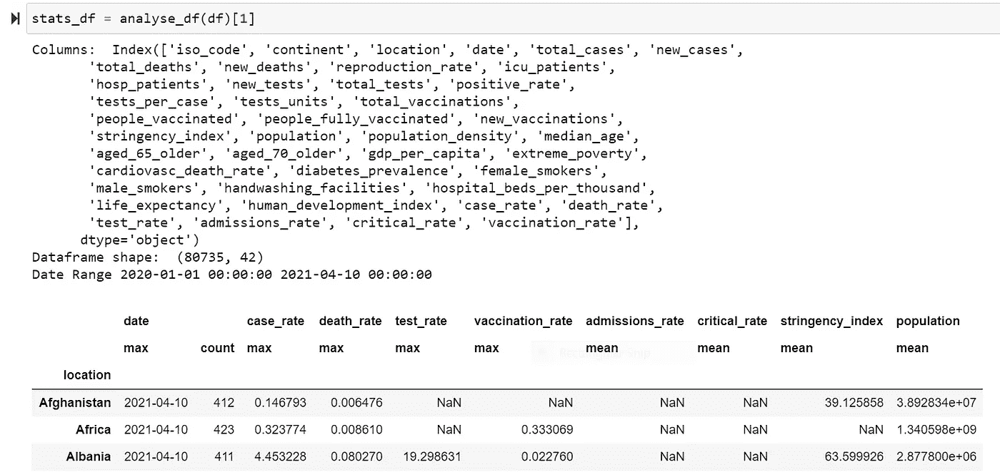

Python 片段基本分析:列列表、数据形状、日期范围和分组

数据由上述 42 列组成，其中“位置”是国家列，每个国家的数据范围从 2020 年 1 月 1 日到 2021 年 4 月 10 日。虽然大部分数据几乎在这一范围开始时就可以获得，但我们知道检测是在很久以后才提供的，疫苗接种更是如此——对大多数发达国家来说是在 12 月下旬。

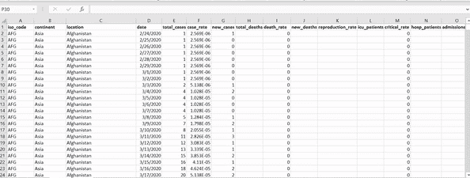

数据源片段-作者 GIF

# 内容

1.  [检测率对艾滋病感染率和死亡率的影响](#cccb)
2.  [严格性指数对 covid 感染率和死亡率的影响](#bbe2)
3.  [年龄对 covid 相关死亡的影响](#cd17)
4.  [贫困对预期寿命的影响(与 covid 无关)](#6b13)
5.  [各国疫苗接种率和未来疫苗接种率预测](#e58b)

## 1.检测率对 covid 感染率和死亡率的影响

积极的检测对抑制死亡和感染有影响吗？或者高感染率和死亡率一定意味着更多的检测吗？

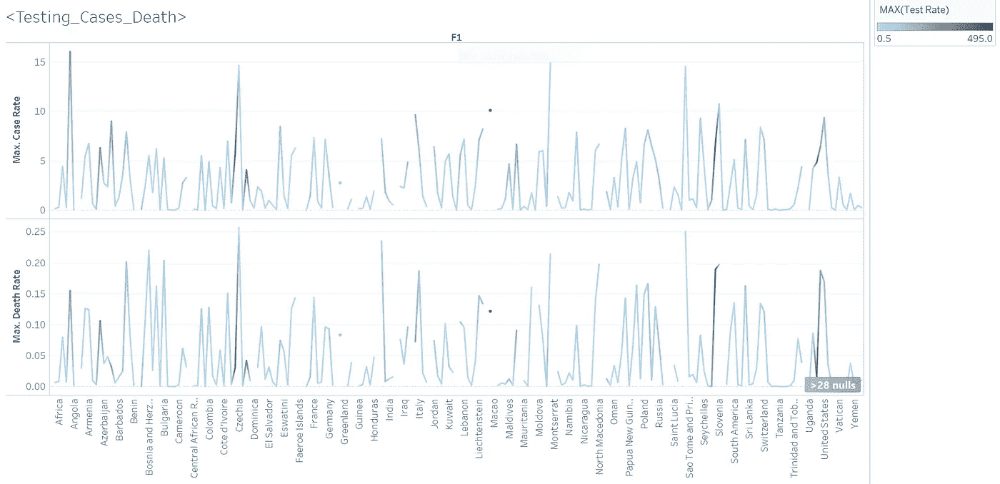

Tableau 即:测试对病例和死亡的影响——作者图片

*注意:不幸的是，嵌入交互式 Tableau 仪表板相当具有挑战性。此处的 vizes 可以跟随*[](https://public.tableau.com/profile/deepika1871#!/vizhome/Covid_Analysis_16180481664000/Vaccinations)**。**

*上面是一个可视化的表格，显示了各个国家的感染率和死亡率，并通过检测率进行了着色。我认为“最大值”是一个集合，因为它给出了每一列的最新观察结果。例如，测试率通过以下方式衡量:*

****测试率=(总测试次数/总人数)*100****

*因为每个国家的 total_tests 的每个单元是每天测试的聚合和，所以 max testing_rate 将为我们提供该国家的最大测试率以及其最近的测试率。我们可以看到，没有特别明显的模式暗示着检测与感染率或死亡率之间的相关性。让我们来看看以下内容。*

*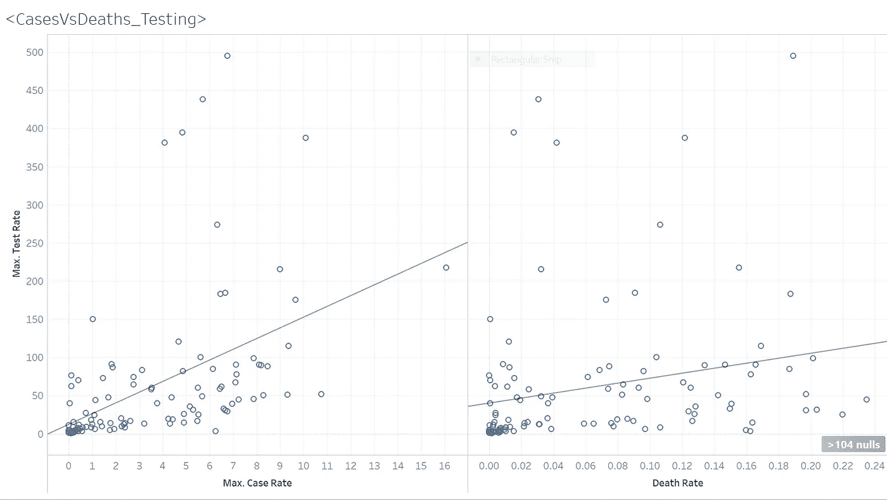*

*Tableau 即:测试对病例和死亡的影响 1 —作者图片*

**请注意，测试率超过 100%是因为每个测试记录都显示了一个国家的总测试次数，而在这个国家中，一个人可能会被测试不止一次。**

*左边是一个散点图，代表按国家分列的最近和最高感染率与最近和最高检测率。值得注意的是，虽然它显示了一种微妙的相关性，指向更高的感染率，意味着更高的检测率，但它并没有强烈地这样做。右边分析检测率和死亡率之间关系的散点图也是如此，它看起来比前者更分散。当徘徊在较低的位置时，很明显是中低收入国家，如巴西、秘鲁、哥伦比亚、印度尼西亚等。这表明中低收入经济体的低检测率。让我们看看相关率:*

*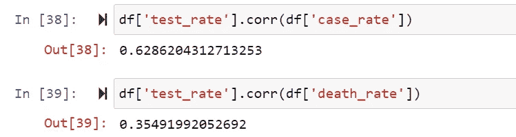*

*Python 相关性片段-作者图片*

*虽然不能确定高感染率或高死亡率是否直接意味着更多的检测，但可以肯定的是，国家的经济地位等因素也可能发挥作用。由科学报告研究人员进行的一项有趣的研究确定，死亡率和检测率之间确实存在非常低的相关性，而根据《我们的世界》的数据报告和科学报告[【2】](https://ourworldindata.org/coronavirus-testing#the-scale-of-testing-compared-to-the-scale-of-the-outbreak)，检测率和感染率之间的相关性虽然高于平均水平，但在高收入国家进一步提高。这种相关性差距可能归因于低收入国家缺乏检测资源，导致整体分析出现偏差。哪里缺乏测试，哪里就缺乏对现有案例的了解。在他们的研究中，通过将数据分成低、中、高收入国家的子组，然后进行个体回归分析[【3】](https://www.nature.com/articles/s41598-020-68862-x)，弥补了这种差距/偏差。*

## *2.严格性指数对 covid 感染率和死亡率的影响*

*在 covid 时代，作为一个在实施措施方面“更严格”的国家，感染或死亡情况会有所好转吗？或者高感染率和高死亡率会影响严格指数吗？*

*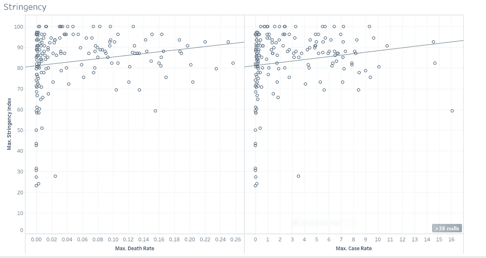*

*Tableau 即:严格指数对病例和死亡的影响—作者提供的图像*

*正如我们的世界在数据中所定义的，严格指数是一个国家在实施多少 covid 限制方面的严格程度，范围从 0 到 100，0 是最低的。严格性本身表明与死亡率或感染率的相关性相当低，因为用点表示的国家相当分散。死亡率和感染率的极少量差异可由严格性来解释，这可由以下相关统计数据来支持。*

*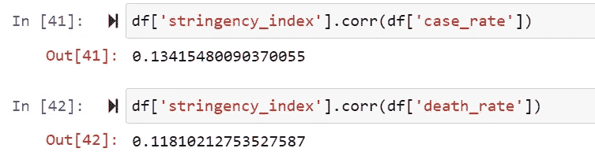*

*Python 相关性片段 1-作者图片*

*尽管人们会认为随着病例和死亡人数的增加，各国会变得更加严格，但对于一个国家的管理机构来说，严格性似乎是相当主观的。处于最严格范围内的国家(接近 100 个)来自全球各地，与世界其他地区相比，不一定所有国家都有极高的病例/死亡率(RoW)。缺乏文献来支持严格性水平对病例/死亡的影响的研究，这可能是因为该措施是新的。在 covid 病例激增后，各国可能面临更严格的措施，但是，与这一措施相关的统计数据可能无法准确反映现实。正如《我们的数据世界》所言，这是因为"*它不能衡量或暗示一个国家应对措施的适当性或有效性。较高的分数并不一定意味着一个国家的反应比指数较低的其他国家更好。*[【3】](https://ourworldindata.org/covid-government-stringency-index)*

## *3.年龄对 covid 相关死亡的影响*

*65 岁以上人口比例高的国家死亡率高吗？*

*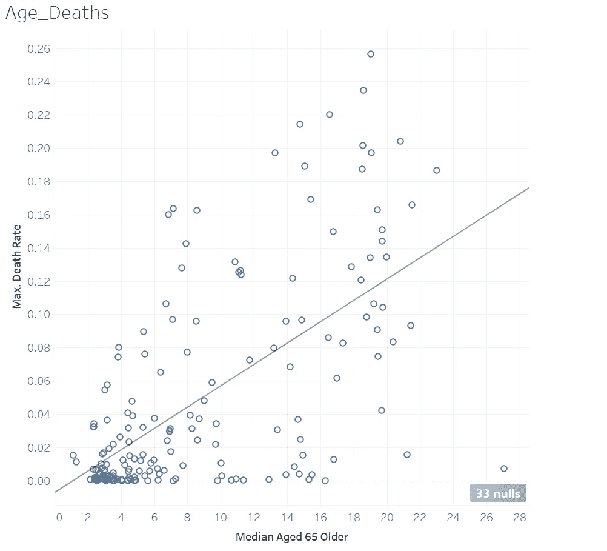*

*Tableau 即:老龄化对病例和死亡的影响——作者图片*

*是的，从上面的图中可以合理地说，这里有一个特定的持续模式，即死亡率的大部分差异可以通过是否有很大比例的人口处于 65 岁以上的年龄范围来解释。右下角的点是一个异常值，那里 27%的人口中有很大一部分是 65 岁及以上，然而，他们看到的死亡率与该行相比非常低。这一点不出意料的是日本。这是因为他们在技术上的进步，还是仅仅因为他们在免疫力和健康方面的名声？*

*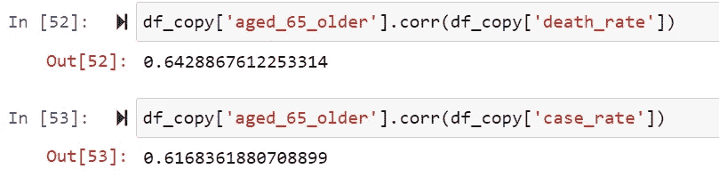*

*Python 相关性片段 2—作者图片*

*从 python 中提取的相关性统计数据证实了死亡与 65 岁以上人口百分比之间高于平均水平的相关性。有多项研究表明，年龄在 covid 相关死亡率中起着至关重要的作用。一篇这样的科学文章有趣地声称*“一些研究人员指出，家庭内社会互动的不同规模和特征、地方性感染和人口年龄中位数等因素影响了新冠肺炎风险和死亡率”*[【4】](https://www.news-medical.net/news/20210223/Countries-with-older-populations-have-higher-SARS-CoV-2-infections-and-deaths-says-study.aspx)。世卫组织报道，不用解释，由于伴随老龄化而来的生理变化和潜在条件，老年人群面临着更大的感染和感染死亡的风险。*

## *4.贫困对预期寿命的影响(与 covid 无关)*

*尽管与 covid 无关，但如下图所示，贫困率与低预期寿命之间的关联非常有趣。*

*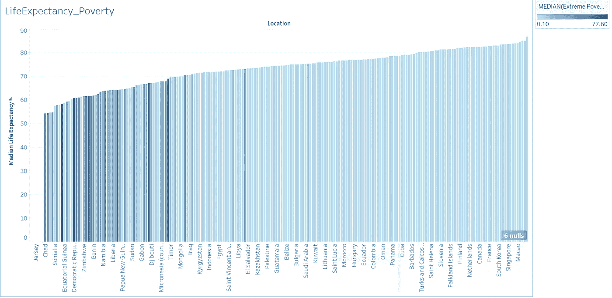*

*Tableau，即:贫困对预期寿命的影响——作者图片*

*从上面的图表可以明显看出，生活在极端贫困中的国家平均预期寿命较低。较暗的蓝色表示贫困率较高，主要位于 50 至 70 岁的预期寿命范围内，而大多数贫困率较低的国家的人口寿命较长，生活富裕。看到一些国家的预期寿命低至 50 至 60 岁，确实令人震惊。下图证明了预期寿命的巨大差异可以用贫困率来解释。*

*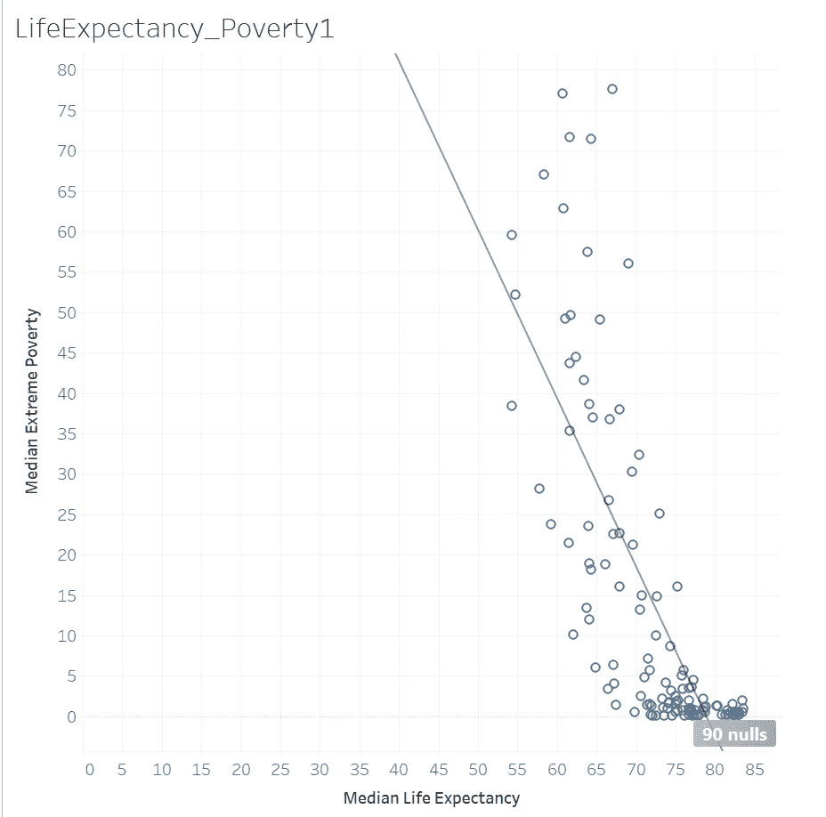*

*Tableau，即:贫困对预期寿命的影响 1-作者图片*

*上图非常有力地表明，较低的贫困率解释了较高的预期寿命。下面的相关统计证实了显著的负相关。*

*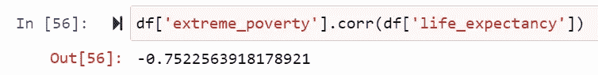*

*Python 相关性片段 3—作者图片*

*城市研究所和社会与健康中心的一份非常清晰的报告探讨了贫困在预期寿命中所起作用的细节，并提供了引人注目的统计数据来支持一些推论，如"*收入较低的人健康状况较差，患病和死亡的风险较高"*[【6】](https://www.urban.org/sites/default/files/publication/49116/2000178-How-are-Income-and-Wealth-Linked-to-Health-and-Longevity.pdf)。不计其数的因素造成了收入和预期寿命之间的差距，从卫生标准到及时寻求医疗护理的能力，到资源的可用性等等。*

## *5.各国疫苗接种率和未来疫苗接种率预测*

*现在，让我们转到期待已久的各国疫苗接种率分析。请注意，我在计算时考虑了完全接种的人群，即第一剂和第二剂(如果适用)。在仔细研究了上面几节中介绍的一些列之后，我们对数据有了很好的理解，可以进行一些更复杂的分析。*

*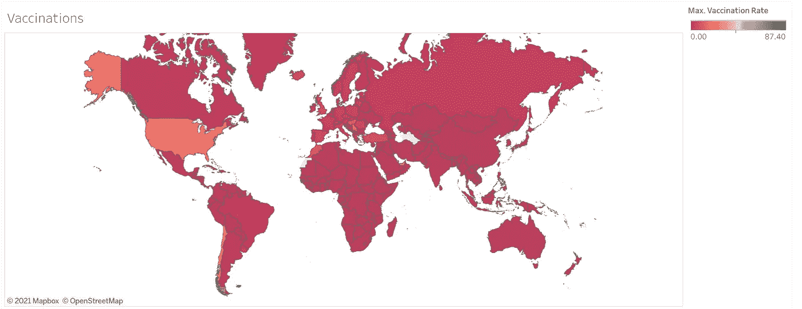*

*表格，即:按国家、地理地图分类的疫苗接种率——按作者分类的图片*

*虽然在上面的地图上看不到，但西班牙南部的直布罗陀是疫苗接种率最高的国家(更确切地说是独立领土),达到了 87.4%。第二名是以色列，该国几乎 60%的人接种了疫苗。显然，该行仍有许多工作要做。我们可以看到，美国、摩洛哥、塞尔维亚、智利和其他一些国家也略微领先，大约 20%的人口已经接种了疫苗。*

*现在我们已经了解了当前的接种率，我将尝试预测两个月后的接种率。我们即将获得自由吗？为了达到大部分限制可以取消的程度，科学家们设定了 65–70%[[1]](https://www.jhsph.edu/covid-19/articles/achieving-herd-immunity-with-covid19.html)的阈值，这意味着每个国家的这部分人口必须接种疫苗或免疫才能放松限制。我想使用多项式回归来确定哪些国家能够在未来两个月内通过接种疫苗实现这一目标。*

*请注意，我只是根据当前和历史的疫苗接种率。我绝不是说预测就像他们得到的一样好，因为在现实中，增加变量，如每个国家预定的疫苗交付可能会给我们理想的结果，但我只是用我这里有的东西。事不宜迟，我们开始吧！*

***导入库***

```
*import pandas as pd
import numpy as np
from matplotlib import pyplot
import matplotlib.pyplot as plt
from matplotlib import rcParams
import seaborn as sns
from IPython.display import display
from sklearn import linear_model
from sklearn.model_selection import train_test_split
from sklearn.preprocessing import PolynomialFeatures
from sklearn.metrics import r2_score
import statsmodels.formula.api as smf
from statsmodels.regression.linear_model import OLS
from sklearn.linear_model import LinearRegression
import math
from math import sqrt
from sklearn.metrics import mean_squared_error
from random import random
import datetime as dt*
```

***准备并分析数据帧***

```
*df = pd.read_csv(r'C:\Users\Deepika\OneDrive\Documents\Professional\owid-covid-data.csv') *#Keeping only relevant columns*
df = df[['iso_code', 'continent', 'location', 'date', 'total_cases', 'new_cases','total_deaths', 'new_deaths','reproduction_rate', 'icu_patients',
         'hosp_patients','new_tests', 'total_tests','positive_rate', 'tests_per_case', 'tests_units', 'total_vaccinations',
       'people_vaccinated', 'people_fully_vaccinated', 'new_vaccinations','stringency_index',
       'population', 'population_density', 'median_age', 'aged_65_older',
       'aged_70_older', 'gdp_per_capita', 'extreme_poverty',
       'cardiovasc_death_rate', 'diabetes_prevalence', 'female_smokers',
       'male_smokers', 'handwashing_facilities', 'hospital_beds_per_thousand',
       'life_expectancy', 'human_development_index']]*#A very important step*
df['date'] = pd.to_datetime(df['date'])*
```

*为附加列和一些分析创建函数*

```
**# Creating function for additional columns and some analyses* def analyse_df(df):
    df['case_rate'] = (df['total_cases']/df['population'])*100
    df['death_rate'] = (df['total_deaths']/df['population'])*100
    df['test_rate'] = (df['total_tests']/df['population'])*100
    df['admissions_rate'] = (df['hosp_patients']/df['population'])*100
    df['critical_rate'] = (df['icu_patients']/df['population'])*100
    df['vaccination_rate'] = (df['people_fully_vaccinated']/df['population'])*100
    print('Columns: ', df.columns)
    print('Dataframe shape: ', df.shape)
    print('Date Range', df['date'].min(),df['date'].max())
    #get some stats for each country using groupby
    stats_df = df.groupby('location')[['date','case_rate','death_rate','test_rate','vaccination_rate',
                    'admissions_rate','critical_rate','stringency_index',
                                 'population']].agg({"date":['max', 'count'],
                 'case_rate':'max','death_rate':'max','test_rate':'max','vaccination_rate':'max',
                    'admissions_rate':'mean','critical_rate':'mean','stringency_index':'mean','population':'mean'}) display(stats_df)
    display(df.corr()) sns.heatmap(df.corr(), vmin=-1, vmax=1, center=0,cmap=sns.diverging_palette(20, 220, n=200),square=True)
    plt.xticks(rotation=45)
    rcParams['figure.figsize'] = 12,8 return df, stats_df*
```

*调用函数*

```
*df = analyse_df(df)[0]
stats_df = analyse_df(df)[1]*
```

*上面的代码片段返回了关于每个国家的一些有趣的利率以及每个变量与另一个变量的相关程度的统计数据。然后，我们必须保存带有新创建的列的数据框(此处为 df ),以供进一步分析。下面的 GIF 提供了对该输出的快速浏览。*

*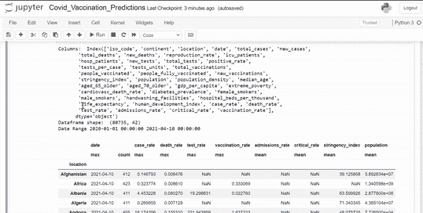*

*Python 分析:df 属性、相关性和相关性图、按列分组的统计数据-按作者分类的图像*

***建立回归模型***

*我选择了多项式模型，因为这是分析和预测疫苗接种率上升趋势的最直接的方法。我用 ARIMA 模型尝试了一种更先进的时间序列分析，发现多项式模型的结果更真实、更准确。在接下来的部分，我分享了我的分析代码。请务必阅读解释每一个步骤的评论。*

*创建模型函数*

```
*def poly(name, group): *# transfrom the date into an integer to be able to fit it into* the model
    group['date_transformed'] = group['date'].map(dt.datetime.toordinal)    *# Create a range to be able to tell the model later to predict within this range. I want to predict for a range that is 10 points more than half the number of observations in input data.*
    Range = group['date_transformed'].max() + round(len(group)/2) + 10
    predict_dates = list(range(group['date_transformed'].max() + 1, Range))

    *# Build the model
*    *# Make sure to transfrom the input data*
    x = group['date_transformed'].values[:,np.newaxis]
    y = group['vaccination_rate'].values
    polynomial_features = PolynomialFeatures(degree=2)
    x_poly = polynomial_features.fit_transform(x)
    model = LinearRegression()
    model.fit(x_poly, y) *# Test the model and its accuracy*
    y_poly_pred = model.predict(x_poly)
    rmse = np.sqrt(mean_squared_error(y,y_poly_pred))
    r2 = r2_score(y,y_poly_pred) *# Save the predictions as a column of the input data*
    group['Pred'] = y_poly_pred
    group_export = group[['date','vaccination_rate','Pred']].set_index('date') *# View results*
    print(name)
    print('rmse: ', rmse)
    print('r2: ', r2)
    return model, polynomial_features, predict_dates, group_export*
```

***模型结果***

*按位置(国家)对数据进行分组。*

```
**# Create grouped data for access later*
df_grouped = df.groupby(['iso_code','continent','location'])*
```

*将模型应用到分组数据的每个类别中，以获得国别预测。*

```
**# Dictionaries to save the results of the model* dct_original = {}
dct_future = {}*# Access each country data seperately* for name, group in df_grouped: * # Make sure to select countries without NaN values in vaccination_rates*
    group1 = group[group['people_fully_vaccinated'].notna()] *# Countries with at least 50 vaccination data points for better predictions*
    if len(group1) > 50: *# Save outputs from the function into the following variables*
        predict_dates = poly(name, group1)[2]
        model = poly(name, group1)[0]
        polynomial_features = poly(name, group1)[1]
        group_export = poly(name, group1)[3]
        group_export['Location'] = name[2] *# Future predictions for the range of dates specified in the function. Again, remember to tranform the input*
        Predictions = model.predict(polynomial_features.fit_transform(np.array(predict_dates).reshape(-1,1))) *# Putting the predictions and dates into a dataframe*
        Predictions_df = pd.DataFrame({'Future_dates': list(predict_dates),'Predictions': list(Predictions)}) *# Converting the transformed dates to original date format*
        Predictions_df = Predictions_df.set_index(Predictions_df['Future_dates'].map(dt.datetime.fromordinal)) *# Add country to the dataframe to identify the data*
        Predictions_df['Location'] = name[2]    

    *# Save input data predictions and future predictions into dictionaries to access later*
        dct_original[name] = group_export
        dct_future[name] = Predictions_df *#* *Plot current observed, predicted and future predicted data*
        plt.figure(figsize=(10,5))
        plt.xticks(rotation=45)
        plt.title('Model ' + name[2])
        plt.xlabel('Date', fontsize=11)
        plt.ylabel('Vaccination Rate', fontsize=11)
        plt.scatter(group_export.index, group_export['vaccination_rate'])
        plt.plot(group_export['Pred'], color = 'g')
        plt.plot(Predictions_df[['Predictions']], color = 'm')
        plt.legend(['Validation', 'Predictions', 'Train'], loc='lower right')
        plt.show() *# View the Actual vs Predicted data and their data count
*       print('Observations in Actual Data = %f, Predicted Observations=%f' % (len(group1), len(Predictions)))
       print( "\n".join("{} {}".format(x, y) for x, y in zip(predict_dates, Predictions)))*
```

*疫苗接种数据点超过 50 个的 40 个国家中的一些国家的样本输出*

*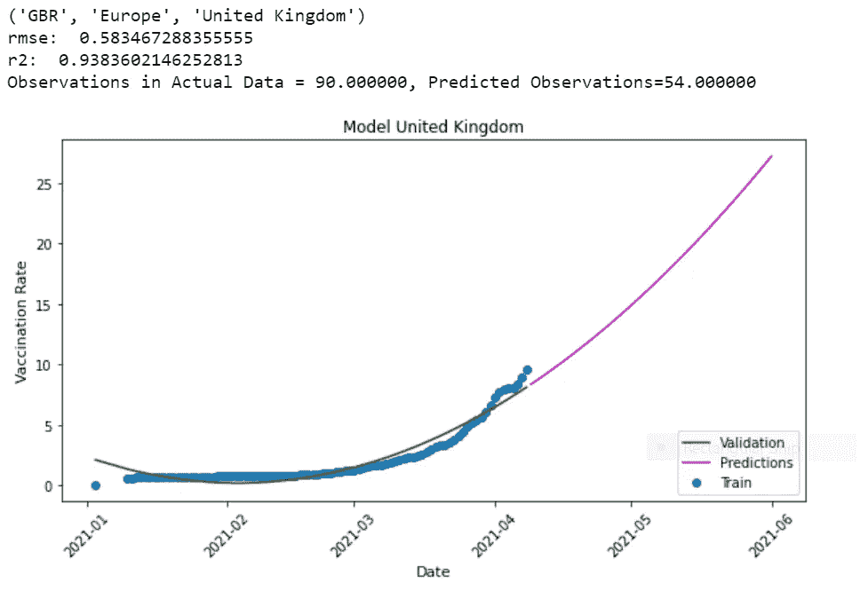*

*Python viz 作者图片*

*从以上对英国的预测中，我们可以看到，考虑到疫苗接种率数据，RMSE 是相当低的，而 R 显示了高准确率。该预测称，到 6 月初，大约 30%的英国人可以接种疫苗。*

*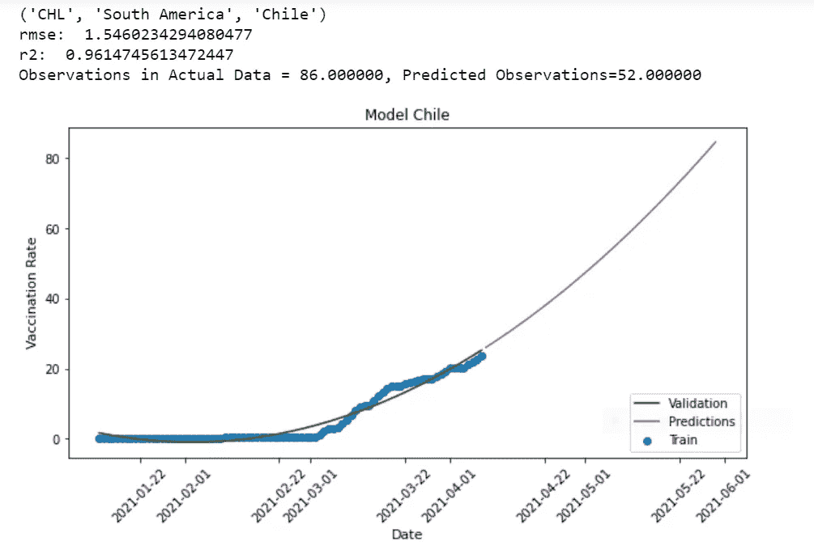*

*python viz 1-作者图片*

*智利的 RMSE 相当低，而 R 则显示出相当好的准确性。预测表明，潜在的 90%的人口可以在 6 月初接种疫苗。*

*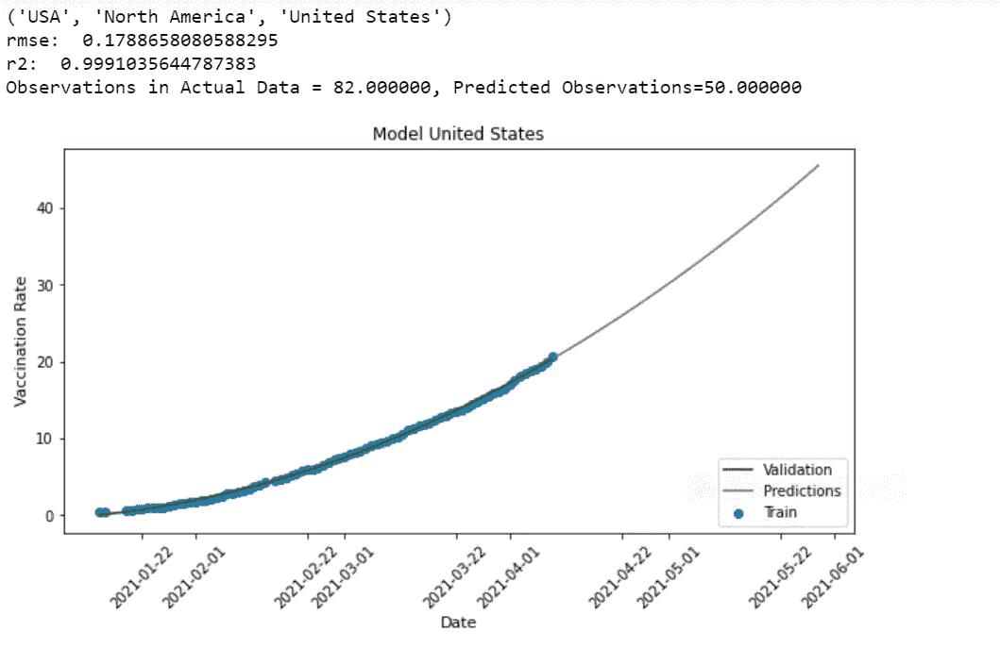*

*python viz 2-作者图片*

*现在，对于美国的预测，我们看到近一半的美国人口可以在 6 月初接种疫苗。尽管这可能是一个合理的预测，但 RMSE 非常低而 R 非常高的模型可能会返回过度拟合的结果。当验证非常接近实际数据，但对看不见的数据点(测试或未来数据)的预测不现实或不切实际时，就会发生过度拟合。在这个特定的场景中，尽管精确度非常高，但是模型产生了良好的结果。当然，考虑到目前的增长率，50%似乎是一个很高的可实现率。然而，对于训练和验证点如此精确和接近的模型来说，经常有可能过度拟合。补救回归模型过度拟合的一种方法是降低多项式的次数。例如，对于这个特定的模型，我们使用的阶数为 2，这是多项式模型的最低阶数。*

```
**# Polynomial degree used before* 
polynomial_features = PolynomialFeatures(degree=2)*
```

*替代模型*

*或者，如果我们试图获得更通用的预测并避免可能的过度拟合，我们可以考虑将阶数从 2 改为 1，这将使其成为线性回归模型。观察该图的线性特征，我们也可以有把握地说，这种趋势的线性模型应该足够了。所以让我们看看线性模型对这个特定国家的预测是否有所不同。我将继续替换美国的多项式模型。我们将使用与多项式模型相同的代码结构，除了这一次，我们将不使用“多项式 _ 特性”。*

```
*for name, group in df_grouped:
    if name[2] == "United States": # Only for the US
        group1 = group[group['people_fully_vaccinated'].notna()]
        group1['date_transformed'] = group1['date'].map(dt.datetime.toordinal) # transform date column into integer to be able to build model
        Range = group1['date_transformed'].max() + round(len(group1)/2) + 10 
        predict_dates = list(range(group1['date_transformed'].max() + 1, Range)) # create a range of dates to make future predictions
        x = group1['date_transformed'].values[:,np.newaxis] # input data transformed
        y = group1['vaccination_rate'].values *# input train data*
        model = LinearRegression()
        model.fit(x, y) *# Fitting linear regression* 
        y_pred = model.predict(x)
        group1['Pred'] = y_pred
        r2 = model.score(x,y) *# alternatively, r-squared can also be measured this way*
        rmse = mean_squared_error(y, y_pred, squared=False)
        group_export = group1[['date','vaccination_rate','Pred']].set_index('date')
        Predictions = model.predict(np.array(predict_dates).reshape(-1,1))
        Predictions_df = pd.DataFrame({'Future_dates': list(predict_dates),'Predictions': list(Predictions)})
        Predictions_df = Predictions_df.set_index(Predictions_df['Future_dates'].map(dt.datetime.fromordinal))
        plt.xticks(rotation=45)
        print(name)
        print('rmse: ', rmse)
        print('r2: ', r2)
        plt.scatter(group_export.index, group_export['vaccination_rate'])
        plt.plot(group_export['Pred'], color = 'g')
        plt.plot(Predictions_df[['Predictions']], color = 'm')
        plt.legend(['Validation', 'Predictions', 'Train'], loc='lower right')*
```

*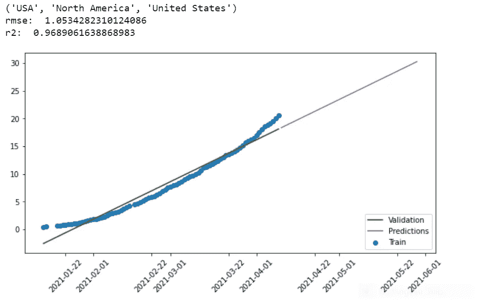*

*Python viz 3—作者图片*

*线性模型的结果显示出比多项式模型更低的统计精度。该模型现在不再显示过度拟合的症状。此处 30%的预测在我们的场景中不太乐观，但关键的一点是，当有可能获得过度拟合的结果时，降低程度可能会产生更通用的结果，因此看不见的数据点的结果更可靠。*

## ***6 月初疫苗接种率***

*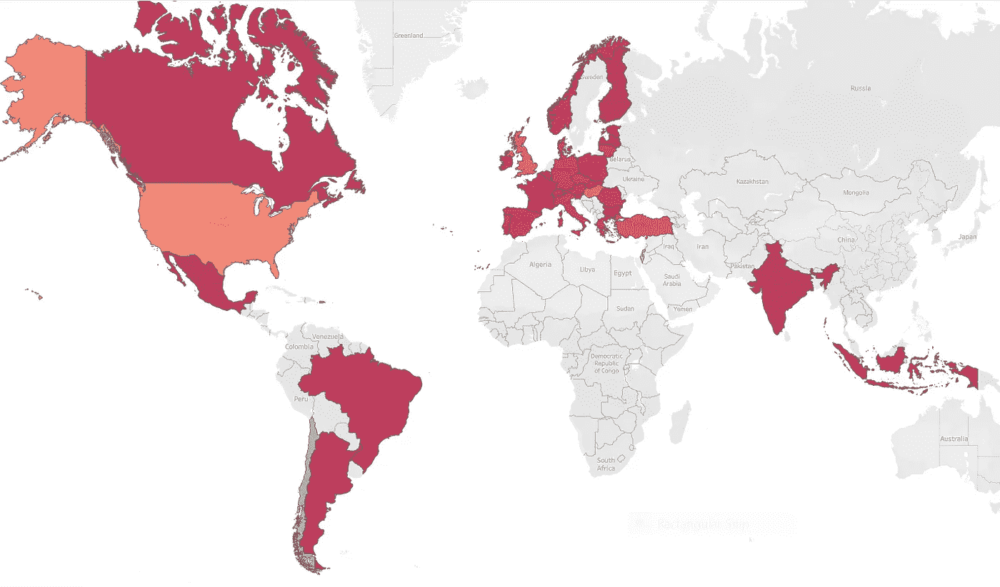*

*Tableau 即:预测疫苗接种值的地理图*

*以上是最终输出的可视化表格。由于我设置了过滤器，只对当前疫苗接种率至少为 50 天的国家进行预测，因此预测范围缩小到有色人种国家。这个过滤器可以用来获得更多国家的预测，但是，它可能会影响准确性。*

*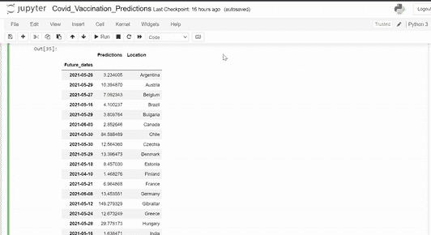*

*作者预测数据框架 GIF*

*《经济学人》绘制的一幅类似的图像大胆地强调了富人和穷人在疫苗接种收益方面的差距。*

*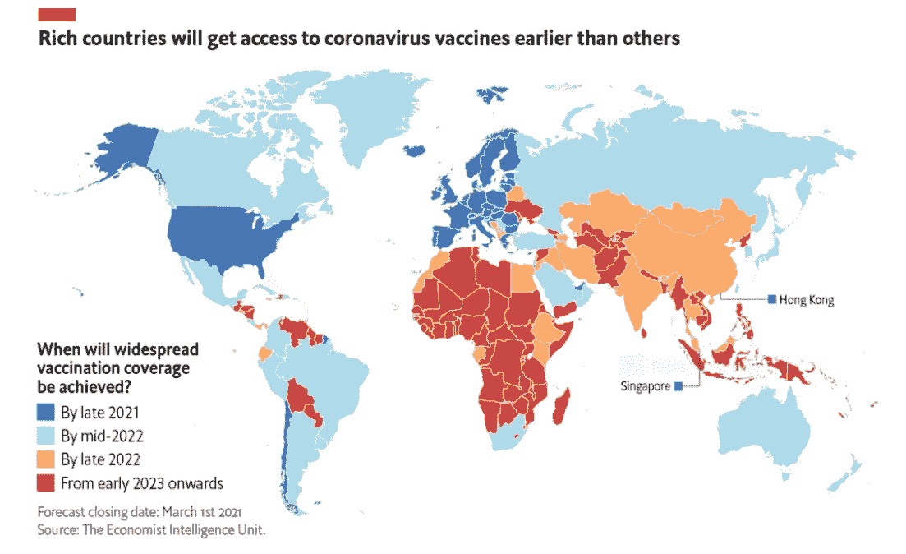*

*来源:经济学家[【8】](https://www.eiu.com/n/eiu-latest-vaccine-rollout-forecasts/)*

## *基于模型的方法的局限性*

*虽然盲目地遵循基于模型的方法往往很诱人，但我们必须记住，所有预测都是基于假设的，这一次也不例外。这尤其适用于我们几乎无法控制的医疗、经济、政治、社会或行为领域的预测。例如，对于这个特定的模型，以下是限制:*

1.  *如前所述，该模型没有考虑国家的预定交付量，这可能会改善预测。*
2.  *当然，没有足够的新冠肺炎疫苗接种数据让监督模型完全可靠。正如在这个模型的地理可视化中所看到的，许多国家甚至还没有 50 个疫苗接种数据的观察。*
3.  *该模型假设疫苗推广的一致性。然而，对许多国家来说，这一假设已被证明是错误的。一个国家的铺开一致性当然受到 covid 时代不断变化的法律的影响。以阿斯利康在丹麦被禁为例。这种意想不到的外部因素对结果的影响很少能被纳入机器学习模型。*
4.  *随着许多变种被发现，关于疫苗接种是否意味着免疫的问题仍然存在。目前预测模型的结果是否意味着免疫，还不得而知。因此，这项研究假设疫苗接种率仅仅是疫苗接种率，而不是免疫力。*

*尽管有其局限性，但不用说，在许多情况下，一个好的基于模型的方法比盲目的直觉和猜测要好。它可能不会给我们完美的答案，但它肯定会给我们一个预期的想法，并帮助我们更好地准备和/或做出更好的决定。理想的结果可能是一个健壮的模型和一点受过教育的直觉的结合。*

*如果你真的跟随并设法获得了你自己的预测，那太好了！我希望他们看起来也一样乐观！同样，这是[的数据](https://github.com/owid/covid-19-data/tree/master/public/data)，这是[的画面](https://public.tableau.com/profile/deepika1871#!/vizhome/Covid_Analysis_16180481664000/Vaccinations)。感谢阅读！*

# *参考*

*[1] D. Gypsyamber 和 D. David，什么是群体免疫，我们如何通过新冠肺炎实现群体免疫？(2021 年 4 月)，约翰霍普金斯大学彭博公共卫生学院*

*[2] R. Hannah 等人，冠状病毒(新冠肺炎)检测(2021 年 4 月)，数据中的我们的世界*

*[3]李立林、丁庆洪、胡俊伟、新冠肺炎死亡率与检验次数和政府效率呈负相关(2020 年 7 月)，科学报告*

*[4] T .李记，《新闻医学生命科学》的一项研究(2021 年 2 月)称，人口老龄化的国家新型冠状病毒病毒感染率和死亡率都较高*

*[5]世卫组织，在新冠肺炎疫情期间支持老年人是每个人的事，(2020 年 4 月)，世界卫生组织*

*[6] H. W .史蒂文，收入和财富与健康和长寿有什么联系？(2015 年 4 月)，城市研究所和社会与健康中心*

*[7] BBC，阿斯利康疫苗:丹麦完全停止推广(2021 年 4 月)，BBC 新闻*

*[8]EIU，EIU 最新疫苗首次展示预测(2021 年 3 月)，《经济学家》*