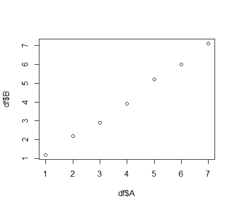
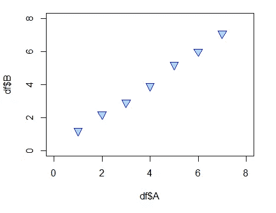
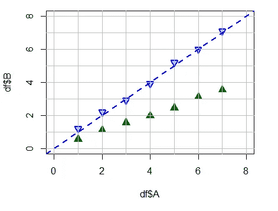
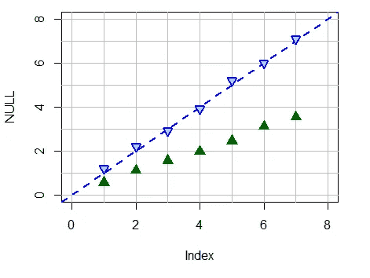

# R 剧情定制速成班

> 原文：<https://towardsdatascience.com/a-crash-course-in-r-plot-customization-38473262184c?source=collection_archive---------39----------------------->

## 把剧情从布拉到哇


照片由 [Steinar Engeland](https://unsplash.com/@steinart?utm_source=medium&utm_medium=referral) 在 [Unsplash](https://unsplash.com?utm_source=medium&utm_medium=referral) 上拍摄

使用 RStudio 时，您首先要学习的函数之一是`plot()` 函数，它可以制作简单的 X-Y 图来帮助您可视化数据。在本文中，我们将向您展示如何通过以下方式改进您的绘图:

*   叠加多个图
*   改变颜色和尺寸
*   覆盖趋势线
*   添加地块网格
*   与`plot()`的各层合作，让一切都恰到好处

在本帖中，我们将向您展示如何对一个简单的散点图进行这些调整，但是这里介绍的技巧和工具也可以直接应用于其他类型的图——条形图、折线图等等。

让我们从创建一个简单的数据框和一个基本的绘图开始:

```
df <- data.frame (A = c(1,2,3,4,5,6,7),
                  B = c(1.2, 2.2, 2.9, 3.9, 5.2, 6, 7.1),
                  C = c(0.55, 1.1, 1.56, 1.96, 2.45, 3.11, 3.55))
# plot(x,y)
plot(df$A, df$B)
```



极其乏味的散点图

这将创建最基本的绘图，具有自动缩放的轴和默认轴标签。首先，我们来提高一些基本的审美。自动缩放可能不是首选-在这种情况下，可以用`xlim`和`ylim`手动设置。

接下来，我们来加点颜色！`col`是一种简单的方法，可以通过数百个直观的颜色名称来改变数据点的颜色。完整列表可通过`colors()`找到。

当我们这样做的时候——默认的开放圆很好，但是我们的点形状有更多的选择。这些有 26 个选项([见这里的](http://www.endmemo.com/r/pchsymbols.php))，通过设置从 0 到 25 的值来调用。其中最有趣的是允许我们通过使用`bg`属性来指定一个形状和填充该形状的颜色。

再来一个——让我们用`cex`来调整数据点的大小。为了调整尺寸，我们指定一个数字比例因子——例如，我们应用`cex = 1.2`使它们为原始尺寸的 120%。`cex`是一个强大的工具，它可以让我们调整几乎任何东西的大小——但稍后会有更多的介绍。让我们来看看当我们把它们放在一起时是什么样子:

```
plot(df$A, df$B, col="blue", xlim=c(0,8), ylim=c(0,8), 
     pch=25, bg="lightblue", cex=1.5)
```



一些基本的颜色和形状升级

# 层层叠叠

想到`plot()`命令的一个很好的方法是，它设置绘图空间，并且每个后续命令粘贴到它上面。这对我们来说意味着我们可以分段构建一个图，在我们遍历单独的代码行时添加。

对于绘图功能，覆盖我们的数据帧的附加元素进行比较将是有用的。我们可以用`points`命令在同一个绘图上覆盖另一列数据，这里，像绘图一样，我们设置 X，Y，颜色，符号(pch)等。

手动向我们的绘图添加线条也可以帮助可视化，无论是对于趋势线这样的东西，还是对于设置一个简单的网格。我们用`abline`添加这些，它们有一些简单的预置

*   `h`为水平线
*   `v`对于垂直线
*   `a`为 y 轴截距，`b`为斜率

我们可以用`lwd`设置线条的线宽，这也可以用来调整我们的点符号轮廓的线宽。线型也可以用`lty`通过六个名称中的一个来控制(虚线等)，如`"dashed"`或`"dotted"` ( [这里是完整列表](http://www.sthda.com/english/wiki/line-types-in-r-lty))。

```
plot(df$A, df$B, col="blue", xlim=c(0,8), ylim=c(0,8), 
     pch=25, bg="lightblue", cex=1.2, lwd=2)# the second set of points
points(df$A, df$C, col="darkgreen", pch=17, cex=1.6)# horizontal grid lines
abline(h=0:8, col="gray")# vertical grid lines
abline(v=0:8, col="gray")# trendline- a: intercept, b: slope
abline(a=0, b=1, lty="dashed", lwd=2, col="blue")
```



但是为什么那些点隐藏在网格线后面呢？

细心的人会发现，我们的网格线现在位于我们的点上方——这又回到了`plot()`的层层叠加方法，每个操作都叠加在前一个之上。为了克服这一点，我们将首先创建一个空白画布，然后按顺序添加我们的层。为此，我们使用`NULL`来代替`plot()`中的 x，y 变量。值得注意的是，我们仍然需要在这一步设置我们的自定义`xlim`和`ylim`，因为我们以后没有机会了。

```
# blank canvas
plot(NULL, xlim=c(0,8), ylim=c(0,8))# line overlays
abline(h=0:8, col="gray")
abline(v=0:8, col="gray")
abline(a=0, b=1, lty="dashed", lwd=2, col="blue")#points:
points(df$A, df$B, col="blue", pch=25, bg="lightblue", 
       cex=1.2, lwd=2)
points(df$A, df$C, col="darkgreen", pch=17, cex=1.6)
```



这才像话！

我们就要到了，但是现在我们的轴标题并不完全是描述性的，不是吗？在我的下一篇文章中，我将展示如何编辑它们，添加标题、副标题和图例。现在，这里显示的代码可以在我的 github [这里](https://github.com/bamattis/Blog/tree/main/R/PLOT%20in%20R/Crash%20Course)找到。我鼓励你尝试所有的设定，并从定制剧情中获得一些乐趣，让它按照你喜欢的方式进行。

觉得这篇文章有用？在 Medium 上关注我([布莱恩·马蒂斯](https://brian-mattis.medium.com/))，以获得我最新帖子的通知！