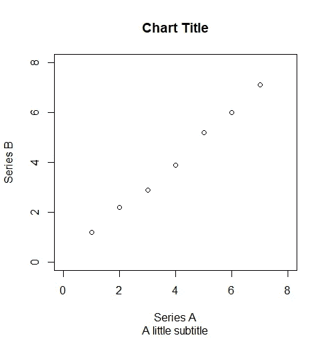
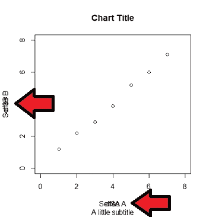
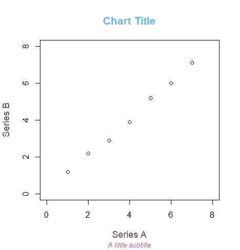
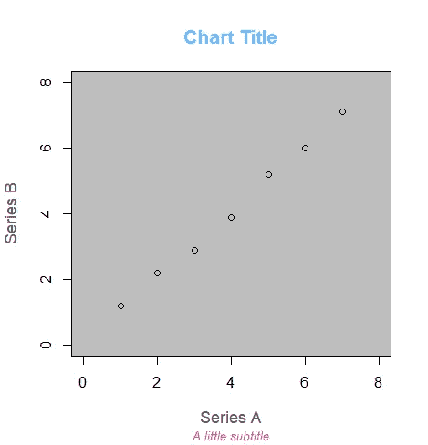
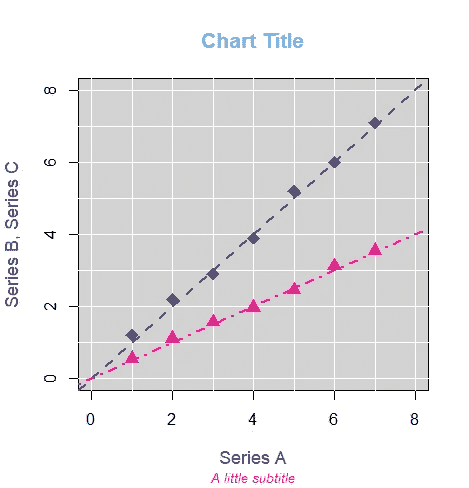
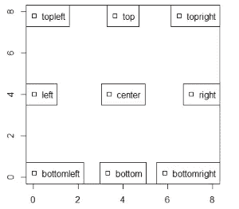
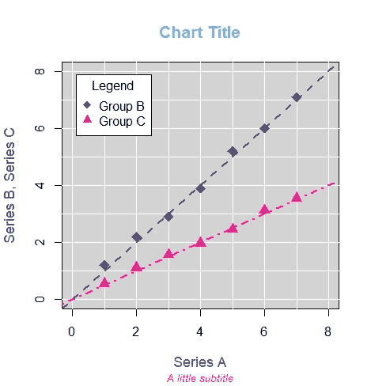
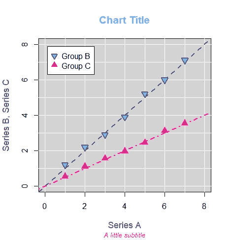

# R 图定制速成班—第二部分

> 原文：<https://towardsdatascience.com/a-crash-course-in-r-plot-customization-part-2-f4c60554b136?source=collection_archive---------33----------------------->

## 标题、图例、背景颜色等等


[陈丹妮](https://unsplash.com/@denmychan?utm_source=medium&utm_medium=referral)在 [Unsplash](https://unsplash.com?utm_source=medium&utm_medium=referral) 上的照片

r 附带了一个很棒的内置绘图生成工具，不出所料，它被命名为`plot()`。然而，最基本的情节在视觉上吸引人之前需要很多帮助。在我之前的[文章](/a-crash-course-in-r-plot-customization-38473262184c)中，我们叠加了多个数据集，改变了数据点的颜色和大小，并添加了趋势线。那只是用`plot()`定制的冰山一角！在本文中，我将向您展示如何:

*   添加和自定义标题、轴标题和副标题
*   创建数据图例来解释您的数据
*   自定义图表背景颜色

首先，让我们为我们的图创建一些基本数据:

```
df <- data.frame (A = c(1,2,3,4,5,6,7),
                  B = c(1.2, 2.2, 2.9, 3.9, 5.2, 6, 7.1),
                  C = c(0.55, 1.1, 1.56, 1.96, 2.45, 3.11, 3.55))
plot(df$A, df$B)
```

# 基本标题

最终的图给了我们一个非常普通的图，没有标题，轴标题为“df$A”和“df$B”，对于不熟悉数据表的人来说，这可能没什么意义。我们的第一步是直接定制轴标题，以及添加图表标题和副标题。使用`main`、`xlab`、`ylab`和`sub`，我们可以分别为图表标题、x 轴标签、y 轴标签和绘图副标题分配新值。现在也是用`xlim`和`ylim`为我们的轴设置 x 和 y 范围的好时机。我们通常在主`plot()`函数中这样调用这些函数:



一些非常简单的英语标题

```
plot(df$A, df$B, xlim=c(0,8), ylim=c(0,8),
     main="Chart Title",
     xlab="Series A",
     ylab="Series B",
     sub="A little subtitle")
```

## 内部消息:

虽然图表标题和副标题可以在单独的函数`title()`中编写，但这会增加坐标轴标题的复杂性，不推荐使用。正如我在上一篇文章中提到的，这些图是通过直接在上面添加每个后续命令的层来构建的。因此，如果我们将`xlab`和`ylab`赋值推送到`plot()`命令之后的`title()`命令，默认图形将已经生成默认值“df$A”和“df$B ”,这两个文本将被覆盖。



不…可读性最好

# 标题定制

虽然调整标题和轴文本肯定有助于传达图表的信息，但它肯定不会赢得任何风格点。对于这些图表标签项目中的每一个，我们可以使用`cex`来调整每个元素的具体大小，使用`cex.main`、`cex.sub`或`cex.lab` ( *)。lab* 指 x 轴和 y 轴*标签*—x 轴和 y 轴标签必须一起调整)。`cex`作为默认值的一个比率，这意味着如果你想要标签有 90%那么大，你可以将 cex 设置为 0.90。

接下来，我们调整标签的`font`样式。这里没有太多的定制，但是我们可以使用 1/5 的代码和`1: normal, 2: bold, 3: italic, 4: bold and italic, 5: symbol font`。类似于`cex`，我们把这个叫做`font.main`、`font.sub`、`font.lab`。

没有一点颜色的标签。r 有一个很大的颜色名称库，从控制台调用`colors()`就可以看到完整的列表。为了设置这些，我们使用相同的术语:`col.main`、`col.sub`和`col.lab`。

我发现，为了保持代码的可读性和组织性，我们要调整的每个标题元素最好只有一行代码。

```
plot(df$A, df$B, xlim=c(0,8), ylim=c(0,8),
     main="Chart Title",cex.main=1.3, font.main=2, col.main="steelblue1",
     xlab="Series A", 
     ylab="Series B", cex.lab=1.1, font.lab=1, col.lab="gray34",
     sub="A little subtitle", cex.sub=0.8, font.sub=3, col.sub="deeppink")
```

甚至没有触及我们的图的数据区域，它已经看起来明显更好！



已经看起来好多了！

# 背景颜色

给`plot()`添加一个合适的背景颜色需要一个更迂回的路径。虽然`plot()`像许多其他元素一样有一个`bg`(背景颜色)属性，但是颜色也应用于数据区域之外，并延伸到我们的图表标题之下。这绝对不是我们想要的。

相反，我们将使用`rect()`构建一个定制的彩色矩形，它总是与我们的绘图区域大小完全相同。为此，我们调用一个特殊的函数:`par("usr")`。该函数返回绘图区四条边界的列表，我们可以用它来设置矩形的顶点。一旦我们设置了这些顶点，我们就可以使用`col`来设置矩形的颜色。

```
rect(par("usr")[1],par("usr")[3],par("usr")[2],par("usr")[4],col = "gray")
```

## 层，层，层

这种方法的挑战是，我们新创建的矩形将被直接放置在我们的绘图数据上，使其完全模糊。这又回到了`plot()`命令的分层本质，每个后续命令都直接粘贴在现有图形的顶部，而不考虑已经构建的图形。避免这种情况的唯一方法是构建命令，这样您就可以自下而上地构建命令。因此，当我们转到用`plot()`制作漂亮的图时，我们通常会将数据点 ***添加到最后的*** 。

通过使用`NULL`代替原始`plot()`函数调用中的 X 和 Y 数据，在没有实际调用数据的情况下建立我们的图形框架(标题等)变得很平常。然后用我们在这里谈到的的`points()`命令将数据点分层。

对于彩色背景来说，这是一个很大的工作量，但这种方法也是大多数其他绘图定制(趋势线等)的一个要求，使您的图表在视觉上更具吸引力。

```
plot(NULL, xlim=c(0,8), ylim=c(0,8),
     main="Chart Title",cex.main=1.3, font.main=2, col.main="steelblue1",
     xlab="Series A", 
     ylab="Series B", cex.lab=1.1, font.lab=1, col.lab="gray34",
     sub="A little subtitle", cex.sub=0.8, font.sub=3, col.sub="deeppink")#adding our background rectangle:
rect(par("usr")[1],par("usr")[3],par("usr")[2],par("usr")[4],col = "gray")#inserting our data
points(df$A, df$B)
```



虽然这个灰色背景并不令人兴奋，但是你可以做一些有趣的事情，比如用`gradient.rect()`代替`rect()`来添加彩色的[渐变阴影](https://www.rdocumentation.org/packages/plotrix/versions/3.8-1/topics/gradient.rect)。

# 添加图例

在我们继续添加图例之前，我将首先向我们的绘图添加更多的颜色和数据，以展示我们如何创建复杂的图例。毕竟，当我们在一个情节上只有一组点时，添加一个图例没有太大的意义！使用`points()`和`abline()`，我们可以使用[第一部分](/a-crash-course-in-r-plot-customization-38473262184c)中的技巧定制我们的数据点和趋势线。

```
plot(NULL, xlim=c(0,8), ylim=c(0,8),
     main="Chart Title",cex.main=1.3, font.main=2, col.main="steelblue1",
     xlab="Series A", 
     ylab="Series B, Series C", cex.lab=1.1, font.lab=1, col.lab="gray34",
     sub="A little subtitle", cex.sub=0.8, font.sub=3, col.sub="deeppink")
rect(par("usr")[1],par("usr")[3],par("usr")[2],par("usr")[4],col = "lightgray")# grid lines
abline(h=0:8, col="white")
abline(v=0:8, col="white")#fit lines
abline(a=0, b=1, lty="dashed", lwd=2, col="darkslateblue") 
abline(a=0, b=0.5, lty="dotdash", lwd=2, col="deeppink") #data points:
points(df$A, df$B, col="darkslateblue", pch=18, 
       cex=1.8, lwd=2)
points(df$A, df$C, col="deeppink", pch=17, cex=1.6)
```



为了给这个图添加一个图例，我们首先要选择图例在图表上的位置。在这种情况下，左上角看起来是可用的，所以我们将用`legend("topleft")`放置图例。作为参考，这里展示了 8 个其他选项:



图例放置关键字

这些名字很容易记住——但不幸的是`legend()`默认将这些传说放在我们的情节的绝对角落。如果把它们放在离我们的情节框架稍微远一点的地方会更好。幸运的是，我们可以使用`inset()`来移动它们。

随着我们进一步构建`legend()`，我们必须复制添加数据点时使用的许多决策，例如它们的点形状(`pch`)、点大小(`pt.cex`)、点颜色(`col`)和数据名称(`legend`)。是的，你没看错，我们称`legend`为`legend()`内。对于所有这些字段，我们通常用`c()`制作一个分量向量，以捕捉我们绘制的每个系列的属性。最后，我们可以添加`title`来命名我们的图例框。当然，由于图层排序的原因，图例通常是为情节添加的最后一行代码。将所有这些与上面的代码放在一起，看起来像这样:

```
legend("topleft", legend=c("Group B", "Group C"), 
       pch=c(18,17), col=c("darkslateblue", "deeppink"), 
       pt.cex=c(1.4, 1.3), inset=c(0.05, 0.05), title="Legend")
```



# 额外学分

当我们使用 point `pch`值来设置不同于轮廓的填充颜色时，事情会变得有点棘手。这里我们将使用`bg`设置`points()`内的填充颜色，如下所示:

```
points(df$A, df$B, col="darkslateblue", pch=25, 
       cex=1.4, lwd=2, bg="steelblue1")
```

然而，我们不能仅仅将这个`bg`键复制到我们的图例图中——在这种情况下`bg`将设置我们的图例框的背景颜色，而不是点填充。这同样适用于我们的点的线宽——在`points()`命令中，它们是用`lwd`设置的，但是如果我们在图例中这样做，我们只是结束了图例边界框的线宽设置。

幸运的是，`legend()`提供了两个特殊的命令来处理这种情况:`pt.bg`和`pt.lwd`。综上所述，我们的代码如下所示:

```
plot(NULL, xlim=c(0,8), ylim=c(0,8),
     main="Chart Title",cex.main=1.3, font.main=2, col.main="steelblue1",
     xlab="Series A", 
     ylab="Series B, Series C", cex.lab=1.1, font.lab=1, col.lab="gray34",
     sub="A little subtitle", cex.sub=0.8, font.sub=3, col.sub="deeppink")#background
rect(par("usr")[1],par("usr")[3],par("usr")[2],par("usr")[4],
     col = "lightgray")#grid lines
abline(h=0:8, col="white")
abline(v=0:8, col="white")#trend lines
abline(a=0, b=1, lty="dashed", lwd=2, col="darkslateblue") 
abline(a=0, b=0.5, lty="dotdash", lwd=2, col="deeppink")#points:
points(df$A, df$B, col="darkslateblue", pch=25, 
       cex=1.4, lwd=2, bg="steelblue1")
points(df$A, df$C, col="deeppink", pch=17, cex=1.6)#legend
legend("topleft", legend=c("Group B", "Group C"), pch=c(25,17),
       pt.bg="steelblue1", pt.lwd=c(2,1),
       col=c("darkslateblue", "deeppink"), pt.cex=c(1.2, 1.4), 
       inset=c(0.05, 0.05))
```



我们到了。在这一点上，你有工具来调整你的阴谋中的一切，让它只是你想要的方式。我鼓励你尝试许多设置和实验。首先，可以在我的 github [这里](https://github.com/bamattis/Blog/tree/main/R/PLOT%20in%20R/Crash%20Course%20Part%202)找到这个练习的源代码。感谢阅读和快乐编码！