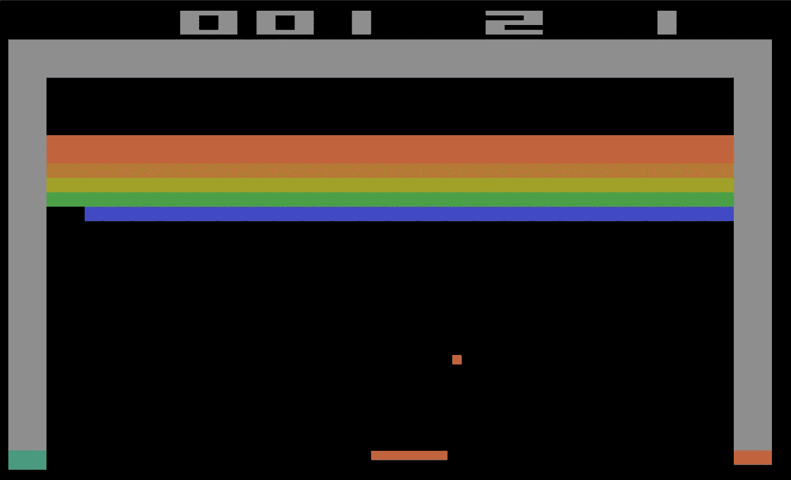

# 深度学习的批判性评价

> 原文：<https://towardsdatascience.com/a-critical-appraisal-of-deep-learning-1b154695dddf?source=collection_archive---------34----------------------->

## 这个领域已经取得了很大的进步，但是我们知道的越多，就越意识到我们一无所知。

德里克·欧文斯在 [Unsplash](https://unsplash.com?utm_source=medium&utm_medium=referral) 上的照片

# 介绍

每个人和他们的祖父母都在谈论它:人工智能、深度学习(DL)、机器学习、机器人等等……有时所有这些术语都在同一个句子中，有时是同义词。如果有一件事是肯定的，那就是这些科目越来越受欢迎，以至于公众的期望越来越高。面部识别、图像分类器、人工智能与人类游戏(围棋、DOTA)或自动驾驶汽车的重大进展创造了可以理解的炒作。炒作本身也受到首席执行官和领先研究人员过于热情的承诺的推动。

但是，只有当具体的应用程序到位时，宣传才能存在，而这仍然是滞后的。随着时间的推移，一些地区开始慢慢清醒过来。聊天机器人没有实现他们的宣传。自动驾驶汽车和整个神经网络可能是下一个目标。在这篇文章中，我将回顾 Gary Marcus 对深度学习的批判性评价，并通过个人评论和一些资源进行补充。

# 深度学习系统的挑战

马库斯在他的论文(2018)中讨论了深度学习开放挑战。

## 深度学习需要大量数据

例如，人类需要一些试验或数据示例来将它们转化为可操作的。

*   马库斯举了一个新词的例子，一个“ *schmister* ”。在我们的例子中，它被定义为“有一个 10 岁以上 21 岁以下的姐姐”。举个例子，你可以很容易地判断出你是否有朋友，或者你的朋友是否有。更多的是，通过演绎，你可以推断出你的父母可能没有。

马库斯在这里强调了深度学习目前缺乏一种通过明确的口头定义来学习抽象的机制。相反，当有数千、数百万甚至数十亿个训练样本时，它的效果最好，就像 DeepMind 在游戏上的表现一样。

简而言之，在数据稀缺的问题上，深度学习还不是理想的解决方案。然而，深度学习中小数据的出现可能会带来变化。

## 深度学习是浅层的，转移能力有限

我们回到一个游戏例子，用雅达利的突围。如果你不熟悉的话，这个想法是用垫子来指挥球和打破砖块。一个完美的技术是建造一个隧道，让球穿过墙壁，然后让球来回反弹并摧毁砖块，同时你去享受咖啡。

雅达利突破——来源:[维基百科](https://en.wikipedia.org/wiki/Breakout_(video_game)#/media/File:Breakout2600.svg)

*   马库斯解释说，“一个模型可能能够击败游戏的主人，就像你刚才做的那样，通过建立一个隧道。但是它不知道什么是隧道，什么是球，什么是墙。该模型只计算了给定场景下的意外情况，解决方案往往是肤浅的。它只会作出微小的改变，如酒吧的位置，墙壁等，使系统无用，并显示其肤浅。”

简而言之，深度学习提取的模式比它们最初出现时更肤浅。

这适用于缺乏对隧道，墙壁的理解，但缺乏适应性(改变游戏内设置)的说法在 2018 年夏天被 OpenAI 的 DOTA 大部分推翻。

## 深度学习不够透明(又名黑盒)

这是对深度学习的普遍评论和批评。但是有多重要呢？我个人在这个问题上遇到了各种各样的意见。正如作者所言，这真的取决于行业。人们可能想了解一个决定是如何被挑选出来的，了解存在偏见的程度，特别是如果它可能导致重要的生死决定。理解它是如何工作的可能会暴露这些偏见，并帮助我们更好地改进或调试它。

## 深度学习没有很好地与先验知识结合

马库斯认为，占主导地位的方法是独立的，与潜在有用的知识隔离开来。人们对整合先前已确立的知识没有浓厚的兴趣，比如一座塔是如何倒塌的，以及物理学规则如何在深度学习系统中发挥作用。另一个问题是“如何”整合这些知识。在 DL 系统中，知识通常是特征之间相互关联的结果。正如作者所指出的，这些相关性往往是不透明的，这种知识与量化的陈述相反，如“所有人都会死”。

此外，需要常识的问题对于深度学习来说还不可及，可能需要另一套完整的工具。作者引用了与厄尼·戴维斯(2015)进行的研究，并提出了如下问题:

*   *威廉王子和他的小儿子乔治王子谁更高？*
*   *你能用涤纶衬衫做沙拉吗？*
*   如果你把一根大头针插进胡萝卜，它会在胡萝卜上还是大头针上扎一个洞？

为了回答上述问题，人类将使用来自大量不同来源的集成知识，而不是深度学习的方法。

## **深度学习无法从本质上区分因果关系和相关性**

深度学习系统学习复杂的相关性，但不学习因果关系。在这一点上，我不会对 DL 太苛刻，因为许多人类同胞都在努力区分相关性和因果性。

作为一个例子，马库斯使用了一个深度学习系统，该系统发现孩子随着他们学习更多的单词而变大。然而，这并不意味着长高会导致他们学习更多的单词，也不意味着学习新单词会导致他们成长。然而，正如作者所指出的，DL 并没有准备好迎接这样的挑战。

## 深度学习作为一种近似是不错的，但答案并不完全可信

图像识别仍在改进，随机或有计划的敌对攻击的需要仍然存在。作者举了沙丘被误认为裸体的例子，或者一个黄黑色的正方形被误认为是校车的例子，或者更糟糕的是，一个污损的停车标志被误认为是限速标志。

## 深度学习很难设计

对技术债务的兴趣很高。为了短期收益而建立一个深度学习系统是微不足道的，但保证它在新数据的替代环境中工作是另一回事。

技术债务是一个激动人心且至关重要的话题。如果你好奇，我推荐你这篇文章(我有点偏心):

 [## 直到机器学习的技术债务把我们分开

### CACE 原理和为什么 ML 中的技术债务是不同的

towardsdatascience.com](/until-technical-debt-in-machine-learning-tear-us-apart-2de7d54dd0ea) 

## 聊天机器人、神经网络和自动驾驶汽车已经过时了吗？

这是否意味着我们应该忽略这些领域？不，但我们现在可能要重新审视我们的期望了。聊天机器人具有欺骗性的原因有很多，其中之一是缺乏短期记忆或背景。自动驾驶汽车是炒作正在慢慢消亡的另一个话题。2015 年，[《卫报》预测](https://www.theguardian.com/technology/2015/sep/13/self-driving-cars-bmw-google-2020-driving)到 2020 年，我们将处于“永久的后座司机”状态。在 2016 年的一篇文章中，[商业内幕](https://www.businessinsider.com/report-10-million-self-driving-cars-will-be-on-the-road-by-2020-2015-5-6)声称“到 2020 年将有 1000 万辆自动驾驶汽车上路”。其他主要汽车制造商也做出了类似的令人印象深刻的声明。[埃隆·马斯克也预测特斯拉将在 2018 年](https://www.theverge.com/2019/4/22/18510828/tesla-elon-musk-autonomy-day-investor-comments-self-driving-cars-predictions)实现这一目标。事实证明，自动驾驶汽车的生产比最初想象的要复杂得多。希望炒作平息后，工作将继续下去，一些突破将在稍后到来。许多领域都取得了进步，就像今天一样，它们无疑是支持和增强我们的工作和生活的伟大工具。

# 接下来读什么？关于深度学习的更多见解和批评

*   在他的论文 Marcus 中，也讨论了深度学习对分层结构和开放式推理的处理。作者声称，从自然语言处理(NLP)的角度来看，DL 仍然在这两个领域苦苦挣扎。
*   图灵奖获得者和机器学习的先驱 Judea Pearl 在他的书 [*中讨论了为什么:因果的新科学*](https://www.basicbooks.com/titles/judea-pearl/the-book-of-why/9780465097609/) 理解因果关系将如何彻底改变人工智能。
*   深度学习会受到计算限制的打击吗？一些麻省理工学院的研究人员认为是的。

感谢阅读！喜欢这个故事吗？ [**加入 Medium**](https://medium.com/@maximegodfroid/membership) 完整访问我的所有故事。

# 参考

1.  Marcus，G. (2018)，深度学习:批判性评估，[https://arxiv.org/abs/1801.00631](https://arxiv.org/abs/1801.00631)
2.  OpenAI Five (2018)，[https://openai.com/blog/openai-five/](https://openai.com/blog/openai-five/)
3.  戴维斯等人和马库斯等人(2015 年)。人工智能中的常识推理和常识知识。美国计算机协会的通讯，58(9)(9)，92-103。