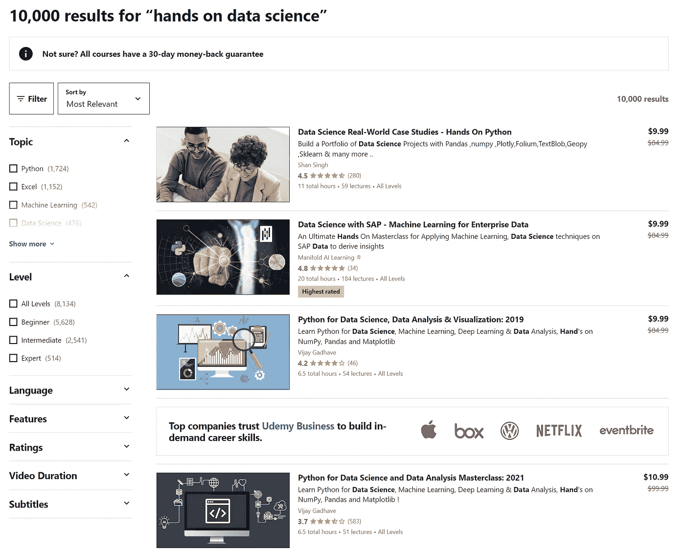
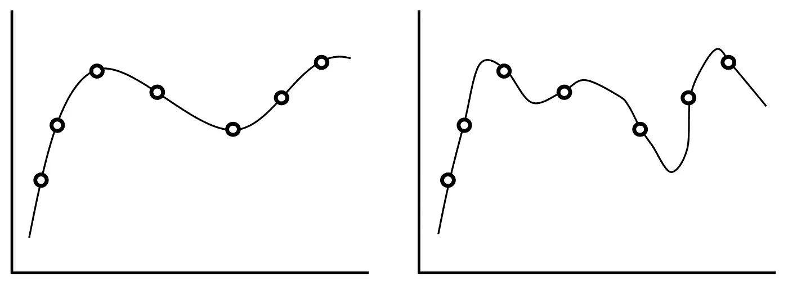
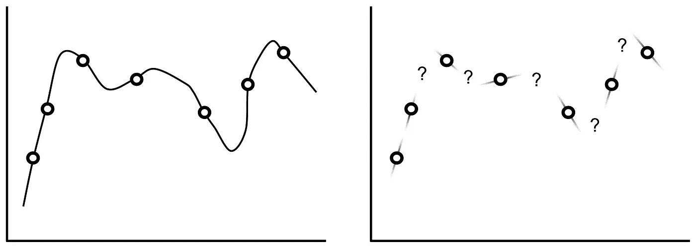

# 审视数据科学是如何“教授”的

> 原文：<https://towardsdatascience.com/a-critical-look-at-how-data-science-is-taught-354db2f005bb?source=collection_archive---------14----------------------->

[去飞溅](https://unsplash.com/photos/IgUR1iX0mqM)

## 非机构数据科学教育的弱点

答虽然我们可能想得不多，但从教育/教学的角度来看，数据科学(以及广义的计算机科学)尤其有趣。我可能会遭受抽样偏见，但我不认为说数据科学教育比法律、化学和数学等学科更分散、更有据可查、更容易获得是没有道理的；这表现在许多方面:

*   易于访问、低成本的在线出版物和论坛(如“走向数据科学”)使概念和代码更容易掌握和使用。
*   相对于 Udemy 和 Coursera 等平台上的其他学科，数据科学的在线课程非常丰富。
*   相对而言，数据科学比其他学科更容易接近。虽然这肯定不容易，但你不需要花上几年的基础课程来打开你的大门。
*   由于数据科学的数字化本质，获得实践经验比通过实验室实验学习化学更容易。数字环境允许快速实验和可靠快速的反馈信号。像 Kaggle 这样的服务在这方面有所帮助。
*   数据科学的研究通常比其他学科的研究更公开，其他学科的研究通常被置于付费墙之后，因此访问受到限制。数据科学家可以在托管网站上探索大量高质量的论文，如 [arxiv](https://arxiv.org/list/cs.AI/recent) 或 [paperswithcode](https://paperswithcode.com/) 。

由于数据科学相对较高的可访问性，一个人如何着手*学习*数据科学的途径变得更加复杂和多样化。许多人参加强化训练营和在线课程；其他人则接受更正规的大学教育和学位(你会经常在 LinkedIn 上看到后者抱怨前者)。

然而，数据科学是一个快速发展的领域。不断有新的框架、库、技术、模型和想法出现。一个人不可能获得计算机科学或数据科学的学位，就认为自己已经学得够多了。通过这种方式，“非传统/非机构”教育(即不通过学术机构提供)如在线出版物、在线课程、论文库和论坛对所有数据科学学习者都变得很有价值。

“自己动手”/“亲自动手”/“实际操作”/“真实世界”的教学主题在这些非机构资源中尤其普遍。大多数在线课程和书籍将在描述中使用这些关键字的某种组合，以吸引当前渴望展示这些主题的内容的数据科学社区。

在 [Udemy](https://www.udemy.com/courses/search/?src=ukw&q=hands+on+data+science) 上搜索展示“实践”/“真实世界”/“实用”教学主题的数据科学课程。

这是数据科学中一个特别有趣的趋势——专注于应用和实现，减少对理论的重视，而不仅仅是让代码工作所需的东西。这是有道理的:数据科学几乎完全是在数字环境中进行的，数据科学学习者已经形成了创造和运行想法的期望。

虽然这是可以理解的，但这种对非机构资源“实用性”的强烈关注可能会导致*理解过度。*

偏差/方差权衡是一个众所周知的概念模型，用于评估模型的概括能力或“学习质量”。考虑下面显示的同一组点的两种不同拟合:我们可以清楚地看到右边的曲线概括得很差。该算法可能方差太大:它过于重视确保曲线通过数据集中的每个点，而没有考虑这些点之间的区域。

左:很好的概括。右:过拟合，泛化能力差。

我们可以把每一个单独的点看作是一种知识——课程资源的一个组成部分，就像一篇博客文章、在线课程的一个模块、代码教程。理论有助于将各个组成部分统一成对该领域的整体理解或学习。正则化/偏差提醒模型，目的是进行归纳，而不仅仅是通过每个点。

鉴于非机构资源倾向于强调“动手”和“实用”，学习者可能会产生过度的理解:他们学习语法和单个程序如何工作良好；它们将数据集中已经存在的点内在化。然而，这些学习者对新的环境和问题表现出较差的概括能力。事实上，通常根本没有一般化——想象两个相邻点之间没有任何东西，除了对与已经看到的问题非常相似的问题有一点鲁棒性(见下图，右图)。

左:概括能力差。对:不能一概而论！

几乎完全从非机构资源学习数据科学的数据科学家可以在具有常见、标准化、众所周知的问题的职位上表现出色。许多数据科学任务的方法相当公式化，即通过一个步骤、可视化、模型和步骤的清单。获得更制度化教育(相对强调理论的教育)的数据科学家能够创新新的方法和途径来解决以前从未见过的问题。他们通常是处于研究前沿的人，而非机构资源的学生更多地局限于成熟的资源。

这并不是说机构教育优于非机构教育，也不是说一个人必须接受机构教育才能创新。相反，重点是强调非机构资源的一个潜在缺点，这个缺点应该得到解决。这里的问题不是鼓励机构教育还是非机构教育，而是如何将机构数据科学课程成功的因素注入非机构教育。

结合起来，数据科学不仅更容易获得，而且更具创新性。在数据科学前沿工作的数据科学家的分布严重偏向于那些受过机构教育的人。通过重新思考非机构数据科学资源的结构，我们可以发掘更多人的潜力。

当然，这是一项艰巨的任务——但人们应该身体力行，在我最近出版的书《现代深度学习设计和应用开发》中，我试图向打击理解过度迈出一步。(我希望这不会在你的嘴里留下不好的推销味道——这种教学争论的主要焦点是写这本书的动机。)这本书的意图是在直觉和理论的更广泛框架中交织代码和个体概念，放松“中间区域”的参差不齐和混乱，以鼓励在遇到新问题时创新的深度学习解决方案。

如果您有兴趣了解更多信息，请访问 Springer Link:

 [## 现代深度学习设计与应用开发

### 了解如何在许多环境中利用现代深度学习方法。包装与直觉理论，实践…

link.springer.com](https://link.springer.com/book/10.1007/978-1-4842-7413-2) 

感谢您的阅读，请在回复中告诉我您的想法！

如果你对最新的文章感兴趣，可以考虑[订阅](https://andre-ye.medium.com/subscribe)。如果你想支持我的写作，通过我的[推荐链接](https://andre-ye.medium.com/membership)加入 Medium 是一个很好的方式。干杯！