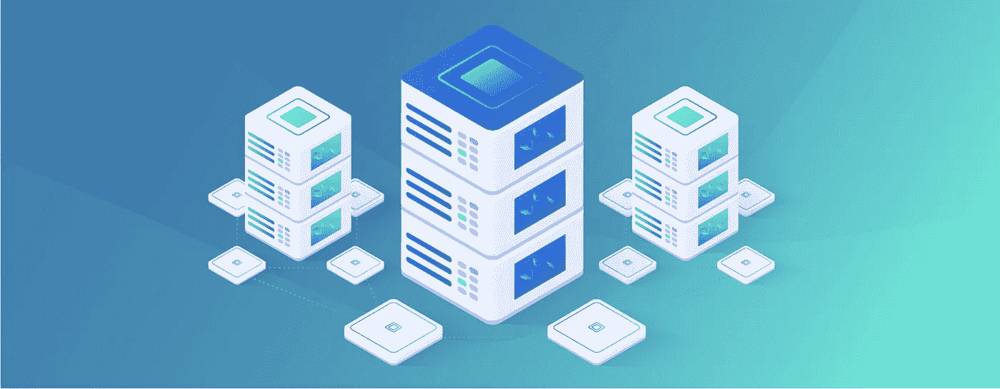
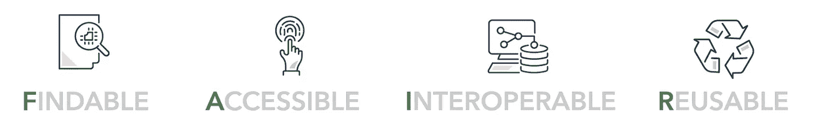
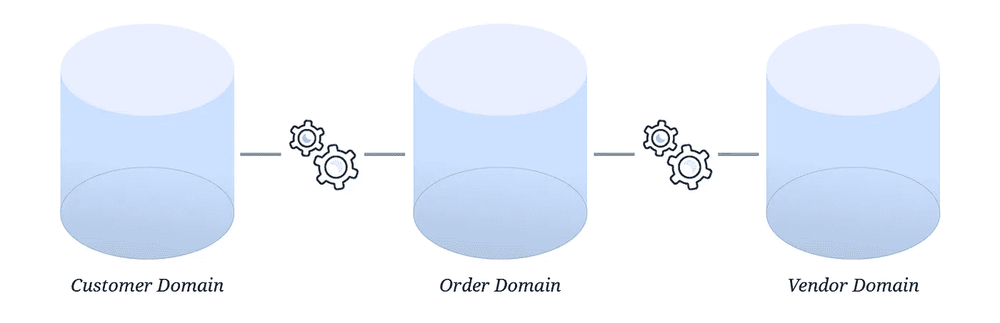
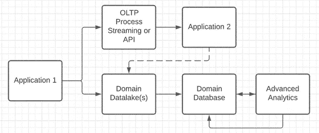
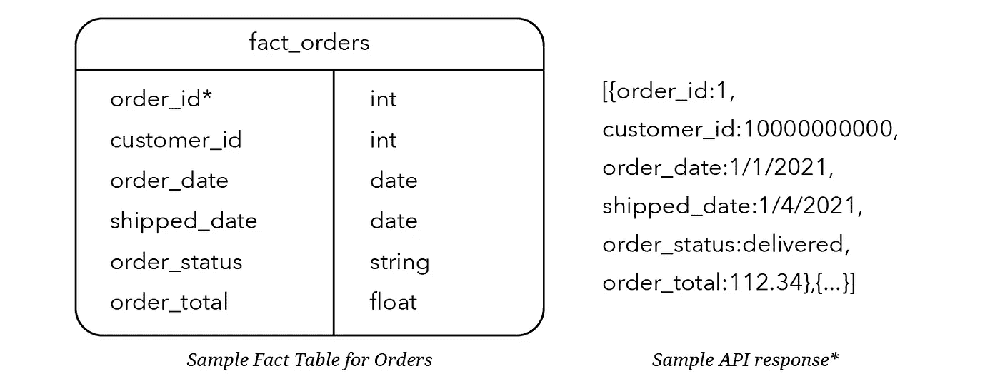

# 数据仓库的数据网格方法

> 原文：<https://towardsdatascience.com/a-data-mesh-approach-to-data-warehousing-cd71e55490ba?source=collection_archive---------6----------------------->

## 数据网格的利与弊，以及组织应该采取的改进数据策略的步骤。

面对快节奏的大数据世界，数据仓库应该如何发展？图片由[约翰经许可做](http://www.johnqdo.com)。

数据网格是一种具有争议性的新范式，它提供了一种类似于微服务架构等软件工程最佳实践的数据策略。但是，这样对数据对吗？

最初的概念是由 Zhamak Dehghani 提出的，他声称，领域驱动的自助式数据方法是未来的发展方向，即数据的产品方法，在这种方法中，不断评估收集的数据，以确保其相关性、价值和实际使用。

这个概念与拥有一个包含所有公司数据的遗留单片系统并置。Data mesh 提供了一种去中心化的数据管理方法，并将其交给更接近数据及其用途的人。

本文将讨论数据网格的利与弊，以及组织应该采取的改进策略的步骤。我的意见是，这种方法早就应该得到重视，但我们必须谨慎行事，并对最初的概念进行一些可能的修改。

如果我们很快接受了这种新的方法，并把我们的组织连根拔起，我们就部分地错过了这一点。随着数据的增加，我们必须以模块化和尽可能敏捷的方式组织它们。这很有挑战性，因为数据本质上不如软件灵活，原因有二:1)对数据模型的任何微小改变都会产生连锁影响；2)大多数公司都创建了庞大而复杂的数据仓库。创建考虑周到的数据模型需要时间和协作，这些模型能够正确地表示整个组织中的原始数据和适当粒度的数据。

图片由[约翰做](http://www.johnqdo.com)

**什么是数据网格？**

数据网格是数据的领域驱动设计(DDD )!在 DDD 中，数据的结构是由组织的域决定的，因此每个域将驱动组织和逻辑。

由于数据可以理解为实体和属性，这两者都是自然领域驱动的，DDD 在这里至少和在软件工程中一样有意义。Zhamak 的数据网格将产品思维放入数据领域，其中[数据产品是 API](https://martinfowler.com/articles/data-monolith-to-mesh.html)。数据需要明确定义和记录，即“可发现的”

数据网格概念与传统的数据集市有很多共同之处，传统的数据集市是数据仓库中数据的集合，这些数据仓库通常是领域驱动的，由一个小团队以更敏捷的方式管理。它们被用来回答特定的战略问题和发展洞察力。

公平原则能有什么帮助？

数据的[公平原则](https://www.paperlesslabacademy.com/2019/06/12/fair-principles/)符合数据网格的目标，并在构建数据网格时提供了清晰的检查组件。

图片由[约翰·多](http://www.johnqdo.com)

这些原则确保特定数据源的数据模型和字典可以在一个中心位置找到(“可找到”)，并且访问模式和需求清楚地记录了关于如何请求访问数据源(“可访问”)的信息。很有可能 HIPAA 或 PII 培训需要在某人获得访问权限之前进行，或者访问权限仅限于具有特定职称或类型的员工。这里的要求很简单，访问要求和限制对员工或用户来说并不神秘。

“可互操作”组件要求不同数据源之间的转换机制是清晰的。例如，如果有一个客户域、一个订单域和一个供应商域，那么订单域文档应该清楚地指出如何从订单数据资产连接到客户域和供应商域。简而言之，互操作性确保用户可以从其他域连接到其他域。

最后，“可重用”组件将所有组件集合在一起。创建任何数据资产的目的是能够重用应用程序、工具和报告中的组件。

**数据仓库的正确之处是什么？**

数据仓库为我们提供了公司数据的完整视图。数据仓库中有两种主要的思想流派:Inmon 企业数据仓库(EDW)方法和 Kimball 维度建模方法。

edw 擅长快速写入和传统的提取、转换和加载(ETL)模式。维度建模带来了更快的读取速度和更少规范化(更多非规范化)的表方法。像 Redshift 或 Azure Synapse 这样的新云数据仓库使得遵循提取、加载和转换(ELT)方法变得更加容易，在这种方法中，数据仓库本身被用来执行转换。因此，数据仓库的功能仍有相当大的灵活性，尤其是市场上较新的数据仓库。

**数据仓库有什么问题？**

如果您曾经处理过大型的、单一的数据仓库，那么您将会对修改业务逻辑、合并新数据或解决数据中的缺口所涉及的痛苦非常熟悉。它很慢，很麻烦，而且需要一段时间业务才能看到结果。为了理解数据的复杂性，你通常需要和一个在最初概念上工作了 20 年的老手交朋友。如果发生了一些事情，如中彩票、退休或当前组织之外的新机会，大量的数据知识可能会丢失。在我的职业生涯中，我见过许多数据仓库被低[总线因子](https://en.wikipedia.org/wiki/Bus_factor)所困扰，也许是因为有太多的东西需要了解。

由于昂贵的存储和相对便宜的计算(相对而言)，edw 被设计成以标准化的方式容纳不同的数据。规范化确保了没有冗余和快速写入，但这是有代价的:昂贵的连接和读取。更现代的数据存储方法倾向于远离完全规范化。这意味着，使用第一范式或第二范式通常就足够了，没有必要强制数据符合 6NF 或 DKNF(第六范式或域键范式)的性能要求。

除了数据建模的 EDW 方法，维度建模也是数据仓库中使用的一种技术。

**数据网格会出什么问题？**

缺乏明确的数据所有权可能是一个巨大的问题。一些复制的数据不一定是问题，但是如果没有明确的团队所有权，数据复制的问题将会恶化。如果没有明确的所有权，通过查看不同的数据产品，您可能会得到相同问题的不同答案。

如果您向组织中的人员提出同样的定量问题，却得到不同的答案，这表明您的数据策略不起作用。这些战略失败通常是管理不善的结果，而不是工程的结果。

我见过竞争团队从这些独立团队构建的数据库系统中计算和预测相同的信息。通过创建一个通用的解决方案，工程团队与业务部门一起建立通用的定义，并寻求解决相互竞争的源系统之间的冲突，可以获得更多。但是创建一个共同的解决方案和事实的来源需要一个团队明确的所有权。

**数据网格能带来什么好处？**

当处理得当时，数据网格澄清了谁拥有数据，因此谁可以帮助添加额外的特性，提供关于差异和异常的更多信息，并与业务和软件团队合作解决差距。

数据被分解成不需要，在大多数情况下也不应该完全规范化的域。完全规范化的数据不再是必要的，因为不仅存储便宜，规范化还增加了商业智能(BI)和高级分析用例的连接复杂性。相反，在我工作过的大多数团队中，我们更多地选择了“starflake”模式:雪花和星星的组合。这使得我们能够满足其他开发团队、高级分析和报告用例的要求。

**电子商务业务可能的领域划分**

作者和 John Do 提供的图片

采用数据网格的另一个重要目标和理想结果是域之间有清晰的集成点(公平原则中的互操作部分)。这可以利用一个集成表或 API 端点，但也可以内置到作为 API 公开的或预先计划的[事实表](https://www.kimballgroup.com/data-warehouse-business-intelligence-resources/kimball-techniques/dimensional-modeling-techniques/facts-for-measurement/)中。例如，要将您的客户域连接到您的订单域，您应该在汇总订单详细信息的事实表中包含一个客户 ID。您还可以选择将它包含在主订单表中，以便更有效地连接客户和订单详细信息(不仅仅是高级信息)。

作者图片

上图显示了应如何区分交易和分析，以确保 ACID 合规性和稳健的分析系统(更多信息见下文)。ACID 代表原子性、一致性、隔离性和持久性，是数据库系统中的一个重要考虑因素。

**数据仓库的数据网格方法**

如果我想要不同谷物的快速数据怎么办？这就是我提出数据网格概念的替代方案的地方。我建议我们不要放弃数据仓库，而是要建立面向领域的数据仓库，以获取最少量的可用数据。如果您在电子商务系统中工作，您希望存储所有订单更新和修改，而不仅仅是当前状态。当前状态可以存储在事实表中，所有这些数据可以直接从表中或在 API 中使用。即使数据是直接从数据库中使用的，读取副本也可以方便地提高读取性能，因为副本不会与主数据库竞争。读取副本并不完全是实时的，但它们最终往往与个位数毫秒延迟一致，这使它们足够接近实时，以满足大多数业务需求。

API 本身不是数据策略，但它们是健壮数据策略的一部分。API 优先和纯 API 策略从错误的问题开始；他们在没有事先询问是否应该的情况下就要求移动数据。没有分析，就很难理解你应该如何做事情，或者你想要构建的应用程序是否有意义。将一个数据库转化成一个 API 比反过来更容易。如果您想从数据中获得洞察力，API 优先或仅 API 不是前进的方向。API 允许应用程序相互对话，因此 API 优先相当于应用程序优先。API 以编程方式传递数据，如果不将数据转移到另一个数据产品中，数据就不能用于分析目的。API 在位置上缺乏计算和互操作性，所以它们离完整的数据策略还很远。

数据库提供了稳定性和存储能力来包含特定域中的所有数据，例如订单。您目前可能有多个包含订单信息的数据库，但是以一种避免破坏性转换的方式进行整合是值得的。破坏性转换是导致数据丢失的数据转换。例如，如果您将订单数据聚合为仅包含当前状态，而忽略所有中间订单更改，那么您就混淆了一些可能有用的数据。

我提出的数据网格版本的关键是，在数据仓库级别，数据应该以最小的粒度存在，根据需要在事实表中滚动。这种方法成功的关键是将数据视为一种产品，它存在于比传统 EDW 更模块化的组件中。以这种方式整合数据库是保持数据尽可能敏捷的一个重要部分。因此，如果出于某种原因需要添加一个列，那么这样做是相对简单的。数据库和 API 开发应该同步进行，以确保满足所有需求，并且开发周期尽可能快。

我见过极其复杂的数据库网络，但是如果齐心协力淘汰遗留数据库(这确实是可能的)，您的业务会发展得更加容易。将数据网格的概念用于数据仓库可以帮助系统地淘汰遗留的 edw。

同样值得注意的是(为了证明 API 本身不是数据策略),市场上的所有 BI 工具要么需要数据库连接，要么可能没有足够的 API 连接器。如果他们有一个 API 连接器，由于往返连接的原因，他们往往不能胜任。但是，即使您为可靠的流数据构建了自己的套接字连接，API 也应该与表模式相匹配，以实现数据一致性和易用性。REST APIs 是数据策略的重要组成部分，因为它们促进了更好的安全性，与技术无关，并且可以通过使用堡垒或反向代理进行缓存和扩展。

作者图片

*该 API 将以与 fact_orders 表相同的模式返回数据，但也可以有一个参数来选择单个订单，而不是简单地提取所有可用的数据。

我们如何迁移？

系好安全带。这不会像听起来那么难，但它包括几个关键步骤:

1.  记录您当前的系统以及它们包含哪些高级域
2.  在模式或表级别分离遗留 edw 和新系统的所有权
3.  明确定义哪些数据工程师负责哪些数据领域
4.  对不同领域中的一些重复数据感到放心。您仍然应该尽量减少重复，但这不值得为几个在不同领域中使用略有不同的列而争论。

数据工程师应该与利益相关者公开讨论数据颗粒，并在记录级别包含世系。在中构建血统通常就像创建一个“源”列一样简单；在许多情况下，遗留数据和新数据需要一起暂存，并以不同的方式进行转换。哪些数据来自哪个系统需要尽可能透明，以方便地提高数据质量。

将一个遗留的庞然大物迁移到一个(或几个)领域驱动的数据网格需要做大量的工作，但这是值得的。数据不需要成为一场永恒的战斗。所有公司都可以通过这一流程采取措施解决数据问题。

需要分散的数据命令，以便您可以成功地一直到属性级别。您的数据产品和支持团队必须为数据的个人所有者提供明确的界限和指导。这些界限和指导可以包括用于命名一致性的类别词、标准清理脚本、用于处理具有不同延迟要求的数据的方法等。领域团队需要理解他们正在处理的数据的复杂性，以及它与整体业务的关系。对数据进行适当的指挥和控制很难，需要建立信任和心理安全，但这是可能的。

就像 20 世纪 60 年代登上月球一样，整理公司数据很难，但也很有必要。它需要大量的初始努力，但这是值得的努力。那些没有抓住机会的人注定会被落在后面。