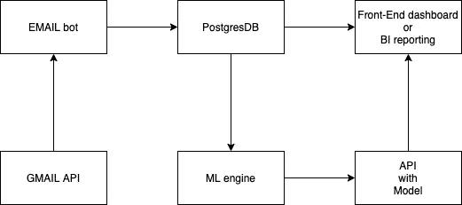
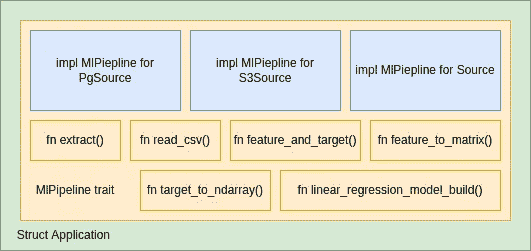
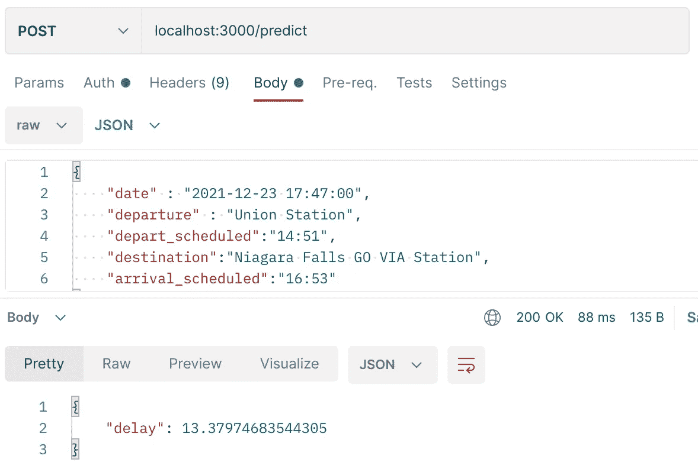

# Go 列车延误分析的数据管道——ML 与 Rust 的作用

> 原文：<https://towardsdatascience.com/a-data-pipeline-for-go-trains-delay-analysis-ml-in-action-with-rust-b294e80eede9?source=collection_archive---------13----------------------->

## 铁锈动力 ML 管道

欢迎回到第 3 部分，这是火车延误分析系列的最后一篇文章。之前，我们构建了 UI 仪表板和具有弹性功能的 API 集成，并将其部署到 Heroku，并将其发布到 Rapid API。

如果您刚刚看到这篇文章，请阅读第 1 部分和第 2 部分。

</a-data-pipeline-for-go-trains-delay-analysis-part-1-21b2c2496aca>  <https://medium.com/geekculture/a-data-pipeline-for-go-trains-delay-analysis-part-2-e5b9ef0ea315>  

这最后一集将基于 Rust 一贯收集的数据，重点介绍 ML 引擎(管道)。

首先，让我们刷新一下我们的总体高层架构和数据流。

架构—截图/作者版权所有

这一集将基于功能性和非功能性需求来冲洗我们的应用程序设计。作为本文目标的一部分，我们想向您展示，在大多数 ML 项目中:

> ML 模型**只是**ML 项目的一部分，一个**成功的 ML 项目**应该有整体架构设计、应用程序设计、基于你想要解决的问题选择正确的模型、一致的模型改进/学习、模型部署和整体运营效率，这有时会导致基于你公司环境的运营模型(组织结构)定义。

# 先说 **SFR** …

由[凯利·西克玛](https://unsplash.com/@kellysikkema?utm_source=medium&utm_medium=referral)在 [Unsplash](https://unsplash.com?utm_source=medium&utm_medium=referral) 上拍摄的照片

## **系统功能需求**

1.  ML 引擎应访问数据存储，以使用数据一致地执行模型训练。
2.  ML 引擎应该可以使用 K 折叠交叉验证来评估机器学习模型的有限数据样本。
3.  ML 引擎应使用合适的模型根据给定的数据集预测*延迟分钟*。(注)
4.  ML 引擎将构建模型并将模型部署到目标 API 服务器。
5.  ML 引擎构建的模型应该与构建的 API 集成，以执行预测功能，如#3 和#4。

## **非功能性需求**

1.  ML 引擎对于不同的数据存储应该是可扩展的，在元数据的上下文/条件是一致的。
2.  ML 引擎应该一致且有效地执行数据训练。(每数据量增长定义的 SLA)
3.  ML 引擎应该与 API 服务分开部署到不同的服务器上，以减少影响 API 操作的单点故障。
4.  ML 引擎应该易于维护，以便为未来的 ML 需求添加不同的模型。
5.  ML 引擎应该在用户中按照定义的节奏运行，每天、每月、每周或每年。

现在我们已经有了足够好的需求捕获，背后的想法是确保我们对您的请求者有正确的期望，它可能是您的客户，可能是您的业务对手，也是我们衡量成功的标准。

> 注意:在这个用例的实际需求中，我们可能首先需要预测预先给定的日期是否会延迟，但是这个预测将需要所有 Go 火车时刻表的日期集，这意味着我们将需要更多的数据源和数据清理和映射，然后我们可以利用监督分类来预测。

然而，在本文中，我们只关注端到端的 ML 管道。未来我们会花更多的时间来讨论使用 Rust 进行机器学习。

# ML 发动机设计

接下来，让我们开始将需求映射到我们的应用程序设计。

如果我们仔细阅读 SFR，#1 与设计模式相关，#2 到#4 是我们在引擎中需要的功能，而#5 是部署策略(与基础平台相关)。

所以让我们更深刻地思考。ML 引擎的功能不应该与我们连接的数据存储不同，这符合策略模式。

> 根据策略模式，类的行为不应该被继承。相反，它们应该使用接口封装。这与[开放/封闭原则](https://en.wikipedia.org/wiki/Open/closed_principle) (OCP)是兼容的，该原则提出类应该对扩展开放，但对修改关闭。

在 Rust 中，接口是**特征**，这意味着它拥有应该被**封装**以满足我们的#2 到#4 需求的功能，不同的数据存储作为我们的数据源**策略**。

为了更详细的了解，我们来画一下。

架构—截图/作者版权所有

让我们把这个翻译成我们的代码，它也可以满足我们的 NFR 中的#4。

作者版权

在 Trait 中，您可以看到如下的逻辑顺序序列:

## 数据摘录

该函数负责连接到数据库以提取数据，因为一些目标格式取决于我们决定的存储。

我们有多种选择，如传统、Hadoop 数据湖、云存储桶(s3、ADLS gen2、GCP 存储)。

为了这个项目的简单，数据量似乎很小，让我们保持 csv 格式。

另一个令人兴奋的决策点将是如何一致且高效地获取数据，这符合我们的 NFR 之一，例如增量或批量加载。

但是，为了满足性能需求，我们将考虑使用复制输出，而不是批量加载(SQL select *)然后在 for 循环中写入文件，为什么？一般来说，这里有几个因素:

*   网络延迟和往返延迟
*   PostgreSQL 中每条语句的开销
*   上下文切换和调度程序延迟
*   成本，如果每个迭代器写一次的话(你不是)
*   `COPY`-针对批量装载的特定优化。

按副本提取—按作者提取代码片段

## 将 CSV 读取到数据帧

在 Python ML 世界中，panda dataframe 是最流行的数据分析库，dataframe 是其中的关键组件之一。Rust 比熊猫需要更多的工作，但 Rust 更灵活，性能更好。今天，我想介绍一下 Polars。

Polars 是用 Rust 实现的一个速度惊人的数据帧库，使用[Apache Arrow column 格式](https://arrow.apache.org/docs/format/Columnar.html)作为内存模型。

它有一些重要的基准。

<https://h2oai.github.io/db-benchmark/>  

因此，我们将利用这个板条箱来构建数据框架，以准备 ML 模型培训和构建。

阅读 CSV —作者的代码片段

## ML 培训和模型构建

我们都准备好了；我们将数据以 csv 格式加载到文件系统中，然后将文件读取到数据帧中。接下来将开始我们的 ML 模型选择和训练。

Rust 有一些完美和方便的 ML 板条箱/框架，其中大部分你可以在这里找到。

<https://github.com/vaaaaanquish/Awesome-Rust-MachineLearning>  

我的选择是 SmartCore，这是一个全面的机器学习和数值计算库，Rust 是我们的用例。该库提供了线性代数、数值计算和优化工具，并实现了一种通用、强大但仍然有效的机器学习方法。

<https://smartcorelib.org/>  

基于我们的 SFR，我们希望基于预先给定的数据集来预测延迟分钟。我们将重点关注的算法应该是线性回归，这是一种统计监督学习技术，通过与一个或多个独立特征形成线性关系来预测量化变量。

对于 SmartCore，根据我们的数据集训练线性回归模型。它将需要 2 个数据帧。一个是特征，它识别和选择最相关的输入变量的子集；另一个是预测目标。

获取特性和目标—作者的代码片段。

一旦我们有了特征和目标数据框架，下一步将是将特征和目标转换为 smartcore 模型培训的可读格式。

将数据帧转换为矩阵

下一步是利用 smartcore 线性回归来构建模型。

构建 RL 模型—作者代码片段

到目前为止，模型训练和构建已经完成:

主流程—作者的代码片段

## ML 模型部署

一旦构建了模型，我们就必须将它部署到 API 端点(我们在第 2 部分中创建的)的 API 服务中，以获取和使用它。

对于部署，我们将利用 Github 操作来触发 ML 管道部署，这将源模型从 ML 管道 repo 复制到 API repo，这将根据您在 Github 操作工作流中定义的规则启动 API repo 构建。

<https://github.com/marketplace/actions/push-directory-to-another-repository>  

对于我所有的项目，我将从开发分支开始构建，它被认为是 UAT，然后主分支将是生产。

## 行动中的 ML 模型

如果您还记得第 2 部分，当我们构建 API 时，我们为扩展任何新端点准备了灵活性，因此在这种情况下，我们将添加一个端点，如下所示:

预测 API 加载模型—作者的代码片段

作者截图

# 最后的话

在这一系列文章中，我们主要学习了如何从一个想法变成现实。

1.  我们从用例、分析、概念、解决方案开始，当然还有编码和构建。
2.  UI 仪表板构建
3.  API 集成层构建。
4.  ML 管道会生锈。
5.  扩展 ML 端点的 API。

这是一个独特的构建和学习项目；系列文章中显示的数字、分析和仪表板与 [*Metrolinx*](https://www.metrolinx.com/en/aboutus/opendata/default.aspx) 提供的任何服务或 API 无关，仅是我的分析评论，供我学习使用。

我开始写作之旅已经快三年了。你们的支持是让我不断前进，写出更多精彩学习分享的最重要动力。

<https://jayhuang75.medium.com/membership>  

另外，你可以用下面的链接给我买一杯咖啡，让我有动力在周末进行更多的锻炼和学习。

你能给我买杯咖啡吗？