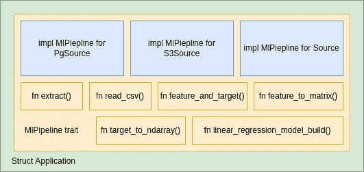
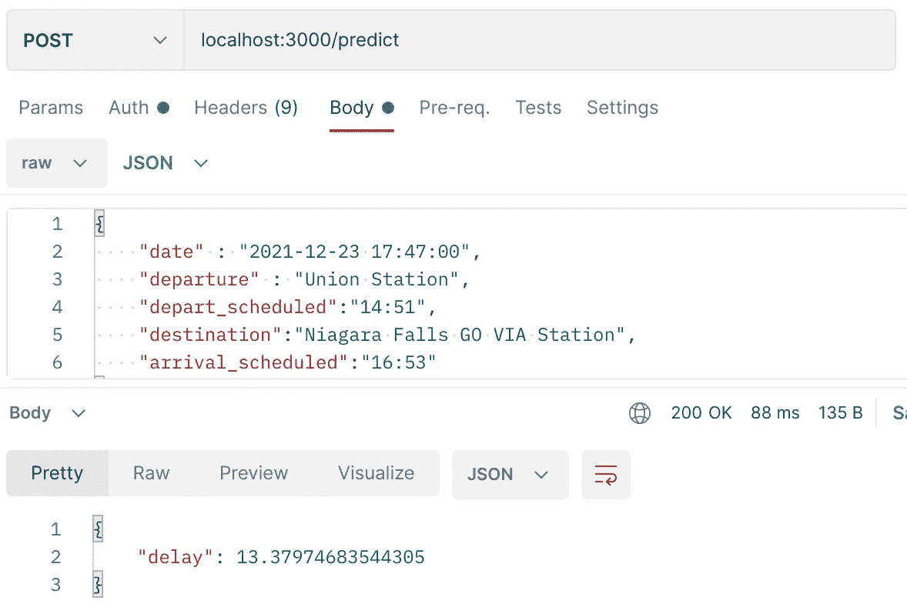

# Go 列车延误分析的数据管道——ML 与 Rust 的作用

> 原文：<https://towardsdatascience.com/a-data-pipeline-for-go-trains-delay-analysis-ml-in-action-with-rust-b294e80eede9?source=collection_archive---------13----------------------->

## 铁锈动力 ML 管道

欢迎回到第 3 部分，这是火车延误分析系列的最后一篇文章。之前，我们构建了 UI 仪表板和具有弹性功能的 API 集成，并将其部署到 Heroku，并将其发布到 Rapid API。

如果您刚刚看到这篇文章，请阅读第 1 部分和第 2 部分。

 [## Go 列车延误分析的数据管道—第 1 部分

### 周末建设和学习

towardsdatascience.com](/a-data-pipeline-for-go-trains-delay-analysis-part-1-21b2c2496aca)  [## Go 列车延误分析的数据管道——第二部分

### BI 仪表板和弹性搜索，如 API Power by Rust

medium.com](https://medium.com/geekculture/a-data-pipeline-for-go-trains-delay-analysis-part-2-e5b9ef0ea315) 

这最后一集将基于 Rust 一贯收集的数据，重点介绍 ML 引擎(管道)。

首先，让我们刷新一下我们的总体高层架构和数据流。

架构—截图/作者版权所有

这一集将基于功能性和非功能性需求来冲洗我们的应用程序设计。作为本文目标的一部分，我们想向您展示，在大多数 ML 项目中:

> ML 模型**只是**ML 项目的一部分，一个**成功的 ML 项目**应该有整体架构设计、应用程序设计、基于你想要解决的问题选择正确的模型、一致的模型改进/学习、模型部署和整体运营效率，这有时会导致基于你公司环境的运营模型(组织结构)定义。

# 先说 **SFR** …

由[凯利·西克玛](https://unsplash.com/@kellysikkema?utm_source=medium&utm_medium=referral)在 [Unsplash](https://unsplash.com?utm_source=medium&utm_medium=referral) 上拍摄的照片

## **系统功能需求**

1.  ML 引擎应访问数据存储，以使用数据一致地执行模型训练。
2.  ML 引擎应该可以使用 K 折叠交叉验证来评估机器学习模型的有限数据样本。
3.  ML 引擎应使用合适的模型根据给定的数据集预测*延迟分钟*。(注)
4.  ML 引擎将构建模型并将模型部署到目标 API 服务器。
5.  ML 引擎构建的模型应该与构建的 API 集成，以执行预测功能，如#3 和#4。

## **非功能性需求**

1.  ML 引擎对于不同的数据存储应该是可扩展的，在元数据的上下文/条件是一致的。
2.  ML 引擎应该一致且有效地执行数据训练。(每数据量增长定义的 SLA)
3.  ML 引擎应该与 API 服务分开部署到不同的服务器上，以减少影响 API 操作的单点故障。
4.  ML 引擎应该易于维护，以便为未来的 ML 需求添加不同的模型。
5.  ML 引擎应该在用户中按照定义的节奏运行，每天、每月、每周或每年。

现在我们已经有了足够好的需求捕获，背后的想法是确保我们对您的请求者有正确的期望，它可能是您的客户，可能是您的业务对手，也是我们衡量成功的标准。

> 注意:在这个用例的实际需求中，我们可能首先需要预测预先给定的日期是否会延迟，但是这个预测将需要所有 Go 火车时刻表的日期集，这意味着我们将需要更多的数据源和数据清理和映射，然后我们可以利用监督分类来预测。

然而，在本文中，我们只关注端到端的 ML 管道。未来我们会花更多的时间来讨论使用 Rust 进行机器学习。

# ML 发动机设计

接下来，让我们开始将需求映射到我们的应用程序设计。

如果我们仔细阅读 SFR，#1 与设计模式相关，#2 到#4 是我们在引擎中需要的功能，而#5 是部署策略(与基础平台相关)。

所以让我们更深刻地思考。ML 引擎的功能不应该与我们连接的数据存储不同，这符合策略模式。

> 根据策略模式，类的行为不应该被继承。相反，它们应该使用接口封装。这与[开放/封闭原则](https://en.wikipedia.org/wiki/Open/closed_principle) (OCP)是兼容的，该原则提出类应该对扩展开放，但对修改关闭。

在 Rust 中，接口是**特征**，这意味着它拥有应该被**封装**以满足我们的#2 到#4 需求的功能，不同的数据存储作为我们的数据源**策略**。

为了更详细的了解，我们来画一下。

架构—截图/作者版权所有

让我们把这个翻译成我们的代码，它也可以满足我们的 NFR 中的#4。

作者版权

在 Trait 中，您可以看到如下的逻辑顺序序列:

## 数据摘录

该函数负责连接到数据库以提取数据，因为一些目标格式取决于我们决定的存储。

我们有多种选择，如传统、Hadoop 数据湖、云存储桶(s3、ADLS gen2、GCP 存储)。

为了这个项目的简单，数据量似乎很小，让我们保持 csv 格式。

另一个令人兴奋的决策点将是如何一致且高效地获取数据，这符合我们的 NFR 之一，例如增量或批量加载。

但是，为了满足性能需求，我们将考虑使用复制输出，而不是批量加载(SQL select *)然后在 for 循环中写入文件，为什么？一般来说，这里有几个因素:

*   网络延迟和往返延迟
*   PostgreSQL 中每条语句的开销
*   上下文切换和调度程序延迟
*   成本，如果每个迭代器写一次的话(你不是)
*   `COPY`-针对批量装载的特定优化。

按副本提取—按作者提取代码片段

## 将 CSV 读取到数据帧

在 Python ML 世界中，panda dataframe 是最流行的数据分析库，dataframe 是其中的关键组件之一。Rust 比熊猫需要更多的工作，但 Rust 更灵活，性能更好。今天，我想介绍一下 Polars。

Polars 是用 Rust 实现的一个速度惊人的数据帧库，使用[Apache Arrow column 格式](https://arrow.apache.org/docs/format/Columnar.html)作为内存模型。

它有一些重要的基准。

 [## 类似数据库的运营基准

### 该页面旨在对开源数据科学中流行的各种类似数据库的工具进行基准测试。它经常与…发生冲突

h2oai.github.io](https://h2oai.github.io/db-benchmark/) 

因此，我们将利用这个板条箱来构建数据框架，以准备 ML 模型培训和构建。

阅读 CSV —作者的代码片段

## ML 培训和模型构建

我们都准备好了；我们将数据以 csv 格式加载到文件系统中，然后将文件读取到数据帧中。接下来将开始我们的 ML 模型选择和训练。

Rust 有一些完美和方便的 ML 板条箱/框架，其中大部分你可以在这里找到。

 [## GitHub-vaaaanquish/Awesome-Rust-machine learning:这个库是机器学习的列表…

### 这个库是用 Rust 写的机器学习库列表。这是 GitHub 库的汇编…

github.com](https://github.com/vaaaaanquish/Awesome-Rust-MachineLearning) 

我的选择是 SmartCore，这是一个全面的机器学习和数值计算库，Rust 是我们的用例。该库提供了线性代数、数值计算和优化工具，并实现了一种通用、强大但仍然有效的机器学习方法。

 [## 智能核心

### SmartCore 是一个用于机器学习和数值计算的综合库。该库提供了一套工具…

smartcorelib.org](https://smartcorelib.org/) 

基于我们的 SFR，我们希望基于预先给定的数据集来预测延迟分钟。我们将重点关注的算法应该是线性回归，这是一种统计监督学习技术，通过与一个或多个独立特征形成线性关系来预测量化变量。

对于 SmartCore，根据我们的数据集训练线性回归模型。它将需要 2 个数据帧。一个是特征，它识别和选择最相关的输入变量的子集；另一个是预测目标。

获取特性和目标—作者的代码片段。

一旦我们有了特征和目标数据框架，下一步将是将特征和目标转换为 smartcore 模型培训的可读格式。

将数据帧转换为矩阵

下一步是利用 smartcore 线性回归来构建模型。

构建 RL 模型—作者代码片段

到目前为止，模型训练和构建已经完成:

主流程—作者的代码片段

## ML 模型部署

一旦构建了模型，我们就必须将它部署到 API 端点(我们在第 2 部分中创建的)的 API 服务中，以获取和使用它。

对于部署，我们将利用 Github 操作来触发 ML 管道部署，这将源模型从 ML 管道 repo 复制到 API repo，这将根据您在 Github 操作工作流中定义的规则启动 API repo 构建。

 [## 将目录推送到另一个仓库- GitHub Marketplace

### 什么时候使用这个 GitHub 动作？如果你有一个 GitHub 库，里面有你想要的指南，这很有帮助…

github.com](https://github.com/marketplace/actions/push-directory-to-another-repository) 

对于我所有的项目，我将从开发分支开始构建，它被认为是 UAT，然后主分支将是生产。

## 行动中的 ML 模型

如果您还记得第 2 部分，当我们构建 API 时，我们为扩展任何新端点准备了灵活性，因此在这种情况下，我们将添加一个端点，如下所示:

预测 API 加载模型—作者的代码片段

作者截图

# 最后的话

在这一系列文章中，我们主要学习了如何从一个想法变成现实。

1.  我们从用例、分析、概念、解决方案开始，当然还有编码和构建。
2.  UI 仪表板构建
3.  API 集成层构建。
4.  ML 管道会生锈。
5.  扩展 ML 端点的 API。

这是一个独特的构建和学习项目；系列文章中显示的数字、分析和仪表板与 [*Metrolinx*](https://www.metrolinx.com/en/aboutus/opendata/default.aspx) 提供的任何服务或 API 无关，仅是我的分析评论，供我学习使用。

我开始写作之旅已经快三年了。你们的支持是让我不断前进，写出更多精彩学习分享的最重要动力。

 [## 用我的推荐链接加入媒体-黄伟

### 作为一个媒体会员，你的会员费的一部分会给你阅读的作家，你可以完全接触到每一个故事…

jayhuang75.medium.com](https://jayhuang75.medium.com/membership) 

另外，你可以用下面的链接给我买一杯咖啡，让我有动力在周末进行更多的锻炼和学习。

你能给我买杯咖啡吗？