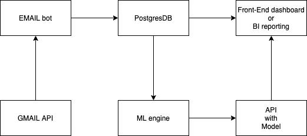
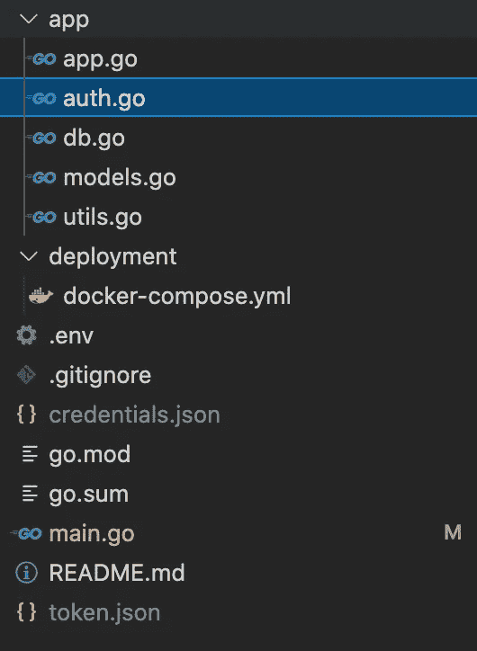
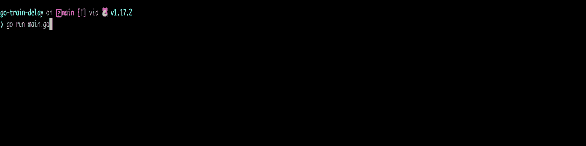
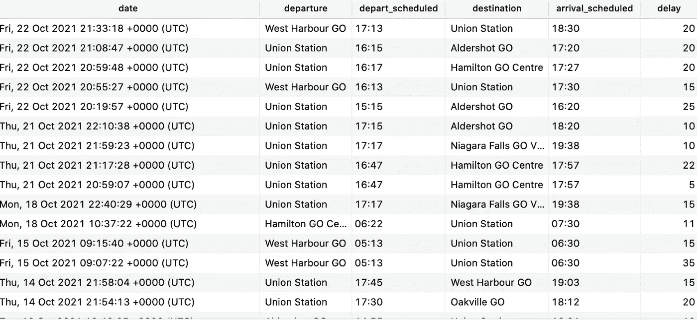
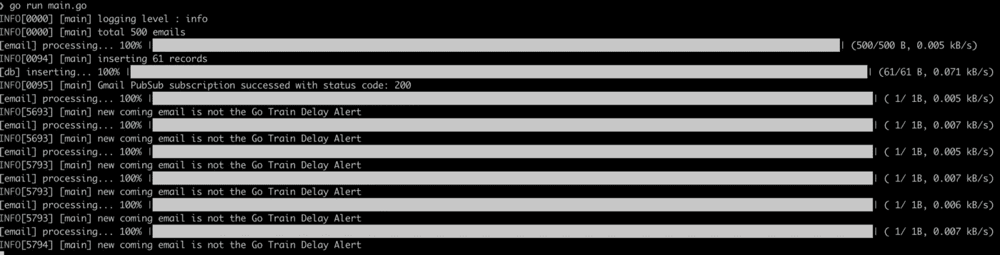

# Go 列车延误分析的数据管道—第 1 部分

> 原文：<https://towardsdatascience.com/a-data-pipeline-for-go-trains-delay-analysis-part-1-21b2c2496aca?source=collection_archive---------25----------------------->

## 周末建设和学习

当我回顾我的文章频率时，我发现“周末建设和学习”最有成效的季节是秋天。我认为原因是秋天的颜色和咖啡。好的。让我们看看这个周末我们将建造和学习什么。

由[文森特·埃哈特](https://unsplash.com/@vince_erhart?utm_source=medium&utm_medium=referral)在 [Unsplash](https://unsplash.com?utm_source=medium&utm_medium=referral) 上拍摄的照片

在这个构建和学习系列中，我将带您了解概念、设计、架构和构建，这与编码结合在一起，确保我们对我们最喜欢的编码部分进行端到端的逻辑思考。

# 用例定义

自从疫情和 WFH 开赛以来，我不需要乘坐 Go Train 去上班，但我仍然通过电子邮件收到了我注册的 Go Train 延迟警报。时不时地，当我更频繁地收到提醒邮件时。我想到的问题是:

1.  每天延误多少次？
2.  平均延误时间是多少分钟？
3.  哪个车站发生的延误最多？？
4.  如果这些数据可以建立一个模型来预测火车晚点会怎么样？这将是非常整洁的。
5.  等等。

约翰·麦克阿瑟在 [Unsplash](https://unsplash.com?utm_source=medium&utm_medium=referral) 上的照片

好了，我们来总结一下我们的要求；它分为两项:

1.  作为一个用户，我希望看到一个仪表板，它显示关于列车晚点信息的数据元素。
2.  作为一个用户，我想预测在即将到来的日期去火车延误。

所以对于这两个需求，最重要的部分是第一个，因为第二个是基于第一个的。让我们分清主次。

# 技术分析

需求就是需求，是人们对归档器或结果的定义。然而，

1.  能做到吗？
2.  快速交付成果有什么可用的吗？
3.  有什么技术挑战吗？
4.  等等。

上面的分析，我们可以称之为业务/技术分析，它将业务语言/需求翻译成 IT/技术语言。这项任务通常由传统公司的业务分析师(BSA)或架构师负责，有一个项目里程碑。

在一些小型创业公司中，它将由 sprints 中的工程师负责。

机器学习管道需要一致的数据输入，以提高准确率。因此，在这种情况下，我们需要知道如何获得最简单快捷的数据。让我们谷歌一下，看看现有的 API 或数据集是否可用，但以可扩展的方式需要。

很快，我发现 Go Train 服务确实存在一些 API /数据集，如下所示:

<https://www.metrolinx.com/en/aboutus/opendata/default.aspx>  

然而，经过一些审查和分析，结论如下:

1.  根据我到目前为止的搜索，数据集(GTFS)文件不包含 Go Train Delay 的警报和信息。
2.  我们需要注册 API 来访问它；我已经提交给个人使用，但我仍在等待批准。根据数据集和响应数据结构，我没有看到当前分析的延迟时间，这是我们需要的关键信息。

好吧，让我们退一步，我们需要什么？我们需要知道

1.  发生日期和时间延迟
2.  出发站
3.  预定的出发时间
4.  目的站
5.  目的地预定时间
6.  延迟分钟。

但是该信息存在于提醒电子邮件中。酷毙了。我如何持续自动收到这些提醒邮件？

# 体系结构

该架构将更加关注**如何**。

这可能是一个先决条件。我用来接收 Go Train 提醒消息的电子邮件是 Gmail。

经过进一步分析，我们发现 Google GMAIL API 提供了访问邮件的权限，甚至还有推送通知功能。这可用于增量数据处理，避免每次繁重的处理。

<https://developers.google.com/gmail/api>  

一旦我们知道了**如何**获取，现在将关注于**获取什么**，如果我们可以启动访问并处理电子邮件，只找出去火车延迟电子邮件，然后我们可以检索我们需要的信息作为如下模式的警报电子邮件:

> ***主题:*** ***列车晚点—奥克维尔去 17:32 —联合车站 18:15***
> 
> *奥克维尔 GO 17:32 —联合车站 18:15 的列车预计将延迟 10 分钟到达* ***15 分钟*** *从克拉克森 GO 出发，由于较早的轨道检查。我们为延迟道歉。您可以使用 gotracker.ca 来跟踪您的火车，并查看您的火车预计何时到达您的车站:*

如您所见，电子邮件标题已经包含了电台和预定时间，并且电子邮件内容具有延迟的 min 属性。

看来我们正走在正确的道路上。

让我们看看数据流。

架构—作者截图

# 构建，编码

我最近写了很多铁锈；在这个构建和学习中，我将使用 Golang。Golang 专为 Go Train 打造，很酷吧？

玩笑归玩笑，我们选择 Golang 是因为 Google Gmail API 有内置的 Golang API SDK，有助于开发过程。

这是一个专注于以最有效的方式完成工作的极好例子。这不是关于哪种语言/技术是最好的，在我之前的文章中也阐述了这一点。

<https://medium.com/swlh/dog-fight-python-vs-golang-vs-rust-for-json-processing-33c1ffe15ab9>  

让我们开始将它分解为更多的技术细节流程:

1.  通过 Gmail API 访问 Gmail 电子邮件的 OAuth 认证。
2.  只接收标题为“去火车延误”的电子邮件。
3.  处理每封邮件，提取我们需要的数据元素。
4.  插入/加载到数据库。
5.  使用数据来训练或产生谓词模型。
6.  为使用的列车延误谓词公开 API。

在我们加入每一项之前，这里是我们的代码结构。

代码结构—作者截图

## 1.证明

这应该很简单；然而，我想强调的唯一部分是 OAuth 2.0 VS 服务帐户，以及为什么我们不使用服务帐户身份验证方法。

根据谷歌:

> *对 Gmail API* ***的请求必须使用 OAuth 2.0 凭证*** *授权。当您的应用程序需要代表用户访问 Google APIs 时，例如，当用户离线时，您应该使用服务器端流。这种方法需要将一次性授权码从客户端传递到服务器；此代码用于为您的服务器获取访问令牌和刷新令牌。*

使用 credentcial.json，从谷歌 GCP 下载意味着通过 OAuth 过程生成令牌。并将该令牌用于将来的请求。

而且 Google Golang Gmail API 也有现成的代码。

<https://developers.google.com/gmail/api/quickstart/go>  

## 2.应用程序初始和主序列运行流程

新的初始应用程序—作者代码片段

主运行流程—作者的代码片段

## 3.仅接收标题为“列车晚点”的电子邮件

内嵌流程电子邮件—按作者分类的代码片段

## 4.插入/加载到数据库

插入/加载到数据库实现—作者的代码片段

# 最后，运行输出和结果

跑步-作者截图

加载的表格—作者截图

# 额外奖励—增量负载

我假设当你关注最终结果时，你可能会问:

等一下；上面的实现只包括初始负载；增量的怎么样？

让我们现在就实施它。

增量应该基于电子邮件的更新，看起来这一切都是在 Google API / SDK 中完成的；我们将看看是否有任何 PubSub 机制可以用来监听电子邮件更新并触发处理，这意味着:

1.  **创建发布订阅客户端**

创建 pubsub 客户端—作者截图

**2。听听变化**

收听订阅更改—作者截图

**3。处理即将到来的新邮件。**

处理更改-作者截图

## 新的最终结果如下。

最终初始和增量加载—作者截图

我们有初始负载，并有所有传入延迟警报的监听器，这可以保持数据库增长，并增加训练数据集的大小和容量。

# 第一部分的结论

在第 1 部分中，我们从用例、分析、概念、解决方案开始，当然还有编码和构建。

目标状态将是完整的端到端 ML Ops 管道。

在第 2 部分中，我们将基于 ETLed 表，开始构建

1.  仪表盘
2.  ML 模型和用于模型 API 的 API 可以与用户请求交互。

在第 3 部分中，我们将关注 Github 操作(CI/CD)和部署。

> 感谢你花时间陪我度过我的建设和学习周末。

T2:这是一个独特的构建和学习项目；本文中显示的数字、分析和仪表板与 [*Metrolinx*](https://www.metrolinx.com/en/aboutus/opendata/default.aspx) 提供的任何服务或 API 无关，它只是我的分析注释，供我学习使用。

我开始写作之旅已经快三年了。你们的支持是让我不断前进，写出更多精彩学习分享的最重要动力。

<https://jayhuang75.medium.com/membership>  

另外，你可以用下面的链接给我买一杯咖啡，让我有动力在周末进行更多的锻炼和学习。

你能给我买杯咖啡吗？

<https://medium.com/geekculture/a-data-pipeline-for-go-trains-delay-analysis-part-2-e5b9ef0ea315> 