# 数据科学模板

> 原文：<https://towardsdatascience.com/a-data-science-template-5cd23310466?source=collection_archive---------8----------------------->


米利安·耶西耶在 [Unsplash](https://unsplash.com?utm_source=medium&utm_medium=referral) 上拍摄的照片

## 用 6 个简单步骤实践数据科学的模板

# 实践数据科学

如果我们能够简化实践的过程，发展一项技能会容易得多。对我来说，提高我的数据科学技能需要每周甚至每天练习数据科学工作的不同方面:*数据收集、数据清理和预处理、数据可视化、建模*等等。

***在本帖中，我将用一个实际的例子来分享我实践数据科学的基本模板。***

# 练习周期

简化数据科学技能实践周期的一个好方法是，阐明从数据到洞察力的步骤。我们可以将其视为一个六步流程:

1.  ***查找包含一些问题或挑战的数据集***
2.  ***挑一个关于此类数据集的问题*** ，可以用基础数据科学来回答
3.  ***清理*** 数据
4.  做 ***基础分析*** 在数据上回答你最初的问题
5.  ***以某种标准格式呈现结果*** 就像一个 jupyter 笔记本
6.  **重新考虑**如果你展示的结果确实回答了你的问题，还有哪些可以改进的地方

# 实际例子

为了说明这些步骤，让我们挑选一个数据集，并完成前面提到的每个步骤。

## 1.查找数据集

我在这一步实践数据科学时发现的主要问题实际上是决定使用哪个数据集。我之所以认为这是一个问题，是因为我们要么总是 ***使用相同的数据集，并随着时间的推移感到厌倦，要么被我们可以使用的潜在数据集的数量*** 所淹没。

为了避免问题，让我们通过使用 [kaggle api](https://github.com/Kaggle/kaggle-api) 和一个简单的规则来自动化这一部分，以这样一种方式随机化我们对数据集的选择，我们不必花费精力来决定，并且可以更快地进入实际编码。

我遵循 ***的原则，将所有可以有效自动化的决策自动化。***

关键是 ***要意识到你在实践中花费在决策上的时间和精力*** ，看看这些是否可以自动化，而不忽视做出这样的决策所涉及的学习潜力。

现在，我的过程很简单:

*   选择一个与我感兴趣的事物相关的单词。(这次我选择了*学习*)
*   **使用 kaggle api** 搜索与该特定单词相关的可用数据集并下载

它不是 100%随机的，但只是足够随机，以至于我没有感觉到会降低我效率的摩擦。使用 kaggle api 从关键字中搜索数据集的命令是:

```
kaggle datasets list -s learning
```

输出:

```
ref    title    size    lastUpdated    downloadCount    voteCount    usabilityRating  
kaggle/kaggle-survey-2018                                       2018 Kaggle Machine Learning & Data Science Survey    4MB  2018-11-03 22:35:07          14892        965  0.85294116       
kaggle/kaggle-survey-2017                                       2017 Kaggle Machine Learning & Data Science Survey    4MB  2017-10-27 22:03:03          22297        821  0.8235294        
alopez247/pokemon                                               Pokémon for Data Mining and Machine Learning        715KB  2017-03-05 15:01:26          10102        234  0.85294116       
rocki37/open-university-learning-analytics-dataset              Open University Learning Analytics Dataset           84MB  2018-10-27 22:30:00           3595        124  0.7058824        
rohan0301/unsupervised-learning-on-country-data                 Unsupervised Learning on Country Data                 5KB  2020-06-17 07:45:45           3956         79  0.8235294        
.
.
.
.
.
```

从我得到的选项中，我选择了`open-university-learning-analytics-dataset.`来下载它，我使用了:

```
kaggle datasets download rocki37/open-university-learning-analytics-dataset 
```

然后我解压数据并保存到一个名为`learning_analytics`的文件夹中

```
unzip -d open-university-learning-analytics-dataset.zip learning_analytics
```

## 2.挑一个问题

这一部分比较棘手，因为你可以有一个问题，然后找到一个数据集来回答它，或者你可以有一个数据集，然后在探索它的过程中发现一个问题。

让我们从导入依赖项、加载数据和选择相关表开始。在这里，我已经开始了解一些关于数据和使用哪些表的知识。

现在让我们来看看数据:

```
df_scores
```

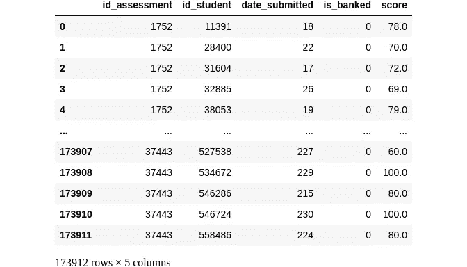

```
df_assessments
```

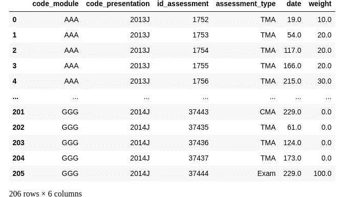

```
df_student_info
```

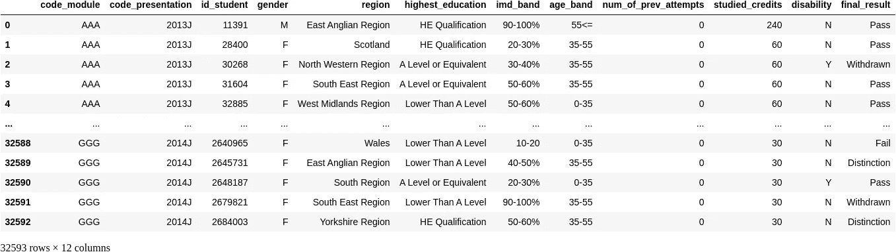

这个数据集是[“开放大学学习分析数据集”](https://analyse.kmi.open.ac.uk/open_dataset)，它是一个关于课程和虚拟学习环境数据的匿名数据集。我选择的表是:

*   **学生成绩**:包含学生在每次评估或考试中的成绩。
*   **学生信息**:包含学生的信息，例如他们来自哪个地区，他们在参加考试之前学了多少学分，他们是否通过考试等等。
*   **评估:**关于评估的元数据，如类型、权重和 id。

数据集和每个表的详细描述可以在这里找到[。](https://analyse.kmi.open.ac.uk/open_dataset)

在查看数据时，我想到了几个问题:

*   学生的平均分是多少？
*   每个地区的平均分是多少？
*   每个评估通过和未通过的分布是什么？
*   为了增加通过考试的机会，提交作品的理想时间是多少？
*   年龄和分数表现有关系吗？
*   我能写一个二进制分类器来预测学生是否会通过给定的关于学生和课程的所有可用信息吗？
*   到那一点为止所学的学分数和学生的表现有关系吗？

如您所见，对于给定的数据集，可以提出许多可能的问题。那么如何开始呢？我应该开始回答所有的问题吗？我应该从最简单的开始吗？

我的规则很简单， ***我挑选一个问题或一组问题，最适合我的练习目标和给定一天的可用时间*** 。

我的意思是，如果我只想做一个快速练习，以保持基本数据分析在我脑海中的新鲜度，我不会选择一个涉及像编写定制神经网络或探索复杂的机器学习模型这样耗时太长的任务的问题。

但是，如果在某一天我想写一些更有趣和复杂的东西，我会选择一个 ***问题或一组*** ***问题，这些问题形成一个一致的叙述*** ，并允许我练习更复杂的建模和分析。这完全取决于你一开始就设定明确的目标！

这里的想法是 ***挑选一个可以用一个问题*** 概括的叙述，用更小的问题填充叙述的空隙(就像一段历史的积木)，形成一个连贯的结构。

出于本文的目的，让我们保持简单。我的问题会是: ***一门课程中负责分数表现的主要因素有哪些？***

## 3.清理数据

现在我选择了我的问题，我可以开始调查数据，找到我关心的答案。为了有效地做到这一点，我想清理数据并做一些基本的预处理。

这里最重要的一点是删除无助于分析的 nan 和列，并将所有列与相关信息合并成一个表。我将使用的助手函数有:

让我们首先找出每个表中有多少个 NaN 条目:

```
# Output:df_student_info
Column: code_module
Number of NaNs: 0
Column: code_presentation
Number of NaNs: 0
Column: id_student
Number of NaNs: 0
Column: gender
Number of NaNs: 0
Column: region
Number of NaNs: 0
Column: highest_education
Number of NaNs: 0
Column: imd_band
Number of NaNs: 1111
Column: age_band
Number of NaNs: 0
Column: num_of_prev_attempts
Number of NaNs: 0
Column: studied_credits
Number of NaNs: 0
Column: disability
Number of NaNs: 0
Column: final_result
Number of NaNs: 0
***
df_scores
Column: id_assessment
Number of NaNs: 0
Column: id_student
Number of NaNs: 0
Column: date_submitted
Number of NaNs: 0
Column: is_banked
Number of NaNs: 0
Column: score
Number of NaNs: 173
***
df_assessments
Column: code_module
Number of NaNs: 0
Column: code_presentation
Number of NaNs: 0
Column: id_assessment
Number of NaNs: 0
Column: assessment_type
Number of NaNs: 0
Column: date
Number of NaNs: 11
Column: weight
Number of NaNs: 0
***
```

现在让我们从它们各自的列中删除 NaN 条目，并删除不相关的列:`code_presentation`和`is_banked`。

我删除了`code_presentation`列，因为它指的是给定评估所属演示的简单标识代码，因此理解学生表现中涉及的因素并不重要，类似于`is_banked`列。

让我们来看看目前为止我们有什么:

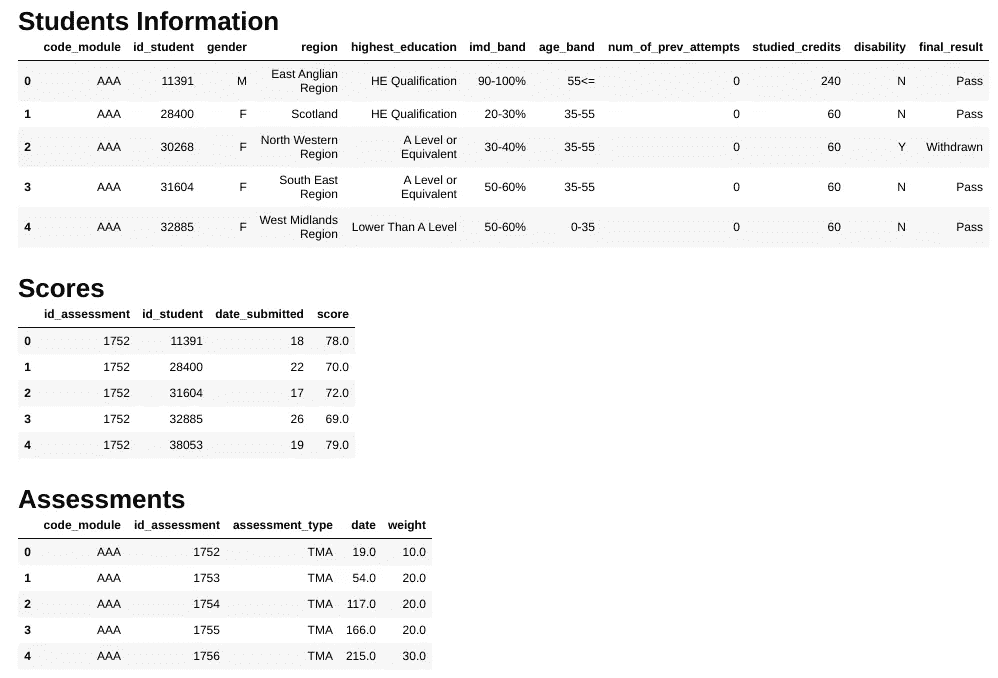

作者图片

现在，让我们创建一个名为`assessment_type`的列，将分数与其各自的评估类别联系起来:

*   `CMA`:电脑评卷
*   `TMA`:导师评卷
*   课程的一次或多次考试

我们来看看`df_scores`:

```
df_scores
```

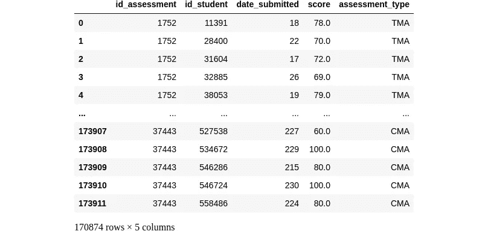

作者图片

很好，现在让我们使用`merge()`方法将所有内容合并到一个数据帧中，并从`score`和`studied_credits`列中删除生成的 NaN 条目:

```
# Output5768
0
7480
0df_merged
```

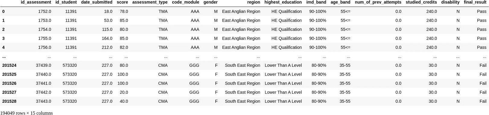

作者图片

最后，让我们将`imd_band`列改为数字:

## 4.| 5.基本分析并呈现结果

大家还记得我一开始给自己设的问题: ***一门课程中负责分数表现的主要因素有哪些？***

鉴于我感兴趣的是与学生分数相关的因素，我们先来看看分数的分布:

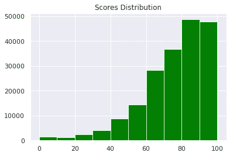

现在，让我们来看看不同类型评估的分数:

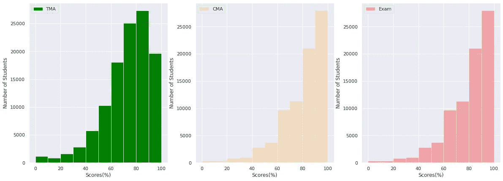

作者图片

让我们考虑每种评估的平均分数:

```
# Output:Average score for TMA
72.5633924663878
Average score for CMA
81.02705346888426
Average score for Exam
63.546800382043934
```

计算机评分评估的平均分数较高，其次是导师评分评估，考试的评分表现最差。

让我们开始挖掘，看看学生学分和分数表现之间的潜在关系。我希望学分越多的学生表现越好。

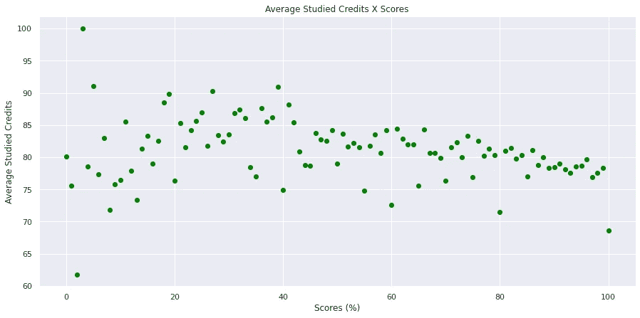

作者图片

```
pearsonr(df_merged["score"],df_merged["studied_credits"])# Output(-0.05601315081954174, 1.2536559468075267e-134)
```

从散点图和简单的皮尔逊相关可以看出，学分数量和分数表现略有负相关，因此没有什么太明显的值得注意，但我们最初的预期与数据不符。

现在，我们来看看提交的天数和性能。我认为过早提交的学生不会做得很好，但是花费太长时间的学生也不会做得很好，最高分在中间。

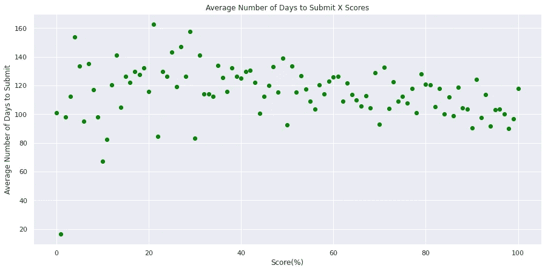

作者图片

```
pearsonr(df_merged["date_submitted"],df_merged["score"])# Output(-0.020750337032287382, 6.150386473714662e-20)
```

我们再次发现一个非常小的负相关，表明最好的成绩不一定是通过花更长时间提交而获得的，反之亦然。

现在让我们来看看通过课程的学生与未通过课程或退出课程的学生的概况。首先，我们创建两个独立的数据帧:

让我们从通过的人数与失败或退出的人数开始比较:

```
print(f"Number of people that passed the course: {len(df_pass)}")
print(f"Number of people that failed the course: {len(df_fail)}")Number of people that passed the course: 137503
Number of people that failed the course: 56546
```

我们看到通过这门课程的人比不及格的人多得多。让我们想象一下他们个人资料的不同方面:提交评估所用的时间、教育水平、年龄、学分、地区和`imd_band`，这衡量了该学生在参加课程时所居住地区的贫困水平(关于这一衡量标准的更多细节可以在[这里](https://assets.publishing.service.gov.uk/government/uploads/system/uploads/attachment_data/file/464430/English_Index_of_Multiple_Deprivation_2015_-_Guidance.pdf)找到)。

让我们从使用百分比分数来比较性能分布开始。

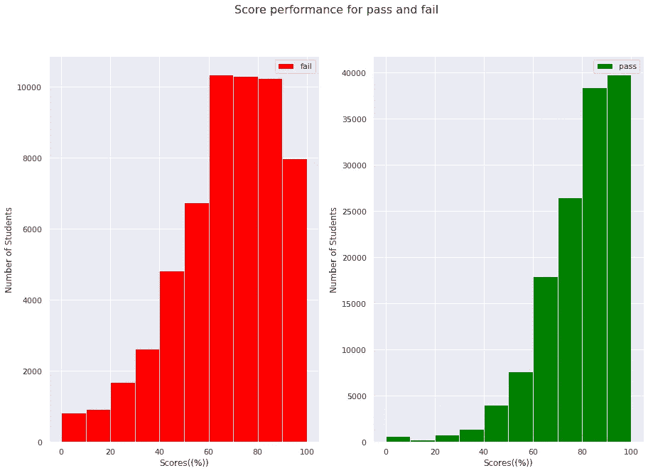

作者图片

不出所料，不及格的人的分数分布在 60-70 之间出现峰值，而及格的人的分数为 100。

现在让我们看看这两个组的提交时间概况。我们在这里的期望是，失败的学生可能会更快地提交，因为我们之前看到提交的天数和成绩之间有轻微的负相关。

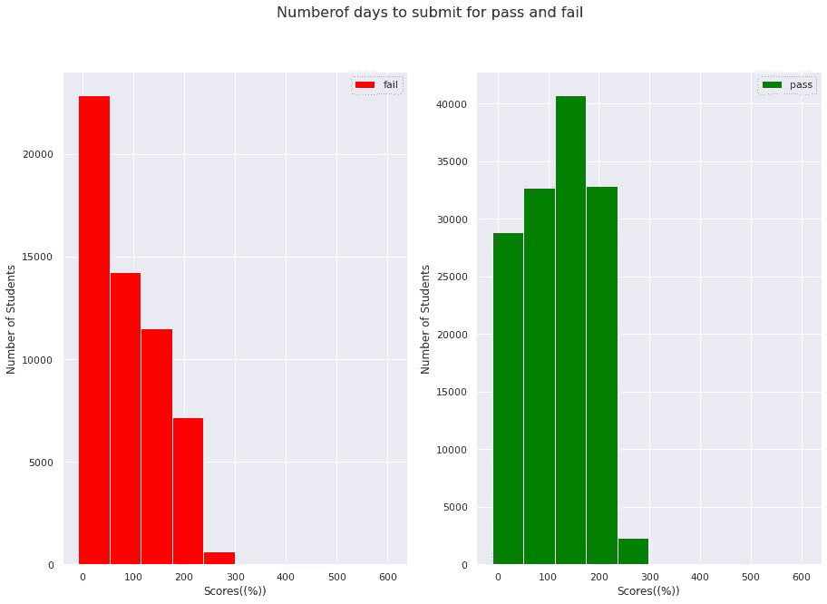

事实上，这就是我们在这里看到的情况，不及格或退学的学生提交评估的速度要快得多，我们可以清楚地看到这两种分布的巨大差异，不及格学生的峰值向左倾斜，大约在 0 到 100 天，及格学生的峰值在 100 到 200 天。让我们通过打印两组的平均提交天数来确认。

```
# OutputTtest_indResult(statistic=91.87803726695681, pvalue=0.0)
```

显著的 30 天差异。酷，现在让我们看看教育水平。

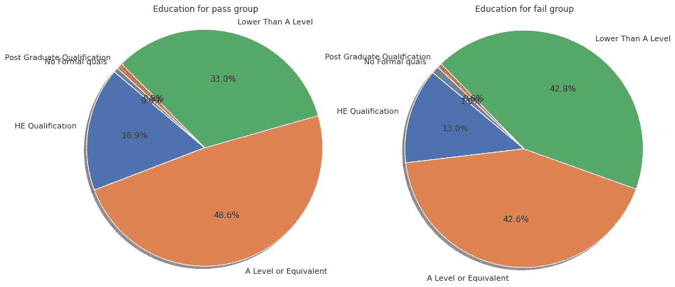

我们在这里观察到的最大差异是，与通过课程的学生组(33%)相比，未通过课程的学生组(42.8%)中教育程度低于 A 级的学生比例更高。

现在让我们看看可能的年龄差异:

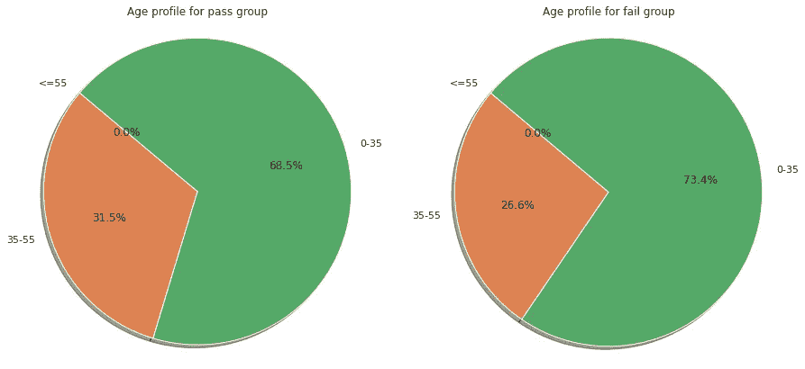

作者图片

在年龄部门，两个组似乎有相似的概况，失败组有更多 0 至 35 岁的年轻人，而通过组有更多 35 至 55 岁的老年人。

现在让我们看看地理信息——学生上课时居住的地区。

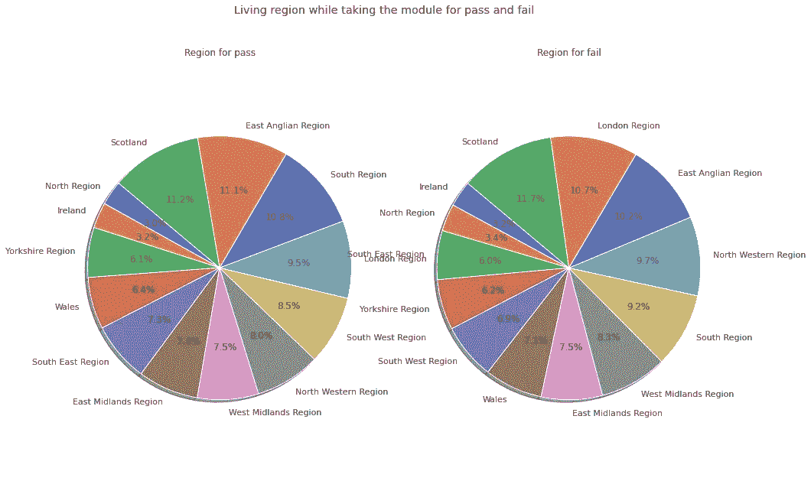

作者图片

在这里，当我们看地区之间的差异时，我们看到一些小的差异，南部地区多 1.6%的人表现较好，西北部地区多 1.7%的人表现最差。

最后，让我们来看一下`imd_band`,它本质上是对小地区贫困程度的一种衡量，在英国被广泛使用。根据社区和地方政府部的[报告，该指数反映了最贫困地区占最不贫困地区的百分比，因此随着数字的增加，这意味着该地区的贫困程度降低，因此 10%的最贫困地区和 90-100%的最不贫困地区。](https://assets.publishing.service.gov.uk/government/uploads/system/uploads/attachment_data/file/464430/English_Index_of_Multiple_Deprivation_2015_-_Guidance.pdf)

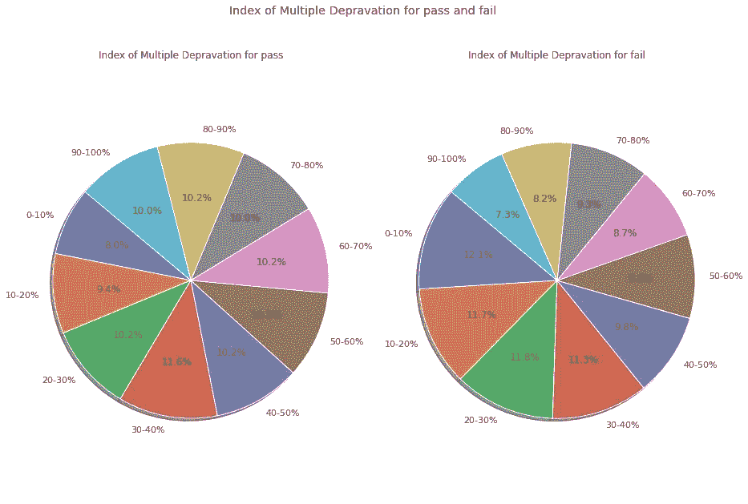

作者图片

在这里，我们看到最大的差异在 0-10%之间，反映了最贫穷的地区，与及格的人相比，来自英国最贫穷地区的不及格的人要多 4.1%。

与 10-20%组类似，失败的人中有 11.7%来自英国第二贫困地区，而通过的人中有 9.4%。

另一个有趣的方面是，在光谱的另一端，在不太贫困的地区，这些百分比发生了变化，我们看到 10%通过考试的人来自该国不太贫困的地区，而在失败组中这一比例为 7.3%。第二个不太贫穷的地区也是如此，我们看到 10.2%的人通过了考试，而 8.2%的人没有通过考试。

对我来说，这似乎指出了我最初关于分数表现的因素的问题的潜在最佳答案，因此，为了尝试了解这些明显的结果是否实际上有一些可能的影响，让我们看看分数表现和贫困之间的关系。

```
pearsonr(df_merged["imd_band"],df_merged["score"])(0.08166717850681035, 2.3543308016802156e-284)
```

在整个学生群体中，我们看到成绩表现和贫困程度之间有 8%的正相关。

让我们分别看看通过和失败案例的这种相关性:

```
 pearsonr(df_pass["imd_band"],df_pass["score"])(0.0642002991822996, 1.6041785827156085e-125)pearsonr(df_fail["imd_band"],df_fail["score"])(0.052778778980020466, 3.5499376419846515e-36)
```

同样是弱相关性，为了进一步研究这一点，让我们看一下`imd_band`排名的每个指数值的平均得分表现图，以了解趋势的概况。

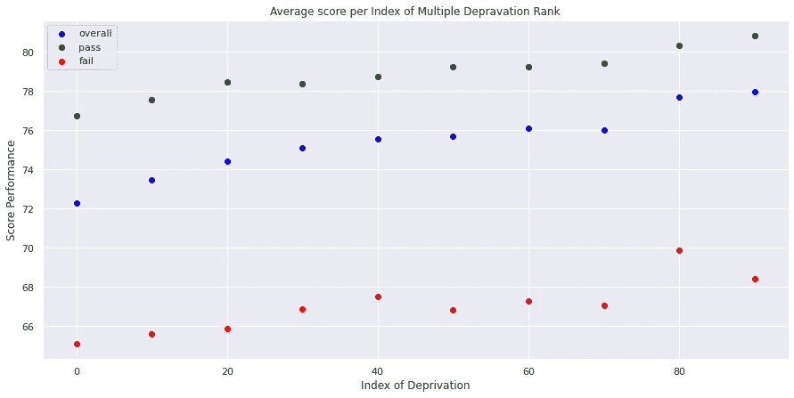

作者图片

我们可以观察到，如果我们平均每个指数组的得分，随着地区条件的改善，得分表现有一个非常明显的上升趋势，换句话说，似乎 ***越富裕的地区得分越高。***

当我们观察两组时，我们看到了相似的趋势，但有趣的是，与通过组相比，失败组在 20–70%区间内的波动性更大，在 70–80%区间内的性能跳跃更大。

为了进一步研究这一点，让我们对 imd 排名的总体得分表现拟合一条回归线。

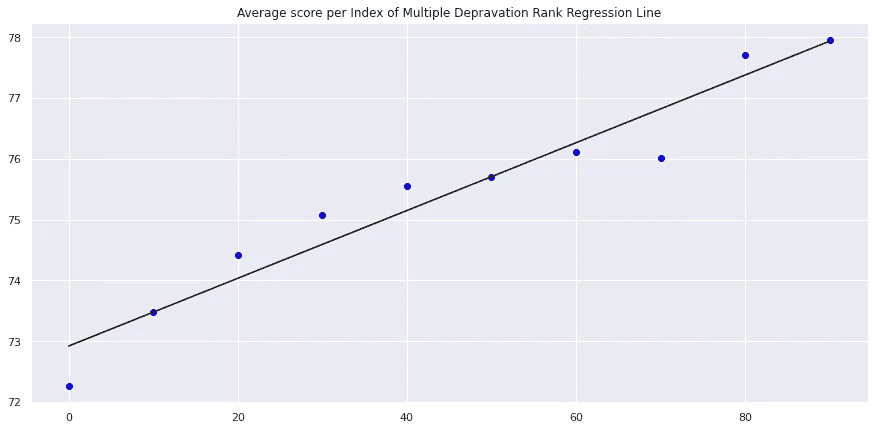

```
print(f"Slope of the Regression Line: {coef}")# Output 
Slope of the Regression Line: [[0.05571216]]
```

为了确认这些结果，让我们使用`statsmodels` api 来获得回归测试的 p 值:

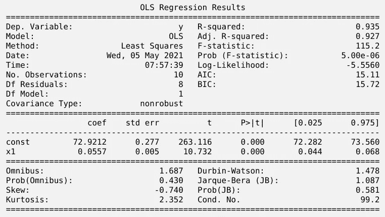

作者图片

我们观察到，我们得到了一个很好的拟合，剥夺指数每增加一个点，我们就会看到得分表现增加约 0.055，我们还得到了一个 p 值为< 0.05.

Since we are fitting the regression line to the means of scores we lose information on the variability of the scores across imd ranks but for the purposes of this analysis this is enough evidence to at least suspect that the index of deprivation might be an important factor influencing the performance of the students.

We started with a question and attempted to build a narrative around it, which in this case was to try to understand the factors involved in the scoring performance.

Upon exploring the data we saw that one factor that might play a significant role was the rank of poverty in the area where the students lived while taking the course, and we showed that there was a positive correlation between mean score performance in the course and the index of multiple deprivation in the region, with the least deprived regions performing better than the most deprived.

## 6\. Reconsider

Before wrapping up a data science practice session ***的显著 t 检验。我喜欢重新考虑我所做的*** ，问自己我使用的统计论据或模型是否确实基于数据并反映了相关信息。

在这个数据集的情况下，我认为他们是为了一个非正式的实践会议，虽然如果这是为了研究或专业报告，在巩固我所做的陈述的论点方面将有更多的工作要做。可以重新考虑的因素:

*   针对整个得分和 imd 等级值绘制一条回归线，以获得贫困和得分表现之间关系可变性的信息
*   调查关于合格组和不合格组之间的统计差异的更详细信息
*   运行随机森林和 xgboost 等机器学习模型，根据可用信息减去实际分数表现，将学生分为及格或不及格

***数据科学实践的最后一点对于培养必要的数据分析和统计批判性思维技能至关重要。***

有这篇文章源代码的笔记本可以在[这里](https://github.com/EnkrateiaLucca/data_science_practice_template)找到。

# 关于实践的思考

和所有事情一样，如果你练习，你会变得更好。大多数人的问题是他们每天实际练习这些技能的时间，因为像这样的笔记本可能需要几个小时才能完成。

然而，我要说的是，一个好的策略是 ***练习这个模板，并使用关于为您的数据制定问题的步骤来缩小您的分析范围，以适应您可用的时间段*** ，因此，如果您只有 30 分钟，您可以问一个非常简单的问题，并快速回答它，即使论点不会尽如人意。

***最重要的是练习收集数据、探索、清理、运行分析的流水线，以讲述历史的方式呈现，即使是非常简单的历史。***

如果你喜欢这篇文章，请在 [Twitter](https://twitter.com/LucasEnkrateia) 、 [LinkedIn](https://www.linkedin.com/in/lucas-soares-969044167/) 上联系我，并在 [Medium](https://lucas-soares.medium.com) 上关注我。谢谢，下次再见！:)

# 参考

*   [开放大学学习分析数据集](https://analyse.kmi.open.ac.uk/open_dataset)
*   [kaggle api](https://github.com/Kaggle/kaggle-api)