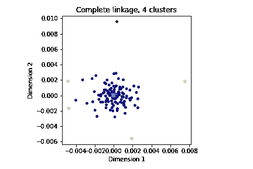
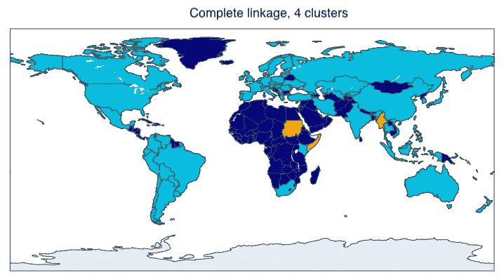
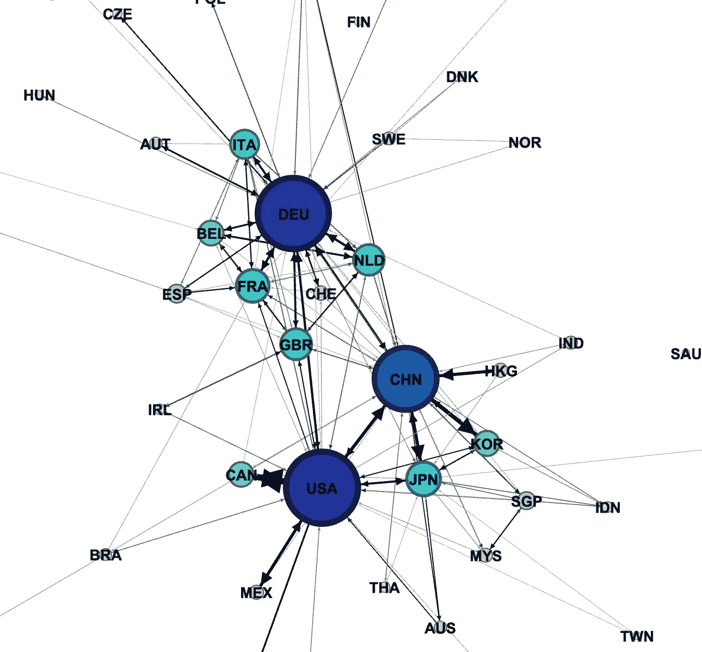
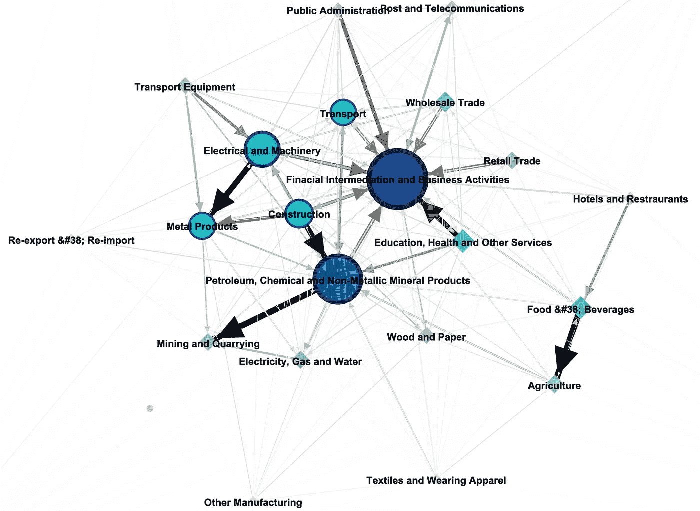

# 数据科学家理解全球经济的方法

> 原文：<https://towardsdatascience.com/a-data-scientists-approach-to-understanding-the-global-economy-2dfa8fa4dd23?source=collection_archive---------25----------------------->

## 全球经济实际上是什么样子的？我使用数据科学的工具来理解和可视化它。

有时我想，如果我关注新闻，我会对大多数事情形成一种有资格的看法。但是新闻报道，嗯，他们报道新闻——改变到不太遥远的过去。这就像透过飞驰汽车的挡风玻璃看世界一样——这与大局无关。此外，我经常有这样的印象，在当前的新闻形势下，有时很难区分观点和事实。所以我想，我应该深入全球经济，看看我是否能从数据中推断出一个基本的理解，而不是一个专家。

为了帮助我的探索，我使用了 python 包 [Pymrio](https://pymrio.readthedocs.io/en/latest/intro.html) ，它可以用来讨论全球经济的投入产出表，还可以计算足迹。投入产出表包含了货币在经济中如何流动的信息。经济中的最终需求推动企业生产商品和服务。企业依靠其他企业的商品和服务来生产自己的商品和服务。这就是所谓的中间需求，而不是最终需求。世界上的货币数量不是恒定的，因此这些表格也代表了经济增加值。部门、消费者和附加值之间的资本流动是通过投入产出表获得的。

世界上大多数国家都有投入产出表。但是他们用的格式不一样，有的不是每年都出。幸运的是，一些研究人员将它们汇编成数据集，以便研究全球经济和计算各种类型的足迹。Pymrio 是一个包，允许用户与这些输入输出表进行交互，或者创建自己的输入输出表。我使用了 EORA26[1，2]数据集，其中包含了 189 个地区从 1990 年到 2015 年的投入产出表，共有 26 个部门。这是一个完整的 EORA 数据库的压缩版本，其中的部门没有被汇总成共同的部门。

Pymrio 允许以不同的方式聚集输入输出表。例如，假设您想将欧盟视为一个单一的地区。然后，Pymrio 可以将相关区域的数据与公共扇区合并成一个区域，而不必担心索引问题。对这些部门也可以这样做。想象一下，你想比较国家，但不关心部门的细节。Pymrio 可以帮助您聚合扇区。

我想了解资金是如何跨境流动的——哪些国家联系紧密，哪些国家联系不紧密？我问自己:全球经济可以从几个相互交易的经济体集群的角度来理解吗？这些部门在全球范围内是如何联系在一起的？

我将所有部门汇总为一个部门，并比较了中间需求中的资金流动。我引入了一个距离度量 1/ *T_ij* ，其中 *T_ij* 是中间需求*中从区域 *i* 到区域 *j* 的货币投入的平均值，反之亦然。*通过这种距离度量，我们可以在地图上将每个地区表示为一个点，并在合理的范围内将这些点放置在与两个地区的贸易范围相对应的距离处。我为此使用了多维标度。该地图可以在下面的图 1 中看到。

图一。用 MDS 直接从距离矩阵计算点的位置。利用来自具有完全链接的距离矩阵的分级聚类来执行聚类。图片作者。

由于地图只是从距离上构建的，所以北、南、东、西的概念没有意义。因此，地图可以任意旋转。这张地图看起来像泼溅的墨水。中间区域的密度很高，并且有一些异常值。因此，作为一个整体，全球经济似乎与一些地区保持着良好的联系。

但是图像可能会欺骗我们。所以我尝试了几种不同的聚类方法，发现具有平均和完全链接的层次聚类似乎可以获得一致和合理的聚类，尽管我无法提出一个好的质量度量(如果你有好主意，请告诉我)。

我发现，总体而言，全球经济中有一些非常孤立的异常者。这些在图 1 中用橙色和红色的点表示。然后是点的外部区域，这些点彼此之间没有很好地连接，也不是地图的中心。这些松散连接的点在地图上显示为深蓝色的点。整个经济围绕着一个紧密相连的核心国家，在地图上以青色显示。很难理解图中所有的 189 个点。所以我也把集群放在世界地图上，如图 2 所示。

图二。聚类结果显示在世界地图上(用 Plotly 制作)。图片作者。

我们可以看到异常值是索马里、摩尔达维亚、缅甸、苏丹和南苏丹(橙色)。世界的其余部分或多或少被分成青色和蓝色。松散联系的国家可以在非洲、中东、中美洲和中东的一些地方找到。世界其他地方属于人脉很广的核心。

好了，我们知道了，世界或多或少是一分为二的。那些相互之间有大量交易的国家和那些没有交易的国家。但是在那些交易者中，谁在交易呢？为了找到答案，我使用 [NetworkX](https://networkx.org/) 将中间需求转换为图表的形式。图由通过边连接的节点组成。我设计了这个图，使得每个节点代表一个区域，并且通过一条向内和向外的边连接到每个其他节点。边缘的方向和权重对应于货币在中间需求的区域之间流动的方向和大小。我的图表是动态的，从某种意义上说，边缘随着时间(年)的变化而变化。NetworkX 不支持这一点，所以我不得不写一些代码来创建一个可以用 [Gephi](https://gephi.org/) 可视化的动态图形。

图 3 显示了对应于 2014 年的部分图表的屏幕截图。使用弹簧模型(ForceAtlas2)计算节点的位置。每条边被模拟为弹簧，其刚度与边的重量成比例。此外，节点被建模为相同符号的电荷，使得靠近的节点比远离的节点更相互排斥。系统用随机位置初始化，并被允许松弛直到节点不移动。因此，节点之间的相对距离指示了它们连接的强度，但是同样，系统是旋转不变的。节点的大小和颜色对应于资金的总流入和流出。

图 3。2014 年中间需求图的可视化，使用 ForceAtlas 2 通过 Gephi 可视化。图片作者。

我们可以看到，全球经济中似乎有三个主要的贸易中心:美国、德国(DEU)和中国。德国显然是欧盟其他国家的贸易中心。我的祖国丹麦在模型中靠近挪威、瑞典和芬兰，就像它们在地图上一样，但是瑞典似乎比丹麦更靠近德国，尽管它与德国没有共同的边界。

加拿大和美国之间似乎发生了很多贸易，美国似乎向加拿大输送了更多的资金(存在贸易逆差)。美国似乎也对中国存在贸易逆差。看看上届美国政府领导下的贸易战如何改变这种模式将是一件有趣的事情，但不幸的是，这些数据不是最新的。美国和中国与亚洲国家的联系似乎比欧盟更紧密。总的来说，与中国的贸易似乎是这段时间内全球经济中最大的一次质的变化。总的来说，我从图表中了解到，虽然贸易是全球性的，但它也是地方性的。少数几个大型经济体主导着全球贸易，它们最密切的贸易伙伴要么是其他大型经济体，要么是它们的近邻。

这种可视化从地区的角度来看。我们也可以把视角换成部门的视角。这可能让我们能够识别供应链，并大致了解全球范围内资金是如何在各个部门之间流动的。下图 4 显示了所有国家汇总的部门的相应图表。

图 4。2014 年各地区行业中间需求图可视化。图片作者。

同样，节点的大小和颜色表明了这些部门之间的贸易联系有多紧密，而不是这些部门的产出。看这张图，我们可以很容易地识别供应链。举个例子，连锁店“旅馆和餐馆”->“食品和饮料”->“农业”。资金流向很清楚，产品流向也很明显。另一个类似的链条是“建筑业”->“石油、化学和非金属矿物制品”->“采矿和采石业”。有趣的是，所有行业都与“金融中介和商业活动”有着相当密切的联系。这表明所有部门都需要获得资本。因此，这个部门是所有部门中最大的资金分发者。

我觉得有趣的是，所有部门是如何相互依赖的。如果你仔细观察，你会发现许多供应链是分等级的，但大多数是分支的，少数看起来是环状的。作为一名消费者，如果你购买产品，几乎不可能预料到你的消费习惯会如何扰乱这个系统，但事实上，是最终需求总量塑造了并将继续塑造这个行业。

本帖从一个数据的角度关注全球经济。但实际上我更专注于理解气候危机。气候危机的一些解决方案实际上可能来自于对最终需求如何影响全球贸易的理解。这是因为，系统对最终需求微小变化的反应，可以通过用不同部门的排放信息和一点点线性代数来扩展表格来评估。在我的下一篇文章中会有更多的内容:)

*有兴趣可以在这里* *找到代码* [*。这是我的第一个帖子。我希望你喜欢它。欢迎留言联系。请注意，我不是经济学家，所以我不知道我的天真分析如何符合专家的意见。*](https://github.com/andersborges/io-blog)

[1] Lenzen M，Kane moto K；Moran D 和 Geschke A (2012) [绘制了世界经济的结构](https://worldmrio.com/pdf/LenzenEtAl2012_EST_MappingTheStructure.pdf)。*环境科学&技术*46(15)PP 8374–8381。[DOI:10.1021/es 300171 x](http://dx.doi.org/10.1021/es300171x)
【2】Lenzen，m .，Moran，d .，Kanemoto，k .，Geschke，A. (2013) [建立 Eora:高国家和部门分辨率的全球多区域投入产出数据库](https://worldmrio.com/pdf/LenzenEtAl_2013_BuildingEora_ESR.pdf)。*经济系统研究*，25:1，20–49，[DOI:10.1080/09535314 . 2013 . 769938](http://dx.doi.org/10.1080/09535314.2013.769938)