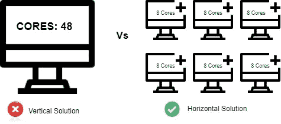
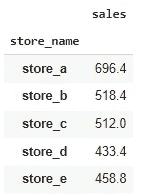
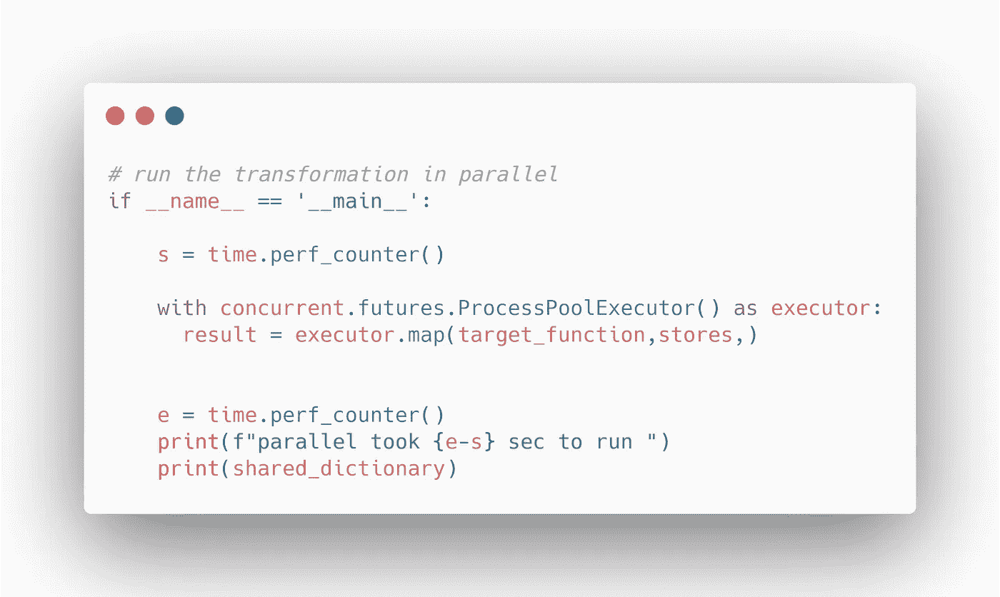
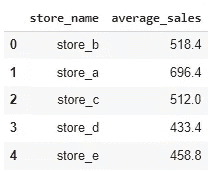
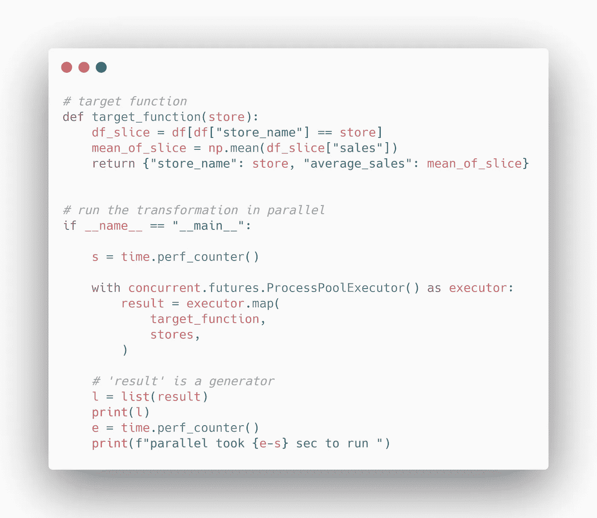
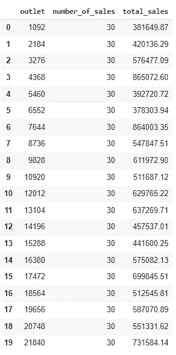
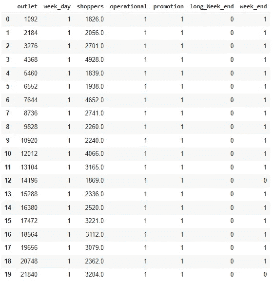
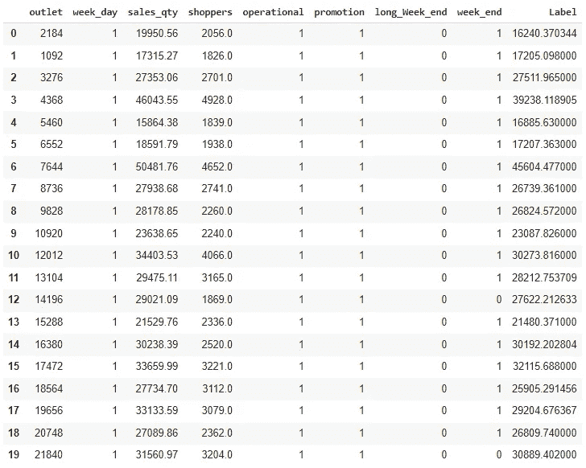
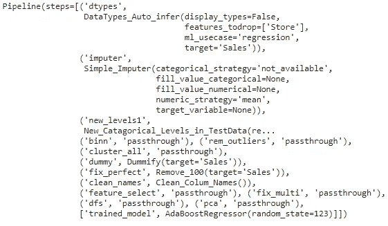

# 数据科学家的梦想:Python、大数据、多处理和 PyCaret

> 原文：<https://towardsdatascience.com/a-data-scientists-dream-python-big-data-multi-processing-pycaret-by-fahad-akbar-7cc213a12db?source=collection_archive---------13----------------------->

## 创建和部署大数据解决方案

## 借助 Python 的多处理模块和 PyCaret，使用所有内核训练多个模型


图片来源:杰森·袁，Unsplash

让我简单地说:如果你在数据分析或数据科学领域，处理大数据的能力已经成为一种绝对的需求。在这篇文章中，我们将学习设计一个解决方案，您可以简单地使用您的笔记本电脑/台式机创建。不需要花哨的云解决方案！

今天，我们将学习以下内容:

1️⃣什么是 Map Reduce
2️⃣什么是 Python 的多处理模块
3️⃣如何训练&并行预测多个模型

📓**注意**:有多种工具和解决方案可用于处理大数据。这里的目标是理解基础知识，然后继续学习更复杂的工具。我还假设读者具有数据科学的基础知识， [PyCaret](https://pycaret.org) (一个开源的低代码库)，并且能够用 Python 编码。

# 1️⃣什么是地图简化？

当我们想到要处理大量数据时，我们脑海中自然会浮现出什么？一个显而易见的解决方案是获得一个更强大的机器。这个想法被称为“垂直缩放”你有一台机器，但有更多的权力。然而，这被证明不是一个非常实用的解决方案。另一种方法是“横向扩展”，将多个小型机器放在一起，我们希望使用它们的组合资源来解决我们的问题。为了实现这一点，我们首先需要在机器/计算机之间建立一个网络。你现在不需要担心创建这个网络。然而，在当今世界，创建和维护这样的网络要容易得多，也便宜得多，尤其是有了所有可用的云解决方案。这真的不难。



作者图片

正如我上面提到的，创建网络(虽然很容易)超出了本文的范围，我们仍然可以用自己的个人台式机或笔记本电脑学习和应用这个概念。只要我们有不止一个内核，我们就可以像在网络中一样使用计算机中的内核。毕竟，你自己的电脑是一个迷你的水平缩放解决方案；实际上是一个网络或多个核心！

一旦我们有了合适的网络(横向扩展)，我们所需要的就是 ***将*** 我们的数据分发给这些机器，使用这些资源处理我们的数据，最后 ***收集*** 结果回来。这种分配相当于“映射”，收集相当于“减少”。那是你的地图-缩小！所有著名的大数据解决方案实际上都基于这一概念。如果你问我，“地图”是最难的部分。在这种情况下，必须设计一种策略/逻辑来将数据分发到整个网络，以便您可以解决手头的问题。有些问题很容易解决，有些更难，有些甚至不可能。

让我们用一个非常简单的例子来理解这一点。假设我们有一个大小为 16 的数组/数字列表。我们想计算它的平均值。在正常情况下，我们会做这样的事情:

`mean = np.mean([8,1,4,3,2,5,1,2,2,9,7,6,2,4,2,1])`

结果将是`3.6875`。现在想象一下，由于某种原因，我们的计算机没有足够的能力在 **one go** 中计算它。那么，你能想出一种方法将这个数组分配/映射到所有的内核，然后求解平均值吗？

很简单。我们知道“均值与平均值相同”(只要样本量保持不变)。所以我们可以把我们的数组分成大小相等的更小的数组，发给不同的核，让每个核计算更小数组的均值，返回均值数组，然后计算均值数组的均值！**我们刚刚实现了 map(打破&阵列到内核的分布)reduce(将阵列缩小到一个数字并取回它)。**


作者图片

在**步骤 1** 中，我们将数组分成数组子集，并将它们发送到不同的内核。在**步骤 2** 中，每个内核计算(📓注意:所有内核同时执行计算&不像循环方式！)它得到的子集的平均值。我们将这些结果保存到另一个数组中，该数组现在的大小为 4。在**步骤 3** 中，我们要求任何一个内核对这个数组执行另一个均值计算。我们返回最终平均值来捕捉/显示结果。（📓注意:如果我们有一个虚拟的计算机网络，第三步会更复杂，因为结果会从每台计算机上收集并提交回主计算机。).这是 map-reduce 的一个小例子。

现在，您可以将此示例推广到一些实时大数据问题。考虑对一个巨大的数据集应用一些聚合函数(也称为分组操作)。如果没有横向集成/ map-reduce，它的执行速度会非常慢。我们可以执行相同的聚合功能，方法是截断数据，然后通过一些逻辑来获得我们想要的东西。那会快得多。

另一个用例是您需要在一个“循环”中执行一些操作，例如，假设您有数千个单独的 CSV 文件，您想将其转换为任何其他文件格式，比如 XLSX。或者你必须为你有数据的每个客户训练单独的模型。使用垂直集成，您将不得不一个接一个地循环运行所有的东西，并且您可以想象执行整个任务将花费的时间。另一方面，如果您应用 map-reduce，您将能够“并行化”操作，并且过程的执行将会快得多！事实上，在我们的例子中，我们将解决和实现完全相同的问题。

📓**注意**:可能会有数据大小的问题，也就是说，数据太大了，以至于一台机器的内存都装不下。在这种情况下，你需要一个计算机网络，而不是一台机器。该解决方案超出了本文的范围。尽管如此，仍将涉及 map-reduce。

# 2️⃣什么是 Python 的多重处理模块？

内置的多处理模块/库帮助我们实现我们刚刚讨论的 map-reduce 策略。就这么简单！通过这个库，我们将指导 python 运行独立的并行过程，这将节省我们大量的时间。多重处理库是一个很好的资源，但是后来，又增加了一个名为“并发”的库。这是建立在多重处理库之上的，只是使事情处理起来更简单。尽管我会推荐检查多处理库[这里](https://docs.python.org/3/library/multiprocessing.html)，为了简单起见，我将使用“并发”库。要使用这些库，我们需要理解几个要点。

👉首先是我们将要运行的代码的**结构**。我们将使用并发模块中的`map()`函数，我们将为该函数提供两个参数:

1️⃣目标函数:我们希望对我们的数据处理执行的函数。在我们前面的例子中，你可以把它想象成`numpy.mean()`。

2️⃣迭代器对象:一个类似列表/数组的对象，包含唯一值，通过它可以索引数据。您可以将其视为数据的切片器/分割器。在我们之前的例子中，它是一个列表[1，2，3，4]，我们通过它将数据分成 4 个相等的块。

`map`函数会将迭代器的**目标函数**和**单元素**分配给每个内核。由于我们的原始数据位于全局名称空间中(这意味着所有内核都可以随时访问它)，我们可以将数据切片(使用单个元素)并在每个内核中对其应用目标函数。向所有内核分配功能和元素是由并发模块自动管理的。

👉我们需要了解的第二件事是输入(或正在使用的数据)、输出(我们想要的结果)的处理，以及在这个过程中我们可能需要使用的所有变量。在没有多重处理的情况下，我们一直使用这种东西，没有任何问题。有了多重处理，事情就不一样了。用目标函数处理数据片的每个核不能真正与其他核共享任何信息/进程片。这个限制的影响是我们不能“容易地”更新变量/输出的值。幸运的是，有一些可用的解决方法。多重处理模块提供了一个“共享”字典，我们可以使用它来收集每个内核工作时的更新信息。或者(如果您的流程允许),我们可以创建一个空的 CSV 文件，然后将从每个内核获得的结果附加到该文件中。请注意，只有当您将此解决方案部署到一台机器上时，此方法才有效。如果你有一个计算机网络，这一招就不管用了。然而，这种方法为我们提供了更多的灵活性。

👉我们需要知道的是这个代码结构不能在 Jupyter 笔记本上运行。我们将需要在 python 模块中编写完整的代码，这仅仅是在一个. py 文件中编写 python 脚本，而不是在一个. ipynb 文件中。

在我们看一个例子之前，我制作的一个短片可以帮助我们理解这个结构:

作者提供的视频

## 一个简单的例子:

让我们做一个简单的项目，应用我上面解释的概念。假设我有五个不同商店的销售数据。我想计算每个商店的日销售额的平均值。这就好像我想用 mean 函数应用 group by 子句一样。只是这一次，我们将使用并发模块来获得相同的结果。

让我们创建数据集。我们的数据集将包含五个商店，每个商店将有五个每日销售点。在您这边，您可以根据需要增加数据量和商店数量:


作者图片

如果您打印数据集，您将看到类似这样的内容:


作者图片

我们希望转换这些数据，以获得每个商店的日销售额的平均值，最终结果应该是这样的:



下一步是创建实现这种转换的函数。从概念上讲，这是最难的部分，你想要的转换越高级，函数就越难。在我们的例子中，这是一个简单的意思。**这个函数应该被构造成好像你正在做一个“for 循环”的*和*步骤。**此外，如上所述，我们需要获得共享字典和 CSV 占位符。


作者图片

我们所需要的就是通过调用`map`函数，通过我们拥有的并发模块来“执行”这个函数。`map`该函数将接受目标函数和一个 iterable(在我们的例子中是 list ),它可以使用这个 iterable 将数据和函数切片并分发给所有的内核。对于我们的例子，它就是我们拥有的商店的唯一列表。我们还可以计算运行并行过程所需的时间。



记住，我们需要在一个 python 模块中运行所有这些代码片段，然后通过命令行运行该模块。您可以在自己的终端上运行的完整代码如下:

在终端中运行该文件后，您应该会看到以下输出:


作者图片

我们还创建了一个占位符 CSV 文件，从运行该模块的目录中读取并查看它。您应该得到这样的结果:



就是这样。您成功运行了多处理作业并获得了结果。出于实验目的，您可以增加商店的数量和每日销售额。

> ⚠️ **警告:**不幸的是，对于 Windows 用户来说，上述过程不会按预期运行。但是我们可以通过一些简单的方法达到同样的效果。首先是改变代码的结构。共享字典和占位符 CSV 文件不会为我们存储任何东西。为了取回结果，我们需要从目标函数返回期望的对象(而且你可以返回任何东西！浮点、数组、字典或任何其他对象)。当我们运行 executer 时，它会返回给我们一个生成器，我们所需要的就是用一个循环或列表理解来运行它。以下是您需要进行的更改:



作者图片

> 第二种方式，也是我最喜欢的(因为它的灵活性)是简单地使用 Window 的 Linux 子系统(WSL)。这是在你的 Windows 上安装 Linux 的一个非常方便和简单的方法，而且不会造成混乱。我有一篇关于它的单独文章，你可以在这里 访问它 [**。在本文的其余部分，我将假设您已经使用了 Lunix /Mac 系统。**](https://fahadakbar-50702.medium.com/get-linux-in-windows-the-easy-way-three-simple-steps-by-fahad-akbar-aa5b142c943c?sk=a8e20dae33fde0563e69bb00966b5c17)

如果您已经理解了这里的所有内容，那么您应该能够以并行的方式设计和运行您自己的解决方案。你可以简单地停下来，开始建造你自己的。然而，本文继续到最后一部分，我们处理一个涉及并发期货和 PyCaret 的真实例子。

# 3️⃣并行训练和预测多个模型

我们有一家拥有许多商店的零售企业的数据。每个商店都有每日销售记录。在现实世界中，商店里会有许多商品，但是为了简单起见，让我们假设只有一件商品要卖。我们的工作是预测每个商店的销售额。

我准备了一些虚拟数据，你可以通过[库](https://github.com/mfahadakbar/multiprocessing)访问。在训练数据中，我有 20 个商店的销售，其中每个商店有 30 个每日销售记录。让我们看看数据:


作者图片



作者图片

我们需要预测“sales_qty ”,并可以使用所有其他列作为“特性”。数据是干净的，没有丢失的值。在测试数据集中，我们必须预测“sales_qty”列。下面是测试数据的样子:



作者图片

📓:你可以从我的[仓库](https://github.com/mfahadakbar/multiprocessing)下载数据和 python 模块。

在通常情况下，我们将简单地按商店进行循环，为每个商店训练单独的模型&保存训练好的模型供以后使用。但我们不想做循环，因为大量的商店和大量的日销售记录可能会让可怜的循环变得太多。我们希望以并行/并发的方式完成这项工作。

🔆**策略:**我们的策略很简单，和以前一样。我们将制作一个训练函数(目标函数)，并制作一个 iterable(商店的唯一列表)。训练功能将包含您想要为单个商店完全训练模型所需的一切。然后，我们将训练好的模型保存在共享字典中，并将预测结果动态保存在 CSV 占位符文件中。我假设您熟悉 PyCaret，我不需要解释它的功能，如果不熟悉，您可以从这里开始学习[](https://pycaret.org/)**。这很容易！**

**下面是可以实现这一目的的代码。它只不过是我们在前面的例子中已经看到的内容，而且我已经用注释对其进行了详细说明，以便于您阅读。**

**当您在 Linux / Mac 终端中运行这段代码时，您可以检查所有内核的状态，看看这段代码是否使它们变得繁忙。在您的终端中键入`htop`，您应该会看到类似这样的内容:**

****

**图片作者:所有 8 个核心都在忙着训练模型**

**一旦过程结束，它应该给你完成培训的时间。在我这边，我花了 70 秒训练 20 家商店的模型，进行了 10 次交叉验证，同时从 20 多个模型中选择每一个模型。真快！**

**最后应该有“predictions_place_holder.csv”文件，它应该是这样的:**

****

**作者图片**

**您还应该能够阅读共享字典，我们将它作为 pickle 文件保存到我们的工作目录中。如果加载 pickle 文件:**

```
with open("saved_models.p","rb") as fp:models = pickle.load(fp)
```

**并检查它，你会注意到，我们有一个训练有素的渠道，每一个商店，其中商店编号是关键。我们可以通过索引`model[1092]`来访问它，你应该得到这样的结果:**

****

**作者图片**

**这是一个 scikit-learn 学习管道对象，最终包含转换器和估计器(参见“trained_model”)，这意味着您可以随时使用点预测方法`model[1092].predict()`来获得商店 1092 的预测！**

**这就把我们带到了文章的结尾。我们学习了 map-reduce，Python 的多处理模块及其工作原理，最后我们如何使用并发模块通过 PyCaret 并行训练和保存多个模型。这只是一个开始，随着经验的积累，您可以对处理进行微调，对函数进行因式分解，并深入多处理模块的细节。然而，希望您现在能够更好地处理一些大数据解决方案。我将感谢您的评论、想法和见解！**

**➖➖➖➖➖➖➖➖➖➖➖➖➖➖➖➖➖➖➖➖➖➖➖
你可以在 [**上关注我**](https://fahadakbar-50702.medium.com/subscribe) &上联系我 [**LinkedIn**](https://www.linkedin.com/in/fahadakbar/) &访问我的[**github**](https://github.com/mfahadakbar/)➖➖➖➖➖➖➖➖➖➖➖➖➖➖➖➖➖➖➖➖➖➖➖**

# **您可能还对以下内容感兴趣:**

**👉[Docker](/make-your-data-science-life-easy-with-docker-c3e1fc0dee59)
让您的数据科学生活变得简单👉[使用 PyCaret 的自定义估计器，第 1 部分](/custome-estimator-with-pycaret-part-1-by-fahad-akbar-839513315965)
👉[使用 PyCaret 的自定义估算器，第 2 部分](/custom-estimator-with-pycaret-part-2-by-fahad-akbar-aee4dbdacbf?sk=3556332049ac839d1d423615dab25bf0)
👉[轻松获得 Windows 内部的 Linux 系统](https://fahadakbar-50702.medium.com/get-linux-in-windows-the-easy-way-three-simple-steps-by-fahad-akbar-aa5b142c943c?sk=a8e20dae33fde0563e69bb00966b5c17)**