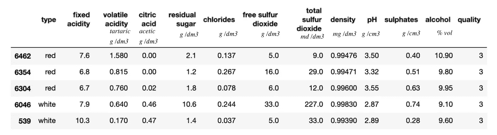
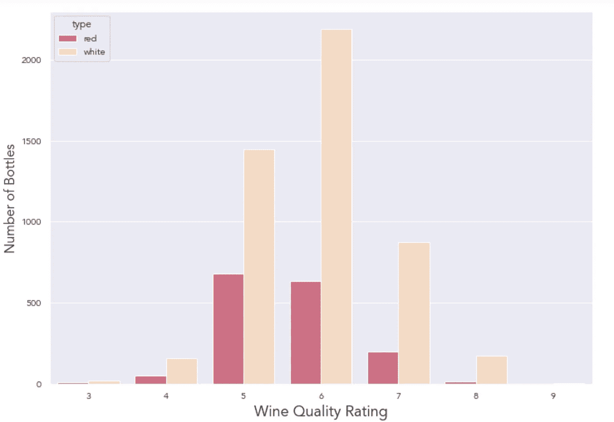
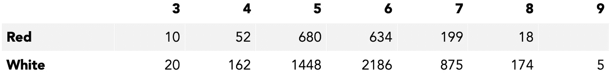
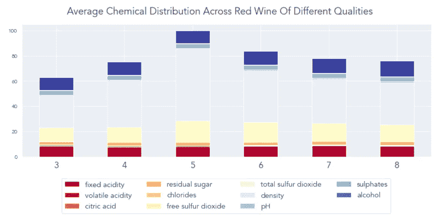
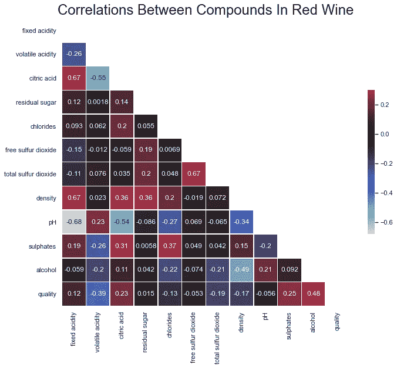
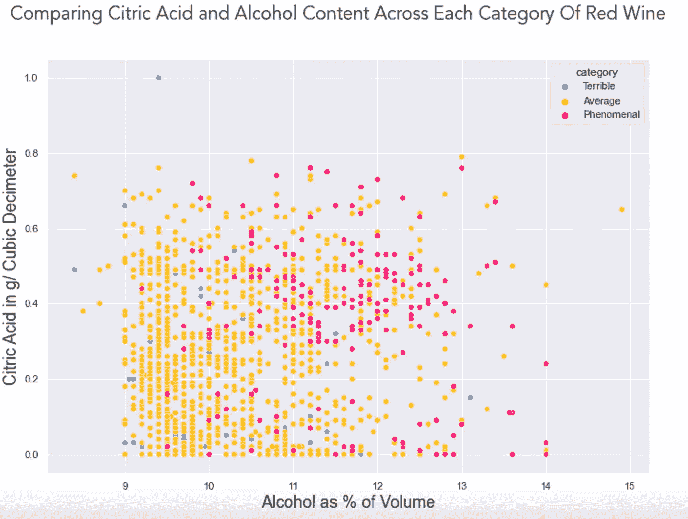
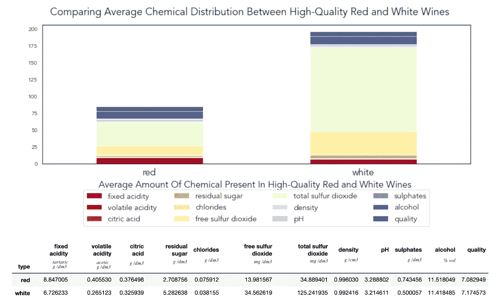

# 数据科学家购买葡萄酒指南

> 原文：<https://towardsdatascience.com/a-data-scientists-guide-to-buying-wine-b584c77b9e60?source=collection_archive---------22----------------------->

## 分离出让葡萄酒好喝的化学物质。

戴夫·拉斯托夫斯基在 Unsplash 上的照片

> 我们不需要了解葡萄酒，我们只需要做一个模型。

T 我喜欢编码的一点是，它让我们可以用数学的方法来研究任何事物，甚至探索有史以来最浪漫的物质之一:酒。

对我来说，这一点尤为重要。我在安海斯-布希公司工作，这是世界上最大的酒精生产商之一。具体来说，我负责开发一款应用程序，我们的销售代表用它来预测哪些品牌可能会在不同的行业卖得最好，比如 CVS、沃尔玛或当地酒吧。

也就是说，我对数据驱动的饮料推荐并不陌生。

但是不要被愚弄了:这并没有使我的调色板比一般人的好。我是开发商，不是酿酒师或侍酒师。虽然他们可以根据可感知的味道提出建议，但我们将把我们的分析限制在葡萄酒的数字特征上。

> 在这个演示中，我们将使用 Python 来搜索与高品质葡萄酒相关的因素。最后，你将会了解是什么让一瓶酒变得与众不同，以及这些因素是否因其颜色而不同。

## 我们的数据集中有什么？

2009 年，葡萄牙[的科学家](https://www.sciencedirect.com/science/article/abs/pii/S0167923609001377)收集了大量不同种类的佛得角葡萄酒[库存。作为给社区的一份特殊礼物，他们公开了他们的数据集。](https://archive.ics.uci.edu/ml/datasets/wine+quality)

它包含 5000 多种葡萄酒的数据，并测量 11 种不同的理化性质。

## 这些化学物质对消费者到底意味着什么？

**固定酸度:**赋予葡萄酒酸味。如果太少，葡萄酒尝起来会很“平淡”。

**柠檬酸:**常用作风味添加剂。增加了新鲜的酸味。

**挥发性酸度:**与液态柠檬酸不同，挥发性酸度是气态的，闻起来像醋。它的出现不太可能是有意的。

**残糖:**这是葡萄完成发酵后剩下的糖分。与甜味相关。“干葡萄酒”的含量往往较低。

**硫磺:**防止细菌生长的添加剂。在我的研究中，有争议的是是否有气味或味道与之相关。

**氯化物:**盐的量度。

## 看起来这个数据集中有红色和白色的瓶子。分布均匀吗？

红葡萄酒和白葡萄酒在各质量等级中的分布。

还好我们检查过了！

由此，我们可以看到我们的数据不平衡。对于这个演示，我们只是可视化静态数据，所以虽然过度表示值得注意，但这并不是世界末日。

但如果我们试图用这些数据训练一个机器学习模型，这将是有问题的。为什么？因为某些类别代表过多或不足，所以除非我们进行干预，否则可能会导致我们的模型出现偏差。

# 不同等级的酒，化学成分有区别吗？

> 如果品质只是对风味的评级，而风味是化学物质的混合物，那么不同评级的葡萄酒应该有不同的化学物质比例吧？

让我们在我们的红酒瓶上测试这个理论吧！

各等级葡萄酒中的平均化学成分含量

乍一看，化学物质遵循钟形曲线分布，8 星葡萄酒看起来与 4 星葡萄酒没有什么不同。这听起来不太直观。

也就是说，我认为这些数据分散在太多的葡萄酒质量分组中。我在想，如果我们把他们适当地分组，我们会发现一种更有意义的关系。

> 我们不关心 3 星和 4 星之间的区别，我们想确定是什么导致了 3 星和 8 星之间的跳跃。是什么让一瓶酒如此与众不同？

所以，让我们把一款酒分为“糟糕”、“一般”和“非凡”。

各类红酒中每种化学物质的平均含量。

# 我们在红酒中看到了什么趋势？

> 通过更直观地将我们的葡萄酒分组，我们发现了一些有价值的关系。

**1。低盐:**平均来说，最差的红酒氯化物含量最高。考虑到氯化物的“咸”特性，这是有道理的。“非凡的”葡萄酒最少。

**2。酸度问题:**“非凡”葡萄酒的挥发性酸度最少，柠檬酸含量最高。鉴于我们对葡萄酒酸的了解，这是有道理的:柠檬酸可能是故意引入的，因为它给葡萄酒带来了令人愉快的味道，但挥发性酸可能是发酵不良的产物。

**3。酒精为王:**最好的红酒含*酒精最多*。

现在我们已经有了每一类葡萄酒的简介，有没有什么额外的关系可以帮助我们解释为什么每个快照看起来是这样的？

让我们看看葡萄酒中存在的化学物质之间是否有其他关联。

红葡萄酒不同特性之间的相关性。

有趣的是，这个图表证实了我们刚刚推断的:对于红葡萄酒来说，酒精含量与葡萄酒质量评级(. 48)的相关性相对较强，其次是挥发性酸度(-.39)。

其他一些相互关系可以通过基础化学联系起来。例如，酒精的密度比水小，所以更多的酒精与更低的葡萄酒密度相关是有道理的。

同样，我们预计 pH 值和酸度之间有很强的相关性，因为 pH 值衡量的是一种物质倾向于酸性还是碱性。

# 难道真的是最好的红酒就是酒精含量最高的那种？

> 按照我的欧洲同事的说法，“没有”。当我在工作中展示这个笔记本时，他们注意到这个模型没有考虑到“葡萄酒的灵魂——水果味”。

他们有一个伟大的观点，在未来，我真的希望我们有一个记录特定口味的数据集。

在此之前，我非常有信心，挑选酒精含量最高的葡萄酒将增加我们选择高质量葡萄酒的几率，特别是如果它含有高含量的柠檬酸。

一个散点图，比较酒精和柠檬酸含量与样品中每种红酒的质量。最好的葡萄酒集中在右上象限。

## 但是等等，我们刚刚分析了红酒！高品质白葡萄酒的相关性有什么不同吗？

白葡萄酒不同特性之间的相关性。

很快，我们发现即使是白葡萄酒，酒精含量也与质量有着最大的正相关。

> 与红葡萄酒相比，柠檬酸的存在与质量的相关性为 20%,白葡萄酒的柠檬酸与质量的相关性为 0%。

我会假设，因为柠檬酸是一种添加剂，被故意添加到红酒中以增强它的味道，它不太可能是一个质量较低的红酒瓶会添加它。

相比之下，即使是质量最差的白葡萄酒，其柠檬酸含量也比普通的红葡萄酒高。

我不能确定这些差异的出现是因为柠檬酸在白葡萄酒中以更高的浓度自然存在，还是在白葡萄酒中添加柠檬酸是一种更常见的做法。

最终，我们需要做更多的研究来解释为什么存在这种相关性的差异。

高等级红葡萄酒和白葡萄酒化学成分的比较。

此外，这两者的特征是完全不同的。

在化学成分方面，优质白葡萄酒的含硫量是红葡萄酒的 2-4 倍。

鉴于我们所了解的硫作为防止腐败的添加剂，除非白葡萄酒含有更多的天然硫，否则发酵白葡萄酒可能需要额外的保护，而不是红葡萄酒(正如红葡萄酒受益于柠檬酸的添加)。

此外，白葡萄酒的氯化物含量是红葡萄酒的一半，但糖分含量却是红葡萄酒的近两倍。它们的酸性也略低。

尽管有这些差异，高品质红葡萄酒和白葡萄酒的酒精含量大致相同。

# 那么最后，我该买什么瓶呢？

> 不管是红葡萄酒还是白葡萄酒，我想你会喜欢几乎任何一瓶高酒精含量的葡萄酒。当你购买一瓶白葡萄酒时，柠檬酸的含量不会有什么影响，但它会决定你的红葡萄酒的成败。

虽然这个演示很有趣，但重要的是要承认，我们采用了数学方法来描述世界上最浪漫、最诗意的物质之一。一个品酒师会把这一天描述为“微风习习”，而我们却把它描述为“风速 5 英里每小时”。如此精确，在翻译中可能会丢失一些东西。

也就是说，虽然我们会更自信地选择我们的瓶子，但我觉得我的同事是对的:坐在你的约会对象对面，微笑着说“瓶子不错，你真的可以尝到硫磺”，只是没有同样的味道。