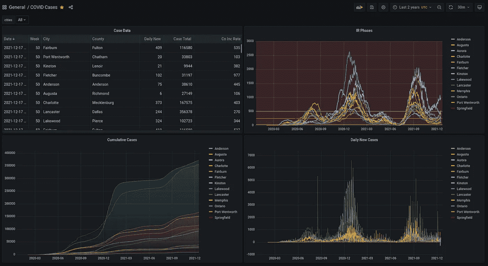
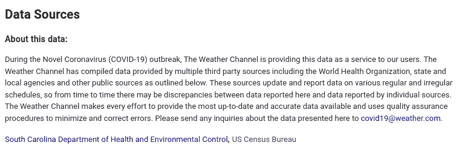
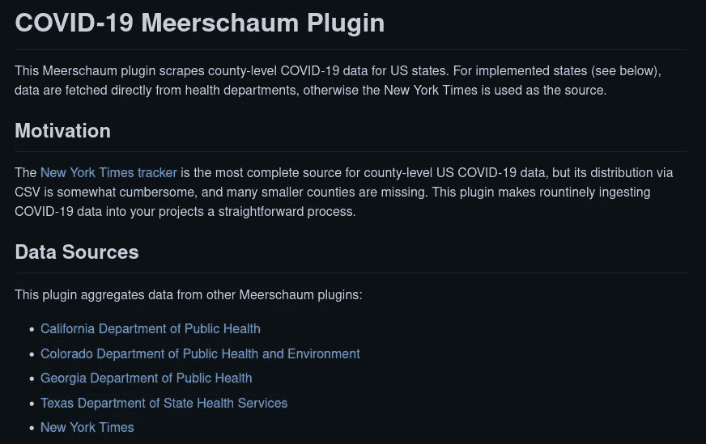
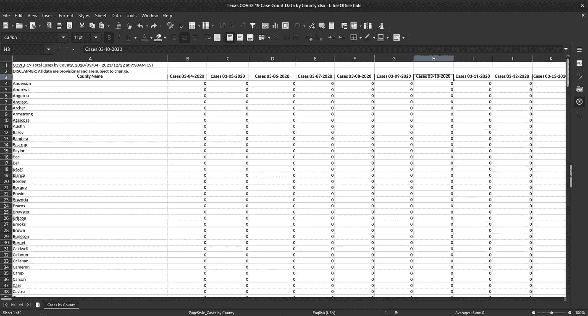

# 获取 2022 年新冠肺炎数据的数据科学家指南

> 原文：<https://towardsdatascience.com/a-data-scientists-guide-to-fetching-covid-19-data-in-2022-d952b4697?source=collection_archive---------7----------------------->

## 有时候，完成一件事的最好方法是自己动手。



用于显示县数据的自定义 Grafana 仪表板。(图片由作者提供)

在疫情的早期，数据科学家和分析师构建 COVID 跟踪仪表板是一种流行的做法。许多公共 API 被启动，但是这些服务一个接一个地被离线。截至 2021 年 12 月，[New York Times GitHub repository](https://github.com/nytimes/covid-19-data)仍然是最后的高质量 COVID 数据源之一，但即使是这个数据源也不全面，在您的项目中使用起来可能会很尴尬(它是通过 CSV 文件分发的)。

尽管聚合器停止发布精选数据，各州卫生部门继续努力报告各县的 COVID 统计数据。例如，天气频道在显示当前 COVID 信息时，将每个州的卫生部门作为其数据源。



Weather.com 直接从美国获取数据。(图片由作者提供)

比起依赖像《纽约时报》这样的中间人，你可以很容易地编写自己的脚本直接从美国获取。在本文中，我将向您展示如何快速接收县的 COVID 数据。

# 动机

几周前，一位客户向我咨询如何自动跟踪特定位置的新冠肺炎数据。两年来，他一直手动搜索并将数据输入到一个大型电子表格中，这个过程占用了他在*实际*工作的大量时间。

我承诺我会研究我们的选择，很快我意识到大多数流行的 API 已经被关闭了。我从《纽约时报》开始搜集信息，尽管我们需要的几个县没有出现在数据集中。然后我考虑去浏览天气频道，但是我突然明白了:

*为什么我不能直接从美国获取数据？毕竟，这正是 NYT 这样的聚合网站正在做的事情。*

所以经过几个小时的研究，我写了一些[插件](https://github.com/bmeares/covid)并拼凑了一个 [Grafana 仪表盘](https://grafana.mrsm.io/d/S7WRSZ27k/covid-cases?orgId=1&refresh=30m)(如上图)来可视化我的发现。我的客户非常高兴，所以我决定在这篇文章中写下我的发现。

# 获取数据

为了将数据导入 Pandas，让我们使用内置的 SQLite 数据库`sql:local`来存储我们的数据。您可以随时使用自己的数据库，例如，如果您想要构建自己的 Grafana 仪表盘。

我已经将我的提取器脚本发布为`[covid](https://github.com/bmeares/covid)` [海泡石插件](https://github.com/bmeares/covid)——一种用于提取数据的 Python 模块格式。



该插件允许您按县摄取 COVID 数据。(图片由作者提供)

我在插件的 [GitHub 库](https://github.com/bmeares/covid)上提供了使用信息，下面我将更深入地介绍我是如何决定获取数据的。首先[从](https://meerschaum.io/get-started/) [PyPI](https://pypi.org/project/meerschaum/) 安装海泡石并安装`covid`插件。

```
$ pip install -U --user meerschaum
$ mrsm install plugin covid
```

用连接器`plugin:covid`和实例`sql:local`注册一个管道，当出现提示时，输入与您的县对应的 FIPS 代码列表。

```
$ mrsm register pipe -c plugin:covid -m cases -i sql:local❓ Please enter a list of FIPS codes separated by commas: 08031,48113,45043,45045,45007,37107,37021,47157,47147
```

现在我们已经设置好了管道，让数据流动起来。运行`sync pipes`命令获取数据——第一次可能需要一分钟左右。

```
mrsm sync pipes -i sql:local
```


同步来自科罗拉多州、德克萨斯州和纽约时报的九个县的数据。(图片由作者提供)

就是这样！可以用`--loop`和`--min-seconds`连续同步，`-d`或`--daemon`标志作为后台作业运行命令。

```
mrsm sync pipes -i sql:local --loop --min-seconds 3600 -d
```

# 敲进管子里

下面是一个片段，演示了访问管道数据的方法:

接入您的管道并检索数据帧。(作者代码)

# 它是如何工作的

这是文章的一部分，我拉开帷幕，说出我的秘密。`covid`插件本身只执行其他插件并组合它们的结果；例如，`[US-covid](https://github.com/bmeares/US-covid)` [插件](https://github.com/bmeares/US-covid)从《纽约时报》获取:

从纽约时报获取数据。(作者代码)

从特定州获取数据的难度各不相同——例如，加利福尼亚州提供 CSV，因此解析类似于 NYT:

从加州卫生部门下载数据。(作者代码)

但是其他州就没这么简单了。`[TX-covid](https://github.com/bmeares/TX-covid)` [插件](https://github.com/bmeares/TX-covid)下载并解析包含评论的 XLSX 电子表格，并为每天添加一个新列。解析这种深奥的格式是一件非常头痛的事情，这说明了为什么 Meerschaum 的插件系统如此强大。



德克萨斯州在一个格式奇怪的电子表格中分发 COVID 数据。(图片由作者提供)

解析德州的 COVID 数据需要一些技巧。(作者代码)

像加利福尼亚一样，佐治亚州以 CSV 形式分发数据，但是您首先需要提取一个 ZIP 文件来获得您正在寻找的数据集。下面是我从`[GA-covid](https://github.com/bmeares/GA-covid/)` [插件](https://github.com/bmeares/GA-covid/)中得到的解决方案:

您需要提取一个 ZIP 文件来解析 Georgia 的数据。(作者代码)

最后，Colorado 公开了一个 RESTful API，感觉比其他州少了很多 jank(尽管这个 API 看起来并不完全是功能性的，所以它并不是没有 jankiness 的一部分)。以下节选自`[CO-covid](https://github.com/bmeares/CO-covid/)` [插件](https://github.com/bmeares/CO-covid/):

获取科罗拉多的数据看起来比原来容易。(作者代码)

# 结论

海泡石已经非常模块化了，而`[covid](https://github.com/bmeares/covid/)` [插件](https://github.com/bmeares/covid/)也以类似的方式工作。如果你想投稿，你可以[为你的州编写并发布一个插件](https://meerschaum.io/reference/plugins/writing-plugins/)，并在`[covid](https://github.com/bmeares/covid/pulls)` [插件库](https://github.com/bmeares/covid/pulls)中打开一个 PR。

你可能注意到我写插件的时候用了`duckdb`。我主要是从 SQL 的角度考虑，DuckDB 很好地弥合了 SQL 和 Pandas 之间的差距。要在海泡石插件中使用第三方库，将依赖项添加到一个全局`required`列表中(类似于`requirements.txt`)，以`plugin:`开头的需求被视为海泡石插件。

COVID 插件所需的依赖项。(作者代码)

我希望这篇文章对如何获取新冠肺炎数据有所启发。没有人知道各州将保持他们的 COVID 报告多长时间，但进入 2022 年，这些插件可以帮助您的项目提供动力，就像他们为我的客户所做的那样。