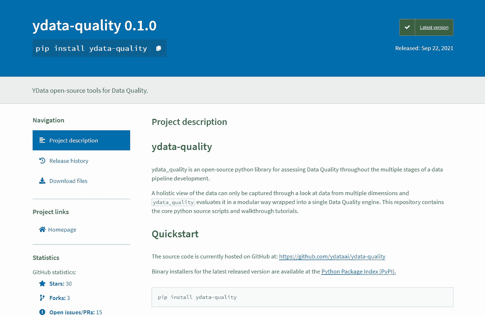

# 识别和解决数据质量问题的数据科学家指南

> 原文：<https://towardsdatascience.com/a-data-scientists-guide-to-identify-and-resolve-data-quality-issues-1fae1fc09c8d?source=collection_archive---------17----------------------->

## 为你的下一个项目尽早这样做将会节省你几周的努力和压力


米凯尔·布隆维斯特摄于[佩克斯](https://www.pexels.com/photo/simple-workspace-at-home-6476587/?utm_content=attributionCopyText&utm_medium=referral&utm_source=pexels)

如果你在人工智能行业工作过，接触过真实世界的数据，你就会理解这种痛苦。无论数据收集过程多么简化，我们将要建模的数据总是杂乱无章的。

根据 [IBM](https://www.ibm.com/cloud/blog/ibm-data-catalog-data-scientists-productivity) 的说法， [80/20 法则](https://en.wikipedia.org/wiki/Pareto_principle)同样适用于数据科学。数据科学家 80%的宝贵时间都花在简单地查找、清理和组织数据上，只有 20%的时间真正执行分析。

争论数据并不好玩。我知道这是至关重要的，“垃圾输入垃圾输出”和所有这些，但是我就是不喜欢清理空白、修复正则表达式和解决数据中不可预见的问题。

根据[谷歌研究](http://compounding events causing negative, downstream effects from data issues):“每个人都想做模型工作，但不是数据工作”——我被指控有罪。此外，本文还介绍了一种称为数据级联的现象，这种现象是由潜在数据问题引发的复合事件，会造成不利的下游影响。

实际上，到目前为止，问题有三个方面:

*   大多数数据科学家不喜欢清理和争论数据
*   只有 20%的时间可用于进行有意义的分析
*   数据质量问题，如果不及早处理，将级联和影响下游

这些问题的唯一解决方案是确保数据清理简单、快速、自然。我们需要工具和技术来帮助我们这些数据科学家快速识别和解决数据质量问题，以利用我们在分析和人工智能(我们真正喜欢的工作)方面的宝贵时间。

在本文中，我将展示一个这样的[开源工具](https://github.com/ydataai/ydata-quality)，它有助于根据预期的优先级提前识别数据质量问题。这个工具的存在让我如释重负，今天我迫不及待地想和你分享它。

# ydata-拯救质量



作者截图

[ydata-quality](https://github.com/ydataai/ydata-quality) 是一个开源的 python 库，用于在数据管道开发的多个阶段评估数据质量。该库[直观，易于使用，](/how-can-i-measure-data-quality-9d31acfeb969)，你可以直接将其集成到你的机器学习工作流程中。

对我个人来说，这个库很酷的一点是可以对数据质量问题进行基于优先级的排序(稍后将详细介绍)，当我们的时间有限，并且我们希望首先解决影响较大的数据质量问题时，这很有帮助。

让我向您展示如何使用混乱数据的真实示例。在本例中，我们将:

1.  加载混乱的数据集
2.  分析数据质量问题
3.  深入挖掘提出的警告
4.  应用策略来减轻它们
5.  检查半清理数据的最终质量分析

在安装任何库之前，最好使用 [venv](https://docs.python.org/3/library/venv.html) 或 [conda](https://conda.io/projects/conda/en/latest/user-guide/tasks/manage-environments.html#creating-an-environment-with-commands) 为项目创建一个虚拟环境。完成后，在终端上键入以下命令来安装库:

```
pip install ydata-quality
```

现在您的环境已经准备好了，让我们继续看例子。

# 一个真实世界的混乱例子


暂时忍受一下混乱。(Pixabay 的照片来自 Pexels)

在这个例子中，我们将使用[转换后的人口普查数据集](https://github.com/ydataai/ydata-quality/blob/master/datasets/transformed/census_10k.csv)，您可以从这个 [GitHub 存储库中下载。](https://github.com/ydataai/ydata-quality/blob/master/datasets/transformed/census_10k.csv)你可以在[这本 Jupyter 笔记本中找到本教程使用的所有代码。](https://github.com/ydataai/ydata-quality/blob/master/tutorials/main.ipynb)我建议您要么克隆存储库，要么下载笔记本来跟随示例。

## 步骤 1:加载数据集

作为第一步，我们将加载数据集和必要的库。请注意，该包有多个模块(偏差和公平性、数据预期、数据关系、漂移分析、错误数据、标记和缺失)用于单独的数据质量问题，但我们可以从`DataQuality`引擎开始，它将所有单独的引擎包装到一个类中。

```
from ydata_quality import DataQuality
import pandas as pddf = pd.read_csv('../datasets/transformed/census_10k.csv')
```

## 第二步:分析质量问题

这应该是一个漫长的过程，但是`DataQuality`引擎在抽象所有细节方面做得非常好。只需创建主类并调用`evaluate()`方法。

```
# create the main class that holds all quality modules
dq = DataQuality(df=df)# run the tests
results = dq.evaluate()
```

我们将收到一份关于数据质量问题的报告。

让我们仔细分析一下这份报告:

*   **警告:**这些包含数据质量分析期间检测到的问题的详细信息。
*   **优先级:**对于每个检测到的问题，都会根据问题的预期影响分配一个优先级(较低的值表示高优先级)。
*   **模块:**每个检测到的问题都与模块执行的数据质量测试相关联(例如:数据关系、重复等)。)

综上所述，我们注意到已经确定了五个警告，其中一个是高优先级问题。“Duplicates”模块检测到，我们有一个完全重复的列，需要修复。为了更深入地研究这个问题，我们使用了`get_warnings()`方法。

只需输入以下内容:

```
dq.get_warnings(test="Duplicate Columns")
```

我们可以看到针对我们想要解决的问题的详细输出:

```
[QualityWarning(category='Duplicates', test='Duplicate Columns', description='Found 1 columns with exactly the same feature values as other columns.', priority=<Priority.P1: 1>, data={'workclass': ['workclass2']})]
```

根据评估，我们可以看到列`workclass`和`workclass2`完全是重复的，这会对下游产生严重的后果。

## 步骤 3:使用特定模块分析质量问题

全面了解数据质量需要多个视角，因此需要八个独立的模块。尽管它们被封装在`DataQuality`类中，但有些模块不会运行，除非我们提供特定的参数。

例如，DataQuality 类没有执行偏倚和公平性质量测试，因为我们没有指定敏感特性。但是这个库的美妙之处在于，我们可以把它当作一个独立的测试来执行。

让我们通过执行偏倚和公平性测试来更好地理解它。

```
from ydata_quality.bias_fairness import BiasFairness#create the main class that holds all quality modules
bf = BiasFairness(df=df, sensitive_features=['race', 'sex'], label='income')# run the tests
bf_results = bf.evaluate()
```

当我们运行上面的代码时，我们生成了另一个特定于所选模块的类似报告。

从报告中，我们了解到，我们可能有一个代理特征泄漏了有关敏感属性的信息，并且敏感属性的特征值严重不足。为了研究第一个警告，我们可以使用针对特定测试的`get_warnings()`方法过滤来获取更多细节。

```
bf.get_warnings(test='Proxy Identification')
```

我们可以看到针对我们想要解决的问题的详细输出:

```
[QualityWarning(category='Bias&Fairness', test='Proxy Identification', description='Found 1 feature pairs of correlation to sensitive attributes with values higher than defined threshold (0.5).', priority=<Priority.P2: 2>, data=features
 relationship_sex    0.650656
 Name: association, dtype: float64)]
```

基于详细的警告，我们检查了列`relationship`和`sex`，注意到一些关系状态(例如，丈夫、妻子)是特定于性别的，因此影响了相关性。我们可以将这些分类值改为中性的(例如，已婚)。

## 步骤 4:解决确定的问题

让我们实际一点。我们永远不可能拥有 100%干净的数据。这一切都是为了在有限的时间内解决最具影响力的问题。作为一名数据科学家，这是一个需要根据您的限制做出的决定。

对于这个例子，让我们的目标是没有高优先级(P1)的问题，并解决至少一个偏见和公平的警告。基于警告的简单数据清理函数如下所示:

我们删除了重复的列`work_class2`并替换了`relationship`的值，使其更加通用和中性。

如果你想做进一步的数据清理，请随意。如果您选择进一步发展，我很想看看数据清理是什么样子的。请记住，您是数据科学家，决定权始终在您手中。

## 步骤 5:运行最终质量检查

您可以跳过这一步，但是当我通过另一个最终检查来检查我处理的数据时，我会感到安心。我强烈建议您也这样做，这样您就可以在完成数据清理转换后了解数据的状态。

您可以简单地首先调用质量引擎和`evaluate()`方法来再次检索样本报告。下面是我们清理完数据后，`DataQuality`引擎和`BiasFairness`引擎的报告。

我们可以从上面的两个报告中推断出，我们的高优先级问题已经得到解决，而另一个较低优先级的问题也按照我们的目标得到了解决。

# 总结想法


数据质量的存在让我如释重负。(图片由 [Freepik](http://www.freepik.com) 上的 [Cookie_studio](https://www.freepik.com/photos/fashion) 拍摄)

听着，仅仅因为我们讨厌清理数据并不意味着我们停止这样做。这是[机器学习工作流](/the-machine-learning-workflow-explained-557abf882079)不可或缺的一个阶段，解决方案是将 [ydata-quality](https://github.com/ydataai/ydata-quality) 等有价值的工具和库集成到我们的工作流中。

在本文中，我们学习了如何使用开源包来评估数据集的数据质量，既可以使用`DataQuality`主引擎，也可以通过特定的模块引擎(例如`BiasFairness`)。此外，我们看到了`QualityWarning`如何提供一个高层次的严重性度量，并为我们指出引发警告的原始数据。

然后，我们基于数据质量问题定义了一个数据清理管道来转换杂乱的数据，并观察它如何解决我们想要的警告。

该库由位于 [YData](http://ydata.ai) 的团队开发，其使命是提高人工智能行业的数据质量。还有问题吗？ [**加入友好的 slack 社区**](http://slack.ydata.ai/) 直接向开发团队提问(你也可以在那里找到我！)

我们一定能一起改进这个库，你的反馈意味着这个库能解决你未来的大部分紧迫问题。我迫不及待地想看到你使用[库](https://github.com/ydataai/ydata-quality)，并在[社区](http://slack.ydata.ai/)中听到你的反馈。