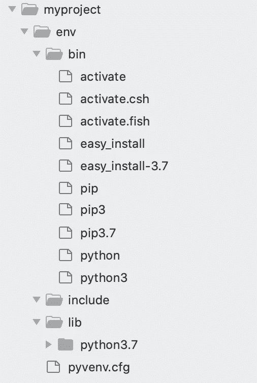
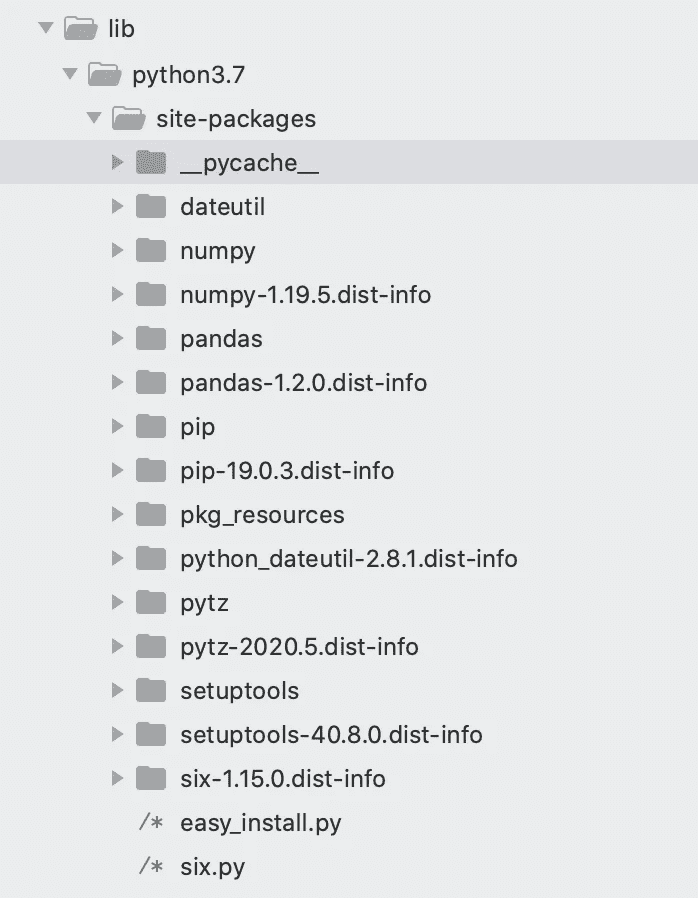
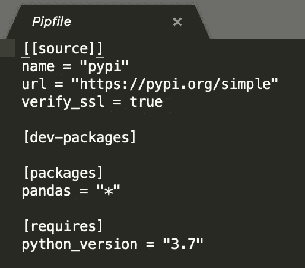

# Python 虚拟环境数据科学家指南

> 原文：<https://towardsdatascience.com/a-data-scientists-guide-to-python-virtual-environments-858841922f14?source=collection_archive---------8----------------------->

## 它们是什么，有哪些选择，我们为什么需要它们？


路易斯·恩古吉在 [Unsplash](https://unsplash.com/s/photos/code?utm_source=unsplash&utm_medium=referral&utm_content=creditCopyText) 上拍摄的照片

Python 编程语言有许多不同的版本。类似地，所有的 Python 库也有多个版本，使用特定版本的 Python，并且大多数依赖于其他包来运行，这被称为一组**依赖**。

您承担的每个数据科学项目都可能需要自己独特的一套第三方 Python 包**。虚拟环境充当自包含环境，封装了 Python 版本和项目的所有依赖项。创建新的虚拟环境是开始任何新的数据科学项目时通常采取的第一步。**

> **创建新的虚拟环境是开始任何新的数据科学项目时通常采取的第一步。**

**这些环境不仅有助于在您自己的机器上保持项目的依赖关系是有组织的和自包含的。它们还使得人们之间共享项目变得容易。虚拟环境保留关于所有这些项目依赖关系的信息。当其他人将您的项目下载到他们的本地机器上时，他们可以使用此信息来重新创建您的项目所依赖的确切环境。**

# **入门指南**

**谈到 Python 的虚拟环境，有几种选择。每种工具都有自己的优缺点。作为一个数据科学家，很可能最终会找到自己的个人首选(我的是 pipenv)。然而，在你的职业生涯中，很可能你会不时地用到几个，这取决于你工作的公司或团队。因此，了解可用的核心工具是很有用的。**

**在本文中，我将介绍创建 Python 虚拟环境的三个主要工具，并简要介绍如何使用它们。**

**按照本教程，你需要确保你已经安装了 Python 和 pip。为此，请从命令行运行以下命令。**

```
python --version
pip --version
```

**如果你还没有安装 Python，这个[指南](https://docs.python-guide.org/starting/installation/)给出了我发现的最好的一套说明。**

**本文中给出的所有代码示例都旨在从命令行运行。**

# **Venv**

**Venv 是一个创建轻量级虚拟环境的模块，作为 Python 编程语言的标准。如果你已经安装了 Python 3，那么你不需要安装任何额外的东西来使用这个工具。**

**为了创建一个新的环境，我们首先需要创建一个目录来存储您的项目。在您的终端中运行以下命令。**

```
mkdir myproject && cd myproject
```

**接下来，我们在该目录中创建虚拟环境。您可以将单词`env`替换为虚拟环境的另一个名称。**

```
python3 -m venv env
```

**默认情况下，这将使用最新版本的 Python 创建一个虚拟环境。在撰写本文时，这是 3.7。然而，如果您需要一个特定的 Python 版本，您可以指定它，如下所示。**

```
python3.5 -m venv env
```

**该工具将创建一个名为 env 的新目录，其结构类似于下图所示。**

****

**作者图片**

**下一步是激活环境。**

```
source env/bin/activate
```

**现在，您将在终端中看到以下内容。**

****

**作者图片**

**要在完成项目工作后停用环境，只需运行。**

```
deactivate
```

**可以使用 pip 将新的包安装到激活的虚拟环境中。下面的代码将熊猫安装到环境中。**

```
pip install pandas
```

**我们可以看到 pandas 包及其依赖项已经安装到虚拟环境的`site-packages`文件夹中。**

****

**作者图片**

**为了使虚拟环境可以被其他人复制，我们需要一种方法来记录所有的第三方包和它们所使用的版本。用 venv 做到这一点的最简单的方法是在项目根目录下创建一个新的需求文件。**

**为此，我们运行以下代码。**

```
pip freeze > requirements.txt
```

**`pip freeze`命令列出了环境中安装的所有第三方包和版本。然后将输出写入一个名为 requirements.txt 的新文件中。**

**这个需求文件现在可以被其他人用来重新创建项目需要运行的确切环境。另一个用户可以下载项目，使用 venv 创建他们自己的环境，并使用需求文件安装所有需要的包。**

# **Pipenv**

**Pipenv 是另一个创建 Python 虚拟环境的工具，它提供了一个更灵活、更丰富和更安全的方法。Pipenv 通过一个叫做 pipfile 的东西自动管理项目依赖关系。pipenv 无需手动创建和维护 requirements.txt 文件，而是在创建虚拟环境时创建 pipfile，并在安装或升级第三方库时更新它。**

**此外，当创建新的 pipenv 虚拟环境时，它还会生成一个名为 pipfile.lock 的文件。如前所述，许多第三方库依赖于其他库的特定版本来运行。这些被称为**相互依赖**。pipfile.lock 文件记录了这些相互依赖关系，并确保某些包不会自动升级，否则会破坏项目。**

**如果您使用的是 macOS，安装 pipenv 的最佳方式是使用 Homebrew，因为这会将 pipenv 及其所有依赖项安装到一个隔离的虚拟环境中，因此它不会干扰您的 Python 安装。或者，也可以通过 pip 安装。**

```
brew install pipenv#orpip install pipenv
```

****T5【pipenv】工作流 ****

**要开始使用 pipenv，首先要创建或克隆一个项目目录。**

```
mkdir mypipenvproject && cd mypipenvproject
```

**接下来，我们运行以下命令来安装 pipenv 环境。pipenv 环境将与项目目录同名。**

```
pipenv install 
```

**如果您想要创建一个使用特定 Python 版本的环境，您可以使用此命令。**

```
pipenv install --python 3.6
```

**这将安装环境并创建一个 pipfile 和 pipfile.lock 文件。**

**要激活环境，只需键入以下命令。**

```
pipenv shell
```

**要安装一个新的第三方软件包，我们使用以下方法。**

```
pipenv install package-name#e.g.pipenv install pandas
```

**如果我们现在打开 pipfile，我们将看到添加了以下内容。如果我们安装了 pandas 的特定版本，该版本将包含在该文件中。**

****

**作者图片**

**要退出 pipenv 虚拟环境，只需键入`exit`。**

*****分享你的项目*****

**使用 pipenv，当另一个用户想要在他们的本地机器上重新创建您的项目时，他们可以简单地克隆您的项目，并从项目主目录运行以下命令。**

```
pipenv install
pipenv shell
```

**这将在 pipfile 中安装所有依赖项，并激活虚拟环境。**

# **康达**

**Conda 是 Python 的开源包和环境管理器。这是科学界安装软件包和管理环境的一个流行选择。因此，它值得包含在一篇关于数据科学虚拟环境的文章中。**

**如果你还没有安装 Conda，你可以通过运行`conda -V`来检查，你可以在[链接](https://docs.conda.io/projects/conda/en/latest/user-guide/install/)找到详细的安装说明。**

**要使用 conda 创建一个虚拟环境，只需从您的项目主目录运行以下命令。**

```
conda create -n myenvname python**=3.7**
```

**要激活环境，我们可以运行以下命令。**

```
conda activate myenvname
```

**安装软件包。**

```
conda install -n myenvname package#e.g.conda install -n myenvname pandas
```

**要停用环境，请运行。**

```
conda deactivate
```

**与 pipenv 不同，conda 不会自动创建文件来跟踪项目需求。如果你想和别人分享你的 conda 环境，你需要创建一个。您可以通过运行以下命令来实现这一点。**

```
conda list --explicit > spec-file.txt
```

**这将创建 conda 所称的规格文件，它非常类似于 venv 中的需求文件。**

**通过运行以下命令，该文件可用于重新创建环境。**

```
conda create --name mynewenvname --file spec-file.txt
```

**虚拟环境有助于数据科学家组织项目、保持独立性并实现与其他人的协作。本文涵盖了 Python 虚拟环境的三个最流行的选择。值得一试，看看哪一个是你的首选。**

**有关创建可再现数据科学项目的最佳实践的更多信息，请参见我之前的文章。**

**[](/a-recipe-for-organising-data-science-projects-50a1cc539c69) [## 组织数据科学项目的秘诀

### 了解如何创建结构化和可重复的数据科学项目

towardsdatascience.com](/a-recipe-for-organising-data-science-projects-50a1cc539c69) 

感谢阅读！

我每月都会发一份简讯，如果你想加入，请点击此链接注册。期待成为您学习旅程的一部分！**