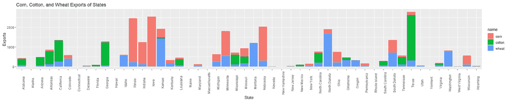

# 在 ggplot2 中使用一些高级可视化的数据讲述项目

> 原文：<https://towardsdatascience.com/a-data-storytelling-project-with-some-advanced-visualization-in-ggplot2-fb60dfc56dde?source=collection_archive---------16----------------------->


由 [Ethan Hu](https://unsplash.com/@ethanhjy?utm_source=medium&utm_medium=referral) 在 [Unsplash](https://unsplash.com?utm_source=medium&utm_medium=referral) 上拍摄的照片

## ggplot2 中一些实用的数据准备和有用的绘图技巧

我认为，数据可视化是与人交流数据的最有效方式。因此，对于每个数据科学家或分析师来说，学习可视化非常重要。本文将分享一些 R 中的可视化。我将使用 R 中的 ggplot2 库，这是一个丰富的库。ggplot2 库中包含了许多可视化技术。我自己也在尽可能多的学习。

几周前，我不得不使用这个公共数据集，并使用一些可视化技术进行总结。但是为了准备用于可视化的数据，也使用了一些数据分析技术。

这些是这个项目所必需的库:

```
library(ggplot2)
library(psych)
library(dplyr)
library(tidyr)
library(ggpubr)
library(usmap)
```

在这里，我首先导入数据集。该数据集显示了美国各州的农产品出口数据。

```
us_ag = read.csv("[https://raw.githubusercontent.com/plotly/datasets/master/2011_us_ag_exports.csv](https://raw.githubusercontent.com/plotly/datasets/master/2011_us_ag_exports.csv)")
```

以下是该数据集的列:

```
names(us_ag)
```

输出:

```
[1] "code"   "state"    "category"  "total.exports" "beef"         
 [6] "pork"  "poultry"  "dairy"  "fruits.fresh"  "fruits.proc"  
[11] "total.fruits" "veggies.fresh" "veggies.proc" "total.veggies" "corn"         
[16] "wheat" "cotton"
```

让我们开始真正的乐趣吧！

我认为看看农产品出口之间是否有关联会很有趣。我将制作一个仅包含农产品的较小数据集，并制作一个相关图。

```
corr_data = us_ag[, c("pork", "beef", "poultry", "dairy", "total.fruits", 
"total.veggies", "corn", "wheat", "cotton")]
```

使用此 corr_data 数据集绘制相关图:

```
corPlot(corr_data, cex = 0.8, main="Corrlation Between Variables",
        las = 2)
```


作者图片

这里显示了一些有趣的相关性。出口大量玉米的州也出口大量猪肉。相关系数为 0.77。家禽和棉花也显示出 0.61 的显著相关性。

> 下一个图将是一个发散条形图，显示该州的总出口是低于平均水平还是高于平均水平。

在此之前，需要做一些数据准备。首先，我需要标准化总出口列。

```
us_ag$exports_z = round((us_ag$total.exports - mean(us_ag$total.exports))/sd(us_ag$total.exports), 2)
```

现在，我将这些数据标记为“低于平均水平”和“高于平均水平”。如果 exports_z 值小于零，它将被视为低于平均值，否则将被视为高于平均值。然后，我们将根据 exports_z 值对数据集进行排序。

```
us_ag$export_level = ifelse(us_ag$exports_z < 0, "below", "above")
us_ag_sorted = us_ag[order(us_ag$exports_z),]us_ag_sorted$state = factor(us_ag_sorted$state, levels=us_ag_sorted$state)
```

为发散图准备数据。下面是制作发散图的代码块:

```
{r fig.height=11, fig.width=6}
ggplot(us_ag_sorted, aes(x = state, y = exports_z, label=exports_z)) + 
  geom_point(stat = 'identity', aes(col=export_level), size=7) + 
  scale_color_manual(name="Exports",
                     labels = c("Above Average", "Below Average"),
                     values = c("above"="#00ba38", "below"="#f8766d"))+
  geom_text(color="white", size = 2) +
  labs(title="Diverging Bar Plot Showing Exports Level",
       subtitle = "Normalized total export",
       x = "Normalized Total Exports",
       y = "State") +
  ylim(-2, 5)+
  coord_flip()
```

剧情是这样的:


作者图片

如需详细信息，我还想看看每个州的每个产品的出口。产品这么多。如果我想把它们都放在同一个情节中，这不是很有用。所以，我把它们分成了几个情节。最终，我会把它们结合起来。

第一个地块将只包括牛肉、猪肉和家禽。代码如下:

```
{r fig.height=4, fig.width=12}
us_ag %>% select(state, beef, pork, poultry) %>%
  pivot_longer(., cols = c(beef, pork, poultry),
               values_to="Val") %>%
  ggplot(aes(x = state, y = Val, color=name, alpha = 0.7))+
  geom_point(size = 4) + 
  scale_color_manual(values = c("beef" = "black", "pork" = "red", "poultry" = "green")) +
  geom_line(aes(group=name)) + 
  theme(axis.text.x = element_text(angle = 90)) + 
  guides(alpha=FALSE)+labs(x = "State",
                           y = "Exports",
                           title = "Beef, Pork, and Poultry Exports of States"
                           )
```

输出图:


作者图片

如你所见，爱荷华州是最大的猪肉出口地，德克萨斯州是最大的牛肉出口地。

乳制品、全部水果和全部蔬菜包含在下一个地块中:

```
{r fig.height= 4, fig.width=14}
us_ag %>% select(state, total.fruits, total.veggies, dairy) %>%
  pivot_longer(., cols = c(total.fruits, total.veggies, dairy),
               values_to="Val") %>%
  ggplot(aes(state, Val, fill = name)) + geom_col(width = 0.9)+
  theme(axis.text.x = element_text(angle = 90))
```

剧情是这样的:


作者图片

加州出口的水果、蔬菜和奶制品数量最多，远远超过其他任何一个州。

最后，玉米、棉花和小麦:

```
{r fig.height= 4, fig.width=14}
us_ag %>% select(state, corn, cotton, wheat) %>%
  pivot_longer(., cols = c(corn, cotton, wheat),
               values_to="Val") %>%
  ggplot(aes(state, Val, fill = name)) + geom_col(width = 0.9)+
  theme(axis.text.x = element_text(angle = 90))+
  labs(x = "State",
       y = "Exports",
       title = "Corn, Cotton, and Wheat Exports of States")
```

输出图在这里:



作者图片

得克萨斯是最大的棉花出口国。当我住在德克萨斯州的时候，我参观了很多棉花田，爱荷华州是最大的玉米出口地。其他几个州也出口大量玉米。如图所示。

如果我把这三个图放在一起，在演示中会看起来很好，并且会覆盖一页。下面是将它们结合在一起的代码:

```
{r fig.height=10, fig.width=14}
p1 = us_ag %>% select(state, beef, pork, poultry) %>%
  pivot_longer(., cols = c(beef, pork, poultry),
               values_to="Val") %>%
  ggplot(aes(x = state, y = Val, color=name, alpha = 0.7))+
  geom_point(size = 4) + 
  scale_color_manual(values = c("beef" = "black", "pork" = "red", "poultry" = "green")) +
  geom_line(aes(group=name)) + 
  theme(axis.text.x = element_text(angle = 90)) + 
  guides(alpha="none")+
  labs(x = "State",
       y = "Exports",
       title = "Beef, Pork, and Poultry Exports of States")p2 = us_ag %>% select(state, total.fruits, total.veggies, dairy) %>%
  pivot_longer(., cols = c(total.fruits, total.veggies, dairy),
               values_to="Val") %>%
  ggplot(aes(state, Val, fill = name)) + geom_col(width = 0.9)+
  theme(axis.text.x = element_text(angle = 90))+
  labs(x = "State",
       y = "Exports",
       title = "Dairy, Fruits, and Vegetables Exports of States")p3 = us_ag %>% select(state, corn, cotton, wheat) %>%
  pivot_longer(., cols = c(corn, cotton, wheat),
               values_to="Val") %>%
  ggplot(aes(state, Val, fill = name)) + geom_col(width = 0.9)+
  theme(axis.text.x = element_text(angle = 90))+
  labs(x = "State",
       y = "Exports",
       title = "Corn, Cotton, and Wheat Exports of States")ggarrange(p1, p2, p3, nrow=3)
```

下面是输出图:


作者图片

对于下一个图，我决定在美国地图上绘制最好的出口产品。为此，我需要经纬度数据。该数据集本身不包括任何后期数据。所以，我简单地从 Kaggle 下载了一些经纬度数据。你可以在这里找到最近的数据。请放心下载使用。

首先，我将把这个纬度较长的数据与主数据集合并:

```
latlong = read.csv("statelatlong.csv")
latlong = rename(latlong, c("code" = "State"))
latlong = subset(latlong, select=-c(City))
latlong1 = latlong[, c(3, 2, 1)]
us_ag_ll = merge(latlong, us_ag, by = "code")
```

这个 us_ag_ll 数据集包括所有的列和经度数据。

我们需要找出哪个产品是每个州出口最多的产品。为此，我将创建一个仅包含所有农产品的数据集:

```
df = us_ag[, c("beef", "pork", "poultry", "dairy", "total.fruits", "total.veggies", "corn", "wheat", "cotton")]
```

下面的代码块找出最大值和具有最大导出值的产品的名称:

```
df$max_val = apply(X=df, MARGIN = 1, FUN = max)
df$maxExportItem= colnames(df)[apply(df,1,which.max)]
```

这个 maxExportItem 列需要包含在主数据集 us_ag_ll 中。

```
us_ag_ll$max_export_item = df$maxExportItem
us_ag_ll$max_val = df$max_val
```

我们需要转换纬度和经度数据，以便能够在地图中使用它们。

```
transformed = usmap_transform(us_ag_ll[, c("Longitude", "Latitude")])
```

如果需要，请检查转换后的数据集。

> “经度”和“纬度”列已被转换，在转换后的数据集中创建了两个名为“经度. 1”和“纬度. 1”的列。

我们将使用“经度. 1”和“纬度. 1”来绘图。

我一直认为在地图上放一些值是个好主意。我会把每个州的最大出口项目和出口金额。所以，我们应该准备好数据。

```
us_ag_ll$Max_Export_Val = paste(us_ag_ll$max_export_item, us_ag_ll$max_val, sep="-")
```

所有的数据准备都做好了！现在让我们开始策划吧！颜色梯度将代表总出口。地图中的值将显示每个州的最大出口项目和最大出口项目的出口值。

```
{r fig.height=11}
plot_usmap(data = us_ag_ll, values = "total.exports", color = "blue")+
  geom_text(data=us_ag_ll, aes(x = transformed$Longitude.1,
                                y = transformed$Latitude.1, 
                                label = Max_Export_Val), size=3.5, color = "black")+
  scale_fill_continuous(low = "white", high = "blue", name = "Total Exports", label = scales::comma) + 
  labs(title = "Total Exports in Color in Each State", subtitle = "Top Exports Items and Export Values of Each State")+
  theme(legend.position = "bottom", plot.title = element_text(size = 20, face = "bold"),
        plot.subtitle = element_text(size = 18))
```

输出:


作者图片

地图中值的位置可以通过一些更好的经纬度数据来改进。我用我在卡格尔找到的东西。

这就是我这篇文章想分享的全部内容！

## 结论:

有许多不同的方法可以处理数据集并将其可视化。如果你也像我一样是一个初学者，并试图提升你的技能，请尝试你自己的想法，如果你能以自己的方式改善这些情节，请随时通过评论部分的 GitHub 链接分享你的代码。

欢迎在推特上关注我，喜欢我的 T2 脸书页面。