# 区块链人生活中的一天

> 原文：<https://towardsdatascience.com/a-day-in-the-life-of-a-blockchain-eb352980ee16?source=collection_archive---------40----------------------->

## …从数据科学家的角度来看


由 [Zineb Fafa](https://unsplash.com/@zinebfafa?utm_source=medium&utm_medium=referral) 在 [Unsplash](https://unsplash.com?utm_source=medium&utm_medium=referral) 拍摄的照片

正如我在[之前的一篇文章](/data-science-for-blockchain-understanding-the-current-landscape-c136154c367e)中所讨论的那样，区块链产生了大量高质量的数据，数据科学家可以用这些数据来回答一系列具有学术和实践重要性的问题。特别令人感兴趣的是支持高吞吐量[智能契约](https://en.wikipedia.org/wiki/Smart_contract)的区块链，它支持可扩展的[分散式应用](https://blog.chain.link/44-ways-to-enhance-your-smart-contract-with-chainlink/) (dApps)的开发和部署。

这样的区块链平台之一是 [TRON](https://tron.network/) 。它在游戏和金融相关应用的开发者中特别受欢迎。在这里，我将使用从 TRON 收集的事务数据来说明它们可以揭示的一些模式。本文是面向希望了解更多有关区块链数据及其分析方法的数据科学家的技术教程。所有的例子都是用 R 实现的。我们假设读者对区块链技术有很高的理解，并且熟悉 R 及其`[tidyverse](https://www.tidyverse.org/)`工具。这篇文章的代码可以在 [Github](https://github.com/next-game-solutions/day-on-tron) 上找到。为了节省空间，我省略了用于生成大多数图表的代码。

***免责声明*** *:本文任何部分均不构成理财建议。使用或依赖此处提供的材料完全由您自行承担风险和判断。我既不附属于也不支持此处提到的任何公司。提及这些公司及其产品仅用于说明目的。*

# 本研究中使用的数据

与其他现象一样，人们可以在不同的时间尺度上研究区块链交易。涵盖更长时期的粒度数据往往描绘出一幅更加微妙的画面。然而，收集大量链上数据会产生巨大的技术开销(查询时间、存储和计算资源等)。).为简单起见，我们将使用覆盖一天数据的数据集，即 2021 年 7 月 2 日。没有理由选择这个特定的日期，这只是一个例子。

数据已通过函数`[get_block_info()](https://levelup.gitconnected.com/how-to-query-blocks-on-the-tron-blockchain-2ee3c46156ec)`从 R 包`[tronr](https://levelup.gitconnected.com/introducing-tronr-an-r-package-to-explore-the-tron-blockchain-f0413f38b753)`中收集。该函数获取感兴趣的块的编号，并以嵌套 tible 的形式返回数据。2021 年 7 月 2 日在 TRON 区块链上产生了 28，730 个区块，其数量从 31，570，498 到 31，599，227 不等。这些区块共包含 7，819，547 项交易。交易 ID ( `tx_id`)、执行给定交易的系统智能合约调用的类型(`contract_type`)以及该交易的发起者(`from_address`)和接收者(`to_address`)的账户地址存储在由`get_block_info()`返回的 tibble 的列表列`tx`中。该数据集中第一个数据块的数据如下所示:

```
require(dplyr)
require(tidyr)
require(tronr)
#> R toolbox to explore the TRON blockchain
#> Developed by Next Game Solutions (http://nextgamesolutions.com)block_data <- get_block_info(
    latest = FALSE, block_number = "31570498"
)glimpse(block_data)
#> Rows: 1
#> Columns: 11
#> $ request_time    <dttm> 2021-07-26 20:25:24
#> $ block_number    <chr> "31570498"
#> $ timestamp       <dttm> 2021-07-02
#> $ hash            <chr> "0000000001e1ba4267746fce622a90ba6a51f~
#> $ parent_hash     <chr> "0000000001e1ba4135f66566c15b648563d4b6~
#> $ tx_trie_root    <chr> "254pKSrGpmLT3y7xdFAaZfXR93ZrsKgRJoxZH~
#> $ confirmed       <lgl> TRUE
#> $ size            <int> 61119
#> $ witness_address <chr> "TLyqzVGLV1srkB7dToTAEqgDSfPtXRJZYH"
#> $ tx_count        <int> 200
#> $ tx              <list> [<tbl_df[200 x 4]>]block_data %>% select(tx) %>% unnest(cols = tx)
#> # A tibble: 200 x 4
#>    tx_id           contract_type   from_address    to_address    
#>    <chr>           <chr>           <chr>           <chr>         
#>  1 59ebe232ea5032~ VoteWitnessCon~ TXi4QTAWYGhF4Z~ TTcYhypP8m4ph~
#>  2 aff3e7fb7f277b~ TransferContra~ TRYavwpJnwhr9T~ TQMVcC2adh61t~
#>  3 8661b623b377a2~ TriggerSmartCo~ TRpzBAQHCVKHBW~ TBRs8xwajQVbD~
#>  4 ed437306b65880~ TransferAssetC~ TXAVuHVM1pBnZA~ TYBtHbJiQ2bDa~
#>  5 5a94ce1c7b0390~ TransferAssetC~ TAdqErGeD2CgTp~ TSnjNCyK3r58w~
#>  6 360999180f84eb~ TransferAssetC~ TAFpxz9pKyGDwr~ TPRiphADhwe1g~
#>  7 42a97206891117~ TransferAssetC~ TJABpJLWNXJ2xj~ TX8BumaUQ1bpR~
#>  8 baa45f5a4a18aa~ AccountCreateC~ TEoDHGSTu2Kh97~ TFLnMpKhGBUUo~
#>  9 614032934ce86c~ TransferContra~ TSWHGYtBwzpFXL~ TBy4dMk6nWhWV~
#> 10 01de787975ff49~ TransferContra~ TVU2khdDkUu67F~ TSEnu5xcNMyNi~
#> # ... with 190 more rows
```

整个数据集可以下载到 R 中，如下所示(这个 [RDS 文件](https://www.rdocumentation.org/packages/base/versions/3.6.2/topics/readRDS)的大小超过 600 Mb，所以请耐心等待——这可能需要一些时间，取决于您的互联网连接的带宽):

```
dat <- readRDS(url("https://chilp.it/eee138c"))dat %>% dim()
#> [1] 28730    11names(dat)
#>  [1] "request_time"    "block_number"    "timestamp"      
#>  [4] "hash"            "parent_hash"     "tx_trie_root"   
#>  [7] "confirmed"       "size"            "witness_address"
#> [10] "tx_count"        "tx"
```

# 每 3 秒钟就有一个新的区块

块类似于分类账中的页面，这些逻辑单元用于分组和记录区块链在一定时期内发生的交易。多亏了[授权利害关系证明](https://academy.binance.com/en/articles/delegated-proof-of-stake-explained)共识机制，创区块链上的区块生成速度非常快——每 3 秒钟一次。然而，每 6 小时有 4 个[维护周期](https://tronprotocol.github.io/documentation-en/introduction/dpos/)，每个周期耗时 6 秒。因此，在我们的示例中，块之间的平均时间刚刚超过 3 秒:

```
dat$timestamp %>% diff() %>% mean()
#> Time difference of 3.00731 secs
```

在 TRON 中，有 27 个“[见证人](https://tronprotocol.github.io/documentation-en/introduction/dpos/#definition)”，也称为“超级代表”(SR)，即可以创建和确认新块的网络节点:

```
dat$witness_address %>% unique() %>% length()
#> [1] 27dat$witness_address %>% unique() %>% head()
#> [1] "TLyqzVGLV1srkB7dToTAEqgDSfPtXRJZYH"
#> [2] "TJBtdYunmQkeK5KninwgcjuK1RPDhyUWBZ"
#> [3] "TTjacDH5PL8hpWirqU7HQQNZDyF723PuCg"
#> [4] "TWkpg1ZQ4fTv7sj41zBUTMo1kuJEUWTere"
#> [5] "TCEo1hMAdaJrQmvnGTCcGT2LqrGU4N7Jqf"
#> [6] "TAAdjpNYfeJ2edcETNpad1QpQWJfyBdB9V"
```

在大多数情况下，可以在 [TRONScan 网站](https://tronscan.org/)上找到证人身份或其假名。例如，上面列出的六个地址属于以下实体:

*   `TLyqzVGLV1srkB7dToTAEqgDSfPtXRJZYH`:币安跑马圈地
*   `TJBtdYunmQkeK5KninwgcjuK1RPDhyUWBZ`:京东投资
*   `TTjacDH5PL8hpWirqU7HQQNZDyF723PuCg`:新赌注
*   `TWkpg1ZQ4fTv7sj41zBUTMo1kuJEUWTere` : TRONLink
*   `TCEo1hMAdaJrQmvnGTCcGT2LqrGU4N7Jqf`:特龙斯坎
*   `TAAdjpNYfeJ2edcETNpad1QpQWJfyBdB9V`:蚂蚁投资集团

证人每天生成的区块总数变化不大，从 1050 到 1067，平均为 1064:

```
dat$witness_address %>% table() %>% range()
#> [1] 1050 1067dat$witness_address %>% table() %>% mean()
#> [1] 1064.074
```

# 每个区块平均包含 274 个交易

每个块的事务数量有一个稍微不对称的分布，有一个长的右尾巴(图 1)。平均而言，每个块包含 274 个事务。然而，一些区块有多达 1126 笔交易，而另一些则根本没有记录:

```
dat$tx_count %>% summary()
#> Min. 1st Qu.  Median    Mean 3rd Qu.    Max. 
#>  0.0   229.0   274.0   272.2   316.0  1126.0
```

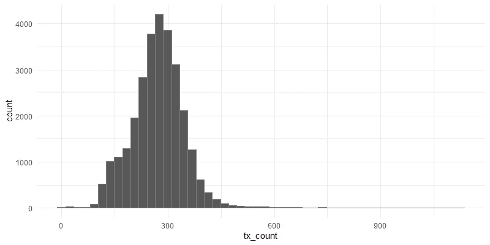

图一。2021 年 7 月 2 日 TRON 区块链上每个区块的交易数分布。

虽然很少，“空”块对于创区块链来说是完全正常的。当事务太少而无法打包到一个块中时，会生成这些事件。

# 资产转移和智能合同触发是最普遍的交易类型

在创区块链上可以进行 30 多种交易。这些类型通过各自的“[系统智能合同](https://tronprotocol.github.io/documentation-en/mechanism-algorithm/system-contracts/)实现。在我们的数据集中，ca。所有交易的 65%与各种代币(`"TransferAssetContract"`)和 ca 的转移相关。13% —用特龙(`TransferContract`)的本币[特龙尼斯](https://tron.network/trx?lng=en) (TRX)转账。超过 19%的交易涉及触发其他智能合同(`TriggerSmartContract`)，例如那些在分散应用中实现逻辑的合同。其他类型的交易(例如，创建新账户、代币等。)的频率要低得多:

```
dat %>%
  select(tx) %>%
  unnest(cols = c(tx)) %>%
  group_by(contract_type) %>%
  summarise(n = n()) %>%
  mutate(percent = round(n / sum(n) * 100, 3)) %>%
  arrange(-n)#> # A tibble: 13 x 3
#>    contract_type                         n percent
#>    <chr>                             <int>   <dbl>
#>  1 TransferAssetContract           5071888  64.9  
#>  2 TriggerSmartContract            1508562  19.3  
#>  3 TransferContract                1041006  13.3  
#>  4 AccountCreateContract            166234   2.13 
#>  5 FreezeBalanceContract             10321   0.132
#>  6 VoteWitnessContract                8643   0.111
#>  7 WithdrawBalanceContract            6857   0.088
#>  8 UnfreezeBalanceContract            5119   0.065
#>  9 CreateSmartContract                 829   0.011
#> 10 AccountPermissionUpdateContract      77   0.001
#> 11 AccountUpdateContract                 8   0    
#> 12 AssetIssueContract                    2   0    
#> 13 ParticipateAssetIssueContract         1   0
```

# 每个块的事务越多，块就越大

假设数据块用于“捆绑”一组连续的事务，那么自然会期望数据块大小(以 Mb 为单位)与此类事务的数量正相关。图 2 证实了这一点。

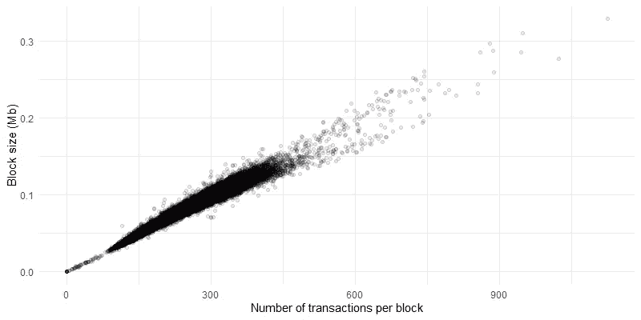

图二。每个块的事务数量和块大小之间的关系。

然而，这种关系的强度并不一致。当数据低于每块 90 笔交易时，关系是线性的，非常紧密。之后，相关性仍然是强的和正的，但是块大小方差增加了。此外，在 ca 上方的图上出现了两组独立的点。每个块 450 个事务。总体而言，图 2 显示，2021 年 7 月 2 日，区块链在几个不同的制度下运作。

# 区块链上的活动全天变化很大

每个区块的交易数量表现出适度的每日季节性，即从午夜到大约。09:00 ( [UTC 时区](https://en.wikipedia.org/wiki/Coordinated_Universal_Time)，这里和其他地方)，然后再次类似地缓慢下降。然而，全天有许多局部波峰和波谷(图 3)。

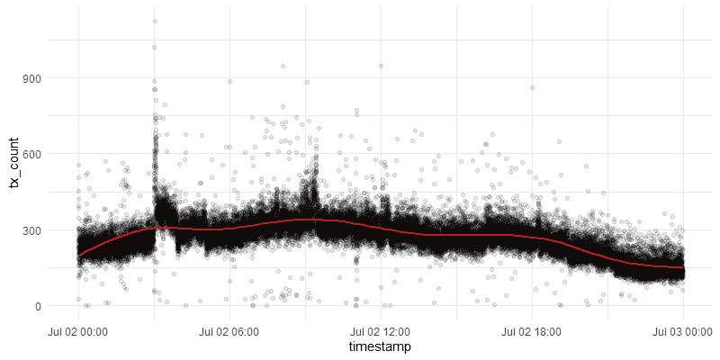

图 3。每个块中事务数量的时间变化。在本文的这里和其他地方，红线是一个基于 [GAM](https://en.wikipedia.org/wiki/Generalized_additive_model) 的平滑器，用来突出趋势。

一些峰值持续了连续几个街区，反映了区块链活动中的短期[政权转移](https://en.wikipedia.org/wiki/Regime_shift#:~:text=Regime%20shifts%20are%20large%2C%20abrupt,systems%20or%20other%20complex%20systems.&text=When%20regime%20shifts%20are%20associated,referred%20to%20as%20critical%20transitions.)。让我们更仔细地看看这种转变中最显著的，发生在公元。03:00 和 03:06。在此期间，每个块的事务数量在平均水平和方差方面都有所增加(图 4)。

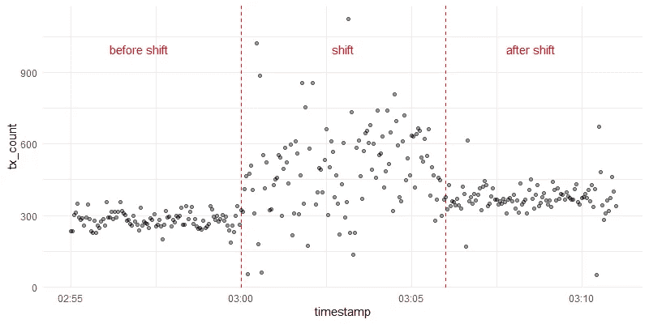

图 4。区块链上的活动在 03:00 到 03:06 之间发生了变化。为了比较，显示了轮班前后的五分钟间隔。

如下图所示，这种明显的政权转移是由一个特定的地址(`THtbMw6byXuiFhsRv1o1BQRtzvube9X1jx`，一个 [TRON 账户](https://tronscan.org/#/address/THtbMw6byXuiFhsRv1o1BQRtzvube9X1jx)，其身份不明)开始向另一个地址(`TSQyuZowokRp3TMRCcrbsDnhnnDSg7gtMT`，一个[智能合同](https://tronscan.org/#/contract/TSQyuZowokRp3TMRCcrbsDnhnnDSg7gtMT)与一个大型赌博网站相关联)发起大量交易引起的。为了简化符号，我将第一个实体称为“地址 *A* ”，第二个实体称为“地址 *B* ”。

```
# Addresses that interacted between 03:00 and 03:06,
# ordered by the number of transactions:dat %>%
  filter(
    timestamp >= as.POSIXct("2021-07-02 03:00:00", tz = "UTC"),
    timestamp < as.POSIXct("2021-07-02 03:06:00", tz = "UTC")
  ) %>%
  select(tx) %>%
  unnest(cols = tx) %>%
  group_by(from_address, to_address) %>%
  count() %>% arrange(-n) %>% head()#> # A tibble: 6 x 3
#> # Groups:   from_address, to_address [6]
#>   from_address                 to_address                      n
#>   <chr>                        <chr>                       <int>
#> 1 THtbMw6byXuiFhsRv1o1BQRtzvu~ TSQyuZowokRp3TMRCcrbsDnhnn~ 26897
#> 2 TCd4rituYSmbeEDxXpDVF7ordH3~ TFJDc5RmS5HuLRujYSFwHadHQb~  1198
#> 3 TCd4rituYSmbeEDxXpDVF7ordH3~ TSvin3om2vWuw5stbxTeDQrpqH~   647
#> 4 TCd4rituYSmbeEDxXpDVF7ordH3~ TTagN2hiUpt7HBbLTgLWi8qQoS~   374
#> 5 TAUN6FwrnwwmaEqYcckffC7wYmb~ TR7NHqjeKQxGTCi8q8ZY4pL8ot~   184
#> 6 TH4RjfiSXxz71fNP3U3p6XwKYZ8~ TVj7RNVHy6thbM7BWdSe9G6gXw~   149
```

在 03:06 之后不久，每个块的事务数量再次变得不那么不稳定，尽管其平均水平仍然有所提高(图 4)。相互作用的地址对 *A* — *B* 仍然是最活跃的一个，尽管这些地址之间的事务数量大幅下降:

```
# Addresses that interacted between 03:06 and 03:11,
# ordered by the number of transactions:dat %>%
  filter(
    timestamp >= as.POSIXct("2021-07-02 03:06:00", tz = "UTC"),
    timestamp <= as.POSIXct("2021-07-02 03:11:00", tz = "UTC")
  ) %>%
  select(tx) %>%
  unnest(cols = tx) %>%
  group_by(from_address, to_address) %>%
  count() %>% arrange(-n) %>% head()#> # A tibble: 6 x 3
#> # Groups:   from_address, to_address [6]
#>   from_address                 to_address                      n
#>   <chr>                        <chr>                       <int>
#> 1 THtbMw6byXuiFhsRv1o1BQRtzvu~ TSQyuZowokRp3TMRCcrbsDnhnn~  6713
#> 2 TCd4rituYSmbeEDxXpDVF7ordH3~ TFJDc5RmS5HuLRujYSFwHadHQb~  2223
#> 3 TCd4rituYSmbeEDxXpDVF7ordH3~ TSvin3om2vWuw5stbxTeDQrpqH~   396
#> 4 TCd4rituYSmbeEDxXpDVF7ordH3~ TTagN2hiUpt7HBbLTgLWi8qQoS~   367
#> 5 TH4RjfiSXxz71fNP3U3p6XwKYZ8~ TVj7RNVHy6thbM7BWdSe9G6gXw~   199
#> 6 TAUN6FwrnwwmaEqYcckffC7wYmb~ TR7NHqjeKQxGTCi8q8ZY4pL8ot~   171
```

作为比较，在政权转移前几分钟，前 6 个相互作用的地址对列表如下:

```
# Addresses that interacted between 02:55 and 03:00,
# ordered by the number of transactions:dat %>%
  filter(
    timestamp >= as.POSIXct("2021-07-02 02:55:00", tz = "UTC"),
    timestamp < as.POSIXct("2021-07-02 03:00:00", tz = "UTC")
  ) %>%
  select(tx) %>%
  unnest(cols = tx) %>%
  group_by(from_address, to_address) %>%
  count() %>% arrange(-n) %>% head()#> # A tibble: 6 x 3
#> # Groups:   from_address, to_address [6]
#>   from_address                 to_address                      n
#>   <chr>                        <chr>                       <int>
#> 1 TCd4rituYSmbeEDxXpDVF7ordH3~ TSvin3om2vWuw5stbxTeDQrpqH~   517
#> 2 TCd4rituYSmbeEDxXpDVF7ordH3~ TTagN2hiUpt7HBbLTgLWi8qQoS~   253
#> 3 TH4RjfiSXxz71fNP3U3p6XwKYZ8~ TVj7RNVHy6thbM7BWdSe9G6gXw~   200
#> 4 TAUN6FwrnwwmaEqYcckffC7wYmb~ TR7NHqjeKQxGTCi8q8ZY4pL8ot~   176
#> 5 TNMQ6BJyycCSMuVmVWH2Re4FySm~ TAQuJmiy83mcnyAtB6wMST6bSY~   136
#> 6 TNaRAoLUyYEV2uF7GUrzSjRQTU8~ TR7NHqjeKQxGTCi8q8ZY4pL8ot~   114
```

政权更迭期间，地址 *A* 向地址 *B* 发送了哪些交易？为了回答这个问题，我们使用`tronr`包中的`[get_tx_info_by_id()](https://levelup.gitconnected.com/how-to-query-transactions-on-the-tron-blockchain-7e646ee546fd)`函数收集了一个更详细的数据集(详见 [Github](https://github.com/next-game-solutions/day-on-tron) )。该数据集可以如下加载到 R 中:

```
shift_tx <- readRDS(url("https://chilp.it/969333f"))shift_tx %>% dim()
#> [1] 26897    19names(shift_tx)
#>  [1] "request_time"             "tx_id"                   
#>  [3] "block_number"             "timestamp"               
#>  [5] "contract_result"          "confirmed"               
#>  [7] "confirmations_count"      "sr_confirm_list"         
#>  [9] "contract_type"            "from_address"            
#> [11] "to_address"               "is_contract_from_address"
#> [13] "is_contract_to_address"   "costs"                   
#> [15] "trx_transfer"             "trc10_transfer"          
#> [17] "trc20_transfer"           "internal_tx"             
#> [19] "info"
```

由于地址 *B* 属于智能合约，因此毫不奇怪，在政权转移期间，它从地址 *A* 接收的所有 26，897 笔交易都属于类型`"TriggerSmartContract"`:

```
shift_tx$contract_type %>% unique()
#> [1] "TriggerSmartContract"
```

这些交易都没有直接涉及任何资产的转让，无论是 TRX、 [TRC-10](https://developers.tron.network/docs/trc10) 还是 [TRC-20](https://developers.tron.network/docs/trc20) 代币:

```
shift_tx$trx_transfer %>% sum()
[1] 0

shift_tx$trc10_transfer %>% sum(na.rm = TRUE)
[1] 0shift_tx$trc20_transfer %>% sum(na.rm = TRUE)
[1] 0
```

然而，TRON 区块链上的智能合约调用通常会触发所谓的“[内部事务](https://developers.tron.network/docs/vm-introduction)”，这些事务在“幕后”实施各种操作，包括资产转移。关于这些交易的信息可以在`shift_tx`表格的列表栏`internal_tx`中找到。例如，以下是与 03:03 发生的“正常”交易之一相关的内部交易数据:

```
shift_tx$internal_tx[[1]] %>% glimpse()#> Rows: 9
#> Columns: 12
#> $ internal_tx_id           <chr> "3c4c8d286b643d1a7e0b23e2dd~
#> $ from_address             <chr> "TBPrJYARpfAe9kmnHvMAWcqimn~
#> $ to_address               <chr> "TCcrsGF9PdLxJF869dQsK4V5QE~
#> $ is_contract_from_address <lgl> TRUE, TRUE, TRUE, TRUE, TRU~
#> $ is_contract_to_address   <lgl> TRUE, TRUE, TRUE, TRUE, TRU~
#> $ confirmed                <lgl> TRUE, TRUE, TRUE, TRUE, TRU~
#> $ rejected                 <lgl> FALSE, FALSE, FALSE, FALSE,~
#> $ token_id                 <chr> "TRX", "TRX", "TRX", "TRX",~
#> $ token_name               <chr> "Tronix", "Tronix", "Tronix~
#> $ token_abbr               <chr> "TRX", "TRX", "TRX", "TRX",~
#> $ vip                      <lgl> FALSE, FALSE, FALSE, FALSE,~
#> $ amount                   <dbl> 0.0, 0.0, 0.0, 0.0, 0.0, 0.~
```

汇总所有内部事务，我们可以看到，实际上总共有 185，113 个 TRX(相当于大约由于在政权转移期间从 *A* 到 *B* 的智能合约调用，当日 12，032 美元)易手；

```
shift_tx %>% 
  select(internal_tx) %>%
  unnest(internal_tx) %>% 
  filter(amount > 0) %>% 
  group_by(token_id) %>% 
  summarise(total_amount = sum(amount))#> # A tibble: 1 x 2
#>   token_id total_amount
#>   <chr>           <dbl>
#> 1 TRX           185113.
```

这种内部交易分析的下一个合乎逻辑的步骤将涉及更好地理解不同账户之间的 TRX 流动，确定这些账户所属的实体等。我将把这作为一个练习留给读者。

# 相互作用的区块链地址形成一个网络

通常将区块链交易数据表示为网络(图)，其中地址作为节点，交易作为连接节点的边(参见示例[这里](https://medium.com/elliptic/the-elliptic-data-set-opening-up-machine-learning-on-the-blockchain-e0a343d99a14)和[这里](https://appliednetsci.springeropen.com/articles/10.1007/s41109-019-0249-6))。

例如，让我们看一下在研究的当天产生的第 10 个块的交易:

```
dat$tx[[10]]
#> # A tibble: 278 x 4
#>    tx_id           contract_type   from_address    to_address   
#>    <chr>           <chr>           <chr>           <chr>        
#>  1 85e2dc35e095d5~ TransferContra~ THXPAPiRd62EWk~ TV8oyJ4VEQgE~
#>  2 0733b9aea36aa5~ TransferAssetC~ TCjeJWKkiEgih2~ TA9uJrWuTueK~
#>  3 0c841ce6d571da~ TransferAssetC~ TP8BWU6dYD1fHc~ TSpnfuhALfLJ~
#>  4 51802e2f59cb7b~ TransferAssetC~ TAdTQUqsumn1NG~ TX6HKSS5VnUr~
#>  5 9e3b34b7f99a8f~ TransferContra~ TWq5u64ic279j8~ TM9H9cS6wZox~
#>  6 0820513585ac7b~ TriggerSmartCo~ TJZziktTWeCXgR~ TBRs8xwajQVb~
#>  7 5cc4dd58b3c25c~ TransferAssetC~ TLmqHdqkD5shgj~ TUrCM9mV41FN~
#>  8 a526124805cb6e~ TransferAssetC~ TEpyCakhKtwvtY~ TGmgoGskK3pX~
#>  9 4449d115da5c13~ TransferAssetC~ TWoJEZhqpJxzu7~ TNLAoWMw6WTk~
#> 10 03df1b68f2d7fa~ TransferAssetC~ TJFhAVZjBaCMvt~ TQ8M5KzRJRZi~
#> # ... with 268 more rows
```

首先，我们将通过(I)找到所有唯一的发送(`from_address`)和接收(`to_address`)地址对，以及(ii)计算每对的交易数量(边权重)来总结上述数据:

```
nb <- dat$tx[[10]] %>%
  group_by(from_address, to_address) %>%
  summarise(weight = n()) %>% 
  ungroup() %>%
  arrange(-weight)nb
#> # A tibble: 238 x 3
#>    from_address                to_address                 weight
#>    <chr>                       <chr>                       <int>
#>  1 TCd4rituYSmbeEDxXpDVF7ordH~ TSvin3om2vWuw5stbxTeDQrpq~     33
#>  2 TEoDHGSTu2Kh97HjCbbcEUaCTm~ TCcjjJ4v7zu6W4F1wwBhuc7EB~      2
#>  3 TJP3A9agR5CP31UE29mhFXK1wk~ TCXeYmM1g44qtRVEHbf9ehwgB~      2
#>  4 TNXscxfqxNtpaeUZKoEUkvEY5e~ TGsyWcVkFBxTknYzXGWvrZPaX~      2
#>  5 TP7NeoT2sM1hkpTuqNrvHorrRz~ TNmiCAm7Q38jKvWsrSRReREuy~      2
#>  6 TPaGwxVw7q26DCxRSGG9b2BNRB~ TTmdBHmoPqXE7EC22QtzPi2Ag~      2
#>  7 TTAct3jgaabAhxSvoZW9SAGVu4~ TWMiYQvrXuyQw5pk6Yt2L6oQF~      2
#>  8 TTfGseRet2nHfvi5KhPx9vCf6Q~ TA7oywPknyAewrq9bss7AzGGs~      2
#>  9 TTfGseRet2nHfvi5KhPx9vCf6Q~ TYYoV3GVuwjHkCYKfYRYwLjBb~      2
#> 10 TA1EHWb1PymZ1qpBNfNj9uTaxd~ TDyoqH6N91PAYrihFzE1VER7H~      1
#> # ... with 228 more rows
```

产生的 tibble 现在可以被转换成类`"igraph"`的对象，正如在流行的包`igraph`中实现的:

```
require(igraph) # popular R package for network analysisnb_graph <- nb %>%
  graph_from_data_frame(., directed = TRUE)summary(nb_graph)
#> IGRAPH c55f992 DNW- 350 238 -- 
#> + attr: name (v/c), weight (e/n)
```

得到的对象是一个有 350 个节点和 238 条边的图。为了可视化这个图，我们可以使用`[ggnetwork](https://cran.r-project.org/web/packages/ggnetwork/vignettes/ggnetwork.html)`，一个 R 包，它为`ggplot2`实现了几个方便的网络几何图形(另一个很棒的网络可视化 R 包是`[ggraph](https://ggraph.data-imaginist.com/)`)。结果如图 5 所示:

```
require(ggplot2)
require(ggnetwork)# Figure 5:
ggplot(fortify(nb_graph, arrow.gap = 0.007),
       aes(x = x, y = y, xend = xend, yend = yend)) +
  geom_edges(
    color = "#57cbcc",
    arrow = arrow(length = unit(3, "pt"), type = "closed")
  ) +
  geom_nodes(color = "#343a40") +
  theme_blank()
```


图 5。31570507 块中记录的 TRON 地址(黑点)和交易(蓝绿色箭头)的网络。一些地址在一天内向同一个接收地址发出了几笔交易。然而，为了清楚起见，在该图中忽略了边缘权重。

图 5 揭示了区块链交易网络的典型模式:

*   网络主要由小的*断开元件*组成，每个元件有 2-4 个相互作用的地址；
*   有几个*星形组件*，要么一个地址接收来自许多其他地址的事务，要么一个地址向许多其他地址发出事务。

交易网络的结构属性可以使用各种度量标准进行定量表征，例如:

*   *直径*:从一个节点到达另一个节点必须经过的最大节点数。
*   *入度*和*出度*:分别是与一个节点相关的传入或传出事务的数量。表征整个有向网络时，感兴趣的通常是最小和最大的入度和出度。
*   *平均度*:边数除以节点数。
*   *边缘密度*:边缘数量与最大可能边缘数量之比。
*   *相似性*:一种[优先依附](https://en.wikipedia.org/wiki/Preferential_attachment)的度量，即节点倾向于依附在其他在某些方面相似的节点上的现象。分类度通常被计算为成对链接节点之间的皮尔逊相关度系数。

使用`igraph`中的各个函数可以很容易地计算出所有这些指标。对于图 5 所示的网络，我们得到:

```
# Diameter:
diameter(nb_graph, directed = TRUE)
#> [1] 33# Max in-degree:
degree(nb_graph, mode = "in", loops = FALSE) %>% max()
#> [1] 32# Max out-degree:
degree(nb_graph, mode = "out", loops = FALSE) %>% max()
#> [1] 9# Average degree:
gsize(nb_graph) / gorder(nb_graph)
#> [1] 0.68# Edge density:
edge_density(nb_graph, loops = FALSE)
#> [1] 0.001948424# Assortativity:
assortativity_degree(nb_graph)
#> [1] -0.228756
```

总的来说，这些结果与我们之前通过观察图 5 发现的模式一致。

# 交易网络的结构全天变化很大

人们很自然地会认为，特定区块交易网络的结构是动态的，与区块链正在发生的事情保持一致。让我们为每个块计算前面提到的结构度量，看看它们是如何随时间变化的。

首先，我们将每个块的事务列表转换成类`igraph`的图形对象，并将结果存储在嵌套的 tibble 中:

```
require(purrr)nw_stats <- dat %>%
  select(timestamp, tx) %>%
  group_by(timestamp) %>%
  unnest(tx) %>%
  select(-c(tx_id, contract_type)) %>%
  mutate(to_address = if_else(
    is.na(to_address), from_address, to_address)
  ) %>%
  group_by(timestamp, from_address, to_address) %>%
  summarise(weight = n()) %>%
  group_by(timestamp) %>%
  nest(nw = c(from_address, to_address, weight)) %>%
  mutate(nw = map(nw, graph_from_data_frame))# The resultant tibble contains a list-column `nw`, where
# each element is an `igraph` object:
nw_stats
#> # A tibble: 28,719 x 2
#> # Groups:   timestamp [28,708]
#>    timestamp           nw      
#>    <dttm>              <list>  
#>  1 2021-07-02 00:00:00 <igraph>
#>  2 2021-07-02 00:00:09 <igraph>
#>  3 2021-07-02 00:00:12 <igraph>
#>  4 2021-07-02 00:00:15 <igraph>
#>  5 2021-07-02 00:00:18 <igraph>
#>  6 2021-07-02 00:00:21 <igraph>
#>  7 2021-07-02 00:00:24 <igraph>
#>  8 2021-07-02 00:00:27 <igraph>
#>  9 2021-07-02 00:00:30 <igraph>
#> 10 2021-07-02 00:00:33 <igraph>
#> # ... with 28,698 more rowssummary(nw_stats$nw[[1]])
#> IGRAPH 7f07025 DNW- 270 189 -- 
#> + attr: name (v/c), weight (e/n)
```

现在，让我们编写一个计算网络度量的实用函数，然后使用来自`purrr`的`map()`函数将它应用于存储在`nw_stats`中的每个`igraph`对象:

```
# Function to calculate network metrics:
get_nw_stats <- function(g) {
  tibble(
    n_nodes = gorder(g),
    n_edges = gsize(g),
    diameter = diameter(g, directed = TRUE),
    max_in_degree = degree(g, mode = "in",
                           loops = FALSE) %>% max(),
    max_out_degree = degree(g, mode = "out",
                            loops = FALSE) %>% max(),
    avg_degree = n_edges / n_nodes,
    edge_density = edge_density(g, loops = FALSE),
    assortativity = assortativity_degree(g)
  )
}# Calculate network metrics for each block:
nw_stats <- nw_stats %>%
  mutate(stats = map(nw, get_nw_stats))glimpse(nw_stats$stats[[1]])
#> Rows: 1
#> Columns: 8
#> $ n_nodes        <int> 270
#> $ n_edges        <dbl> 189
#> $ diameter       <dbl> 3
#> $ max_in_degree  <dbl> 20
#> $ max_out_degree <dbl> 10
#> $ avg_degree     <dbl> 0.7
#> $ edge_density   <dbl> 0.00260223
#> $ assortativity  <dbl> -0.1411257# Unnest `nw_stats` for easier plotting:
nw_stats_flat <- nw_stats %>%
  ungroup() %>%
  select(timestamp, stats) %>%
  unnest(cols = stats)glimpse(nw_stats_flat)
#> Rows: 28,719
#> Columns: 9
#> $ timestamp      <dttm> 2021-07-02 00:00:00, 2021-07-02 0~
#> $ n_nodes        <int> 270, 409, 525, 555, 28, 680, 658, ~
#> $ n_edges        <dbl> 189, 293, 398, 436, 27, 535, 485, ~
#> $ diameter       <dbl> 3, 4, 8, 6, 1, 8, 3, 52, 46, 33, 3~
#> $ max_in_degree  <dbl> 20, 30, 78, 98, 27, 135, 63, 64, 2~
#> $ max_out_degree <dbl> 10, 10, 8, 9, 1, 12, 8, 10, 5, 9, ~
#> $ avg_degree     <dbl> 0.7000000, 0.7163814, 0.7580952, 0~
#> $ edge_density   <dbl> 0.002602230, 0.001755837, 0.001446~
#> $ assortativity  <dbl> -0.1411257, -0.2274452, -0.3283519~
```

图 6 显示了每个块的节点数(左图)和边数(右图)随时间的变化。不出所料，这两个指标的动态与每个块的事务数量相似(见图 3)。此外，考虑到特定区块交易网络的高度不连接性，节点数量与边的数量密切相关(图 6，底部面板)。

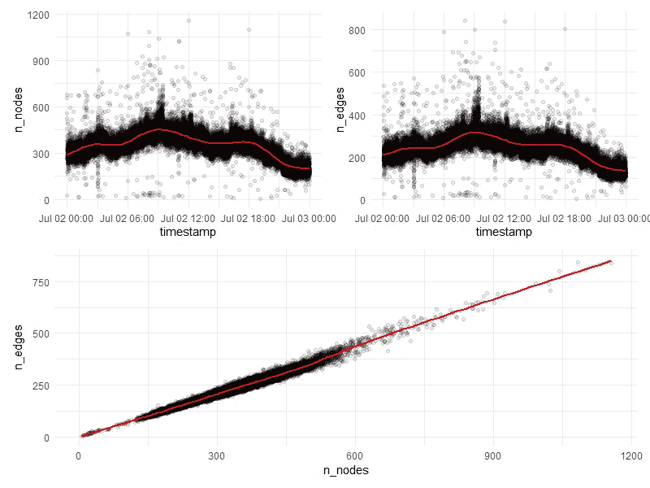

图 6。每块事务网络中节点数量(左上图)和边数量(右上图)的时间变化。底部面板说明了这两个指标之间的相关性。

最大出度显示了与节点和边数相似的日内变化，而最大出度尽管有多个局部波峰和波谷，但平均而言几乎没有趋势(图 7)。这一发现表明，交易网络的结构主要是由同时与给定接收地址交互的发送者数量驱动的。

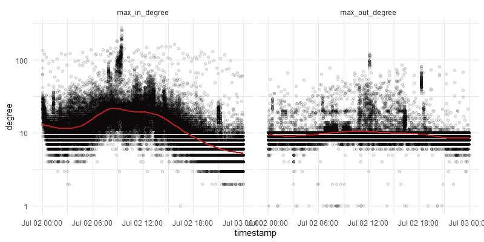

图 7。每块交易网络的最大入度(左图)和最大出度(右图)的时间变化。注意 Y 轴的对数刻度。

边密度有一个温和的 U 型趋势，因此与节点和边的数量负相关。尽管程度要小得多，但它也与最大入度负相关(图 8)。

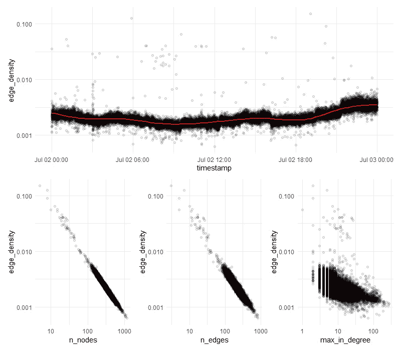

图 8。*上图*:每块交易网络的边密度的时间变化。下图:边密度分别与节点数、边数和最大入度之间的关系。

全天平均网络度相对稳定，在 0.7 左右震荡(图 9)。

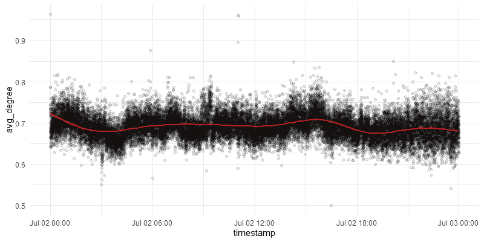

图 9。每块交易网络平均度的时间变化。

每块交易网络的直径在一天中的大部分时间里显示出一致的高变化(从 1 到大约。80;图 8)。然而，这一指标的方差急剧下降，其平均水平同时在 ca。03:00 和 05:00，即在上文详细描述的区块链活动中的明显政权转移之后不久。

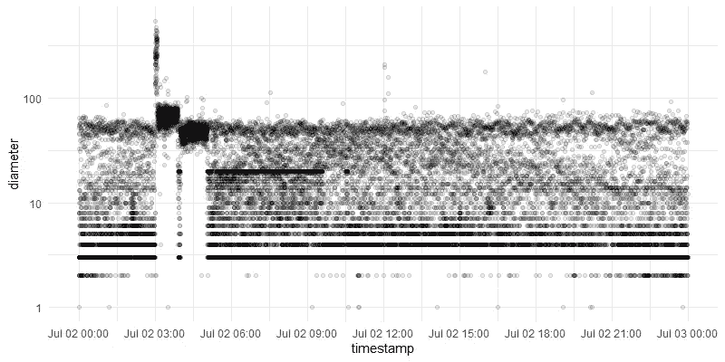

图 10。特定区块交易网络直径的时间变化。注意 Y 轴的对数刻度。

在大多数情况下，分类系数为中等负值(图 11)，表明低度节点倾向于附着于高度节点。这一发现与在其他非常不连通的交易网络中存在的一些大型星形组件非常一致，这些组件通常可以在 TRON 区块链上观察到(例如，参见图 5)。

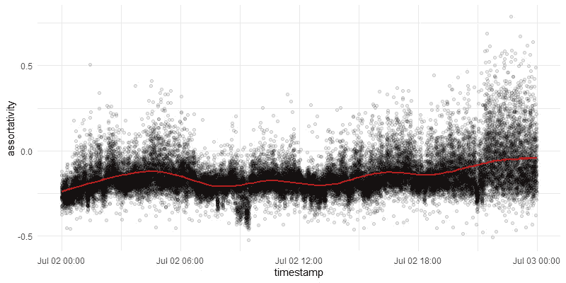

图 11。按块交易网络的分类性。

然而，在一天中有多个峰值。这种峰值的频率在一天结束时会增加。图 12 比较了两个交易网络——一个最低(-0.53)，一个最高(0.79)。

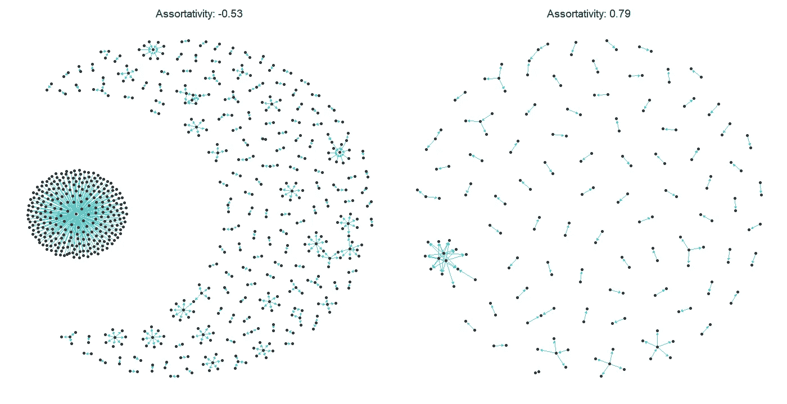

图 12。2021 年 7 月 2 日在 TRON 区块链上记录的具有最低和最高分类系数的每块交易网络。

# 结论

本文展示了一些模式，这些模式可以从支持高吞吐量智能契约的区块链上生成的数据中提取出来。然而，它仅仅触及了表面。例如，其他值得探讨的有趣方面包括区块链实体的去匿名化、各类账户之间的资产转移、连锁活动与区块链托管的代币价格之间的联系等。我将在以后的文章中讨论这些和其他研究问题。

# 您可能还喜欢:

[](/data-science-for-blockchain-understanding-the-current-landscape-c136154c367e) [## 区块链的数据科学:了解当前形势

### 数据科学和区块链技术是天生的一对。但是有多少和什么样的真实世界…

towardsdatascience.com](/data-science-for-blockchain-understanding-the-current-landscape-c136154c367e) [](https://levelup.gitconnected.com/introducing-tronr-an-r-package-to-explore-the-tron-blockchain-f0413f38b753) [## 介绍 tronr，一个探索 TRON 区块链的 R 包

### 查询账户余额、交易、代币转账等等。

levelup.gitconnected.com](https://levelup.gitconnected.com/introducing-tronr-an-r-package-to-explore-the-tron-blockchain-f0413f38b753) [](https://medium.com/geekculture/market-data-for-8000-cryptocurrencies-at-your-fingertips-c76d7e8f43ca) [## 8000 种加密货币的市场数据，触手可及

### 介绍 geckor，一个查询 CoinGecko API 的 R 包

medium.com](https://medium.com/geekculture/market-data-for-8000-cryptocurrencies-at-your-fingertips-c76d7e8f43ca) 

# 在你走之前

我提供数据科学咨询服务。[取得联系](mailto:sergey@nextgamesolutions.com)！

***来自《走向数据科学》编辑的提示:*** *虽然我们允许独立作者根据我们的* [*规则和指导方针*](/questions-96667b06af5) *发表文章，但我们不认可每个作者的贡献。你不应该在没有寻求专业建议的情况下依赖一个作者的作品。详见我们的* [*读者术语*](/readers-terms-b5d780a700a4) *。*