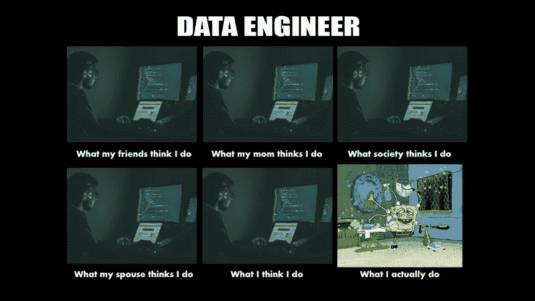
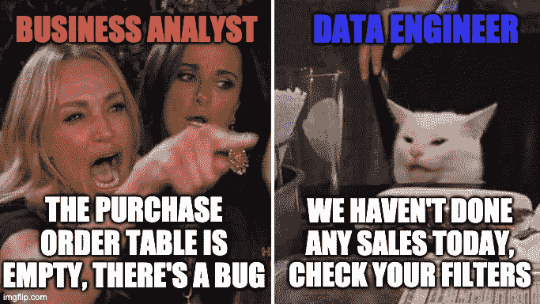

# 数据工程师的一天

> 原文：<https://towardsdatascience.com/a-day-in-the-life-of-a-data-engineer-d65293272121?source=collection_archive---------14----------------------->

## 分解数据工程师在 2021 年的主要活动

编码【数码影像】[https://unsplash.com/@jefflssantos](https://unsplash.com/@jefflssantos)|海绵宝宝清洁【数码影像】[https://imgflip.com/meme/81959717/Spongebob-Cleaning](https://imgflip.com/meme/81959717/Spongebob-Cleaning)

数据工程在 2021 年的角色已经超越了更好或更坏的范围。因此，角色的多种定义不断涌现。数据工程师做更多的分析(也称为新角色定义，分析工程师)，数据管道，处理更多的基础设施(DevOps)，还是机器学习工程？基本上，一个普通的数据工程师会花多少时间变得有点模糊。然而，这些类别属于技术活动，我们经常忘记它只是花费时间的一部分。在这篇文章中，我们将**分解成不同的活动**一个数据工程师典型的一天是怎样的。

# 编码—30%到 40%

让我们来定义编码的真正含义:

*   开发数据管道/API/微服务。
*   设置/维护基础设施
*   修复错误，改进代码库，文档

根据项目阶段的不同，您将在不同的编码方面工作:新特性、调试、维护和稳定性。

同样值得记住的是，编码不仅是“更多”(增加代码行)，也是“更少”——删除代码。一个很好的例子是在这里查看 Apache Spark 的顶级提交者。我们可以看到，它们中的大部分实际上是负比例的；他们删除的行比添加的多！

所以不，编码不是主要活动！多项研究表明，一名软件工程师每天会花 30%到 40%的时间编写代码。那个数字和我的经历完全相关。

# 项目和时间管理—20%到 30%

这是一个具有挑战性的部分，因为用这些很容易变得没有效率。衡量项目/时间管理的效率是困难的，而且你通常不是等式中唯一的变量。

这些活动主要分为两种类型:

*   写作:门票整理，路线图等。
*   会议:站立，冲刺规划等。

写作是(差不多？)这是每次会议的先决条件。一份适当的预读材料或议程会加速讨论，让每个人都达成共识。

# 数据传播——10%到 15 %

数据工程师大部分时间都坐在锤子(数据消费者又名数据分析师/数据科学家/业务/微服务)和铁砧(数据生产者)之间。如果数据消费者出了问题，首当其冲的将是数据工程师。

愤怒的母猫[数码图片][https://imgflip.com/meme/195076787/Angry-lady-cat](https://imgflip.com/meme/195076787/Angry-lady-cat)

在那种情况下，你是坏警察。您需要通过设置规则和传播数据文化来发挥您的作用。你有时候不得不说不，你可能要把人拉回现实。能够礼貌温和地交流现实中的里程碑是一种无价的技能。

编写最佳实践，与利益相关者和数据制作者交流，并向他们展示这些指南是为了帮助每个人和提高生产力，而不是阻止他们。

# 审查—10%到 20 %

复习是一个重要的类别，因为它基本上是你学习最多的时候。当你独自学习新事物时，很难知道你是否在正确的轨道上。与他人(同事、利益相关者)建立紧密的反馈回路至关重要。你学会了你做得好的地方和你需要适应的地方。

审查可分为 3 个不同的类别:

*   代码审查
*   项目审查
*   绩效评审(团队或同行评审)

有时候，我会花更多的时间审查代码，而不是编码。这不是一件坏事。可能是我需要熟悉一个新的代码库，或者有一些大的特性我想仔细检查。

项目评审可以是事后分析，也可以是对涉众的演示。它基本上是与特定项目相关的一切，了解什么是/曾经是错的，什么是/曾经是好的。这也是一个分享最佳实践和建立约定的机会:编码风格、文档等。

# 技术观察—5%到 15%

即使不是每天，对今天的数据工程师来说，进行技术观察也是必不可少的，因为新的工具和框架涌现得如此之快，如果不想过时，您需要跟随趋势。

当人们想到 technology watch 时，他们有时会想，“这就是那个只会炒作新玩具的老姐。”但实际上，做技术观察并不一定要关注重大突破性的新技术，还包括:

*   阅读文章，书籍。
*   使用新的库/框架或设计模式改进您当前的设置。
*   跟进可以简化您的设置或降低成本的新云服务或功能。

如果你想在这里[获得更多关于趋势的见解，你可以阅读我的博客文章和我们的数据技术技能雷达。](https://medium.datadriveninvestor.com/what-are-the-most-requested-technical-skills-in-the-data-job-market-insights-from-35k-datajobs-ads-d8642555f89e)

# 无效—1%到 10 %

> “这需要很大的努力才能变得如此不思进取”

实话实说吧。我们总有这样的日子，我们觉得我们所做的一切都不属于上面的任何一类。

浏览你的 LinkedIn feed，谈论你在喝咖啡休息时玩的最后一个游戏，没有成效的会议，这些都是会让你在某天情绪低落的各种活动。

如果你认为这是你时间的一部分，拥有它并承认它没有错，只要它不会占用你太多的时间。

# 结论

我们可以猜测，**编码只是**的冰山一角。是的，**沟通**是几乎所有部门的关键。我总是试图每周记住这些比率，以确保我相应地花费我的时间。这些比率当然会根据你公司的文化和规模而变化。

你错过了什么吗？请随意分享您的比率或/和我可能忘记的部分！

# 迈赫迪·瓦扎又名迈赫迪欧·🧢

感谢阅读！🤗 🙌如果你喜欢这个，**请在**跟我来🎥 [**Youtube**](https://www.youtube.com/channel/UCiZxJB0xWfPBE2omVZeWPpQ) ，✍️ [**中**](https://medium.com/@mehdio) ，或者🔗 [**LinkedIn**](https://linkedin.com/in/mehd-io/) 了解更多数据/代码内容！

**支持我写作** ✍️通过加入媒介通过这个[**链接**](https://mehdio.medium.com/membership)