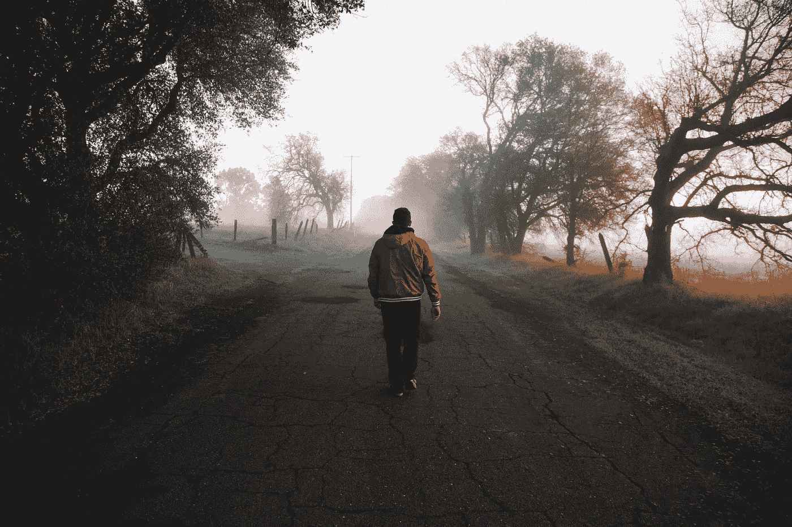
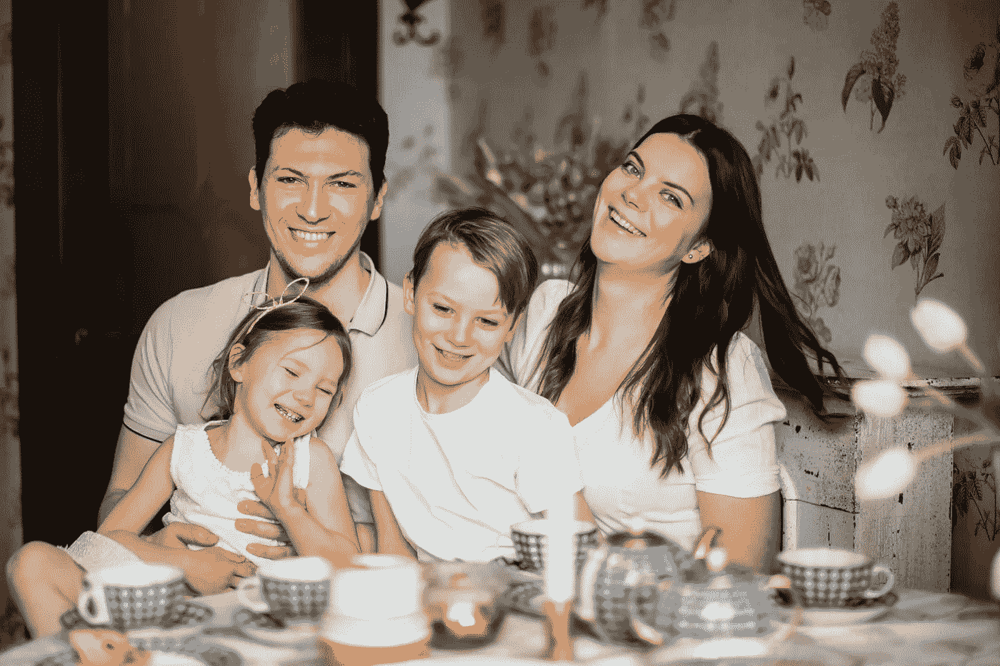

# 兼职作家(和全职数据科学家)的一天

> 原文：<https://towardsdatascience.com/a-day-in-the-life-of-a-part-time-writer-and-a-full-time-data-scientist-4697086c622b?source=collection_archive---------11----------------------->

## 不，你不必辞掉工作去做你喜欢的事情。

当我说我写的时候，我拿起笔，纸，写。我喜欢它！(照片由来自 [Pexels](https://www.pexels.com/photo/person-writing-on-a-notebook-beside-macbook-1766604/?utm_content=attributionCopyText&utm_medium=referral&utm_source=pexels) 的 [Judit Peter](https://www.pexels.com/@judit-peter-281675?utm_content=attributionCopyText&utm_medium=referral&utm_source=pexels) 拍摄)

我是一个注重隐私的人。我是个作家。像我这样的人确实存在。

尽管我是一名作家，但我一直把个人生活放在一边。我写的是数据科学、工作生活、副业以及我的个人发展历程。基本上，我个人经历的东西和我相信会给你，读者，增加价值的东西的交集。

我被问得最多的一个问题是:“你是如何在全职工作的情况下做到这些的？”

我想得越多，就越意识到这没有秘密可言。只是我绝对热爱我的工作。随着时间的推移，我已经学会了一些对我有用的东西，并一直坚持下来。在体验生活的同时享受全职工作的稳定是一件非常美妙的事情。

这是我现在生活中典型的一天。

# 上午 7:30:创作者的制胜套路

我如何开始我的一天。(照片由[乔丹·麦昆](https://unsplash.com/@jordanfmcqueen?utm_source=unsplash&utm_medium=referral&utm_content=creditCopyText)在 [Unsplash](https://unsplash.com/s/photos/morning-walk?utm_source=unsplash&utm_medium=referral&utm_content=creditCopyText) 上拍摄)

我的一天从在附近散步开始，听播客或书籍摘要。在我不想走路的日子里，我会骑着我在禁闭时买的 Orbitrack 健身器。

晨间运动不仅帮助我过上更健康的生活方式，还增强了我的创造力。我不知道如何解释这一点，但我最棒的想法是在早上散步或骑自行车时想到的。

早晨出汗需要淋浴。快速洗完澡后，我抓起早餐，坐在办公桌前。我的秘密来了:吃早餐时，我拿出一张纸，写下 10 个文章创意。

你可以随意偷这个，因为我是从[詹姆斯·阿尔图切](https://medium.com/u/cac1bc5422de?source=post_page-----4697086c622b--------------------------------)和[阿约德吉·阿沃西卡](https://medium.com/u/a66f89ac80ab?source=post_page-----4697086c622b--------------------------------)那里偷的。我尝试了这个技巧，因为这两位博客专家都将它融入了他们的日常生活，并取得了成功。

最初，我想不出 10 个主意。即使我做了，也是垃圾。如果我没有读到那些博客传奇的好处，我早就辞职了。但幸运的是，我继续。

在听了几个星期的播客、书籍摘要和写下想法后，我确实发现了一些可靠的想法。现在我的想法似乎比我以前有时间写的还要多。

最后，我在开始工作前编辑我的文章。这些是我前一天晚上写的草稿。我试着在早上想出第一份草稿，但它似乎对我不起作用(稍后会有更多的内容。)

## 我给你的最大收获是:

作为一个创作者，你需要磨练的最重要的技能就是你的创造力。尽一切可能在早晨增强你的创造力。

从别人的内容中获取灵感。它可能来自你最喜欢的播客、书籍、文章、视频、设计、照片等等。

想出点子是一种被证明可以磨练你创造力的方法。如果你是 YouTuber 用户，你可以想出视频创意。对于播客创作者，列出你想采访的人以及你想问他们的问题。总会有出路的。

# 上午 9 点:启动数据科学家的工作日

在一次深度工作会议中。(照片由来自 [Pexels](https://www.pexels.com/photo/man-in-blue-and-white-checkered-dress-shirt-using-silver-macbook-6214832/?utm_content=attributionCopyText&utm_medium=referral&utm_source=pexels) 的 [Karolina Grabowska](https://www.pexels.com/@karolina-grabowska?utm_content=attributionCopyText&utm_medium=referral&utm_source=pexels) 拍摄)

我不想让你嫉妒，但是我热爱我的工作。我想从事数据科学和人工智能，尽管我知道这是一个竞争激烈和不断发展的行业。

作为一名数据科学家，最好的一点是每个工作日都是独一无二的。并非所有的日子都令人兴奋，但仍然充满挑战。当你对工作感到兴奋时，你经常会过度工作，几乎整天都在工作。

工作再刺激，生活中还有更重要的事情。过去，我花了太多时间在工作上，才意识到家庭、朋友、爱人和个人生活中的抱负对每个人的生活都很重要。

所以，作为一个经验法则，我尽量把我的工作限制在典型的晚上 9-5 点。要做到这一点，这里有一些对我很有效的方法。

## 争取我深入工作的时间

深度工作是我所有支柱的基础。在他的书《深度工作》(Deep Work)中，我接触到了卡尔·纽波特的技巧，他谈到了在一个分心的世界中专注。

> 深度工作是专注于一项认知要求高的任务而不分心的能力。这是一种能让你快速掌握复杂信息并在更短时间内产生更好结果的技能。—加州新港

我每天从早上 9 点到中午 12 点挡 3 个小时去深度工作。这让我可以勾掉一天中最重要和最紧急的任务。我的同事意识到了这一点，很少在这个时间段内安排会议。

这个想法是在一个预定的时间内积极地专注于一件事，同时在这个特定的时间段内排除所有干扰。长时间反复练习这一点会成为一种常态。这个策略最大的好处是你可以在更短的时间内完成更多的工作。

## 整合我的个人任务管理系统

我的个人任务管理系统是一本 120 页的书，我在里面记下所有的事情。

我根据[的重要性和紧迫性](https://forge.medium.com/how-to-use-the-eisenhower-matrix-in-every-area-of-your-life-c69fecf5d030)写下一周的任务，并在一周内一一列出。开会时我会记笔记。在我深入工作的时候，我写下我的想法。

大卫·艾伦说得很好:

> “你的头脑是用来有想法的，而不是持有想法的。”

## 选择我的关机程序并每次都执行它

即使一切按计划进行，有时工作似乎不会结束。那你会怎么做？

你在工作和其他事情之间设定了界限。

我进行了一次深入的工作会议。我可能已经划掉了当天最紧急和最重要的任务。其余的可以等到明天。我执行我的关机程序。

我的关机程序很简单:在本子上记下明天要做的任何事情，钉上我需要的标签，退出微软团队，关闭我的工作笔记本，最后走向冰箱。

啜饮我最喜欢的果汁是对我充满挑战的一天工作的奖励。

# 不，你不必辞职(或欺骗)

我们听说人们在放弃朝九晚五的工作去进行他们自己的创造性冒险后享受自由。对他们来说是好事，但我们看不到全貌。由于幸存者偏见的本质，我们从来没有听到那些失败者的消息。

然后我们听到一些人鼓励[在他们的全职工作上作弊](https://medium.com/swlh/i-cheated-on-my-job-with-my-side-hustle-and-it-was-the-best-decision-i-ever-made-c456e4a78dab)，以支持他们创造性的副业。如果我的工作能从雇主那里得到稳定的报酬，我就应该为此而工作。

我应该想办法增加更多的价值，并要求更大的份额。如果工作场所是有毒的，我应该考虑换一个更好的工作场所。作弊到底是怎么回事？

我努力提高工作效率，所以我甚至不需要作弊。我有足够的时间来处理我创造性的一面——忙碌(一会儿再谈)。

你有没有注意到，最终，人们关心的是你产生的结果，而不是你为获得它们付出的时间？

你是个创造者。可以有一份稳定的全职工作。不要让任何人告诉你不是这样。

# 下午 6 点:给最重要的人

给家人、朋友和爱人。(图片来自[埃琳娜童话](https://www.pexels.com/@elly-fairytale?utm_content=attributionCopyText&utm_medium=referral&utm_source=pexels)来自[派克斯](https://www.pexels.com/photo/loving-family-laughing-at-table-having-cozy-meal-3807571/?utm_content=attributionCopyText&utm_medium=referral&utm_source=pexels)

当我完成工作时，我试着花时间和我爱的人在一起，因为每个人都完成了他们的工作、学习和其他承诺。

这些时间没有固定的计划。我们会像一家人一样一起吃饭。有时我们会玩 Ludo，carrom 或者只是在家聊天。

有时我会打电话给我在另一个国家的一个大学朋友。有时候我会和以前的同事聊聊。

你明白了——如果我把其他事情都做对了，却没有花足够的时间和我爱的人在一起，这真的值得吗？

# 晚上 9 点:写，读，重复

很抱歉我花了这么长时间才告诉你我每天创作的部分。但我是在晚上做的——我想我应该遵循白天的自然流程？

不管发生什么事，当钟敲 9 点的时候，你都会看到我在书桌前写作。正如威廉·福克纳的名言:

> “我只在灵感迸发时写作。幸运的是，它每天早上九点钟敲响。”

我试过在早上写作；好像对我不起作用。所以我选择了晚上。你什么时候写并不重要。重要的是，你已经拨出了每天的时间表，坐下来写下与你的动机水平无关的东西。

## 我每天都有灵感来拜访我

当你没有写作的灵感时，你很难写作。我已经尝试过多次，但都失败了。以下是我如何让自己受到鼓舞的:**从各种平台上获取鼓舞人心的内容。**

*   我接着去了 [TED 演讲](https://www.ted.com/talks)，看了一个相关的演讲。我通常保持一到两次。大多数 TED 演讲都是鼓舞人心的；专家用亲身经历来传递它们。首先，观看亚当·格兰特[谈论原创思想家的习惯。](https://www.ted.com/talks/adam_grant_the_surprising_habits_of_original_thinkers)
*   我在 Medium 上看过相关文章。我阅读我最喜欢的作家、朋友和在我自己领域引起我注意的故事。这有助于我了解什么可行，什么不可行的趋势。
*   我用 [Blinkist](https://www.blinkist.com/) 来听别人推荐给我的书籍的音频摘要。我的“我想读的书”清单太大了，我怀疑我永远也读不完。

更多的时候，当我有意识地消费内容时，我进入了心流。

## 在我写下一个字之前，我会这样做

我看过 Zulie 在 Twitch 上直播，然后就这样开始写作。我已经接受了每个人都有自己的写作风格，对于我来说——我需要在我写之前组织好*我将要写的*。我是这样做的:

*   我从我的想法中挑选了一个标题。还记得造物主的制胜套路吗？是的。我已经做了工作。所以现在，我要选择一个，然后继续做下去。
*   我创建了这篇文章的思维导图。我写下我想在文章中传达的要点，然后在每个要点下写下要点。我希望我的介绍和结论是什么样的？基本上，它是文章的骨架。
*   **我为文章调研。除非你是埃隆·马斯克或吴恩达，否则你需要事实和研究来支持你的观点。这包括在多个选项卡上阅读更多内容，收集统计数据，并找到文章的相关引用。**

## 然后，我不得不写

老实说，写作是无可替代的。到目前为止，我已经挑选了一个想法，标题，构思了整篇文章，研究了支持的事实和引用。我之前所做的一切只是为了让这部分变得更简单:写初稿。一旦时间到了，我就写。

我不会说谎；有些日子我似乎还是写不出任何东西。我没有解决这个问题的办法。我试着接受今天不是我的日子，第二天再做我的事情。

我不同时写作和编辑。这是一个错误。写作和剪辑需要不同的思维模式，两者都做将影响最终作品的质量。

## 一个伟大的作家也读很多书

是的，我确实听读书摘要，但是没有什么可以代替实际的阅读。我对借用他人大脑的想法很感兴趣，而书籍恰恰可以帮助你做到这一点。多酷啊。

> "如果你想成为作家，你必须首先做两件事:大量阅读和大量写作。"—斯蒂芬·金

通常我会拿起我的实体书，读大约半个小时，然后才会觉得困。我阅读速度很慢；平均一个月只看一两本书。我正在考虑买一个 Kindle，所以如果你用过，也请告诉我你的经历。

# 12 午夜:一夜好眠

是时候了。晚安，我的朋友。(图片由来自 [Pexels](https://www.pexels.com/photo/photo-of-sleeping-man-3771069/?utm_content=attributionCopyText&utm_medium=referral&utm_source=pexels) 的 [Andrea Piacquadio](https://www.pexels.com/@olly?utm_content=attributionCopyText&utm_medium=referral&utm_source=pexels) 拍摄)

我姐姐痴迷于睡个好觉，这也影响了我。我做过各种各样的[睡眠黑客和睡眠实验](https://medium.com/illumination/how-to-sleep-smarter-and-wake-up-smiling-102a1635a82)。这听起来很科学，但确实有效。

我尽量坚持在午夜 12 点左右睡觉，在早上 7 点左右醒来。这是对我有效的方法，我仍然没有发现早上 5 点醒来的需要。

如果我可以立即入睡，醒来时没有任何闹钟，感觉新鲜和精力充沛，我还想要什么？

# 最后，个人想法

这不是我的典型文章之一。通常，我会写一些对我的读者有价值的东西，提交给一家出版社，然后继续前进。我不惜一切代价避免在个人层面上写我。

今天不一样。现在是午夜 12 点 23 分，我还在考虑是否应该发表这篇文章。我是不是太诚实了？为什么这感觉太暴露了？人们会因为我的套路来评判我吗？如果我的雇主看到这个会怎么想？

随着自我怀疑的蔓延，我和一个朋友分享了草稿，并寻求反馈。他说他不能代表我的读者，但是他发现我典型的一天是有价值的，并且会试着把一些融入他的一天。

如果你正在读这篇文章，不知何故，我决定出版。

这引出了我作为一个创造者的最后一点；自我怀疑时不时会出现。不要犹豫伸出手来——我们都知道作为一个创造者保持一致有多难。与普遍的看法相反，许多人愿意帮助我们。

成为一名作家给我的日常生活增添了许多色彩——我希望你们每个人也是如此。

*要获得更多关于进入数据科学、真实体验和学习的有用见解，请考虑* [***加入我的电子邮件好友私人列表*** *。*](https://friends.arunnthevapalan.com/)