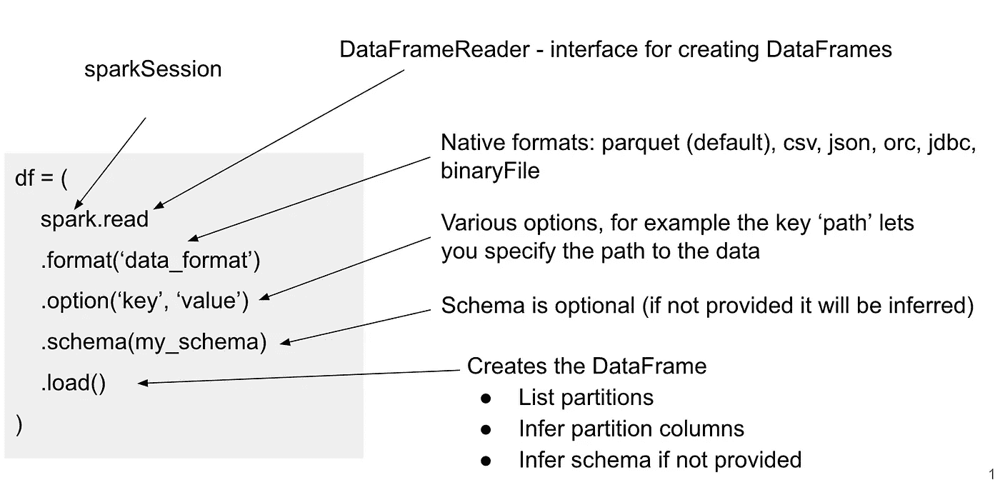
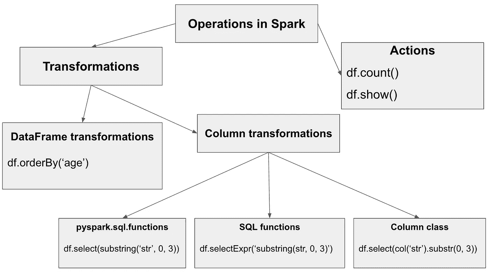

# Spark 3.0 中数据框架的入门指南

> 原文：<https://towardsdatascience.com/a-decent-guide-to-dataframes-in-spark-3-0-for-beginners-dcc2903345a5?source=collection_archive---------11----------------------->

## 从概念上理解转换

Apache Spark 是一个分布式引擎，它为最终用户提供了两个 API 来构建数据处理管道。Apache Spark 3.0 中最常用的 API 是 DataFrame API，它非常流行，特别是因为它用户友好、易于使用、非常有表现力(类似于 SQL)，并且在 3.0 中非常丰富和成熟。该 API 特别适合处理具有某种结构的数据，只需使用几行代码就可以编写一个执行一些重要转换的查询。

在 Spark 中，一件事情可以用不同的方式实现是非常典型的，这种灵活性带来了力量，但有时也带来了困惑。如果有更多的方式，它们之间的区别是什么？哪种方式更好或效率更高？正如我们将看到的，数据帧上的列转换也是这种情况，我们将试图澄清这一点以避免一些误解。

在本文中，我们将解释什么是数据帧，如何创建它，以及如何使用它来执行各种数据转换。我们将在最新的稳定版本中使用 PySpark API，该版本是在撰写本文时(2021 年 1 月)的 3.0 版本。

## 什么是数据帧？

Spark 中的 DataFrame 是一种抽象，它允许我们以一种很好的方式处理分布式数据。它表示具有表格结构的数据，数据集中的每条记录就像包含一些字段的行，每个字段都有名称和数据类型，因此每个字段就像表中的一列。它确实非常类似于数据库中的表，我们只需要记住，DataFrame 表示在处理期间将分布在集群上的数据。此外，如果您的数据没有真正的表格结构，例如，每条记录只是一个带有一些文本消息的字符串，您仍然可以用只有一列的 DataFrame 来表示它。

## 数据帧创建

创建数据帧有六种基本方法:

1.  最基本的方法是转换另一个数据帧。例如:

```
# transformation of one DataFrame creates another DataFrame
df2 = df1.orderBy('age')
```

2.您也可以从 RDD 创建数据框。RDD 是 Spark 中的一种低级数据结构，它也代表分布式数据，主要在 Spark 2.x 之前使用。它慢慢变得更像 Spark 中的内部 API，但如果您愿意，仍然可以使用它，特别是它允许您创建如下数据帧:

```
df = spark.createDataFrame(rdd, schema)
```

3.下一个更有用的方法(尤其是对于原型)是从本地集合创建数据帧，例如，从列表创建数据帧:

```
l = [(1, 'Alice'), (2, 'Bob')] # each tuple will become a rowdf = spark.createDataFrame(l, schema=['id', 'name'])
```

如果您想要测试您的转换，但是您还不想在真实数据上运行它们，这是非常有用的。如果您知道模式，您可以创建一个像这样的小数据帧。

4.对于原型制作，快速创建一个数据帧也很有用，该数据帧将具有特定数量的行，并且只有一个列 *id* ，使用序列:

```
df = spark.range(10) # creates a DataFrame with one column id
```

5.下一个选项是使用 SQL。我们将有效的 SQL 语句作为字符串参数传递给 *sql()* 函数:

```
df = spark.sql("show tables") # this creates a DataFrame
```

6.最后，创建数据帧的最重要选项是从源中读取数据:



这里的选项被指定为键-值对，根据数据的格式有不同的键可用。要检查所有可能的选项，请参见 PySpark [文档](https://spark.apache.org/docs/latest/api/python/pyspark.sql.html#pyspark.sql.DataFrameReader)。这段代码还有各种替代方法和快捷方式，例如:

```
df = spark.read.parquet(path, **options)df = spark.read.format('json').schema(schema).load(path, **options)
```

如果我们的数据源是使用 Hive metastore 存储的，我们可以使用它的表名来访问它，如下所示:

```
df = spark.read.table('table_name')# or just:
df = spark.table('table_name')
```

这实际上更加优雅，因为您不必处理模式、文件格式或数据路径，您需要知道的只是表的名称，Spark 从 metastore 中挑选所有需要的信息。请注意，除了 Hive 表格格式，还有其他表格格式，如 Delta 或 Iceberg，我们可以在一些单独的文章中介绍它们。

因此，我们展示了如何创建数据帧的六种可能方式，正如你所见，所有这些方式(除了第一种)都是从 *spark* 对象开始的，它是 *SparkSession* 的一个实例。Spark session*是在 Spark 应用程序开始时创建的，它是你进入数据帧世界的通行证，没有它你无法创建数据帧。因此，通常在 Spark 应用程序开始时，创建对象如下:*

```
from pyspark.sql import SparkSession**spark** = (
    SparkSession
    .builder
    .appName('name_of_your_application')
    .enableHiveSupport() # if you want to use Hive metastore
    .getOrCreate()
)
```

# 数据帧操作

您可以在数据帧上调用两种类型的操作，即转换和操作。转换是懒惰的，这意味着当您调用它们时，它们不会触发计算，相反，它们只是在幕后构建一个查询计划。所以当你这样打电话的时候:

```
result = df.dropDuplicates(['user_id']).orderBy('age')
```

调用了两个转换，但是没有进行任何计算，数据本身仍然在存储中，等待您处理它。相反，您只是创建了一个 DataFrame *result* ，它具有一个查询计划，该计划表示数据将按照 *user_id* 列进行重复数据删除，并按照 *age* 列进行排序。但是所有这些都将在您具体化查询之后发生，这是您调用一些操作的时候。因此，在调用一个动作(通常是一个请求输出的函数)后，Spark 将触发计算，计算本身由多个步骤组成:Spark 优化器优化查询计划，生成一个物理计划，然后将计划编译成 RDD DAG(有向无环图),该图接下来被划分为在集群上执行的阶段和任务。

如果您想查看查询计划，只需调用:

```
df.explain()
```

要阅读更多关于查询计划的信息，请随时查看我的另一篇[文章](/mastering-query-plans-in-spark-3-0-f4c334663aa4)或观看我在 2019 年欧洲星火峰会上的[演讲](https://databricks.com/session_eu19/physical-plans-in-spark-sql)。

## 数据帧转换

转换本身可以分为两组，数据帧转换和列转换。例如，第一组转换整个数据帧

```
df.select(col1, col2, col3)
df.filter(col('user_id') == 123)
df.orderBy('age')
...
```

最常用的数据帧转换可能如下(但这当然取决于用例):

1.  *select()* ， *withColumn()* —用于投影列
2.  *filter()* —用于过滤
3.  *orderBy()* ， *sort()* ，*sort within partitions()*—用于排序
4.  *distinct()* ， *dropDuplicates()* —用于重复数据删除
5.  *join ()* —对于加入(参见我的另一篇[文章](/about-joins-in-spark-3-0-1e0ea083ea86)关于 Spark 3.0 中的加入)
6.  *groupBy ()* —用于聚合

有关 DataFrame 转换的完整列表，请参见 PySpark [文档](https://spark.apache.org/docs/latest/api/python/pyspark.sql.html#pyspark.sql.DataFrame)中的 DataFrame 类。

## 列转换

另一方面，列转换用于转换单个列，它们用在 *withColumn()、select()、*或 *selectExpr()* 转换中，允许您向 DataFrame 添加新列:

```
from pyspark.sql.functions import initcap# capitalize the first letter of the user name and save it to a new # column name_capdf.withColumn('name_cap', initcap('user_name'))
```

这里，列转换是通过函数 [*initcap()*](https://spark.apache.org/docs/latest/api/python/pyspark.sql.html#pyspark.sql.functions.initcap) 实现的，该函数转换来自 *user_name* 列的字符串。另一方面， *withColumn* 转换是一个数据帧转换，因为它转换整个数据帧—它添加了一个新列。因此，典型的用例是您想要添加一个新列，该列是使用一些转换从其他列派生而来的。

对于列转换，通常可以使用多种不同的方式来表示，在上面的示例中，同样可以使用 *select* (或者等效地使用 *expr* 或 *selectExpr* )来实现:

```
df.select('*', initcap('user_name').alias('name_cap'))df.select('*', expr('initcap(user_name) as name_cap'))df.selectExpr('*', 'initcap(user_name) as name_cap')
```

请注意 *select* 和 *withColumn* 之间的区别，后者投影数据帧中的所有列，并添加一个具有给定名称的新列，而 *select* 仅投影那些作为参数传递的列，因此如果您希望所有列都在其中，您要么需要显式列出它们，要么使用上面的带星号的符号。另外，在 *select* 中转换的结果列将有一个默认名称，所以如果您想使用一个自定义名称，您必须使用 *alias()* 来重命名它。

另外，请注意函数 *expr()* 允许您将 SQL 表达式作为引号中的字符串传递，类似地， *selectExpr()* 只是使用*select()*+*expr()*的快捷方式。在表达式中，您可以使用 SQL [文档](https://spark.apache.org/docs/latest/api/sql/index.html)中的任何 SQL 函数。

现在你可能会对 expr 函数的用例感到困惑，我们很快会解释这一点。在此之前，让我们看看如何表达列转换的另一种方式，它使用了来自[列](https://spark.apache.org/docs/latest/api/python/pyspark.sql.html#pyspark.sql.Column)类的方法。考虑这样一个例子，我们想从单词的开头提取一个长度为 3 的子串。使用来自列类的方法 [*substr()*](https://spark.apache.org/docs/latest/api/python/pyspark.sql.html#pyspark.sql.Column.substr) 我们可以这样做:

```
df.withColumn('new_col', col('user_name').substr(1, 3))
```

正如您所看到的，column 类中的这些方法是在 Column 对象上调用的，您可以使用 *col* 函数或使用点或括号符号来构造该对象，如下所示:

```
# all of these create a column object:col('user_name')
df.user_name
df['user_name']
```

也可以使用 pyspark.sql.functions 包中的 [*substring()*](https://spark.apache.org/docs/latest/api/python/pyspark.sql.html#pyspark.sql.functions.substring) 函数来编写上面的示例，如下所示:

```
df.withColumn('new_col', substring('user_name', 1, 3))
```

这里的 *user_name* 可以是一个字符串——列的名称，也可以是一个列对象，这个函数更加灵活，可以处理这两种情况，这对于这个包中的函数来说是典型的，但是，这种灵活性有其局限性，您马上就会看到。

## 我们来澄清一下

您可能想知道使用带有 *expr* 的 SQL 函数和直接使用 pyspark.sql.functions 包中的函数(我们在这里称之为 DSL 函数)有什么区别。嗯，如果您查看这两个文档( [SQL](https://spark.apache.org/docs/latest/api/sql/index.html) 、 [DSL](https://spark.apache.org/docs/latest/api/python/pyspark.sql.html#module-pyspark.sql.functions) )，您将会看到这些函数中的许多确实是相同的(在某种意义上，它们具有相同的名称并为您提供相同的功能)，但是在某些情况下，SQL 函数更加灵活，允许您实现 DSL 函数不容易实现的功能。

让我们再次考虑带有*子串*的例子，DSL *子串*函数的后两个参数、位置和长度必须是整数——它们不能是列对象。但是有时有一个用例，您需要从另一列获取参数，例如，您希望子字符串的长度是动态的，并且您希望在每一行上使用不同的值。DSL *substring* 函数不允许您这样做——位置和长度需要保持不变，每行都相同。

这是我们上面提到的限制，可以使用 *expr()* 中的 SQL 函数绕过它。考虑这个例子，在这个例子中，我们希望根据一列中的信息生成另一列的子串。假设我们想要获取第一个 *n* 字符，其中 *n* 存储在另一个名为 *len:* 的列中

```
l = [('abcd', 2), ('abcd', 1)]df = spark.createDataFrame(l, ['str', 'len'])df.show()+----+----------+
| str|    len   |
+----+----------+
|abcd|         2|
|abcd|         1|
+----+----------+
```

现在让我们看看我们有哪些选项来实现 *len* 字符的子串:

```
# (1) raises error:
df.withColumn('new_col', substring('str', 1, 'len')) # (2) raises error:
df.withColumn('new_col', substring(col('str'), 1, col('len')))# (3) raises error:
df.withColumn('new_col', substring(col('str'), lit(1), col('len')))# (4) raises error:
df.withColumn('new_col', col('str').substr(1, 'len'))# (5) raises error:
df.withColumn('new_col', col('str').substr(1, col('len')))**# (6) this works:**
df.withColumn('new_col', col('str').substr(lit(1), col('len')))**# (7) this works:**
df.withColumn('new_col', expr('substring(str, 1, len)')).show()+----+---+-------+
| str|len|new_col|
+----+---+-------+
|abcd|  2|     ab|
|abcd|  1|      a|
+----+---+-------+
```

如您所见，我们无法使用 pyspark.sql.package 中的*子串*来完成，每次尝试(1–3)都会失败。但是如果我们使用 SQL API 中的*子串*函数 *expr* 它可以工作(第 7 次尝试)，SQL 函数会更加灵活，并且能够意识到 *len* 实际上是 DataFrame 中一列的名称，它从那里获取长度。我们可以看到使用 *substr* 方法的尝试 6 也是可行的，但是我们需要确保两个参数都是列，这就是为什么我们必须对第一个参数使用*lit(1)*(*lit*函数将从我们传入的常量创建一个列对象)。然而，与 SQL 函数相比，class 列提供的方法并不丰富，所以在其他一些情况下，我们在这里找不到相应的函数。一个这样的例子在[这个](https://stackoverflow.com/questions/57758729/how-to-dynamically-slice-an-array-column-in-spark/57765630#57765630) StackOverflow 问题中讨论过，另一个与 *array_sort* 有关，我在我的另一篇文章[这里](/did-you-know-this-in-spark-sql-a7398bfcc41e)中描述过。

## 列转换-摘要

总而言之，如果您想要创建一个列转换，那么在文档中有三个地方可以找到合适的函数:

*   [pyspark.sql.functions](https://spark.apache.org/docs/latest/api/python/pyspark.sql.html#module-pyspark.sql.functions) (这里我们称之为 DSL 函数)
*   [列类](https://spark.apache.org/docs/latest/api/python/pyspark.sql.html#pyspark.sql.Column)(列类的方法——它们在列对象上被调用)
*   [SQL 函数](https://spark.apache.org/docs/latest/api/sql/index.html)(来自于 *expr* 或者 *selectExpr，*里面要用到的 SQL API，这里我们称之为 SQL 函数)

就性能而言，它们都是等效的，因为它们很懒，只是简单地更新了查询计划。与 DSL 函数相比， *expr()* (或 *selectExpr()* )使用的 SQL 函数有时更灵活，允许您将所有参数作为列名传递。通常你不需要这种额外的灵活性，你决定使用哪种方法通常是风格的问题，也可能是基于团队成员之间关于他们更喜欢在代码库中使用什么的一些共识。

## 高级转换

还有三组更高级的列转换，它们是用户定义函数、高阶函数和窗口函数，我们可以在一些单独的文章中讨论它们，因为它们值得更详细的探讨。简单来说，用户定义的函数允许我们通过一个非常简单的接口来扩展 DataFrame API，因此使用原生 Python (Scala/Java)函数，我们可以实现 API 中尚未提供的任何自定义转换，然后我们可以将它用作列转换。从 Spark 2.4 开始，高阶函数得到了很好的支持，它们用于转换和操作复杂的数据类型，比如数组或映射。窗口函数允许我们计算由窗口和框架定义的多组行的各种聚合或排名。

## 行动

如上所述，动作是我们要求一些输出的函数。这些函数触发计算并在 Spark 集群上运行一个作业。通常的情况是该动作运行一个作业，然而，在某些情况下，它可以运行更多的作业(例如，参见我的另一篇[文章](/did-you-know-this-in-spark-sql-a7398bfcc41e)，其中我解释了为什么 *show()* 函数可以运行更多的作业)。一些典型的操作包括:

*   *count()* —计算由 DataFrame 表示的数据集中的行数。
*   *show()* —在屏幕上打印数据帧所代表的数据集中的 20 条记录。
*   *collect()* —打印屏幕上的所有记录。这应该小心使用，因为它实际上从所有执行器收集所有数据并将其带给驱动程序，这是潜在的危险，因为如果数据很大，它会使驱动程序崩溃，因为它的内存是有限的。如果数据已经被过滤或聚集得足够多，那么它的大小对驱动程序来说不是问题，那么这个函数就很有用。
*   *toPandas()* —这类似于 *collect()* ，但是结果不是一个记录列表，而是一个熊猫数据帧。
*   *take(n)* —也类似于 *collect()* ，但是它只收集 n 条记录。如果您想检查是否有一些数据，或者 DataFrame 是否为空，这可能很有用( *df.take(1)* )。
*   *写入* —创建一个数据帧写入器，允许将数据保存到外部存储器。

让我们来看看描述 Spark 中操作的最后一张图(有一些例子):



## 结论

在这篇笔记中，我们特别介绍了 Spark SQL 和 DataFrames。我们首先解释了什么是数据帧，我们已经看到了创建数据帧的六种方法，并且我们花了一些时间解释了可以用它做什么样的操作。我们还指出了 SQL 函数的灵活性，当您需要从数据帧中以列的形式提供多个参数时，它允许您绕过相应 DSL 函数的限制。我们解释了列转换的各种方法之间的区别，这是一个经常令人困惑的主题，尤其是对于 Spark 初学者来说。