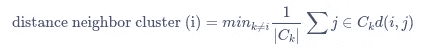

# 对 k-means 的深入探究

> 原文：<https://towardsdatascience.com/a-deep-dive-into-k-means-f9a1ef2490f8?source=collection_archive---------24----------------------->

## 关于最流行的聚类算法，您只需要知道


[Evie S.](https://unsplash.com/@evieshaffer?utm_source=medium&utm_medium=referral) 在 [Unsplash](https://unsplash.com?utm_source=medium&utm_medium=referral) 上拍摄的照片

# 介绍

聚类问题在数据科学中非常常见。潜在的问题总是在你的数据中找到相似的观察组。根据您的领域，这可能是具有相似偏好的客户、在您的生物检测中表现相似的股票或细胞。最大的吸引力在于它是一种无人监管的方法。这意味着你不需要任何标签，而是算法为你找到标签。

最简单的算法是 k-means，我相信您已经听说过它，并且可能使用过它。但我总是发现从头开始编写这些算法很有帮助，即使是简单的算法。今天的帖子结构如下，只需跳转到你最感兴趣的部分，或者阅读所有内容以获得完整图片:

*   k-均值理论简介
*   k 均值实现
*   如何求 k 的理想数
*   k-means 的优缺点
*   与其他聚类算法的关系，如 k-mediods 或模糊 c-means
*   摘要

说到这里，让我们开始吧。

# k 均值理论

无监督学习方法试图在你的数据中找到结构，而不需要你方太多的初始输入。这使得它们对任何类型的应用都非常有吸引力。与任何其他聚类算法一样，k-means 希望将相似的观察值分组在一起，同时分离不相似的点。K-means 只需要 1 个超参数，即 *k* ，期望聚类数。这使得它很容易运行，但也有一些缺点，稍后会讨论。在数学上，k-means 专注于最小化类内平方和(WCSS ),也称为类内方差、类内距离或惯性:


组内平方和的定义。k 表示集群。

其中 k 是集群，||。||是欧几里得范数，在这种情况下是两点之间的欧几里得距离。

由于我们最小化所有的集群 *C* ，我们可以将优化函数写成如下:


k 均值的优化函数

其中|Cᵢ|是群集的基数，即其中的观察值的数量。

人们也可以将其解释为最大化聚类之间的总方差，也称为聚类间距离，如总方差定律所述:

*总方差=解释方差(WCSS) +未解释方差(聚类间距离)*

# k 均值实现

我们将逐一介绍 k-means 的所有步骤。对于这个实现，我试图非常明确，使代码尽可能容易理解。当然，这不是最快的实现，但这里的目标是首先理解。你也可以在我的 [GitHub](https://github.com/MSHelm/algorithms-from-scratch) 上以 RMarkdown 文档的形式关注这个例子。

因为我们将在这个例子中使用 iris 数据集，所以让我们假设我们是园丁。我们辛辛苦苦培育出三种不同的美丽花朵，可惜忘了给幼苗加上标签。它们还没有开花，但我们真的想确保只一起种同样的花。我们现在所能做的就是测量外面的叶子，也就是所谓的萼片。让我们先来看看数据:

```
head(iris)
```


如你所见，数据集包含了关于萼片、花瓣的信息，以及这种植物来自三个物种中的哪一个，这就是我们想要预测的。因此，让我们首先只选择我们示例中的数据:

```
df <- iris[, c(“Sepal.Length”, “Sepal.Width”)] 
plot(df)
```


目测只显示两组，尽管我们预期有 3 种不同的物种。那么让我们看看 k-means 是否也能找到第三组。

## 距离度量

首先，我们需要定义距离度量，我们将使用欧几里德距离来测量每个点到中心的距离:

```
euclidean_distance <- function(p1, p2) {
  dist <- sqrt( (p1[1] - p2[1])^2 + (p1[2] - p2[2])^2 )
  as.numeric(dist)
}
```

这个距离函数当然只对二维情况有效，但是可以很容易地扩展到任何你想要的维度。如果输入是一个 data.frame 或一个命名的 vector，我们将输出封装在对`as.numeric()`的调用中以删除任何名称。

## 初始化

K-means 需要对第一个中心进行初始猜测。这也意味着，我们需要将期望中心的数量输入到算法中，这是 k-means 最突出的缺点之一。我们将在它自己的章节中讨论这一点，现在让我们假设我们知道我们有三个不同的品种。

为了初始化算法，我们简单地从数据集中随机选择三个点。为了强调我们需要在没有替换的情况下这样做，我也写出了这个可选参数，即使默认值已经设置为 FALSE。

```
k <- 3 
centers <- df[sample(nrow(df), k, replace = FALSE), ]
```

## 循环

接下来，我们需要计算每个点到这些中心的距离。

```
distances <- matrix(Inf, nrow = nrow(df), ncol = k)
    for (i in seq_len(nrow(df))) {
      for (j in seq_len(k)) {
        distances[i, j] <- euclidean_distance(df[i, ], centers[j, ])
      }
    }
```

现在我们可以将每个点分配到它最近的中心。为此，我们逐行检查结果，并选择距离最小的条目。

```
cluster_id <- apply(distances, 1, which.min)
```

最后，我们需要计算每个集群的新中心。为了保持高度显式的编码风格，我们也在 for 循环中这样做。

```
for (i in seq_len(k)) {
      this_cluster <- df[cluster_id == i,]
      centers[k, ] <- apply(this_cluster, 2, mean)
    }
```

瞧，这就是一轮 k 均值的全部内容。因为我们在这一步中有效地移动了中心的坐标，所以 k-means 属于坐标下降算法组。

但是当然，一次迭代是不够的。相反，我们需要在数据集上迭代多次，并总是调整我们的中心。在我们的实现中，我们选择在终止之前运行 k-means 定义的迭代次数。要做到这一点，我们可以将所有内容包装在 while 循环中，并放入一个函数中。可选地，如果算法已经收敛(即，中心在两次迭代之间不改变)，或者总 WCSS 的变化低于定义的阈值，则可以包括提前终止的检查。

## 分析我们的测试数据

让我们进行分析，并与真实物种进行比较

```
set.seed(42)
cluster_id <- my_kmeans(data = df, k = 3, n_iterations = 10)
```


正如你所看到的，K-means 确实能够将植物分成三组，这与潜在的地面真相相似。

# 如何求 k 的理想数

正如我们所见，k-means 要求我们输入预期的聚类数。这是一个严重的局限性，因为我们可能不一定事先知道这一点。此外，k-means 将**总是**输出具有指定数量的 *k* 个聚类的聚类，不管这是否有意义。那么我们该如何应对呢？有几种可能的方法。

## 肘法

一种非常常见的解决方案是所谓的肘法。我们用几个候选值 *k* 执行 k-means，然后选择最好的一个。为了进行这种选择，我们使用总 WCSS，即所有集群的 WCSS 的总和。

为了更直观地解释这一点，首先想象一个 k = 1 的例子。所有事件将属于同一个聚类，这意味着总 WCSS 将等于数据集中的总平方和。如果我们将*k*增加到 2，至少一些点将属于第二簇。这将减少第一簇内的 SS，并且总 WCSS 也将更小，因为总 WCSS 具有 *k = 1* 。所以 k*变得越高，WCSS 就越小。在 *k =观测数量*的极端情况下，WCSS 将为 0。*

为了选择最佳的 *k* ，我们需要在 WCSS 的减少和我们的模型对数据的过度拟合之间找到最佳的平衡。肘方法通过选择 WCSS 行为中“弯曲”最强的点来实现。为了说明这一点，让我们在数据中绘制从 1 到 10 的 k 值的行为。从现在开始，我们将使用已经实现的 k-means 方法，因为它更快，并且已经实现了 WCSS，这是结果列表的 *tot.withinss* 元素。

```
within_cluster_ss <- c()
for (k in 1:10) {
  within_cluster_ss[k] <- kmeans(df, k)$tot.withinss
}
```


我们可以推测弯曲最强的点在 *k = 3* 处，但不妨在 *k = 4* 处。

此外，如果能自动获得这个选项，而不需要我们手动选择，那就太好了。我们可以用一个小的助手函数来自动化这个过程。首先，我们在最大值点和最小值点之间拟合一条线。然后我们计算每个点到这条线的距离。距离最高的点是肘点。或者，可以用最大绝对二阶导数来计算点。

事实上，它返回 *k = 3* ，但这只是一个试探。例如，重新运行相同的示例，但是这次在 1 和 20 之间改变 k。您将看到，在这种情况下，它将返回 *k = 4* 作为最佳聚类数。

## 剪影分数

另一种评估哪个 *k* 最符合数据的方法是所谓的轮廓分数。它测量一个聚类中的点的相似性，并将其与其他聚类中的点的相似性进行比较。其范围在-1 和 1 之间，其中-1 表示与其指定的分类非常不相似的点，而 1 表示与其分类高度相似的点。值为 0 表示该点位于两个相邻簇之间的边缘。让我们一步一步来看:

在运行 k-means 之后，对于每个聚类，我们计算每个点到同一聚类中所有其他点的平均距离。也可以将其解释为每个点与其被分配到的聚类有多相似，低值表示高相似性。设 *i* 是聚类 *Cᵢ* 中的数据点，并且 *d* 是距离度量(在我们的例子中是欧几里德距离)。那么这个点 I 到它的集群的距离被定义为:


其中 *|Cᵢ|* 再次是集群的基数，即其中元素的数量。较小的值表示一个与其聚类非常相似的点。

或者，我们可以排除一个点到自身的距离，得到:


在第二步中，我们计算该点与其他聚类的相似性。因此，对于每个其他聚类，我们计算点到属于聚类 *k* 的所有点 *j* 的平均距离。然后，相异度被定义为到最近聚类的平均距离，最近聚类也被称为点 *i* 的“相邻聚类”。



最后，我们需要相互权衡，得出轮廓分数:


让我们假设我们有一个点在它所分配的簇的正中心。在这种情况下，到其分配的聚类的距离为 0，这产生 1:


相反，两个聚类之间的边界处的点到其所分配的聚类的中心和最近的相邻聚类的中心的距离相等。接下来是:


理论上，剪影分数也可以变为负值(直到-1)，这表示一个点应该被指定给不同的聚类。对于 k-意味着不应该发生这种情况，因为我们根据距离来分配点。

对于一个集群只包含一个成员的情况，我们需要定义一个固定的分数。我们选择 0，因为它是介于-1 和 1 之间的中性选择。所以在 *s(i) = 0 的情况下，如果|Cᵢ| = 1*

对于聚类是否良好的程序性评估，通常计算每个 *k* 在所有点上的 *s* 的平均值。然后，我们选择具有最高平均值的 *k* 。

```
silhouette_scores <- c()for (k in 2:10) {
  cluster_id <- kmeans(df, k)$cluster
  silhouettes <- silhouette(df, cluster_id)
  silhouette_scores <- cbind(silhouette_scores, silhouettes)
}colnames(silhouette_scores) <- 2:10
silhouette_scores <- apply(silhouette_scores, 2, mean)
best_k <- names(which.max(silhouette_scores))
```

或者，可以绘制给定 *k* 的所有 *s(i)* 值，并直观地评估聚类:

```
k <- 3
kmeans_res <- kmeans(df, k)
cluster_id <- kmeans_res$cluster
silhouettes <- silhouette(df, cluster_id)
result_df <- data.frame(cluster_id = cluster_id, silhouette = silhouettes)
result_df <- result_df[order(result_df$cluster_id, result_df$silhouette), ]
```


# 聚类结果评估

## 集群基数

我们已经知道集群基数是集群中事件的数量。根据您对数据的了解，您可能期望大小相等的簇，或者大小不同的簇。


我看到一些人建议集群应该总是大小相等，但是我不认为这是真的。如果数据中真的有更多罕见的群体正在形成他们自己的群体呢？对于具有罕见特征的患者、社会网络分析、具有独特基因表达水平的细胞或只是你正在研究的商品制造过程中的差异，这可能是真的。因此，如果您的集群显示出不同的基数，不要太担心，但还是要研究离群值。

## 集群基数与集群数量

聚类大小描述了一个聚类中所有点到其中心的总距离。幸运的是，R 中的 k-means 实现已经为您计算了这些值:


这个值本身并不能提供太多的洞察力，类似于单独的集群基数。但是把两者结合起来会在结果中显示出更好的趋势。直观上，人们会期望具有很少成员(即低基数)的聚类也具有这些点到聚类中心的低总差异。所以这两个值应该是正相关的。如果不是这种情况，这将意味着分散的集群，这可能意味着这些实际上是噪声点。


正如我们所看到的，这个图对于 k*和*的低值没有太大帮助。为了更好地说明这一点，让我们画出 *k = 10* 的结果。我们可以观察到一个明显的异常值:


## 集群特征

最后，最后但可能是最重要的一步是描述您的集群。根据您所在的领域，这可能是维度的简单汇总统计(在我们的示例中，花瓣有多长/多宽)，或者其他描述，如图像强度、基因表达水平等。毕竟，当运行聚类分析时，您感兴趣的是出现了哪些组，所以在找到它们之后详细描述它们！

# k 均值的优势

在深入研究了实现之后，让我们关注 k-means 的一些更高级的特征。这是一种流行的算法，有几个优点:

## 概念上很容易理解

正如我们所看到的，这个理论很简单，人们可以很容易地想象和理解 k-means 背后的概念。

## 它基本上是用所有编程语言实现的

几乎每种常见的编程语言都有 k-means 的实现，这使得在数据集上运行它变得很容易。

## 它只有一个超参数

*k* ，集群的数量

## 它与观察次数成正比。

其复杂度为 *O(n* k *d* i)，其中

*   *n*= d 维向量的数量
*   *k* =集群的数量
*   *i* =收敛前的迭代次数

# k-means 的缺点

另一方面，k-means 的简单性也带来了一些主要的缺点:

## 它需要 k 的先验知识

这是一个主要缺点，因为人们通常不知道数据中存在的聚类数。此外，它将总是准确地返回 k 个集群，不管数据中实际上有多少个是有意义的。我们可以通过尝试不同的 *k* 并选择最好的一个来减轻这一点，但是正如我们所看到的，这也并不总是奏效。

## 这是一种启发式算法

由于实际问题是 NP 难解决的，通常使用启发式算法来寻找解决方案，主要是 Loyd 算法。这意味着返回的结果也可能只是局部最优。

## 它不是决定性的

由于初始化是随机的，我们使用启发式算法，多次运行 k-means 可以返回非常不同的结果。

## 它受到离群值的严重影响

由于欧几里德距离是两点之间的差的平方，异常值会严重影响结果。

## 随着维度的增加，它的伸缩性很差

随着维数的增加，它们之间的欧几里德距离变得非常相似。这就是众所周知的维数灾难。但是如果距离不再有意义，我们的算法也会崩溃。

# k-means 做出的假设

与任何算法一样，有一些明确或隐含的假设

## 聚类是球形的/到中心点的方差是均值

由于距离度量是对称的，它将总是找到具有球形边界的聚类。请注意，这并不意味着它适用于所有圆形的点云，例如考虑环形集群。k-means 将无法从外环中分离内部点云。


## 集群大小相等

有几篇关于堆栈溢出的帖子和帖子在讨论 k-means 是否假设集群应该大小相等。基本度量标准没有明确地做出这种假设，但是从算法的工作方式可以看出这是有意义的。假设我们有两个大小非常不同的集群。因为我们随机选择初始中心，所以我们有很高的概率在大的集群中初始化这两个中心。小集群将无法“吸引”其中一个中心，从而导致错误的结果。为了了解实际情况，让我们构建两个大小分别为 50 和 10000 的集群:


## 尺寸同样重要

这与星团大致呈球形的假设方向一致。如果一个维度的规模比其他维度大得多，它将主导聚类。因此，在聚类之前对数据进行规范化非常重要。

# 与其他聚类方法的关系

K-means 是许多不同聚类变体发展的起点:

## k-表示++的意思

k-means++使用了改进的初始化。它不是随机选择所有初始中心，而是随机选择第一个中心。然后，选择所有后续中心，使它们在新中心和所有现有中心之间具有最大距离。

## k-中间值

k-medians 选择中位数而不是平均值来计算聚类中心。通常，它使用曼哈顿距离而不是欧几里德距离作为其度量，但也可以使用更复杂的度量，如 Kullback-Leibler 散度。

## k-mediods/PAM/k-center

k-mediods 选择聚类中最有代表性的点作为中心，因此中心始终是数据集中的一个实际数据点。这不要与 k-中值混淆，k-中值的中心不必是实际的数据点。这是可以看到的，因为二维的中线可能不是来自同一点！

它还使用了一个略有不同的迭代步骤:在初始化之后，对于每个聚类，它尝试将其包含的每个点作为潜在的新的聚类中心，并挑选一个最小化所选择的相异度度量的点。

最后，它在想要使用的不同度量方面也非常灵活。

## 模糊 c 均值

它不是硬聚类，而是分配每个点属于给定聚类的概率。这意味着一个点可以是多个簇的成员，这在某些情况下可能是有意义的(例如基因属于多个途径)。

## 高斯混合模型

也可以将 k-means 解释为不考虑协方差的高斯混合模型的硬聚类变体。期望步骤是将每个观察值分配到其关闭中心的步骤。最大化步骤是重新计算中心的步骤。

# 摘要

总之，我们已经看到 k-means 是一种简单而直观的算法，可以在基本上任何编程语言中快速应用于数据集。它的主要缺点是需要输入预期的聚类数。尽管如此，它的丰富性和简单性使它成为一个有用的工具，可以快速地在您的数据上运行它以使您熟悉它。