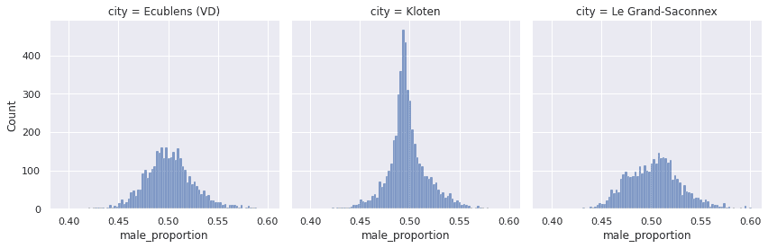

# 如何利用移动数据了解公民的习惯？

> 原文：<https://towardsdatascience.com/a-deep-dive-into-mobility-data-6c76926712be?source=collection_archive---------35----------------------->

## 使用瑞士一天的手机数据的每日趋势和城市分类。

作者图片

从 1 天的移动数据中可以了解到什么？这是我将在这篇博文中回答的问题。我将首先关注数据获取和处理，然后看一看可以从这些匿名数据中获得的洞察力。

我使用的数据来自于 [Swisscom Mobility Insight 平台](https://digital.swisscom.com/products/heatmaps/info)免费试用。瑞士电信是瑞士最大的电信公司。每天大约有 200 亿次手机和网络之间的交互被记录和汇总。这些信息有助于更深入地了解人们如何移动、旅行和生活。

提供了整个瑞士的多个指标，并聚合到 100m x 100m 的切片。可以获得诸如男女性别比例、年龄分布和人口密度等信息。对数据进行 k-匿名化，以避免泄露可能允许识别个人的信息。

所有这些信息都可以从 [Mobility Insight 平台热图 API](https://digital.swisscom.com/products/heatmaps/info) 中每小时或每天获得。由于免费试用只提供 2020 年 1 月 27 日的数据，这将是我关注的一天。

以下代码查询 Swisscom API 并获取瑞士任何给定城镇的数据。由于查询 API 是一个非常耗时的过程，所以决定将重点放在瑞士的部分城市上。用于查询 API 的 python 代码可以在 [Github](https://github.com/Jmion/SwisscomMIP/blob/master/dataFetcher.py) 上找到。

在清理了数据并在 Pandas DataFrames 中做好准备后，这里是我研究的一些见解。

## 男性/女性比例

Alex Iby 在 [Unsplash](https://unsplash.com?utm_source=medium&utm_medium=referral) 上拍摄的照片

y 轴(计数)表示与 x 轴匹配的图块数量。

直方图中男性的比例(%)——按作者分列的图像

用箱线图表示上述数据可以更容易地比较观察到的数值范围。

从上图中我们可以看到，在猫的领地中，每块地上雄性的比例(%)。—作者图片

不出所料，我们可以观察到正态分布。检查你认为正确的事情总是好的，你永远不知道什么时候会出现一些奇怪的事情，迫使你更深入地挖掘数据，以获得一些有趣的见解。

## 一段时间内的年龄分布

[杆长](https://unsplash.com/@rodlong?utm_source=medium&utm_medium=referral)在 [Unsplash](https://unsplash.com?utm_source=medium&utm_medium=referral) 上拍照

可用的数据包含城市中年龄分布的每小时人口统计数据。数据分为 4 类:

作者图片

**洛桑**

作者图片

**苏黎世**

作者图片

在这两个大城市可以看到的趋势是，在工作时间，城市里的年轻人越来越多。

## 人口密度

图片由 [Ishan @seefromthesky](https://unsplash.com/@seefromthesky?utm_source=medium&utm_medium=referral) 在 [Unsplash](https://unsplash.com?utm_source=medium&utm_medium=referral) 上拍摄

随着时间的推移，人口密度的演变似乎是一个潜在的有趣想法。我不知道该从这些数据中期待什么。y 轴表示密度，x 轴表示一天中的时间

人口密度得分在[0，1]之间标准化，以显示城镇中密度的演变趋势，而不是每个城镇之间的密度差异。—作者图片

上面的图表有点拥挤，但它确实显示了至少有两种截然不同的行为。一些城市白天的人口密度似乎有所增加，一些城市似乎有所减少。为了更清楚地了解上面的数据，我们提取了一些城市的非标准化密度图表:

滑雪胜地——作者图片

作者笔下的郊区

大型城镇—作者图片

第一批图表和其他图表有很大不同。Laax 和 Saas-Fee 的惊人图表似乎可能的假设是，我们正在观察滑雪日开始和结束时涌入的滑雪者。似乎这些度假胜地的大多数滑雪者在别处过夜，并往返于度假胜地去滑雪。距离 Saas-Fee 17 公里的 Zermatt 镇的天气向我们展示了一个晴朗的日子，有几朵分散的云和最高零下 6 摄氏度。这是跑步和享受滑下斜坡的美好一天的完美天气。

被分析的其余位置是较大的城镇或郊区。对所观察到的行为的一个可能的解释是，市民在晚上离开之前在白天通勤到这些地方。

## 使用 DBSCAN 进行聚类

使用给定城市的可用数据作为特征向量，并在运行 DBSCAN 之前对其进行归一化，我们可以看到出现了多个集群。所使用的特征向量是使用按年龄类别划分的男性比例的日平均值以及我们之前刚刚看到的小时密度构建的。DBSCAN 产生了以下聚类:

使用 PCA(主成分分析)进行可视化，以提供有意义的可视化。集群 0，1，3 都是滑雪场。第二类是工业很少的城镇，但有许多人居住和通勤上班。集群 4 是较大的城镇。—作者图片

查看集群 2 的人口密度

作者图片

从上面的探索中，我们已经表明，通过简单地使用往返于这些位置的市民的移动性信息，可以将城市分为大的类别，如郊区、旅游滑雪场或大城市。

## 结论

移动数据是一个很好的信息来源，可以用来了解我们城市的功能。

从我们的分析中，我们观察到，查看移动数据可以让我们识别有滑雪的城镇。人口统计还显示，年轻人在上学期间前往城市中心。

在 SARS-COV2 疫情期间，这一数据变得更有价值，因为它提供了一种数字方法来衡量瑞士公民习惯的变化。

用于产生这个数据故事的所有代码和笔记本都可以在 Github 上的[这里](https://github.com/Jmion/SwisscomMIP)获得。