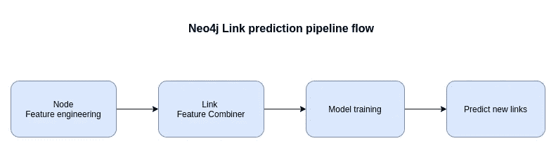

# 深入探讨 Neo4j 链接预测管道和 FastRP 嵌入算法

> 原文：<https://towardsdatascience.com/a-deep-dive-into-neo4j-link-prediction-pipeline-and-fastrp-embedding-algorithm-bf244aeed50d?source=collection_archive---------7----------------------->

## 了解如何在 Neo4j 图形数据科学库中训练和优化链接预测模型，以获得最佳结果

在我的[上一篇博文](/analyzing-travel-logs-of-digital-nomads-with-neo4j-graph-data-science-b7a13d6ba544)中，我介绍了 [Neo4j 图形数据科学](https://neo4j.com/docs/graph-data-science/current/)库中最新可用的链接预测管道。自从这篇文章发表后，我花了更多的时间来深入挖掘和了解管道的内部工作原理。我一路走来学到了一些东西，想和大家分享一下。首先，我打算展示链接预测管道如何组合节点属性来生成链接预测模型的输入特征。然而，当我开发内容时，我注意到了一些关于使用 FastRP 嵌入算法的见解。因此，在这篇博文结束时，您将有望了解更多关于 FastRP 嵌入模型的知识，以及如何将多个节点特征组合起来作为链接预测模型的输入。

这篇文章中使用的代码可以在 [GitHub](https://github.com/tomasonjo/blogs/blob/master/lp-combiner/Link%20prediction%20combiner.ipynb) 上获得。

## 图形导入

我必须找到一个小的网络，这样我就可以很容易地想象我们进行的结果。我决定使用《权力的游戏》第一季电视节目中的[互动网络，该网络由](https://networkofthrones.wordpress.com/)[安德鲁·贝弗里奇](https://www.macalester.edu/mscs/facultystaff/andrewbeveridge/)提供。


图形模型。图片由作者提供。

图形模型由角色及其交互组成。我们将交互关系视为无向的，其中人物 A 与人物 B 交互，这直接暗示人物 B 也与人物 A 交互。我们也知道两个人物交互了多少次，并且我们将该信息存储为关系属性。

如果你想跟随这篇文章中的例子，我推荐在 [Neo4j 沙箱](https://neo4j.com/sandbox/)中使用一个空白项目。它是 Neo4j 数据库的免费云实例，预装了 APOC 和图形数据科学插件。

GitHub 上提供了数据集[，因此我们可以使用以下 Cypher 查询轻松地将其导入 Neo4j:](https://github.com/mathbeveridge/gameofthrones)

```
LOAD CSV WITH HEADERS FROM "https://raw.githubusercontent.com/mathbeveridge/gameofthrones/master/data/got-s1-edges.csv" as row
MERGE (s:Character{name:row.Source})
MERGE (t:Character{name:row.Target})
MERGE (s)-[i:INTERACTS]-(t)
SET i.weight = toInteger(row.Weight)
```

## 链路预测流水线

在引擎盖下，Neo4j 中的链接预测模型使用逻辑回归分类器。我们正在处理一个二元分类问题，我们想要预测一对节点之间是否存在链接。在高层次上，链路预测流水线遵循以下步骤:



图片由作者提供。

在这篇文章中，我们将关注前两个步骤，所以让我们仔细看看那里发生了什么。


链接预测流水线的特征工程。图片由作者提供。

作为第一步，您必须定义节点特性。例如，您可以使用自定义节点属性，如年龄或性别。还可以使用 PageRank 或介数中心性等图算法作为初始节点特征。在这篇博客文章中，我们将从使用 FastRP 节点嵌入来定义初始节点特性开始。FastRP 嵌入算法的优点在于，它可以捕获网络信息，并保持图中相邻节点之间嵌入空间的相似性。目前，您不能使用成对信息作为输入要素，如共同邻居的数量或一对结点之间的最短路径的长度。

在第二步中，链接要素组合器根据一对结点属性创建单个要素。目前，有三种技术可用于将一对节点属性合并到单个链接特征向量中:

*   余弦距离
*   L2 或欧几里德距离
*   哈达玛乘积

在上面的例子中，我使用了 Hadamard 乘积将一对节点属性组合成一个链接特征向量。所有可用的链接特征组合器技术都是顺序不变的，因为链接预测流水线目前仅支持预测无向关系。您可以在单个管道中使用多个链路特征组合器来定义几个特征向量，然后将这些向量连接起来作为链路预测模型的输入。稍后我会带你看一个例子。

定义结点要素和链接要素组合器后，您可以训练模型来预测新的连接。

## 节点特征工程

您可以在定义链接预测管线之前预处理节点特征。如果仅使用图算法(如节点嵌入或中心性测量)作为节点特征，也可以将它们直接包括在管道定义中。在第一个例子中，我们将使用 FastRP 嵌入作为我们的链路预测模型节点特征。因此，我们有可能将它们包含在管道定义中。然而，我们将首先对节点嵌入结果做一个简短的分析，因此在深入管道定义之前，我们需要将节点嵌入存储到图中。我们从投影一个无向图开始。请看一下[文档](https://neo4j.com/docs/graph-data-science/current/)以获得关于图形数据科学库内部工作的更多信息。

```
CALL gds.graph.create('gots1', 'Character', 
  {INTERACTS:{orientation:'UNDIRECTED', properties:'weight'}})
```

我们将使用 Louvain，一种社区检测算法，来帮助我们更好地理解 FastRP 嵌入算法的结果。您可以使用下面的 Cypher 查询将社区结构信息存储回数据库。

```
CALL gds.louvain.write('gots1', 
  {writeProperty:'louvain', relationshipWeightProperty:'weight'})
```

在这篇博文中，我将使用 Neo4j Bloom 来可视化算法和链接预测的结果。如果你想学习如何用 Bloom 可视化网络，请看一下本指南。


网络的社区结构。节点根据它们所属的社区进行着色。图片由作者提供。

现在我们可以继续执行 FastRP 嵌入算法了。该算法将为图中的每个节点产生嵌入或固定大小的向量。我的朋友 [CJ Sullivan](https://medium.com/u/a9bc11f7a61b?source=post_page-----bf244aeed50d--------------------------------) 给[写了一篇很好的文章](/behind-the-scenes-on-the-fast-random-projection-algorithm-for-generating-graph-embeddings-efb1db0895)解释了 FastRP 算法的内部工作原理。

```
CALL gds.fastRP.write('gots1', 
  {writeProperty:'embedding', embeddingDimension:56, relationshipWeightProperty:'weight'})
```

首先，我们将使用 t-SNE 散点图可视化来评估 FastRP 嵌入。存储的节点嵌入是长度为 56 的向量，由**嵌入尺寸**参数定义。t-SNE 算法是一种降维算法，我们可以用它将嵌入维数降低到两维。长度为 2 的向量允许我们用散点图来形象化它们。我用于降维和散点图可视化的 Python 代码是:

该代码产生以下可视化效果:


FastRP 嵌入的 t-SNE 散点图可视化。使用 Louvain 算法，基于节点所属的社区对节点进行着色。图片由作者提供。

FastRP 嵌入和 Louvain 算法是独立执行的，但是，我们可以观察到 FastRP 嵌入在嵌入空间中聚集了相同社区中的节点。这并不奇怪，因为 FastRP 是一种基于社区的节点嵌入算法，这意味着在图中接近的节点在嵌入空间中也是接近的。接下来，我们将评估图中节点之间的余弦相似性。

```
MATCH (c:Character)
WITH {item:id(c), weights: c.embedding} AS userData
WITH collect(userData) AS data
CALL gds.alpha.similarity.cosine.stats({
  data: data,
  topK: 1000,
  similarityCutoff: 0.1
})
YIELD nodes, similarityPairs, min, max, mean, p25, p50, p75, p90, p95, p99
RETURN nodes, similarityPairs, min, max, mean, p25, p50, p75, p90, p95, p99
```

*结果*

图中所有节点之间的平均余弦相似系数约为 0.5。大约 25%的节点对具有大于 0.81 的余弦相似性。嵌入空间中的节点非常相似，因为我们有一个只有 126 个节点的小图。接下来，我们将评估由关系连接的节点对之间的余弦和欧几里德距离。

*结果*


用关系连接的大多数节点对具有高余弦相似性。同样，这是意料之中的，因为 FastRP 被设计成将网络拓扑结构转换成嵌入空间。因此，我们期望图中的相邻节点在嵌入空间中非常相似。我们将检查余弦相似度小于 0.5 的网络中连接的节点对，因为这有点出乎意料。首先，我们必须用 Cypher 标记它们:

```
MATCH p=(c1:Character)-[i:INTERACTS]->(c2:Character)
WHERE gds.alpha.similarity.cosine(c1.embedding, c2.embedding) < 0.5
SET i.show = True
```

现在，我们可以用 Neo4j Bloom 来想象它们。


余弦相似度小于 0.5 的节点对之间的关系。图片由作者提供。

看起来具有较低余弦相似性的连接节点对主要出现在我们在网络中的各种集群或社区之间具有连接时。如果你记得 t-SNE 可视化，相同社区中的节点在嵌入空间中被很好地分组。然而，我们在来自不同社区的节点之间有一些关系。当我们有来自不同社区的节点之间的连接时，它们的相似性会降低。这些节点似乎有更高的等级，这意味着它们在自己的社区内有许多链接，然后有几个链接指向其他社区。因此，它们更类似于其社区内的邻居，而不太类似于来自其他集群的邻居。

## 链接特征组合器

我们已经准备好嵌入，并且我们知道成对的连接节点很可能在嵌入空间中具有高余弦相似性。现在，我们将评估不同的链路特征组合器如何影响链路预测模型的输出。

**余弦组合器**

有趣的是，我们要看的第一个组合器是余弦相似性组合器。


余弦链路特征组合器。图片由作者提供。

链接要素组合器获取成对的结点要素，并将它们组合成一个链接要素，然后将其用作预测新链接的逻辑回归模型的训练数据。我们已经完成了余弦相似性分析，因此我们知道具有高余弦相似性的节点对很可能是相连的。因此，您可能会想象新的预测链接将位于具有高余弦相似性的尚未连接的节点对之间，因为这正是我们的训练数据看起来的样子。

我们将用于生成链接预测的 Python 脚本是:

这是一个有点长的脚本，因为我们需要为每个链接特征组合器选项定义整个链接预测管道。最后，预测的链接被存储到 Neo4j，这样我们就可以用 Bloom 来可视化它们。在我的[前一篇博文](/analyzing-travel-logs-of-digital-nomads-with-neo4j-graph-data-science-b7a13d6ba544)中，我对管道做了一步一步的解释。如前所述，我准备了一个 [Jupyter 笔记本，里面有所有的代码](https://github.com/tomasonjo/blogs/blob/master/lp-combiner/Link%20prediction%20combiner.ipynb)，所以你不用直接从博文里复制。

让我们使用余弦链接特征组合器来检查预测的链接。


使用余弦链接特征组合器预测的前 20 个链接。图片由作者提供。

具有预测链接的结点对的平均欧几里德相似度和余弦相似度为:

正如我们可以想象的，预测链接的节点之间的余弦相似性平均为 0.999。因此，结果与我们的训练数据一致。此外，我们可以从结果中了解一些关于 FastRP 嵌入的信息。低度的外围节点在嵌入空间中非常相似，即使它们不是直接相连的。例如，可视化图像左下角的蓝色节点都非常相似。所有四个节点只有一个关系，它们共享唯一的邻居节点。

**L2 链接特征组合器**

接下来，我们将看看 L2 链接功能组合器。L2 链接要素合并器计算两个结点要素之间的欧几里德距离。


使用 L2 链接特征组合器预测的前 20 个链接。图片由作者提供。

结果几乎与余弦链接特征组合器相同。看起来 FastRP 嵌入算法优化了网络中相邻节点之间的余弦和欧几里德距离相似性。

**哈达玛链接特征组合器**

哈达玛链接要素组合器使用哈达玛乘积来生成链接要素。哈达玛乘积就是简单的熵乘。


哈达玛链路特征组合器。图片由作者提供。

让我们使用 Hadamard 链接要素组合器来检查预测的链接。


使用 Hadamard 链接特征组合器预测的前 20 个链接。图片由作者提供。

具有预测链接的结点对的平均欧几里德相似度和余弦相似度为:

一些预测的链接类似于余弦和欧几里德链接特征组合器结果。例如，红色社区中的预测链接几乎完全相同。另一方面，该模型预测在蓝色集群的中心而不是外围有更多的链接。

## 使用多链路特征组合器

在前面的示例中，我们仅使用了一个链路特征组合器。在余弦或 L2 链接特征组合器的情况下，我们有效地仅将单个输入特征用于逻辑回归模型。实际上，拥有多个最能描述您的领域的输入要素是有意义的。作为演示，我们将添加优先附件输入作为第二个链接功能。看 Neo4j 中的[文档，优先附着定义为一对节点之间乘以节点度。在实践中，优先连接模型假设具有较高节点度的节点更有可能形成新的连接。遗憾的是，我们还不能自动添加优先附件链接功能，但我们可以手动添加。为了添加优先附件输入特征，我们将首先计算所有节点的节点度值。有时您希望使用逻辑回归模型对输入要素进行归一化，因此我将向您展示如何在链接预测管道中直接缩放要素。然后，我们只需添加 Hadamard 链接特征组合器，它会将输入矩阵相乘，在本例中是节点度数。因此，如果我对数学的理解正确的话，得到的链接特征应该代表优先连接，因为我们有效地增加了节点对之间的节点度数。](https://neo4j.com/docs/graph-data-science/current/alpha-algorithms/preferential-attachment/)


在链路预测流水线中使用多个链路特征组合器。图片由作者提供。

在链路预测管道中，您可以拥有任意数量的链路特征组合器。然后，所有链路特征组合器的结果被连接成单个向量，该向量被用作链路预测逻辑回归模型的输入。我们可以将度数计算和缩放直接添加到管道中，而不必预先准备度数特性。

我们需要将以下三个步骤添加到我们的管道中。第一个查询将度值变异为命名图。第二步将使用 MinMax scaler 缩放度数值，并将其转换为 scaledDegree 属性。最后，我们使用 Hadamard 链接特征组合器来组合节点度数。最后，我们将快速评估添加二级链接要素对链接预测结果的影响。

我们使用具有 FastRP 嵌入的余弦链接特征组合器和具有缩放节点度的 Hadamard 组合器得到以下结果。


图片由作者提供。

添加二级链路功能会将预测链路从网络外围转移到中心。在某种程度上，这是有意义的，因为优先连接更喜欢度数较高的节点之间的链接，而这些节点通常位于网络的中心。

使用具有 FastRP 嵌入的欧几里德链接特征组合器和具有缩放节点度的哈达玛组合器，我们得到以下结果。


次要链接特性并没有真正影响结果。我还尝试不缩放节点度数值，然后预测的链接会强烈地向中心移动。


使用 Hadamard 链接特征组合器而不缩放节点度数。图片由作者提供。

如果我们在使用 Hadamard 合并器之前不缩放节点度数，优先连接特征将成为主导。因此，预测的链路是在具有高度数的节点之间，而不是在外围的低度数节点之间。

## **结论**

我真的很喜欢写这篇博文，并且在这个过程中学到了很多关于 FastRP 嵌入算法和链接预测管道的知识。简要总结如下:

*   FastRP 更有可能在相邻节点之间分配相似度较低的高相似度
*   另一方面，不同社区的连接节点之间的余弦相似度可以低于 0.5
*   使用多个链接要素组合器可以帮助您更好地描述您的领域
*   缩放节点特征影响链接预测逻辑回归模型的结果

我鼓励你开始一个[免费的 Neo4j 沙盒项目](https://neo4j.com/sandbox/)，并开始在你的图表中预测新的连接。让我知道进展如何！

和往常一样，代码可以在 [GitHub](https://github.com/tomasonjo/blogs/blob/master/lp-combiner/Link%20prediction%20combiner.ipynb) 上获得。