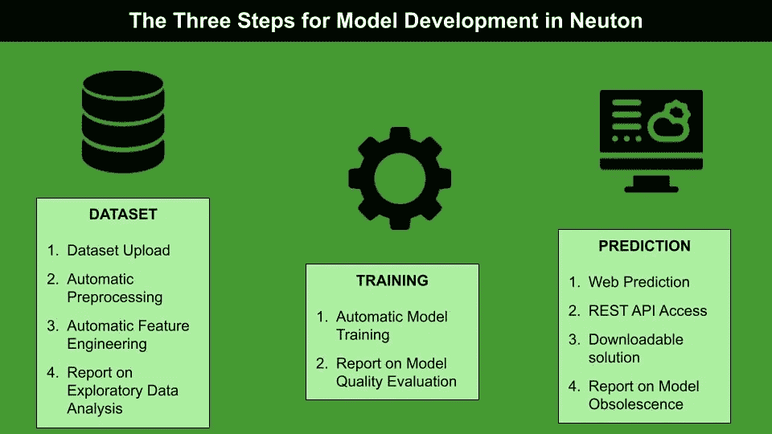
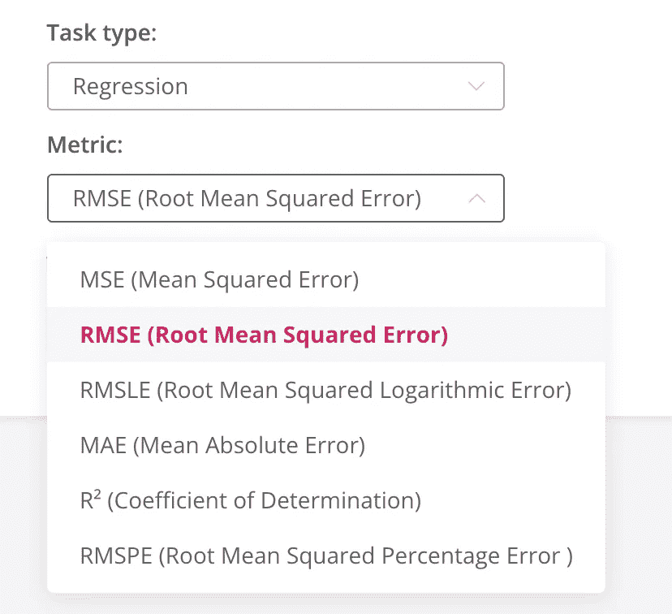
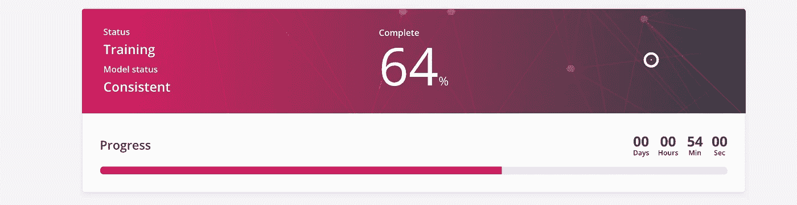
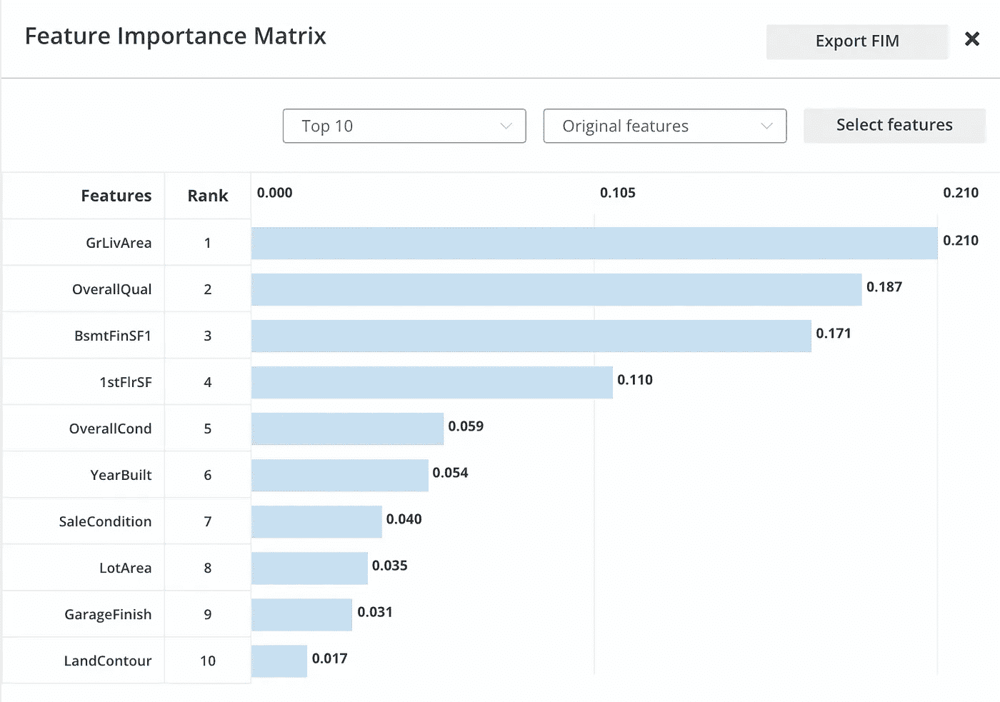
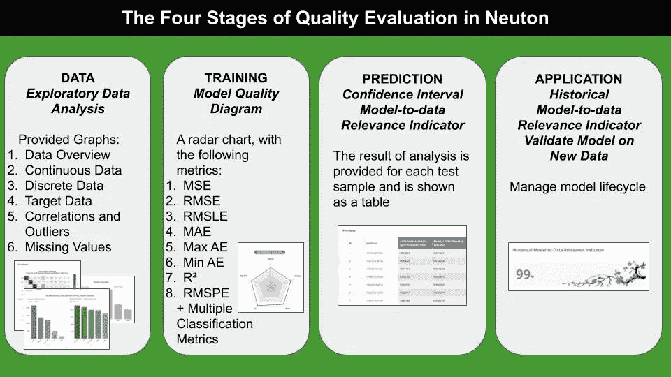
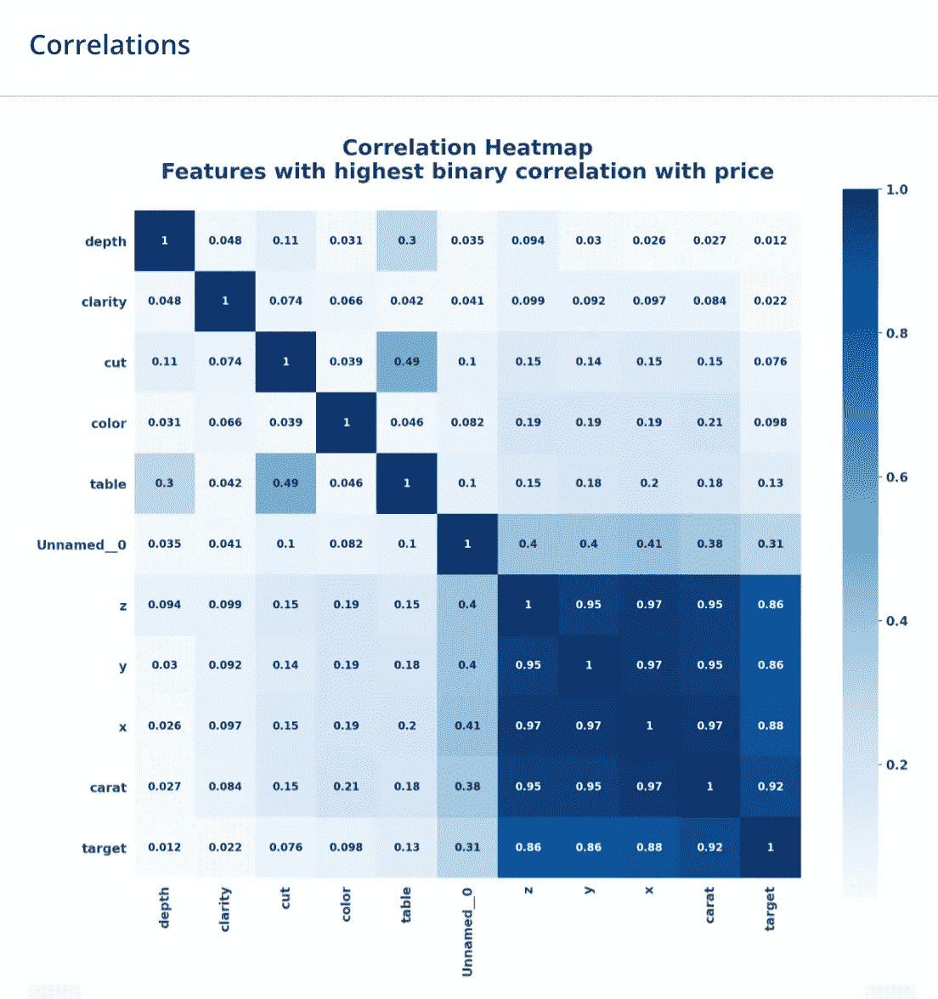
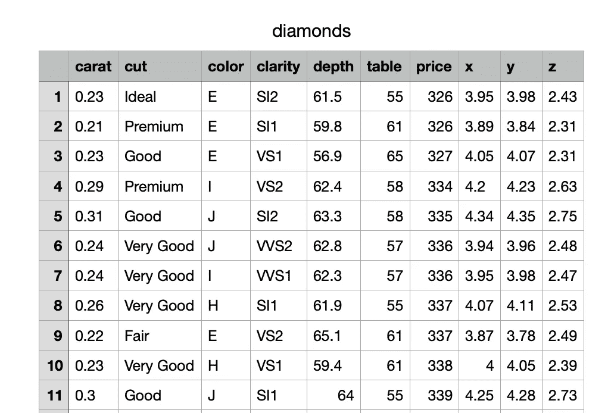
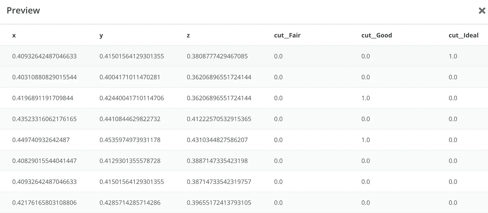
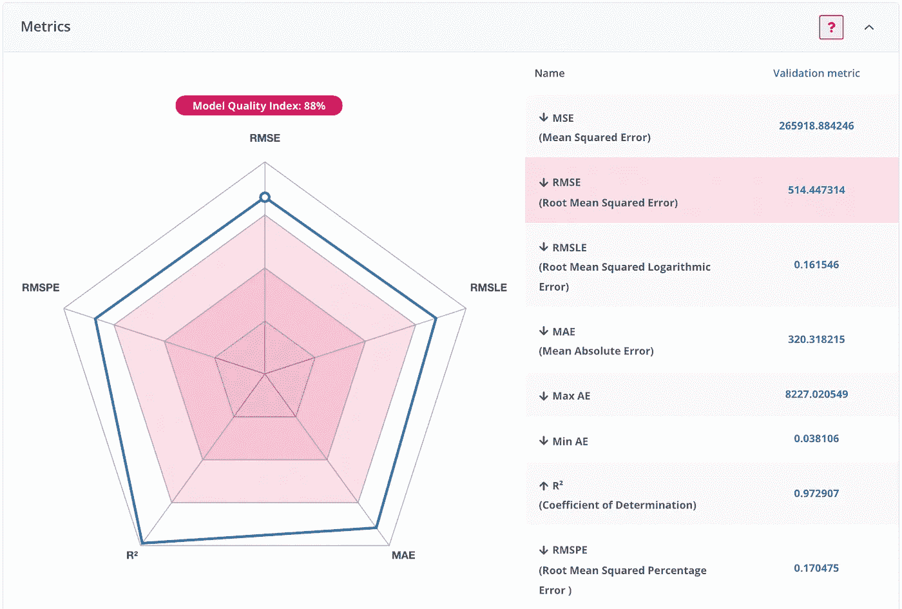

# 深入内乌顿

> 原文：<https://towardsdatascience.com/a-deep-dive-into-neuton-dab72db4b2d0?source=collection_archive---------25----------------------->

## 机器学习

## 平台概述、其功能和使用示例。

作者图片

几天前，我发现了一个非常有趣的基于云的平台，名为[内乌顿](https://bit.ly/3aWpKsa)，它允许**建立机器学习模型，无需任何编码或机器学习知识**。在实践中，您可以通过三个简单的步骤开发一个高性能模型:

*   上传数据集
*   训练模型
*   做预测

在这篇文章中，我给出了一个内乌顿的概述，它是如何工作的，以及一个它的用法的例子。内乌顿的免费版本在[这里](https://bit.ly/3jlaARD)有，你可以试试:)

# 1 内乌顿概述

内乌顿是一个基于云的平台，它允许在没有任何机器学习知识的情况下开发高性能的机器学习模型。与其他现有解决方案相比，**内乌顿不需要安装任何软件或库**。唯一的要求就是[在平台中创建一个账号](https://bit.ly/3jlaARD)并开始使用。

根据作者的说法，**内乌顿基于一种神经网络** (NN) 独特的专利算法，该算法在不断交叉验证的训练过程中，从单个神经元自动增长神经网络，并在模型过度拟合之前停止。**所以没有预定义的 NN 架构！很刺激，对吧？**

此外，**部署在内乌顿的型号可以很容易地嵌入到微型设备中，因为它们的尺寸很小**。

内乌顿的有趣之处在于其*自我组织*的能力，无需数据科学家的外部干预，即可进行数据预处理、参数调整等。内乌顿甚至警告说，如果一个模型已经过时，需要用一组新的数据进行训练。

# 2 与内乌顿合作

当你登录内乌顿时，你会看到一个非常友好的界面。您可以在旅程开始时添加新的解决方案(即项目)。一旦你创建了一个新的解决方案，你只需要执行三个简单的步骤:数据集，训练，预测。

作者图片

## 2.1 数据集

第一步涉及数据集上传。您的数据集必须满足[数据集要求](https://lab.neuton.ai/#/support_library/user_guide/TRAINING_DATASET_REQUIREMENTS)，包括(但不限于)以下方面:

1.  数据集必须是 CSV 文件，其中第一行必须指示列名。
2.  文件格式必须是 utf-8。

数据集是否已经用数据预处理或特征工程技术进行了预处理并不重要。上传一个合理组织的数据集就足够了，数据集也可能包含缺失值、重复值等。无论如何，内乌顿也提供了一个高级模式，在这里你可以执行基本的操作，启用/禁用数据预处理和特征工程，训练时间限制和时间序列分析设置。

下一步包括在数据集的可用列中选择**目标变量**。然后，您可以选择任务类型(回归、二元分类或多类分类)，以及要考虑的度量标准。您可以从许多指标中进行选择，如下图所示:

作者图片

## 2.2 培训

在内乌顿训练是最简单的任务。你所需要做的就是按下按钮开始训练。

作者图片

云中会创建一个临时虚拟机来执行您的培训任务。培训可能需要一些时间。但是，有一个进度条显示完成的百分比。**也可以在训练操作结束时通过电话接收消息**。

作者图片

## 2.3 预测

一旦模型被训练，相应的虚拟机就被关闭，并且该模型可以被用于执行预测或者被下载以被部署用于生产。

必须通过界面中的特定按钮启用预测:

作者图片

预测可以在三个级别上执行:

*   网络预测
*   REST API 访问
*   可下载的解决方案

预测结果可以导出为 CSV 文件，也可以在内乌顿进行分析。

## 2.4 模型质量评估

内乌顿提供了一个可解释办公室，即一套允许解释和评估模型的工具。

**解释**根据模型解释器和特性重要性矩阵，提供对模型逻辑的理解。

*模型解释器*解释其预测背后的模型原理。此外，该工具还回答了“如果...会怎么样”的问题:“如果我更改了任何要素的任何值会怎么样-预测会如何变化……”这是理解数据的一个很好的机制，一定要尝试一下。

顾名思义，*重要性矩阵*显示了模型中每个特性的重要性。重要性矩阵以有序条形图的形式提供，其中显示了前 10 项或后 10 项功能，如下图所示:

作者图片

**模型评估**在流程的每一步执行，从数据集上传、探索性数据分析到最终应用，在最终应用中，您可以根据新数据验证模型。下图显示了如何在流程的每个阶段执行模型评估:

作者图片

所有提供的图表都经过精心策划，易于阅读。下图显示了由内乌顿 EDA 提供的关联热图示例:

作者图片

# 3 用法示例

作为一个数据集示例，我将测试 Kaggle 上的[钻石数据集](https://www.kaggle.com/shivam2503/diamonds)，这是我在 [Bex T.](https://medium.com/u/39db050c2ac2?source=post_page-----dab72db4b2d0--------------------------------) 发表的一篇题为[厌倦了陈词滥调的数据集？这里有来自所有领域的 18 个令人敬畏的选择。](/tired-of-cliché-datasets-here-are-18-awesome-alternatives-from-all-domains-196913161ec9)

Diamond 数据集拥有 50，000 多条记录，可用于回归和多类分类任务。在我的例子中，我关注回归。

作者图片

数据集包含分类字段和数值字段。作为目标列，我考虑*价格。*

一旦数据集上传到内乌顿，预处理就会以惊人的速度自动执行。下图显示了预处理后数据集的一些列:

作者图片

有趣的是，**切割**特征，最初是一个分类特征，现在已经被分割成许多数字特征。这个过程称为一次热编码。此外，所有的数字特征已经自动地[标准化](/data-preprocessing-with-python-pandas-part-3-normalisation-5b5392d27673)和[标准化](/data-preprocessing-with-python-pandas-part-4-standardization-ccd5b1608f1c)。

> 内乌顿的惊人之处在于，只需点击几下鼠标，预处理任务就能完成，不需要人工分析数据集！

为了训练模型，我选择优化 RMSE 度量。训练过程可能需要一个多小时，训练结束后，会显示以下雷达图:

作者图片

整体模型质量指数为 88%，MAE 为 320.32。与相应的[最高票数的 Kaggle 模型](https://www.kaggle.com/shrutimechlearn/types-of-regression-and-stats-in-depth)相比，其中 MAE 为 731.44，**内乌顿表现更好。**

# 摘要

在这篇文章中，我描述了内乌顿，一个非常强大的机器学习平台，它不需要任何机器学习或类似的知识。得益于专有的神经网络算法，内乌顿实现了非常高的性能，这引发了以下问题:

> 是否仍然有必要使用传统的机器学习方法来开发预测模型，或者像内乌顿这样的平台可能是未来的发展方向？

你可以在评论里回答这个问题。

如果你读到这里，对我来说，今天已经很多了。谢谢！你可以在[这篇文章](https://alod83.medium.com/which-topics-would-you-like-to-read-c68314dc6813)中读到更多关于我的信息。

# 你愿意支持我的研究吗？

你可以每月订阅几美元，解锁无限的文章——[点击这里](https://alod83.medium.com/membership)。

# 额外奖金

由[达里奥·拉德契奇](https://medium.com/u/689ba04bb8be?source=post_page-----dab72db4b2d0--------------------------------)撰写的一篇非常有趣的文章，题为 [NeutonAI:介绍一个非常有效的无代码 AutoML 平台](/neutonai-introducing-a-remarkably-effective-no-code-automl-platform-454ca935f708)解释了如何一步一步地使用内乌顿网络界面。

# 相关文章

</how-to-spend-your-time-when-you-are-waiting-for-a-data-analysis-output-e71b383f43cb>  </a-complete-data-analysis-workflow-in-python-pycaret-9a13c0fa51d4>  </automl-in-python-a-comparison-between-hyperopt-sklearn-and-tpot-8c12aaf7e829> 