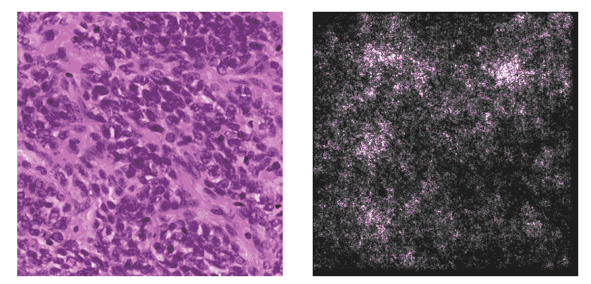
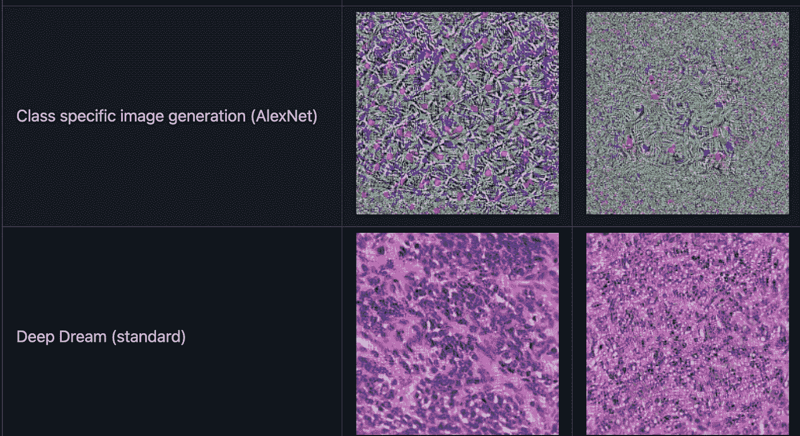
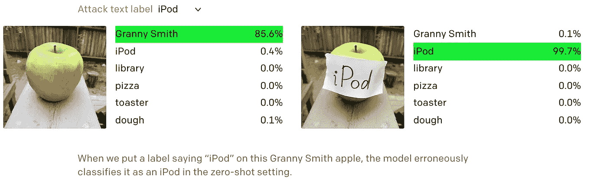

# 深入探究具有多模态神经元的 OpenAI 剪辑

> 原文：<https://towardsdatascience.com/a-deep-dive-into-openai-clip-with-multimodal-neurons-a7dbbd963ef6?source=collection_archive---------25----------------------->

## [模型可解释性](https://towardsdatascience.com/tagged/model-interpretability)

## 探索剪辑的可解释性和可视化它的激活揭示了许多令人惊讶的事实！

照片由[莫里茨·金德勒](https://unsplash.com/@moritz_photography?utm_source=medium&utm_medium=referral)在 [Unsplash](https://unsplash.com?utm_source=medium&utm_medium=referral) 上拍摄

几个月前，OpenAI 发布了 [CLIP](/open-ai-clip-learning-visual-concepts-from-natural-language-supervision-d02644969278) ，这是一个基于转换的神经网络，使用对比语言-图像预训练来对图像进行分类。CLIP 的表现令人印象深刻，因为它使用了一种不寻常的方法，将文本和图像结合起来作为图像分类的输入。通常，只有一份报纸吹嘘新的最先进的性能，存档一些非常高的分数，就是这样。CLIP 最棒的是，前几天又出了一篇小论文，探讨 CLIP 的可解释性。

> 我们的[论文](https://distill.pub/2021/multimodal-neurons/)基于近十年来对解释卷积网络的研究，从观察到许多经典技术可直接应用于 CLIP 开始。我们使用两个工具来理解模型的激活: ***特征可视化*** ，它通过对输入进行基于梯度的优化来最大化神经元的放电，以及 ***数据集示例*** ，它查看来自数据集的神经元的最大激活图像的分布。

来源: [OpenAI](https://openai.com/blog/multimodal-neurons/)

这篇论文非常有趣，因为它揭示了许多有用的信息，有助于解释为什么 CLIP 表现如此出色。就我个人而言，我对神经网络可解释性的话题非常感兴趣，只是因为我最近了解到，将一个实际的人工智能模型投入生产是非常重要的。

使用特征可视化(我稍后会谈到)，CLIP 的作者开始在两个层次上检查模型。第一个是神经元水平，所以他们会在网络中传递一些相似的图像，并检查相同的神经元是否被激活了相似的数量。这非常有趣，因为举例来说，如果你有一个对动物进行分类的网络，想象一下你有一个“狗神经元”，或者一个“猫神经元”。此外，如果在你完成分析后，你的网络未能对某种动物进行分类，你会知道去哪里找！

这里有很多要谈的，我想这篇文章会谈到很多领域。最有趣的事情之一实际上是看看激活图，由于许可问题，我不能在这里包括它们，但我强烈建议你去那里看看。另一个有趣的领域(也是我将在这里讨论的领域)是基于图像的神经网络的可解释性，以及它们从分析中实际获得了什么好处。

**特征可视化**

图片由作者提供。在左边，你可以看到一张组织病理学幻灯片。右边可以看到 DeepDream 激活图，白色像素显示高激活像素，黑色像素显示低激活。

因此，我通常会关注事情的“新闻”方面，我的文章最重要的结果是总结最近发布的模型。然而，在谈论 CLIP 之前，我想解释一下这里最常见的模型可解释性技术是如何工作的。我认为这将是非常有益的读者，因为它不会是一个剪辑具体的解释(因此可以适用于其他模型)。如果您不感兴趣，可以跳过“特性可视化”这一节

解释该系统的第一步是实现文献中的以下三种方法。虽然神经网络解释领域是一个相对较新的发展，但这些方法已经在一系列问题上取得了成功。

1.  **类显著图**

这种模型解释方法包括根据给定图像的像素对该图像所获得的类别分数的影响来对该图像的像素进行排序。我们首先考虑一个使用线性模型的简化示例。对于矢量化的图像 I 和类别 c，通过求导我们可以看到，图像 I 的像素的重要性由权重向量 wc 的分量给出。这里我们看到了这个方法的关键思想。权重值的大小显示了图像中的哪些像素最需要改变以增加类别分数。

然而，我们实际上并没有使用线性系统来进行预测。事实上，CNN 应用的函数是高度非线性的，因此我们必须使用[一阶泰勒展开](https://en.wikipedia.org/wiki/Taylor_series)来近似图像邻域中的得分函数

给定具有 m 行 n 列的图像 I，我们首先将图像转换成灰度，使得每个像素只有一个值。权重矩阵 w(通过执行单次反向传播得到)也具有 M 乘 n 的维度。对于图像 I 中的每个像素(I，j ),类别显著性图 M ∈ Rm×n 被定义为:

Mi，j = |wi，j|

这种方法比下面概述的两种方法快得多，因为只需要一次反向传播。

**2。特定类别图像生成**

该方法旨在根据模型生成的分数生成“代表该类”的图像。生成的图像是图像 ***I*** ，其最大化给定类别 c 的得分 Sc(I)。该图像也根据 L2 范数被正则化。

使用反向传播以类似于训练模型时的方式找到该图像 I。关键区别在于，现在我们不是保持相同的输入并优化权重，而是保持权重不变并优化输入(即图像中像素的值)。对于这种方法，图像被初始化为每个像素具有随机的 RGB 值。

**3。深层梦境图像生成**

深度梦图像生成和特定类图像生成的关键区别在于，起始图像不再是随机的。在深度梦的情况下，来自数据集的实际图像被用作初始图像。该方法的其余部分与特定于类的图像生成相同；我们简单地执行反向传播并找到相对于输入图像的梯度来更新图像。

上面概述的方法已经在论文中实现，主要是在来自 ImageNet 数据集的图像上实现。这些图像是日常物体，通常由清晰的前景和背景组成。

来源: [Github](https://github.com/sophiep96/SarcomaClassification)

**可解释性分析的结果**

好了，现在让我们回到剪辑。因此，作者探索了模型的可解释性，并将神经元分为多个组:区域、人和情感神经元。请注意，他们的大部分分析是在剪辑的视觉方面，而不是文本方面。由此产生的分析显示了图像和它们的意义之间不寻常的联系。

比如对于情绪神经元来说，无聊会等于“放松+暴躁+日落”。此外，该模型在许多情况下显示出明显的偏差(因为数据集)。例如，“非法移民”似乎与“拉丁美洲”高度相关。我的观点不是重复你在他们的文章中读到的例子，而是可解释性分析的好处。因为作为一个机器学习开发者，这是相当有用的信息。

**非常搞笑的失败案例**

我相信你们很多人可能在媒体上看到过这个:

来源:https://openai.com/blog/multimodal-neurons/

这基本上表明，尽管 CLIP 对苹果进行了正确的分类，但简单的“纸笔激活攻击”就可以欺骗网络，使其认为这张图片是 iPod。这让我大开眼界，因为它表明尽管 CLIP 是一个强大的模型，但它很容易被愚弄。我认为这对当前的许多人工智能系统来说都是正确的(我想知道埃隆·马斯克如何看待人工智能将接管世界)。我并不想打击人，我认为我们意识到这样的问题是一件好事，这样我们就可以解决它们，这也是本文的主要目的之一，促进更多的可解释性研究。此外，我认为分析可以使神经网络失败的攻击是这种研究的一个重要方面。

[显微镜 ](https://microscope.openai.com/models)

最后，他们发布的最有趣的东西之一是 OpenAI 显微镜。这是一个工具，您可以使用它来亲自查看这些激活！

**最终想法**

我希望你喜欢这篇文章，我尽量不让它太长。我认为我希望你能从中获得的最重要的成果之一是在你的机器学习项目中有一个小的可解释性部分。这将有助于你深入理解深度学习，并将提供你可以展示的极其有价值的图像(除了你的分数和指标之外)。