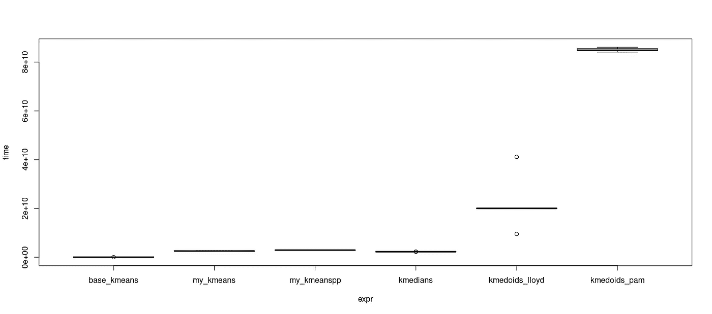
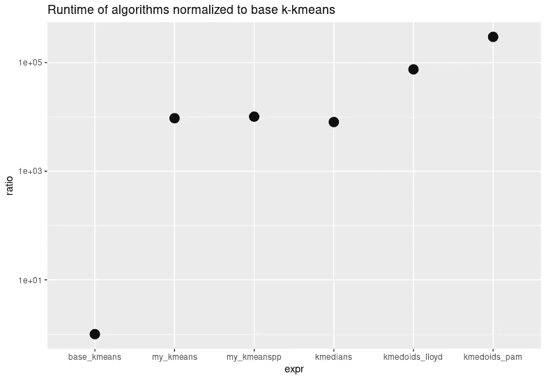

# 深入探究水母周围的分区

> 原文：<https://towardsdatascience.com/a-deep-dive-into-partitioning-around-medoids-a77d9b888881?source=collection_archive---------13----------------------->

## [实践教程](https://towardsdatascience.com/tagged/hands-on-tutorials)

## k-means 的最终进化以及为什么你之前可能学错了

[阿丽娜·格鲁布尼亚](https://unsplash.com/@alinnnaaaa?utm_source=unsplash&utm_medium=referral&utm_content=creditCopyText)在 [Unsplash](https://unsplash.com/photos/oyXis2kALVg?utm_source=unsplash&utm_medium=referral&utm_content=creditCopyText) 上的照片

在我作为一名数据科学家的工作中，我经常遇到简单算法不够用的问题，因为它们陷入了局部最优。这通常会导致开发过程中的许多挫折，因为您首先认为您的方法是有效的，但随后发现它并不一致，或者不是对您的所有数据集都有效。在我的 k-means 及其变体系列的最后一篇文章中，我将讨论 k-medoids 算法，通常也称为围绕 medoids 划分(PAM)。它具有基本确定性的优点，能够可靠地找到非常好的解决方案。这确实以更高的计算成本为代价，但是如果您的数据集不是非常大，如果您需要可靠的结果，它仍然是一个很好的候选。像往常一样，你也可以在我的 [GitHub](https://github.com/MSHelm/algorithms-from-scratch) 上找到这篇文章的所有代码。

# k-medoids 的直觉

与 k-中位数一样，k-medoids 也通常使用曼哈顿度量，但中心现在总是数据集中的实际点。我们现在计算中点，而不是质心，因此也就是中面。这增加了该方法的可解释性，因为数据中的代表性点总是可以被检索到。这经常与 k-medians 混淆(你可以在下面的文章中查看)，在 k-medians 中，中心点不需要是一个实际的对象。

 [## 如果有许多异常值，请使用这种聚类方法

### 稳健结果的 k-中位数变化

towardsdatascience.com](/use-this-clustering-method-if-you-have-many-outliers-5c99b4cd380d) 

考虑以下示例集群，由二维的 5 个点组成:

作者图片

因为中位数是在 k-中位数中为每个维度单独计算的，所以中位数将是 x = 3，y = 3。但是在数据集中不存在点(3，3)。

针对 k-medoids 实现了多种算法，最常见的算法还是 Lloyd 风格的算法(也称为 Voronoi 迭代)和围绕 medoids 的真实划分(PAM)。不幸的是，Lloyd 风格的算法通常也被称为 PAM，但这是不正确的，因为 PAM 的构建阶段(我们将在后面看到)与 Lloyd 非常不同。真正 PAM 的构建阶段是该算法成功的关键步骤，这也是为什么 Llody 风格的 k-medoids 通常比 PAM 得到更差的结果。

# k-medoids 劳埃德风格

为了简单起见，让我们首先以 Lloyd 风格实现 k-medoids，然后在此基础上构建真正的 PAM。像往常一样，我们首先随机初始化中心，
,但是现在中心的更新是完全不同的。

更新步骤现在称为交换阶段。顾名思义，我们考虑将当前的 medoid 与其簇中的所有其他点进行交换。对于每个候选交换，我们计算总成本，即该簇中所有点到新 medoid 的距离之和。我们会记住所有成本较低且表现最佳的互换，即成本最低的互换。

如果成本不能再降低，则算法终止。请注意，这并不意味着我们达到了一个全球最小值。因为我们只执行降低成本的步骤，所以如果算法没有在全局最小值“谷”内初始化，它就没有办法走出局部最小值并进入全局最小值。

# 围绕水母的分割(PAM)

最后是 PAM 算法。正如我之前已经暗示的，它有一个独特的构建阶段，可以确保非常好的初始化。下面的交换阶段与我们之前在 Lloyd 风格的 k-medoids 中实现的相同。

在构建阶段，选择第一个 medoid 作为具有最小成本的 med oid，成本是到所有其他点的所有距离的总和。因此，第一个点是数据集的最中心点。

然后迭代地选择所有进一步的点。对于所有非中面体，我们计算选择该点作为下一个中面体的成本(也是从候选中面体到所有其他非中面体的距离之和)，然后选择具有最小成本的一个作为下一个中面体。

为了澄清这确实是真正 PAM 算法，您可以在这里查阅最初发明它的作者的
论文或书籍。

正如人们立即看到的，这是计算昂贵的执行。在我们的实现中，我们将在每次迭代中计算所有的距离，一个不太昂贵的解决方案是只计算一次距离矩阵(并且只计算一个三角形，因为它是对称的)，然后只根据成本计算的需要对其进行索引。

这种算法的优点是详尽的构建阶段通常已经达到了非常好的聚类。在收敛之前，下面的交换阶段通常只执行几次。作者甚至指出，有时甚至可以忽略它，但仍然可以获得良好的分区。

在 Lloyd style k-medoids 和 true PAM 之间的交换阶段也有一些差异:Lloyd 只考虑同一个集群内的交换，而 PAM 考虑所有当前的非 medoids 进行潜在的交换，而不管它们当前是否在同一个集群内。这增加了 PAM 的搜索空间，并有可能使它找到更好的解决方案。

PAM 的另一个特性是它接近于确定性的，
因为它在初始化时不使用随机元素，并且总是将所有点视为可能的下一个 medoids。由于所考虑的两个 medoids 的成本之间可能存在联系，因此根据这些联系的解决方式，该算法并不是 100%确定的(即，可以随机解决联系，或者根据点出现的顺序来解决)。)

# 算法之间的比较

在整个系列中，我们已经实现了许多不同的算法，让我们就运行时间和结果对它们进行一些比较。因为我们在 base R 中实现了所有东西，而没有利用矢量化，所以运行时间将比使用 C 或 FORTRAN 中构建的优化算法长得多。

## 聚类结果

让我们从可视化结果开始。当然,“相同”聚类的颜色在不同的算法之间可以不同，因为它们不知道哪个聚类属于哪个物种。

iris 数据集上所有 k 均值变量的比较。所有算法都能找到大致正确的分割。请注意，颜色不需要匹配，因为它们彼此独立运行。图片作者。

除了 k-中值之外，大多数算法都能找到或多或少正确的聚类。我们还看到 PAM 算法实际上根本不执行任何交换，这突出了它在构建阶段的优势！
还要记住，如果比较 PAM 和 Lloyd k-medoids 之间的迭代次数，PAM 每次迭代只执行一次交换，而 Lloyd k-medoids 对每个当前 medoids 执行一次交换，因此总交换次数为 k *次迭代。

如果您想更多地了解可以用哪些客观指标来判断您的聚类结果，请查看我的文章中关于 k-means:

 [## 对 k-means 的深入探究

towardsdatascience.com](/a-deep-dive-into-k-means-f9a1ef2490f8) 

## 运行时间

最后，让我们比较不同算法的运行时间，让我们也
检查一下从 R 到 FORTRAN 的实现速度有多快:

我们实现的不同算法的运行时间比较。PAM 的运行时间最高，其次是 Lloyd 风格的 k-medoids。图片作者。

正如所料，PAM 是最慢的算法，其次是 Lloyd 风格的 k-medoids。因为其他线在标尺上非常接近，所以让我们来看看比率:

对数级运行时间的比较。与我在 R. Image by author 中的实现相比，我们可以观察到在 FORTRAN 中实现的基本 k-means 有很大的不同。

我们的普通 k 均值算法比基本 k 均值算法慢 4000 倍！这个
演示了如果用 C++这样的低级语言更有效地实现一个算法，你可以获得巨大的性能增益。但是我们的目标不是效率，而是理解。

# 摘要

恭喜你能走到这一步。有了 PAM，您现在知道了一种非常复杂的聚类方法，它可以稳健地应用于许多数据集。由于其高计算成本，它可能不完全适合非常大的数据集。如果你是这种情况，那就去看看专门为此设计的算法，比如 CLARA 或 CLARANS。这篇文章也总结了我关于 k-means 和相关聚类算法的迷你系列。请继续关注接下来的节目！