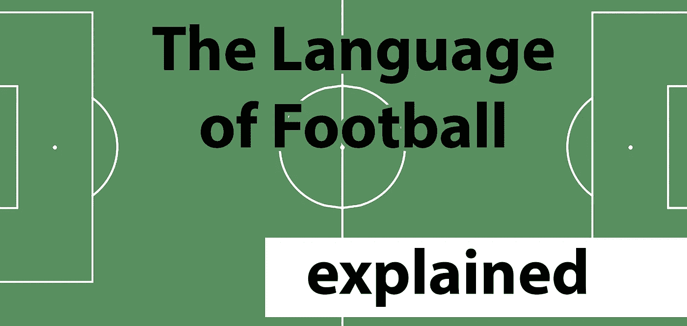
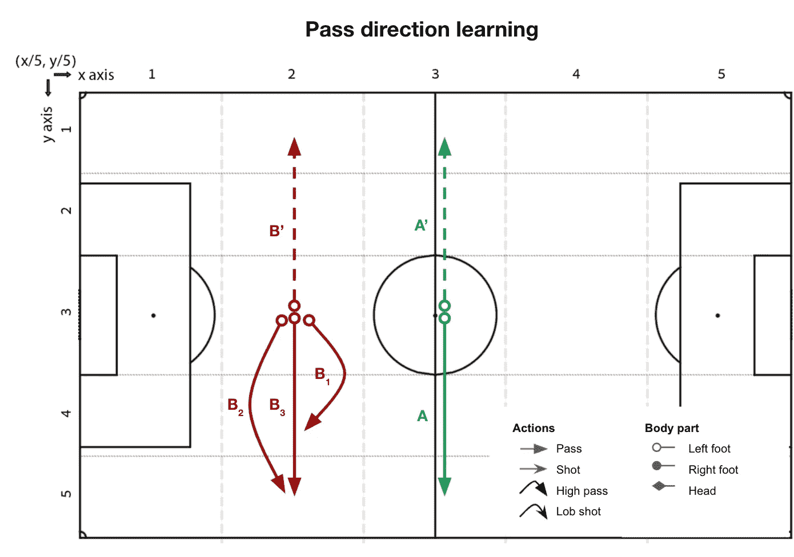
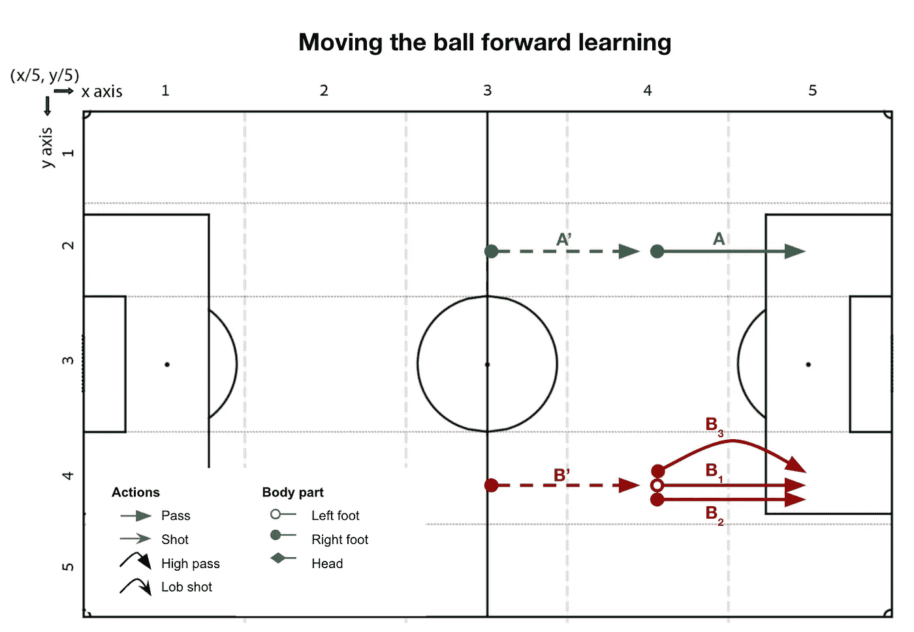
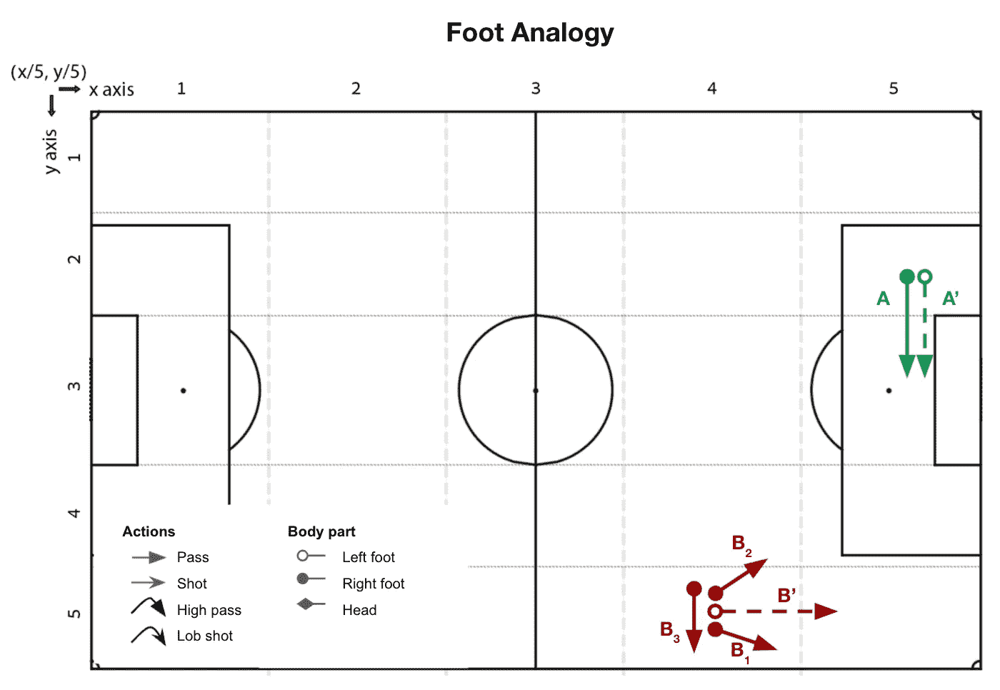
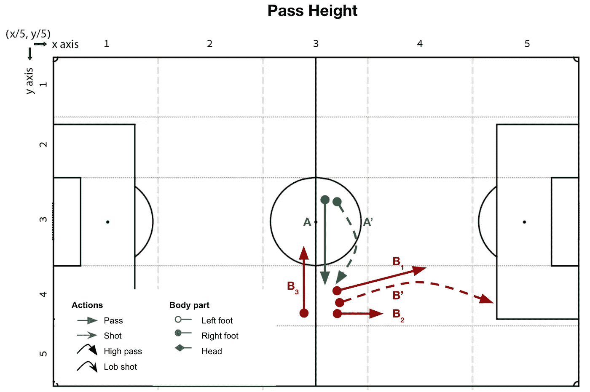
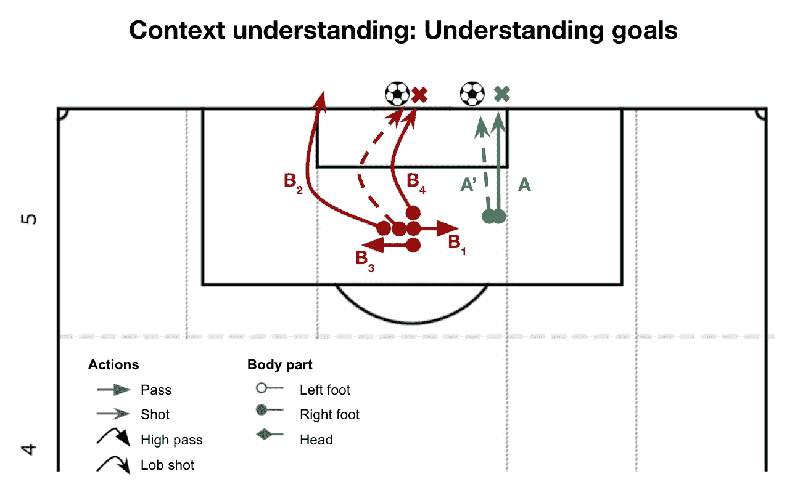
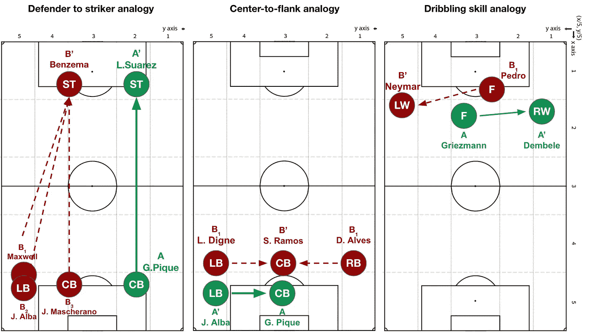
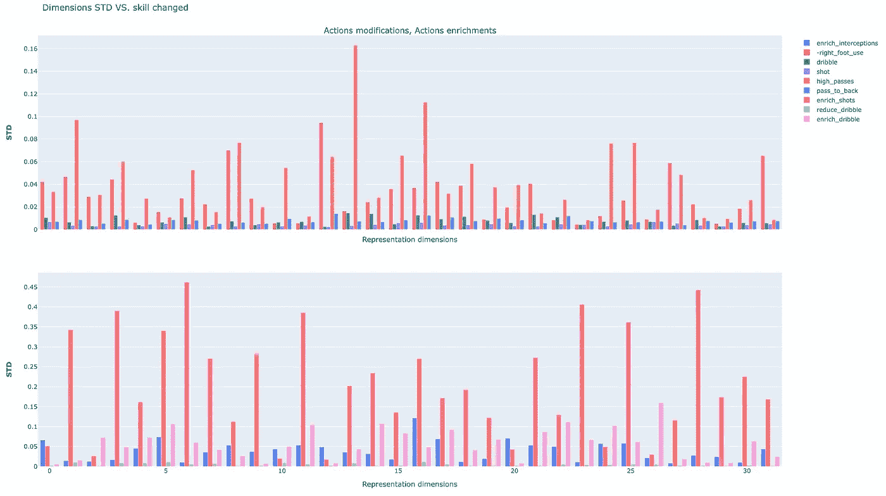

# 对足球语言的深入探究

> 原文：<https://towardsdatascience.com/a-deep-dive-into-the-language-of-football-2a2984b6bd21?source=collection_archive---------14----------------------->

## [模型可解释性](https://towardsdatascience.com/tagged/model-interpretability)

## 深入到 Player2Vec，解释足球动作，球员表现，语义。

Wix.com 大学的数据科学家 Ofir Magdaci

*作者图片。*

在之前的帖子中，我们了解了一个单词——嵌入 [**表示足球的全球语言**](/embedding-the-language-of-football-using-nlp-e52dc153afa6) 。在本文中，我们将在这些嵌入的基础上开发解释器，理解模型能够捕捉哪些方面，并阐述其结果。

**本作使用的所有代码** [**都可以在 Github**](https://github.com/ofirmg/football2vec) 上的 Football2Vec 库中获得(主要是[讲解器](https://github.com/ofirmg/football2vec/blob/master/lib/explainers.py)和[讲解器](https://github.com/ofirmg/football2vec/blob/master/lib/explain.py)模块)。

# 先验知识

这项工作在很大程度上基于我的第一篇文章——使用 NLP 嵌入足球语言。建议先阅读它，因为它提供了上下文。

# 数据集

本工作中使用的数据基于 Statsbomb [开放数据集](https://github.com/statsbomb/open-data)。数据集中的每场比赛都由球队元数据、比赛元数据(例如，舞台、体育场等)组成。)，最重要的是，手动收集和标记事件数据。文档可以在[数据集的 GitHub 存储库](https://github.com/statsbomb/open-data)上找到。

# 激励和总结

在[上一篇](/embedding-the-language-of-football-using-nlp-e52dc153afa6)文章中，我展示了 Action2Vec，一个 [Word2Vec](https://radimrehurek.com/gensim/models/word2vec.html) 模型，它允许我们将足球语言的语义嵌入到一个 32 维空间中。此外，我介绍了 PlayerMatch2Vec，这是一个 [Doc2Vec](https://radimrehurek.com/gensim/models/doc2vec.html) 模型，它产生 32 个大小的向量，代表特定比赛中的一名球员。最后，我通过对 PlayerMatch2Vec 表示进行简单的平均来展示 Player2Vec 模型。下面是它的样子:

图一。玩家 2 的 UMAP 互动情节。也可以在这里访问[。图片作者。](https://plotly.com/~ofirmg/4/)

**在本文中，我们将深入探讨这些模型**。我们将探索各种技术来理解它们，分析它们并解释它们的输出。我们的努力将集中在解释特定的结果和整个模型上。但在我们这样做之前，让我们首先掌握可解释性的含义及其对机器学习模型的重要性。[维基百科](https://en.wikipedia.org/wiki/Explainable_artificial_intelligence)在人工智能的背景下解决了这个问题:

> [可解释性](https://en.wikipedia.org/wiki/Explainable_artificial_intelligence):“可解释的 AI 是求解的结果能够被人类理解的人工智能(AI)。这与机器学习中的‘黑匣子’概念形成了对比，在黑匣子中，即使是它的设计者也无法解释为什么人工智能会做出特定的决定。”

解释者可以在决策、调试或检测偏差中起到至关重要的作用，特别是对于无人监督的问题，比如我们的问题(因为我们没有下游任务)。这是检查模型学到了什么，以及这些方面是否与领域相关的好方法。但也许最强的动机在于，大多数人不会相信他们无法解释或理解的模型。

像 [Doc2Vec](https://radimrehurek.com/gensim/models/doc2vec.html) 这样的复杂模型可以捕捉简单模型(如逻辑回归(LR ))所不能捕捉的模式。然而，LR 是一个更容易解释的模型，允许直接访问特征的系数并理解它们在任何预测中的重要性。**这篇文章的目的就是要缩小这个可解释的差距。**

通常将解释者分为两种主要类型:

1.  局部解释者，旨在解释个别预测或输出**。**
2.  全局解释器描述模型的一个完整行为。它揭示了全局，从整体上验证了模型。

我将把重点放在四种可解释性方法上，包括局部的和全局的，我发现它们在实践中是最丰富和可靠的:基于表征的解释者、*类比、相似性、*和创造*玩家的变化。*

除了解释预测，使用这些方法，我们将能够**为转会市场上的目标球员建立复杂的档案**。例如，我们可以寻找像安托万·格里兹曼这样的球员，但要完成更多的运球，或者像菲利佩·科蒂尼奥那样用他较弱的脚踢得更好。

# 理解表征的维度语义

首先，我们将检查玩家的向量并探索可能的语义模式。由于每个维度都与玩家的属性有些关联，所以可以通过比较 32 个维度中每个维度的高值和低值来推断他们的潜在意义。

*表 Player2Vec 表示中所选条目具有高/低值的球员示例(总共 32 个指数)。*

有些图案很明显。例如，维度#21 似乎与游戏的一些攻击方面相关联。然而，最好的做法是让一个对足球领域有更深更广知识的领域专家参与到这个过程中来。

这个方法充当了模型如何在语义空间中放置玩家的全局解释器。这个解释器的输出是一组可解释的全局特征，我们可以用它来推断玩家的游戏风格或理解玩家之间的相似性。

# 行动的解释者——行动类比

## **词语类比:用行动解释行动**

**类比*是一种描述语言中单词之间语义关系的操作。这种关系代表了语言中包含的语义属性。所以，在某种意义上，类比可以作为**工具来考察模型语义**。***

一个比喻的基本结构由**给出:**词 A1 →词 A2 ~词 B1 →词 B2。也就是说，单词 A1 到 A2 的关系与 B1 到 B2 的关系相同。所有符合这种关系的单词在语义上都是相似的。

英语语言模型中一个著名的类比是“国王对王后~男性对女性”。这个类比展示了英语中的性别关系以及皇室的地位。这种类比在忽略性别的语言中是无法模仿的，例如，我们的足球语言。从数学上来说，这个类比暗示着*国王*和*王后*之间的**距离**与*雄性*和*雌性*之间的距离大致相同。

这个模型能够捕捉到足球的哪些方面？让我们用类比来找出答案！我将解释第一个例子的基本原理，并对所有其他例子使用相同的符号。澄清一下，所有的类比都是经过挑选的**而不是**。

**全类比示例:传球方向学习**

如上所述， *A to A' ~ B to B '，*形式的每个类比定义了一个关系，其中“to”代表距离，通过减去矢量计算。在该示例中，关系*A-A’*和*B-B’*表示通过角度的变换。使用这个类比，我们本质上是在问，如果我们对另一个给定的动作 *B* 应用与 *A 到 A’*相同的变换，结果会是什么(根据模型)。因此，我们可以这样描述这个类比: *A - A' ~ B -？*

为了便于分析，我们将反其道而行之:给定关系*A-A’*，以及一个动作*B’*，我们希望使用相同的关系找到最初的动作 B。经过一些基本的代数，寻找与短语最相似的动作时就遇到了类比: *A - A' + B'* 。

在通路方向类比的情况下，我们将从我们的词汇中选择一个随机通路 *A* ，并提取相同但方向相反的通路——*A’*。此单变化体现了 ***类比关系*** 。我们将选择与 A '方向相同的第二个随机路径，即 B '。

*   A = '(3/5，3/5)<pass>:(**→**)| ground-long | left _ foot '—从球场中间向右的一次地面传球。</pass>
*   A' = '(3/5，3/5)<pass>:(**←**)| ground-long | left _ foot '—同样的传球，但是向左。</pass>
*   B' = '( **2** /5，3/5) <传球>:(**←**)|低长|左脚'—从球场中间向右的一个地面传球。

给定这些输入，与类比最相似的三个动作，即符合 *B* 的最佳动作是:

*   ( **2** /5，3/5) <传球> :( **→** )| **高**-med | left _ foot’，余弦相似度= 0.761——向右一个高传球，从与*B’*相同的位置。
*   ( **2** /5，3/5) <传球> :( **→** )| **高** -long|left_foot '，余弦= 0.760——向右一个高长传球，从与 *B'* 相同的位置。
*   ( **2** /5，3/5) <传球> :( **→** )| **落地** -long|left_foot '，余弦= 0.748——a 落地长传向右，从与 *B'* 相同的位置。

*图 2:学习传球方向的说明性类比图。B1/2/3 是符合类比等式的最佳动作:A - A' + B' =？。实线代表 A 或 B，虚线代表 A '或 B '。绿色代表 A，A '，红色代表 B，B '。通过距离(短/中/长)由箭头长度表示。在这里，A '是与 A 相同的传球，但方向相反(左)。从后面一个位置看，b 和 A 是一样的。B1/2 是到 B 的镜像通道，具有不同的高度和长度。B3 正是镜像通行证。图片作者。*

那么我们从中学到了什么？首先，似乎最佳配合，即具有最高相似性的动作，是具有更大距离和更向前方向的相同传球。第二个最佳选择是左脚向前短传。第三个最相似的字，其实是一个方向相反腿相反的**镜像传球**。确实有趣！

但是等等，预计最直观符合类比的镜像动作只排在第三，这是个问题吗？嗯，在我看来，一点也不:

*   许多动作在数据中出现的次数很少，这使得很难将它们恰当地放置在语义空间中。老实说，如果它没有至少一次提到“更多的数据将产生更好的结果”，那么它就不是一篇真正的数据科学文章。
*   所有三个候选人可能很适合这个类比，因为他们达到了非常高的余弦相似值，超过了数以千计的其他传球动作。
*   通过简单的试探法确定通过方向，并指向方向类别的中间。不同的方法可能导致不同的结果。

总的来说，我们可以得出结论，模型很好地捕捉到了传递方向语义。既然我们已经了解了类比是如何建立的，让我们来回顾更多。

**向前移动球学习**

这个类比旨在捕捉将球向前推，更接近目标的基本概念。类比关系:传球→从更靠前的位置(更接近目标)同样传球。

*图 3:向前移动球的说明性类比图。这里，A '是和 A 一样的传球，但是是从后面一个位置。b’是来自对称 y 区域的相同通路。所有候选人都符合这一类比，很好地反映了向前推进的概念。图片作者。*

我发现看到动作位置和类型总是被恰当地捕捉是非常有趣的，而附加属性在不同的候选者之间略有不同。

**脚比喻**

类比关系:右脚传球→左脚同样传球。

*图 4:学习脚语义的说明性类比图。*这里，A’是和 A 一样的传球，但是用的是左脚。b '是随机的左脚传球。所有顶级候选人都是相似的右脚传球，表明符合类比。图片作者。

为了简单起见，我去掉了传球的技术属性。当找到相似的记号时，模型总是尊重它们，所以只要假设这些类比适用于任何技术和类型。

**传球高度模拟**

类比关系:高度较低的传球→高度较高的相同传球。

*图 5:学习身高语义的说明性类比图。*这里，A’是和 A 一样的传球，但是高度更大。b '是随机高通。所有的顶级候选人都是相似的，这表明这种类比是非常合适的。图片作者。

**语境理解:理解目标**

类比关系:被扑出的一脚射门→与进球结局相同的一脚射门。

*图 6:学习目标情境的说明性类比图。*此处，A '与 A 是同一个射门，其中 A '射门得分，而 A 射门被扑出。“b”是从相似的位置随机射门，导致进球。最佳候选镜头完全符合类比，因为这些镜头被错过或保存。此外，B1/3 代表了类比的另一种可能的解释:守门员救球创造的进球可以导致反弹进球，因此，也可以被视为助攻。图片作者。

这个真的让我大吃一惊。我认为 *A* 到*A’*反映了将糟糕的击球变得更好。这是描述它的一种方式。在禁区内的投篮通常会被扑出并反弹得分。所以，在某种程度上，这也是一种很好的辅助方式(许多 FIFA 游戏玩家会觉得很熟悉😉).因此，潜在的助攻可以符合这个类比，以及错过的高球投篮。

到目前为止还不错，但我们才刚刚开始。

# 玩家解说# 1——用玩家**类比**解说玩家

正如我们对动作所做的那样，我们可以产生**玩家对玩家的类比**。由于文档代表随机变量，其中每个都是特定比赛中的玩家，**类比本身是随机变量**。听起来令人困惑，因此，我对类比中每个玩家的比赛进行了抽样，并重复了十次类比。结果高度一致。

## 后卫对前锋的类比

我们可以通过计算这些球员之间的距离来研究一个简单的*防守者和一个进攻者*的关系。我们希望不同对的中后卫和前锋之间的距离是相似的。

*皮克(中后卫)-苏亚雷斯(斯蒂克)+本泽马(前锋)~？*

三名至少有 5 场比赛的顶级匹配球员:马克斯韦尔·卡贝利诺(左后卫)、约尔迪·阿尔巴(左后卫)和哈维尔·马斯切拉诺(中后卫)。

## **中心到侧面类比**

我们可以对比相似位置的球员，一个在中路，一个在边路。例如，从中后卫到侧翼:

阿尔巴(左后卫)-皮克(中后卫)+拉莫斯(中后卫)~？

最佳匹配:丹尼尔·阿尔维斯(右后卫)，卢卡斯·迪涅(左后卫)。

## 风格和技能类比

为此，我们将比较位置相似但打法或技巧不同的球员。

例如，我选择了西甲前锋安托万·格里兹曼，并测量了他与奥斯曼·登贝勒的距离——后者也是一名攻击手，但更倾向于边锋。他们之间的差异可以通过他们在球场上的平均位置，每场比赛的运球次数等数据很容易地指出来。然后，我选择了小内马尔·达席尔瓦·桑多斯，我(和模特)觉得他更像登贝勒，而不是格里兹曼。由此产生的类比是:**格里兹曼-登贝勒+内马尔~？。**

最佳匹配:佩德罗·罗德里格斯(Pedro rodríguez)——前锋(在巴塞罗那期间)。我印象深刻，但我也有偏见。那么——你觉得怎么样？让我知道！

图 7 *:说明性玩家类比剧情。每个图中，* B 值是拟合类比方程的前几名: *A - A' + B'* =？*。实线代表 A 和 B，虚线代表 A’和 B’。绿色代表 A，A '，红色代表 B，B '。*图片作者。

每个类比都有自己的深度，但是我们有真正令人兴奋的事情要做…就在现在…

# 玩家 2 号解释器——将玩家和动作结合成玩家变体

所以玩家的类比很好，但是让我们更进一步。我们有一个巨大的玩家代表集合和一个非常丰富的语言来描述它——让我们把它们混合起来。

**将玩家和动作结合起来，可以让我们为玩家产生无限的局部变化，**跨越一个或多个技能。例如，我们可以创造更多射门或传中的进攻变化，或者通过用成功的铲球代替糟糕的铲球来提高防守技能。这些变异可以作为解释者，类似于[石灰](https://christophm.github.io/interpretable-ml-book/lime.html)。

让我们以托尼·克罗斯为例。根据我们的模型，与塞斯克·法布雷加斯相比，他更不像安德烈斯·伊涅斯塔。为什么？通过模拟足球空间中不同版本的克罗斯，每个版本都有不同的修改，我们可以看到他与伊涅斯塔之间的两个独特因素是**运球和得分。**听起来很有希望，但首先，三个评论:

1.  结果一致性——在训练期间由 [Doc2Vec](https://radimrehurek.com/gensim/models/doc2vec.html) 对不可见文档的推断表示是随机的。因此，我重复这个过程几次，取平均结果。
2.  过滤低相似度的结果似乎是合理的(我过滤余弦相似度的结果< 0.7) and players with lower similarity scores than the inspected player himself.
3.  **文档设计**:player 2 vec 模型是由一个球员和一场比赛定义的，跨场比赛取平均值来代表一个球员。在训练期间，模型嵌入了真实足球财产的本地文档。为了避免推理中的垃圾输入和垃圾输出，我们还应该提供有意义的、设计合理的推理内容。

我们可以在玩家文档上应用什么操作来产生有意义的变化？怎么才能做到呢？

## 简单方法——矢量求和

由于 [Word2Vec](https://radimrehurek.com/gensim/models/word2vec.html) 和 [Doc2Vec](https://radimrehurek.com/gensim/models/doc2vec.html) 模型本质上是线性的，因此我们可以通过将玩家表示向量和特定动作集的特别文档相加来产生玩家变化。例如，我们可以对运球动作进行采样，并按照一种单词袋的方法将它们全部组装到一个文档中。

[在第一篇](/embedding-the-language-of-football-using-nlp-e52dc153afa6)中，我演示了这个方法的用法。这样我就能断定*安德烈斯·伊涅斯塔+发件箱得分——运球~托尼·克罗斯。*

尽管结果很有希望，但设计这些文档是一个微妙的过程。因此，我将介绍两种我感觉更舒服的方法:修改玩家动作和丰富玩家动作。

## 修改玩家动作

这里，我们对玩家的文档进行迭代循环，并执行一组给定的 ***干预*，**每个都持有一个 ***模式*** 以跟随**，**和一个 ***修改函数*来转换观察到的动作**。当条件允许时，我们以概率 *p* 执行这个修改。我们可以遵循这种方法，在保留原生文档设计的同时，为玩家创造与游戏许多方面相关的无尽变化。

注意:由于这种方法依赖于改变现有的动作，信息变化要求球员在比赛中足够频繁地执行这个动作。

例如，我们可以创建 Frenkie de Jong 的变体，其中他的传球被转换为高海拔(图 8)。对于 *p=0.1* ，大部分相似球员是蒂亚戈、法布雷加斯、阿瑟、拉基蒂奇等。余弦相似度值为> 0.95。当我们增加 p 时，他们的相似度降低，而其他球员的相似度增加，比如罗伯特·皮雷。当 *p > 0.8* (球员动作剧烈变化率)最相似的球员其实都是门将，因为他们倾向于频繁使用高球。

这种修改在我们的二维简化图(图 8)中也非常明显。随着 p 的增加，我们可以观察到非标准的行为，因为相应的变化不同于所有的本地玩家。然而，这是一个提醒的好时机——它仅仅是数据的一个非常压缩的投影，仅此而已。代表的全部知识嵌入在所有 32 个维度中。

图 8 包括奥斯曼·登贝勒的另一个变体，减少了右腿的使用。*干预* *模式*是右脚动作，*修改器功能*只是将动作的腿切换到左腿(图 8)。对于 *p=0.1* ，最相似的三名球员分别是佩德罗·罗德里格斯、艾萨克·昆卡和克里斯蒂安·泰洛。然而对于 *p=0.8* ，三个最相似的球员是艾萨克·昆卡、博扬·克尔奇和杰拉德·德洛费。克里斯蒂安·泰洛也使用双腿，现在已经退出了前三名。

这是所有这些变化在 2d 中的样子，使用我们心爱的 [UMAP](https://umap-learn.readthedocs.io/en/latest/) 投影:

图 8:数据集中所有玩家的 Plotly interactive player 2 vec[UMAP](https://umap-learn.readthedocs.io/en/latest/)投影，以及选定玩家的变化。球员按位置上色，而一些精选的知名球员按名字上色，可以直接筛选。缩放和全屏视图可用于阅读重叠文本。每个变异名称遵循相同的命名模式:<玩家名> _ <技能名> _ <使用概率>。图片作者。

顺便说一句，我还试图通过将玩家文档中观察到的每一个失败的动作以概率 *p* 转化为成功来提高玩家的技能水平。然而，这样做并没有产生任何有趣的发现。正如我几次提到的，我们的表征处理的是玩家做了什么，而不是他做得有多好。这很好地证实了这一说法。为了解决技能水平问题，该模型必须进行调整和扩展。

## **丰富玩家动作**

对于我们想要**也改变动作流行度**的情况，我们可以从相关的*动作族*中添加单词，或者删除带有机会 *p* 的匹配动作。

像以前一样，我们迭代地遍历玩家的文档并执行一组给定的干预，每个干预都有一个要遵循的*模式*和一个*丰富器函数*来构建要遵循的期望动作。当条件允许时，我们以概率 *p* 执行这种强化，**导致技能相关动作**的更多出现。

做富民应该关心哪些事情？例如，如果我们想给一个球员添加更多的运球，我们应该在匹配的位置和适当的场合添加它们——比如在接到球之后。我们也希望避免不切实际的情况，如在自己的 5 米栏内运球。

为此，我使用 1-gram 模型确定了适当的情况，这基本上意味着我模拟了给定最后一个动作发生的概率，如在数据中观察到的。概率，*p _ 运球*，是每次动作后出现运球的概率:25%的运球发生在传球后，23%的运球发生在接球后，20%的运球发生在持球后，13%的运球发生在压球后，4%的运球发生在接球后。为了简单起见，我决定忽略所有其他动作类型的 15%的长尾，并跳过在团队自己的半场执行的动作。

那么，如果我们减少一个球员运球的次数，会发生什么呢？图 8 也展示了天才运球运动员安德烈斯·伊涅斯塔的这些变化。对于 *p=0* :最相似的是蒂亚戈、亚瑟、法布雷加斯(余弦相似度> 0.9)。对于 *0.02 < p < 0.2* ，余弦值仍然是> 0.9 但是顺序变了——理查德·普伊格和库蒂尼奥最相似。最后，当 *0.2 < p < 0.5:* 亚瑟达到了 0.97 的余弦相似度，而所有其他人都没有通过 0.7 的最小阈值。

## 使用**玩家变化**解释嵌入维度

我们也可以利用变异来了解表征维度。具体来说，我们可以计算所有变量类型的每个向量维数的方差。具有高变化值的尺寸实际上是在 *p* 的不同值中变化最大的尺寸，因此，与应用的修改关联最大。

*图 9:不同转化技能的标准差柱状图。y 轴是标准偏差值，x 轴是制图表达的矢量维度。上面的图描述了所有的技能修改，而下面的图描述了所有的技能强化。由于规模上的显著差异，这两种方法被分开显示。总的来说，技能丰富触发了玩家向量表示的更高机会。“投篮”和“运球”是指通过提高动作的结果来提高技能质量。图片由作者提供。*

我们可以从图 9 中了解到，不同的技能影响不同的维度。这也适用于技能相同，但干预类型不同的情况——修改还是丰富。总的来说，富集导致更高的方差，即，对表示的更显著的影响。

此外，我们看到一些技能比其他技能对向量维度有更高的绝对影响。例如，与修改传球高度相比，改变球员脚侧的数量级要低得多。

**正如我之前提到的，仅仅改变动作的结果(见图 9 中的“射门”和“运球”技巧)会产生非常小的影响，几乎无法与纯粹的噪音区分开来。**

**因此，我们了解到一些元素在表示中比其他元素更占主导地位。对模型或预处理的扩展可以减轻这种情况。例如，为了赋予因改变拍摄结果而产生的差异以力量，我们可以为目标添加一个单独的单词，并将它们放在适当的位置。这将创建模型可以捕获的依赖关系。**

# **还有一点:理解表示差异**

**就在我们到达这篇文章的第 90 分钟之前——你还记得我在第一篇文章中提到的，一个球员在空间中的扩散也可能意味着什么吗？所以，我决定去看看，这是它的样子:**

**图 10:Plotly interactive[UMAP](https://umap-learn.readthedocs.io/en/latest/)player 2 vec 表征方差的投影。球员是按位置着色的。图片作者。**

**我们应该记住这仅仅是一个 32 维图像的 2D 投影(使用我们亲爱的 [UMAP](https://umap-learn.readthedocs.io/en/latest/) )。但是，我们可以看到一个明显的线性趋势。这种趋势有什么意义吗？事实证明，有可能。**

**我在各个位置上突出了一些顶级球员的名字。顺势而为，遇到这样的选手比逆势而为的可能性要大得多。这些球员在不同的比赛中会改变他们的行为吗？他们真的是更好的球员吗？当然，存在选择偏差，数据是不平衡的(因此方差受到影响)，所以在得出结论之前有更多的东西要分析。同时，你可以交互式地探索它。**

# **摘要**

**在这篇文章中，我们深入了解了足球语言和球员 2Vec 模型，我们了解了不同类型的解释者，包括全球和本地的，我们使用类比作为语义测量工具，包括动作和球员。**

**然后，我们转向了更先进的解释球员的方法。具体来说，我将**修改和丰富** **玩家的概念引入到玩家的变体**中，允许我们解释玩家的表现，以及实体之间的相似性和距离。**

**使用哪个解释器以及出于什么目的由您决定，这取决于业务需求。正如我之前提到的，我们可以用例子、想法和不同的方法来填满一本书——还有许多其他的方法，其中一些可能会为一些用例提供更好的服务。**

# **下一步是什么？**

**所以，我不得不就此打住。下一个[帖子](/data-driven-evaluation-of-football-players-skills-c1df36d61a4e)将主要是关于玩家技能评估，包括我承诺的花哨的 [Streamlit](https://streamlit.io/) 仪表盘。**

**如有任何意见、建议或要求，请随时联系我。**

**终场哨声响起。**