# 对 ARIMA 模型的深入研究

> 原文：<https://towardsdatascience.com/a-deep-dive-on-arima-models-8900c199ccf?source=collection_archive---------3----------------------->

## [实践教程](https://towardsdatascience.com/tagged/hands-on-tutorials)

## 从白噪音到 SARIMAX 及其他

[达斯坦·卡迪尔](https://unsplash.com/@dastan_khdir?utm_source=medium&utm_medium=referral)在 [Unsplash](https://unsplash.com?utm_source=medium&utm_medium=referral) 上的照片

预测未来永远是一个普遍的挑战，从决定是现在还是下周种植作物，结婚还是保持单身，出售股票还是持有，或者上大学还是全职玩音乐。我们永远不可能完美地预测未来[1]，但是我们可以使用统计领域的工具**预测**来更好地理解未来。

预测涉及**时间序列**数据，或随时间的重复测量。在每小时的温度、每天的电力消耗或每年的全球人口估计等数据中，我们可以寻找将数百或数千个数字归结为几个定义性特征的模式。我们可以使用时间序列分析来量化数值*上升或下降*的速率，测量一个数值*与前几个*相关的程度，将我们的数据分解为其*潜在的重复周期*等等。

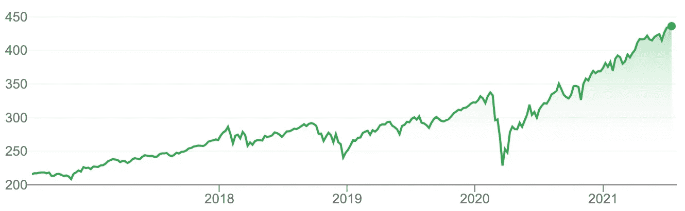

过去五年的 P 500 每日价格，一个被高度研究的时间序列的例子。截图来自谷歌财经。

为了总结时间序列并预测其未来，我们需要对时间序列中的值之间的关系进行建模。今天与昨天、一周前或去年有相似之处吗？时间序列之外的因素，比如噪音或者*其他*时间序列，起到了多大的作用？

为了回答这些问题，我们将从一个基本的预测模型开始，并迭代到一个完整的自回归移动平均(ARMA)模型。然后，我们将进一步包括 [*综合*](https://www.investopedia.com/terms/a/autoregressive-integrated-moving-average-arima.asp)[*季节性*](https://otexts.com/fpp2/seasonal-arima.html) 和 [*外源性*](https://www.statisticshowto.com/endogenous-variable/) 组件，扩展成一个 [SARIMAX](https://www.statsmodels.org/dev/generated/statsmodels.tsa.statespace.sarimax.SARIMAX.html) 模型。

换句话说，我们将在此基础上构建:

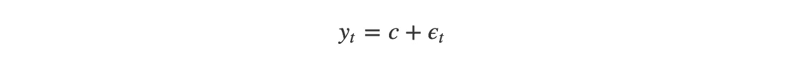

对此:

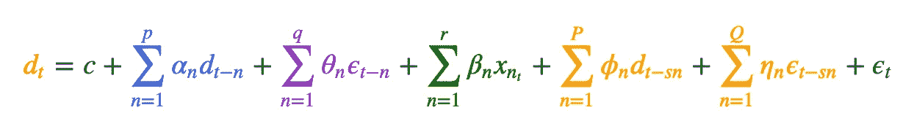

这看起来很复杂，但每一部分——自回归的**(蓝色)、**移动平均线**(紫色)、**外生的**(绿色)和**季节性的**(黄色)——只是加在一起。我们可以通过添加或删除项，在原始数据和**差分**(红色)数据之间切换，轻松调整或降低模型的复杂性，以创建 ARMA、SARIMA、ARX 等。模特。**

**一旦我们建立了一个模型，我们将能够预测未来的时间序列如下。但也许更重要的是，我们还将理解产生我们的时间序列的*潜在模式。***

**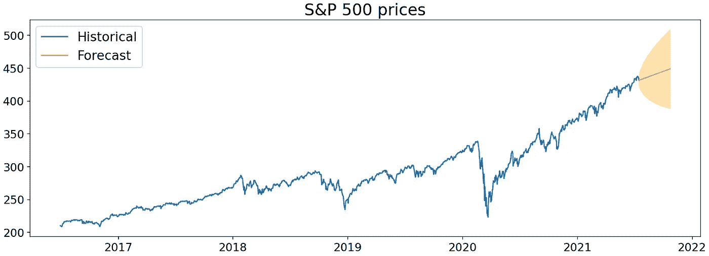**

**作者图片**

**(强制说明:本帖不构成投资建议；所有的例子只是为了说明的目的。)**

*****来自《走向数据科学》编辑的提示:*** *虽然我们允许独立作者根据我们的* [*规则和指导方针*](/questions-96667b06af5) *发表文章，但我们并不认可每个作者的贡献。你不应该在没有寻求专业建议的情况下依赖一个作者的作品。详见我们的* [*读者术语*](/readers-terms-b5d780a700a4) *。***

# **目录**

*   **入门指南**
*   **AR:自回归**
*   **马:移动平均线**
*   **把它放在一起**
*   **附加组件**
*   **Python 中的时间序列**

# **入门指南**

## **自相关**

**在我们开始构建任何模型之前，我们需要涵盖一个对于描述时间序列至关重要的主题: [**自相关**](https://en.wikipedia.org/wiki/Autocorrelation) 。自相关意味着“自相关”:它是一个时间序列的值与早期值的相似性，或者说**滞后于**。例如，如果我们的时间序列是值`[5, 10, 15]`，我们的滞后-1 自相关将是`[10, 15]`与`[5, 10]`的相关性。**

**我们可以用**自相关图将*当前值*与*之前的值*的相关性可视化。**这些图是通过计算每个值(y_t)与前一时间步( *y* _{t-1})、两步前(y_{t-2})、三步前(y_{t-3})的值的相关性而构建的。y 轴显示滞后 *n* 处的相关性强度，我们认为阴影误差区间之外的任何值都是显著相关性。**

**滞后零点的相关性总是 1: y_t 最好和 y_t 完全相关，否则就有问题。对于剩余的滞后，有三种典型的模式:1)缺乏自相关，2)逐渐衰减，3)急剧下降。(尽管在现实世界的数据中，你可能会得到#2 和#3 的混合。)**

**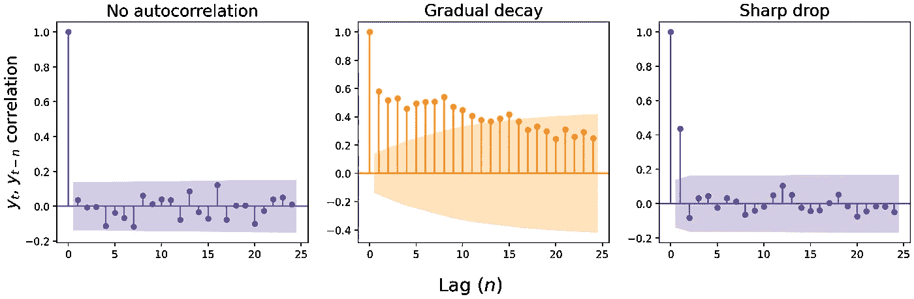**

**作者图片**

**下面我们来看看芝加哥植物园[每日标准普尔 500 收盘价](https://www.marketwatch.com/investing/fund/spy)(左)和[每日最高气温](https://www.ncdc.noaa.gov/cdo-web/datasets/GHCND/stations/GHCND:USC00111497/detail)(右)的自相关。标准普尔 500 指数的价格相关性如此之强，以至于你必须查看过去三个月以上的数据才能找到不相关的价值。芝加哥的气温变得不相关得更快，大约在两个月前，但随后从另一边射出，变成与 4-7 个月前的气温负相关的*。***

**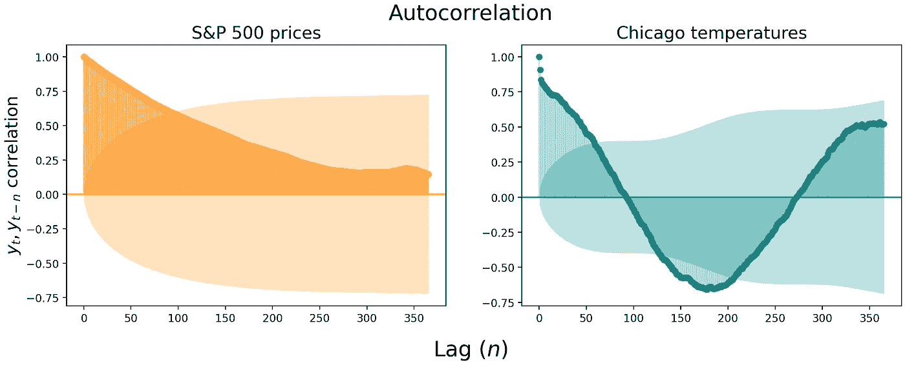**

**作者图片**

## **偏自相关**

**自相关图是有用的，但滞后之间可能存在实质性的相关性“溢出”。例如，在标准普尔 500 价格中，滞后-1 相关性达到惊人的 0.994——很难获得后续滞后的良好读数，因为第一个滞后间接影响所有下游相关性。**

**这就是 [**偏相关**](https://online.stat.psu.edu/stat510/lesson/2/2.2) 可以成为一个有用的度量的地方。部分自相关是 y_t 和 y_{t-n}的相关性，*控制早期滞后*的自相关。**

**假设我们想要测量滞后-2 自相关，而不测量滞后-1 溢出。我们不是直接测量 y_t 和 y_{t-2}的相关性，而是拟合 y _ t ~*β*₀+*β*₁*y _ { t-1 }*的线性回归，y _ { t-2 } ~*β*₀+*β*₁*y _ { t-1 }*的回归，然后找出*残差之间的相关性***

**残差量化了 y_t 和 y_{t-2}中无法用 y_{t-1}解释的变化量，使我们能够公正地看待 y_t 和 y_{t-2}之间的关系。然后我们可以重复这个过程，测量直到 *n* 的滞后的回归残差之间的相关性，找到滞后 *n* 的偏相关。例如，我们可以通过将 y _ t ~*β*₀+*β*₁*y _ { t-1 }+β*₂*y _ { t-2 }*的残差与 y _ { t-3 } ~*β*₀+*β*₁*y _ { t-1 }+β*的残差进行回归来测量滞后 3 时的偏相关**

**这是标准普尔 500 价格和芝加哥温度的偏相关图。注意滞后-1 自相关如何保持高度显著，但随后的滞后从悬崖上跳水。**

**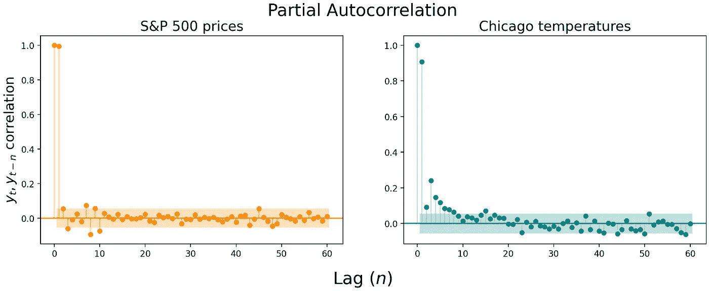**

**作者图片**

**自相关和偏自相关图可用于确定简单的 AR 或 MA 模型(相对于完整的 ARIMA 模型)是否足以描述您的数据[2]，但您可能不会以这种方式使用它们。自自相关图[首次推出](https://archive.org/details/timeseriesanalys0000boxg)以来的五十年里，你的笔记本电脑可能已经强大到足以执行强力扫描，以找到最能描述你的数据的 ARIMA(甚至 SARIMAX)模型的参数，即使有成千上万的观察值。因此，这些图作为可视化数据的时间相关性的补充方式可能更有用。**

# **平稳性**

**与任何统计模型一样，预测时间序列数据时必须满足一些假设。最大的假设是时间序列是**平稳的。**换句话说，我们假设**描述时间序列的参数不随时间变化。**无论在时间序列的哪个位置，您都会看到相同的均值、方差和自相关性。[3]**

****

**作者图片**

**这并不意味着我们只能预测看起来像上面绿色乱糟糟的时间序列。虽然大多数真实世界的时间序列不是平稳的，但我们可以*将*时间序列转换成平稳的，根据平稳数据生成预测，然后*对预测进行解转换*以获得真实世界的值。一些常见的转换包括[求差](https://machinelearningmastery.com/remove-trends-seasonality-difference-transform-python/)(然后可能再次求差)，取数据的对数或平方根，或者取百分比变化。**

**转换是必要的，因为线性模型要求它们建模的数据是*独立的*并且*同样可能从母体*中提取。时间序列数据则不是这样——任何自相关都会立即违反独立性假设。但是独立随机变量的许多便利之处——例如[大数定律](https://en.wikipedia.org/wiki/Law_of_large_numbers)和[中心极限定理](https://sphweb.bumc.bu.edu/otlt/mph-modules/bs/bs704_probability/BS704_Probability12.html)—[也适用于平稳时间序列](https://stats.stackexchange.com/questions/19715/why-does-a-time-series-have-to-be-stationary)。因此，使时间序列平稳是能够对我们的数据建模的关键一步。**

****

**照片由 [Ahmad Odeh](https://unsplash.com/@aoddeh?utm_source=medium&utm_medium=referral) 在 [Unsplash](https://unsplash.com?utm_source=medium&utm_medium=referral) 上拍摄**

# **AR:自回归**

**有了一些基础知识之后，让我们开始构建我们的 ARIMA 模型。我们将从 **AR** 或**自回归**成分开始，然后再加入移动平均线和积分。**

## **AR(0):白噪声**

**我们能建立的最简单的模型是不带任何项的模型。嗯，差不多了。只有一个*常数*和一个*误差*项。**

****

**这种时间序列被称为**白噪声。** *ϵ_t* 是从均值为 0、方差为 *σ* 的正态分布中抽取的随机值。[4]每个值都是独立绘制的，意味着 *ϵ_t* 与 *ϵ_* {t-1}、 *ϵ* _{t+1}、或任何其他 *ϵ* _{t n}都没有关联。用数学方法写，我们会说:**

**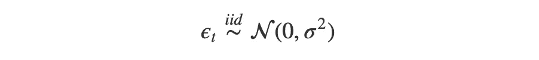**

**因为所有的 *ϵ_t* 值都是独立的，所以模型 y_t = ϵ_t 所描述的时间序列只是一个**无法预测的随机数序列**。你对下一个值的最佳猜测是 *c* ，因为 *ϵ_t* 的期望值是零。**

**下面是从标准差递增的正态分布中提取的三个白噪声时间序列。 *c* 为零，因此从等式中省略。**

**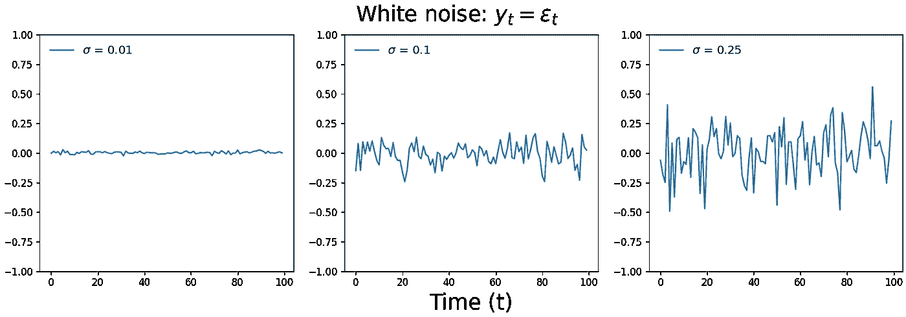**

**作者图片**

**我们无法预测的随机值的时间序列实际上是一个有用的工具。对于我们的分析来说，这是一个重要的零假设——数据中是否存在一种模式，足以将序列与白噪声区分开来？我们的眼睛喜欢寻找模式——即使实际上并不存在——因此白噪声比较可以防止假阳性。**

**白噪声也有助于确定我们的模型是否捕获了它可以从我们的时间序列中获得的所有 [**信号**](https://conceptually.org/concepts/signal-and-noise) 。如果我们预测的残差*不是*白噪声，[我们的模型忽略了一个模式](https://machinelearningmastery.com/white-noise-time-series-python/)，它可以用来生成更准确的预测。**

## **AR(1):随机游动和振动**

**让我们开始在模型中加入自回归项。这些项将是我们的时间序列的滞后值，乘以将那些先前值最好地转化为我们的当前值的系数。**

**在 AR(1)模型中，我们通过取我们的常数 *c* ，加上由乘数 *α* ₁调整的*先前*时间步长 y_{t-1}，然后加上白噪声 *ϵ_t* ，来预测当前时间步长 y_t。**

**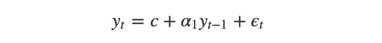**

**₁的值在我们的时间序列中扮演着决定性的角色。如果 *α* ₁=1，我们得到一个[t23】随机行走 。与白噪声不同，我们的时间序列可以自由地偏离它的原点。在许多应用中，随机漫步是一个非常有用的随机过程模型，例如建模](https://www.sciencedirect.com/science/article/pii/S0370157317302946)[粒子在流体中的运动](https://en.wikipedia.org/wiki/Brownian_motion)，觅食动物的搜索路径，或者股票价格的变化。**

**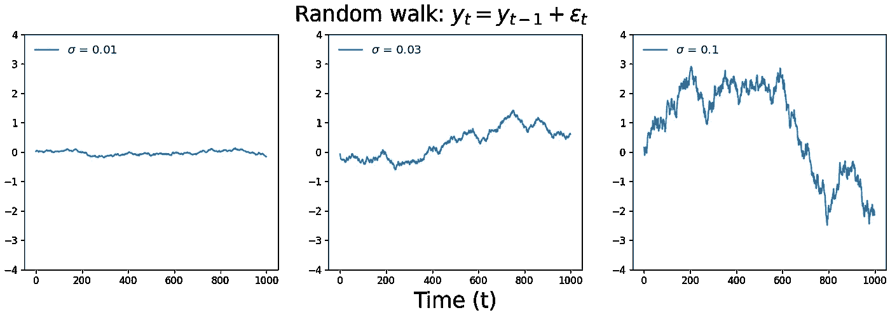**

**作者图片**

**所以当 *α* ₁ = 0 时，我们得到白噪声，当 *α* ₁ = 1 时，我们得到随机游走。当 0 < *α* ₁ < 1 时，我们的时间序列展现出 [**均值回复**](https://www.investopedia.com/terms/m/meanreversion.asp) 。这很微妙，但你会注意到这些值是相互关联的*和*它们倾向于在零附近徘徊，就像不那么混乱的白噪声。这一过程的一个真实例子是股票价格的巨大变化:突然变化[之后往往是均值回归](https://decodingmarkets.com/mean-reversion-trading-strategy/)。**

**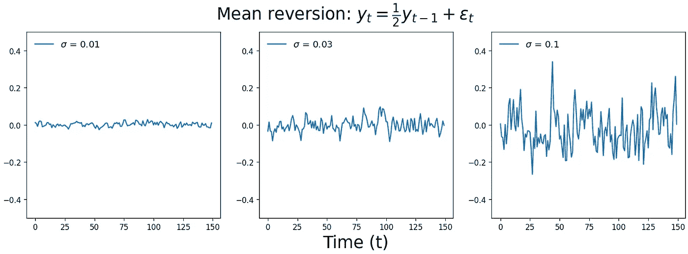**

**作者图片**

**在拟合 AR 模型时，统计软件包通常在执行[最大似然估计](https://en.wikipedia.org/wiki/Maximum_likelihood_estimation)时将 *α* 参数空间约束为 1 ≤ *α* ≤1。除非你在模拟指数增长或剧烈振荡，否则这些模型描述的时间序列可能不是你想要的。**

**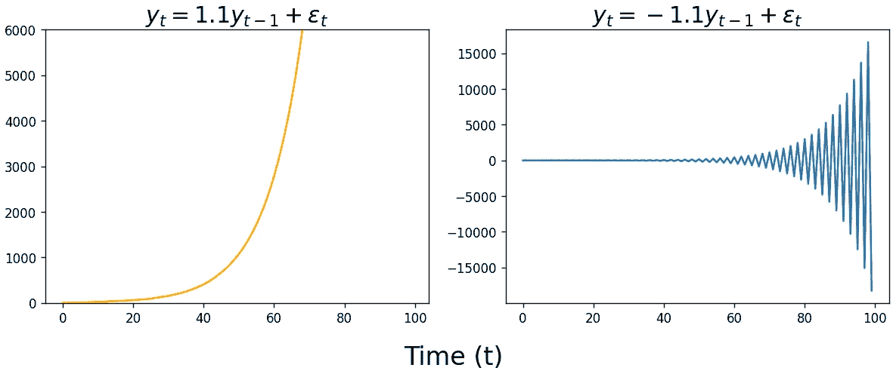**

**作者图片**

**最后，我们对 *c* 的解释随着 AR(1)模型的变化而变化。在 AR(0)模型中， *c* 对应于我们的时间序列的中心位置。但是由于 AR(1)模型考虑到了 y_{t-1}， *c* 现在表示我们的时间序列趋势向上(如果*c*0)或向下(如果*c*0)的速率。**

**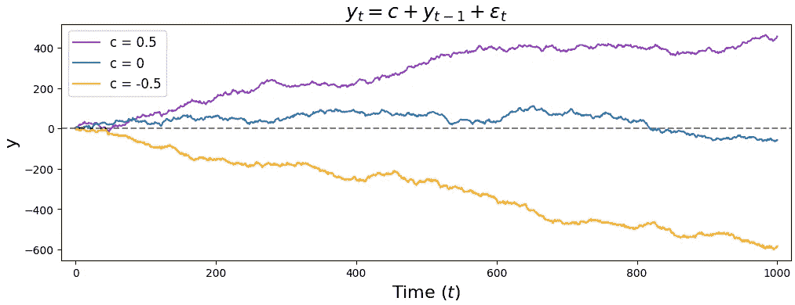**

**作者图片**

## **AR(p):高阶项**

**给我们的模型增加更多的滞后只是增加αn * y { t n }项的问题。这是 AR(2)模型的样子，附加项用蓝色突出显示。**

**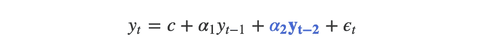**

**这表示当前时间步长 y_t 的值由我们的常数 *c* 确定，加上前一时间步长 y_{t-1}的值乘以某个数 *α* ₁，加上两个时间步长前 y_{t-2}的值乘以另一个数 *α* ₂，再加上白噪声值 *ϵ_t* 。为了适应这种类型的模型，我们现在估计₁和₂.的值**

**随着我们在模型中加入更多的滞后，或者我们开始包括移动平均、外生或季节项，将自回归项重写为总和将变得有用。(统计学家也使用[后移符号](https://otexts.com/fpp2/backshift.html)，但是我们将坚持使用总和法来避免学习曲线。)这里是 AR(p)模型的一般形式，其中 *p* 是滞后的数量。**

**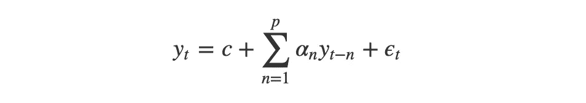**

**上面的等式简单地说“我们的当前值 y_t 等于我们的常数 *c* ，加上每个滞后 y_{t-n}乘以它的系数 *α_n* ，加上 *ϵ_t* 。”不管 *p* 是 1 还是 100，我们都可以使用相同的等式……尽管如果你的模型有 100 个滞后，你可能需要考虑加入我们将要描述的下一个术语:移动平均线。**

****

**照片由 [HiveBoxx](https://unsplash.com/@hiveboxx?utm_source=medium&utm_medium=referral) 在 [Unsplash](https://unsplash.com?utm_source=medium&utm_medium=referral) 上拍摄**

# **马:移动平均线**

**ARIMA 模型的第二个主要部分是**移动平均线**部分。这个分量*不是*滚动平均值，而是*白噪声*中的滞后。**

**ϵ_t 术语，以前是我们添加到预测中的一些容易被遗忘的噪音，现在占据了中心舞台。在 MA(1)模型中，我们对 y_t 的预测是我们的常数加上带有乘数 *θ* ₁的*先前*白噪声项ϵ_{t−1}，加上*当前*白噪声项 *ϵ_t* 。**

**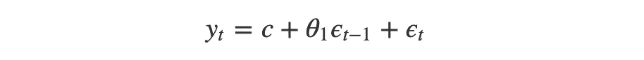**

**如前所述，我们可以用下面的总结来简明地描述 MA(q)模型:**

**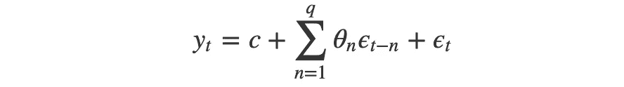**

**这里有三个 MA(1)时间序列，它们的值随着ϵ_{t−1}.的乘数 *θ* ₁的变化而变化如果你在看这些的时候没有经历一个“啊哈”的时刻，不要难过；它们应该看起来相当类似于白噪声。**

**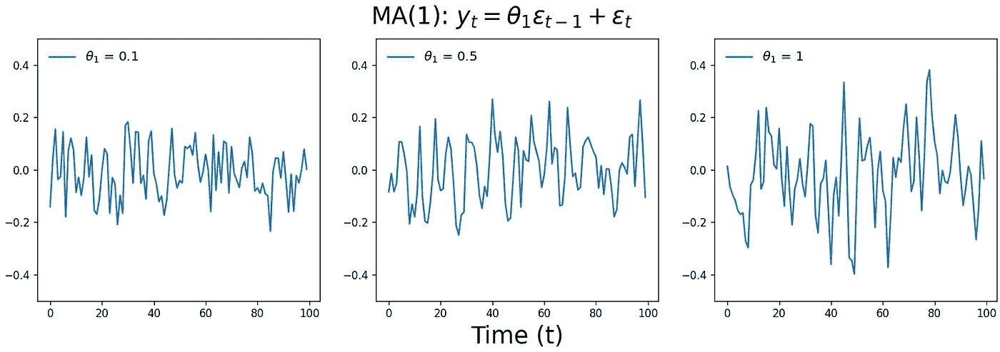**

**作者图片**

**移动平均过程远没有自回归过程直观——什么时间序列不记得它过去的行为，但记得它以前的随机噪声？然而，数量惊人的[现实世界时间序列*是*移动平均过程](https://stats.stackexchange.com/questions/45026/real-life-examples-of-moving-average-processes)，从商店商品和销售的错位，应对自然灾害的电池购买，以及低通滤波器，如汽车音响上的高音旋钮。**

**这里有一个愚蠢但有用的[错位例子](https://www.youtube.com/watch?v=voryLhxiPzE)来自 [YouTuber ritvikmath](https://www.youtube.com/channel/UCUcpVoi5KkJmnE3bvEhHR0Q) 。想象一下，在一个重复的聚会上，你被分配给每位客人一个纸杯蛋糕。y_t 是应该带多少个纸杯蛋糕。你预计大约有 10 个人，所以你从带 10 个纸杯蛋糕开始。当你到达时，你会注意到你供应过多或过少的纸杯蛋糕( *ϵ_t)* 。**

**在接下来的会议中，你带来了 10 个纸杯蛋糕*，这 10 个蛋糕是根据与上一次会议*(现在的ϵ_{t−1})的差异乘以某个系数( *θ* ₁).)而调整的你想把你上次掉的蛋糕数量变成负数，所以你设置了 *θ* ₁=−1.例如，如果你上次少了两个(*ϵ*_ { t1 } = 2)，你应该多带两个。**

**出席的客人数量基本上是随机的，但是**客人会记得上次会议的蛋糕数量**——如果蛋糕太多，就会有更多的客人出席，如果蛋糕太少，就会有更少的客人出席。**

**因此，我们可以在每次会议中模拟正确数量的纸杯蛋糕，如下所示。蓝色部分是你带去参加会议的蛋糕数量，橙色部分是我们带去的蛋糕数量和出席人数之间的差额。**

**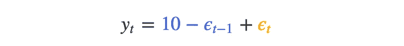**

**这里要注意的是**这个时间序列并不关心自己的历史**(纸杯蛋糕的正确数量)；它只受到短暂记忆的**外部随机噪声的影响**(纸杯蛋糕的数量和参加聚会的人数之差)。因此，这是一个移动平均过程。**

****

**布鲁克·拉克在 [Unsplash](https://unsplash.com?utm_source=medium&utm_medium=referral) 上拍摄的照片**

# **把它放在一起**

**在讨论了 AR 和 MA 过程之后，我们有了构建 ARMA 和 ARIMA 模型所需要的一切。正如您将看到的，这些更复杂的模型只是由 AR 和 MA 组件相加而成。**

## **ARMA:自回归移动平均**

**虽然许多时间序列可以归结为纯自回归或纯移动平均过程，但您通常需要结合 AR 和 MA 分量来成功描述您的数据。这些 **ARMA** 过程可以用以下等式建模:**

**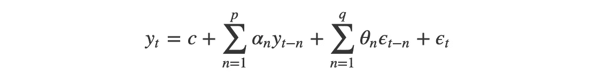**

**ARMA 方程简单地说明了当前时间步长的值是一个常数加上自回归滞后及其乘数之和，加上移动平均滞后及其乘数之和，再加上一些白噪声。这个方程是广泛应用的基础，从[建模风速](https://www.koreascience.or.kr/article/JAKO201315463253802.pdf)，[预测财务回报](https://link.springer.com/article/10.1007/s00180-014-0543-9)，甚至[过滤图像](https://projecteuclid.org/journals/brazilian-journal-of-probability-and-statistics/volume-23/issue-2/Spatial-ARMA-models-and-its-applications-to-image-filtering/10.1214/08-BJPS019.full)。**

**下面是四个 ARMA(1，1)时间序列。与上面的 MA(1)图一样，很难查看下面的任何时间序列并直观地了解参数值，甚至很难知道它们是 ARMA 过程而不是 AR 或 MA。我们现在所处的位置是，我们的时间序列已经变得太复杂，无法通过肉眼观察原始数据来直觉判断模型的类型或参数。**

**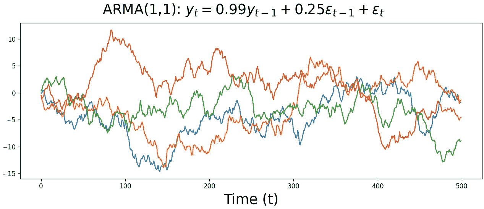**

**作者图片**

**但是没关系。接下来，我们将开始使用 [**AIC**](https://en.wikipedia.org/wiki/Akaike_information_criterion) 来确定哪个模型最能描述我们的数据，是 AR、MA 还是 ARMA 模型，以及每个组件的最佳滞后数。我们将在这篇文章的最后讨论这个过程，但同时让我们讨论 SARIMAX 模型的剩余部分。**

## **ARIMA:自回归综合移动平均线**

**我们来到了这篇博文的同名主题:ARIMA 模式。尽管如此，我们实际上会看到 ARIMA 模型只是一个 ARMA 模型，由模型而不是用户来处理预处理步骤。**

**让我们从 ARIMA(1，1，0)模型的等式开始。(1，1，0)意味着我们有一个自回归滞后，我们对数据进行一次差分，我们没有移动平均项。**

**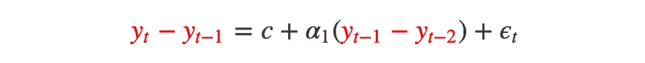**

**注意我们是如何从对 y_t 建模到对 y_t 和 y_{t-1}之间的*变化*建模的。这样，我们的自回归项，以前是 *α* ₁ *(y_{t-1})* ，现在是*α*₁(*y _ { t-1 }-*y _ { t-2 })。**

**换句话说，**ARIMA 模型就是*差分*时间序列的 ARMA 模型。**就是这样！如果我们用 d_t 代替 y_t，代表我们的差分数据，那么我们就又有了 ARMA 方程。**

**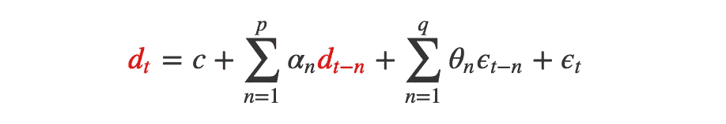**

**我们可以自己进行差分，但是如果 *d* 大于 1，就会变得很麻烦，大多数统计软件包会为我们处理差分。例如，这里有一个 Python 演示，展示了对*原始*数据的 ARIMA(1，1，1)模型和对*差分*数据的 ARMA(1，1)模型的模型系数是如何相等的。**

**上面，我们首先使用`arma_generate_sample`函数来模拟具有指定 *α* 和 *θ* 参数的 ARMA 过程的数据。然后，我们使用`ARIMA`函数来拟合原始数据的 ARIMA 模型和差分数据的 ARMA 数据。最后，我们比较了两个模型的估计参数，表明它们是相等的。**

**这是对原始数据的 ARIMA(1，2，1)模型与对经过两次差分的数据的 ARMA(1，1)模型的相同概念证明。**

****

**克里斯·劳顿在 [Unsplash](https://unsplash.com?utm_source=medium&utm_medium=referral) 上拍摄的照片**

# **附加组件**

**有了 AR、MA 和 I 组件，我们就可以分析和预测大范围的时间序列。但是有两个额外的因素将真正把我们的预测提升到下一个水平:**季节性**和**外部变量。在阅读一些代码并结束这篇文章之前，让我们简单地介绍一下。****

## **学生:季节性**

**顾名思义，季节性是指*在数据中以固定频率*重复的模式:每天、每两周、每四个月等重复的模式。例如，电影院的门票销售往往与上周的销售相关，而房屋销售和气温往往与前一年的数值相关。**

**季节性违背了 ARIMA 模型的平稳性假设，所以我们需要对其进行控制。我们可以通过使用季节性 ARIMA 模型来实现。这些模型有着广泛的应用，从预测巴西的登革热病例到估计台湾的机械工业产出或希腊的发电量。**

**以下是 SARMA 模型的通用等式，季节性因素以橙色突出显示。(对于 SARIMA，用差异数据 d_t 替换 y_t。)**

**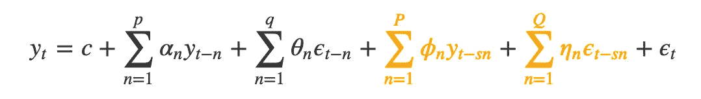**

**请注意，季节性和非季节性成分看起来非常相似。这是因为**季节性模型在滞后*偏移*一定数量的滞后 *s* ，即我们季节性的频率上，符合*一组额外的*自回归和移动平均成分**。**

**例如，对于具有强周季节性的每日电子商务利润模型，我们设置 *s* = 7。这意味着我们将使用一周前的值来帮助预测明天会发生什么。这个过程可以用如下的 SARMA(0,0)(1,0)₇模型来建模。**

**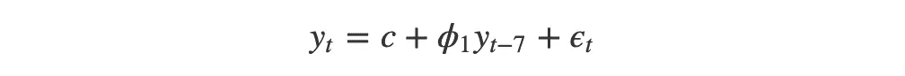**

**但对于现实世界的时间序列，即使是高度季节性的数据也可能更好地用一两个非季节性成分建模:季节性成分可能会捕捉到*长期模式*，而非季节性成分会调整我们对*短期变化*的预测。我们可以修改我们的模型，加入一个非季节性的自回归项，例如，把它变成一个 SARMA(1,0)(1,0)₇模型。**

**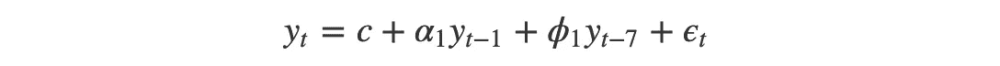**

**SARIMA 模型还允许我们根据季节频率来区分我们的数据，以及任何非季节差异。一个[常见的季节性 ARIMA 模型](https://people.duke.edu/~rnau/seasarim.htm#model1)是 SARIMA(0，1，1)(0，1，1)，下面我们用 *s* = 7 来表示。滞后在等式的右侧，以便于阅读。**

**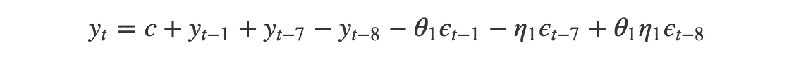**

# **x:外来变量**

**到目前为止，我们描述的所有组件都是时间序列本身的特性。我们的最后一个组成部分，**外生变量，**通过考虑*外部数据*对我们时间序列的影响来抵消这一趋势。**

**这听起来不应该太吓人——**外生变量只是任何非时间序列模型中的*特征*。例如，在一个预测学生考试成绩的模型中，一个标准的线性回归会使用像*学习小时数*和*睡眠小时数*这样的特征。与此同时，ARIMAX 模型还将包括*内生特征，如学生以前的 *n* 考试成绩。*****

***ARIMAX 模型中其他一些外部变量的例子包括[油价对美国汇率](https://www.mathworks.com/help/econ/arima-model-including-exogenous-regressors.html)的影响、[室外温度对电力需求](https://www.mdpi.com/1996-1073/7/5/2938)的影响，以及[关于伤残保险索赔的经济指标](https://www.soa.org/globalassets/assets/files/research/projects/research-2013-arima-arimax-ben-appl-rates.pdf)。***

***这是我们完整的 SARIMAX 方程的样子。外来术语用绿色突出显示。***

***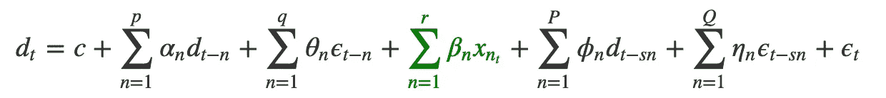***

***请注意，外部因素的影响已经*间接地*包含在我们的时间序列的历史中。例如，即使我们在美国汇率模型中不包括石油价格项，石油的影响也会反映在汇率的自回归或移动平均成分中。任何真实世界的时间序列都是几十个或几百个外来影响的结果，所以为什么要用外来术语呢？***

***虽然在我们的模型中，外部效应是在内生项中间接表示的，但直接测量这些影响仍然更有效。例如，我们的预测将对外部因素的变化做出更快的反应，而不是需要等待它在滞后中反映出来。***

******

***Jonathan Chng 在 [Unsplash](https://unsplash.com?utm_source=medium&utm_medium=referral) 上拍摄的照片***

# ***Python 中的时间序列***

***到目前为止，我们已经介绍了时间序列模型的[自回归](http://localhost:4000/ARIMA-deep-dive/#ar-autoregression)、[移动平均](http://localhost:4000/ARIMA-deep-dive/#ma-moving-average)、[综合](http://localhost:4000/ARIMA-deep-dive/#arima-autoregressive-integrated-moving-average)、[季节性](http://localhost:4000/ARIMA-deep-dive/#s-seasonality)和[外生](http://localhost:4000/ARIMA-deep-dive/#x-exogeneous-variables)成分背后的理论和数学。只需一点点努力，我们可能就能为 SARIMAX 模型填写方程，并手工生成预测。但是我们如何找到模型的参数值呢？***

***为此，我们将使用 Python 的`statsmodels`库。我们将首先拟合一个模型，其中我们提前知道我们的模型阶应该是什么，例如一个自回归滞后和两个移动平均滞后。在下一节中，我们将展示如何使用`pmdarima`库来扫描潜在的模型订单，并为您的数据找到最佳匹配。***

## ***拟合模型***

***假设我们是某电子商务公司的数据科学家，我们想预测接下来几周的销售额。我们有去年每日销售额的 CSV，以及每天的广告支出。我们知道，我们希望我们的模型有一个非季节性的 ARIMA(1，1，1)成分，一个为期 7 天的季节性 AR(1)成分，以及一个广告支出的外部变量。***

***换句话说，我们知道我们想要一个 SARIMAX(1,1,1)(1,0,0)₇模式。下面是我们如何在 Python 中实现这样一个模型。***

***就是这样！我们用`SARIMAX`指定我们的模型，然后用`.fit`方法拟合它(必须保存到一个单独的变量中)。然后我们可以用`summary`方法得到一个 [scikit-learn](https://scikit-learn.org/stable/) 风格的模型概要。`predict`方法让我们将模型[样本内预测](https://stats.stackexchange.com/questions/260899/what-is-difference-between-in-sample-and-out-of-sample-forecasts)与实际值进行比较，而`forecast`方法为未来`n`步骤生成预测。***

## ***比较模型拟合***

***这些都很好，但是如果我们事先不知道我们的模型订单应该是什么呢？对于简单的 AR 或 MA 模型，我们可以分别查看[部分自相关](http://localhost:4000/ARIMA-deep-dive/#partial-autocorrelation)或[自相关图](http://localhost:4000/ARIMA-deep-dive/#autocorrelation)。但是对于更复杂的模型，我们需要执行**模型比较。*****

***我们通常与 AIC 进行模型比较，以衡量我们的模型与数据的吻合程度。AIC 通过惩罚更复杂的模型来防止过度拟合——是的，随着我们添加更多的项，模型的准确性不可避免地会提高，但这种提高足以证明添加另一项是合理的吗？***

***为了确定最佳模型，我们对各种模型订单执行参数扫描，然后选择具有最低 AIC 的模型。(如果我们特别担心过度拟合，我们可以使用更严格的 [BIC](https://en.wikipedia.org/wiki/Bayesian_information_criterion) 来代替。)***

***我们可以依靠 [pmdarima](https://pypi.org/project/pmdarima/) 库中的`auto_arima`函数来完成繁重的工作，而不需要自己编写一堆`for`循环。我们只需输入 AR、I 和 MA 元件的初始阶数估计值，以及我们会考虑的每个元件的最高阶数。对于季节性模型，我们还需要传递季节性的频率，以及季节性 AR、I 和 MA 分量的估计值。***

***从本文开始，我们将在标准普尔 500 每日收盘价中找出最优的 SARIMA 模型。***

***上面的代码说，SARIMA(2,1,0)(1,0,0)₇模型最适合标准普尔 500 指数过去五年的数据…有一些重要的警告！在你把你一生的积蓄赌在这个模型的预测上之前，我们应该记住，尽管有一个方便的参数扫描，我们仍然可以从建模这个数据中挤出很多准确性。***

***首先，我们没有以任何方式对数据进行预处理，例如扫描异常值或插入任何间隙。类似地，我们没有检查任何转换是否会使数据更容易预测，例如采用百分比回报或平方根。***

***最后，我们的季节性频率 7 有点无中生有——可能有一个季节性，如每月、每季度或每年，这大大提高了我们的模型性能。诸如此类的考虑对于发布不会让你尴尬的预测是必不可少的！***

***(还有一个提醒，这个帖子不是投资建议！；-))***

## ***为什么不是深度学习？***

***还有一个我们还没有涉及的概念，它为这篇文章提供了一个重要的视角。经典统计学是伟大的，但在机器学习的时代，ARIMA 是过去的遗物吗？当像[脸书的 Prophet](https://facebook.github.io/prophet/) 和 [LinkedIn 的 Greykite](https://engineering.linkedin.com/blog/2021/greykite--a-flexible--intuitive--and-fast-forecasting-library) 这样的开源库生成的预测比精心打磨的 SARIMAX 模型更准确时，为什么还要费心去理解早先那个移动平均纸杯蛋糕的例子呢？***

***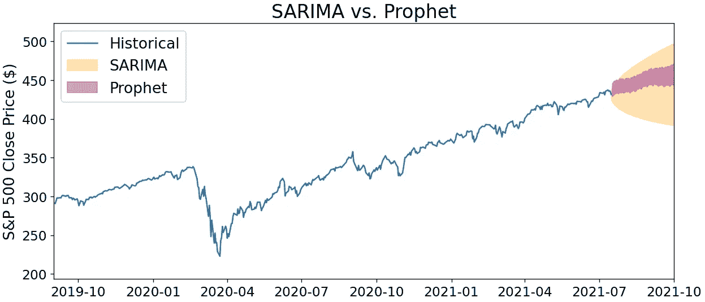***

***作者图片***

***这个问题触及了机器学习和统计学之间的一个重要区别，最终是准确性和可解释性之间的权衡。要选择使用哪种工具，你必须明白你的目标是**生成最准确的预测**，还是**理解数据中潜在的生成过程。*****

***当你想最大限度地提高准确性，并愿意牺牲一些可解释性时，机器学习——尤其是深度学习——是首选工具。[例如，递归神经网络](https://en.wikipedia.org/wiki/Recurrent_neural_network)是一种强大的预测工具，但解释*网络如何生成预测需要搜索向前和向后反馈的隐藏层的混乱——这是一项艰巨的任务。如果你公司的高层领导正在根据你的预测权衡一个重大的商业决策，他们不太可能接受一个甚至你都不太明白它是如何运作的模型。****

***因此，ARIMA 模型可能是一个有吸引力的替代方案，即使其预测能力较低。通过具体了解时间序列中的值如何相互关联，就更容易对时间序列本身建立直觉，例如今天的值对明天的影响有多大、季节性的循环等等。***

*****正确的工具——机器学习或经典统计学——最终取决于您分析的更广泛的业务背景。**(通过使用曲线拟合模型的线性组合，Prophet 实际上位于这两个极端之间的[。)](https://peerj.com/preprints/3190/#)***

******

***菲德尔·费尔南多在 [Unsplash](https://unsplash.com?utm_source=medium&utm_medium=referral) 上的照片***

# ***结论***

***这篇文章深入探讨了 ARIMA 时间序列预测模型家族。我们从预测模型的一些基础理论开始，包括自相关和平稳性。然后，我们建立了简单的自回归模型，其中时间序列的现值是一些先前值的加权和。然后，我们研究了移动平均过程，这是一种不直观但常见的现象，时间序列会记住历史外部噪声。***

***我们将这些成分放在一起形成 ARMA 模型，然后展示了 ARIMA 模型如何简单地成为我们差分数据的 ARMA 模型。然后，我们展示了如何通过添加一组季节性自回归和移动平均成分来解释季节性，以及直接测量外部因素对我们数据的影响。***

***最后，我们用 Python 训练了一个 SARIMAX 模型，并进行了参数扫描，为我们的标准普尔 500 收盘价数据集确定了一个潜在的模型订单。然后我们讨论了为什么 ARIMA 仍然是一个有用的选择，即使有更精确的方法存在。***

***时间序列预测是一个巨大的领域，我们可以用模型选择和公式的细微差别来填充更多的博客帖子。但是不管你的时间序列知识如何，我希望它继续上升。***

***最好，
马特***

# ***脚注***

## ***1.介绍***

***“我们永远无法完美预测未来”听起来显而易见，但其背后的推理实际上很吸引人。在 [*智人*](https://www.ynharari.com/book/sapiens-2/) 一书中，尤瓦尔·诺亚·哈拉里谈到了[两种类型的混沌系统](https://www.goodreads.com/quotes/7426402-history-cannot-be-explained-deterministically-and-it-cannot-be-predicted)。第一种是混沌，它对预测没有反应，比如天气。天气是通过无数空气分子的非线性相互作用出现的——这非常难以预测，但我们可以使用越来越强的计算机模拟来逐步提高我们的准确性。***

***与此同时，第二类混沌系统*对关于它的预测做出反应。历史、政治和市场都是这种系统的例子。例如，如果我们完美地预测明天的石油价格会比今天高，那么购买石油的热潮将会改变今天和明天的石油价格，*导致预测变得不准确*。****

****作为数据科学家，我们习惯于认为我们的分析与我们试图理解的过程是分开的。但是在我们的预测实际上影响结果的情况下，我们几乎没有希望完美地预测未来…除非我们让我们的猜测保持安静。****

## ****2.偏自相关****

****自相关图中滞后 *n* 处的急剧下降表示 **MA(n)** 过程，而偏相关图中的明显下降表示 **AR(n)** 过程。但是，除非您的数据集确实非常庞大，否则您很可能最终会进行参数扫描，以确定最能描述您的数据的模型的参数。如果两个自相关图都消失了，你看到的是 ARMA 或 ARIMA 过程，无论如何都需要进行参数扫描。****

## ****3.平稳性****

****我陷入了一个长长的兔子洞，试图理解平稳性假设的真正含义。在平稳过程与非平稳过程的对比图中，我使用一个有噪声的正弦波作为平稳过程的例子。这个数据集*确实*通过了[增强的 Dicky-Fuller 测试](https://en.wikipedia.org/wiki/Augmented_Dickey%E2%80%93Fuller_test)，但是如果你将数据扩展到 1000 个样本，ADF 测试不再说时间序列是平稳的。****

****这是因为 ADF 本质上衡量的是向均值的回归——非平稳过程没有漂移的问题，之前的滞后不提供相关信息。同时，平稳过程的滞后值*在预测下一个值时提供相关信息。*****

## ****4.AR(0):白噪声****

****在我们的示例中， *ϵ_t* 值是从正态分布中采样的，因此这是**高斯白噪声。** [我们可以很容易地使用另一种分布](https://ionides.github.io/531w20/03/notes03.pdf)来生成我们的值，比如均匀分布、二进制分布或正弦分布。****