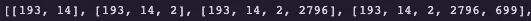

# 预测下一个单词的深度学习方法

> 原文：<https://towardsdatascience.com/a-deep-learning-approach-in-predicting-the-next-word-s-7b0ee9341bfe?source=collection_archive---------8----------------------->

## 教计算机预测句子中的下一组单词


Szabo Viktor 在 [Unsplash](https://unsplash.com?utm_source=medium&utm_medium=referral) 上拍摄的照片

在本教程中，我们将逐步完成构建深度学习模型的过程，该模型用于预测种子短语后面的下一个单词。例如，在我们键入“候选人是”之后，我们将要求计算机预测接下来的 10 个单词。

虽然智能手机中用于帮助发送短信的尖端模型要复杂得多，但本文应该会让您对这一预测(分类)任务中涉及的方法有一个大致的了解。

## 本文将回顾:

1.  文本处理:标记化、n_gram 排序、工程特征和标签以及单词嵌入
2.  建立双向 LSTM 模型
3.  使用我们的模型基于种子短语预测单词

# 我们来编码吧！

本教程的所有开发都是使用 Google Colab 的数据处理功能完成的。你当然可以在本地机器上运行这段代码，但是除非你有一个专用的 GPU，否则训练时间可能会相当长。

在本教程中，我们将使用用户对纽约时报文章[链接](https://www.kaggle.com/aashita/nyt-comments?select=ArticlesMarch2018.csv)的评论片段。由于这只是一个教程，自然语言数据在计算上非常昂贵，这个数据集的有限范围非常适合我们的需要。

让我们加载所需的库，因为训练数据驻留在 Google Drive 上，所以我们将 gdrive 挂载到 Colab。最后，我们将把目录更改为存放训练数据的位置。请注意，将您的 Google Drive 与 Colab 链接会自动在您的 Google Drive 中创建“Colab 笔记本”目录。由于“Colab”和“Notebooks”之间的空格，您的路径目录可能略有不同。例如，注意用于指定空间“/content/drive/my drive/Colab \ Notebooks”的反斜杠

```
import csv
import nltk
import string
import pandas as pd
import numpy as np
from google.colab import drive
from keras import backend as K
import tensorflow as tf
from tensorflow.keras.preprocessing.sequence import pad_sequences
from tensorflow.keras.layers import Embedding, LSTM, Dense, Bidirectional
from tensorflow.keras.preprocessing.text import Tokenizer
from tensorflow.keras.models import Sequential
from tensorflow.keras.optimizers import Adamdrive.mount('/content/drive/')%cd '/content/drive/MyDrive/Colab Notebooks'
```

确定哪些数据将用于训练我们的深度学习模型非常重要。在尝试构建现代文本预测模型时，您显然不希望使用莎士比亚的作品来训练您的模型。你的模型将会学习莎士比亚所写的那些不能有效地翻译成今天的现代英语的单词的上下文细微差别。使用最有可能反映你希望预测的句子类型的数据集将产生最佳结果。也就是说，利用非常大的广义文本数据集，想想维基百科，也可以产生准确的结果。

我们将使用 Pandas 读入 CSV 文件并打印出前 5 行。我们将使用突出显示的“snippet”列，其中包含用户评论的摘录。我们的数据有很强的政治和全球新闻内涵，但对于本教程来说，这就足够了。

```
path = '/content/drive/MyDrive/Colab Notebooks/ArticlesMarch2018.csv'df = pd.read_csv(path)df.head()
```


# 文本处理

在构建模型之前，我们需要对数据应用一些处理步骤。首先，让我们将所有片段组合成一系列字符串。

```
snippet = '\n'.join(df['snippet'])print(type(snippet))print(snippet)
```


一个由外部片段组成的长串联字符串

接下来，我们将把任何大写的单词转换成小写，以减少我们的词汇量。否则，我们会有重复的单词，唯一的区别是大写字母(即。美洲/美国)。注意 lower()函数将我们的字符串转换成了一个字符串列表。

我们的语料库包含 1385 个独特的片段。

```
corpus = snippet.lower().split('\n')print(len(corpus))print(type(corpus))print(corpus[:2])
```


包含我们的片段字符串的列表

## 标记器

由于计算机不能处理原始文本数据，我们需要对我们的语料库进行标记，以将文本转换为数值。Keras 的 Tokenizer 类根据词频转换文本，其中最常见的词的标记值为 1，其次是最常见的词的标记值为 2，依此类推。结果是一个字典，其中包含唯一单词的键/值对及其基于词频确定的分配标记。

我们的词汇表中有 6862 个独特的单词，外加(1)个词汇表之外的单词。注意，Keras 的 Tokenizer 类自动从我们的语料库中删除所有标点符号。通常，在处理 NLP 预测任务时，我们会删除所谓的“停用词”或对句子没有太大意义的术语(即。那个、他、在、为等。).然而，由于我们试图预测类似人类语言的句子，我们将保留停用词。

```
tokenizer = Tokenizer()
tokenizer.fit_on_texts(corpus)
word_index = tokenizer.word_index
total_unique_words = len(tokenizer.word_index) + 1 print(total_unique_words)print(word_index)
```


独一无二的单词及其标记化版本的单词索引词典

虽然下面的代码对于我们的分析来说不是必需的，但是为了准确起见，比较实际的文本和它的标记化版本是一个很好的实践。

通过应用下面的代码，我们可以看到我们整个标记化的语料库。例如，第一个片段以*“美国有一个生产力问题”*开始，这个问题已经被标记为【193，14，2，2796，699】。检查上面的 word_index 字典，我们看到字母“a”已经用数字 2 进行了标记，这与标记的第一个代码片段相对应。

```
for line in corpus:
   seqs = tokenizer.texts_to_sequences([line])[0]print(seqs)
```


标记化代码片段示例

## n 克

这是本教程的一个棘手的部分。在典型的监督回归或分类问题中，我们的数据集将包含 x 值(即输入要素)和 y_values(即。标签)，这允许模型学习我们的特征中与我们的标签相关的独特模式。我们的数据集似乎缺少 y_values(即标签)。不要担心，n_grams 帮助我们分割数据，以获得我们的标签。n_gram 是长度为 n 的单词序列。例如，“芝加哥小熊队”是长度为 3 的 n_gram(即。3 _ 克)。

## 多对一 N 元序列

我们将把这个概念向前推进一步，迭代每个标记化的片段，以创建 n_gram+1 大小的 n_gram。有时这被称为“多对一”序列图。例如，我们在第一个代码片段中的前五个标记化单词(即。*美国有生产力问题)*有【193，14，2，2796，699】*。*通过创建 n_gram+1 个 n_gram 序列，我们得到下面的列表。



请记住，这种多对一的方法适用于每个片段，而不是整个语料库。因此，排序后的 n_grams 从每个新片段开始。


假代币例句

我们对所有的片段使用这种方法，最终产生了将近 27，000 个 n _ grams。让我们更详细地检查一下代码。首先，我们创建一个空列表来保存上面描述的 n_gram 序列。接下来，我们遍历未分词片段的语料库，并对每个未分词片段应用“texts_to_sequences”方法。正如我们在上面看到的,“texts_to_sequences”方法只是将每个片段转换成它的标记化版本。接下来，我们迭代每个标记，从第二个标记(index=1)开始，直到所有剩余的标记。在每次迭代中，我们将 n_gram 的序列附加到 input_sequences，并扩展 n_gram+1。

```
input_sequences = []for line in corpus:
  token_list = tokenizer.texts_to_sequences([line])[0]
    for i in range(1, len(token_list)): 
      n_gram_seqs = token_list[:i+1]
      input_sequences.append(n_gram_seqs)print(len(input_sequences))
print(input_sequences)
```


## N_Grams 的填充

请注意，n_grams 长度不同，我们的模型要求 n_grams 的每个输入序列长度相同。因此，我们需要将每个 n_gram 序列用零“填充”到最长 n_gram 的长度。Max_seq_length 将标识最长 n_gram 序列的长度(即 41).那么“pad_sequences”方法将在我们的令牌之前添加零(即 padding='pre)到 max_seq_lenth(即。41).

```
max_seq_length = max([len(x) for x in input_sequences])
input_seqs = np.array(pad_sequences(input_sequences, maxlen=max_seq_length, padding='pre'))print(max_seq_length)
print(input_seqs[:5])
```


长度为 41 的填充 n_gram 序列

## 创建要素和标签

现在我们已经填充创建和填充了 n_gram 序列，我们可以提取我们的特征和标签。回想一下，每个 n_gram 序列的长度是 41 个值。前 40 个值将是我们的特性，第 41 个值将是我们的标签。理论上，这是一个多类分类问题，因为模型将学习我们单词之间的关系，然后提供关于哪个单词应该是我们序列中的下一个单词的概率。该模型只能提供它见过的单词的概率(即唯一单词总数:6863)。由于这是一个多分类问题，我们也将对我们的标签应用一次性编码。下面我们打印了前三个特征和标签(没有一次性编码)来展示我们的方法。

```
x_values, labels = input_seqs[:, :-1], input_seqs[:, -1]y_values = tf.keras.utils.to_categorical(labels, num_classes=total_unique_words)\print(x_values[:3])
print(labels[:3])
```


我们的一次性编码标签(即 y_values)的形状为 26，937(即测序的 n _ grams 的数量)乘以 6，863(即语料库中唯一单词的数量)。除了第一个单词，我们语料库中的每个单词都是一个特征和标签，因为模型将学习哪些单词更有可能和更不可能跟随其他单词序列。

## 单词嵌入

在这些类型的 NLP 问题中，游戏的名称是“上下文”。我们如何优化我们的战略(即。数据处理和模型复杂性)以使我们的模型能够更好地学习单词之间的关系。以目前的形式，我们的数据为我们的模型学习提供了前进的背景。换句话说，由于我们的 n_gram 序列，我们知道哪些单词更有可能或更不可能跟在其他单词后面。然而，用于表示每个单词的标记只不过是频率计数，其提供了关于单词之间的上下文信息的模型有限信息。例如，单词“good”和“great”在意思上非常相似，但它们的标记值却是(299，673)。

```
print(tokenizer.word_index['good'])print(tokenizer.word_index['great'])
```

单词嵌入使我们能够在 n 维空间中表示单词，其中诸如“good”和“great”之类的单词在这个 n 维空间中具有计算机能够理解的相似表示。在下图中，我们可以看到单词的嵌入(7 维),如狗、小狗、猫、房子、男人、女人、国王和王后。维度对我们来说是未知的(不可解释的),因为模型在迭代数据时会学习这些维度。也就是说，为了帮助读者理解单词嵌入模型，让我们假设维度是“生物、猫、人、性别、皇室、动词、复数”。我们可以看到“房子”有一个-0.8 嵌入在 D1(即。而所有其他单词在“生物”维度上得分相对较高。通过学习这些嵌入，计算机能够更好地理解单词之间的上下文关系，因此应该能够更好地预测种子短语之后的下一个单词。


Keras 有一个“嵌入”层，可以基于我们的语料库构建自己的单词嵌入，但我们将利用斯坦福大学名为“GloVe”(单词表示的全局向量)的预训练单词嵌入模型。手套嵌入有几种风格，但我们将使用 100 维版本。您需要从这个[链接](https://nlp.stanford.edu/projects/glove/)下载预先训练好的模型。这个模型被训练了十亿个单词。独特的话)40 万字。

首先，让我们处理嵌入文本文件并生成一个字典，其中包含作为键的单词/字符和作为值的 100 维数组。

```
path = '/content/drive/MyDrive/Colab Notebooks/glove.6B.100d.txt'embeddings_index = {}with open(path) as f:
  for line in f:
    values = line.split()
    word = values[0]
    coeffs = np.array(values[1:], dtype='float32')
    embeddings_index[word] = coeffsdict(list(embeddings_index.items())[0:2])
```


现在让我们创建一个矩阵，其中包含手套词嵌入(即。100 维数组)仅用于我们词汇表中的单词。首先，我们创建一个形状为 6863 的零矩阵(即我们的语料库中唯一单词的总数)乘以 100(即手套包含 100 个尺寸)。然后，我们将遍历“word_index”字典，该字典包含您的语料库中的唯一单词作为键，以及它们相应的标记作为值。在 word_index 字典的每次迭代中，我们将获取相应的手套嵌入(即 100 维数组)存储在“嵌入 _ 索引”中，并更新嵌入 _ 矩阵(即用 100 维数组替换零)。

```
embeddings_matrix = np.zeros((total_unique_words, 100))for word, i in word_index.items():
   embedding_vector = embeddings_index.get(word)
   if embedding_vector is not None:
     embeddings_matrix[i] = embedding_vector;
```

# 构建我们的模型

我们将构建一个相对较浅的模型，由一个嵌入层、三个 LSTM 层、三个分离层和一个完全连接的密集层组成。作为嵌入层的第一层将使我们能够利用预训练的手套单词嵌入系数/权重。嵌入层需要唯一字总数的 **input_dim** (即词汇量的大小)和一个 **output_dim** ，它指定了我们想要的单词嵌入维数。因为我们使用手套 100 维，我们的 out_dim 参数将是 100。我们将把 embeddings_matrix 传递到权重参数中，以便使用手套权重，并将可训练参数设置为“False”，否则，我们将重新训练手套权重。最后，我们将把**输入长度**参数设置为“最大序列长度-1”。

## 递归神经网络

回想一下，帮助您的模型理解上下文或单词之间的关系最终会产生一个性能更好的模型。我们使用 n_gram 序列和单词嵌入来帮助我们的模型学习这些关系。我们现在可以利用一个特别适合于检查单词序列之间关系的特定模型结构。在传统的神经网络中，输入和预测/输出彼此完全独立。另一方面，我们试图预测句子中的下一个单词，这意味着网络需要“记住”来自以前单词的上下文信息。

一个**递归神经网络(RNN)** 模型架构结合了以前的数据来做出未来的预测。换句话说，RNNs 有一个内置的记忆功能，它存储来自前一个单词的信息，并在预测下一个单词时使用该信息。也就是说，简单的 rnn 很难“记住”序列中较早学习到的信息。换句话说，给定一个单词的句子，RNN 可以合并几个相邻单词之间的信息，但是随着 RNN 继续迭代句子，句子中第一个和后面的单词之间的关系开始失去它们的意义。当您有一个包含几十或几百个隐藏层非常深的模型时，这尤其重要。

一种**长短期记忆(LSTM)** 模型通过学习单词之间的关系并允许重要的关系通过网络传播来解决这个问题。这样，在一个序列的前几个单词中学习到的信息可以影响序列/句子、段落、章节等中的进一步预测。此外，我们将利用双向 LSTM，它将学习从左到右和从右到左阅读句子的单词之间的关系。

我们的 LSTM 层的输入总是三维的(即批量大小，最大序列长度，特征数量)。 **batch_size** 将被设置为 **None** ，这简单地指定该层将接受任意大小的批处理。 **Max_seq_length 是 40** ,因为所有的代码片段都已被标记化并填充为 41 减 1 作为我们的标签。最后，我们有 **100 个特征**，因为手套有 100 个尺寸。

我们将添加三个 [**删除层**](https://machinelearningmastery.com/dropout-regularization-deep-learning-models-keras/) (删除 30%)来帮助模型过度拟合训练数据。

深度学习是一种徒劳的练习，因为你可以在剩余的时间里调整参数。选择正确的优化器只是我们可以调整的另一个参数。我们最终选择了 Adam，因为它在直接模型准确性和效率方面都优于 SGD 和 RMSProp，因为损失减少的速度几乎是 SGD 和 RMSProp 的两倍。

由于该模型的输出可以是 6863 中的 1(即 total_unique_words)单词，这是一个多类分类问题，这就是为什么我们使用**分类交叉熵**作为我们的损失函数。

```
K.clear_session()model = tf.keras.Sequential([tf.keras.layers.Embedding(input_dim = total_unique_words, output_dim=100, weights=[embeddings_matrix], input_length=max_seq_length-1, trainable=False),tf.keras.layers.Bidirectional(tf.keras.layers.LSTM(256, return_sequences=True)),tf.keras.layers.Dropout(0.2), tf.keras.layers.Bidirectional(tf.keras.layers.LSTM(256)),tf.keras.layers.Dropout(0.2),tf.keras.layers.Dense(128, activation='relu'),tf.keras.layers.Dense(total_unique_words , activation='softmax')])model.compile(optimizer=Adam(learning_rate=0.001), loss='categorical_crossentropy', metrics=['accuracy'])tf.keras.utils.plot_model(model, show_shapes=True)
```


最后，我们将使用 x 值和 y 值来拟合/训练模型。选择 batch_size 是我们可以调整的另一个参数。因为我们有 26，937 个 n _ gram 来训练我们的模型，所以一次加载所有 26，937 个 n _ gram 是非常低效的。让我们针对 120 个时期训练我们的模型，其中 1 个时期需要所有 26，937 个 n _ grams 运行模型一次。因此，26937(即。27，000)除以 120 意味着每批大小应为 225 n 克。然而，为了充分利用我们的内存，我们将使用 batch _ size 256。我们还将对训练和验证数据应用 80/20 分割。

```
history = model.fit(x_values, y_values, epochs=120, validation_split=0.2, verbose=1, batch_size=256)
```

# 模型评估

我们的模型肯定是过度拟合了我们的训练数据，因为训练精度继续提高，而验证精度却停滞不前。性能良好的 NLP 模型非常需要数据。拥有数千万单词的数据集并不罕见，而我们的语料库只有 6863 个单词。我们可以添加额外的 LSTM 层，更多的正则化技术以及更多的数据来改进模型，但本教程旨在为读者提供如何构建和建立单词预测模型的一般概念。也就是说，让我们看看我们的模型预测实际的新片段有多好。


# 种子文本预测

让我们来看看我们的模型能在多大程度上推广到以前从未见过的新闻片段。我们将用上个月每个实际新闻片段的前几个词作为模型的种子，并比较模型的预测。

```
def prediction(*seed_text*, *next_words*): 
  for _ in range(next_words):
  token_list = tokenizer.texts_to_sequences([seed_text])[0]
  token_list = pad_sequences([token_list], maxlen=max_seq_length-1, padding='pre') predicted = np.argmax(model.predict(token_list, verbose=1), axis=-1) ouput_word = "" for word, index in tokenizer.word_index.items():
    if index == predicted:
      output_word = word
      break
  seed_text += ' '+output_word
  print(seed_text)seed_phrase = "I understand that they could meet"
next_words = len("with us, patronize us and do nothing in the end".split())prediction(seed_text, next_words)
```

模型生成的文本当然是围绕全球新闻和政治的。我们看到诸如“一代”、“政府”、“借贷”、“监管”、“政策”等词，这些词符合模型学习的数据类型。不幸的是，从人类片段中识别模型生成的文本并不困难。此外，当我们使用一个上下文非常不同的种子短语“我真的很喜欢骑我的摩托车”时，模型很难对一个类似于准确英语句子的句子进行分类。

## 实际新闻片段 1

“我知道他们可能会见我们，资助我们，但最终什么也不做”

## 种子短语 1

“我知道他们可以见面”

## 模型生成 1

“我知道他们可以应对你们这一代人的挑战，也知道你们为什么要借钱”

## 实际新闻片段 2

“该机构计划在周二公布一项新规定，该规定将限制该机构在制定政策时可以使用的科学研究种类。”

## 种子短语 2

"该机构计划在周二发布一项新的规定，限制."

## 模型生成 2

“该机构计划在周二公布一项新的规定，将限制政府在 9 月份发生的事情，他们必须是第三个”

## 实际新闻片段 3

“支持增加限制的枪支拥有者可能是一个被忽视的群体。一些人变得更加直言不讳，游行并证明支持限制。

## 种子短语 3

“支持增加限制的枪支拥有者”

## 模型生成 3

支持增加对专家限制的枪支所有者最近计划对钢铁和铝关税征收全面关税，同时

## 自生成种子短语

“我真的很喜欢骑摩托车”

## 模型生成短语

“我真的很喜欢骑摩托车，但每个人都问我讨厌这个问题”

# 结论

在自然语言处理领域，这无疑是一个激动人心的时刻。像 OpenAI 的“GPT-3”这样的模型正在继续推动我们的自然语言处理能力的进步。这篇教程是对文本分类的简单介绍，我希望它能激发你对这个令人兴奋的领域的兴趣。

对 OpenAI 的 GPT 3 能力的一些见解[链接](https://prototypr.io/post/gpt-3-design-hype/)。