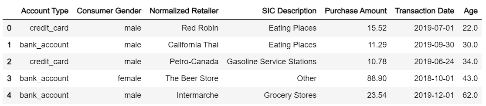
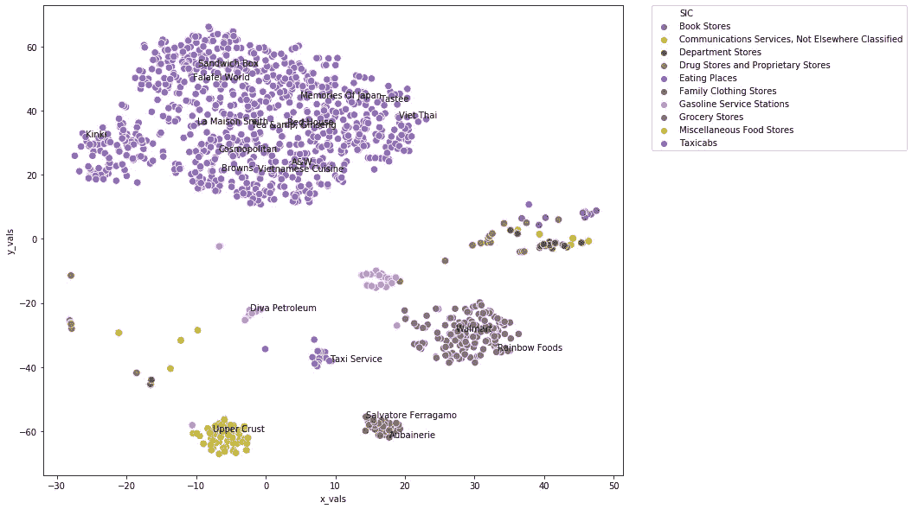
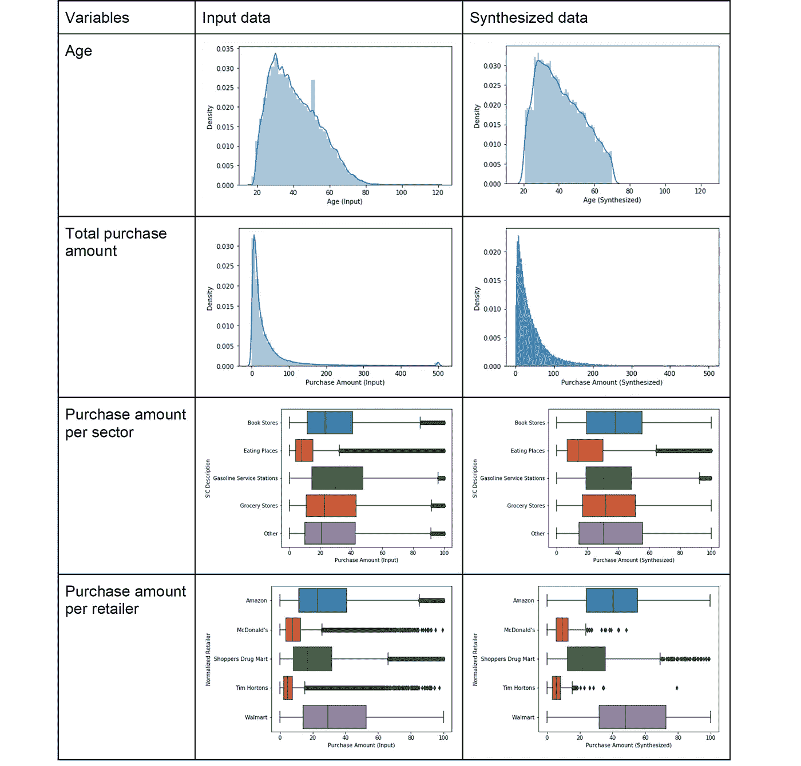

# 一种基于深度学习的数据合成方法及其在金融交易中的应用

> 原文：<https://towardsdatascience.com/a-deep-learning-based-method-for-synthesizing-data-with-an-application-in-financial-transactions-9c3936423d9a?source=collection_archive---------20----------------------->

## [理解大数据](https://towardsdatascience.com/tagged/making-sense-of-big-data)

## 如何使用变分自动编码器和一般线性回归预测表格交易数据


由[粘土银行](https://unsplash.com/@claybanks)在 [Unsplash](https://unsplash.com/) 上拍摄

# 背景

销售预测在商业计划中起着极其重要的作用。这是一个有用的工具，它从过去和当前的销售数据中提取信息，智能地预测未来的业绩。有了准确的销售预测，决策者可以更有信心地优化营销策略和业务扩展计划。例如，如果你的销售预测说，你的年销售额的 50%将发生在圣诞节期间，你将需要在秋季增加库存和产量，为销售高峰做准备。感恩节后，你可能还想雇佣更多的销售人员。如果你对竞争对手有准确的销售预测，从而更好地了解他们的优先事项和目标，你就可以在计划促销活动时领先一步。一份好的销售预测可以告知你业务的许多其他方面。

对于这个项目，我实现了一个框架，使用支付应用程序的历史交易记录来预测销售额。该框架应用宏观经济指数来约束未来的总交易数量，并应用表格变量自动编码器(TVAE)来模拟单个交易记录。本文提供了一些示例代码，有关代码的详细信息，请查看我的 [Github](https://github.com/rui-zhang-ocean/Predict_Transactions) 。

# 数据

本项目使用的数据集来自某支付 app，是一个表格数据，从 2018 年 9 月到 2020 年 1 月，交易记录超过 300 万条。每个记录包含客户(年龄、性别、地址等。)、账户(账户类型、银行等。)、交易(交易类型、金额、日期等。)和零售商信息(零售商名称、部门等)。).首先，我选择了如下变量:“账户类型”、“消费者性别”、“消费者年龄”、“交易日期”、“标准化零售商”、“基本描述(部门)”和“购买金额”。

表 1。表格数据中所选变量的样本



# 方法

合成数据生成器获取输入表格数据，从中学习模型，并输出与输入数据具有相似统计属性的新合成数据。当法规或其他隐私问题限制对原始数据的访问，或者原始数据的收集成本很高，或者根本无法获得时，通常会使用这种方法。根据最近麻省理工学院关于合成数据生成技术的基准测试[研究](https://github.com/sdv-dev/SDGym)，表格变分自动编码器(TVAE)合成器的性能优于其他合成器，值得推荐。

自动编码器的基本思想是将编码器和解码器构造为神经网络，并使用迭代优化过程来学习最佳编码-解码方案。编码器类似于降维技术，如主成分分析(PCA ),它将输入数据转换为潜在空间中的表示，解码器从潜在空间中随机采样，并将其转换为表格数据。训练是有规律的，以避免过度拟合，并确保潜在空间具有良好的属性，使生成过程。

这里我使用 TVAE 合成器加载历史交易数据作为输入，训练模型，输出模拟的交易数据。输出数据从历史时间段反映了客户的消费习惯，但缺乏交易总数的约束。因此，我建立了历史交易次数与宏观经济指标(GDP、CPI、失业率等)之间的广义线性回归模型。)并将其用于预测未来的交易计数。此外，我还需要根据历史指数预测未来的经济指数。提议的工作流程如下:

*   给定未来某年某月，例如 2021 年 2 月，根据历史指数预测宏观经济指数。
*   使用回归模型预测 2021 年 2 月的交易计数 N。
*   使用经过训练的 TVAE 合成器生成 N 条交易记录。

## 特征工程和零售商嵌入

我从数据清理和特征工程开始。表格数据维护得很好，缺失值或无效值(即负年龄)不到 2%，所以对于缺失值或无效值，我简单地删除了它们。

数值小于 10 的分类变量用一个热编码处理，包括“账户类型”(借方或贷方)、“消费者性别”(男性或女性)和“原文描述”。请注意,“SIC Description”仅保留具有最大计数的前 9 个值，并将其余记录归入“other”中。

起初，我将“年龄”视为一个连续的数字变量，但综合的年龄分布看起来并不是最佳的。30 到 50 岁之间的一大块光谱丢失了。我通过将年龄转换成“年龄范围”来确定它(即 20-25，25-30，30-35，等等。)作为模型输入，然后通过从每个范围中随机选择一个数字，将模拟范围转换回“年龄”。这是一种将连续数值转换为离散的固定宽度箱，并将这些离散值视为类别的经典方法。

我将“交易日期”分解为两个分类值:“一个月中的某个时间段”和“一周中的某一天”。“一个月的周期”包含变量“开始”(一个月的 1-10 天)、“中间”(一个月的 11-20 天)和“结束”(一个月的 21 天到月末),这是指任何给定月份的不同周期。“星期几”是指一周中的某一天(星期一、星期二等)。).这种方法忽略了年度和月度变化，而是关注周变化和日变化。原因是，当使用宏观经济指数(通常每月发布)预测交易数量时，我们会纳入年度和月度变化，因此合成器不一定需要包括历史记录中的信息。

“标准化零售商”是最难处理的变量。它包含 2000 多家零售商，因此需要嵌入来将维度减少到可管理的水平。在这里，我应用“item2vec”将“标准化零售商”转换为 10 维嵌入。为了向读者提供一些上下文，在自然语言处理(NLP)领域中，“word2vec”通过将每个句子视为共享相似上下文的“单词集”来学习保持单词的语义特征和单词之间的关系的单词嵌入。“item2vec”是其在非 NLP 领域的变体之一，其中它将“项目集”作为与句子(“单词集”)类似的上下文，并找出项目之间的关系。使用嵌入代替一键编码有两个主要优点。首先，减少的维度可以用有限的内存来管理。第二，它更好地代表了变量的距离或相似度。

> “来自网络搜索、电子商务和市场领域的研究人员已经意识到，就像人们可以通过将句子中的单词序列视为上下文来训练单词嵌入一样，同样可以通过将用户动作序列视为上下文来训练用户动作嵌入。”
> 
> — Mihajlo Grbovic，Airbnb

训练项目嵌入的最大挑战是如何定义“项目集”，或者如何找出与这些项目最相关的上下文。对于这个项目，我对零售商测试了几种不同的分组方法:a)对在同一天与同一个客户有交易的零售商进行分组。b)属于同一部门并在同一天进行交易的集团零售商。c)属于同一部门并与同一客户有交易的集团零售商。

事实证明，选项 C 表现最好，在将 10 维减少到 2 维后，我绘制了零售商向量的散点图。彩色地图指示不同的扇区。这表明嵌入可以很好地对零售商进行分组。

图一。按行业分类的零售商嵌入



我使用了来自 [gensim](https://pypi.org/project/gensim/) 的 word2vec 模块来训练 retailer2vec 模型。word2vec 模块将每个句子视为“集合”,并有一个参数窗口大小来确定我们搜索每个单词的“上下文”的范围。相比之下，在我们的 retailer2vec 实现中，零售商的“含义”应该被同一集合中的所有邻居捕获。换句话说，我们应该考虑属于同一部门并与同一客户有交易的所有零售商，以确定每个零售商的“意义”。然后需要根据每个零售商集合的大小来改变窗口大小。

为了在不修改 gensim 库的底层代码的情况下解决这个问题，一种方法是定义超大窗口大小(例如，999999)，其远大于训练数据中设置的任何零售商的长度。尽管这种解决方法并不理想，但它确实取得了可以接受的结果。最好的选择可能是修改 gensim 中的底层代码。下面是使用 word2vec 训练嵌入的示例代码。

```
from gensim.models import Word2Vecmodel = Word2Vec(sentences = training_data,
                 iter = 10,
                 min_count = 5,
                 size = 10, 
                 workers = 4, 
                 sg = 1, 
                 hs = 0, 
                 negative = 10, 
                 window = 999999)
```

当将综合零售商嵌入反转回零售商时，该模型将只检查综合部门中零售商之间的距离(“SIC 描述”),并挑选最近的一个。

## 列车 TVAE 合成器

经过特征工程，我得到了一个 46 列、超过 300 万条记录的输入矩阵。我使用了来自 SDgym 的 TVAE 合成器，其中训练和生成样本都很好地封装在模块中。请注意，该函数要求指定分类列和顺序列。然而，当我为一次性编码变量显式指定分类列时，合成数据很难产生合理的结果。另一种方法是假设所有的单热编码变量都是连续的数值，并在所有列中选择合成结果的绝对最大值，这样就可以了。更多验证可以在第 4 节中找到。下面是训练 TVAE 合成器和检查输出样本的示例代码。

```
from sdgym.synthesizers import TVAESynthesizersynthesizer = TVAESynthesizer()
synthesizer.fit(data)
sample = synthesizer.sample(1)
```

考虑到输入矩阵的规模较大，建议用 GPU 训练合成器。为任何新用户提供免费 GPU 访问的谷歌 Colab 或 300 美元信用的谷歌云平台将是一个良好的开端。

## 收集和预测经济指标

我从 5 个常见的宏观经济指数开始，它们是:国内生产总值(GDP)，消费者价格指数(CPI)，多伦多证券交易所(TSX)，失业率和汇率(加元对美元)。为了在 eco 指数和事务计数之间建立一个回归模型，我需要首先收集这些数据。加拿大统计局提供 [API 服务](https://www.statcan.gc.ca/eng/developers/wds/user-guide#a12-3)，提供对每个工作日发布的数据和元数据的访问。API 命令由 Python 库 [stats_can](https://stats-can.readthedocs.io/en/latest/) 进一步包装，可以在任何脚本中轻松调用该库来检索最新的 eco 指数数据。用户所需要做的就是为所需的索引指定一个“矢量”作为输入。值得注意的是，默认情况下,“矢量”不显示在加拿大统计局网站的索引表上，用户需要在表格设置中打开“显示矢量标识符和坐标”,使其可见。我将在另一篇文章[中介绍如何使用 stats_can 从加拿大统计局自动检索数据。下面是使用 stats_can 从加拿大统计局检索 eco 指数的示例代码。](/how-to-collect-data-from-statistics-canada-using-python-db8a81ce6475)

```
import stats_caneco_vec_map = {'CPI':'v41690973',
               'Exchange_Rate_USD':'v111666275',
               'GDP':'v65201210',
               'Unemployment_Rate':'v91506256',
               'TSX':'v122620'}
vectors = list(eco_vec_map.values())
N = 36
df = stats_can.sc.vectors_to_df(vectors, periods = N)
```

我使用脸书开发的开源库 prophet T1 来预测经济指数。该库用于预测基于加法模型的时间序列数据，其中非线性趋势符合每年、每周和每天的季节性，加上假日影响。例如，给定过去三年的 GDP 记录(总共 36 个月的记录)，我们可以预测下个月的 GDP。下面是使用 prophet 预测生态指数的示例代码。

```
from fbprophet import Prophetm = Prophet()
m.fit(df_input)
future = m.make_future_dataframe(periods = 1, freq = "MS")    
forecast = m.predict(future)
```

## 广义线性回归模型

我以多元线性回归作为基线，但是发现预测的事务数有时可能是负数。一个自然的替代方法是使用广义线性模型(GLM)。在这里，我使用了一个带有泊松分布和对数链接函数的 GLM，将历史月度交易计数与月度经济指数相关联。下面是使用 scikit-learn 训练 GLM 的示例代码。

```
from sklearn.linear_model import TweedieRegressor
from sklearn import preprocessingglm = TweedieRegressor(power = 1, alpha = 0.5, link='log')
scaler = preprocessing.StandardScaler().fit(X_train)
X_train_scaled = scaler.transform(X_train)
glm.fit(X_train_scaled, y_train)
```

理想情况下，预测的事务数量可以随着每月更多数据的进入而得到验证。

# 结果

以验证合成数据是否表现出与输入数据相似的统计特性。我研究了年龄和购买量分布，顶级行业和顶级零售商的购买量柱状图(表 2)。

虽然综合采购金额可以很好地反映总分销，但它很难解决每个零售商的销售，为了解决这一问题，我对每个零售商的“交易金额”进行了后校正，方法是根据输入数据缩放每个零售商的平均交易金额。通过后校正，每个零售商对合成数据的购买量与输入数据拟合得更好，尽管遗漏了一些异常值。

表二。输入数据和合成数据之间的比较



# 讨论

该项目提供了一个框架，使用支付应用程序的历史交易记录来预测销售。基本思想是使用宏观经济指数预测总销售量，然后生成综合交易记录来填充该量。该框架利用项目嵌入、表格变分自动编码器(TVAE)、时间序列预测和广义线性模型等方法。它产生相当好的预测，可以用来告知零售商业务的许多方面。

然而，仍有改进的余地。零售商嵌入可以通过定义更多关联相关零售商的集合来改进。例如，对于最大的群体“餐馆”,如果我们可以从 Yelp 等应用程序中收集标签或消费水平($$$)，并基于这些信息定义用于训练的集合，零售商嵌入可以更好地表示所有餐馆之间的关系，这最终可以提高餐馆零售商的销售额。目前，我们仍然需要对销售进行后校正，以获得每个零售商更好的销售分布，预计改进的零售商嵌入可以帮助消除后校正。

对于未来的工作，我计划在谷歌云平台上部署该模型。每月月初，该模型将自动收集上月的经济指数，预测当月的指数和总交易量，然后详细生成当月的交易量。当新的交易记录到来并预测未来几个月时，它还将允许合成器的重新训练。

# 参考

[1] L .徐，m .斯科拉利杜，a .-因方特，k .韦拉马钱恩，用条件甘对表格数据建模。(2019)，[https://arxiv.org/abs/1907.00503](https://arxiv.org/abs/1907.00503)

[2] O. Barkan，N. Koenigstein，Item2Vec:用于协同过滤的神经项目嵌入。(2017)，【https://arxiv.org/abs/1603.04259 