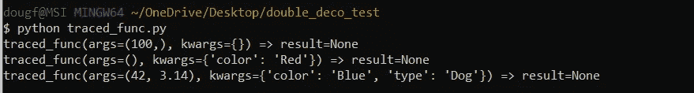
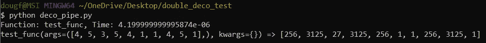

# 对装饰的深入探究

> 原文：<https://towardsdatascience.com/a-deeper-dive-into-decoration-ca4334ca5cf8?source=collection_archive---------45----------------------->

## 如何用 Python 编写灵活的、可重用的装饰器

作者:[爱德华·克鲁格](https://www.linkedin.com/in/edkrueger/)和[道格拉斯·富兰克林](https://www.linkedin.com/in/dougaf/)。

照片由澳门图片社在 Unsplash 上拍摄

# 介绍

我们首先介绍一些函数式编程概念的背景知识，并讨论计时和跟踪。

接下来，我们用两个例子来说明装饰模式及其语法，`tracefunc` 和`timefunc`。为此，我们使用 Python 库`functools`和`time`。

然后我们转到对`functools.wraps`的更深入的讨论，以及它如何保存被修饰函数的元数据。最后，我们用一些例子来说明这种保护。

## **为什么要跟踪和计时一个函数**

**跟踪**是在程序运行时记录函数的输入和输出。有经验的程序员使用跟踪来排除程序故障，通常作为调试器的替代品。这些程序员使用跟踪来识别生产中的问题，并使用跟踪来复制错误。对于正在学习语言的初学者来说，描摹也是极好的。

**计时**更直接。更快的功能是更好的功能。

> 时间就是金钱，朋友。—加斯洛维

为了用 Python 编写装饰函数，我们依赖于`functools` 和范围意识。我们来回顾一下范围和装饰。

## 装饰、关闭和范围

修饰是 Python 中的一种设计模式，允许您修改函数的行为。装饰器是一个函数，它接受一个函数并返回一个函数的修改副本。

当编写闭包和装饰器时，必须记住每个函数的作用域。函数在 Python 中定义范围。闭包可以访问返回它们的函数的范围；装饰者的范围。

有关这些概念的更多背景知识，请查看这篇 3 分钟的文章。

 [## Python 中的装饰器和闭包示例

### 如何使用装饰器增强函数的行为

towardsdatascience.com](/decorators-and-closures-by-example-in-python-382758321164) 

# 跟踪装饰者:@tracefunc

让我们用跟踪装饰器来说明`functools.wraps`的重要性。

tracer.py

Functools 在第 11 行变得很重要，在这里我们访问`func.__name__`来打印一个跟踪。如果我们没有在第 7 行传递`func`到`functools.wraps`，当我们使用多个装饰器时，这个 print 语句可能会返回错误的`func.__name__`。返回错误的元数据会导致跟踪器无效。

## functools.wraps 对装饰者的重要性

随着我们的代码变得越来越复杂，`functools.wraps`对于保持我们的装饰器按预期工作变得越来越重要。让我们更深入地了解一下这个工具。

装饰器`@functools.wraps`(见上面第 7 行)是一个方便的函数，用于在定义包装函数时调用`update_wrapper`作为函数装饰器。`update_wrapper`的目的是更新*包装器*功能，使其看起来像*包装的*功能。这就是我们如何通过装饰管道传递函数的元数据。

文档说得很好:

> 这个函数的主要用途是在[装饰器](https://docs.python.org/3/glossary.html#term-decorator)函数中，它包装被装饰的函数并返回包装器。如果包装函数没有更新，返回函数的元数据将反映包装定义，而不是原始函数定义，这通常没有什么帮助。
> — [Python 文档](https://docs.python.org/3/library/functools.html)

换句话说，如果不使用这个装饰器工厂，原始装饰函数的元数据将会丢失。这将使我们的`tracefunc`返回包装器的踪迹，而不是被修饰的函数。

彼得·海因西乌斯在 Unsplash 上的照片

## 这个装饰器的可重用性

注意`func`被作为第 4 行的参数。然后在第 8 行，我们通过`*args, **kwargs`，进入我们的闭包。这些`*args, **kwargs`用于计算第 10 行`func(*args, **kwargs)`的`result`。

再次使用 tracer.py 来保存滚动

`*args`和`**kwargs`的灵活性使得`tracefunc`几乎可以处理任何功能。我们闭包的 print 语句是为了访问函数的`__name__`、`args`、`kwargs`和`result`来为`func`创建一个**跟踪**。

在编写自己的装饰器时，请记住这种灵活性。

## 应用@tracefunc

这是我们的追踪器在一个函数上的应用。我们在我们希望修饰的函数定义上方应用带有@符号的装饰器。

这个例子很简单，但重点是`tracefunc`对任何函数都有效。

traced_func.py

我们看到`args` 和`kwargs` 在打印语句中各自的位置。函数的返回值跟随粗箭头；在这三种情况下，Python 的默认结果是“无”

`Output of func.__name__ ,*args, **kwargs => result`

该跟踪向我们显示了传递给函数的正确的函数名、args 和/或 kwargs，以及该函数的结果。将这个装饰器应用到一个函数中，可以让用户更清楚地看到函数执行时发生了什么。

现在让我们讨论一下我们的时序装饰器。

# 计时装饰:@timefunc

这个装饰器看起来和`tracefunc`非常相似，拥有相同的可重用/灵活的结构。注意`functool.wraps`的位置。同样，它也是我们闭包的装饰者。回想一下，这是保存我们的`func`的元数据，以便在我们的 print 语句中返回正确的名称。

timer.py

这个装饰器返回传递给`timefunc`的关于`func` 的信息。在第 13 行，`start` 启动计时。然后，第 14 行的`result` 存储`func(*args, **kwargs).`的值，在此之后，在 print 语句报告函数执行所花费的时间之前`time_elapsed`被计算。请注意，函数的结果被返回，但用户看不到。

## 应用@timefunc

我们再一次用`@`符号来应用这个装饰器。

用@timefunc 装饰函数

当在第 13 行调用 single_thread 时，我们看到了`func.__name__` 和它执行所用的时间。

timefunc 修饰的 single_thread 的输出

# 同时计时和追踪

假设您想要查看一个函数的轨迹和执行时间。现在我们有了两个写得很好的装修工，就好办了！

我们所要做的就是将两个装饰器都应用到正在讨论的函数中。

装饰 _ 管道. py

在计时器之前应用跟踪器可以确保我们不会将跟踪器的打印语句执行添加到我们正在记录的运行时中。

现在我们看到了这个函数的执行时间和轨迹。注意，在这种情况下，我们返回的是一个列表列表。这样的信息对于调试脚本是非常宝贵的！

deco_pipe.py 输出

我们还看到了运行时，它对于优化函数和选择最佳代码非常有用。

# 结论

我们已经深入了解了 decorators 以及如何用 Python 对它们进行编码。装饰者返回一个闭包。闭包是装饰器返回的东西。

我们使用`functools.wraps`通过装饰器的闭包来保存被装饰的`func`的元数据。从而允许我们在 decorators 的 print 语句中返回 func 的名称。这变得越来越重要，我们通过多个装饰器传递函数。

Timefunc 和 Tracefunc 有相似的代码模式，但用例不同。我们可以使用这些装饰器来分别或协同计时和跟踪函数。这些装饰器为我们提供了一个优雅的、可重用的模式来跟踪函数运行时和行为。