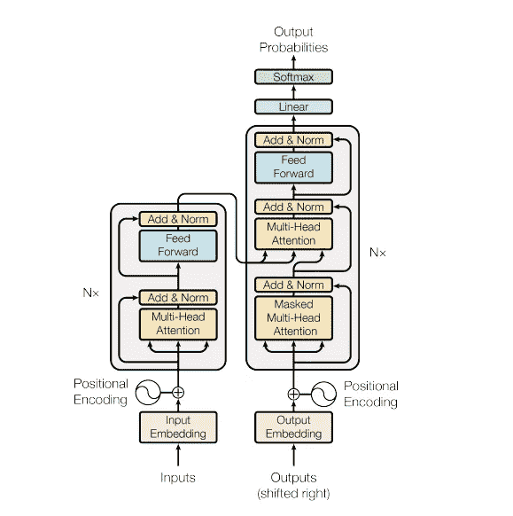
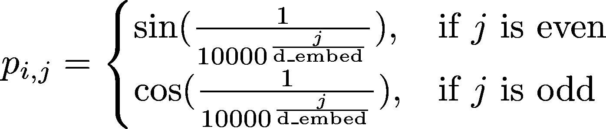
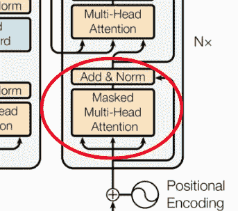
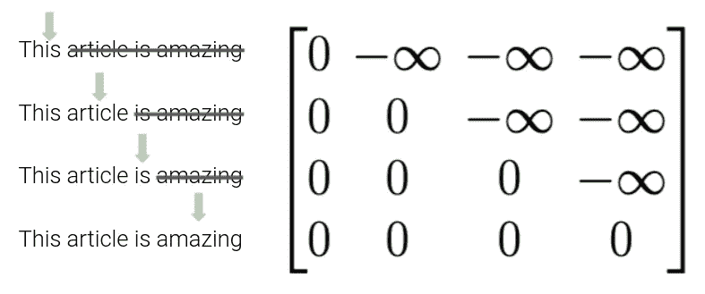
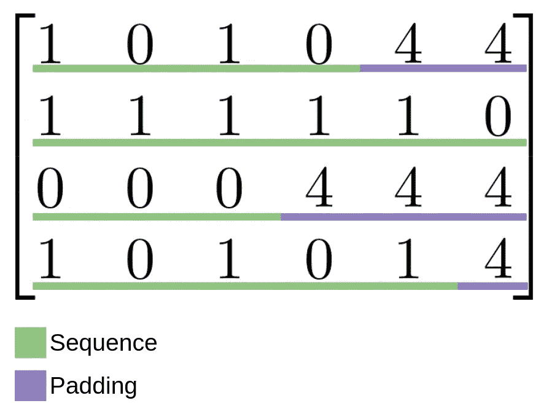
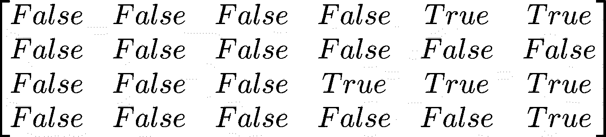
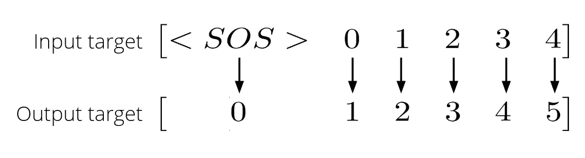
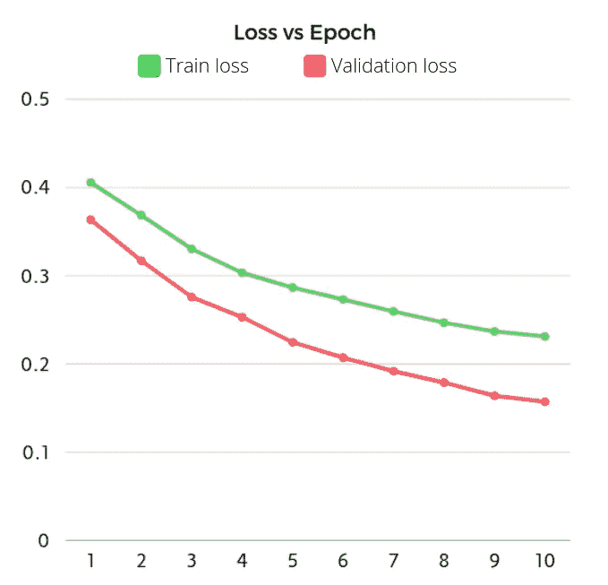

# PyTorch 神经网络详细指南。变压器()模块。

> 原文：<https://towardsdatascience.com/a-detailed-guide-to-pytorchs-nn-transformer-module-c80afbc9ffb1?source=collection_archive---------0----------------------->

## 一步一步的指导，以充分了解如何实施，培训，并推断创新的变压器模型。

我最近越来越多地涉足机器学习领域。当我在理解复杂问题或编写神经网络时遇到问题时，互联网似乎有所有的答案:从简单的线性回归到复杂的卷积网络。至少我是这么认为的…

一旦我开始在这种深度学习的事情上变得更好，我偶然发现了无与伦比的变形金刚。原论文:“[注意力是你所需要的全部](https://arxiv.org/abs/1706.03762)”，提出了一种构建神经网络的创新方法。不要再绕圈子了！本文提出了一种由重复的编码器和解码器块组成的编码器-解码器神经网络。其结构如下:



变压器结构:【https://arxiv.org/abs/1706.03762 

左边的模块是编码器，右边的模块是解码器。如果你还不理解这个模型的部分，我强烈推荐阅读哈佛的“[带注释的变形金刚](https://nlp.seas.harvard.edu/2018/04/03/attention.html)”指南，在那里他们从头开始用 PyTorch **编写变形金刚模型。在本教程中，我不会涉及像“多头注意力”或“前馈层”这样的重要概念，所以你应该在继续阅读之前了解它们。如果您已经从头开始看了一遍代码，您可能会想，您是否需要为您所做的每个项目到处复制粘贴这些代码。谢天谢地，**没有**。像 PyTorch 和 [Tensorflow](https://www.tensorflow.org/) 这样的现代 python 库已经通过导入包含了易于访问的 transformer 模型。然而，这不仅仅是导入模型并插入其中。今天我将解释如何使用和调整 PyTorch *nn。变压器()*模块。我个人努力寻找关于如何实施、培训和从中推断的信息，所以我决定为你们所有人创建我自己的指南。**

# 第一步

## 进口

首先，我们需要导入 PyTorch 和我们将要使用的其他一些库:

## 基本变压器结构

现在，让我们仔细看看变压器模块。我建议从阅读 PyTorch 的文档开始。正如他们解释的那样，没有强制参数。该模块带有“你所需要的只是注意力”模型超参数。为了使用它，让我们从创建一个简单的 PyTorch 模型开始。我将只更改一些默认参数，这样我们的模型就不会花费不必要的时间来训练。我将这些参数作为我们课程的一部分:

## 位置编码

变压器模块不关心输入序列的顺序。这当然是个问题。说“我吃了一个有菠萝的披萨”和说“一个菠萝吃了我的披萨”是不一样的。谢天谢地，我们有一个解决方案:位置编码。这是一种根据位置“赋予”元素重要性的方式。关于它如何工作的详细解释可以在[这里](https://kazemnejad.com/blog/transformer_architecture_positional_encoding/)找到，但是一个简单的解释是我们为每个元素创建一个向量，代表它相对于序列中每个其他元素的位置。位置编码遵循这个看起来非常复杂的公式，实际上，我们不需要理解它:



位置编码公式:作者图片

出于组织和可重用性的考虑，让我们为位置编码层创建一个单独的类(它看起来很难，但实际上只是公式、漏接和一个[剩余连接](/residual-blocks-building-blocks-of-resnet-fd90ca15d6ec)):

# 完成我们的模型

现在我们有了 PyTorch 中唯一没有包含的层，我们准备完成我们的模型。在添加位置编码之前，我们需要一个[嵌入层](https://pytorch.org/docs/stable/generated/torch.nn.Embedding.html)，以便我们序列中的每个元素都被转换成我们可以操作的向量(而不是固定的整数)。我们还需要一个最终的线性层，这样我们就可以将模型的输出转换成我们想要的输出尺寸。最终的模型应该是这样的:

我知道…这看起来很吓人，但是如果你理解每个部分的作用，这实际上是一个非常简单的实现模型。

## 刷新一些重要信息:目标掩蔽

您可能还记得模型结构中有一个特殊的模块，叫做“**屏蔽的**多头注意力”:



蒙面多头注意:[https://arxiv.org/abs/1706.03762](https://arxiv.org/abs/1706.03762)

那么…什么是掩蔽？在我向你解释之前，让我们快速概括一下，当我们把张量输入到模型中时，它们是怎么回事。首先，我们嵌入并编码(位置编码)我们的**源**张量。然后，我们的源张量被编码成一个难以理解的编码张量，我们将它与嵌入和编码的(位置上的)**目标**向量一起输入到我们的**解码器**。我们的模型要学习，不能只给它看整个目标张量！这会直接给他答案。

这个问题的解决方案是一个掩蔽张量。这个张量由大小(序列长度 x 序列长度)组成，因为对于序列中的每个元素，我们向模型多显示了一个元素。这个矩阵将被添加到我们的目标向量中，因此矩阵将在转换器可以访问元素的位置由零组成，在转换器不能访问元素的位置由负无穷大组成。有插图的解释可能对你更有帮助:



目标矢量蒙版:作者图片

## 刷新一些重要信息:填充遮罩

如果你不知道，张量是可以存储在 GPU 中的矩阵，因为它们是矩阵，所以所有维度都必须有相同大小的元素。当然，在处理 NLP 或不同大小的图像等任务时，这种情况不会发生。因此，我们使用所谓的**特殊令牌**。这些标记允许我们的模型知道句子的开始在哪里(< SOS >)，句子的结束在哪里(< EOS >)，以及哪些元素正好填充剩余的空间，以便我们的矩阵具有 sam 序列大小(< PAD >)。这些标记还必须转换成它们相应的整数 id(在我们的例子中，它们分别是 2、3 和 4)。填充序列看起来像这样:



填充一批序列:作者图像

为了告诉我们的模型这些标记应该是不相关的，我们使用一个二进制矩阵，其中填充标记所在的位置上有一个*真*值，填充标记不在的位置上有*假*:



填充遮罩:作者的图像

## 创建屏蔽方法

为了创建我们讨论过的两个屏蔽矩阵，我们需要扩展我们的 transformer 模型。如果你懂一点 NumPy，理解这些方法做什么是没有问题的。如果你看不懂，我推荐你打开一个 [Jupyter 笔记本](https://jupyter.org/)，一步一步去了解他们是做什么的。

完整的扩展模型如下所示(请注意 forward 方法的变化):

# 获取我们的数据

为了这个项目，我将创建一组假数据，我们可以用它来训练我们的模型。该数据将由如下序列组成:

*   1, 1, 1, 1, 1, 1, 1, 1 → 1, 1, 1, 1, 1, 1, 1, 1
*   0, 0, 0, 0, 0, 0, 0, 0 → 0, 0, 0, 0, 0, 0, 0, 0
*   1, 0, 1, 0, 1, 0, 1, 0 → 1, 0, 1, 0, 1, 0, 1, 0
*   0, 1, 0, 1, 0, 1, 0, 1 → 0, 1, 0, 1, 0, 1, 0, 1

如果您对数据创建部分不感兴趣，请随意跳到下一节。

我不想解释这些函数是做什么的，因为用基本的数字知识很容易理解它们。我将创建所有大小为 8 的句子，这样我就不需要填充，我将把它们随机组织成大小为 16 的批次:

# 培训和验证

## 培养

现在我们有了数据，可以开始训练我们的模型了。让我们从创建我们的模型、损失函数和优化器的实例开始。我们将使用[随机梯度下降优化器](https://pytorch.org/docs/stable/generated/torch.optim.SGD.html)、[交叉熵损失函数](https://pytorch.org/docs/stable/generated/torch.nn.CrossEntropyLoss.html)，以及 0.01 的学习率。我也将使用我的图形卡进行此培训，因为它需要的时间较少，但这不是必需的。

在继续之前，我们需要理解的一个重要概念是，我们作为输入给转换器的目标张量必须向右移动一(与目标输出张量相比)。换句话说，我们想要给模型用于训练的张量必须在开始时有一个额外的元素，在结束时少一个元素，并且我们用来计算损失函数的张量必须向另一个方向移动。这是因为如果我们在推理过程中给模型一个元素，它就会给我们下一个元素。



目标向量转换:作者图片

既然我们已经掌握了这个概念，让我们开始编码吧！训练循环是标准训练循环，除了:

*   目标张量在预测期间被传递给模型
*   生成目标掩码来隐藏接下来的单词
*   可能还会生成填充遮罩并将其传递给模型

## 确认

验证循环与我们的训练循环完全相同，只是我们不读取或更新梯度:

## 执行培训和验证

在本例中，我为模型训练了 10 个时期。为了简化训练，我创建了一个 fit 函数，它在每个时期调用训练和验证循环，并打印损失:

这会产生以下结果

```
Training and validating model
------------------------- Epoch 1 -------------------------
Training loss: 0.5878
Validation loss: 0.4172------------------------- Epoch 2 -------------------------
Training loss: 0.4384
Validation loss: 0.3981------------------------- Epoch 3 -------------------------
Training loss: 0.4155
Validation loss: 0.3852------------------------- Epoch 4 -------------------------
Training loss: 0.4003
Validation loss: 0.3700------------------------- Epoch 5 -------------------------
Training loss: 0.3842
Validation loss: 0.3443------------------------- Epoch 6 -------------------------
Training loss: 0.3592
Validation loss: 0.3069------------------------- Epoch 7 -------------------------
Training loss: 0.3291
Validation loss: 0.2652------------------------- Epoch 8 -------------------------
Training loss: 0.2956
Validation loss: 0.2195------------------------- Epoch 9 -------------------------
Training loss: 0.2684
Validation loss: 0.1947------------------------- Epoch 10 ------------------------- Training loss: 0.2501
Validation loss: 0.1930
```

# 结果

训练后，我们获得每个时期的以下损失:



训练结果:作者图片

# 推理

我们可以看到，我们的模型似乎学到了一些东西。是时候检查它是否存在了，但是…我们如何检查它呢？对于我们从未见过的数据，我们没有目标张量。这就是移动我们的输入目标和输出目标张量产生影响的地方。正如我们之前看到的，当给定一个元素时，我们的模型学会了预测下一个令牌。因此，我们应该能够给我们的模型输入张量和开始令牌，它应该给我们返回下一个元素。如果当模型预测一个令牌时，我们将它与我们以前的输入连接起来，我们应该能够慢慢地将单词添加到我们的输出中，直到我们的模型预测到<eos>令牌。</eos>

以下是该过程的代码:

运行这段代码的输出是:

```
Example 0
Input: [0, 0, 0, 0, 0, 0, 0, 0]
Continuation: [0, 0, 0, 0, 0, 0, 0, 0, 0]Example 1
Input: [1, 1, 1, 1, 1, 1, 1, 1]
Continuation: [1, 1, 1, 1, 1, 1, 1, 1, 1]Example 2
Input: [1, 0, 1, 0, 1, 0, 1, 0]
Continuation: [1, 0, 1, 0, 1, 0, 1, 0]Example 3
Input: [0, 1, 0, 1, 0, 1, 0, 1]
Continuation: [1, 0, 1, 0, 1, 0, 1, 0]Example 4
Input: [0, 1, 0, 1, 0, 1, 0, 1, 0, 1, 0]
Continuation: [0, 1, 0, 1, 0, 1, 0, 1, 0]Example 5
Input: [0, 1]
Continuation: [0, 1, 0, 1, 0, 1, 0]
```

所以这个模型确实得到了我们序列的要点，但是当它试图预测延续时仍然会犯一些错误。例如，在“示例 4”中，模型应该预测 1 作为第一个令牌，因为输入的结尾是 0。我们还可以看到，在推理过程中，我们的句子不需要有相同的长度，输出也不会有相同的长度(见“例 5”)。

# 结论

我相信这篇文章可以帮助许多初级/中级机器学习开发人员学习如何在 PyTorch 中使用 transformer 模型，并且，由于其他语言中的结构是相同的，所以这篇教程可能也对其他框架(如 Tensorflow)有用(希望如此)。

如果您有任何建议或发现任何错误，请随时留下评论，我会尽快修复它。

**全 Colab 笔记本:**[https://drive . Google . com/file/d/15 gy trsd-ou 6 yzvyjwis 48 ysrxfpecv 9 r/view？usp =共享](https://colab.research.google.com/drive/15gyTrsd-OU6YZVyjwis48ysrXFPEcv9r)

【https://danielmelchor.com】网站:

**联系人:**[dmh672@gmail.com](mailto:dmh672@gmail.com)