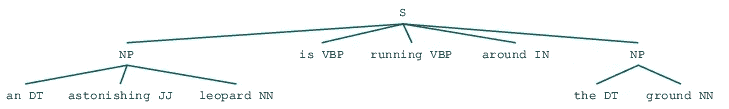
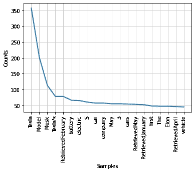

# 自然语言处理(NLP)的详细入门

> 原文：<https://towardsdatascience.com/a-detailed-novice-introduction-to-natural-language-processing-nlp-90b7be1b7e54?source=collection_archive---------20----------------------->

## [入门](https://towardsdatascience.com/tagged/getting-started)

## Python 中 NLP 入门的终极代码指南


由 [Joshua Hoehne](https://unsplash.com/@mrthetrain?utm_source=medium&utm_medium=referral) 在 [Unsplash](https://unsplash.com?utm_source=medium&utm_medium=referral) 上拍摄的照片

语言是我们使用的最重要的交流媒介。它包括地理和知识的界限。研究表明，处理自然口语或书面语在各种业务中是有用的，从搜索自动完成/自动纠正、翻译、社交媒体监控、定向广告到分析调查，以及总体上增加对外语的整体理解。在下面的故事中，我们将使用 NLP 实现两个不同的算法。在第一个算法中，我们将定义一组语法规则，并根据规则解析一个句子，在第二个算法中，我们将搜索一个网站，并找到它的内容。

自然语言处理(NLP)是人工智能(AI)中的一种方法，用于分析和构建能够以人类所说的语言(例如英语)运行的智能系统。当系统希望基于用户以文本或语音形式的输入工作，并且用户正在添加常规使用英语的输入时，需要对语言进行处理。

*   **自然语言理解(NLU)** :处理过程中的理解阶段负责将自然语言中给出的输入映射为有益的表示。它还分析了程序输入语言的不同方面。
*   **自然语言生成(NLG)** :处理的生成阶段用于从第一阶段创建自然语言。生成从文本规划开始，文本规划是从知识库中提取相关内容。接下来是句子规划阶段，在这个阶段，将组成句子的必要单词被选择出来。以文本实现结尾是句子结构的最终创造。

## **自然语言处理的挑战**

1.  **词汇歧义:**这是一般只在单词中出现的第一级歧义。例如，当一个代码被赋予一个像“board”这样的词时，它不知道是把它当作名词还是动词。这导致这段代码的处理不明确。
2.  语法级歧义:这是另一种类型的歧义，与机器如何感知它相比，它与短语的发音方式更有关系。例如，像这样的句子，“他用一顶蓝色的帽子升起了天窗”。这可能意味着两件事之一。要么他在蓝色帽子的帮助下升起一个天窗，要么他升起一个有红色帽子的天窗。
3.  **指称歧义:**使用代词的指称构成指称歧义。例如，两个女孩正在跑道上跑步。突然，她说，“我累坏了”。这个程序不可能解释两个女孩中谁累了。


自然语言处理|作者图片

# 构建自然语言处理器

在构建自然语言处理器时，总共有 5 个执行步骤:

1.  **词法分析:**NLP 算法对自然语言的处理从识别和分析输入单词的结构开始。这部分被称为词汇分析，词典代表一种语言中使用的各种单词和短语的选集。它是把一大块单词分成结构段落和句子。
2.  句法分析:一旦句子的结构形成，句法分析就检查形成的句子和短语的语法。它还形成单词之间的关系，并消除逻辑上不正确的句子。例如，英语语言分析器拒绝句子，“一把伞打开一个人”。
3.  **语义分析:**在语义分析过程中，现在检查输入文本的意义，即，它提取句子中存在的所有单词的精确字典，并随后检查每个单词和短语的意义。这是通过理解手头的任务并将其与语义分析器相关联来完成的。例如，像‘热冰’这样的短语被拒绝。
4.  **语篇整合:**语篇整合步骤形成句子的故事。每一个句子都应该与它的前一个和后一个句子有关系。这些关系受到语篇整合的制约。
5.  **语用分析:**一旦所有的语法和句法检查完成，现在检查句子在现实世界中的相关性。在语用分析过程中，每个句子都被再次回顾和评估，这一次是用一般知识检查它们在现实世界中的适用性。

# 标记化、词干化和词条化

## **标记化**

为了阅读和理解句子中的单词序列，标记化是将序列分成称为标记的更小单元的过程。这些标记可以是单词、数字，有时也可以是标点符号。标记化也称为分词。这是标记化工作原理的一个示例:

> 板球、棒球和曲棍球是主要以手为基础的运动。
> **标记化输出:**"板球"、"棒球"、"和"、"曲棍球"、"正"、"主要"、"手"、"基础"、"运动"

句子的结尾和开头被称为单词边界，这个过程是为了理解给定句子的单词边界。

*   **Sent_tokenize 包:**这是句子标记化，将输入转换成句子。这个包可以在 Jupyter 笔记本`from nltk.tokenize import sent_tokenize`中使用这个命令安装
*   **Word_tokenize 包:**类似于句子分词，这个包把输入的文本分成单词。这个软件包可以使用命令`from nltk.tokenize import word_tokenize`安装在 Jupyter 笔记本上
*   **wordpunctokenizer 包:**除了单词标记化之外，这个包还将标点符号作为标记。可以使用`from nltk.tokenize import WordPuncttokenizer`进行安装

## **词干**

当研究人类在对话中使用的自然语言时，由于语法原因会出现一些变化。例如，像 virtual、virtual 和 virtualization 这样的词在本质上意思相同，但在不同的句子中意思不同。为了让 NLTK 算法正确工作，它们必须理解这些变化。词干提取是一个启发性的过程，它理解单词的词根形式并帮助分析其含义。

*   **PorterStemmer 包:**这个包内置在 Python 中，使用 Porter 的算法计算词干。功能是这样的，一个输入单词“running”产生一个词干单词“run”。可以用这个命令`from nltk.stem.porter import PorterStemmer`将其安装到工作环境中
*   **LancasterStemmer 包:**Lancaster stemmer 的功能类似于波特的算法，但严格程度较低。它只是将单词的动词部分从其来源中删除。例如，单词“writing”在运行 Lancaster 算法后返回“writ”。可以用这个命令`from nltk.stem.lancaster import LancasterStemmer`将它导入到环境中
*   **SnowballStemmer 包:**这也与其他两个算法的工作方式相同，可以使用命令`from nltk.stem.snowball import SnowballStemmer`导入。这些算法具有可互换的用例，尽管它们在严格程度上有所不同。

## **词汇化**

向单词添加形态学细节有助于提取它们各自的基本形式。这个过程是使用词汇化来执行的。词汇和词法分析都会导致词汇化。这一程序旨在消除屈折词尾。得到的基本形式称为引理。

*   **WordNetLemmatizer 包:**wordnet 函数根据所呈现的单词是用作名词还是代词来提取单词的基本形式。可以用下面的语句`from nltk.stem import WordNetLemmatizer`导入这个包

# 数据分块的概念

顾名思义，分块就是将数据分成块的过程。它在自然语言处理领域非常重要。组块的主要功能是像名词短语一样对不同的词类和短词短语进行分类。一旦标记化完成并且输入被分成标记，分块为算法标记它们以便更好地理解它们。分块使用了两种方法，我们将在下面阅读:

*   **向上分块:**向上或向上分块就是缩小问题。在组块的过程中，句子变得抽象，输入的单个单词和短语被概括。例如，像这样的问题，“公共汽车的目的是什么？”分块后，将回答“运输”
*   **向下分块:**与向上分块相反，在向下分块的过程中，我们深入语言，物体变得更加具体。例如，一个像“什么是汽车？”将产生具体的细节，如颜色，形状，品牌，大小等。汽车柱子被砸倒的照片。

> **定义语法规则和实现组块:**在接下来的部分中，我们将在一个单词组块上实现英语语法规则。该过程将要求输出以弹出窗口的形式显示在屏幕上。* *如果您在 Jupyter Notebook 中本地运行代码，则不需要额外的步骤。*** * *但是为了在 Colab 中运行代码，我们需要在 Colab 本地环境中安装一个虚拟显示器。完成此操作的步骤如下所示。**

## * * *在 Google Colab 上构建虚拟显示引擎

为了将树显示为输出，我们的代码需要打开一个新的显示窗口。Tk，或`tkinter`通常会为你的界面创建 GUI(像一个新窗口)。但是 Colab 运行在云中的 web 服务器上。因此，它无法在运行它的本地计算机上打开新窗口。Colab 提供的唯一交互是通过网络笔记本界面。要显示我们需要显示分块代码的 NLTK 树，请在您的 Colab 环境中运行下面的代码。

```
### CREATE VIRTUAL DISPLAY #### Install X Virtual Frame Buffer
!apt-get install -y xvfb 
import os# create virtual display with size 1600x1200 and 16 bit color. Color can be changed to 24 or 8
os.system('Xvfb :1 -screen 0 1600x1200x16  &') # tell X clients to use our virtual DISPLAY :1.0.
os.environ['DISPLAY']=':1.0' ### INSTALL GHOSTSCRIPT (Required to display NLTK trees) ###
!apt install ghostscript python3-tk
```

*在这个例子中，我们将执行名词短语组块，这是组块的一个类别。在这里，我们预定义了程序将用来执行组块的语法概念。*

> NP 组块被定义为不包含其他 NP 组块，并且依赖于词性标注的大部分信息。

**名词短语分块:**在下面的代码中，我们将执行名词短语(NP)分块，其中我们搜索对应于单个名词短语的组块。为了创建一个 NP-chunker，我们将定义一个组块语法规则(如下面的代码所示)。该算法的流程如下:

> a.这条规则说，只要组块识别者找到一个可选的限定词(DT)，后跟任意数量的形容词(JJ)，然后是名词(NN)，就应该形成一个 NP 组块。我们在一个示例句子上使用这个语法来构建组块解析器，并以图形方式将输出显示为一棵树。

实现分块算法的代码|作者



NLTK 树|上面代码的输出|作者图片

# 主题建模和识别数据中的模式

文档和讨论通常总是围绕主题展开。每一次谈话的基础都是一个话题，讨论围绕着这个话题展开。为了让 NLP 理解和处理人类对话，它需要在给定的输入中导出讨论的主题。为了进行同样的计算，算法对输入运行模式匹配理论来确定主题。这个过程叫做主题建模。它用于发现需要处理的文档的隐藏主题/核心。主题建模用于以下场景:

*   **文本分类:**它可以改进文本数据的分类，因为建模将相似的单词、名词和动作组合在一起，而不是使用单个单词作为单一特征。
*   **推荐系统:**基于推荐的系统依赖于建立相似内容的基础。因此，主题建模算法可以通过从给定数据计算相似性矩阵来最好地利用推荐系统。



上述分类代码的输出。我们观察到，NLP 算法正确地将特斯拉确定为网络链接中谈论最多的话题。|作者图片

## 完整的代码库

对于上面执行的两个代码笔记本，包含所有输入和输出的完整代码都在下面链接的存储库中。我强烈建议任何阅读本文的人一起浏览代码，以便更好地理解上面讨论的概念。

<https://github.com/rjrahul24/ai-with-python-series/tree/main/08.%20Natural%20Language%20Processing>  

# 结论


戴维·巴洛在 [Unsplash](https://unsplash.com?utm_source=medium&utm_medium=referral) 上拍摄的照片

对语言及其与人类认知的联系的研究令人着迷。在本文和上面的代码中，我们执行了两个基本的语言处理任务——名词短语分块和文本分类。这些是最常用的 NLP 技术之一的基本实现。机器天生被设计成与数字打交道，而语言则完全相反，处理单词、短语、语法和许多无法直接教给机器的复杂结构。因此，NLP 是一个极其广阔的研究领域。本教程的目的是为进入这个多元宇宙提供一个起点。我建议您通过下面参考资料部分提到的链接来更好地掌握自然语言处理。

## 有趣的机器学习阅读

</implementing-an-end-to-end-machine-learning-workflow-with-azure-data-factory-f16cbeeffd94>  </logic-programming-and-the-design-of-humanistic-ai-using-python-6ddb7019caa2>  </the-ultimate-guide-to-functional-programming-for-big-data-1e57b0d225a3>  

## 关于我

我是一名数据工程师和人工智能研究员，目前在微软 Xbox game analytics 工作，我在日常工作中实现了类似的管道，以分析游戏收购、使用和健康情况。除了我的专业工作，我还在研究如何实施人工智能来平衡世界各地受多年来逐渐气候变化影响的地区的经济。请随时在 [Twitter](https://twitter.com/rjrahul24) 或 [LinkedIn](https://www.linkedin.com/in/rjrahul24/) 上与我联系，讨论、提问或合作项目。

## 参考

1.  [https://search enterprise ai . tech target . com/definition/natural-language-processing-NLP](https://searchenterpriseai.techtarget.com/definition/natural-language-processing-NLP)
2.  [https://www . analyticsvidhya . com/blog/2020/07/top-10-自然语言处理应用-nlp/](https://www.analyticsvidhya.com/blog/2020/07/top-10-applications-of-natural-language-processing-nlp/)
3.  [https://www . wonder flow . ai/blog/natural-language-processing-examples](https://www.wonderflow.ai/blog/natural-language-processing-examples)
4.  [https://www.quora.com/What-is-pragmatic-analysis-in-NLP](https://www.quora.com/What-is-pragmatic-analysis-in-NLP)
5.  [https://aclanthology.org/W17-5405.pdf](https://aclanthology.org/W17-5405.pdf)
6.  [https://www.oak-tree.tech/blog/data-science-nlp](https://www.oak-tree.tech/blog/data-science-nlp)
7.  [https://towards data science . com/natural-language-processing-NLP-for-machine-learning-d 44498845 d5b](/natural-language-processing-nlp-for-machine-learning-d44498845d5b)
8.  [https://www . geeks forgeeks . org/NLP-chunking-and-chinking-with-regex/](https://www.geeksforgeeks.org/nlp-chunking-and-chinking-with-regex/)
9.  [https://medium . com/grey atom/learning-pos-tagging-chunking-in-NLP-85 F7 f 811 A8 CB](https://medium.com/greyatom/learning-pos-tagging-chunking-in-nlp-85f7f811a8cb)
10.  [https://www . analyticssteps . com/blogs/what-are-recommendation-systems-machine-learning](https://www.analyticssteps.com/blogs/what-are-recommendation-systems-machine-learning)