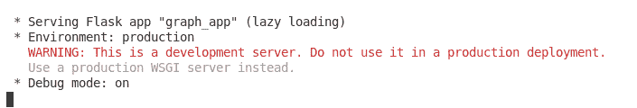
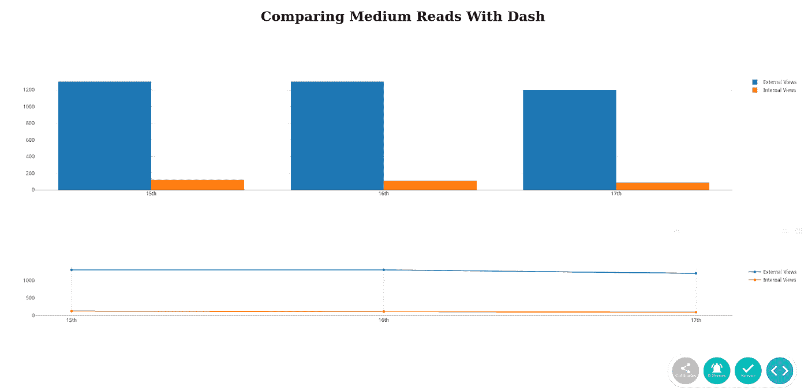

# 一头扎进 Dash

> 原文：<https://towardsdatascience.com/a-dive-into-dash-ed5561f11021?source=collection_archive---------38----------------------->

## 用于创建仪表板的 Python Web 框架


斯蒂芬·道森在 [Unsplash](https://unsplash.com?utm_source=medium&utm_medium=referral) 上拍摄的照片

在我的办公室工作中，有一些关于仪表板的讨论。通常，我们使用它们向业务用户表示数据，但是在新系统中，它被推到了次要位置。脑子里想着仪表盘，我想知道 Python 有什么，不是为了工作，而是为了个人使用。在谷歌上快速搜索后，我找到了一个名为“Dash”的 web 框架。因此，让我们来看看 Dash 是什么，安装它，然后运行一个简短的教程，或试运行，如何使用它。

# **什么是破折号？**

Dash 是一个 Python 开源 web 框架，用于构建数据的图形化表示。这些数据显示在浏览器中，然后可以通过 URL 共享。2017 年首次发布。Dash 是基于 Flask 的 web 服务器功能，但也可以用 React.js 创建一个更具交互性的网页，用 plotly.js 使用更多的图表选项。

Dash 用于数据科学，更具体地说，用于研究数据。虽然您可以使用 PowerPoint 或 Libre Office Impress 等工具，但 Dash 允许您通过纯 Python 创建基于数据的图表。Dash 也不需要广泛的 web 开发知识，因为它的 Flask 实现是初学者友好的，没有背景经验也可以学习。

创建图表时，Dash 有多种选项，例如简单的条形图或饼图，但也可能包括其他功能。其中一个功能是使用下拉菜单或范围来提供更多的自定义数据。在分析您的图表时，您可以在屏幕上显示多个，这将允许您以不同的格式查看数据。

对于 Dash 的介绍，我们不会对选项太感兴趣。我们将简单地创建两个基本图形，并且只使用破折号。这意味着我们还不需要 Plotly 来满足我们的需求。这也意味着除了基本的 Dash，我们不需要安装任何东西。现在我们已经对 Dash 有了更多的了解，让我们直接开始安装吧。

# **安装仪表板**

安装 Dash 相当简单。我们只需要一个命令就可以让它运行。如果您最近没有更新您的 pip 版本，请务必更新。

```
sudo pip3 install dash
```

对我来说，这就是我需要安装的全部。在一个教程中，我发现您可能还需要安装以下内容:

```
sudo pip3 install dash-html-components
sudo pip3 install dash-core-components
```

在您第一次安装 Dash 时，应该已经安装了额外的包。当我运行额外的安装时，我收到了尝试返回的“满足要求”消息。不过，包含这些内容总比抱歉好，以防某些东西没有正确安装或者任何版本过期。

# **使用破折号创建简单图形**

现在我们已经准备好开始编码了，我首先创建了一个名为 graph_app.py 的文件。对于 HTML 组件和核心组件，使用别名是为了以后更容易引用。

```
import dash
import dash_core_components as dcc
import dash_html_components as html
```

接下来，我们将使用 Dash 创建应用程序。这可以通过使用以下代码行来完成:

```
app = dash.Dash()
```

我们的下一个代码将关注于创建实际的图形。对于数据，我现在输入数据，而不是从文件中读取。这主要是为了学习。为了创建一个仪表板，我们使用一个包含图表的 Div 与 web 页面进行交互。

首先，我们创建一个 H1 标题，在页面上创建一个基本名称。您可以使用任何您喜欢的描述符。

接下来，我们将创建第一个图形，这将是一个条形图。在这个图中，我们将首先声明 ID。接下来，我们将声明图形部分。这部分将包含我们的数据。在数据中，我们还将声明我们的图形类型，即“条形图”。为了声明我们的图表，我们使用 dash 核心组件。

之后，我们将创建我们的第二个图形，这将是一个线图。对于这个图，我们需要将数据包含在一个字典中。这些数据本身将会出现在我们价值观的另一个字典中。然后，我们还将声明图形的大小。最后，我们将声明图的 id。完成后，我们可以关闭 Div。

最后，我们将在代码的 Flask 部分启动我们的应用程序。当我们将应用程序设置为运行服务器时，我还声明了主机位置，因为由于在服务器上运行代码，默认位置在我的机器上是不可访问的。如果在本地运行，可能不需要声明主机。

```
if __name__ == '__main__':
     app.run_server(debug=True, host="your_host_address")
```

现在，我们要做的就是运行代码。



本地运行的应用程序。

最后，我们只需导航到网页。



**结论**

Dash 是一个 Python Web 框架，用于可视化网页上的数据。它利用 Flask 来创建一个 web 服务器，使得只需很少的前端经验就可以轻松创建页面。可以使用这个库创建图表来研究和分析数据。它类似于来自 PowerPoint 或 Libre Office Impress 的图表，但是是用纯 Python 编写的。

Dash 从一开始就非常简单，理解相关的组件，比如在哪里输入值，或者在哪里设置图形类型，都是相当简单易懂的。也许下次您需要创建图表时，您可以考虑使用 Python 来可视化您的数据。我认为 Dash 可能是一个非常有用的工具，学习起来很有趣。虽然我们只坚持基本的，但 Dash 提供了各种其他选项。该项目可以从我们离开的地方扩展，所以我认为 Dash 可能是我将来会再次使用的工具。我现在唯一后悔的是还在大学时代就学会了一点短跑。利用 Python 比用 Excel 完成作业要有趣得多。希望你也发现 Dash 同样有趣。让我知道你的想法，并随意评论你用 Dash 构建的图表。下次见，干杯！

***用我的*** [***每周简讯***](https://crafty-leader-2062.ck.page/8f8bcfb181) ***免费阅读我的所有文章，谢谢！***

***想阅读介质上的所有文章？成为中等*** [***成员***](https://miketechgame.medium.com/membership) ***今天！***

查看我最近的文章:

[](https://python.plainenglish.io/getting-the-weather-with-python-dce8f20331fd) [## 使用 Python 获取天气信息

### 这么多可以选择…

python .平原英语. io](https://python.plainenglish.io/getting-the-weather-with-python-dce8f20331fd) [](/mysql-vs-postgresql-3d48891452a) [## MySQL vs PostgreSQL

towardsdatascience.com](/mysql-vs-postgresql-3d48891452a) [](https://medium.com/codex/graphql-vs-rest-c0e14c9f9f1) [## GraphQL 与 REST

medium.com](https://medium.com/codex/graphql-vs-rest-c0e14c9f9f1) [](https://python.plainenglish.io/build-your-own-plex-client-using-python-11cf2e566262) [## 使用 Python 构建您自己的 Plex 客户端

### Plex 是一个客户端-服务器媒体播放器，可用于流式视频、播放音乐、观看直播电视、收听播客…

python .平原英语. io](https://python.plainenglish.io/build-your-own-plex-client-using-python-11cf2e566262) [](/mysql-vs-sqlite-ba40997d88c5) [## MySQL 与 SQLite

### 作为改变，我决定回到数据库。不过这一次，我想做一个小小的比较…

towardsdatascience.com](/mysql-vs-sqlite-ba40997d88c5) 

参考资料:

[](https://dash.plotly.com/introduction) [## 简介| Dash for Python 文档| Plotly

### Dash 是一个用于构建 web 分析应用程序的高效 Python 框架。写在 Flask 上面，Plotly.js，还有…

dash.plotly.com](https://dash.plotly.com/introduction)  [## 第二部分。布局 Python 文档的破折号| Plotly

### Dash 应用程序由两部分组成。第一部分是应用程序的“布局”,它描述了应用程序…

dash.plotly.com](https://dash.plotly.com/layout) [](https://pypi.org/project/dash/) [## 破折号

### Dash 是下载量最大、最值得信赖的构建 ML 和数据科学 web 应用的 Python 框架。建立在…之上

pypi.org](https://pypi.org/project/dash/)  [## 仪表板核心部件

### Dash 为交互式用户界面配备了增压组件。一组核心组件，编写和…

dash.plotly.com](https://dash.plotly.com/dash-core-components) [](https://realpython.com/python-dash/) [## 用 Dash - Real Python 开发 Python 中的数据可视化接口

### 过去，创建分析性 web 应用程序是经验丰富的开发人员的任务，他们需要了解…

realpython.com](https://realpython.com/python-dash/)