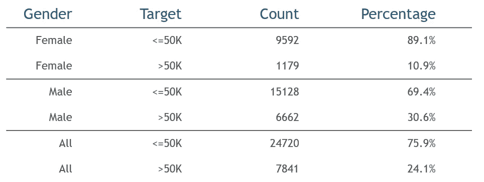
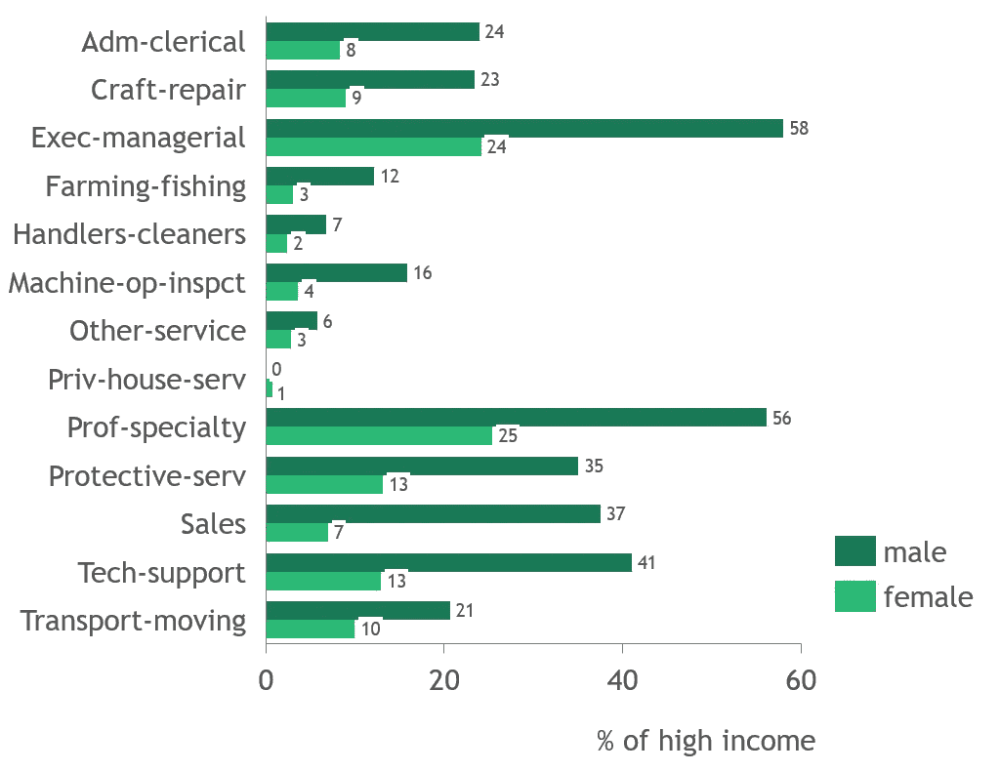
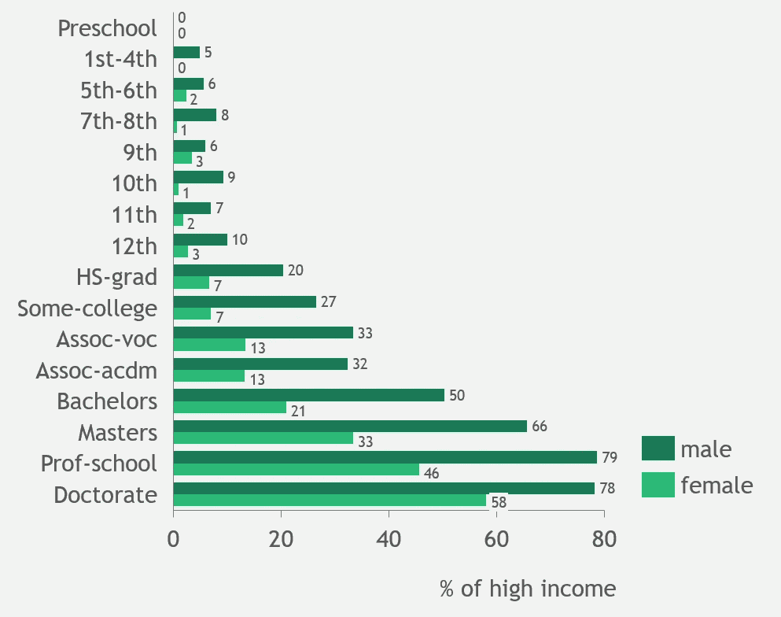
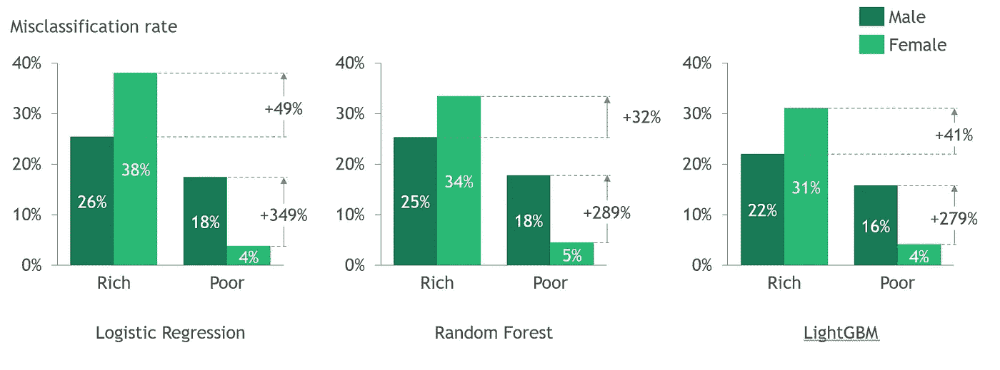
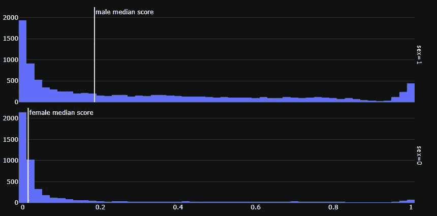
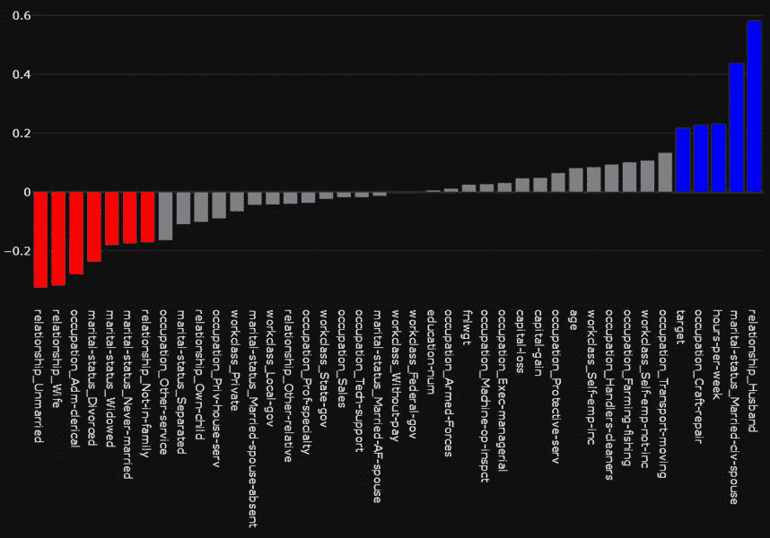
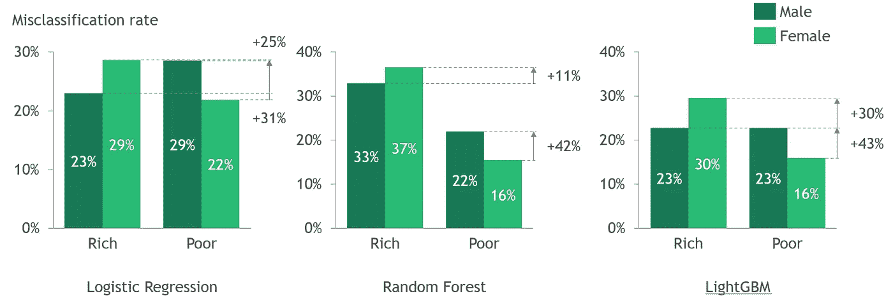
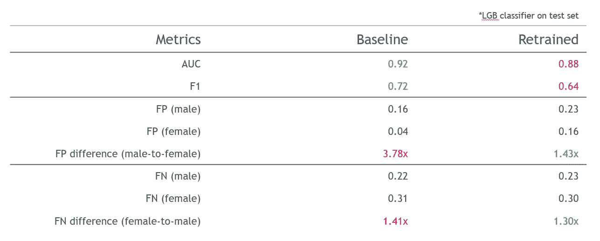

# ML 建模中的一个公平的世界，男人和女人应该得到同样的对待

> 原文：<https://towardsdatascience.com/a-fair-world-in-ml-modeling-where-men-and-women-should-be-treated-the-same-way-f7d3e78e83b1?source=collection_archive---------16----------------------->

## [公平和偏见](https://towardsdatascience.com/tagged/fairness-and-bias)

## 基于 UCL 成人数据的 ML 模型性别公平性研究

由 [Unsplash](https://unsplash.com?utm_source=medium&utm_medium=referral) 上的[地图框](https://unsplash.com/@mapbox?utm_source=medium&utm_medium=referral)拍摄

# 背景

不幸的是，我们生活的这个世界曾经被各种刻板印象和歧视所主宰——种族、性别、取向等等。只是在最近几十年，随着社会运动、教育和技术的进步，人们开始接受多样性并促进平等。然而，在很长一段时间里，这些无知的偏见严重冲击着人们生活的方方面面。

数据是真实世界的反映。我们从过去收集的信息不可避免地带有偏见或不公平。我们是数据科学家，我们从历史数据中训练机器学习/AI 模型。我们一直在努力工作，以确保我们的模型是“准确的”。但是隐含在数据中的偏见通常被 ML 模型所忽略和继承，这可能会造成负面的社会影响。

在本文中，我将使用 20 世纪 90 年代收集的 UCL 成人数据集来说明:

*   如何将公平定义为一种衡量标准
*   ML 模型是如何不公平的
*   如何通过简单的特征选择来提高模型的公平性

# 数据集

[UCL 成人数据集](https://archive.ics.uci.edu/ml/datasets/adult)是很多初学者熟悉二分类算法的经典数据集。该数据集是从 1994 年美国人口普查数据库中提取的。每行代表一个人。属性包括基本的人口统计变量，如年龄、性别、种族、职业、教育等。预测任务是确定一个人的年收入是否超过 5 万。数据集经过预处理，因此大部分都是干净的，只有少数值缺失。

在最近的许多研究中，本文用于 ML 公平性研究(例如 [this](https://arxiv.org/abs/2103.12715) )有两个充分的理由:

1.  它是在一个性别和种族平等没有得到适当解决的时代收集的
2.  它包含敏感变量，即反映数据中社会偏见的种族和性别

在这项研究中，我们将使用这个数据集来训练 ML 模型，并检查它们的公平性和准确性。

# 公平定义

那么，我们如何将公平性定义为一个数据科学指标呢？我们可以利用在[我们如何分析 COMPAS 累犯算法](https://www.propublica.org/article/how-we-analyzed-the-compas-recidivism-algorithm)中使用的定义，该论文由*杰夫·拉森、苏亚·马特、劳伦·基什内尔、*和*朱莉娅·安格温*在 2016 年撰写，研究 COMPAS 累犯算法中的种族偏见。在文章中，作者强调指出:

> 黑人被告经常被预测比他们实际上有更高的再犯风险。我们的分析发现，与白人被告相比，两年内没有再犯的黑人被告被错误归类为高风险的可能性几乎是白人被告的两倍(45%比 23%)。
> 
> 白人被告通常被认为比他们更不危险。我们的分析发现，在接下来的两年内再次犯罪的白人被告被错误地标记为低风险的几率几乎是黑人再次犯罪的两倍(48%对 28%)。

具体来说，比较黑人和白人被告的假阳性(FP)和假阴性(FN)率，以测试算法是否对任何种族有偏见。

在我们的上下文中，我们将比较男性和女性之间的 FP & FN 比率。这是一种直观的衡量方法，可以看出模型是否倾向于预测某一性别的高收入。

# 数据中的偏差

像任何数据科学项目一样，第一步总是执行探索性数据分析(EDA)来理解数据。

训练数据中有 32561 条记录，其中男性 21790 条，女性 10771 条。男性年收入超过 5 万英镑的可能性是女性的 3 倍(30.6%比 10.9%)。

作者图片

进一步按职业和性别细分数据，很明显，在同一职业中，男性比女性挣得多的可能性要大得多。

按作者分类的图片——按职业和性别分类的高收入百分比

同样学历的男性和女性之间也存在类似的收入差距。一个拥有学士学位的女性和一个拥有高等学位的男性一样有可能挣到 5 万多英镑。

按作者分类的图片——按教育和性别分类的高收入百分比

从上面的分布来看，数据集呈现出对女性的强烈负面偏见——无论职业或教育水平如何，她们往往挣得更少。如果没有任何干预，我们从数据集训练的模型也可能有很大的偏差。垃圾进，垃圾出。

# ML 实验和见解

实验的目标是:

*   测试模型公平性(男性和女性的 FP 和 FN 比率)
*   测试简单方法(如特征选择)对模型公平性的影响

## 预处理

数据集已经非常干净，因此除了删除缺少值的记录之外，不需要太多的数据清理。就特征而言，*教育、原籍国、*和*种族*被删除。 *Education* 有一个数字双射变量 *education-num。母国*和*种族*也是敏感变量。在这项研究中，他们被移除以关注性别偏见。

分类变量，即*工作类别*、*婚姻状况、职业*和*关系*是一次性编码的。由于数据集中男性样本较多，因此执行随机向下采样，以确保两种性别的记录数量相同。此外，创建单独的标准化数据集(标准标准化)来训练逻辑回归。

在上述预处理步骤之后，训练数据集包括 19，546 条记录。留下 20% (3，910)的记录作为评估数据集来确定模型阈值。一个独立的测试数据集包含 15，055 条记录。基于测试数据集上的模型性能报告最终结果。

## 基线模型

训练了三个 ML 模型——逻辑回归、随机森林分类器和 LightGBM 分类器。模型超参数保持为缺省值。这些训练好的模型在评估数据集上评分。达到最高 F1 分数的阈值将被选择并应用于测试结果。

## 调查的结果

不出所料，所有这些模型在测试数据集上的预测中都表现出对女性的强烈偏好。

*   女性经常被错误地预测为比她们实际上更穷。与男性相比，富裕女性被错误归类为低收入的可能性大约为 30%-40%*(男性对女性，LR: 26%对 38%，RF: 25%对 34%，LGB: 22%对 31%)
*   男性经常被错误地预测为比他们实际上更富有。贫穷男性比女性更有可能被错误归类为高收入人群(男性比女性，LR:18%比 4%，RF: 18%比 5%，LGB: 16%比 4%)

**计算方式([高%]—[低%])/[低%]。*

按作者分类的图像—所有基线模型的 FP(差误分类)和 FN(富误分类)率

偏差也反映在模型得分分布中。男性得分曲线明显更偏向右侧，得分中位数高得多。还值得一提的是，该模型对某些男性特别有信心，并给该群体打高分(右端的尖峰)。没有模特信任的这种女性群体。

按作者分类的图片— LGB 模型得分分布，男性 1 分

假设银行使用这个模型来评估贷款申请人的财务状况。你是一位申请贷款的女士，和另一位有相似教育背景和职业的男士一起。你的申请被拒绝了，但是这个人被接受了，因为模型给出了不同的预测。你会有什么感觉？数据科学家可能会认为该模型只是在学习历史模式。但是权力越大，责任越大。人工智能应用在世界各地产生了巨大的影响。当然，**我们希望 ML 模特界有一个公平的世界，男人和女人应该得到同样的对待**。这不会很难。

# 通过特征选择减轻不公平

这可能是最直观的解决方案——我们能移除那些导致模型偏差的特征吗？

在上面的案例研究中，我们不仅需要移除*性别*变量，还需要移除与*性别*密切相关的变量。快速检查的方法是通过皮尔逊相关。如下图所示。性别与*婚姻状态*和*关系下的一些一次性编码类别密切相关。*例如:

*   关系 _ 丈夫只适用于男性
*   关系 _ 妻子只适用于女性
*   婚姻状况-已婚-公民-配偶是指与平民配偶结婚。他们大多数是男性
*   婚姻状况 _ 已婚-未婚大多是女性

因此，我们可以简单地从数据集中删除三个变量，即*性别、婚姻状况、*和*关系*，以阻止性别相关信息流向 ML 模型。

按作者分类的图片—皮尔逊与性别相关(蓝色与男性相关)

在特征选择之后，让我们检查重新训练的模型的公平性。性别偏见明显减少！富误分类率差从约 30%-40%减少到约 10%-30%，贫分类率差从约 300%减少到约 30%-40%。

尽管有了巨大的进步，我们不得不承认这不是完美的解决方案，因为这个模型仍然偏向于男性富有。这可能是因为其他变量中嵌入了性别信息，例如*职业*。从上面的图表可以看出，某些职业，如技工或行政文员，也与性别相关。但是，在这种情况下，我们不能删除*职业*变量，因为它非常重要。

按作者分类的图片—所有重新训练模型的 FP(差误分类)和 FN(富误分类)比率

# 公平的模型是好模型吗？

您可能已经注意到了基线和重新训练模型之间的差异。男性和女性的新生力量比率相对一致。但是再培训模型的 FP 率要差得多，尤其是对低收入女性而言。经过再训练的模型更公平，只是因为它们对所有低收入人群做出了同样糟糕的预测。

在许多情况下，当变量被移除时，模型性能会恶化。以 LGB 模型为例，基线模型更准确，AUC 和 F1 更高。

按作者分类的图片— LGB 模型比较—基线和重新训练

严酷的事实是，额外的公平不是免费的。通常需要用较低的预测精度来补偿。我们不是生活在社会平等的最好时代，我们的过去甚至更糟。由于时代的特点，从“青铜时代”收集的数据很可能是有偏差的。一个完全精确的模型会记住过去的所有模式，包括那些歧视。任何干预都会迫使模型偏离最准确的配置。

那么…公平的模型是好模型吗？是的，它总是一个好模型。世界上有许多好东西，它们都是有价格的。我们追求环保，但我们不会关闭所有的工厂。我们希望多元化，但我们不允许任何人未经适当许可就进入这个国家。我们需要一个公平的模型，但我们不能完全放弃准确性。需要探索社会公正和模型可用性之间的中间点，以确保数据科学家在“不作恶”的同时“创造价值”。

# 结尾注释

文章中介绍的技术非常简单。过去几年出现了许多复杂而有效的算法——变量正则化、建模后调整、超参数优化……特征选择可能是所有技术中最琐碎的技术。

我写这篇关于特性选择的文章有两个原因:

1.  我刚刚开始这方面的研究，现在我还没有 100%的信心能很好地解释这些复杂的算法。
2.  更重要的是，我迫不及待地想向你们展示，通过使用这样一个简单的技术，我们已经可以在如此大的程度上促进公平。

刻板印象来源于无知。数据科学改变了世界。当我们继续这样做的时候，只需要一小步就能产生巨大的影响。为什么不这样做呢？