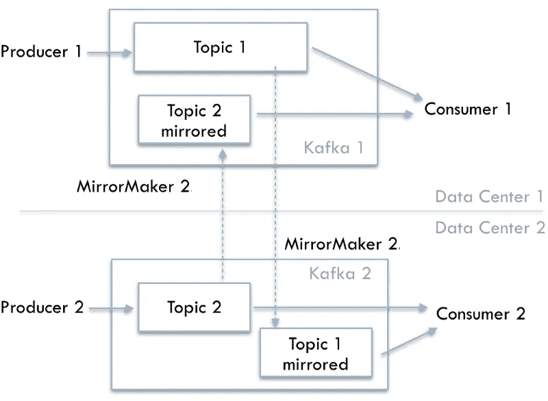

# 跨多个可扩展数据中心的容错 Kafka 复制工具

> 原文：<https://towardsdatascience.com/a-fault-tolerant-kafka-replication-tool-across-multiple-datacenters-that-scales-1a36a96764b1?source=collection_archive---------23----------------------->

## 为 Apache Kafka 引入新的跨数据中心复制工具

[图片](https://pixabay.com/illustrations/background-data-network-web-3228704/)由[Pixabay.com](http://Pixabay.com)上的[苏曼利](https://pixabay.com/users/sumanley-2265479/)提供

## 介绍

[Apache Kafka](https://kafka.apache.org/) 是*事实上的*数据流平台，用于高性能数据管道、流分析和关键任务应用。对于企业来说，随着业务的不断增长，许多场景将需要从一个 Kafka 实例发展到多个实例。例如，关键服务可以迁移并在专用实例上运行，以实现更好的性能和隔离，从而满足 [**服务级别协议**](https://en.wikipedia.org/wiki/Service-level_agreement) **或目标**。

另一个例子是**灾难恢复**(DR)——主数据中心中的实例被持续镜像到备份数据中心。当灾难发生在主实例中时，应用程序(或者称为“服务”)将快速故障切换到备份数据中心，并在最短的停机时间内继续运行。

最后但同样重要的是，当企业在多数据中心模式下运营时，数据首先被路由到地理位置**位置**附近的数据中心，然后被传输到远程数据中心的中央集群，称为“**聚合集群**，以获得数据的整体和完整视图。

上述任何一种场景都需要一种复制实时数据的工具，它有 5 个要求:(1)容错和水平扩展，(2)低延迟和高性能，(3)跨数据中心，(4)非常强的消息传递保证，(5)简单透明的故障转移和回切到应用程序。

## 产品调查

名为 [MirrorMaker](https://cwiki.apache.org/confluence/pages/viewpage.action?pageId=27846330) 的传统开源工具可以将数据从一个 Kafka 实例复制到另一个 Kafka 实例。但是，它有几个缺点，使得维护低延迟多数据中心部署和构建透明的故障转移和故障恢复计划非常困难，主要原因如下:

*   没有干净的机制在镜像的 Kafka 实例之间迁移生产者或消费者。来自两个实例的消费者补偿对彼此没有意义。
*   重新平衡会导致延迟峰值，这可能会触发进一步的重新平衡，因为它使用高级消费者 API。

来自优步的 uReplicator 解决了一些镜子制造商的问题。但是它使用 Apache Helix，这需要额外的领域知识和维护。

[合流复制器](https://www.confluent.io/confluent-replicator)应该是一个更好的解决方案，但它是一个专有的企业软件。

**我们想推广** [**MirrorMaker 2**](https://github.com/apache/kafka/tree/trunk/connect/mirror) (或者叫 **MM2** )，一个新的 Kafka 组件来替代遗留的 MirrorMaker。它满足了在 Kafka 实例之间跨数据中心复制数据的所有上述五个要求。

下面，我们将讨论 MM2 的三个主要实际使用案例:

## 迁移到新的 Kafka 实例

随着工作量的增加，以下风险最终会暴露在一个 Kafka 实例上:

*   Kafka 实例的任何动荡都会影响所有服务或应用程序
*   资源竞争:服务与共享资源竞争
*   不可预测的 SLO:一个服务可能会占用无限量的资源，导致其他服务无法满足 SLO 的需求
*   恢复和维护速度较慢:当数据量和工作负载较大时，Kafka 实例中重新平衡数据分区的速度会变慢。
*   没有“一刀切”:一套配置不能满足不同服务的“冲突”期望(稳定性高于性能，性能高于一致性)
*   Kafka 实例的任何维护(例如升级、节点交换)都需要与所有工程团队沟通

为了减轻上述风险:可以考虑在专用 Kafka 实例上运行关键服务。为了从一个 Kafka 实例迁移到另一个实例，AWS 为他们的托管 Kafka 提供了一个教程，可以推广到开源的 Apache Kafka。

  

## 灾难恢复

尽管 Kafka 实例中的数据在所有代理中都有 3 个副本，但当所有代理都位于同一区域时，整个实例仍然可能不可用，这可能会突然脱机，或者大多数代理由于一些机架停机而脱机。为了实现更高的可用性，设置一个备份 Kafka 实例并不断地从主实例复制到备份实例变得非常重要。当主服务器不可用时，所有服务都被路由到备份服务器。

最简单的方法是，当主服务器宕机时，不要让生产者向备份服务器发送新数据。更实际的情况是，生产者被重定向，并继续向备份生产新数据。当主实例从灾难中恢复且数据完好无损时，只有灾难期间生成的新数据需要通过 MM2 从备份镜像回主实例。

## 跨多个数据中心的主动-主动复制

在下面所示的主动-主动设计中，一个 MM2 实例将数据从起点 DC-1 拷贝到目标 DC-2，另一个 MM2 实例将数据从起点 DC-2 拷贝到目标 DC-1。

MirrorMaker 2 实现跨数据中心的主动-主动复制。作者图片

“生产者 1”在其本地 DC-1 中写入“主题 1”，而“生产者 2”在其本地 DC-2 中写入“主题 2”。

“消费者 1”可以从 DC-1 中的“生产者 1”产生的“主题 1”中读取数据，也可以从最初由 DC-2 中的“生产者 2”产生然后复制到 DC-1 的“主题 2 镜像”中读取数据。反之亦然。

在灾难导致 DC-1 失败的情况下，DC-2 中的“生产者 2”和“消费者 2”可以继续运行。如果 DC-1 的停机时间很短，并且“主题 1”生成的数据不太重要，则不一定需要主动将“生产者 1”故障转移到 DC-2，因为 DC-2 仍在运行。当 DC-1 恢复时，MM2 的两个实例将赶上并继续跨数据中心复制数据。

从应用的角度来看，主动-主动部署提高了**可用性**和**性能**，因为“消费者 1”和“消费者 2”几乎实时接收相同的数据(可能顺序不同)。一个数据中心完全故障不会影响另一个数据中心的数据消耗。

## 摘要

在接下来的几篇博客中，我们将介绍几个后续话题，包括:

*   [如何在 5 分钟内为概念验证设置 MM2](/spin-up-new-mirrormaker-in-5-minutes-a28c14bcde9f)
*   [跨数据中心的一次性消息传递保证](/exactly-once-semantics-across-multiple-kafka-instances-is-possible-20bf900c29cf)
*   [从现有镜像解决方案迁移到 MM2 的工具](/migration-tool-and-tips-of-kafka-cross-cluster-replication-mirrormaker-7e0157eecf19)
*   更多…

更多文章敬请关注！