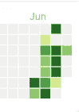
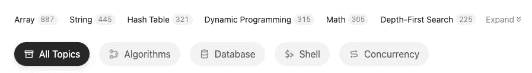

# 关于编码面试问题——数组的几点注记

> 原文：<https://towardsdatascience.com/a-few-notes-on-coding-interview-problems-array-63bb370c0241?source=collection_archive---------11----------------------->

## 我从每天的阅读中逐渐了解到。

照片由 [Matteo Di Iorio](https://unsplash.com/@shootbyteo?utm_source=medium&utm_medium=referral) 在 [Unsplash](https://unsplash.com?utm_source=medium&utm_medium=referral) 上拍摄

# 遵守他们的规则。

编码挑战是软件工程、数据工程甚至数据科学中技术面试的基础。我在市场上见过或经历过的几乎所有工作面试都要求你通过几项编码挑战，以证明你有足够的**解决问题的技能。**

当然，对于编码挑战是否是评估你专业技能的合适工具有很多争论。然而，这仍然是一个你需要熟悉和掌握的标准，以便在技术领域找到你梦想的工作。

我在编码面试准备过程中遇到的一个问题是，题目很大。你有机会在编码面试中面对任何情况，就看你的运气了。例如，主题可以是遍历复杂数据结构或动态编程的基本数组。

我发现很难掌握和理解这个问题，因为对于一些特定的问题，它需要你有计算机科学的先验知识，这样你才能以它应该的方式解决问题。

比如，你可能会想出一个幼稚的常识性解决问题。您彻底地编写并仔细地测试了代码，并通过了所有的测试用例。你终于觉得，至少我在没有太多提示帮助的情况下解决了问题。

但是在提交解决方案后，他们会向您抛出一个时间限制超过阈值的错误。之后一切都落地了，你需要开始思考更好的解决方案。

# 熟能生巧。

萨姆·穆卡达姆在 [Unsplash](https://unsplash.com?utm_source=medium&utm_medium=referral) 上拍摄的照片

尽管我上面提到了一个悲惨的例子，幸运的是，许多平台可以帮助你完成这个旅程。有几种类型的平台与此相关。

首先，用于公司招聘流程的平台。它们提供了一个工具来监控和评估基于特定编码问题的候选人。公司可以对候选人进行比较和排名，从成千上万的申请中选择几个有价值的候选人进行现场面试。因此，这是一个你需要提高流程的地方，这样你才有机会进入招聘流程的下一步。

其次，该平台为应聘者提供了一个练习编码面试技巧的社区或场所——如 [Leetcode](https://leetcode.com/) 、 [HackerRank](https://www.hackerrank.com/) 等网站。所以你可以开始评估你的技能，从最简单的问题到我认为我无法在面试时限内解决的最难的问题。尽管如此，在实际面试之前知道并熟悉这个问题还是有好处的。

# 我已经做了什么。

照片由[奥拉夫·阿伦斯·罗特内](https://unsplash.com/@olav_ahrens?utm_source=medium&utm_medium=referral)在 [Unsplash](https://unsplash.com?utm_source=medium&utm_medium=referral) 拍摄

最近一直在做一个日常 Leetcode。如果可能的话，我试着一天完成五道题(简单水平)。我的策略是从易到难解决问题，并根据接受率对问题序列进行排序。录取率越高，应该越容易。

我的 Leetcode 热图—从 6 月开始作者截图

我开始在**数组**问题上做 Leetcode，因为它在类别部分有最多的问题。此外，在我看来，与其他主题相比，数组问题不需要太多的先验知识。当你学习任何一门编程语言时，你总会把数组或列表数据结构作为一种原始数据结构来面对。

基于作者问题类别截图的问题数量

关于上图中的所有数组问题，在主类别中仍然有各种子类别。因此，要全面了解数组问题并不容易。你通过的问题越多，你获得的经验就越多。这很简单。

# 我们到了。

Todd Quackenbush 在 [Unsplash](https://unsplash.com?utm_source=medium&utm_medium=referral) 上拍摄的照片

听到看到很多评论说解决编码面试只靠你的**常识**。我解决不了问题怎么办？是不是说明我常识不够？

简单的回答是**不**然而，我相信我们可以练习和发展我们的常识。

> 当你解决问题或学习别人的解决方法时。你增强了你的常识。

这就像你在工具箱里放了更多合适的工具，当你面对一个新问题时，你可以挑选或组合一个合适的工具(概念、技术、思想、方法)来解决当前的问题。

以我的拙见，我认为如果你以前从未有过这方面的经验，第一次想出一个创新的解决方案并不容易。不过，等你的工具箱里有了足够的工具之后，事情就好办了。

这就是为什么我写这篇文章来帮助你们节省时间来复习 Leetcode 中的问题和优雅的解决方案。**我试着收集我认为有助于解决数组问题的东西。**另外，我可以用这篇文章作为参考，在将来回顾这些技术。

**免责声明:**以下提示基于我的看法。所有代码片段都来自 Leetcode 问题的讨论环节。所以，未必是解决问题的最好办法。

## 遍历各列

有了数组操作的基本知识，我们就可以沿着输入数组一直走下去。然后，无论维度有多大，我们都可以基于索引访问值。

我的开始方法是通过固定列号遍历列，并遍历每一行以获得列中的目标元素。但是当我看到这个片段的时候，我被其中的`zip(*a)`部分惊呆了。

这是 python 中遍历列的一种简单而有效的方法。为了给你更多的解释，`*a`是将每一行提取到三个列表中。之后，将三个列表传递给`zip`函数，将每个索引中的元素映射在一起。

比如用`*a`，会得到三个单独的列表`[1,2,3]` `[4,5,6]` `[7,8,9]`。然后传递给`zip` 函数，它将相同索引中的元素映射在一起。这里从`zip`得到的第一个元素(`0th index`)将是(`0th index`)索引`(1,4,7)`中的所有元素。

想申请吗？— [矩阵中的幸运数字](https://leetcode.com/problems/lucky-numbers-in-a-matrix/)

## 旋转阵列

使用上面类似的概念，现在您可以用一行代码将数组旋转 90 度。让我在下面的代码片段中向您解释一下这是怎么回事。

面对这个问题时，我遍历了数组的边界，并根据数组的长度移动了元素。它在工作，但它不是那么容易被人读懂的代码。此外，与下面的代码片段相比，它包含许多行。

你可以看到这里的主要概念是`zip(*a[::-1])`组件。除了这里有一个`[::-1]`部分之外，它与前面的代码几乎相同。`[::-1]`部分通常表示 python 中的反向数组操作。

给定`a = [1,2,3]`，可以用`a[::-1]`反推，结果`[3,2,1]`。

合并两个操作

1.  从下到上反转 2D 阵列。
2.  交换 2D 数组的行和列。

仅此而已。假设没那么直观。让我一步一步来阐述。

1.  首先，你反转 2D 阵列。所以，你得到了`[[7,8,9], [4,5,6], [1,2,3]]`
2.  现在，你可以看到第一列的顺序是我们将矩阵旋转 90 度后所期望的。那么如何得到那个元素列表而不是当前的呢？—遍历列。
3.  使用`zip(*a)`将数组分成`[7,8,9]` `[4,5,6]` `[1,2,3]`，然后将每个索引映射在一起。所以你得到`(7,4,1)` `(8,5,2)` `(9,6,3)`。
4.  维奥拉，你已经得到你想要的结果了。

这里有一个例子，说明你是如何结合之前学过的知识来解决更复杂的运算的。

想申请吗？— [确定是否可以通过旋转得到矩阵](https://leetcode.com/problems/determine-whether-matrix-can-be-obtained-by-rotation/)

## 利用位运算

对于这个问题，还是挺直白的。你可以把这个问题分成几个步骤。首先，你可以找到每个单词中每个字符的出现频率。然后，你只需要找到共同性格的交集。所以一步一步解决也没那么难。

然而，当我找到 Lee215 建议的解决方案时。这个解决方案如此优雅，以至于我自己都想不出来。他使用了`&=`位运算来更新常用字符的交集。好像他很了解`Counter`对象的深度细节。此外，这个方法对默认的`dict`对象不起作用。

此外，collections 库是 python 附带的标准库。所以我认为学习如何使用它是很好的，这样可以缩短你在编码面试环节的时间。

重要的是，你要知道`Counter`对象是怎么做出来的，以防面试官对规则非常严格，要求你解释幕后的步骤。

这是一个很棒的解决方案，扩展了我的知识边界。这是解决问题的一个新鲜和创新的方法。我很高兴能学到一些新东西。还有，如果我以前没见过，我也不会用这种方法解决问题。

现在，我有了另一种更新`Counter`交集的方法。此外，如果使用按位 OR 操作符，它可以是具有相同概念的`Counter`操作的并集。有机会将该技术应用于其他情况。

想申请吗？— [找共性](https://leetcode.com/problems/find-common-characters/)。

## 按多个关键字排序

排序是一个基本的操作，你可以在 python 中用`sorted`或`list.sort()`来完成。区别在于一个是就地操作，而另一个不是。

然而，我对它还不够了解，有时我需要艰难地进行分类。例如，我可以循环并比较每个元素是否满足我的条件，并将正确的元素放在正确的位置。

在这里，我学到了一些新的东西，我可以用多个键对值进行排序。该键可以是值本身，也可以是基于其他对象的值。

在下面的代码中，我先用数字的频率(`freq[x]`)对数组进行排序，然后如果有相等的一对数字。我用一个`-x`语句再次按降序排序。

它很简短，当你回来回顾代码时，它非常直观。

想申请吗？— [相对排序数组](https://leetcode.com/problems/relative-sort-array/)，[按递增频率排序数组](https://leetcode.com/problems/sort-array-by-increasing-frequency/)

# 最后的想法

本杰明·戴维斯在 [Unsplash](https://unsplash.com?utm_source=medium&utm_medium=referral) 上拍摄的照片

解决一个问题有很多方法。这取决于你对你正在处理的工具或问题了解多少。

为了开发一个更好更快的解决方案，你必须掌握你所使用的编程语言以及数据结构和算法概念。如果你只知道想法，但不能将其转录成代码，那么它在编码面试中是没有用的。

此外，假设你既有如何解决问题的想法，又有将其转化为代码的能力，但如果你在时间限制和压力下做不到，这也是毫无意义的。

要通过所有这些障碍，你需要有足够的经验来同时意识到和回忆解决问题的正确方法。在这里除了一遍又一遍的练习，什么也帮不了你。

你可能会在编码面试的第 10 次或第 100 次被拒绝。请不要难过，早点放弃。坚持下去，总有一天你会得到你梦想的。

## 帕泰鲁什·西达

***如果你喜欢这篇文章，并希望看到更多这样的东西。***

*   跟着我上[媒体](http://padpathairush.medium.com)
*   其他渠道？ [LinkedIn](https://www.linkedin.com/in/pathairush-seeda-b7a62ab6/) ， [Twitter](https://twitter.com/data_products) ，以及[脸书](https://www.facebook.com/DataProds-106431271287292/)